# Maven私服

## 什么是私服

**Maven 私服是一种特殊的远程仓库，它是架设在局域网内的仓库服务**，用来代理位于外部的远程仓库（中央仓库、其他远程公共仓库）。一些无法从外部仓库下载到的构件，也能从本地上传到私服供其他人使用。

Maven 私服其实并不是 Maven 的核心概念，它仅仅是一种衍生出来的特殊的仓库，但这并不代表它不重要，相反由于私服具有降低中央仓库负荷、节省外网带宽、以及提高项目稳定性等优点，使得私服在实际开发过程中得到了相当普遍地使用。建立了 Maven 私服后，当局域网内的用户需要某个构件时，会先请求本地仓库，若本地仓库不存在所需构件，则请求 Maven 私服，将所需构件下载到本地仓库，若私服中不存在所需构件，再去请求外部的远程仓库，将所需构件下载并缓存到 Maven 私服，若外部远程仓库不存在所需构件，则 Maven 直接报错。

## Maven仓库管理器Nexus

### 什么是Nexus

Nexus 是 Sonatype（中央仓库实际的维护方） 公司发布的一款仓库（Repository）管理软件，常用来搭建 Maven 私服，所以也有人将 Nexus 称为“Maven仓库管理器”。 Sonatype Nexus 是当前最流行，使用最广泛的 Maven 仓库管理器。Nexus 分为开源版和专业版，开源版足以满足大部分 Maven 用户的需求。

### Nexus仓库的类型

Nexus默认内置了许多仓库，这些仓库被分为三大类，每种类型的仓库用于存放特定的`jar`包：

1. 代理仓库（proxy）：缓存下载过的依赖，避免重复从外网拉取。例如Nexus中内置的`maven-central`库就是一个代理仓库，从远程中央仓库中下载的`jar`包会被缓存到`maven-central`这个代理仓库中。
    
2. 宿主仓库（hosted）：存储本地构建的私有构件，如公司内部开发的 Jar 包。对于宿主仓库来说，包含多个子分类，例如：
    
    1. Release：存放稳定版本（如Nexus内置的`maven-releases`仓库），一旦发布到`Release`类型的仓库，同一个版本的构件**不允许重复部署或覆盖**。
        
    2. Snapshot：存放快照版本（如Nexus内置的`maven-snapshots`仓库），发布到`Snapshot`类型的仓库的构件**可以被多次覆盖**。
        
3. 仓库组（group）：将多个仓库合并为一个逻辑入口，简化客户端配置。例如Nexus中内置的`maven-public`仓库，主要是为了简化配置，这么多仓库不需要都配置，只需要配置一个仓库组就行了。
    

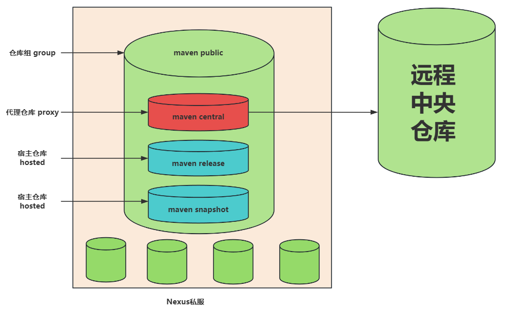

### 仓库为什么要分类

分类的目的是 **明确职责，优化管理**：

- **隔离环境**：区分快照（Snapshot）和正式版（Release），避免混淆。
- **权限控制**：可以为不同仓库设置不同的读写权限（如开发人员可上传 Snapshot，但只有管理员能发布 Release）。
- **性能优化**：代理仓库可以缓存热门依赖，而宿主仓库专注于私有构件。
- **简化客户端配置**：通过仓库组统一暴露仓库，客户端无需关心底层细节。

### 安装Nexus

#### 下载Nexus

下载地址：[https://help.sonatype.com/en/download.html](https://help.sonatype.com/en/download.html)

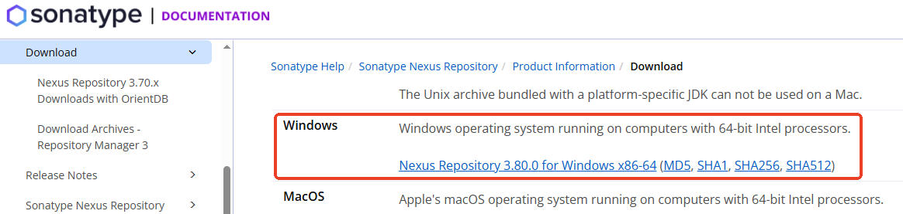

#### 解压安装Nexus

下载后解压到一个没有中文的路径下：

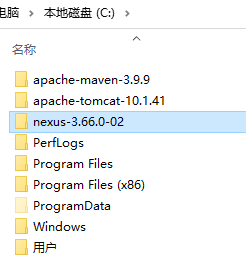

#### 启动Nexus服务

进入`C:\nexus-3.66.0-02\bin`目录下：

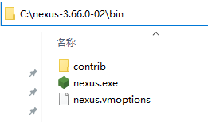

以管理员身份打开cmd窗口，并且`cd`到`bin`目录下，输入命令：`nexus /run`，需要等待一段时间，直到出现 `Started Sonatype Nexus OSS 3.66.0-02` 说明启动成功。

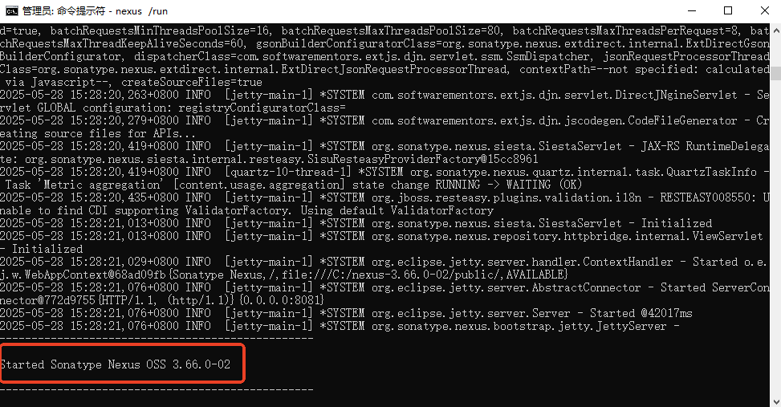

并且会生成一个比较重要的`work`目录，如下：

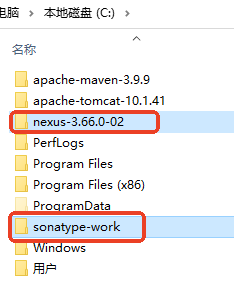

#### 访问Nexus

访问地址：[http://localhost:8081](http://localhost:8081)

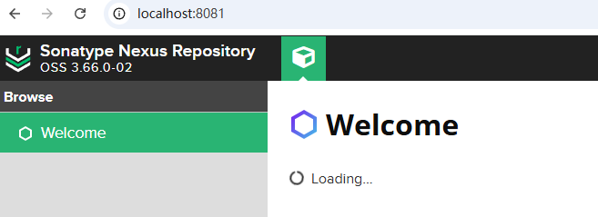

端口可以修改，在这个文件中：

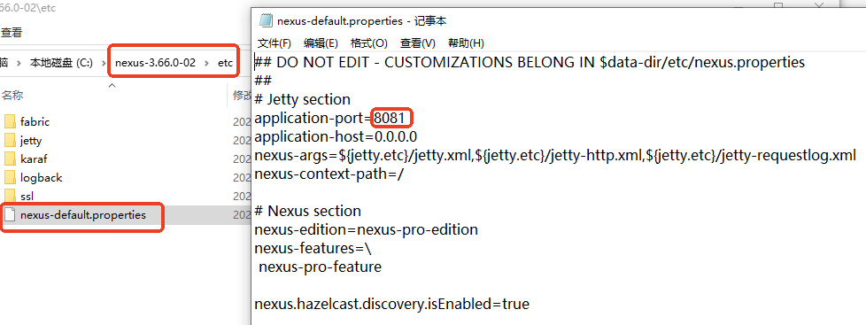

## Nexus私服的应用

### 登录

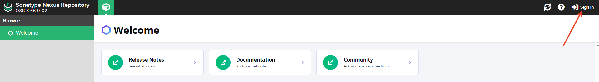

用户名是：`admin`，密码在这个文件中：

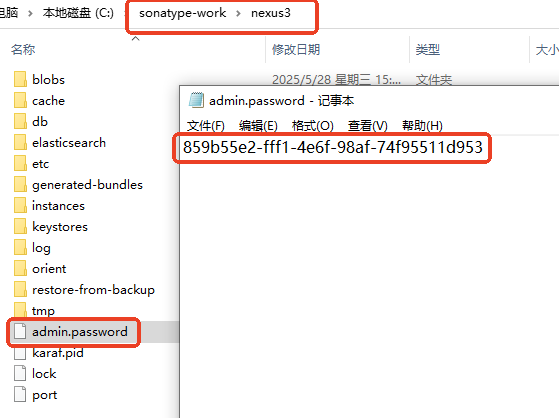

登录：

第一次登录成功后会提示你修改密码：

登录成功后的界面：

### 浏览仓库

### 设置仓库

#### 创建仓库

#### 创建代理仓库

阿里云 Maven 镜像：`https://maven.aliyun.com/repository/central`

#### 创建宿主仓库：Release

#### 创建宿主仓库：Snapshot

#### 创建仓库组

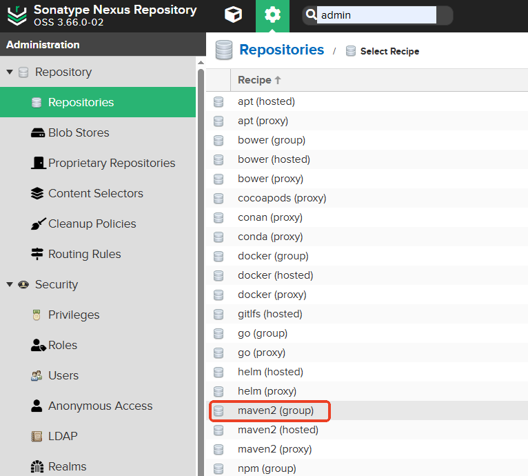

这一步非常重要，将创建的仓库放到一个仓库组当中：

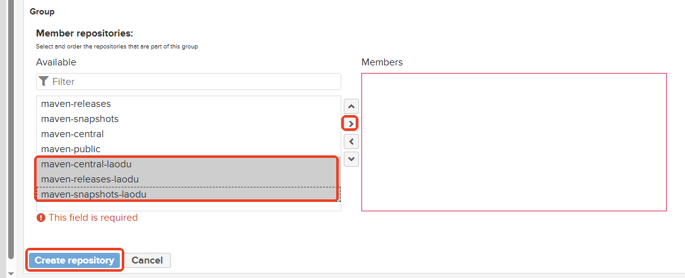

最后所有创建的仓库如下：

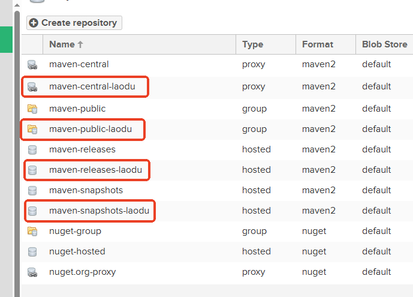

### 使用Nexus下载jar包

#### 设置Maven本地仓库地址

修改`MAVEN_HOME/conf/settings.xml`文件：

<localRepository>D:\repository-nexus</localRepository>

#### 设置`<mirror>`标签

<mirror>  
  <id>nexus-jkweilai</id>  
  <mirrorOf>central</mirrorOf>  
  <name>nexusjkweilai</name>  
  <url>http://localhost:8081/repository/maven-public-jkweilai/</url>  
</mirror>

url从这里获取：

#### 设置Nexus的用户名和密码

找到 `settings.xml`文件的 `servers`标签，添加以下配置：

<server>  
  <id>nexus-jkweilai</id>  
  <username>admin</username>  
  <password>admin</password>  
</server>

注意：`<id>`必须和`<mirror>`中的`<id>`保持一致。

#### 确定IDEA中Maven指向的本地仓库地址

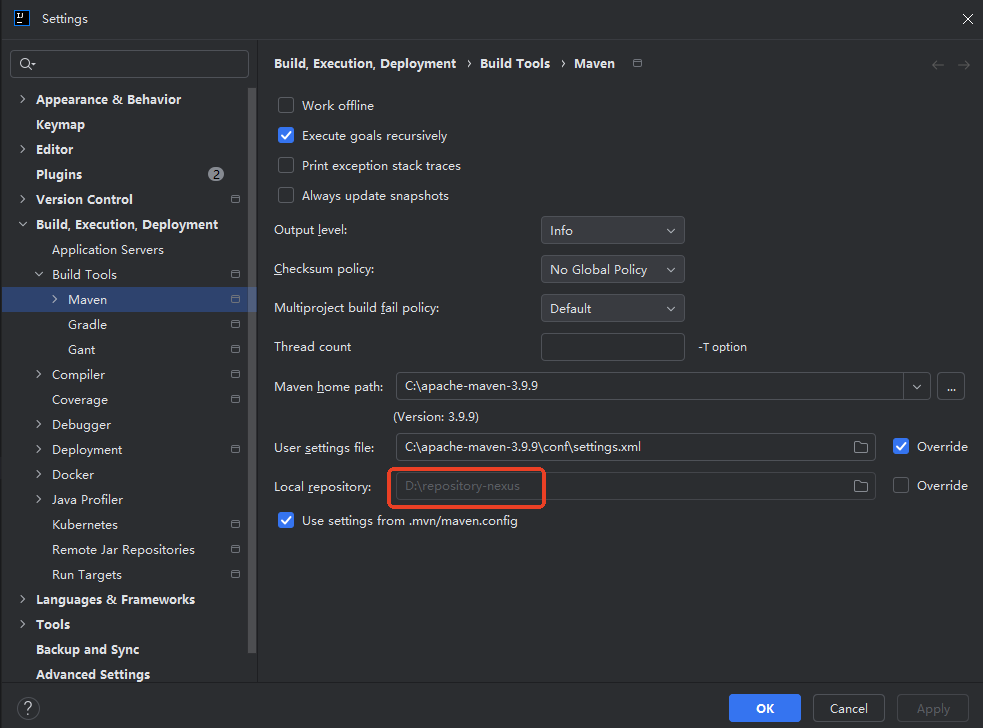

#### 随意运行一个Maven项目的`clean`

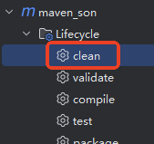

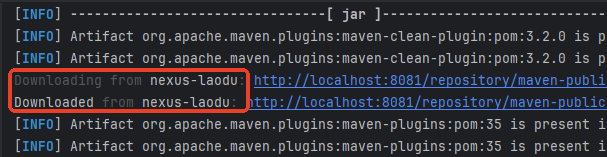

#### 观察本地仓库

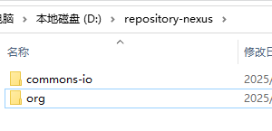

#### 观察私服上的`maven-public-jkweilai`

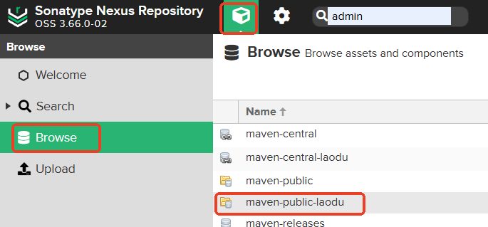

### 使用IDEA部署jar包到Nexus私服

私服Nexus是部署在局域网的，是全公司共享的仓库地址，每个团队都可以将已完成的功能或测试版本发布到私服供别人来使用。

#### 设置部署路径

打开要部署的项目的pom.xml文件，设置上传路径

<distributionManagement>  
    <repository>  
        <id>nexus-jkweilai</id>  
        <url>http://localhost:8081/repository/maven-releases-jkweilai/</url>  
    </repository>  
    <snapshotRepository>  
        <id>nexus-jkweilai</id>  
        <url>http://localhost:8081/repository/maven-snapshots-jkweilai/</url>  
    </snapshotRepository>  
</distributionManagement>

url从这里拿：

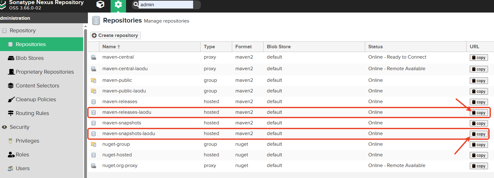

#### 运行deploy部署命令

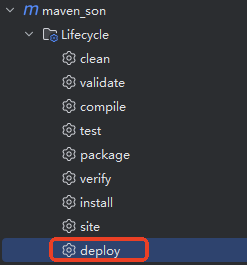

#### 观察私服对应仓库变化

- release项目部署
    

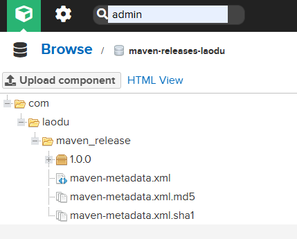

- snapshot项目部署
    

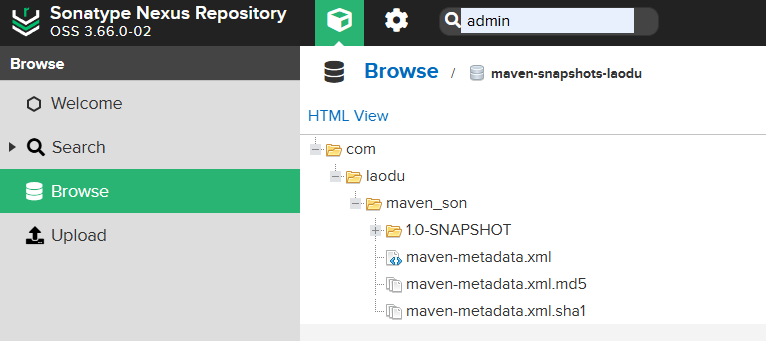