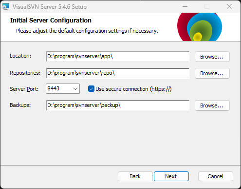
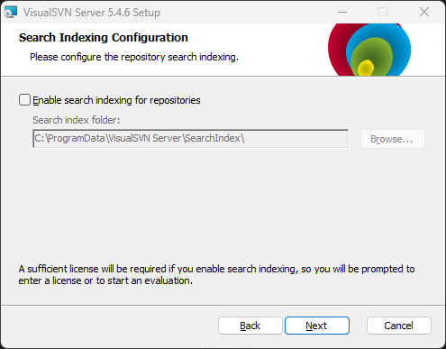
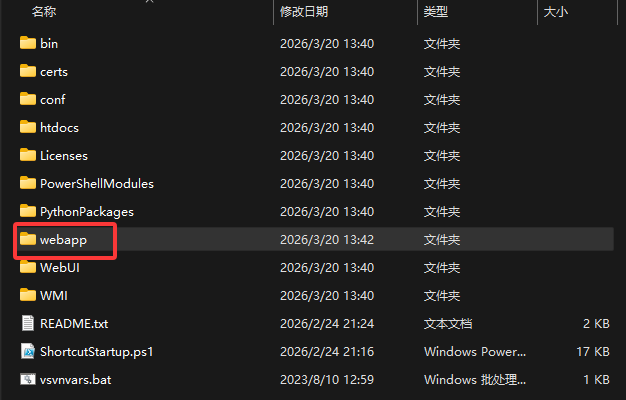
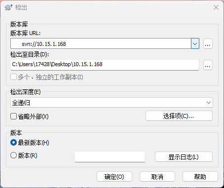
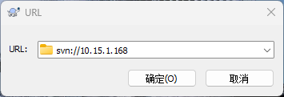

# SVN 简介
---
## 简介
1. 是什么：SCM（软件配置管理，对源代码继续管理）
2. 竞品：CVS（元老级产品）、VSS（入门级产品 windows产品）、ClearCase（已经被IBM收购）
3. SVN：SubVersion，公司集中化管理，支持版本回退，跨平台。
4. 服务器：VisualSVN Server
5. 客户端：tortoisesvn
6. 官网文档：<https://svnbook.red-bean.com/>
---
## 服务器配置
端口注意不要用443，因为会和ssh装上，所以推荐8443

对于社区版本，不要勾选这个

安装好后，在软件安装路径创建webapp/shop

然后去powershell执行创建仓库命令：` svnadmin create D:\program\svnserver\app\webapp\shop`就是在这个shop目录下初始化仓库。
```powershell
PS D:\program\svnserver\app\webapp\shop> ls
    目录: D:\program\svnserver\app\webapp\shop
Mode                 LastWriteTime         Length Name
----                 -------------         ------ ----
d-----         2026/3/20     13:43                conf
d-----         2026/3/20     13:43                db
d-----         2026/3/20     13:43                hooks
d-----         2026/3/20     13:43                locks
-ar---         2026/3/20     13:43              2 format
-a----         2026/3/20     13:43            251 README.txt
```
接下来进行服务器监管（通过http://ip地址 找到某目录下的文件）
```powershell
svnserve -d -r D:\program\svnserver\app\webapp\shop
```
* `-d`代表后台运行
* `-r`代表路径
接下来使用`svn://localhost`就可以看到这个shop仓库

svn默认不支持匿名用户连接，所有用户必须要指定。

下边把所有用户变成可以写的权限，修改仓库下的conF下的配置文件：`D:\program\svnserver\app\webapp\shop\conf\svnserve.conf`
19行变成
```txt
anon-access = read
auth-access = write
password-db = passwd
authz-db = authz
```
`D:\program\svnserver\app\webapp\shop\conf\passwd`新建一个用户，设置好账号密码
```txt
charles = 123456
```
`D:\program\svnserver\app\webapp\shop\conf\authz`后边设置用户的权限
```txt
[/]
* = r
charles = rw
```
---
## 客户端设置
1. 安装tortoisesvn有两个要安装的，`TortoiseSVN-1.9.2.26806-x64-svn-1.9.2.msi`软件本身和`LanguagePack_1.9.2.26806-x64-zh_CN.msi`汉化安装包
2. 在任何目录上右键，就会有svn相关的选项了。（svn checkout和tortoisesvn）
3. 客户端第一次连接要用checkout，检出仓库。输入服务器地址，比如
	
4. 检出会下载文件，如果要仅查看某个路径下有什么，可以右键，然后去tortoisesvn->版本库浏览器
	