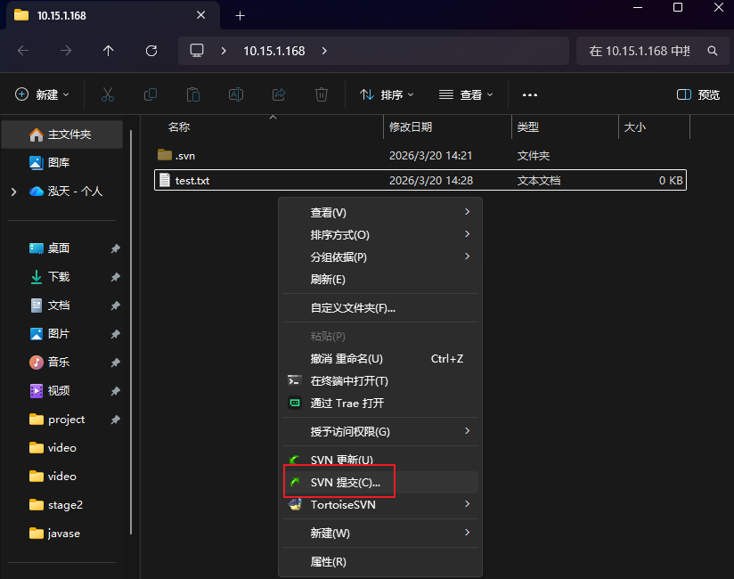
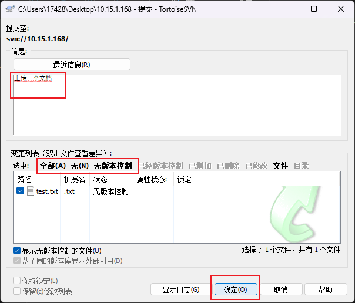
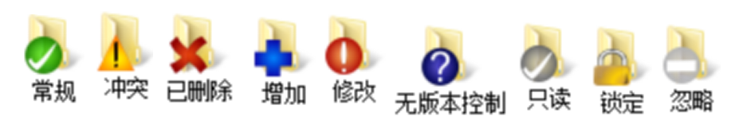
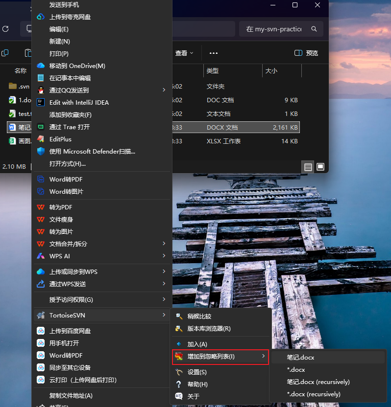
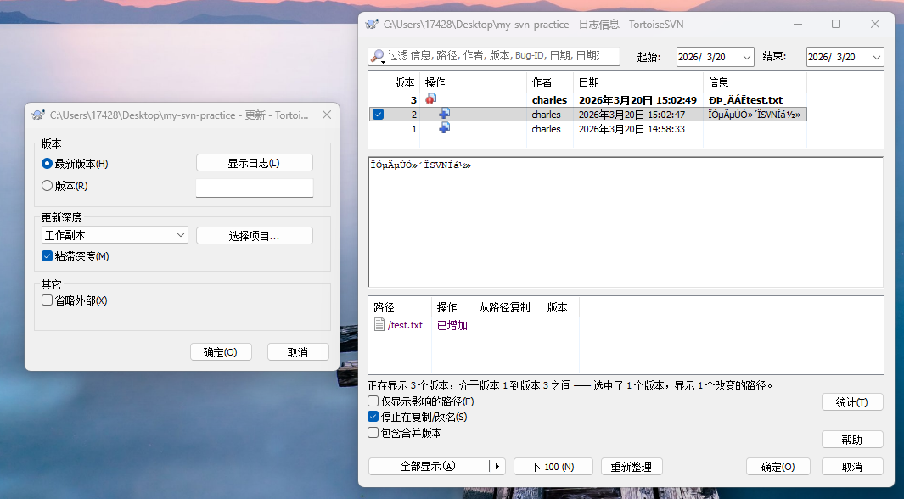

# SVN 使用
---
## 三大指令

1. checkout：在某一个文件夹下，右键选择checkout可以下载一个工程。详见[introduction](introduction.md)
2. commit：在某个文件夹下的项目修改了需要提交上去，右键选择SVN提交
	
	]
3. update：就是把服务器的更新拉下来。

以上三个命令可以在右键菜单找到。
下边是各种使用powershell操作的记录，很类似git，要先add进去才能commit。gui版本就是选择内容commit，这其实包含了add操作。
```powershell
# 1. 检出到新目录
svn checkout svn://10.15.1.168 ./my-svn-practice

# 2. 进入目录
cd ./my-svn-practice

# 3. 创建测试文件
echo "Hello SVN" > test.txt

# 4. 添加到版本控制
svn add test.txt

# 5. 提交
svn commit -m "我的第一次SVN提交"

# 6. 修改文件
echo "修改内容" >> test.txt

# 7. 查看状态
svn status

# 8. 再次提交
svn commit -m "修改了test.txt"
```

---
## 图标



- 常规图标：当客户端文件与服务器端文件完全同步
- 冲突图标：当客户端提交的文件与服务器端数据有冲突
- 删除图标：当服务端数据已删除
- 增加图标：文件已添加到提交队列
- 无版本控制图标：文件没有添加到上传队列
- 修改图标：客户端文件有修改但未提交
- 只读图标：客户端文件以只读形式存在
- 锁定图标：服务端数据已锁定
- 忽略图标：客户端文件已忽略，不需要进行提交上传

---
## 忽略

要选中某一个文件，然后找到忽略


---
## 版本回退

在空白处鼠标右键，进入“更新至版本”


经过尝试。比如第一版有1.txt，第二版新增2.txt。第三版增加了3.txt但是还没提交。现在回退到第一版，2.txt就没了，刚创建的3.txt并不会被删除。

---
## 权限控制
* 权限控制：authz文件是授权文件，passwd文件是认证文件。刚才svnserve.conf的下边两行就是开启两个文件的方法。具体方法不赘述了。
	```txt
	password-db = passwd
	authz-db = authz
	```
* passwd文件详解
	```txt
	[aliases]
	# 用户别名（可选），方便管理
	alice = alice_has_a_long_long_name
	[groups]
	
	# 用户组定义
	# 语法：组名 = 用户1,用户2,用户3...
	backend = alice,bob
	frontend = charlie,diana
	qa = eve,frank
	managers = grace,henry
	all = @backend,@frontend,@qa,@managers # 组嵌套
	
	[/] # 仓库根目录权限
	# 权限语法：用户名或组名 = 权限
	# 语法：[路径]
	# 路径可以是：
	# [/] - 仓库根目录
	# [/trunk] - trunk目录
	# [/branches/feature-1] - 具体分支
	# [/tags/v1.0] - 具体标签
	
	# ========================
	# 实战案例
	# ========================
	
	# 案例1：管理员有完全访问权
	@managers = rw
	
	# 案例2：所有开发者可以读写主开发分支
	[/trunk]
	@backend = rw
	@frontend = rw
	- = r # 其他人只读
	
	# 案例3：前端专属目录
	[/trunk/src/frontend]
	@frontend = rw
	@backend = r
	- = # 其他人无权限
	
	# 案例4：后端专属目录
	[/trunk/src/backend]
	@backend = rw
	@frontend = r
	- = # 其他人无权限
	
	# 案例5：数据库脚本只有后端DBA可修改
	[/trunk/database]
	bob = rw # bob是DBA
	@backend = r
	- = # 其他人无权限
	
	# 案例6：测试目录
	[/trunk/test]
	@qa = rw # QA团队读写
	@backend = rw # 开发可读写
	@frontend = r
	- = # 其他人无权限
	
	# 案例7：公共文档目录
	[/trunk/docs]
	@all = rw # 所有人都可读写
	- = r # 外部人员只读
	
	# 案例8：配置文件目录（敏感）
	[/trunk/config]
	@managers = rw
	@backend = r
	- = # 其他人无权限
	
	# 案例9：个人功能分支
	[/branches/feature-login]
	charlie = rw # 创建者有完全权限
	@frontend = rw # 前端团队可协助
	@backend = r
	- = # 其他人无权限
	
	# 案例10：发布标签目录
	[/tags]
	@backend = rw
	@frontend = rw
	@qa = rw
	- = r # 所有人都可读标签
	
	# 案例11：隐藏的管理目录
	[/admin]
	@managers = rw
	- = # 其他人完全不可见
	
	# 案例12：资源文件目录
	[/trunk/assets]
	@frontend = rw
	@backend = r
	@qa = r
	- = r # 所有人可读资源
	
	# 案例13：依赖库目录
	[/trunk/vendor]
	@backend = rw
	@frontend = r
	- = # 其他人无权限
	
	# 语法：用户或组 = 权限
	# 权限类型：
	# r - 读取（read）
	# w - 写入（write）
	# rw - 读写（read/write）
	# 空 - 无权限
	# =* - 继承父目录权限（较少用）
	# 示例：
	alice = rw # 用户 alice 有读写权限
	@backend = rw # backend 组有读写权限
	@qa = r # qa 组只有读权限
	- = r # 所有人有读权限
	- = # 所有人都无权限（默认）
	
	# ========================
	# 重要提醒
	# ========================
	# 1. 权限从上到下匹配，先匹配的生效
	# 2. 具体路径的权限会覆盖父路径权限
	# 3. 用户权限会覆盖组权限
	# 4. 默认情况下，没有明确权限的用户会被拒绝访问
	# 5. 使用 * = 作为路径的默认拒绝规则
	# 6. 保存后需要重启 svnserve 服务生效
	```


---
## 其他内容

* 本版冲突：冲突问题，选择update。本地会多一些文件。比如test.txt.r8。这个rn就是第n个版本。你需要手动去修改冲突的文件。
* 配置多仓库：配置多个仓库时，如果监管多个文件夹：可以通过监管WebApp总目录来达到监管所有目录的效果。然后checkout的时候可以去带上子目录，比如：`svn checkout svn://10.15.1.168/shop`
* 配置自启动服务，比如创建系统服务，服务名SVNService。打开后的服务可以在**控制面板->所有控制面板项->管理工具->服务**里边找到
	```powershell
	sc create SVNService binpath= "D:\subversion\bin\svnserve.exe --service -r D:/svnroot" start= auto
	#sc create 服务名称 binpath=空格"svnserve.exe –service –r D:/svn/WebApp" start=空格auto
	```
* 接下来创建批处理文件，去自动运行服务的管理
	```powershell
	net start 服务名称 # 启动服务
	net stop 服务名称 # 停止服务
	sc delete 服务名称 # 删除服务
	```

---
## 钩子程序

所谓钩子就是与一些版本库事件触发的程序，例如新修订版本的创建，或是未版本化属性的修改。
默认情况下，钩子的子目录(版本仓库/hooks/)中包含各种版本库钩子模板。
```powershell
PS D:\program\svnserver\app\webapp\shop\hooks> pwd

Path
----
D:\program\svnserver\app\webapp\shop\hooks

PS D:\program\svnserver\app\webapp\shop\hooks> ls

    目录: D:\program\svnserver\app\webapp\shop\hooks

Mode                 LastWriteTime         Length Name
----                 -------------         ------ ----
-a----         2026/3/20     13:43           2651 post-commit.tmpl
-a----         2026/3/20     13:43           2780 post-lock.tmpl
-a----         2026/3/20     13:43           3008 post-revprop-change.tmpl
-a----         2026/3/20     13:43           2609 post-unlock.tmpl
-a----         2026/3/20     13:43           4051 pre-commit.tmpl
-a----         2026/3/20     13:43           3690 pre-lock.tmpl
-a----         2026/3/20     13:43           3516 pre-revprop-change.tmpl
-a----         2026/3/20     13:43           3370 pre-unlock.tmpl
-a----         2026/3/20     13:43           3763 start-commit.tmpl
```

如何为服务器创建一个，客户端有人commit，服务器就能自动预览的脚本呢。
在同级目录创建`post-commit.bat`，指定svn可执行文件路径，指定要同步到的地方，并且写好update指令。
```powershell
SET SVN="D:\program\svnserver\app\bin\svn.exe"
SET DIR="D:\program\svnserver\shop_auto"
%SVN% update %DIR%
```
请注意，等号左右两边不能有空格！！另外SVN和DIR都需要百分号包围！！

---
## BAE云引擎
1. 什么是BAE云引擎：百度应用引擎（BAE）是百度推出的网络应用开发平台。基于BAE架构，使开发者不需要维护任何服务器，只需要简单的上传应用程序，就可以为用户提供服务。开发者可以基于BAE平台进行PHP、Java、Python、Nodejs应用的开发、编译、发布、调试。
2. 如何使用BAE云引擎。BAE地址：<http://bce.baidu.com>
3. 简单的调研了一下，感觉不是很好用，这个平台感觉像被百度废弃了。。
