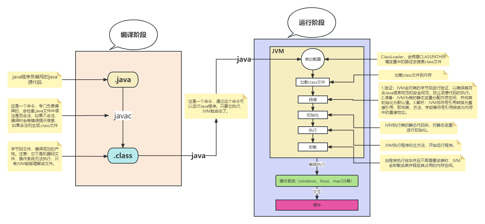

# 第一个Java程序

---

## Hello World程序

1. 基本步骤
    1. `**编码** - 创建`Hello.java`文件。
    2. **编译** - 使用`javac`命令：`javac ./Hello.java`，生成`Hello.class`字节码文件。
    3. **运行** - 使用``java`命令：`java Hello`。注意：运行时不带`.class`扩展名。
2. 编码注意事项
    - 如果代码中包含中文`.java`文件需要保存为**GBK编码**
    - 具体编码介绍：[编码](coding.md)
3. 示例代码
    ```java
    // Hello.java
    public class Hello {
        public static void main(String[] args) {
            System.out.println("Hello World");
        }
    }
    ```

---

## Java源文件结构

1. 类声明规则
    1. 一个源文件中最多**只能有一个**`public`类
    2. 源文件名必须与`public`类名完全一致
    3. 可以包含多个非`public`类
    4. 编译后，每个类都会生成对应的`.class`文件

    ```java
    // Hello.java（文件名必须与 public 类名一致）
    public class Hello {
        public static void main(String[] args) {
            System.out.println("Hello World");
        }
    }
    
    class Another {
    // 可以包含多个非public类
    }
    ```

2. main方法的位置

    1. `public static void main(String[] args)`可以不在`public`类中
    2. 运行时需要指定包含main方法的类名

    ```java
    // Hello.java
    // 编译：javac Hello.java
    // 运行：java Another
    public class Hello {
        // 这个类没有main方法
    }
    
    class Another {
        public static void main(String[] args) {
            System.out.println("Another World");
        }
    }
    ```

---

## 代码规范

### 阿里巴巴Java开发手册

- **链接**：[https://pdai.tech/md/dev-spec/code-style/code-style-alibaba.html](https://pdai.tech/md/dev-spec/code-style/code-style-alibaba.html)

### 基本规范建议

1. **命名规范**
   - 类名使用大驼峰：`HelloWorld`
   - 方法名使用小驼峰：`getUserName()`
   - 常量全大写：`MAX_VALUE`

2. **代码格式**
   - 使用4个空格缩进（不要用Tab）
   - 大括号换行风格一致
   - 适当的空行分隔逻辑块

3. **注释规范**
   - 公共API必须使用文档注释
   - 复杂逻辑添加行内注释
   - 及时更新过时的注释

---

## Java 的加载


（重点）Java的加载与执行（java Test 的执行过程）：
第一步：执行java Test后，会启动JVM 
第二步：JVM会启动classloader类加载器 
第三步：类加载器会去加载Test类，自动去硬盘上找Test类对应的字节码文件Test.class 
第四步：找到Test.class字节码文件之后将其加载到JVM当中。 
第五步：JVM将Test.class字节码解释为机器码。 
第六步：操作系统执行机器码和底层硬件平台进行交互。

---

## Path 与 Classpath

* Path是windows系统的环境变量，Classpath是java类加载器（classloader）的环境变量。classpath环境变量**隶属于Java语言**。
* java Test命令执行之后，JVM启动类加载器classloader，classloader会通过classpath中的路径查找Test.class文件。当classpath没有配置的情况下，**默认从当前路径下查找**。 
* 当classpath显示的配置出来之后，则只会从配置的路径中查找，不再从当前路径下查找。

---

## 总结要点

1. **编译运行**：`javac`编译 → `java`运行
2. **文件命名**：必须与`public`类名一致
3. **编码问题**：中文使用GBK编码
4. **代码规范**：遵循团队或行业标准
