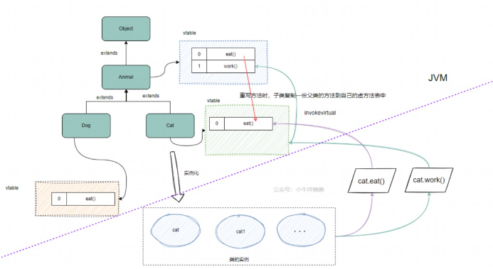

# 多态

浏览顺序：[encapsulation](encapsulation.md) 👉 [extends](extends.md) 👉 本文

---
## 方法的多态

> **方法重载**和**方法重写**也是多态，叫做方法的多态

1. **方法重载**（`Overload`）👉 [overload-detail](../../details/overload-detail.md)
	1. 同一个类中，多个同名方法存在，单要求形参不同
2. **方法重写**/覆盖（`Override`）👉 [override-detail](../../details/override-detail.md)
	1. 需要名称、返回类型和参数都一样
	2. <u>属性不能重写</u>（注意⚠️）：方法重写前两个字是“方法”，👉 [polymorphism-no-param](../../details/polymorphism-no-param.md)
	3. 返回类型：可以一样，也可以是子类
	4. 访问权限：可以一样，也可以变大
	5. 调用多个重载的方法：遵循“就近原则”
3. 比较
	
	|            | 方法重载 | 方法重写  |
	| :--------: | :------: | :-------: |
	|    位置    |   本类   |   子类    |
	|   方法名   |   一样   |   一样    |
	|  形参列表  |   不同   |   相同    |
	|  返回类型  |  无要求  | 缩小/一样 |
	| 访问修饰符 |  无要求  | 扩大/一样 |

---
## 对象的多态

> （🌟重点）对象的多态。下边用一个案例介绍多态：主人喂很多种类宠物吃很多种类的饭。

1. 没有多态。每一种宠物与饭的组合都要定一个方法，组合爆炸。👉 [polymorphism-without](../../details/polymorphism-without.md)
2. 多态——向上转型：👉 [polymorphism-up](../../details/polymorphism-up.md) 
	```java
	Father obj = new Child();
	```
	* 本质：父类的引用指向了子类的对象
	* obj的编译类型：Father，所以不能访问Child的private变量和方法
	* obj的运行类型：Child，所以找方法的时候还是从Child开始找
	* 注意⚠️，**属性是不能重写的**，obj.属性，返回的是父类的属性
3. 多态——向下转型：👉 [polymorphism-down](../../details/polymorphism-down.md)
	```java
	Father obj = new Child();
	(Child)obj // 通过强制转换，向下转型
	```
	* 向上转上去的，才能向下转回来
	* 可以调用子类所有内容
4. 使用多态简化喂宠物案例：👉 [polymorphism-with](../../details/polymorphism-with.md)
	* 一个对象的编译类型（赋值号左边）和运行类型（赋值号右边）可以不一致（`Animal d = new Dog();`）
	* 编译类型在定义对象时，就确定了，不能改变
	* **运行类型**是可以变化的（`d = new Cat();`之前的 d 从 Dog 变成了 Cat）
	* **编译类型**看定义时 `=` 号的左边，**运行类型**看 `=` 号的右边
	* 更多案例：[polymorphism-ex1](../../details/polymorphism-ex1.md)，[polymorphism-ex2](../../details/polymorphism-ex2.md)
5. `instanceof`(判断的是**运行类型**是否是**后边的类型或者后边类型的子类型**)
	```java
	class Base{}
	class Child extends Base{}
	
	public class Test(){
		public static void main(String[] args){
			Base b1 = new Base();
			Base b2 = new Child();
			System.out.println(b1 instanceof Base); // true
			System.out.println(b1 instanceof Child);// false
			System.out.println(b2 instanceof Base); // true
			System.out.println(b2 instanceof Child);// true
		}
	}
	```
6. 动态绑定机制（重点）
	* 当调用对象的**方法**的时候，该方法会和该对象的**内存地址/运行类型**绑定
	* 当调用对象**属性**时，**没有动态绑定机制**，哪里声明就在哪里用
	* 更多案例：[polymorphism-ex3](../../details/polymorphism-ex3.md)，[polymorphism-ex4](../../details/polymorphism-ex4.md)
	* 多态数组：[polymorphism-ex5](../../details/polymorphism-ex5.md)
7. 面试题：多态解决了什么问题
	* 多态指同⼀个接⼝或⽅法在不同的类中有不同的实现，⽐如说动态绑定，⽗类引⽤指向⼦类对象，**⽅法的具体调⽤会延迟到运⾏时决定**。
8. 面试题：多态的实现原理是什么
	* 多态通过**动态绑定**实现，Java 使⽤**虚⽅法表**存储**⽅法指针**，⽅法调⽤时根据对象实际类型从虚⽅法表查找具体实现。
	
