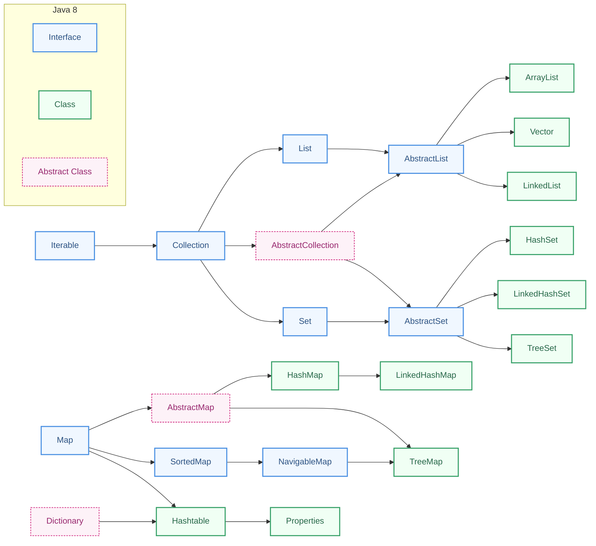
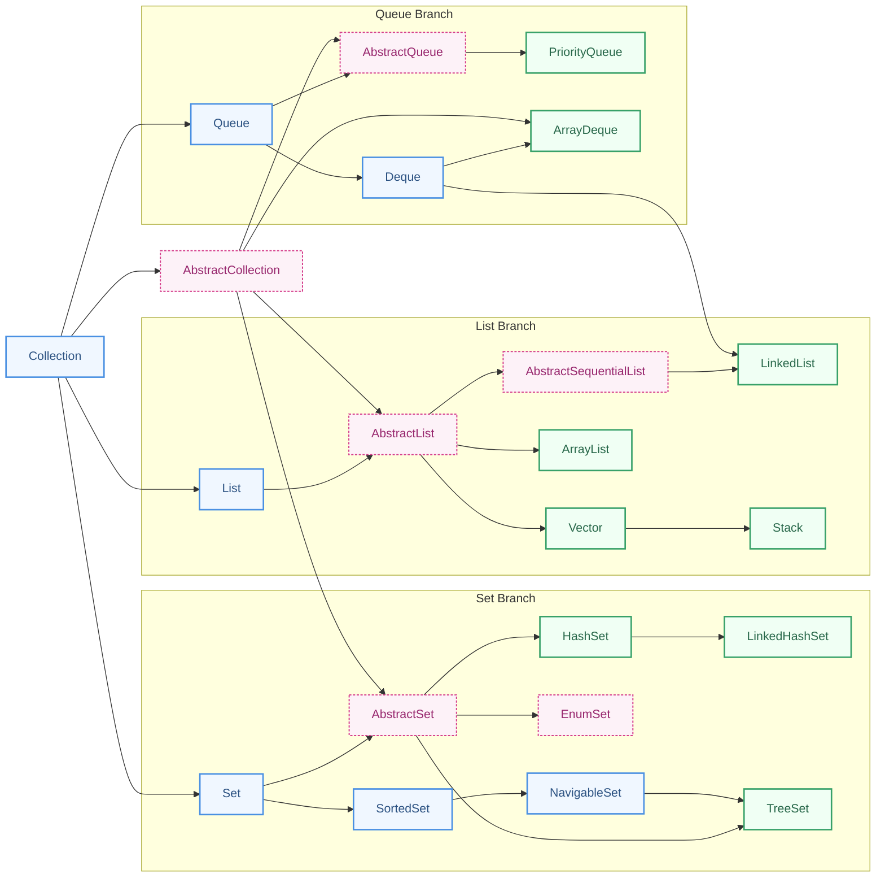

# 集合

> ✏️：面试题/重要
> 🍭：简单/了解一下就行

---
## 重点图解

```json
"Iterable":{
	"Collection（单列集合）":{
		"List":["Vector", "ArrayList", "LinkedList"],
		"Set":["HashSet", "LinkedHashSet", "TreeSet"],
	}
},
"Map（双列集合）":{
	"HashMap": ["LinkedHashMap"],
	"HashTable": ["Perpeties"],
	"TreeMap"
}
```

 常用的Collection类关系图

![[../../../../../../PKM-NEW/java/assets/Collection-drawing|1000]]

`Collection` 和 `Iterable` 接口 API 案例

![[../../../../../../PKM-NEW/java/assets/Collection-interface-drawing|1000]]

`ArrayList`，`LinkedLisk`，`Vector` 对比

![[../../../../../../PKM-NEW/java/assets/list-drawing|1000]]

`HashSet` 与 `LinkedHashSet`

![[../../../../../../PKM-NEW/java/assets/hashset-drawing|1000]]
`Map`

![[../../../../../../PKM-NEW/java/assets/map-drawing| 1000]]

1. **判断存储的类型（一组对象[单列]或一组键值对[双列]）**
   - 一组对象[单列]: Collection接口
     - 允许重复: List
       - 增删多: LinkedList [底层维护了一个双向链表]
       - 改变多: ArrayList [底层维护Object类型的可变数组]
     - 不允许重复: Set
       - 无序: HashSet [底层是HashMap, 维护了一个哈希表 即(数组+链表+红黑树)]
       - 排序: TreeSet [老韩举例说明]
       - 插入和取出顺序一致: LinkedHashSet, 维护数组+双向链表
2. **一组键值对**: Map
   - 键无序: HashMap [底层是: 哈希表 jdk7: 数组+链表, jdk8: 数组+链表+红黑树]
   - 键排序: TreeMap
   - 键插入和取出顺序一致: LinkedHashMap
   - 读取文件 Properties

---
## 🌟 Collection, Iterable, Iterator

### 🍭 Collection 接口实现类的特点

```java
public interface Collection<E> extends Iterable<E>
```

1. collection实现子类可以存放多个元素，每个元素可以是**Object**
2. 有些Collection的实现类，可以存放**重复的元素**，有些不可以
3. 有些Collection的实现类，有些是**有序的(List)**，有些**不是有序(Set)**
4. Collection接口没有直接的实现子类，是通过它的**子接口Set和List来实现**的
5. **集合中存储的是引用**，不是把堆中的对象存储到集合中，是把对象的地址存储到集合中。
6. Java集合框架相关的类都在 **java.util** 包下。

### ✏️ Collection 继承结构

![[../../../../../../PKM-NEW/java/assets/Collection-drawing|1000]]






### ✏️ 常见的 Collection 实现类

集合框架可以分为两条大的支线
1. 第一条支线 Collection，主要由 **List**、**Set**、**Queue** 组成：
	- List 代表有序、可重复的集合，典型代表就是封装了动态数组的 [ArrayList](https://javabetter.cn/collection/arraylist.html) 和封装了链表的 [LinkedList](https://javabetter.cn/collection/linkedlist.html)；
	- Set 代表无序、不可重复的集合，典型代表就是 HashSet 和 TreeSet；
	- Queue 代表队列，典型代表就是双端队列 [ArrayDeque](https://javabetter.cn/collection/arraydeque.html)，以及优先级队列 [PriorityQueue](https://javabetter.cn/collection/PriorityQueue.html)。
2. 第二条支线 Map，代表键值对的集合，典型代表就是 [HashMap](https://javabetter.cn/collection/hashmap.html)，LinkedHashMap、TreeMap等。

### ✏️ 集合框架的工具类

集合框架位于 java.util 包下，提供了两个常用的工具类：

- [Collections](https://javabetter.cn/common-tool/collections.html)：提供了一些对集合进行排序、二分查找、同步的静态方法。
- [Arrays](https://javabetter.cn/common-tool/arrays.html)：提供了一些对数组进行排序、打印、和 List 进行转换的静态方法。

### 🍭 Collection 的常用方法

> 以实现子类ArrayList来演示. CollectionMethod.java
> 官网： https://docs.oracle.com/javase/8/docs/api/java/util/Collection.html

| 函数                                 | 功能          |
| ---------------------------------- | ----------- |
| boolean add(E e);                  | 添加单个元素      |
| int size();                        | 获取集合中元素个数   |
| boolean addAll(Collection c);      | 添加多个元素      |
| boolean contains(Object o);        | 查找元素是否存在    |
| boolean containsAll(Collection c); | 查找多个元素是否都存在 |
| boolean remove(Object o);          | 删除指定元素      |
| void clear();                      | 清空          |
| boolean isEmpty();                 | 判断是否为空      |
| boolean removeAll(Collection c);   | 删除多个元素      |
| Object[] toArray();                | 将集合转换成一维数组  |

```java
package ex_set;  
  
import java.util.ArrayList;  
import java.util.Collection;  
  
public class Test {  
    public static void main(String[] args) {  
        Collection col = new ArrayList();  
        col.add("小龙女");  
        col.add(100); // 不同类型都可以  
        col.add(true);  
        col.add("小龙女");  
        col.add(new Integer(9));  
        System.out.println(col);  
        // [小龙女, 100, true, 小龙女, 9]  
  
        col.remove(0); //删除第一个  
        col.remove("小龙女");//删除指定元素  
        boolean contains = col.contains(10);  
        System.out.println("10是否存在: "+contains);  
        // 10是否存在: false  
        System.out.println(col.size()); // 4  
        System.out.println(col.isEmpty()); // false  
        col.clear();  
  
        Collection c = new ArrayList();  
        c.add("AA");  
        c.add("CC");  
        c.add("BBB");  
        col.addAll(c); // 添加一个集合  
        System.out.println(col);  
        // [AA, CC, BBB]  
  
        Collection c2 = new ArrayList();  
        c2.add("CC");  
        c2.add("AA~");  
        boolean containsAll = col.containsAll(c2);  
        col.removeAll(c2);  
        System.out.println(col);  
        // [AA, BBB]  
    }  
}
```

`contains`调用底层调用的是`equals`

```java
int n1 = 1000;  
Integer n2 = 1000;  
  
Collection c1 = new ArrayList();  
c1.add(n2);  
System.out.println(c1.contains(n1)); // true  
System.out.println(c1.contains(n2)); // true
```

比如，要比较日期类，我们需要重写`equal`

```java
package com.powernode.javase.collection;  
  
import java.util.ArrayList;  
import java.util.Collection;  
  
public class Date {  
    private int year;  
    private int month;  
    private int day;  
  
    @Override  
    public boolean equals(Object obj){  
        if(obj == null) return false;  
        if(this == obj) return true;  
        if(obj instanceof Date){  
            Date date = (Date) obj;  
            return this.year == date.year && this.month == date.month && this.day == date.day;  
        }  
        return false;  
    }  
  
    public Date(int year, int month, int day) {  
        this.year = year;  
        this.month = month;  
        this.day = day;  
    }  
  
    public int getYear() {  
        return year;  
    }  
  
    public void setYear(int year) {  
        this.year = year;  
    }  
  
    public int getMonth() {  
        return month;  
    }  
  
    public void setMonth(int month) {  
        this.month = month;  
    }  
  
    public int getDay() {  
        return day;  
    }  
  
    public void setDay(int day) {  
        this.day = day;  
    }  
  
    public static void main(String[] args) {  
        Date d1 = new Date(2020, 10, 10);  
        Date d2 = new Date(2020, 10, 10);  
        Collection c = new ArrayList();  
        c.add(d1);  
        System.out.println(c.contains(d2)); // true  
    }  
}
```

### ✏️ Collection 的遍历

使用Iterator(迭代器)
```java
Interface Iterator<E>
```

子接口：
```java
ListIterator<E>, XMLEventReader
```

实现类：
```java
BeanContextSupport.BCSIterator, EventReaderDelegate, Scanner
```

1. Iterator对象称为迭代器，主要用于遍历 Collection 集合中的元素。
2. 所有实现了Collection接口的集合类都有一个iterator()方法，用以返回一个实现了Iterator接口的对象，即可以返回一个迭代器。
3. Iterator 的结构.
4. Iterator 仅用于遍历集合，Iterator 本身并不存放对象。

```java
Collection col = new ArrayList();  
col.add("Hello");  
col.add("World");  
Iterator iterator = col.iterator();  
while (iterator.hasNext()){  
    System.out.println(iterator.next());  
}  
// Hello  
// World  
iterator = col.iterator();  
while (iterator.hasNext()){  
    System.out.println(iterator.next());  
}  
// Hello  
// World
```

下边使用**增强 for 循环访问 Collection。底层仍然是迭代器**，增强 for 循环可以理解成简化版本的迭代器遍历

```java
for(Object o : col){  
    System.out.println(o);  
}
```

练习：请编写程序 CollectionExercise.java
1. 创建 3 个 `Dog{name, age}` 对象，放入到 ArrayList 中，赋给 List 引用
2. 用迭代器和增强 for 循环两种方式来遍历
3. 重写 Dog 的 toString 方法，输出 name 和 age

```java
package ex_set;  
  
import java.util.ArrayList;  
import java.util.Collection;  
import java.util.Iterator;  
  
public class Ex0 {  
    public static void main(String[] args) {  
        Collection col = new ArrayList();  
        col.add(new Dog("Tom", 10));  
        col.add(new Dog("Jerry", 8));  
        col.add(new Dog("旺财", 7));  
        for(Object o : col){  
            System.out.println(o);  
        }  
        //Tom 10  
        //Jerry 8        
        //旺财 7   
		
		// 第一步：获取当前集合依赖的迭代器对象
        Iterator iterator = col.iterator();  
        // 第二步：编写循环，循环条件是：当前光标指向的位置是否存在元素。
        while(iterator.hasNext()){  
	        // 第三步：如果有，将光标指向的当前元素返回，并且将光标向下移动一位。
            System.out.println(iterator.next());  
        }
        //Tom 10        
        //Jerry 8        
        //旺财 7    
    }  
}  
  
class Dog{  
    private String name;  
    private int age;  
    public Dog(String name, int age) {  
        this.name = name;  
        this.age = age;  
    }  
    public String getName() {  
        return name;  
    }  
    public void setName(String name) {  
        this.name = name;  
    }  
    public int getAge() {  
        return age;  
    }  
    public void setAge(int age) {  
        this.age = age;  
    }  
    @Override  
    public String toString() {  
        return getName() + " " + getAge();  
    }  
}
```

### ✏️ 迭代时删除元素

1. 迭代集合时删除元素
	1. 使用“集合对象.remove(元素)”：会出现`ConcurrentModificationException`异常。
	2. 使用“迭代器对象.remove()”：不会出现异常。
2. 关于集合的并发修改问题
	1. 想象一下，有两个线程：A和B。A线程负责迭代遍历集合，B线程负责删除集合中的某个元素。当这两个线程同时执行时会有什么问题？
3. 如何解决并发修改问题：fail-fast机制
	1. fail-fast机制又被称为：快速失败机制。也就是说只要程序发现了程序对集合进行了并发修改。就会立即让其失败，以防出现错误。
4. **fail-fast机制是如何实现的**？以下是源码中的实现原理
	1. 集合中设置了一个`modCount`属性，用来记录修改次数，使用集合对象执行增，删，改中任意一个操作时，`modCount`就会自动加1。比如：`protected transient int modCount = 0;`
	2. 获取迭代器对象的时候，会给**迭代器对象**初始化一个`expectedModCount`属性。并且将`expectedModCount`初始化为`modCount`，即：`int expectedModCount = modCount;`
	3. 当使用集合对象删除元素时：`modCount`会加1。但是迭代器中的`expectedModCount`不会加1。而当迭代器对象的`next()`方法执行时，会检测`expectedModCount`和`modCount`是否相等，如果不相等，则抛出：`ConcurrentModificationException`异常。
	4. 当使用迭代器删除元素的时候：`modCount`会加1，并且`expectedModCount`也会加1。这样当迭代器对象的`next()`方法执行时，检测到的`expectedModCount`和`modCount`相等，则不会出现`ConcurrentModificationException`异常。
5. 注意：虽然我们当前写的程序是单线程的程序，并没有使用多线程，但是通过迭代器去遍历的同时使用集合去删除元素，这个行为将被认定为并发修改。
6. 结论：迭代集合时，删除元素要使用“迭代器对象.remove()”方法来删除，避免使用“集合对象.remove(元素)”。主要是为了避免ConcurrentModificationException异常的发生。**注意：迭代器的remove()方法删除的是next()方法的返回的那个数据。remove()方法调用之前一定是先调用了next()方法，如果不是这样的，就会报错。**

```java
// 创建集合对象  
Collection<String> names = new ArrayList<>();  
  
// 添加元素  
names.add("zhangsan");  
names.add("lisi");  
names.add("wangwu");  
names.add("zhaoliu");  
names.add("zhoubapi");  
  
// 迭代集合，删除集合中的某个元素  
Iterator<String> it = names.iterator();  
while (it.hasNext()) {  
    String name = it.next(); // java.util.ConcurrentModificationException 并发修改异常 modCount expectedModCount   
    if("lisi".equals(name)){  
        // 删除元素（使用集合带的remove方法删除元素）  
        //names.remove(name);  
        // 删除元素（使用迭代器的remove方法删除元素）  
        it.remove();  
    }  
    System.out.println(name);  
}
```


### 🍭 SequencedCollection

1. SequencedCollection接口是Java21版本新增的。
2. SequencedCollection接口中的方法：
	1. void addFirst(Object o)：向头部添加
	2. void addLast(Object o)：向末尾添加
	3. Object removeFirst()：删除头部
	4. Object removeLast()：删除末尾
	5. Object getFirst()：获取头部节点
	6. Object getLast()：获取末尾节点
	7. SequencedCollection reversed(); 反转集合中的元素
3. ArrayList，LinkedList，Vector，LinkedHashSet，TreeSet,Stack 都可以调用这个接口中的方法。

---
## 🌟 List

### 🍭 List 通用方法

- List 接口是 Collection 接口的子接口
- List集合类中**元素有序**(即添加顺序和取出顺序一致)、且可重复
- List集合中的每个元素都有其对应的顺序索引，即**支持索引**。
- List容器中的元素都对应一个整数型的序号记载其在容器中的位置，可以根据序号存取容器中的元素。  
- JDK API中List接口的实现类有接口 `List<E>`  
- 所有超级接口
	```java
	Collection<E>, Iterable<E>  
	```
* 所有已知实现类: （常用的有: ArrayList、LinkedList和Vector。）
	```java
	AbstractList, AbstractSequentialList, ArrayList, AttributeList, CopyOnWriteArrayList, LinkedList, RoleList, RoleUnresolvedList, Stack, Vector  
	```

List接口特有方法：（在Collection和SequencedCollection中没有的方法，只适合List家族使用的方法，这些方法都和下标有关系。）
* `void add​(int index, E element)` 在指定索引处插入元素
* `E set​(int index, E element);` 修改索引处的元素
* `E get​(int index);` 根据索引获取元素（通过这个方法List集合具有自己特殊的遍历方式：根据下标遍历）
* `E remove​(int index);` 删除索引处的元素
* `int indexOf​(Object o);` 获取对象o在当前集合中第一次出现时的索引。
* `int lastIndexOf​(Object o);` 获取对象o在当前集合中最后一次出现时的索引。
* `List<E> subList​(int fromIndex, int toIndex);` 截取子List集合生成一个新集合（对原集合无影响）。`[fromIndex, toIndex)`
* `static List<E> of​(E... elements);` 静态方法，返回包含任意数量元素的不可修改列表。**（获取的集合是只读的，不可修改的。）**


```java
List list = new ArrayList();  
list.add("tom");  
list.add("jack");  
list.add("mary");  
list.add("smith2");  
list.add("kristina");  
System.out.println(list);  (按照顺序)
//3的案例:  
System.out.println(list.get(4)); //smith2  （支持索引）
System.out.println(list.indexOf("tom")); 
list.remove(0); // 删掉第一个元素
list.set(0, "Hello"); // 替换 （只能替换存在的内容）
```

List接口课堂练习  
ListExercise.java  
添加10个以上的元素（比如String “hello”），在2号位插入一个元素“韩顺平教育”，获得第5个元素，删除第6个元素，修改第7个元素，在使用迭代器遍历集合，要求：使用List的实现类ArrayList完成。

```java
package ex_set;  
  
import java.util.ArrayList;  
import java.util.Collection;  
import java.util.Iterator;  
import java.util.List;  
  
public class ListExample {  
    public static void main(String[] args) {  
        List col = new ArrayList();  
        for(int i=0; i<10; i++){  
            col.add("Hello"+i);  
        }  
        // 获得第5个元素  
        System.out.println(col.get(4));  
        // 删除第6个元素  
        col.remove(6);  
        // 修改第7个元素  
        col.set(6, "World");  
        Iterator iterator = col.iterator();  
        while(iterator.hasNext()){  
            System.out.println(iterator.next());  
        }  
  
    }  
}
```

### 🍭 List 专属的迭代器 ListIterator

```java
package com.powernode.javase.collection;  
  
import java.util.ArrayList;  
import java.util.Iterator;  
import java.util.List;  
import java.util.ListIterator;  
  
/**  
 * java.util.ListIterator：List接口专用的迭代器。Set集合不能使用。  
 *      boolean hasNext();     判断光标当前指向的位置是否存在元素。  
 *      E next();            将当前光标指向的元素返回，然后将光标向下移动一位。  
 *      void remove();        删除上一次next()方法返回的那个数据(删除的是集合中的)。remove()方法调用的前提是：你先调用next()方法。不然会报错。  
 *  
 *      void add(E e);        添加元素（将元素添加到光标指向的位置，然后光标向下移动一位。）  
 *      boolean hasPrevious();  判断当前光标指向位置的上一个位置是否存在元素。  
 *      E previous();         获取上一个元素（将光标向上移动一位，然后将光标指向的元素返回）  
 *      int nextIndex();       获取光标指向的那个位置的下标  
 *      int previousIndex();    获取光标指向的那个位置的上一个位置的下标  
 *      void set(E e);        修改的是上一次next()方法返回的那个数据（修改的是集合中的）。set()方法调用的前提是：你先调用了next()方法。不然会报错。  
 */  
public class ListIteratorTest {  
    public static void main(String[] args) {  
        // 创建集合List  
        List<String> names = new ArrayList<>();  
        // 添加元素  
        names.add("zhangsan");  
        names.add("lisi");  
        names.add("wangwu");  
        names.add("zhaoliu");  
        // 使用普通的通用迭代器遍历  
        /*Iterator<String> it = names.iterator();  
        while(it.hasNext()){            
	        String name = it.next();            
	        System.out.println(name);        
	    }*/        
	    // 使用ListIterator进行遍历  
        // 测试的add方法  
        /*ListIterator<String> li = names.listIterator();  
        while (li.hasNext()) {            
	        String name = li.next();            
	        if("lisi".equals(name)){                
		        li.add("李四");  
            }            
            System.out.println(name);        
        }*/  
        // 测试hasPrevious()方法  
        // 判断是否有上一个  
        // 判断当前光标指向位置的上一个位置是否存在元素。  
        /*ListIterator<String> li = names.listIterator();  
        System.out.println("光标当前指向的位置的上一个位置是否有元素：" + li.hasPrevious());  
  
        while (li.hasNext()) {            
	        String name = li.next();            
	        System.out.println(name);        
	    }  
        System.out.println("光标当前指向的位置的上一个位置是否有元素：" + li.hasPrevious());*/  
  
        // E previous(); 获取上一个元素（将光标向上移动一位，然后将光标指向的元素返回）  
        /*ListIterator<String> li = names.listIterator();  
        while (li.hasNext()) {            String name = li.next();            System.out.println(name);        }  
        System.out.println("========================");  
        System.out.println(li.previous()); // zhaoliu        System.out.println(li.previous()); // wangwu        
        System.out.println(li.previous()); // lisi        
        System.out.println(li.previous()); // zhangsan        
        //System.out.println(li.previous()); // java.util.NoSuchElementException*/  
        //int nextIndex(); 获取光标指向的那个位置的下标  
        /*ListIterator<String> li = names.listIterator();  
        while (li.hasNext()) {            
	        String name = li.next();            
	        if("lisi".equals(name)){ 
		        // 当前取出的元素是"lisi"  
                System.out.println(li.nextIndex()); //2                
                // int previousIndex(); 获取光标指向的那个位置的上一个位置的下标  
                System.out.println(li.previousIndex()); // 1            
            }            
            System.out.println(name);        
        }
         */  
        // void set(E e);修改的是上一次next()方法返回的那个数据（修改的是集合中的）。set()方法调用的前提是：你先调用了next()方法。不然会报错。  
        ListIterator<String> li = names.listIterator();  
  
        // set方法不能随意使用，set调用的前提是：之前调用了next()或者previous()  
        // li.set("xxxxxxxxxxxxxx"); 
        // java.lang.IllegalStateException  
        /*while (li.hasNext()) {  
            String name = li.next();            
            // 在这里时可以调用set方法  
            if("lisi".equals(name)) {                
	            li.set("李四");  
            }            
            System.out.println(name);        
        }  
        System.out.println(names);*/  
  
        // remove方法：通过迭代器去删除  
        //li.remove(); 
        // java.lang.IllegalStateException（调用迭代器的remove方法之前也是需要调用了next()/previous()方法。）  
        //删除上一次next()方法返回的那个数据(删除的是集合中的)。remove()方法调用的前提是：你先调用next()方法。不然会报错。  
        while (li.hasNext()) {  
            String name = li.next();  
            if("lisi".equals(name)){  
                // 删除  
                li.remove();  
            }  
        }  
  
        System.out.println(names);  
  
    }  
}
```

### 🍭 List 使用 Comparator 排序

回顾数组中的 `Comparable`

```java
// User.java
package com.powernode.javase.collection.arraysort;  
  
public class User implements Comparable<User>{  
    private String name;  
    private int age;  
  
    public User(String name, int age) {  
        this.name = name;  
        this.age = age;  
    }  
  
    public String getName() {  
        return name;  
    }  
  
    public void setName(String name) {  
        this.name = name;  
    }  
  
    public int getAge() {  
        return age;  
    }  
  
    public void setAge(int age) {  
        this.age = age;  
    }  
  
    @Override  
    public String toString() {  
        return "User{" +  
                "name='" + name + '\'' +  
                ", age=" + age +  
                '}';  
    }  
  
    /*  
    关于compareTo方法的返回值：  
        a - b == 0   a == b        
        a - b > 0    a > b        
        a - b < 0    a < b  
        当compareTo方法执行结束之后，返回结果是0，表示：a == b  
        当compareTo方法执行结束之后，返回结果大于0，表示：a > b  
        当compareTo方法执行结束之后，返回结果小于0，表示：a < b  
     */    
    @Override  
    public int compareTo(User user) { // 这个int是compareTo方法的返回值。相当于a - b之后的结果。  
        // 这里提供比较规则  
        // 可以按照名字进行排序，也可以按照年龄进行排序。  
        // return this.age - user.age; // this放前表示升序。  
        //return user.age - this.age; // this放后表示降序。  
  
        // 按照姓名排序  
        //return this.name.compareTo(user.name); // 升序  
        return user.name.compareTo(this.name); // 降序  
    }  
}
```

```java
package com.powernode.javase.collection.arraysort;  
  
import java.util.Arrays;  
  
public class ArraySort {  
    public static void main(String[] args) {  
        User u1 = new User("abc", 20);  
        User u2 = new User("bbc", 18);  
        User u3 = new User("abb", 19);  
        User u4 = new User("cbc", 25);  
        User u5 = new User("acb", 6);  
  
        User[] users = {u1, u2, u3, u4, u5};  
  
        // 排序  
        // class User cannot be cast to class Comparable  
        // Arrays数组工具类在对User类型的数组进行排序的时候出现了：java.lang.ClassCastException  
        // 因为User对象不是可比较的。User没有实现 java.lang.Comparable接口。  
        // 换句话说：User没有提供比较规则。程序无法进行比较。  
        // 怎么让User是可排序的。让User实现Comparable接口，实现compareTo方法，在该方法中编写比较规则。  
        Arrays.sort(users);  
  
        System.out.println(Arrays.toString(users));  
    }  
}
```

```
[User{name='cbc', age=25}, User{name='bbc', age=18}, User{name='acb', age=6}, User{name='abc', age=20}, User{name='abb', age=19}]
```

这种的比较方法是侵入式的，对于 List 有更好的方法，在外部实现 `Comparator` 

```java
package com.powernode.javase.collection.listsort;  
  
public class Person {  
    private String name;  
    private int age;  
  
    @Override  
    public String toString() {  
        return "Person{" +  
                "name='" + name + '\'' +  
                ", age=" + age +  
                '}';  
    }  
  
    public Person(String name, int age) {  
        this.name = name;  
        this.age = age;  
    }  
  
    public String getName() {  
        return name;  
    }  
  
    public void setName(String name) {  
        this.name = name;  
    }  
  
    public int getAge() {  
        return age;  
    }  
  
    public void setAge(int age) {  
        this.age = age;  
    }  
}
```

```java
package com.powernode.javase.collection.listsort;  
  
import java.util.Comparator;  
  
/**  
 * 一个单独的比较器。在这个比较器中编写Person的比较规则。  
 */  
public class PersonComparator implements Comparator<Person> {  
  
    @Override  
    public int compare(Person o1, Person o2) {  
        // 按照年龄排序  
        // 按照名字排序  
        //return o1.getAge() - o2.getAge(); // 升序  
        //return o2.getAge() - o1.getAge(); // 降序  
  
        return o1.getName().compareTo(o2.getName());  
        //return o2.getName().compareTo(o1.getName());  
    }  
}
```

```java
package com.powernode.javase.collection.listsort;  
  
import java.util.ArrayList;  
import java.util.List;  
  
public class ListSort {  
    public static void main(String[] args) {  
        // 创建Person对象  
        Person p1 = new Person("abc", 20);  
        Person p2 = new Person("bbc", 18);  
        Person p3 = new Person("abb", 19);  
        Person p4 = new Person("cbc", 25);  
        Person p5 = new Person("acb", 6);  
  
        // 创建List集合  
        List<Person> persons = new ArrayList<>();  
  
        persons.add(p1);  
        persons.add(p2);  
        persons.add(p3);  
        persons.add(p4);  
        persons.add(p5);  
  
        // 排序  
        persons.sort(new PersonComparator());  
  
        for (int i = 0; i < persons.size(); i++) {  
            System.out.println(persons.get(i));  
        }  
    }  
}
```

可以使用匿名内部类简化

```java
package com.powernode.javase.collection.listsort;  
  
import java.util.ArrayList;  
import java.util.Comparator;  
import java.util.List;  
  
/**  
 * 使用匿名内部类  
 */  
public class ListSort2 {  
    public static void main(String[] args) {  
        // 创建Person对象  
        Person p1 = new Person("abc", 20);  
        Person p2 = new Person("bbc", 18);  
        Person p3 = new Person("abb", 19);  
        Person p4 = new Person("cbc", 25);  
        Person p5 = new Person("acb", 6);  
  
        // 创建List集合  
        List<Person> persons = new ArrayList<>();  
  
        persons.add(p1);  
        persons.add(p2);  
        persons.add(p3);  
        persons.add(p4);  
        persons.add(p5);  
  
        // 排序  
        persons.sort(new Comparator<Person>() {  
            @Override  
            public int compare(Person o1, Person o2) {  
                return o1.getAge() - o2.getAge();  
            }  
        });  
  
  
        for (int i = 0; i < persons.size(); i++) {  
            System.out.println(persons.get(i));  
        }  
    }  
}
```

### 🌟 ArrayList

#### 🍭 继承关系

![[resources/arraylist.excalidraw]]

#### 🍭 基础使用

* permits all elements, including null，ArrayList 可以加入 null, 并且多个
	```java
	public class ArrayListEx {  
	    public static void main(String[] args) {  
	        ArrayList array = new ArrayList();  
	        array.add("1");  
	        array.add("2");  
	        array.add(null);  
	        array.add(null);  
	        System.out.println(array);  
	    }  
	}
	```
	
* 如果指定了类型（[[generic]]）那就只能传入特定的类型了
	```java
	List<String> names = new ArrayList<>();
	```
	
* ArrayList 基本等同于Vector，除了 **ArrayList 是线程不安全**(执行效率高) 看源码。在多线程情况下，不建议使用ArrayList。
	```java
	// 源码的 add 函数
	// 可以看到没有 synchronized 标识符
	private void add(E e, Object[] elementData, int s) {  
	    if (s == elementData.length)  
	        elementData = grow();  
	    elementData[s] = e;  
	    size = s + 1;  
	}
	```
	
* ArrayList 是由数组来实现数据存储的（ArrayList中维护了一个Object类型的数组elementData.）
	```java
	// 源码
	
	// 默认是一个空数组
	private static final Object[] DEFAULTCAPACITY_EMPTY_ELEMENTDATA = {};
	// 无参构造器
	public ArrayList() {  
	    this.elementData = DEFAULTCAPACITY_EMPTY_ELEMENTDATA;  
	}
	
	// 默认指定大小为 0 的情况，也初始化成空数组
	private static final Object[] EMPTY_ELEMENTDATA = {};
	// 有参构造器，指定初始大小
	public ArrayList(int initialCapacity) {  
	    if (initialCapacity > 0) {  
	        this.elementData = new Object[initialCapacity];  
	    } else if (initialCapacity == 0) {  
	        this.elementData = EMPTY_ELEMENTDATA;  
	    } else {  
	        throw new IllegalArgumentException("Illegal Capacity: "+  
	                                           initialCapacity);  
	    }  
	}
	```

#### 🍭 初始化两个空数组

* 为什么`EMPTY_ELEMENTDATA`，`DEFAULTCAPACITY_EMPTY_ELEMENTDATA`要搞两个名字
	这两个空数组常量虽然都是`Object[]{}`空数组，但具有完全不同的语义意义：
	1. **​EMPTY_ELEMENTDATA​**​
	    - 用于​**​显式指定初始容量为0​**​的ArrayList (`new ArrayList(0)`)
	    - 表示开发者明确要求创建一个零容量的列表
	    - 添加第一个元素时按最小需求扩容（从0开始增长）
	2. **​DEFAULTCAPACITY_EMPTY_ELEMENTDATA​**​
	    - 用于​**​无参构造函数​**​创建的ArrayList (`new ArrayList()`)
	    - 表示使用默认容量策略（初始显示为空，但隐式准备扩容到10）
	    - 添加第一个元素时会直接扩容到DEFAULT_CAPACITY(10)

#### ✏️ 扩容机制

* 当创建ArrayList对象时，如果使用的是**无参构造器**，则**初始**elementData容量为**0**，**第1次**添加，则扩容elementData为**10**，如需要**再次扩容**，则扩容elementData为**1.5倍**。
	```java
	// 下面演示 add 函数的调用过程(java8)
	// 保存内容的 Object 数组，transient的意思是顺时的，为了不能序列化
	transient Object[] elementData; // non-private to simplify nested class access
	
	// 默认初始化数组是空
	private static final Object[] DEFAULTCAPACITY_EMPTY_ELEMENTDATA = {};
	
	// 默认容量大小为 10
	private static final int DEFAULT_CAPACITY = 10;
	
	// add 函数调用的 api，首先去[保证容量]，然后添加元素
	public boolean add(E e) {  
	    ensureCapacityInternal(size + 1);  // Increments modCount!!  
	    elementData[size++] = e;  
	    return true;  
	}
	
	// [保证容量]的方法，首先[计算需要的容量]，然后[确保这些容量足够]
	private void ensureCapacityInternal(int minCapacity) {  
	    ensureExplicitCapacity(calculateCapacity(elementData, minCapacity));  
	}
	
	// [计算需要的容量]：如果元素是空，就代表这是第一次 add，那么就添加 10 个元素，否则返回调用传入的内容
	private static int calculateCapacity(Object[] elementData, int minCapacity) {  
	    if (elementData == DEFAULTCAPACITY_EMPTY_ELEMENTDATA) {  
	        return Math.max(DEFAULT_CAPACITY, minCapacity);  
	    }    
	    return minCapacity;  
	}
	
	// [确保这些容量足够]
	// modCount用来保证不会有两个线程同时进来
	// minCapacity > elementData.length 说明容量不够，才去真正的扩容
	private void ensureExplicitCapacity(int minCapacity) {  
	    modCount++;  
	  
	    // overflow-conscious code  
	    if (minCapacity - elementData.length > 0)  
	        grow(minCapacity);  
	}
	
	// 真正的扩容
	// 新的容量 = 老容量*1.5，他的 0.5 倍用的移位的操作实现的
	// 新容量 = max(1.5老, 10)
	// 先生成新的内容，然后把老内容 copy 到前边
	private void grow(int minCapacity) {  
	    // overflow-conscious code  
	    int oldCapacity = elementData.length;  
	    int newCapacity = oldCapacity + (oldCapacity >> 1);  
	    if (newCapacity - minCapacity < 0)  
	        newCapacity = minCapacity;  
	    if (newCapacity - MAX_ARRAY_SIZE > 0)  
	        newCapacity = hugeCapacity(minCapacity);  
	    // minCapacity is usually close to size, so this is a win:  
	    elementData = Arrays.copyOf(elementData, newCapacity);  
	}
	
	```
* 如果使用的是**指定大小的构造器**，则初始elementData容量为指定大小，如果需要扩容，则直接扩容elementData为1.5倍
	```java
	//源码中的构造器
	public ArrayList(int initialCapacity) {  
	    if (initialCapacity > 0) {  
	        this.elementData = new Object[initialCapacity];  
	    } else if (initialCapacity == 0) {  
	        this.elementData = EMPTY_ELEMENTDATA;  
	    } else {  
	        throw new IllegalArgumentException("Illegal Capacity: "+  
	                                           initialCapacity);  
	    }
	}
	```

### 🌟 Vector

#### 🍭 简介

* 本质也是 List，也是用数组来保存数据，**线程安全**的（但由于效率较低，**很少使用**。因为控制线程安全有新方式。）

```java
// java8
public class Vector<E> extends AbstractList<E>  
    implements List<E>, RandomAccess, Cloneable, java.io.Serializable  
{
	protected Object[] elementData;
}
```

#### ✏️ Vector 扩容策略

|           | 底层结构 | 版本     | 线程安全（同步）效率 | 扩容倍数                                              |
| --------- | ---- | ------ | ---------- | ------------------------------------------------- |
| ArrayList | 可变数组 | jdk1.2 | 不安全，效率高    | 如果有参构造1.5倍<br>如果是无参<br>1. 第一次10<br>2. 从第二次开始按1.5扩 |
| Vector    | 可变数组 | jdk1.0 | 安全，效率不高    | 如果是无参，默认10，满后，就按2倍扩容<br>如果指定大小，则每次直接按2倍扩          |
```java
// 这里是构造器部分
public Vector() {  
    this(10);  
}
public Vector(int initialCapacity) {  
    this(initialCapacity, 0);  
}
public Vector(int initialCapacity, int capacityIncrement) {  
    super();  
    if (initialCapacity < 0)  
        throw new IllegalArgumentException("Illegal Capacity: "+  
                                           initialCapacity);  
    this.elementData = new Object[initialCapacity];  
    this.capacityIncrement = capacityIncrement;  
}
public Vector(Collection<? extends E> c) {  
    Object[] a = c.toArray();  
    elementCount = a.length;  
    if (c.getClass() == ArrayList.class) {  
        elementData = a;  
    } else {  
        elementData = Arrays.copyOf(a, elementCount, Object[].class);  
    }
}
    
// 这里也是看一下 java8 里边的 add 部分的源码
protected int capacityIncrement; // 默认每次扩容多少，默认是 0

public synchronized boolean add(E e) {  
    modCount++;  
    ensureCapacityHelper(elementCount + 1);// 可以发现，其实和 ArrayList 差不多  
    elementData[elementCount++] = e;  
    return true;  
}

private void ensureCapacityHelper(int minCapacity) {  
    // overflow-conscious code  
    if (minCapacity - elementData.length > 0)  
        grow(minCapacity);  
}

private void grow(int minCapacity) {  
    // overflow-conscious code  
    int oldCapacity = elementData.length;  
    int newCapacity = oldCapacity + ((capacityIncrement > 0) ?  
                                     capacityIncrement : oldCapacity);  
    if (newCapacity - minCapacity < 0)  
        newCapacity = minCapacity;  
    if (newCapacity - MAX_ARRAY_SIZE > 0)  
        newCapacity = hugeCapacity(minCapacity);  
    elementData = Arrays.copyOf(elementData, newCapacity);  
}
```

### 🌟 LinkedList

#### 🍭 部分源码

```java
public class LinkedList<E>  
    extends AbstractSequentialList<E>  
    implements List<E>, Deque<E>, Cloneable, java.io.Serializable  
{  
    transient int size = 0;  
  
    /**  
     * Pointer to first node.     
     * Invariant: (first == null && last == null) ||     
     *            (first.prev == null && first.item != null)     
     */    
	transient Node<E> first;  
  
    /**  
     * Pointer to last node.     
     * Invariant: (first == null && last == null) ||     
     *            (last.next == null && last.item != null)     
     */    
    transient Node<E> last;  
    
    public LinkedList() {  
    }  
    
    public boolean add(E e) {  
	    linkLast(e);  
	    return true;  
	}

	void linkLast(E e) {  
        final Node<E> l = last;  
        final Node<E> newNode = new Node<>(l, e, null);  
        last = newNode;  
        if (l == null)  
            first = newNode;  
        else  
            l.next = newNode;  
        size++;  
        modCount++;  
    }

	public E remove() {  
	    return removeFirst();  
	}
	
	public E removeFirst() {  
	    final Node<E> f = first;  
	    if (f == null)  
	        throw new NoSuchElementException();  
	    return unlinkFirst(f);
	} 

	private E unlinkFirst(Node<E> f) {  
	    // assert f == first && f != null;  
	    final E element = f.item;  
	    final Node<E> next = f.next;  
	    f.item = null;  
	    f.next = null; // help GC  
	    first = next;  
	    if (next == null)  
	        last = null;  
	    else  
	        next.prev = null;  
	    size--;  
	    modCount++;  
	    return element;  
	}
}
```

**如果增删比较多，用 LinkedList**
**如果查改比较多，用 ArrayList**

注意：ArrayList 和 LinkedList 都是线程不安全的

### 🌟 Stack

#### 🍭 简介

* Vector的子类，实现了栈数据结构，除了具有 `Vector` 的方法，还扩展了其它方法，完成了栈结构的模拟。不过在JDK1.6（Java6）之后就**不建议使用**了，因为它是线程安全的，太慢了。
* Stack中的方法
	* `E push(E item)`：压栈
	* `E pop()`：弹栈（将栈顶元素删除，并返回被删除的引用）
	* `int search(Object o)`：查找栈中元素（返回值的意思是：以1为开始，从栈顶往下数第几个）
	* `E peek()`：窥视栈顶元素（不会将栈顶元素删除，只是看看栈顶元素是什么。注意：如果栈为空时会报异常。）
* 更推荐用：`ArrayDeque`
	* ArrayDeque底层也是数组
	* ArrayDeque实现了双端队列
	* ArrayDeque也实现了栈的数据结构

```java
package com.powernode.javase.collection;  
  
import java.util.ArrayDeque;  
import java.util.LinkedList;  
import java.util.Stack;  
  
/**  
 * java.util.Stack：底层是数组，线程安全的，JDK1.6不建议用了。  
 * java.util.ArrayDeque：底层是数组（实现LIFO的同时，又实现了双端队列。）  
 * java.util.LinkedList：底层是双向链表（实现LIFO的同时，又实现了双端队列。）  
 * 以上三个类都实现了栈数据结构。都实现了LIFO。  
 */  
public class StackTest {  
    public static void main(String[] args) {  
        // 创建栈  
        Stack<String> stack1 = new Stack<>();  
        LinkedList<String> stack2 = new LinkedList<>();  
        ArrayDeque<String> stack3 = new ArrayDeque<>();  
  
        // 压栈  
        stack1.push("1");  
        stack1.push("2");  
        stack1.push("3");  
        stack1.push("4");  
  
        // seach方法  
        System.out.println("位置：" + stack1.search("1"));  
  
        // 弹栈  
        System.out.println(stack1.pop());  
        System.out.println(stack1.pop());  
        System.out.println(stack1.pop());  
        // 窥视  
        System.out.println("此时栈顶元素：" + stack1.peek());  
        //System.out.println(stack1.pop());  
        //java.util.EmptyStackException        
        //System.out.println(stack1.pop());  
        System.out.println("====================");  
  
        // 压栈  
        stack2.push("1");  
        stack2.push("2");  
        stack2.push("3");  
        stack2.push("4");  
        // 弹栈  
        System.out.println(stack2.pop());  
        System.out.println(stack2.pop());  
        System.out.println(stack2.pop());  
        System.out.println(stack2.pop());  
  
        System.out.println("====================");  
  
        // 压栈  
        stack3.push("1");  
        stack3.push("2");  
        stack3.push("3");  
        stack3.push("4");  
        // 弹栈  
        System.out.println(stack3.pop());  
        System.out.println(stack3.pop());  
        System.out.println(stack3.pop());  
        System.out.println(stack3.pop());  
    }  
}
```

---
## 🌟 Dqeue

### 🍭 通用方法

```java
package com.powernode.javase.collection;  
  
import java.util.ArrayDeque;  
import java.util.Deque;  
import java.util.LinkedList;  
  
/**  
 * java.util.ArrayDeque
 * java.util.LinkedList
 * 以上两个类都实现了双端队列。  
 */  
public class DequeTest {  
    public static void main(String[] args) {  
  
        // 队尾进，队头出  
        // 创建双端队列对象  
        //Deque<String> deque1 = new ArrayDeque<>();  
        Deque<String> deque1 = new LinkedList<>();  
        deque1.offerLast("1");  
        deque1.offerLast("2");  
        deque1.offerLast("3");  
        deque1.offerLast("4");  
  
        System.out.println(deque1.pollFirst());  
        System.out.println(deque1.pollFirst());  
        System.out.println(deque1.pollFirst());  
        System.out.println(deque1.pollFirst());  
  
        // 队头进，队尾出  
        deque1.offerFirst("a");  
        deque1.offerFirst("b");  
        deque1.offerFirst("c");  
        deque1.offerFirst("d");  
  
        System.out.println(deque1.pollLast());  
        System.out.println(deque1.pollLast());  
        System.out.println(deque1.pollLast());  
        System.out.println(deque1.pollLast());  
    }  
}
```


---
## 🌟 Set
### 🍭 Set 接口

1. Set 是无序的，添加和取出的顺序不一样，**注意每次取出的顺序是固定的**
2. 不允许有重复元素，最多只能有「一个」 null
3. Set 接口和 List 接口的区别是，遍历的时候不能用索引，他们都可以用迭代器
```java
package ex_commom;  
  
import java.util.HashSet;  
  
public class SetEx {  
    public static void main(String[] args) {  
        HashSet h = new HashSet();  
        h.add(1);  
        h.add("Jack");  
        h.add(2);  
        h.add("Jack");  
        h.add(null);  
        h.add(null);  
        System.out.println(h); // [null, 1, 2, Jack]  
        System.out.println(h); // [null, 1, 2, Jack]  
        System.out.println(h); // [null, 1, 2, Jack]  

		Iterator it = h.iterator();  
		while (it.hasNext()) {  
		    System.out.println(it.next());  
		}

		for(Object o: h){  
		    System.out.println(o);  
		}
    }  
}
```

### ✏️ 接口区分

| 名称            | 本质            | 顺序       | 重复   | 底层       |
| ------------- | ------------- | -------- | ---- | -------- |
| HashSet       | HashMap       | 无序       | 不可重复 | 哈希表      |
| LinkedHashSet | LinkedHashMap | 有序（插入顺序） | 不可重复 | 哈希表+双向链表 |
| TreeSet       | TreeMap       | 有序（大小顺序） | 不可重复 | 红黑树      |
![[Collection-drawing|1000]]

### 🍭 HashSet

* **HashSet 本质上其实是一个 HashMap** 【本质】
	```java
	public class HashSet<E>  
	    extends AbstractSet<E>  
	    implements Set<E>, Cloneable, java.io.Serializable  {
	    private transient HashMap<E,Object> map;
	}
	```
* 在执行 add 后是否添加成功会返回一个 boolean
	```java
	package ex_commom;  
	  
	import java.util.HashSet;  
	  
	class Dog{  
	    String name;  
	    public Dog(String name) {  
	        this.name = name;  
	    }
	}  
	  
	public class SetEx {  
	    public static void main(String[] args) {  
	        HashSet h = new HashSet();  
	        System.out.println(h.add("Jack")); // t  
	        System.out.println(h.add("Jack")); // f  
	        System.out.println(h.add(new String("Jack"))); // f   --》经典问题
	        System.out.println(h.add(new String("Jack"))); // f  --》经典问题
	        System.out.println(h.add(new Dog("Jack"))); // t  
	        System.out.println(h.add(new Dog("Jack")));// t  
	    }  
	}
	```
* 【重点】底层结构：数组+链表+红黑树
	1. `HashSet` 底层是 `HashMap`
	2. 添加一个元素时，先得到 `hash` 值 -> 索引值
	3. 找到存储数据表 `table`，看这个索引位置是否已经存放的有元素
	4. 如果没有，直接加入
	5. 如果有，调用 `equals` 比较，如果相同，就放弃添加，如果不相同，则添加到最后
	6. 在 Java 8 中，如果一条链表的元素个数超过 `TREEIFY_THRESHOLD` (默认是 8)，并且 `table` 的大小 >= `MIN_TREEIFY_CAPACITY` (默认 64)，就会进行树化（红黑树）
	```java
	// HashSet.java
	public boolean add(E e) {  
	    return map.put(e, PRESENT)==null;  
	    // 如果添加成功会 map.put 返回 null，如果不是 null 就是 add 失败了
	}
	```
	
	```java
	// HashMap.java
	static final float DEFAULT_LOAD_FACTOR = 0.75f;// 缩放因子默认值是 0.75
	static final int TREEIFY_THRESHOLD = 8; // 默认大小是 8
	static final int MIN_TREEIFY_CAPACITY = 64;// 链表变红黑树需要满足数组长度大于 64
	static final int DEFAULT_INITIAL_CAPACITY = 1 << 4; // aka 16
	
	public HashMap() {  
	    this.loadFactor = DEFAULT_LOAD_FACTOR; // all other fields defaulted  
	}
	
	public V put(K key, V value) {  
	    return putVal(hash(key), key, value, false, true);  
	}
	
	static final int hash(Object key) {  
	    int h;  
	    return (key == null) ? 0 : (h = key.hashCode()) ^ (h >>> 16);  
	} // 所以这个 hash 并不是 hashCode 本身，它还要右移 16 位
	
	final void treeifyBin(Node<K,V>[] tab, int hash) {  
	    int n, index; Node<K,V> e;  
	    // 并不是直接变成红黑树，而是先尝试数组扩容
	    if (tab == null || (n = tab.length) < MIN_TREEIFY_CAPACITY)  
	        resize();  
	    else if ((e = tab[index = (n - 1) & hash]) != null) {  
	        TreeNode<K,V> hd = null, tl = null;  
	        do {  
	            TreeNode<K,V> p = replacementTreeNode(e, null);  
	            if (tl == null)  
	                hd = p;  
	            else {  
	                p.prev = tl;  
	                tl.next = p;  
	            }            tl = p;  
	        } while ((e = e.next) != null);  
	        if ((tab[index] = hd) != null)  
	            hd.treeify(tab);  
	    }
	}
	
	/**  
	 * Implements Map.put and related methods. 
	 * 
	 * @param hash hash for key  
	 * @param key the key  
	 * @param value the value to put  
	 * @param onlyIfAbsent if true, don't change existing value  
	 * @param evict if false, the table is in creation mode.  
	 * @return previous value, or null if none  
	 */
	 final V putVal(int hash, K key, V value, boolean onlyIfAbsent,  
	               boolean evict) {  
	    Node<K,V>[] tab; Node<K,V> p; int n, i;  
	    if ((tab = table) == null || (n = tab.length) == 0)  
	        n = (tab = resize()).length;  
	    if ((p = tab[i = (n - 1) & hash]) == null)  
		    // 得到了 hash 对应的索引的元素的地址，赋值给p，判断是否存在对象
		    // 不存在就直接放新节点
	        tab[i] = newNode(hash, key, value, null);  
	    else {  
		    // 存在的话：[1][2][3]
	        Node<K,V> e; K k;  
	        // [1] 对象本身相等 或者 对象通过.equal判断相等，则判定相同
	        if (p.hash == hash &&  
	            ((k = p.key) == key || (key != null && key.equals(k))))  
	            e = p;  
	        // [2] 找到的对象已经是红黑树了，就调用红黑树的 insert 算法
	        else if (p instanceof TreeNode)  
	            e = ((TreeNode<K,V>)p).putTreeVal(this, tab, hash, key, value);  
	        // [3] 找到的对象还不是红黑树，通过了[1]说明对象后边还有链表，逐一判断
	        else {  
	            for (int binCount = 0; ; ++binCount) {  
	                if ((e = p.next) == null) {  
	                    p.next = newNode(hash, key, value, null);  
	                    if (binCount >= TREEIFY_THRESHOLD - 1) // -1 for 1st  
	                        treeifyBin(tab, hash);  // 尝试转换成红黑树
	                    break;  
	                }                
	                if (e.hash == hash &&  
	                    ((k = e.key) == key || (key != null && key.equals(k))))  
	                    break;  
	                p = e;  
	            }        
	        }        
	        if (e != null) { // existing mapping for key  
	            V oldValue = e.value;  
	            if (!onlyIfAbsent || oldValue == null)  
	                e.value = value;  
	            afterNodeAccess(e);  
	            return oldValue;  
	        }    
	    }    
	    ++modCount;  
	    if (++size > threshold)  // 注意 threshold 第一次=8+8*0.75=12，并不是 table 被占用了 12 个，也不是某一条链表长 12，而是一共有 12 个节点就会触发！
	        resize();  
	    afterNodeInsertion(evict);   // 为了给其他继承了 HashMap 的类一些扩展操作
	    return null;  
	}
	
	final Node<K,V>[] resize() {  
	    Node<K,V>[] oldTab = table;  
	    int oldCap = (oldTab == null) ? 0 : oldTab.length;  
	    int oldThr = threshold;  
	    int newCap, newThr = 0;  
	    if (oldCap > 0) {  
	        if (oldCap >= MAXIMUM_CAPACITY) {  
	            threshold = Integer.MAX_VALUE;  
	            return oldTab;  
	        }        
	        else if ((newCap = oldCap << 1) < MAXIMUM_CAPACITY &&  
	                 oldCap >= DEFAULT_INITIAL_CAPACITY)  
	            newThr = oldThr << 1; // double threshold  
	    }  
	    else if (oldThr > 0) // initial capacity was placed in threshold  
	        newCap = oldThr;  
	    else {               // zero initial threshold signifies using defaults  
	        newCap = DEFAULT_INITIAL_CAPACITY;  
	        newThr = (int)(DEFAULT_LOAD_FACTOR * DEFAULT_INITIAL_CAPACITY);  
	    }    
	    // ....
	}
	```

	1. `HashSet` 底层是 `HashMap`，第一次添加时，`table` 数组扩容到 16，临界值 (threshold) 是 16*加载因子 (loadFactor) = 12*（例如，加载因子为 0.75 时，临界值为 12。）
	2. 如果 `table` 数组使用到了临界值 12，就会扩容到 16 * 2 = 32，新的临界值就是 32*0.75 = 24，依次类推。
	3. 在 Java 8 中，如果一条链表的元素个数到达 `TREEIFY_THRESHOLD` (默认是 8)，并且 `table` 的大小 >= `MIN_TREEIFY_CAPACITY` (默认 64)，就会进行树化（红黑树），否则仍然采用数组扩容机制。

* 练习：定义一个Employee类，该类包含：private成员属性name, age 要求：
   1) 创建3个Employee 放入 HashSet中
   2) 当 name 和 age 的值相同时，认为是相同员工，不能添加到 HashSet 集合中

	```java
	package ex_commom;  
	  
	import java.util.HashSet;  
	import java.util.Objects;  
	  
	public class HashSetEx01 {  
	    public static void main(String[] args) {  
	        HashSet set = new HashSet();  
	        set.add(new Employee("Jack", 40));  
	        set.add(new Employee("Bob", 30));  
	        set.add(new Employee("Jack", 40));  
	        System.out.println(set);  
	        System.out.println(new Employee("Jack", 40).equals(new Employee("Jack", 40)));  
	    }
	}  
	  
	class Employee{  
	    String name;  
	    int age;  
	    public Employee(String name, int age) {  
	        this.name = name;  
	        this.age = age;  
	    }  
	    @Override  
	    public boolean equals(Object o) {  
	        if (this == o) return true;  
	        if (o == null || getClass() != o.getClass()) return false;  
	        Employee employee = (Employee) o;  
	        if (age != employee.age) return false;  
	        return Objects.equals(name, employee.name);  
	    }  
	    @Override  
	    public int hashCode() {  
	        return Objects.hash(name, age);  
	    }
	}
	```

* 练习:定义一个Employee类，该类包含：private成员属性name, sal, birthday(MyDate类型)，其中birthday为MyDate类型(属性包括：year, month, day)，要求：
	1. 创建3个Employee放入HashSet中
	2. 当name和birthday的值相同时，认为是相同员工，不能添加到HashSet集合中
	```java
	package ex_commom;  
	  
	import java.util.HashSet;  
	import java.util.Objects;  
	  
	public class HashSetEx02 {  
		public static void main(String[] args){  
			HashSet set = new HashSet();  
			set.add(new Employee("Jack", new MyDate(2020,12,31)));  
			set.add(new Employee("Bob", new MyDate(2021,11,11)));  
			set.add(new Employee("Jack", new MyDate(2020,12,31)));  
			System.out.println(set);  
		}}  
	  
	class Employee{  
		String name;  
		MyDate birthday;  
		public Employee(String name, MyDate birthday) {  
			this.name = name;  
			this.birthday = birthday;  
		}  
		@Override  
		public boolean equals(Object o) {  
			if (o == null || getClass() != o.getClass()) return false;  
			Employee employee = (Employee) o;  
			return Objects.equals(name, employee.name) && Objects.equals(birthday, employee.birthday);  
		}  
		@Override  
		public int hashCode() {  
			return Objects.hash(name, birthday);  
		}
	}  
	  
	class MyDate{  
		private int year;  
		private int month;  
		private int day;  
	  
		public MyDate(int year, int month, int day) {  
			this.year = year;  
			this.month = month;  
			this.day = day;  
		}  
		public int getYear() {  
			return year;  
		}  
		public int getMonth() {  
			return month;  
		}  
		public int getDay() {  
			return day;  
		}  
		@Override  
		public String toString() {  
			return year + "-" + month + "-" + day;  
		}  
		@Override  
		public boolean equals(Object o) {  
			if (o == null || getClass() != o.getClass()) return false;  
			MyDate myDate = (MyDate) o;  
			return year == myDate.getYear() && month == myDate.getMonth() && day == myDate.getDay();  
		}  
		@Override  
		public int hashCode() {  
			return Objects.hash(year, month, day);  
		}
	}
	```

### 🍭 LinkedHashSet

1) 源码：LinkedHashSet是HashSet子类
	```java
	public class LinkedHashSet<E>  
	    extends HashSet<E>  
	    implements Set<E>, Cloneable, java.io.Serializable {}
	```

2) LinkedHashSet 底层是一个 LinkedHashMap，底层维护了一个数组 + 双向链表
	```java
	// HashSet.java
	/**  
	 * Constructs a new, empty linked hash set.  (This package private 
	 * constructor is only used by LinkedHashSet.) The backing 
	 * HashMap instance is a LinkedHashMap with the specified initial 
	 * capacity and the specified load factor. 
	 * 
	 * @param      initialCapacity   the initial capacity of the hash map  
	 * @param      loadFactor        the load factor of the hash map  
	 * @param      dummy             ignored (distinguishes this  
	 *             constructor from other int, float constructor.) 
	 * @throws     IllegalArgumentException if the initial capacity is less  
	 *             than zero, or if the load factor is nonpositive 
	 */
	 HashSet(int initialCapacity, float loadFactor, boolean dummy) {  
	    map = new LinkedHashMap<>(initialCapacity, loadFactor);  
	}
	```

3) LinkedHashMap 根据元素的 hashCode 值来决定元素的存储位置，同时使用链表维护元素的次序（图），这使得元素看起来是以插入顺序保存的。

4) LinkedHashMap 不允许添重复元素

### 🍭 TreeSet

当我们使用无参构造器创建treeset 时，仍然是无序的。如果想有序，那就需要自己传入Comparator。如果 return 0，那就说明两者相等，只能添加一个。

```java
package ex_commom;  
  
import java.util.Comparator;  
import java.util.Hashtable;  
import java.util.Properties;  
import java.util.TreeSet;  
  
public class hashtableEx {  
    public static void main(String[] args) {  
        TreeSet set = new TreeSet();  
        set.add("A");  
        set.add("a");  
        set.add("B");  
        set.add("b");  
        System.out.println(set); // [A, B, a, b]  
  
        TreeSet set2 = new TreeSet(new Comparator() {  
            public int compare(Object o1, Object o2) {  
                return o1.toString().compareTo(o2.toString());  
            }        });        set2.add("D");  
        set2.add("C");  
        set2.add("A");  
        set2.add("B");  
        System.out.println(set2); // [A, B, C, D]  
  
        TreeSet set3 = new TreeSet(new Comparator() {  
            public int compare(Object o1, Object o2) {  
                return o1.toString().length()==o2.toString().length() ? 0 : -1; // 0这样就加不进去  
                return o1.toString().length()==o2.toString().length() ? 1 : -1; // 1这样就加得进去  
            }  
        });        set3.add("D");  
        set3.add("C");  
        System.out.println(set3);  
    }
}
```

---
## 🌟 Map
### 🍭 Map 常用方法

| 方法                                                              | 说明                       |
| --------------------------------------------------------------- | ------------------------ |
| `V put(K key, V value);`                                        | 添加键值对                    |
| `void putAll(Map<? extends K,? extends V> m);`                  | 添加多个键值对                  |
| `V get(Object key);`                                            | 通过key获取value             |
| `boolean containsKey(Object key);`                              | 是否包含某个key                |
| `boolean containsValue(Object value);`                          | 是否包含某个value              |
| `V remove(Object key);`                                         | 通过key删除key-value         |
| `void clear();`                                                 | 清空Map                    |
| `int size();`                                                   | 键值对个数                    |
| `boolean isEmpty();`                                            | 判断是否为空Map                |
| `Collection<V> values();`                                       | 获取所有的value               |
| `Set<K> keySet();`                                              | 获取所有的key                 |
| `Set<Map.Entry<K,V>> entrySet();`                               | 获取所有键值对的Set视图            |
| `static <K,V> Map<K,V> of(K k1, V v1, K k2, V v2, K k3, V v3);` | 静态方法，使用现有的key-value构造Map |

```java
package com.powernode.javase.collection;  
  
import java.util.Collection;  
import java.util.HashMap;  
import java.util.Map;  
  
/**  
 * Map接口中常用的方法：  
 * V put(K key, V value);            添加键值对  
 * void putAll(Map<? extends K,? extends V> m); 添加多个键值对  
 * V get(Object key);               通过key获取value  
 * void clear();                   清空Map  
 * boolean containsKey(Object key);       是否包含某个key  
 * boolean containsValue(Object value);    是否包含某个value  
 * int size();                    键值对个数  
 * boolean isEmpty();               判断是否为空Map  
 * V remove(Object key);                通过key删除key-value  
 * Collection<V> values();           获取所有的value  
 * Set<K> keySet();                获取所有的key  
 * Set<Map.Entry<K,V>> entrySet();        获取所有键值对的Set视图。  
 *  
 * static <K,V> Map<K,V> of(K k1, V v1, K k2, V v2, K k3, V v3);    静态方法，使用现有的key-value构造Map  
 */public class MapTest01 {  
    public static void main(String[] args) {  
        // 创建一个Map集合  
        Map<Integer,String> maps = new HashMap<>();  
  
        // 添加键值对  
        maps.put(120, "张三");  
        maps.put(110, "李四");  
        maps.put(119, "王五");  
  
        System.out.println("键值对个数：" + maps.size());  
          
        // 根据key获取value  
        String name = maps.get(110);  
        System.out.println(name);  
  
        // key对应的value不存在的时候返回null  
        System.out.println(maps.get(11111)); // null  
  
        // 清空map集合  
        //maps.clear();  
  
        // 获取键值对个数  
        //System.out.println("个数：" + maps.size());  
  
        // 判断集合中是否包含某个key(底层会调用equals方法)  
        System.out.println(maps.containsKey(1100));  
  
        // 判断集合中是否包含某个value(底层会调用equals方法)  
        System.out.println(maps.containsValue("李四2"));  
  
        // 判断集合是否为空（判断键值对的个数是否为0）  
        System.out.println(maps.isEmpty()); // false  
  
        // 再创建一个Map集合  
        Map<Integer, String> newMaps = new HashMap<>();  
        newMaps.put(111, "赵六");  
        newMaps.putAll(maps);  
        System.out.println("键值对个数：" + newMaps.size());  
  
        // 通过key删除整个key-value对儿。  
        newMaps.remove(111);  
  
        System.out.println(newMaps.size());  
  
        // 获取所有的value  
        Collection<String> values = maps.values();  
        // for-each迭代集合。  
        for(String value : values){  
            System.out.println(value);  
        }  
  
        // 静态方法of  
        Map<Integer, String> userMap = Map.of(1, "zhangsan", 2, "lisi", 3, "wangwu", 4, "zhaoliu");  
        System.out.println(userMap.size());  
    }  
}
```

### ✏️ Map.EntrySet

`Map.EntrySet` 是 `Map` 的内部类。在调用 `entrySet` 的时候会把每一个 `Key` 和 `Value` 放在一个`Map.EntrySrt`里边，组合起来成为一个元素，然后每一个元素放在`Set`里边返回回来。

```java
// Map.java
public interface Map<K, V> {  
    //...
  
    // Views  
  
    Set<K> keySet();  
  
    Collection<V> values();  
  
    Set<Map.Entry<K, V>> entrySet();  
  
    interface Entry<K, V> {  
        K getKey();  
  
        V getValue();  
  
        V setValue(V value);  
  
        boolean equals(Object o);  
  
        int hashCode();  
  
        public static <K extends Comparable<? super K>, V> Comparator<Map.Entry<K, V>> comparingByKey() {  
            return (Comparator<Map.Entry<K, V>> & Serializable)  
                (c1, c2) -> c1.getKey().compareTo(c2.getKey());  
        }  
  
        public static <K, V extends Comparable<? super V>> Comparator<Map.Entry<K, V>> comparingByValue() {  
            return (Comparator<Map.Entry<K, V>> & Serializable)  
                (c1, c2) -> c1.getValue().compareTo(c2.getValue());  
        }  
  
        public static <K, V> Comparator<Map.Entry<K, V>> comparingByKey(Comparator<? super K> cmp) {  
            Objects.requireNonNull(cmp);  
            return (Comparator<Map.Entry<K, V>> & Serializable)  
                (c1, c2) -> cmp.compare(c1.getKey(), c2.getKey());  
        }  
  
        public static <K, V> Comparator<Map.Entry<K, V>> comparingByValue(Comparator<? super V> cmp) {  
            Objects.requireNonNull(cmp);  
            return (Comparator<Map.Entry<K, V>> & Serializable)  
                (c1, c2) -> cmp.compare(c1.getValue(), c2.getValue());  
        }  
  
        @SuppressWarnings("unchecked")  
        public static <K, V> Map.Entry<K, V> copyOf(Map.Entry<? extends K, ? extends V> e) {  
            Objects.requireNonNull(e);  
            if (e instanceof KeyValueHolder) {  
                return (Map.Entry<K, V>) e;  
            } else {  
                return Map.entry(e.getKey(), e.getValue());  
            }  
        }  
    }  
    
    //...
}
```

* 每一个Map 的实现类都会也是先 `Map.Entry`
	* `HashSet`：`static class Node<K,V> implements Map.Entry<K,V>`
	* `LinkedHashMap`：`static class Entry<K,V> extends HashMap.Node<K,V>`
	* `TreeMap`：`static final class Entry<K,V> implements Map.Entry<K,V>`
	* **红黑树特性​**​：相比 `HashMap.Node` 的链表结构，`TreeMap.Entry` 额外维护了红黑树所需的指针（left/right/parent）和颜色标记
* Map接口实现类的特点，注意：这里讲的是JDK8的Map接口特点 Map.java
	1. Map与Collection并列存在。用于保存具有映射关系的数据：Key-Value
	2. Map中的key和value可以是任何引用类型的数据，会封装到`HashMap$Node`对象中
	3. Map中的key不允许重复，原因和HashSet一样，前面分析过源码。
	4. Map中的value可以重复
	5. Map的key可以为null，value也可以为null，注意key为null，只能有一个，value为null，可以多个。
	6. 常用String类作为Map的key
	7. key和value之间存在单向一对一关系，即通过指定的key总能找到对应的value

下面是 HashMap.Node 实现了 Map.Entry：

```java
/**  
 * Basic hash bin node, used for most entries.  (See below for * TreeNode subclass, and in LinkedHashMap for its Entry subclass.) */
 static class Node<K,V> implements Map.Entry<K,V> {  
	final int hash;  
	final K key;  
	V value;  
	Node<K,V> next;  
  
	Node(int hash, K key, V value, Node<K,V> next) {  
		this.hash = hash;  
		this.key = key;  
		this.value = value;  
		this.next = next;  
	}  
	public final K getKey()        { return key; }  
	public final V getValue()      { return value; }  
	public final String toString() { return key + "=" + value; }  
  
	public final int hashCode() {  
		return Objects.hashCode(key) ^ Objects.hashCode(value);  
	}  
	public final V setValue(V newValue) {  
		V oldValue = value;  
		value = newValue;  
		return oldValue;  
	}  
	public final boolean equals(Object o) {  
		if (o == this)  
			return true;  
		if (o instanceof Map.Entry) {  
			Map.Entry<?,?> e = (Map.Entry<?,?>)o;  
			if (Objects.equals(key, e.getKey()) &&  
				Objects.equals(value, e.getValue()))  
				return true;  
		}        return false;  
	}
}
```

* 练习:MapExercise.java
	使用HashMap添加3个员工对象，要求
	键：员工id
	值：员工对象
	并遍历显示工资>18000的员工(遍历方式最少两种)
	员工类：姓名、工资、员工id
	```java
	package ex_commom;  
	  
	import java.util.HashMap;  
	import java.util.Iterator;  
	import java.util.Map;  
	  
	public class HashSetEx {  
	    public static void main(String[] args) {  
	        Map map = new HashMap();  
	        map.put(1,new People("Jack",10000));  
	        map.put(2,new People("Tom",20000));  
	        map.put(3,new People("Lucy",30000));  
	        // 1  
	        Iterator iterator = map.keySet().iterator();  
	        while(iterator.hasNext()){  
	            int key = (Integer)iterator.next();  
	            People p = (People)map.get(key);  
	            if(p.getSalary()>18000)  
	                System.out.println("Key: "+key+" Value: "+map.get(key));  
	        }  
	        // 2  
	        Iterator iterator2 = map.entrySet().iterator();  
	        while(iterator2.hasNext()){  
	            Map.Entry entry = (Map.Entry)iterator2.next();  
	            People p = (People)entry.getValue();  
	            if(p.getSalary()>18000)  
	                System.out.println("Key: "+entry.getKey()+" Value: "+entry.getValue());  
	        }  
	    }
	}  
	  
	class People{  
	    private String name;  
	    private int salary;  
	    public People(String name, int salary){  
	        this.name = name;  
	        this.salary = salary;  
	    }    public String getName() {  
	        return name;  
	    }    public int getSalary() {  
	        return salary;  
	    }
	}  
	  
	//使用HashMap添加3个员工对象，要求  
	//键：员工id  
	//值：员工对象  
	//并遍历显示工资>18000的员工(遍历方式最少两种)  
	//员工类：姓名、工资、员工id
	```


### ✏️ Map 遍历
```java
package com.powernode.javase.collection;  
  
import java.util.*;  
  
public class MyTest {  
    public static void main(String[] args) {  
        Map<Integer,String> map = new HashMap<>();  
        map.put(1,"张三");  
        map.put(2,"李四");  
        map.put(3,"王五");  
        map.put(4,"赵六");  
  
        /*  
         * 方法一: keySet  
         */        
        Set<Integer> keys = map.keySet();  
        for(Integer key : keys){  
            System.out.println(key + "=" + map.get(key));  
        }  
        //1=张三  
        //2=李四  
        //3=王五  
        //4=赵六  
        Iterator<Integer> it = keys.iterator();  
        while (it.hasNext()) {  
            Integer key = it.next();  
            System.out.println(key + "=" + map.get(key));  
        }  
        //1=张三  
        //2=李四  
        //3=王五  
        //4=赵六
          
        /*  
         * 方法二: values  
         */        
        Collection<String> values = map.values();  
        for(String value : values){  
            System.out.println(value);  
        }  
        //张三  
        //李四  
        //王五  
        //赵六
          
        /*  
         * 方法三: entrySet  
         */        
        Set<Map.Entry<Integer,String>> entries = map.entrySet();  
        for(Map.Entry<Integer,String> entry : entries){  
            System.out.println(entry.getKey() + "=" + entry.getValue());  
        }  
        //1=张三  
        //2=李四  
        //3=王五  
        //4=赵六  
    }  
}
```


### 🌟 HashMap

#### ✏️ equals() 和 hashCode()

* key无序
* 不可重复

```java
package com.powernode.javase.collection.hashmap;  
  
import java.util.HashMap;  
import java.util.Map;  
import java.util.Set;  
  
/**  
 * HashMap集合特点：key是无序不可重复  
 *      1. key无序：存进去的顺序和取出的顺序不一定相同。  
 *      2. 不可重复：具有唯一性。（注意：如果key重复的话，value就会覆盖。）  
 *  
 * 重要原理：  
 *      如果equals方法返回的结果是true。那么hashCode()方法返回的结果就必须相同。这样才能保证key是不重复的。  
 *  
 * 最终结论：  
 *      存放在HashMap集合key部分的元素，以及存储在HashSet集合中的元素，都需要同时重写hashCode+equals  
 */
 public class HashMapTest01 {  
    public static void test01(){  
        // 创建HashMap集合（以下代码中key是JDK内置的类）  
        Map<String, String> map = new HashMap<>();  
        // 向HashMap集合中put：key+value  
        map.put("11111111111112", "张三");  
        map.put("11111111111113", "李四");  
        map.put("11111111111114", "王五");  
        map.put("11111111111115", "赵六");  
        map.put("22222222222225", "钱七1");  
        map.put("22222222222225", "钱七2");  
        map.put("22222222222225", "钱七3");  
        map.put("22222222222225", "钱七4");  
        // 遍历  
        Set<Map.Entry<String, String>> entries = map.entrySet();  
        for(Map.Entry<String, String> entry : entries){  
            String idCard = entry.getKey();  
            String name = entry.getValue();  
            System.out.println(idCard + "=" + name);  
        }  
          
        //11111111111112=张三  
        //11111111111113=李四  
        //11111111111114=王五  
        //22222222222225=钱七4  
        //11111111111115=赵六  
    }  
  
    public static void test02(){  
        // Map集合的key部分存储的是自定义的类型  
        Map<User, Integer> map = new HashMap<>();  
  
        // 准备User对象  
        User user1 = new User("zhangsan", 20);  
        User user2 = new User("lisi", 22);  
        User user3 = new User("wangwu", 21);  
        User user4 = new User("zhaoliu", 19);  
        User user5 = new User("zhaoliu", 19);  
  
        System.out.println(user4.equals(user5)); // true  
  
        System.out.println(user4.hashCode()); // 793589513  
        System.out.println(user5.hashCode()); // 1313922862  
  
        System.out.println(user4.hashCode() % 16); // 9  
        System.out.println(user5.hashCode() % 16); // 14  
  
        // 向Map集合中put：key+value  
        map.put(user1, 110);  
        map.put(user2, 111);  
        map.put(user3, 112);  
        map.put(user4, 113);  
        map.put(user5, 114);  
  
        // 遍历  
        Set<User> users = map.keySet();  
        for(User user : users){  
            Integer value = map.get(user);  
            System.out.println(user + "====>" + value);  
        }  
          
        //true  
        //-1431540200        
        //-1431540200        
        //-8        
        //-8       
        //User{name='zhaoliu', age=19}====>114        
        //User{name='lisi', age=22}====>111        
        //User{name='zhangsan', age=20}====>110        
        //User{name='wangwu', age=21}====>112    
    }  
    public static void main(String[] args) {  
        test01();  
        test02();  
    }  
}
```

```java
package com.powernode.javase.collection.hashmap;  
  
import java.util.Objects;  
  
public class User {  
    private String name;  
    private int age;  
	
	//重写 equals 方法，上边的 HashMap 插入就会判断 user4 和 user5 是同一个人了
    @Override  
    public boolean equals(Object o) {  
        if (this == o) return true;  
        if (o == null || getClass() != o.getClass()) return false;  
        User user = (User) o;  
        return age == user.age && Objects.equals(name, user.name);  
        // "zhangsan" 20  
        // "zhangsan" 20        
        // equals ==> true    
    }  

	// 还要重写 hashCode!!!
    @Override  
    public int hashCode() {  
        return Objects.hash(name, age);  
        //return name.hashCode() + this.age;  
    }  
  
    @Override  
    public String toString() {  
        return "User{" +  
                "name='" + name + '\'' +  
                ", age=" + age +  
                '}';  
    }  
  
    public User(String name, int age) {  
        this.name = name;  
        this.age = age;  
    }  
  
    public String getName() {  
        return name;  
    }  
  
    public void setName(String name) {  
        this.name = name;  
    }  
  
    public int getAge() {  
        return age;  
    }  
  
    public void setAge(int age) {  
        this.age = age;  
    }  
}
```

PS，可以用 IDEA 的快捷方式快速生成 `equals`和`hashCode`方法。
注意！自己写的类，放到 HashMap里边 当做 Key一定要重写equals 和 hashCode！！！

#### ✏️ key 是如何计算的

通过调⽤ hashCode ⽅法获取键的哈希码，并将其与右移 16 位的哈希码进⾏异或运算。
```java
static final int hash(Object key) {  
    int h;  
    return (key == null) ? 0 : (h = key.hashCode()) ^ (h >>> 16);  
}
```

#### ✏️ key 可以是 null

key 可以是 null，但是 null 只能有一个，默认存在哈希表下标为 0 的位置

```java
package com.powernode.javase.collection.hashmap;  
  
import java.util.HashMap;  
import java.util.Map;  
import java.util.Set;  
  
/**  
 * HashMap集合的key可以是null吗？  
 *      可以key是null，但肯定是只能有一个。  
 */  
public class HashMapTest02 {  
    public static void main(String[] args) {  
        Map<String, String> map = new HashMap<>();  
  
        map.put(null, "zhangsan");  
        map.put(null, "lisi");  
        map.put(null, "wangwu");  
        map.put(null, "zhaoliu");  
  
        System.out.println(map.size());  //1
  
        Set<Map.Entry<String, String>> entries = map.entrySet();  
        for(Map.Entry<String, String> entry : entries){  
            System.out.println(entry.getKey() + "=" + entry.getValue());  
        }  
        //null=zhaoliu
    }  
}
```

#### 🍭 手写 HashMap 的 put 和 get

```java
package com.powernode.javase.collection.hashmap;  
  
/**  
 * 手写HashMap集合的put方法和get方法。  
 */  
public class MyHashMap<K,V> {  
    /**  
     * 哈希表  
     */  
    private Node<K,V>[] table;  
  
    /**  
     * 键值对的个数  
     */  
    private int size;  
  
    @SuppressWarnings("unchecked")  
    public MyHashMap() {  
        // 注意：new数组的时候，不能使用泛型。这样写是错误的：new Node<K,V>[16];  
        this.table = new Node[16];  
    }  
  
    static class Node<K,V>{  
        /**  
         * key的hashCode()方法的返回值。  
         * 哈希值,哈希码  
         */  
        int hash;  
        /**  
         * key         
         */        
        K key;  
        /**
         * value         
         */        
        V value;  
        /**  
         * 下一个结点的内存地址  
         */  
        Node<K,V> next;  
  
        /**  
         * 构造一个结点对象  
         * @param hash 哈希值  
         * @param key 键  
         * @param value 值  
         * @param next 下一个结点地址  
         */  
        public Node(int hash, K key, V value, Node<K, V> next) {  
            this.hash = hash;  
            this.key = key;  
            this.value = value;  
            this.next = next;  
        }  
  
        @Override  
        public String toString(){  
            return "["+key+", "+value+"]";  
        }  
    }  
  
    /**  
     * 获取集合中的键值对的个数  
     * @return 个数  
     */  
    public int size(){  
        return size;  
    }  
  
    /**  
     * 向MyHashMap集合中添加一个键值对。  
     * @param key 键  
     * @param value 值  
     * @return value，如果key重复，则返回oldValue，如果key不重复，则返回newValue  
     */    public V put(K key, V value){  
        /*  
        【第一步】：处理key为null的情况  
            如果添加键值对的key就是null，则将该键值对存储到table数组索引为0的位置。  
        【第二步】：获得key对象的哈希值  
            如果添加键值对的key不是null，则就调用key的hashcode()方法，获得key的哈希值。  
        【第三步】：获得键值对的存储位置            
	        因为获得的哈希值在数组合法索引范围之外，
	        因此我们就需要将获得的哈希值转化为[0，数组长度-1]范围的整数，  
	        那么可以通过取模法来实现，也就是通过“哈希值 % 数组长度”来获得索引位置（i）。  
        【第四步】：将键值对添加到table数组中  
            当table[i]返回结果为null时，则键键值对封装为Node对象并存入到table[i]的位置。  
            当table[i]返回结果不为null时，则意味着table[i]存储的是单链表。
            我们首先遍历单链表，如果遍历出来节点的  
            key和添加键值对的key相同，那么就执行覆盖操作；
            如果遍历出来节点的key和添加键值对的key都不同，则就将键键  
            值对封装为Node对象并插入到单链表末尾。  
         */        
        if(key == null){  
            return putForNullKey(value);  
        }  
        // 程序执行到此处说明key不是null  
        // 获取哈希值  
        int hash = key.hashCode();  
        // 将哈希值转换成数组的下标  
        int index = Math.abs(hash % table.length);  
        // 取出下标index位置的Node  
        Node<K,V> node = table[index];  
        if(null == node){  
            table[index] = new Node<>(hash, key, value, null);  
            size++;  
            return value;  
        }  
        // 有单向链表（遍历单向链表，尾插法）  
        Node<K,V> prev = null;  
        while(null != node){  
            if(node.key.equals(key)){  
                V oldValue = node.value;  
                node.value = value;  
                return oldValue;  
            }  
            prev = node;  
            node = node.next;  
        }  
        prev.next = new Node<>(hash, key, value, null);  
        size++;  
        return value;  
    }  
  
    private V putForNullKey(V value) {  
        Node<K,V> node = table[0];  
        if(node == null){  
            table[0] = new Node<>(0, null,value,null);  
            size++;  
            return value;  
        }  
        // 程序可以执行到此处，说明下标为0的位置上有单向链表  
        Node<K, V> prev = null;  
        while(node != null){  
            if(node.key == null){  
                V oldValue = node.value;  
                node.value = value;  
                return oldValue;  
            }  
            prev = node;  
            node = node.next;  
        }  
        prev.next = new Node<>(0, null,value,null);  
        size++;  
        return value;  
    }  
  
    /**  
     * 通过key获取value  
     * @param key 键  
     * @return 值  
     */  
    public V get(K key){  
        /*  
        【第一步】：处理key为null的情况  
        如果查询的key就是null，则就在table数组索引为0的位置去查询。  
        【第二步】：获得key对象的哈希值  
        如果查询的key不是null，则就调用key的hashcode()方法，获得key的哈希值。  
        【第三步】：获得键值对的存储位置        
        因为获得的哈希值在数组合法索引范围之外，因此我们就需要将获得的哈希值转化为[0，数组长度-1]范围的整数，  
        那么可以通过取模法来实现，也就是通过“哈希值 % 数组长度”来获得索引位置（i）。  
        【第四步】：遍历单链表，根据key获得value值  
        如果table[i]返回的结果为null，则证明单链表不存在，那么返回null即可  
        如果table[i]返回的结果不为null时，则证明单链表存在，那么就遍历整个单链表。如果遍历出来节点的key和查询  
        的key相同，那么就返回遍历出来节点的value值；如果整个单链表遍历完毕，则遍历出来节点的key和查询的key都不  
        相等，那么就证明查询key在链表中不存在，则直接返回null即可。  
         */        
         if(null == key){  
            Node<K,V> node = table[0];  
            if(null == node){  
                return null;  
            }  
            // 程序执行到这里，数组下标为0的位置不是null。就是有单向链表。  
            while(node != null){  
                if(null == node.key){  
                    return node.value;  
                }  
                node = node.next;  
            }  
        }  
        // key不是null  
        int hash = key.hashCode();  
        int index = Math.abs(hash % table.length);  
        Node<K,V> node = table[index];  
        if(null == node){  
            return null;  
        }  
        while(null != node){  
            if(node.key.equals(key)){  
                return node.value;  
            }  
            node = node.next;  
        }  
        return null;  
    }  
  
    /**  
     * 重写toString方法，直接输出Map集合是会调用。  
     * @return ""  
     */    
     @Override  
    public String toString(){  
        StringBuilder sb = new StringBuilder();  
        for (int i = 0; i < table.length; i++) {  
            Node<K,V> node = table[i];  
            // 如果node不是空，就遍历整个单向链表  
            while(node != null){  
                sb.append(node);  
                node = node.next;  
            }  
        }  
        return sb.toString();  
    }  
}
```

```java
package com.powernode.javase.collection.hashmap;  
  
/**  
 * 测试自己编写的HashMap集合的方法。  
 */  
public class MyHashMapTest {  
    public static void main(String[] args) {  
        MyHashMap<String,String> map = new MyHashMap<>();  
  
        map.put("110", "张三");  
        map.put("120", "李四");  
        map.put("130", "王五");  
        map.put("140", "赵六");  
        map.put("110", "张三2");  
        map.put(null, "钱七1");  
        map.put(null, "钱七2");  
        map.put(null, "钱七3");  
        map.put(null, "钱七4");  
  
        System.out.println(map);  
  
        System.out.println(map.get(null));  
        System.out.println(map.get("110"));  
        System.out.println(map.get("120"));  
  
        MyHashMap<User, String> userMap = new MyHashMap<>();  
  
        User user1 = new User("张三", 20);  
        User user2 = new User("李四", 22);  
        User user3 = new User("王五", 23);  
        User user4 = new User("王五", 23);  
  
        userMap.put(user1, "110");  
        userMap.put(user2, "120");  
        userMap.put(user3, "130");  
        userMap.put(user4, "abc");  
  
        System.out.println(userMap);  
    }  
}
//[110, 张三2][null, 钱七4][140, 赵六][130, 王五][120, 李四]  
//钱七4  
//张三2  
//李四  
//[User{name='李四', age=22}, 120][User{name='张三', age=20}, 110][User{name='王五', age=23}, abc]
```

#### ✏️ HashMap在Java8后的改进（包含Java8）

1. **初始化**时机：
	1. Java8之前，**构造方法**执行时初始化table数组。
	2. Java8之后，**第一次调用put**方法时初始化table数组。
2. **插入**法：
	1. Java8之前，**头插法**
	2. Java8之后，**尾插法**
3. 数据结构：
	1. Java8之前：**数组 + 单向链表**
	2. Java8之后：**数组 + 单向链表 + 红黑树**。
4. 最开始使用单向链表解决哈希冲突。**如果结点数量 >= 8，并且table的长度 >= 64。单向链表转换为红黑树。**
5. 当删除红黑树上的结点时，结点数量 <= 6 时。红黑树转换为单向链表。

#### ✏️ HashMap初始化容量永远都是2的次幂

1. HashMap集合初始化容量16（第一次调用put方法时初始化）
2. HashMap集合的容量永远都是2的次幂，假如给定初始化容量为**31**，它底层也会变成**32**的容量。
3. 将容量设置为2的次幂作用是：**加快哈希计算**，**减少哈希冲突**。
4. 为什么会加快哈希计算？（我的理解：可以通过二进制截断的方式，通过按位与，实现与去模同样的效果）
	1. 首先你要知道，使用二进制运算是最快的。
	2. 当一个数字是2的次幂时，例如数组的长度是2的次幂：
		1. `hash & (length-1)` 的结果和 `hash % length`的结果相同。
		2. 注意：只有是2的次幂时，以上等式才会成立。因为了使用 & 运算符，让效率提升，因此建议容量一直是2的次幂。
5. 为什么会减少哈希冲突？
	1. 底层运算是：hash & length - 1
	2. 如果length是偶数：length-1后一定是奇数，奇数二进制位最后一位一定是1,1和其他二进制位进行与运算，结果可能是1，也可能是0，这样可以减少哈希冲突，让散列分布更加均匀。
	3. 如果length是奇数：length-1后一定是偶数，偶数二进制位最后一位一定是0,0和任何数进行与运算，结果一定是0，这样就会导致发生大量的哈希冲突，白白浪费了一半的空间。

```java
package com.powernode.javase.collection.hashmap;  
  
import java.util.HashMap;  
import java.util.Map;  
  
/**  
 * 测试：HashMap集合的容量是否一直都是2的次幂。  
 *      为什么？原因有二：  
 *          第一：提高哈希计算的效率。（位运算肯定比%取模操作速度快。）  
 *          第二：减少哈希冲突。让散列分布更加均匀。  
 */  
public class HashMapTest03 {  
    public static void main(String[] args) {  
        Map<String, String> map = new HashMap<>(50);  
  
        int length = (int)Math.pow(2, 6);  
        System.out.println(length); // 2048  
  
        // 使用取模 % 进行哈希计算  
        int hash = "张三".hashCode();  
        int index = hash % length;  
        System.out.println(index); // 745  
  
        // 使用 & 进行哈希计算  
        /*  
        假设length是偶数，length - 1结果一定是奇数。  
        hash & length - 1;这个式子中 length - 1 是奇数。  
        奇数的二进制位的最后一位一定是1.  
        length - 1计算之后的结果对应的二进制位最低位一定是1.  
        也就是：xxxxxxxxxxxxxxxxxxxx1  
        然后拿着这个二进制位和hash进行与操作：  
        hash可能得二进制位是：  
            yyyyyyyyyyyyyyyyyyyy0        
            也可能是：  
            yyyyyyyyyyyyyyyyyyyy1  
            xxxxxxxxxxxxxxxxxxxx1  (length - 1)      
          & yyyyyyyyyyyyyyyyyyyy0  hash      
            ----------------------------        
            zzzzzzzzzzzzzzzzzzzz0 (index) 是偶数  
  
            xxxxxxxxxxxxxxxxxxxx1  (length - 1)      
          & yyyyyyyyyyyyyyyyyyyy1  hash      
            -----------------------------        
            zzzzzzzzzzzzzzzzzzzz1（index）是奇数  
            
        假设length是奇数，那么lenght - 1一定是偶数。  
        它一定是：xxxxxxxxxxxxxxxxxxxxx0  
        hash值可能是：yyyyyyyyyyyyyyyyyyyyy1  
        也可能是：yyyyyyyyyyyyyyyyyyyyy0  
  
        xxxxxxxxxxxxxxxxxxxxx0   length-1        
        yyyyyyyyyyyyyyyyyyyyy1   hash        
        -------------------------------        
        zzzzzzzzzzzzzzzzzzzzz0   一定是偶数  
  
  
        xxxxxxxxxxxxxxxxxxxxx0   length-1        
        yyyyyyyyyyyyyyyyyyyyy0   hash        
        -------------------------------        
        zzzzzzzzzzzzzzzzzzzzz0   一定是偶数  
  
         */        
         int index2 = hash & length - 1;  
         System.out.println(index2); // 745  
    }  
}
```

#### ✏️ HashMap 源码与扩容

![[map-drawing|1000]]

HashMap底层机制及源码剖析（扩容机制【和HashSet相同】）

1. HashMap底层维护了Node类型的数组table，默认为null
2. 当创建对象时，将加载因子(loadfactor)初始化为**0.75**。
3. 当添加key-val时，通过**key**的哈希值得到在table的索引。然后判断该索引处是否有元素，如果没有元素直接添加。如果该索引处有元素，继续判断该元素的key和准备加入的key相是否等，如果相等，则直接替换val；如果不相等需要判断是树结构还是链表结构，做出相应处理。如果添加时发现容量不够，则需要扩容。
4. **第1次**添加，则需要**扩容table容量为16**，临界值(**threshold**)为**12**。
5. **以后再扩容**，则需要扩容table容量为原来的**2倍**，**临界值为原来的2倍**，即24,依次类推。
6. 在Java8中，如果一条链表的元素个数超过**TREEIFY_THRESHOLD(默认是 8 )**，并且table的大小 >= **MIN_TREEIFY_CAPACITY(默认64)**,就会进行树化(红黑树)


HashMap 扩容例题：思考：当我们创建一个HashMap对象，设置哈希表的容量为15，请问HashMap对象创建成功后，哈希表的实际容量为多少呢？？？
答案：15 -> 16，16x0.75 = 12，答案是 12


HashMap 扩容源码+流程

1. `HashMap map = new HashMap();`
	1. 初始化加载因子 `loadfactor = 0.75`
	2. `HashMap$Node table[] = null`
2. `map.put("java",00);`
	1. 在 HashMap 里边，算哈希，右移动 16 位，作为调整后的哈希，然后执行putVal（是 put 的具体实现）
		```java
		// HashMap.java
		public V put(K key, V value) {  
		    return putVal(hash(key), key, value, false, true);  
		}
		static final int hash(Object key) {  
		    int h;  
		    return (key == null) ? 0 : (h = key.hashCode()) ^ (h >>> 16);  
		}
		```
	2. 在 HashMap 里边进入 putVal，首先判断表为空，然后进入 resize
		```java
		//HashMap.java
		static final int DEFAULT_INITIAL_CAPACITY = 1 << 4; // aka 16
		static final float DEFAULT_LOAD_FACTOR = 0.75f;
		
		final V putVal(int hash, K key, V value, boolean onlyIfAbsent,  
		               boolean evict) {  
		    // ...
		    if ((tab = table) == null || (n = tab.length) == 0)  
		        n = (tab = resize()).length; // <--- 发现表空，new 16 个结点
		    // ...
		}
		
		final Node<K,V>[] resize() {  
			/*第一部分 计算大小*/
		    // ...
		    int oldThr = threshold;  
		    int newCap, newThr = 0;  
		    if (oldCap > 0) {  
		        // ...
		    }  
		    else if (oldThr > 0) // initial capacity was placed in threshold  
		        // ... 
		    else {               // zero initial threshold signifies using defaults  
		        newCap = DEFAULT_INITIAL_CAPACITY;  
		        newThr = (int)(DEFAULT_LOAD_FACTOR * DEFAULT_INITIAL_CAPACITY);  
		    }
		    
		    /*第二部分 new Node*/
		    // ...
		    threshold = newThr;  
			@SuppressWarnings({"rawtypes","unchecked"})  
			Node<K,V>[] newTab = (Node<K,V>[])new Node[newCap];  
			table = newTab;
			// ...
			return newTab;
		}
		```
	3. 还是在 HashMap 的 putVal 函数里边，创建完 table 之后，现在要开始插入节点了
		```java
		// HashMap.java
		final V putVal(int hash, K key, V value, boolean onlyIfAbsent,  
		               boolean evict) {
		    // ...
		    if ((p = tab[i = (n - 1) & hash]) == null)  
			    tab[i] = newNode(hash, key, value, null);
			// ...
			++modCount;  
			if (++size > threshold)  
			    resize();  
			afterNodeInsertion(evict);  
			return null;
		}
		
		Node<K,V> newNode(int hash, K key, V value, Node<K,V> next) {  
		    return new Node<>(hash, key, value, next);  
		}
		
		static class Node<K,V> implements Map.Entry<K,V> {  
		    final int hash;  
		    final K key;  
		    V value;  
		    Node<K,V> next;  
		  
		    Node(int hash, K key, V value, Node<K,V> next) {  
		        this.hash = hash;  
		        this.key = key;  
		        this.value = value;  
		        this.next = next;  
		    }
			public final K getKey()        { return key; }  
		    public final V getValue()      { return value; }  
		    public final String toString() { return key + "=" + value; }  
		  
		    public final int hashCode() {  
		        return Objects.hashCode(key) ^ Objects.hashCode(value);  
		    }  
		    public final V setValue(V newValue) {  
		        V oldValue = value;  
		        value = newValue;  
		        return oldValue;  
		    }  
		    public final boolean equals(Object o) {  
		        if (o == this)  
		            return true;  
		        if (o instanceof Map.Entry) {  
		            Map.Entry<?,?> e = (Map.Entry<?,?>)o;  
		            if (Objects.equals(key, e.getKey()) &&  
		                Objects.equals(value, e.getValue()))  
		                return true;  
		        }        
		         return false;  
		    }
		}
		```
3. `map.put("php",20);`
	1. 前边的内容差不多，所以直接从putVal开始追
	```java
	final V putVal(int hash, K key, V value, boolean onlyIfAbsent,  
	               boolean evict) {  
	    Node<K,V>[] tab; Node<K,V> p; int n, i;  
	    if ((tab = table) == null || (n = tab.length) == 0) 
	        n = (tab = resize()).length;     // 不为空，不进来
	    if ((p = tab[i = (n - 1) & hash]) == null)  
	        tab[i] = newNode(hash, key, value, null);  // 没有碰撞所以会进来
	    else {  
	        // ...
	    }
		// ...
	}
	```
4. `map.put("java",10);`
	```java
	final V putVal(int hash, K key, V value, boolean onlyIfAbsent,  
				   boolean evict) {  
		Node<K,V>[] tab; Node<K,V> p; int n, i;  
		if ((tab = table) == null || (n = tab.length) == 0) 
			n = (tab = resize()).length;     // 不为空，不进来
		if ((p = tab[i = (n - 1) & hash]) == null)  
			tab[i] = newNode(hash, key, value, null); 
		else {   // 碰撞所以会进来这里
			Node<K,V> e; K k;  
			if (p.hash == hash &&   // 这里满足了
				((k = p.key) == key || (key != null && key.equals(k))))  
				e = p;   // 进到这里
			else if (p instanceof TreeNode)  
				// ... 按照树进行查重与添加的情况   
			else {  
				// ... 按照链表进行查重与添加的情况      
			}
		}
		if (e != null) { // existing mapping for key  
		    V oldValue = e.value;  
		    if (!onlyIfAbsent || oldValue == null)  
		        e.value = value;   // 注意这个键对应的 Value 已经变成了新的了⚠️
		    afterNodeAccess(e);  
		    return oldValue;   // 返回这个，不是空
		}
	}
	```

HashMap 扩容解读 2
```java
package ex_commom;  
  
import java.util.*;  
  
public class MapEx {  
    public static void main(String[] args){  
        HashMap map = new HashMap();  
        for(int i=0; i<10; i++){  
            map.put(new SameHashDog(), i);  
        }        
        System.out.println(map);  
    }
}  
  
class SameHashDog{  
    @Override  
    public int hashCode() {  
        return 100; // 这样就可以一直向 table 里边的如同一个链表添加  
    }  
}
```

* 到第 0-7 的时候，也就是前八个插入的时候，map 长度都是 16
* 第 9 个插入的时候，map 从 16 扩容到 32。因为链表长度到了 8 了，会看看 table 长度到没到 64，显然没到所以从 16 变 32
* 第 10 个插入的时候，map 从 32 扩到 64。这时候链表长度都变成了 10
*  第十一个插入的时候，map 长度已经满足了 ≥64了，然后链表长度显然也满足≥8，所以进行树化

### 🌟 LinkedHashMap

```java
package com.powernode.javase.collection.linkedhashmap;  
  
import java.util.HashMap;  
import java.util.LinkedHashMap;  
import java.util.Map;  
import java.util.Set;  
  
/**  
 * 1.LinkedHashMap是HashMap集合的子类  
 * 2.LinkedHashMap几乎和HashMap集合的用法一样。  
 * 3.只不过LinkedHashMap集合可以保证元素的插入顺序。（有序的）  
 * 4.LinkedHashMap集合是：有序不可重复。  
 * 5.LinkedHashMap集合的key也需要同时重写hashCode + equals。  
 * 6.LinkedHashMap集合底层的数据结构是：哈希表 + 双向链表。  
 */  
public class LinkedHashMapTest01 {  
    public static void main(String[] args) {  
        // 创建一个有序不可重复的Map集合。  
        Map<Integer, String> map = new LinkedHashMap<>();  
  
        // 有序：插入顺序和取出顺序一致。  
        map.put(100, "张三1");  
        map.put(101, "张三2");  
        map.put(5, "张三3");  
        map.put(3000, "张三4");  
        map.put(88, "张三5");  
        map.put(66, "张三6");  
        map.put(66, "张三X");  
        map.put(null, null);  
  
        // 遍历  
        Set<Map.Entry<Integer, String>> entries = map.entrySet();  
        for(Map.Entry<Integer, String> entry : entries){  
            System.out.println(entry.getKey() + "=" + entry.getValue());  
        }  
    }  
}
```

### 🌟 HashTable

api 简介：

1. **存储元素为键值对**：即 K-V（Key-Value）。
2. **键和值不能为 null**：如果尝试将 null 作为键或值存入 Hashtable，将会抛出 `NullPointerException`。
3. **使用方法与 HashMap 类似**：两者在操作上有很多相似之处。
4. **线程安全**：Hashtable 是线程安全的（通过 `synchronized` 关键字实现），而 HashMap 默认不是线程安全的。
5. **底层结构**：简单了解其底层实现机制
6. **已经不常用了**

考虑以下代码段，分析其正确性：

```java
Hashtable table = new Hashtable(); // ok
table.put("john", 100); // ok
table.put(null, 100); // 异常
table.put("john", null); // 异常
table.put("lucy", 100); // ok
table.put("lic", 100); // ok
table.put("lic", 88); // 替换
System.out.println(table);
```

- **键和值为 null 的情况**：尝试将 null 作为键或值存入 Hashtable 将导致 `NullPointerException`
- **替换操作**：使用相同的键存入不同的值会替换原有的值。
- Hashtable 是一个同步的键值对集合，适用于需要线程安全的场合。
- 在使用 Hashtable 时，必须注意键和值都不能为 null，否则会抛出异常。
- Hashtable 的操作与 HashMap 类似，但在多线程环境下更安全。

源码解析：

```java
// put 方法从这里进来
public synchronized V put(K key, V value) {  
    // Make sure the value is not null  
    if (value == null) {  
        throw new NullPointerException();  
    }  
    // Makes sure the key is not already in the hashtable.  
    Entry<?,?> tab[] = table;  
    int hash = key.hashCode();  
    int index = (hash & 0x7FFFFFFF) % tab.length;  
    @SuppressWarnings("unchecked")  
    Entry<K,V> entry = (Entry<K,V>)tab[index];  
    for(; entry != null ; entry = entry.next) {  
        if ((entry.hash == hash) && entry.key.equals(key)) {  
            V old = entry.value;  
            entry.value = value;  
            return old;  
        }    
    }  
    addEntry(hash, key, value, index);  
    return null;  
}


// 然后去实现添加
private void addEntry(int hash, K key, V value, int index) {  
    modCount++;  
  
    Entry<?,?> tab[] = table;  
    if (count >= threshold) {  
        // Rehash the table if the threshold is exceeded  
        rehash();  
  
        tab = table;  
        hash = key.hashCode();  
        index = (hash & 0x7FFFFFFF) % tab.length;  
    }  
    // Creates the new entry.  
    @SuppressWarnings("unchecked")  
    Entry<K,V> e = (Entry<K,V>) tab[index];  
    tab[index] = new Entry<>(hash, key, value, e);  
    count++;  
}

// 尝试扩容的函数
protected void rehash() {  
    int oldCapacity = table.length;  
    Entry<?,?>[] oldMap = table;  
  
    // overflow-conscious code  
    int newCapacity = (oldCapacity << 1) + 1;  
    if (newCapacity - MAX_ARRAY_SIZE > 0) {  
        if (oldCapacity == MAX_ARRAY_SIZE)  
            // Keep running with MAX_ARRAY_SIZE buckets  
            return;  
        newCapacity = MAX_ARRAY_SIZE;  
    }    
    Entry<?,?>[] newMap = new Entry<?,?>[newCapacity];  
  
    modCount++;  
    threshold = (int)Math.min(newCapacity * loadFactor, MAX_ARRAY_SIZE + 1);  
    table = newMap;  
  
    for (int i = oldCapacity ; i-- > 0 ;) {  
        for (Entry<K,V> old = (Entry<K,V>)oldMap[i] ; old != null ; ) {  
            Entry<K,V> e = old;  
            old = old.next;  
  
            int index = (e.hash & 0x7FFFFFFF) % newCapacity;  
            e.next = (Entry<K,V>)newMap[index];  
            newMap[index] = e;  
        }    
    }
}  
```

### Properties

```java
class Properties extends Hashtable<Object,Object>{}
```

### TreeMap

TreeMap 是 TreeSet 的底层

```java
package ex_commom;  
  
import java.util.*;  
  
public class Good {  
    public static void main(String[] args) {  
        TreeMap tm = new TreeMap<>(new Comparator(){  
            @Override  
            public int compare(Object o1, Object o2) {  
                return o1.toString().length()>o2.toString().length() ? 1 : -1;  
            }        
        });        
        tm.put("AAA",1);  
        tm.put("BB",2);  
        tm.put("C",3);  
        System.out.println(tm); // {C=3, BB=2, AAA=1}  
    }  
}
```

