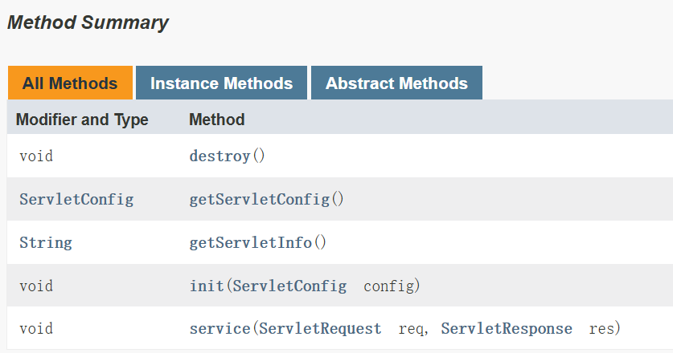
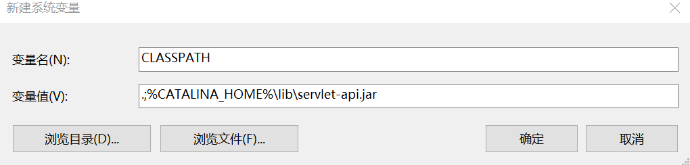
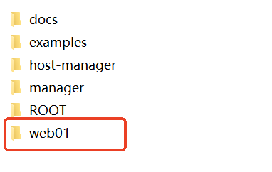
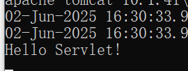
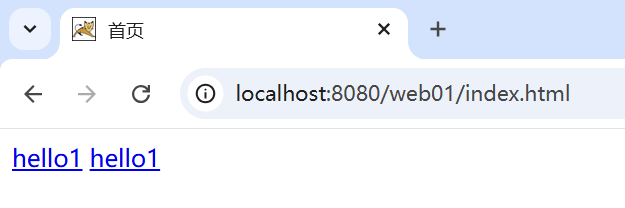
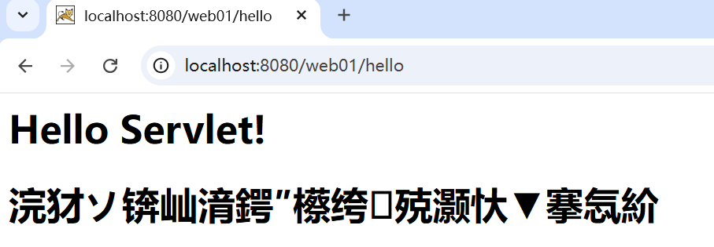

# 开发第一个 Servlet

---

## 创建项目的标准目录

在任意位置创建一个目录 `web01`，作为项目的根目录。然后在该目录下按照以下目录结构创建：

```plain
web01
    |-------WEB-INF
               |-------classes
```


---

## 编写 Servlet

在任意位置创建 `HelloServlet.java`。


任何 `Servlet`都必须实现 `jakarta.servlet.Servlet`接口，该接口中有哪些方法呢？参考帮助文档：



编写 `HelloServlet`实现该接口中所有方法：

```java
package com.jkweilai.servlet;

import jakarta.servlet.Servlet;
import jakarta.servlet.ServletException;
import jakarta.servlet.ServletRequest;
import jakarta.servlet.ServletResponse;
import jakarta.servlet.ServletConfig;
import java.io.PrintWriter;
import java.io.IOException;

public class HelloServlet implements Servlet{

    public void init(ServletConfig config) throws ServletException{}

    public void service(ServletRequest request,ServletResponse response)
        throws ServletException, IOException{
        // 向控制台打印
        System.out.println("Hello Servlet!");
        // 向浏览器上响应HTML
        PrintWriter out = response.getWriter();
        out.print("<h1>Hello Servlet!</h1>");
    }

    public void destroy(){}

    public String getServletInfo(){
        return "";
    }

    public ServletConfig getServletConfig(){
        return null;
    }

}
```

---

## 编译 Servlet

配置环境变量 CLASSPATH：



思考，为什么要配置 CLASSPATH 环境变量，另外环境变量中为什么要添加一个 `.`

编译：


以上编译命令表示：编译当前目录下的 `HelloServlet.java`文件，将编译之后的程序放到当前目录下。

编译之后生成了：


---

## 编译后拷贝到 classes 目录

将以上编译之后的结果拷贝到 `WEB-INF/classes`目录下：


---

## 编写 web.xml 配置

Tomcat 服务器 webapps 目录下自带了几个项目，这些项目当中都有 `web.xml`，可以从这里拷贝样例文件。

在 `web01\WEB-INF\`目录下新建 `web.xml`文件，进行以下的配置：

```xml
<?xml version="1.0" encoding="UTF-8"?>
<web-app xmlns="https://jakarta.ee/xml/ns/jakartaee"
  xmlns:xsi="http://www.w3.org/2001/XMLSchema-instance"
  xsi:schemaLocation="https://jakarta.ee/xml/ns/jakartaee
                      https://jakarta.ee/xml/ns/jakartaee/web-app_6_0.xsd"
  version="6.0"
  metadata-complete="true">

  <servlet>
      <servlet-name>firstServlet</servlet-name>
      <servlet-class>com.jkweilai.servlet.HelloServlet</servlet-class>
  </servlet>
  <servlet-mapping>
      <servlet-name>firstServlet</servlet-name>
      <url-pattern>/hello</url-pattern>
  </servlet-mapping>
  
</web-app>
```

**需要引起注意：**

`**metadata-complete="true"**`：容器忽略所有注解，只使用 web.xml 配置

`**metadata-complete="false"**`**(默认值)：容器会扫描注解**

---

## 部署项目到 Tomcat

将 `web01`目录拷贝到 `CATALINA_HOME/webapps`目录下，如下：



---

## 启动 Tomcat 打开浏览器访问

浏览器上的结果：


控制台的结果：



---

## 使用超链接发送请求

在上面测试时，浏览器地址栏上直接输入的地址是：`http://localhost:8080/web01/hello`，也可以采用用户点击超链接的方式发送请求。在 `web01`目录下新建 `index.html`。然后编写如下代码：

```html
<!DOCTYPE html>
<html lang="zh-CN">
<head>
    <meta charset="UTF-8">
    <meta name="viewport" content="width=device-width, initial-scale=1.0">
    <title>首页</title>
</head>
<body>
  <a href="http://localhost:8080/web01/hello">hello1</a>
  <!--http://ip:port 可以省略。前端编写的路径目前都以 / 开头，并且一定要添加项目名。-->
  <a href="/web01/hello">hello1</a>
</body>
</html>
```

将 `index.html`文件部署到 Tomcat 服务器的 `web01`项目下：


**再次启动服务器测试**

启动 Tomcat 服务器，然后打开浏览器在地址栏上输入：`http://localhost:8080/web01/index.html`



点击以上两个超链接发送请求，结果都是：


**将 index.html 放到 WEB-INF 目录下测试**


启动服务器，打开浏览器，输入地址：`http://localhost:8080/web01/WEB-INF/index.html`，如下：


通过测试得知，放在 WEB-INF 目录下的资源是受保护的。

---

## 响应一段中文到浏览器

修改 `HelloServlet.java`中的代码，响应一段中文到浏览器。修改代码之后，保存，然后重新编译，将新生成的代码重新拷贝到 Tomcat 服务器的 `web01/WEB-INF/classes`目录下，最后启动 Tomcat 服务器，打开浏览器访问。

```java
public void service(ServletRequest request,ServletResponse response)
    throws ServletException, IOException{
    // 向控制台打印
    System.out.println("Hello Servlet!");
    // 向浏览器上响应HTML
    PrintWriter out = response.getWriter();
    out.print("<h1>Hello Servlet!</h1>");
    out.print("<h1>你好，服务器端的小程序！</h1>");
}
```

运行效果：



发现响应中文的时候出现了乱码问题，编写以下代码来解决响应时的中文乱码问题：

```java
public void service(ServletRequest request,ServletResponse response)
    throws ServletException, IOException{
    // 向控制台打印
    System.out.println("Hello Servlet!");
    
    // 向浏览器上响应HTML
    response.setContentType("text/html"); // 设置响应的内容类型，这个对解决响应时的中文乱码问题没有作用。
    response.setCharacterEncoding("UTF-8"); // 设置响应时采用的字符编码方式。这个是解决响应时中文乱码问题的关键。
    
    PrintWriter out = response.getWriter();
    out.print("<h1>Hello Servlet!</h1>");
    out.print("<h1>你好，服务器端的小程序！</h1>");
}
```

重新编译、重新部署、重启服务器访问：


中文乱码问题就解决了。另外，以上解决中文乱码的两行代码：

```java
response.setContentType("text/html");
response.setCharacterEncoding("UTF-8");
```

可以合并为一行：

```java
response.setContentType("text/html;charset=UTF-8");
```

**注意：这行代码必须出现在 **`**PrintWriter out = response.getWriter();**`**之前才能解决乱码问题。**

`****response.setCharacterEncoding("UTF-8");****`****和 HTML 中的****`****<meta charset="UTF-8">****`****有什么区别？****

+ **前者：设置Servlet输出流的字符编码方式，影响**`****PrintWriter****`**如何将Java字符串转换为字节序列，是服务器端的行为，发生在内容发送到客户端之前，会自动设置**`****Content-Type****`**响应头的charset部分，例如：**`****Content-Type: text/html;charset=UTF-8****`**这是最根本的编码设置，决定了数据在传输时的实际编码。**
+ **后者：是HTML文档内部的编码声明，浏览器在解析HTML时会参考这个提示，当HTTP响应头没有指定charset时，浏览器会查找meta标签，如果HTTP头已指定charset，meta标签通常会被忽略。**
