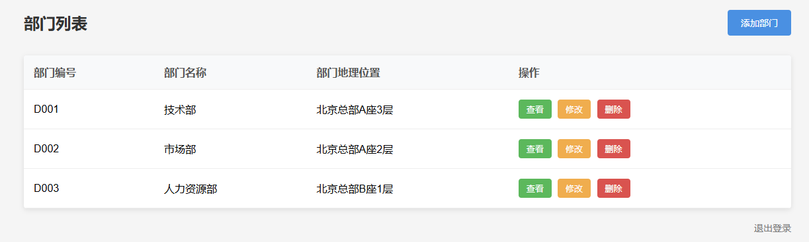
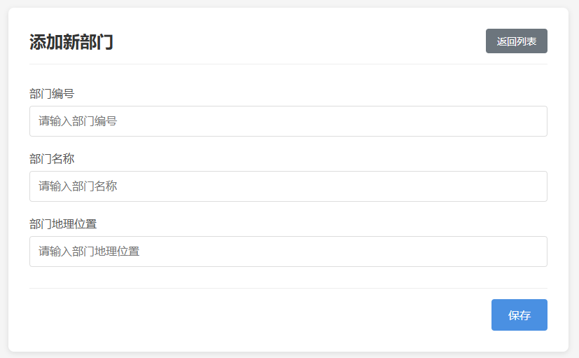
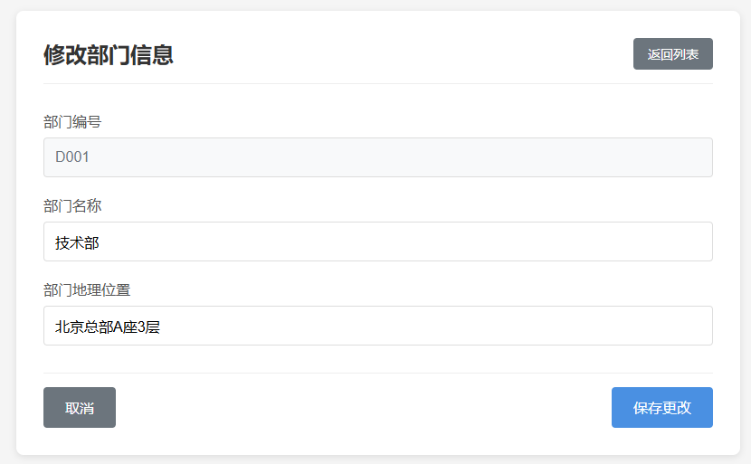
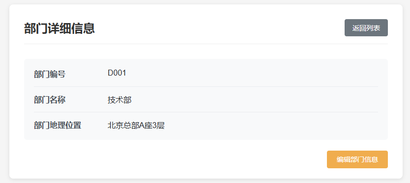

# 开发静态网站

---

## 创建项目

1. 在WEBAPPs下边创建目录 `dept`。`dept`就是项目名，该项目主要完成部门的维护。
2. 在 dept目录下新建 index.html、list.html、add.html、edit.html、detail.html

以下页面是 AI 生成

## index.html

```html
<!DOCTYPE html>
<html lang="zh-CN">
<head>
    <meta charset="UTF-8">
    <meta name="viewport" content="width=device-width, initial-scale=1.0">
    <title>部门管理系统 - 登录</title>
    <style>
        * {
            margin: 0;
            padding: 0;
            box-sizing: border-box;
            font-family: 'Arial', sans-serif;
        }
        body {
            background-color: #f5f5f5;
            display: flex;
            justify-content: center;
            align-items: center;
            height: 100vh;
        }
        .login-container {
            background-color: white;
            padding: 40px;
            border-radius: 8px;
            box-shadow: 0 4px 12px rgba(0, 0, 0, 0.1);
            width: 400px;
        }
        .login-header {
            text-align: center;
            margin-bottom: 30px;
        }
        .login-header h1 {
            color: #333;
            font-size: 24px;
            margin-bottom: 10px;
        }
        .form-group {
            margin-bottom: 20px;
        }
        .form-group label {
            display: block;
            margin-bottom: 8px;
            color: #555;
            font-weight: 500;
        }
        .form-group input {
            width: 100%;
            padding: 12px;
            border: 1px solid #ddd;
            border-radius: 4px;
            font-size: 16px;
            transition: border-color 0.3s;
        }
        .form-group input:focus {
            border-color: #4a90e2;
            outline: none;
        }
        .login-btn {
            width: 100%;
            padding: 12px;
            background-color: #4a90e2;
            color: white;
            border: none;
            border-radius: 4px;
            font-size: 16px;
            cursor: pointer;
            transition: background-color 0.3s;
        }
        .login-btn:hover {
            background-color: #3a7bc8;
        }
        .footer {
            text-align: center;
            margin-top: 20px;
            color: #888;
            font-size: 14px;
        }
    </style>
</head>
<body>
    <div class="login-container">
        <div class="login-header">
            <h1>部门管理系统</h1>
            <p>请输入您的凭据以继续</p>
        </div>
        <form action="/dept/list.html" method="get">
            <div class="form-group">
                <label for="username">用户名</label>
                <input type="text" id="username" name="username" placeholder="请输入用户名" required>
            </div>
            <div class="form-group">
                <label for="password">密码</label>
                <input type="password" id="password" name="password" placeholder="请输入密码" required>
            </div>
            <button type="submit" class="login-btn">登录</button>
        </form>
        <div class="footer">
            <p>© 2025 部门管理系统 - 版权所有</p>
        </div>
    </div>
</body>
</html>
```


### list.html

```HTML
<!DOCTYPE html>
<html lang="zh-CN">
<head>
    <meta charset="UTF-8">
    <meta name="viewport" content="width=device-width, initial-scale=1.0">
    <title>部门管理系统 - 部门列表</title>
    <style>
        * {
            margin: 0;
            padding: 0;
            box-sizing: border-box;
            font-family: 'Arial', sans-serif;
        }
        body {
            background-color: #f5f5f5;
        }
        .container {
            max-width: 1200px;
            margin: 0 auto;
            padding: 20px;
        }
        .header {
            display: flex;
            justify-content: space-between;
            align-items: center;
            margin-bottom: 30px;
        }
        .header h1 {
            color: #333;
            font-size: 24px;
        }
        .add-btn {
            padding: 10px 20px;
            background-color: #4a90e2;
            color: white;
            border: none;
            border-radius: 4px;
            cursor: pointer;
            text-decoration: none;
            font-size: 14px;
            transition: background-color 0.3s;
        }
        .add-btn:hover {
            background-color: #3a7bc8;
        }
        .department-table {
            width: 100%;
            border-collapse: collapse;
            background-color: white;
            box-shadow: 0 2px 8px rgba(0, 0, 0, 0.1);
            border-radius: 4px;
            overflow: hidden;
        }
        .department-table th, .department-table td {
            padding: 15px;
            text-align: left;
            border-bottom: 1px solid #eee;
        }
        .department-table th {
            background-color: #f8f9fa;
            font-weight: 600;
            color: #555;
        }
        .department-table tr:hover {
            background-color: #f8f9fa;
        }
        .action-btn {
            padding: 6px 12px;
            margin-right: 5px;
            border: none;
            border-radius: 4px;
            cursor: pointer;
            font-size: 13px;
            transition: all 0.3s;
            text-decoration: none;
            display: inline-block;
        }
        .view-btn {
            background-color: #5cb85c;
            color: white;
        }
        .view-btn:hover {
            background-color: #4cae4c;
        }
        .edit-btn {
            background-color: #f0ad4e;
            color: white;
        }
        .edit-btn:hover {
            background-color: #eea236;
        }
        .delete-btn {
            background-color: #d9534f;
            color: white;
        }
        .delete-btn:hover {
            background-color: #d43f3a;
        }
        .logout {
            text-align: right;
            margin-top: 20px;
        }
        .logout a {
            color: #777;
            text-decoration: none;
            font-size: 14px;
        }
        .logout a:hover {
            color: #333;
        }
    </style>
</head>
<body>
    <div class="container">
        <div class="header">
            <h1>部门列表</h1>
            <a href="/dept/add.html" class="add-btn">添加部门</a>
        </div>
        
        <table class="department-table">
            <thead>
                <tr>
                    <th>部门编号</th>
                    <th>部门名称</th>
                    <th>部门地理位置</th>
                    <th>操作</th>
                </tr>
            </thead>
            <tbody>
                <tr>
                    <td>D001</td>
                    <td>技术部</td>
                    <td>北京总部A座3层</td>
                    <td>
                        <a href="/dept/detail.html" class="action-btn view-btn">查看</a>
                        <a href="/dept/edit.html" class="action-btn edit-btn">修改</a>
                        <a href="#" class="action-btn delete-btn" onclick="">删除</a>
                    </td>
                </tr>
                <tr>
                    <td>D002</td>
                    <td>市场部</td>
                    <td>北京总部A座2层</td>
                    <td>
                        <a href="/dept/detail.html" class="action-btn view-btn">查看</a>
                        <a href="/dept/edit.html" class="action-btn edit-btn">修改</a>
                        <a href="#" class="action-btn delete-btn" onclick="">删除</a>
                    </td>
                </tr>
                <tr>
                    <td>D003</td>
                    <td>人力资源部</td>
                    <td>北京总部B座1层</td>
                    <td>
                        <a href="/dept/detail.html" class="action-btn view-btn">查看</a>
                        <a href="/dept/edit.html" class="action-btn edit-btn">修改</a>
                        <a href="#" class="action-btn delete-btn" onclick="">删除</a>
                    </td>
                </tr>
            </tbody>
        </table>
        
        <div class="logout">
            <a href="/index.html">退出登录</a>
        </div>
    </div>
</body>
</html>
```



### add.html

```HTML
<!DOCTYPE html>
<html lang="zh-CN">
<head>
    <meta charset="UTF-8">
    <meta name="viewport" content="width=device-width, initial-scale=1.0">
    <title>部门管理系统 - 添加部门</title>
    <style>
        * {
            margin: 0;
            padding: 0;
            box-sizing: border-box;
            font-family: 'Arial', sans-serif;
        }
        body {
            background-color: #f5f5f5;
        }
        .container {
            max-width: 800px;
            margin: 30px auto;
            padding: 30px;
            background-color: white;
            border-radius: 8px;
            box-shadow: 0 2px 8px rgba(0, 0, 0, 0.1);
        }
        .header {
            display: flex;
            justify-content: space-between;
            align-items: center;
            margin-bottom: 30px;
            padding-bottom: 15px;
            border-bottom: 1px solid #eee;
        }
        .header h1 {
            color: #333;
            font-size: 24px;
        }
        .back-btn {
            padding: 8px 16px;
            background-color: #6c757d;
            color: white;
            border: none;
            border-radius: 4px;
            cursor: pointer;
            text-decoration: none;
            font-size: 14px;
            transition: background-color 0.3s;
        }
        .back-btn:hover {
            background-color: #5a6268;
        }
        .form-group {
            margin-bottom: 20px;
        }
        .form-group label {
            display: block;
            margin-bottom: 8px;
            color: #555;
            font-weight: 500;
        }
        .form-group input, .form-group select {
            width: 100%;
            padding: 12px;
            border: 1px solid #ddd;
            border-radius: 4px;
            font-size: 16px;
            transition: border-color 0.3s;
        }
        .form-group input:focus, .form-group select:focus {
            border-color: #4a90e2;
            outline: none;
        }
        .submit-btn {
            padding: 12px 24px;
            background-color: #4a90e2;
            color: white;
            border: none;
            border-radius: 4px;
            cursor: pointer;
            font-size: 16px;
            transition: background-color 0.3s;
        }
        .submit-btn:hover {
            background-color: #3a7bc8;
        }
        .footer {
            text-align: right;
            margin-top: 30px;
            padding-top: 15px;
            border-top: 1px solid #eee;
        }
    </style>
</head>
<body>
    <div class="container">
        <div class="header">
            <h1>添加新部门</h1>
            <a href="/dept/list.html" class="back-btn">返回列表</a>
        </div>
        
        <form action="/dept/list.html" method="get">
            <div class="form-group">
                <label for="deptId">部门编号</label>
                <input type="text" id="deptId" name="deptId" placeholder="请输入部门编号" required>
            </div>
            <div class="form-group">
                <label for="deptName">部门名称</label>
                <input type="text" id="deptName" name="deptName" placeholder="请输入部门名称" required>
            </div>
            <div class="form-group">
                <label for="location">部门地理位置</label>
                <input type="text" id="location" name="location" placeholder="请输入部门地理位置" required>
            </div>
            
            <div class="footer">
                <button type="submit" class="submit-btn">保存</button>
            </div>
        </form>
    </div>
</body>
</html>
```



### edit.html

```HTML
<!DOCTYPE html>
<html lang="zh-CN">
<head>
    <meta charset="UTF-8">
    <meta name="viewport" content="width=device-width, initial-scale=1.0">
    <title>部门管理系统 - 修改部门</title>
    <style>
        * {
            margin: 0;
            padding: 0;
            box-sizing: border-box;
            font-family: 'Arial', sans-serif;
        }
        body {
            background-color: #f5f5f5;
        }
        .container {
            max-width: 800px;
            margin: 30px auto;
            padding: 30px;
            background-color: white;
            border-radius: 8px;
            box-shadow: 0 2px 8px rgba(0, 0, 0, 0.1);
        }
        .header {
            display: flex;
            justify-content: space-between;
            align-items: center;
            margin-bottom: 30px;
            padding-bottom: 15px;
            border-bottom: 1px solid #eee;
        }
        .header h1 {
            color: #333;
            font-size: 24px;
        }
        .back-btn {
            padding: 8px 16px;
            background-color: #6c757d;
            color: white;
            border: none;
            border-radius: 4px;
            cursor: pointer;
            text-decoration: none;
            font-size: 14px;
            transition: background-color 0.3s;
        }
        .back-btn:hover {
            background-color: #5a6268;
        }
        .form-group {
            margin-bottom: 20px;
        }
        .form-group label {
            display: block;
            margin-bottom: 8px;
            color: #555;
            font-weight: 500;
        }
        .form-group input, .form-group select {
            width: 100%;
            padding: 12px;
            border: 1px solid #ddd;
            border-radius: 4px;
            font-size: 16px;
            transition: border-color 0.3s;
        }
        .form-group input:focus, .form-group select:focus {
            border-color: #4a90e2;
            outline: none;
        }
        .form-group input[readonly] {
            background-color: #f8f9fa;
            color: #6c757d;
        }
        .btn-group {
            display: flex;
            justify-content: space-between;
            margin-top: 30px;
            padding-top: 15px;
            border-top: 1px solid #eee;
        }
        .submit-btn {
            padding: 12px 24px;
            background-color: #4a90e2;
            color: white;
            border: none;
            border-radius: 4px;
            cursor: pointer;
            font-size: 16px;
            transition: background-color 0.3s;
        }
        .submit-btn:hover {
            background-color: #3a7bc8;
        }
        .cancel-btn {
            padding: 12px 24px;
            background-color: #6c757d;
            color: white;
            border: none;
            border-radius: 4px;
            cursor: pointer;
            font-size: 16px;
            transition: background-color 0.3s;
            text-decoration: none;
        }
        .cancel-btn:hover {
            background-color: #5a6268;
        }
    </style>
</head>
<body>
    <div class="container">
        <div class="header">
            <h1>修改部门信息</h1>
            <a href="/dept/list.html" class="back-btn">返回列表</a>
        </div>
        
        <form action="/dept/list.html" method="get">
            <div class="form-group">
                <label for="deptId">部门编号</label>
                <input type="text" id="deptId" name="deptId" value="D001" readonly>
            </div>
            <div class="form-group">
                <label for="deptName">部门名称</label>
                <input type="text" id="deptName" name="deptName" value="技术部" required>
            </div>
            <div class="form-group">
                <label for="location">部门地理位置</label>
                <input type="text" id="location" name="location" value="北京总部A座3层" required>
            </div>
            
            <div class="btn-group">
                <a href="/dept/list.html" class="cancel-btn">取消</a>
                <button type="submit" class="submit-btn">保存更改</button>
            </div>
        </form>
    </div>
</body>
</html>
```



### detail.html

```HTML
<!DOCTYPE html>
<html lang="zh-CN">
<head>
    <meta charset="UTF-8">
    <meta name="viewport" content="width=device-width, initial-scale=1.0">
    <title>部门管理系统 - 部门详情</title>
    <style>
        * {
            margin: 0;
            padding: 0;
            box-sizing: border-box;
            font-family: 'Arial', sans-serif;
        }
        body {
            background-color: #f5f5f5;
        }
        .container {
            max-width: 800px;
            margin: 30px auto;
            padding: 30px;
            background-color: white;
            border-radius: 8px;
            box-shadow: 0 2px 8px rgba(0, 0, 0, 0.1);
        }
        .header {
            display: flex;
            justify-content: space-between;
            align-items: center;
            margin-bottom: 30px;
            padding-bottom: 15px;
            border-bottom: 1px solid #eee;
        }
        .header h1 {
            color: #333;
            font-size: 24px;
        }
        .back-btn {
            padding: 8px 16px;
            background-color: #6c757d;
            color: white;
            border: none;
            border-radius: 4px;
            cursor: pointer;
            text-decoration: none;
            font-size: 14px;
            transition: background-color 0.3s;
        }
        .back-btn:hover {
            background-color: #5a6268;
        }
        .detail-card {
            padding: 20px;
            border-radius: 6px;
            background-color: #f8f9fa;
        }
        .detail-row {
            display: flex;
            margin-bottom: 15px;
            padding-bottom: 15px;
            border-bottom: 1px solid #e9ecef;
        }
        .detail-row:last-child {
            margin-bottom: 0;
            padding-bottom: 0;
            border-bottom: none;
        }
        .detail-label {
            width: 150px;
            font-weight: 600;
            color: #495057;
        }
        .detail-value {
            flex: 1;
            color: #212529;
        }
        .action-btns {
            margin-top: 30px;
            text-align: right;
        }
        .edit-btn {
            padding: 10px 20px;
            background-color: #f0ad4e;
            color: white;
            border: none;
            border-radius: 4px;
            cursor: pointer;
            text-decoration: none;
            font-size: 14px;
            transition: background-color 0.3s;
        }
        .edit-btn:hover {
            background-color: #eea236;
        }
    </style>
</head>
<body>
    <div class="container">
        <div class="header">
            <h1>部门详细信息</h1>
            <a href="/dept/list.html" class="back-btn">返回列表</a>
        </div>
        
        <div class="detail-card">
            <div class="detail-row">
                <div class="detail-label">部门编号</div>
                <div class="detail-value">D001</div>
            </div>
            <div class="detail-row">
                <div class="detail-label">部门名称</div>
                <div class="detail-value">技术部</div>
            </div>
            <div class="detail-row">
                <div class="detail-label">部门地理位置</div>
                <div class="detail-value">北京总部A座3层</div>
            </div>
        </div>
        
        <div class="action-btns">
            <a href="/dept/edit.html" class="edit-btn">编辑部门信息</a>
        </div>
    </div>
</body>
</html>
```



---

## 部署项目

部署就是将开发的项目拷贝到 `CATALINA_HOME/webapps`目录下，将 `dept`目录拷贝到该目录下。


---

## 启动 Tomcat 打开浏览器访问

访问地址分别如下：

1. http://localhost:8080/dept/index.html
2. http://localhost:8080/dept/list.html
3. http://localhost:8080/dept/add.html
4. http://localhost:8080/dept/edit.html
5. http://localhost:8080/dept/detail.html

值得思考的问题

+ **第一个问题**：直接找到 html 文件，鼠标双击，直接采用浏览器打开不就行了吗？为什么还要安装 Tomcat 服务器，又是开发，又是部署的，还得打开浏览器输入 URL 地址，多麻烦呀！你看呢？
+ **第二个问题**：这些页面目前都是静态的，我们怎么能让页面变成动态网页，这里所说的动态网页不是说页面中有 flash 动画，指的是页面中的数据是动态的，假设数据库表中有 10 条记录，则部门列表页面显示 10 个部门信息。如果有 100 条则页面也显示 100 条。这就需要编写 Java 程序了，让 Java 程序去连接数据库，动态查询数据就搞定了，那么这个服务器端的 Java 程序通常被我们称为 Servlet。（Servlet：Server Applet 表示服务器端的 Java 小程序。）
