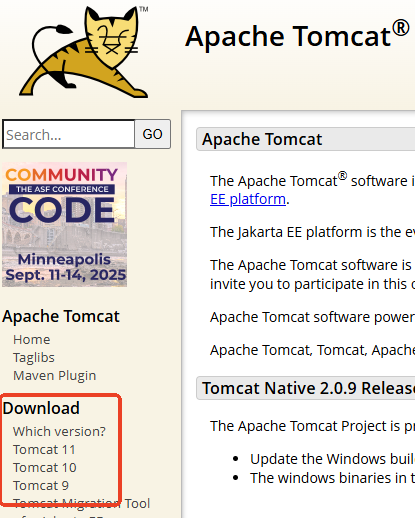
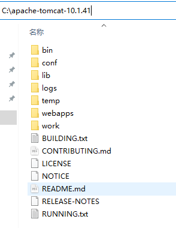
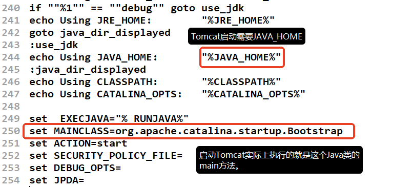
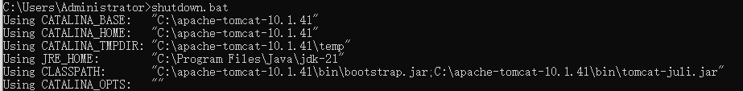

# tomcat windows install
---

## Tomcat 普通下载与安装

 Tomcat 的官网地址：<https://tomcat.apache.org/>

`Maven`也是 Apache 的子项目，它的官网地址是：<https://maven.apache.org/>

我们这里把 Tomcat 服务器以及 Tomcat 服务器的源码全部下载下来：

解压就是安装，直接将解压到没有中文的路径中，我这里解压到 `C 盘`的根目录下。

打开 Tomcat 服务器的根目录，如下：

---

## Tomcat 配置

### 配置哪些环境变量

Tomcat 服务器是纯 Java 语言实现的。

启动 Tomcat 服务器时，需要执行 `bin`目录下的 `startup.bat`**（bat 文件是 windows 批处理文件，可批量执行 dos 命令）**，用文本编辑器打开 `startup.bat`文件，可以搜索 `CATALINA_HOME`：

在 windows 环境中，取环境变量值的语法是 `**%变量名%**`，因此 `CATALINA_HOME`这个环境变量是**必须要配置的**，如果没有配置会导致 Tomcat 服务器启动失败。

并且通过以上命令可以看出：当我们执行 `startup.bat`的时候，会自动去找 `catalina.bat`文件。我们再使用文本编辑器将 `catalina.bat`打开，可以搜索 `JAVA_HOME`：

通过以上内容可以看出 `JAVA_HOME`环境变量也是必须配置的，如果不配置则无法启动 Tomcat。

Tomcat 服务器是纯 Java 语言实现的，启动 Tomcat 服务器实质上就是执行某个类的 main 方法。

因此要启动 Tomcat 服务器有两个环境变量是必须要配置的：

- JAVA_HOME=JDK 的根
- CATALINA_HOME=**Tomcat 的根**

另外为了能够在 dos 命令窗口的任意位置都能启动和关闭 Tomcat 服务器，还需要将 `CATALINA_HOME\bin`目录配置到 `PATH`环境变量中，但这不是必须的：

- PATH=%CATALINA_HOME%\bin

### JAVA_HOME 配置

此电脑-->右键-->属性-->高级系统设置-->环境变量

### CATALINA_HOME 配置

### PATH 配置

---

## Tomcat 启动和关闭

### 启动

windows 环境中执行 startup.bat 来启动 Tomcat：

以上的控制台窗口中会显示 Tomcat 服务器运行过程中打印的日志信息。

Tomcat 服务器运行期间这个控制台窗口不能关闭。

### 关闭

windows 环境中执行 shutdown.bat 来关闭 Tomcat：

执行该命令后，之前的控制台窗口会关闭，Tomcat 服务器退出。

日志信息乱码可以通过修改配置文件来解决，打开 `CATALINA_HOME/conf/logging.properties`，将 `UTF-8`修改为 `GBK`，如下：

重新启动 Tomcat，查看控制台，乱码已解决：

### 测试

打开浏览器，在浏览器地址栏上输入：[http://localhost:8080](http://localhost:8080/)，你将看到以下页面：

提醒：`127.0.0.1`和 `localhost`都表示本机。