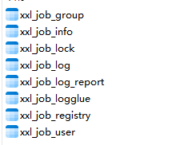
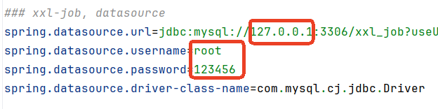
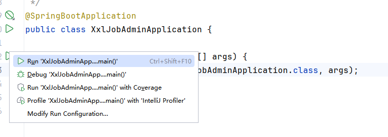
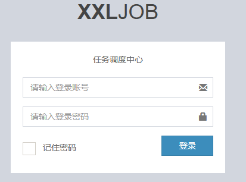

# 调度中心部署

1. 简单来讲，就是xxl-job需要配套一个调度中心，这是一个springboot项目，自己写的程序的任务发到这个调度中心上来，调度中心是一个独立的服务器。
2. 首先去下载源码
    1. 官网：<https://www.xuxueli.com/index.html>
    2. gihtub：<https://github.com/xuxueli/xxl-job>
3. 然后去运行源码里边的数据库初始化脚本
4. 配置源码里边的xxl-job-admin模块，注意改一下端口（默认是8080，比如改成9090），还有数据库密码。
5. 访问<http://127.0.0.1:9090/xxl-job-admin>即可进入调度中心管理系统。

---

## 源码下载

gitee地址：[https://gitee.com/xuxueli0323/xxl-job](https://gitee.com/xuxueli0323/xxl-job)

下载后解压：

---

## 初始化“调度数据库”

sql脚本位置：/xxl-job/doc/db/tables_xxl_job.sql

执行该sql脚本：

---

## 编译源码

将前面下载的源码导入到 IDEA 工具中进行编译。具体操作如下：

1. 将项目拷贝到IDEA的工作目录下。
2. 使用IDEA将这个工程打开即可。

官方解释：

---

## 配置部署“调度中心”

调度中心项目：xxl-job-admin

### 调度中心配置

调度中心配置文件地址：/xxl-job/xxl-job-admin/src/main/resources/application.properties

该配置文件当下需要重点修改一下`数据源`的配置。主要修改：url、username、password。

然后再配置 IDEA 的 Maven，下载项目的 Maven 依赖。

### 执行Spring Boot入口程序

### 访问“调度中心”

调度中心访问地址：[http://localhost:8080/xxl-job-admin](http://localhost:8080/xxl-job-admin) (该地址执行器将会使用到，作为回调地址)

默认登录账号 “admin/123456”, 登录后运行界面如下图所示：

