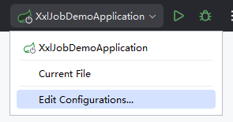
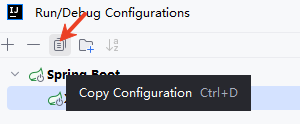
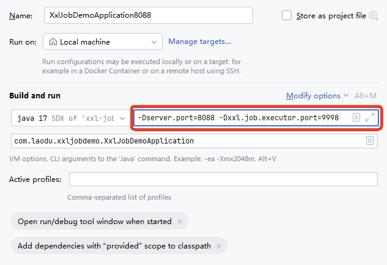
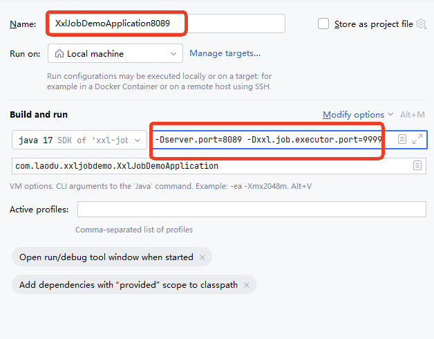
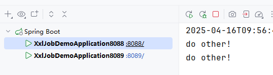
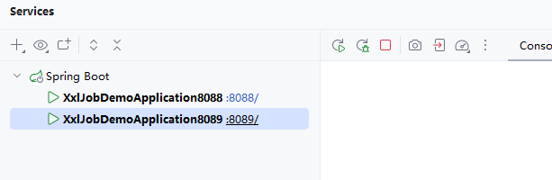
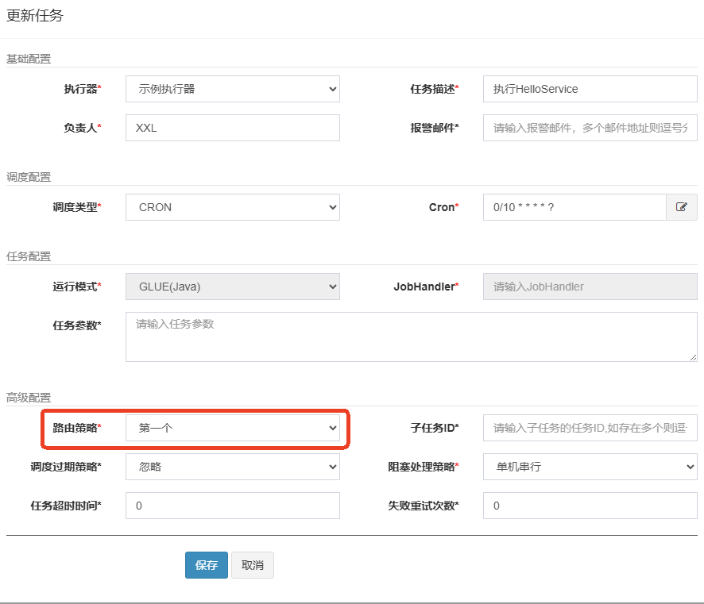
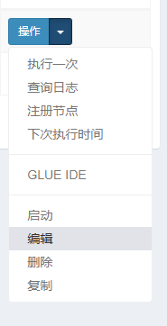
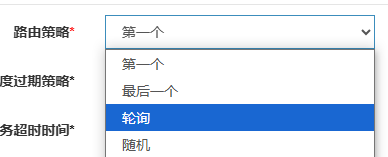

# 集群环境下任务不会重复执行

---

## 创建应用副本

创建应用副本是为了搭建一个集群的环境：

---

## 不同应用配置不同端口

配置第一个应用的服务器端口8088和执行器端口9998：

`-Dserver.port=8088 -Dxxl.job.executor.port=9998`

配置第二个应用的服务器端口8089和执行器端口9999：

`**-Dserver.port=8089 -Dxxl.job.executor.port=9999**`

启动两个应用：

---

## 测试集群环境下是否会重复执行任务

在`调度中心`启动任务，查看这两个应用有没有重复执行任务。

可以看到，任务只在第一个应用中执行，并不会重复执行任务。

---

## 路由策略

**为什么只会在第一个应用中执行呢？**

这是由`路由策略`所决定的。如下图，在调度中心的任务编辑页面可以看到路由策略的选择，默认选择的是`第一个`:

**所有的路由策略包括：**

**每个路由策略什么含义？**

1. 第一个：直接选任务列表里的第一个机器干活。  
2. 最后一个：直接选任务列表里的最后一个机器干活。  
3. 轮询：轮流让每台机器干活，大家排队，一人一次。  
4. 随机：随便抽一台机器干活，全凭运气。  
5. 一致性HASH：同样的任务永远找同一台机器干，避免换来换去。  
6. 最不经常使用：挑平时干活最少的机器去干，雨露均沾。  
7. 最近最久未使用：挑最闲的机器（好久没干活的）去干。  
8. 故障转移：如果一台机器挂了，自动换另一台好的继续干。  
9. 忙碌转移：如果一台机器正忙着，就找其他闲着的机器干。  
10. 分片广播：让所有机器一起干同一个活，各自分一小块任务。

尝试将路由策略修改为轮询，看看是否两个应用交替执行任务：

停止任务：

编辑任务：

路由策略选择轮询：

启动任务：

查看控制台：

可以看到，确实采用轮询的方式交替执行任务。

