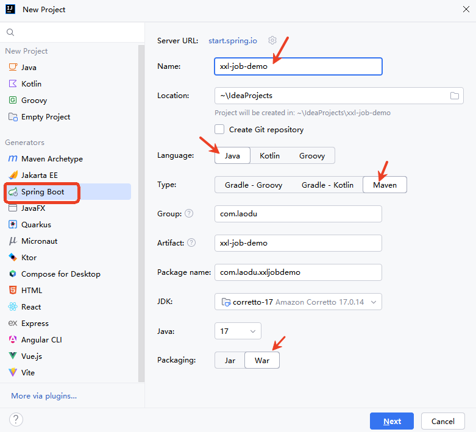
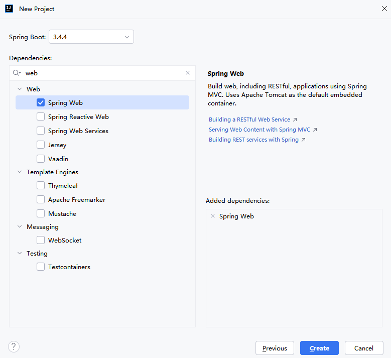

# 配置部署“执行器项目”

1. 简单来说，就是在自己的项目里边定义好任务是怎么做的，在调度中心里边就去添加对这个任务的调度。
2. 首先，本地创建springboot项目，然后引入maven坐标
3. 创建config类读取，propoties里边配置好调度中心的网址，本地项目的port
4. 创建任务处理类，定义任务的具体内容。
5. 在调度中心添加任务

---

## 创建Spring Boot项目



添加`Spring Web`依赖：



添加`xxl-job-core`公共依赖：

```xml
<dependency>
  <groupId>com.xuxueli</groupId>
  <artifactId>xxl-job-core</artifactId>
  <version>3.0.0</version>
</dependency>
```

---

## 执行器项目的配置文件

执行器项目的配置文件`application.properties`

```properties
### 调度中心部署根地址 [选填]：执行器通过这个地址通知调度中心任务的执行结果
xxl.job.admin.addresses=http://127.0.0.1:8080/xxl-job-admin

### 调度中心通讯TOKEN [选填]：非空时启用；
xxl.job.admin.accessToken=default_token

### 执行器连接调度中心时的超时时间
xxl.job.admin.timeout=3

### 执行器AppName [选填]
xxl.job.executor.appname=xxl-job-executor-sample

### 告诉调度中心，我执行器所在的地址。
xxl.job.executor.address=

### 执行器IP 
xxl.job.executor.ip=127.0.0.1

### 执行器端口号
xxl.job.executor.port=9999

### 执行器运行日志文件存储磁盘路径 [选填]
xxl.job.executor.logpath=/data/applogs/xxl-job/jobhandler

### 执行器日志文件保存天数 [选填]
xxl.job.executor.logretentiondays=30

server.port=8088
```

注意：最好配置上`server.port=8088`，因为调度中心已经将8080占用了。

---

## 执行器组件配置

编写一个配置类，来进行执行器组件的配置：

```java
@Configuration
public class XxlJobConfig {
    @Value("${xxl.job.admin.addresses}")
    private String adminAddresses;

    @Value("${xxl.job.admin.accessToken}")
    private String accessToken;

    @Value("${xxl.job.executor.appname}")
    private String appname;

    @Value("${xxl.job.executor.address}")
    private String address;

    @Value("${xxl.job.executor.ip}")
    private String ip;

    @Value("${xxl.job.executor.port}")
    private int port;

    @Value("${xxl.job.executor.logpath}")
    private String logPath;

    @Value("${xxl.job.executor.logretentiondays}")
    private int logRetentionDays;

    // 将执行器对象纳入IoC容器
    @Bean
    public XxlJobSpringExecutor xxlJobExecutor() {
        XxlJobSpringExecutor xxlJobSpringExecutor = new XxlJobSpringExecutor();
        xxlJobSpringExecutor.setAdminAddresses(adminAddresses);
        xxlJobSpringExecutor.setAccessToken(accessToken);
        xxlJobSpringExecutor.setAppname(appname);
        xxlJobSpringExecutor.setAddress(address);
        xxlJobSpringExecutor.setIp(ip);
        xxlJobSpringExecutor.setPort(port);
        xxlJobSpringExecutor.setLogPath(logPath);
        xxlJobSpringExecutor.setLogRetentionDays(logRetentionDays);
        return xxlJobSpringExecutor;
    }
}

```

---

## 添加任务处理类

```java
@Component
public class SimpleXxlJob {
    @XxlJob("demoJobHandler")
    public void demoJobHandler() throws Exception{
        System.out.println("执行定时任务，执行时间：" + new Date());
    }
}
```

执行Spring Boot项目入口程序，打开浏览器，访问调度中心，点击执行器管理，可以看到有一个执行器，如下图：


