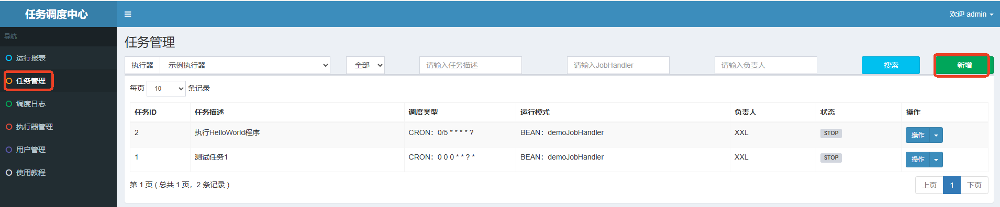
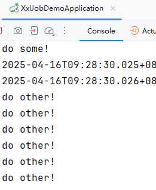

# GLUE模式运行

1. 简单来说，就是使用GLUE模式创建任务。
2. 在自己的项目中的方法不需要`@XxlJob`了。
3. 在调度中心，需要去这个任务的在线ide中编写java函数，去调用到自己项目中的方法。

---

GLUE模式可以达到的效果是：采用在线编写代码的方式，在不需要重启服务器的前提下，动态添加/变更执行的任务。

在`执行器项目`中添加如下类和方法：

```java
@Service
public class HelloService {
    public void doSome(){
        System.out.println("do some!");
    }
    public void doOther(){
        System.out.println("do other!");
    }
}
```

重启服务器，让以上添加的代码生效。这一点岂不是和我们上面所描述的“不需要重启服务器”不一致了？这其实说的并不是一码事！！！！！服务器端的代码添加了/修改了，是一定要重启服务器的，不重新编译、发布，代码怎么可能生效呢。我们上面所说的“不需要重启服务器”指的是，在调度中心修改具体的任务的代码是不需要重启服务器的！！！

在`调度中心`中在线编写代码，动态添加任务，并且不需要重启服务器：

**新增任务：**



**运行模式选择：GLUE(Java)**


**使用GLUE IDE编写Java代码：**


编写代码，导入`Autowired`和`HelloService`

```java
package com.xxl.job.service.handler;

import com.xxl.job.core.context.XxlJobHelper;
import com.xxl.job.core.handler.IJobHandler;
import org.springframework.beans.factory.annotation.Autowired;
import com.example.demo.job.HelloService;

public class DemoGlueJobHandler extends IJobHandler {
  
    @Autowired
    private HelloService helloService;
    
    @Override
    public void execute() throws Exception {
        helloService.doSome();
    }
}
```

**保存/发布：**


**开启任务：**


再次修改代码，不需要停止任务，不需要重启服务器：


```java
package com.xxl.job.service.handler;

import com.xxl.job.core.context.XxlJobHelper;
import com.xxl.job.core.handler.IJobHandler;
import org.springframework.beans.factory.annotation.Autowired;
import com.example.demo.job.HelloService;

public class DemoGlueJobHandler extends IJobHandler {
  
    @Autowired
    private HelloService helloService;
    
    @Override
    public void execute() throws Exception {
        helloService.doOther();
    }
}
```

**保存/发布，查看控制台：**



通过以上的测试可以看出，当我们使用`XXL-JOB`的时候，任务修改不需要重启服务器。

