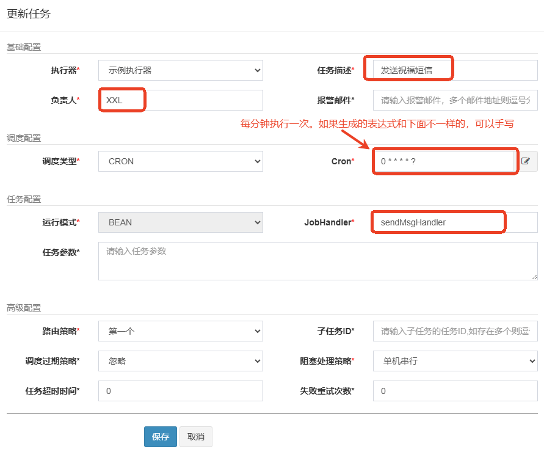
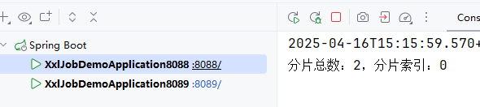
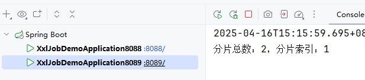
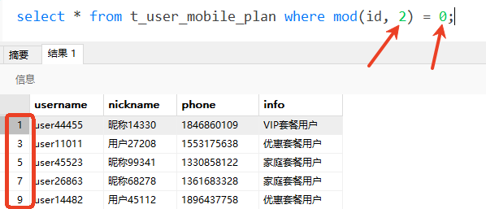
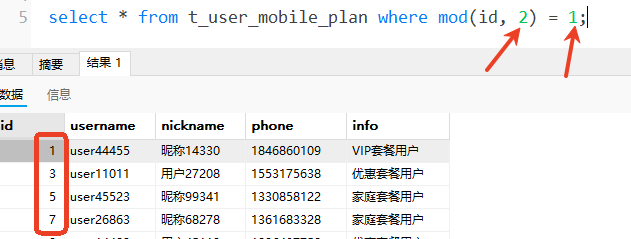
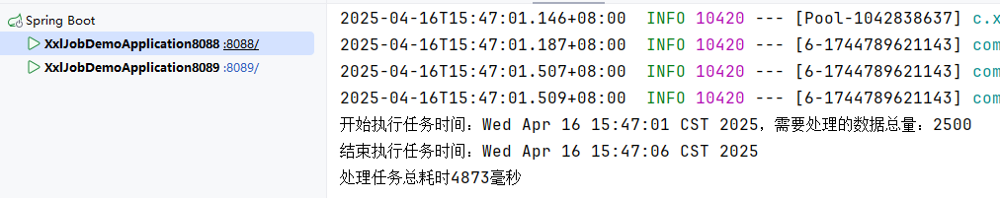
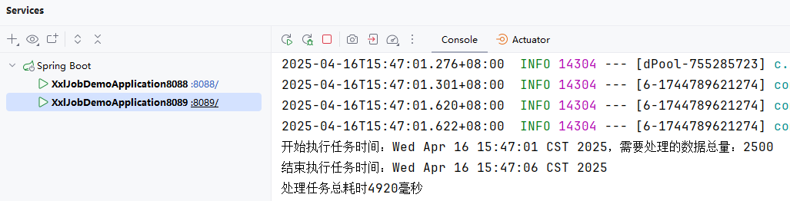

# 分片功能实现

需求：在指定的节假日，需要给平台所有用户发送祝福的短信

---

## 初始化数据

1. 执行`xxl-job-demo.sql`脚本完成数据初始化。（[脚本](../assets/xxl-job-demo.sql)）
2. 新建数据库`xxl-job-demo`
3. 执行SQL脚本

---

## 添加依赖

```xml
<!--mybatis依赖-->
<dependency>
  <groupId>org.mybatis.spring.boot</groupId>
  <artifactId>mybatis-spring-boot-starter</artifactId>
  <version>3.0.4</version>
</dependency>
<!--mysql依赖-->
<dependency>
  <groupId>com.mysql</groupId>
  <artifactId>mysql-connector-j</artifactId>
  <scope>runtime</scope>
</dependency>
<!--lombok依赖-->
<dependency>
  <groupId>org.projectlombok</groupId>
  <artifactId>lombok</artifactId>
  <optional>true</optional>
</dependency>
```

---

## 添加数据源配置

```properties
spring.datasource.type=com.zaxxer.hikari.HikariDataSource
spring.datasource.driver-class-name=com.mysql.cj.jdbc.Driver
spring.datasource.url=jdbc:mysql://localhost:3306/xxl_job_demo
spring.datasource.username=root
spring.datasource.password=123456
```

---

## 编写po

```java
import lombok.Data;

@Data
public class UserMobilePlan {
    // 主键
    private Long id;
    // 用户名
    private String username;
    // 昵称
    private String nickname;
    // 手机号码
    private String phone;
    // 备注
    private String info;
}
```

---

## 编写Mapper

```java
package com.laodu.xxljobdemo.mapper;

import com.laodu.xxljobdemo.model.po.UserMobilePlan;
import org.apache.ibatis.annotations.Select;

import java.util.List;

public interface UserMobilePlanMapper {

    @Select("select * from t_user_mobile_plan")
    List<UserMobilePlan> selectAll();
}
```

---

## 业务功能实现

添加发送短信的任务：

```java
package com.example.demo.job;  
  
import com.example.demo.mapper.UserMobilePlanMapper;  
import com.example.demo.po.UserMobilePlan;  
import com.xxl.job.core.handler.annotation.XxlJob;  
import lombok.RequiredArgsConstructor;  
import org.springframework.stereotype.Component;  
  
import java.util.Date;  
import java.util.List;  
import java.util.concurrent.TimeUnit;  
  
@Component  
@RequiredArgsConstructor  
public class ChipXxlJob {  
    private final UserMobilePlanMapper userMobilePlanMapper;  
  
    @XxlJob("sendMsgHandler")  
    public void sendMsgHandler(){  
        List<UserMobilePlan> userMobilePlans = userMobilePlanMapper.selectAll();  
        System.out.println("任务开始时间：" + new Date() + "，要处理的任务数量：" + userMobilePlans.size());  
        long begin = System.currentTimeMillis();  
        userMobilePlans.forEach(item -> {  
            try {  
                // 模拟发送短信的动作  
                TimeUnit.MICROSECONDS.sleep(10);  
            } catch (InterruptedException e) {  
                throw new RuntimeException(e);  
            }  
        });  
        System.out.println("任务结束时间：" + new Date());  
        long end = System.currentTimeMillis();  
        System.out.println("任务耗时：" + (end - begin) + "毫秒");  
    }  
}
```

---

## 添加Mapper扫描


---

## 在调度中心上添加任务




启动任务，执行效果：


---

## 分片方式执行任务

我们上面说到路由策略，其中有一个路由策略叫做`分片广播`。

分片广播：让所有机器一起干同一个活，各自分一小块任务。

目的是提升效率，我们上面实现的功能是单机方式完成功能，耗时在10s左右。我们可以使用分片广播方式来提升效率。

在分片广播方面涉及到两个概念：

1. 分片总数：一共有多少台
2. 分片索引：当前这台机器的下标（下标从0开始）

并且在Java程序中，是可以通过以下代码来获取分片总数和分片索引的：


编写了以上的代码之后，在调度中心将任务的路由策略修改为：分片广播


然后启动任务，查看后台输出，可以看到分片总数以及分片索引：





我们可以通过分片总数和分片索引来完成分片执行，对应的SQL语句如下：

```sql
select * from t_user_mobile_plan where mod(id, 分片总数) = 分片索引;
```





这样的话，数据就可以平均分配到不同的机器上执行。

接下来，我们编写代码来实现一下：

首先，要在mapper中添加一个方法，如下：

```java
@Select("select * from t_user_mobile_plan where mod(id, #{shardTotal}) = #{shardIndex}")
List<UserMobilePlan> selectByMod(@Param("shardIndex") int shardIndex, @Param("shardTotal") int shardTotal);
```

然后再重新编写任务代码：

```java
@XxlJob("sendMsgHandler")
public void sendMsgHandler(){
    // 分片总数
    int shardTotal = XxlJobHelper.getShardTotal();
    // 分片索引
    int shardIndex = XxlJobHelper.getShardIndex();

    // 查询数据
    List<UserMobilePlan> userMobilePlans = null;
    if(shardTotal == 1) {
        userMobilePlans = userMobilePlanMapper.selectAll();
    }else{
        userMobilePlans = userMobilePlanMapper.selectByMod(shardIndex, shardTotal);
    }

    // 处理数据
    System.out.println("开始执行任务时间：" + new Date() + "，需要处理的数据总量：" + userMobilePlans.size());
    long begin = System.currentTimeMillis();
    userMobilePlans.forEach(item -> {
        try {
            TimeUnit.MICROSECONDS.sleep(10);
        } catch (InterruptedException e) {
            throw new RuntimeException(e);
        }
    });
    System.out.println("结束执行任务时间：" + new Date());
    long end = System.currentTimeMillis();
    System.out.println("处理任务总耗时" + (end - begin) + "毫秒");
}
```

然后启动任务，查看控制台是否为分片执行：





经过测试，效率翻倍，处理5000条记录，总耗时5秒左右。
