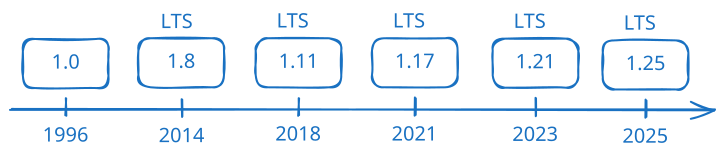

# 背景介绍

## 版本

- java的诞生与八卦：[interests](../../details/interests.md)
- LTS（长期支持）：Java 8、Java 11、Java 17、Java21、Java25
- Java 8、JDK 8、JDK 1.8 是同一个版本
- [Java 版本特性总结（官网）](https://www.oracle.com/java/technologies/javase/jdk-relnotes-index.html)
- 新版本更新详细内容：[java-new](../06-java-advanced/java-new.md)
- 商用付费问题（OracleJDK要钱，OpenJDK不要钱）：[money](../../details/money.md)

## 类型

- Java SE（标准版）
- Java EE（企业版）
- Java ME（小型版）
- [Java 系统学习之三大版本 JavaSE、JavaEE、JavaME](https://blog.csdn.net/fi0stBlooder/article/details/118456420)

## 特性
- 面向对象
- 健壮：强类型机制、异常处理、垃圾自动收集
- 跨平台：JVM（class 文件运行在各操作系统的 Java 虚拟机上）
- 解释型语言（class 文件由解释器运行）
> 🤔 为什么有人说 Java 是“编译与解释并存”的语言？
> 📖 编译器将源代码编译为字节码，虚拟机解释或 JIT 编译执行

## IDE
- [EditPlus](https://www.editplus.com/)
- [Notepad++](https://notepad-plus-plus.org/)
- IntelliJ IDEA
- Eclipse
- Sublime Text
- （以上都是2026年之前的讨论，现在已经vibe coding了）

## JVM、JRE、JDK

- JVM（**J**ava **V**irtual **M**achine）：虚拟机
- JRE（**J**ava **R**untime **E**nvironment）= JVM + Java 核心库；运行 class 文件需要安装 JRE
- JDK（**J**ava **D**evelopment **K**it）= JRE + 开发工具（如 javac）；开发者安装 JDK 即可
- [JDK、JRE、JVM 关系简述](http://t.csdn.cn/5ctUI)
- [JVM 详解](https://blog.csdn.net/weixin_43410245/article/details/126471338)

## 代码规范
- [Google Java 代码规范](http://doc.vrd.net.cn/codingstyle/google-java-styleguide-zh.pdf)
- [Java 语言规范（JLS）](https://docs.oracle.com/javase/specs/jls/se21/html/)
