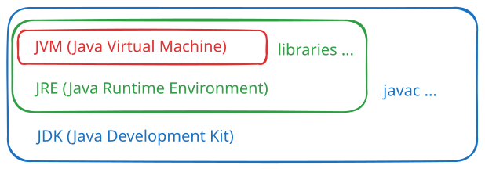

# JVM、JRE、JDK

- JVM（**J**ava **V**irtual **M**achine）：虚拟机
- JRE（**J**ava **R**untime **E**nvironment）= JVM + Java 核心库；运行 class 文件需要安装 JRE
- JDK（**J**ava **D**evelopment **K**it）= JRE + 开发工具（如 javac）；开发者安装 JDK 即可
- [JDK、JRE、JVM 关系简述](http://t.csdn.cn/5ctUI)
- [JVM 详解](https://blog.csdn.net/weixin_43410245/article/details/126471338)
