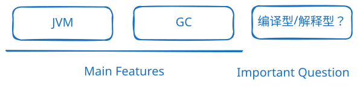
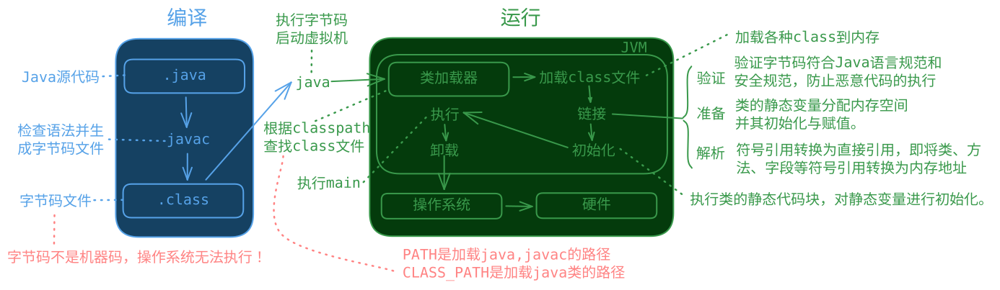

# 特性

## 概述

- 面向对象：继承、封装、多态
- 健壮：强类型机制、异常处理
- **垃圾自动收集**（Garbage Collection，简称GC）：在传统的编程语言中，需要手动分配和释放内存，容易出现内存泄漏和悬挂指针等问题。GC可以自动分配和释放内存。
- 跨平台：**JVM**（class 文件运行在各操作系统的 Java 虚拟机上）
- 解释型语言（class 文件由解释器运行）

> 🤔 为什么有人说 Java 是“编译与解释并存”的语言？
> 📖 编译器将**源代码**编译为**字节码**（字节码不是二进制，不是机器码），虚拟机解释或 JIT 编译执行生成的**机器码**

## Java执行程序的理论

（重点）Java的加载与执行（`java Hello` 的执行过程）：
1. 执行`java Hello`后，会启动 JVM 
2. JVM 会启动类加载器（classloader） 
3. 类加载器加载 Test 类，自动去硬盘上找`Hello.class`字节码文件
4. 找到`Hello.class`字节码文件之后将其加载到 JVM 当中。 
5. JVM 将 `Hello.class` 字节码解释为机器码。 
6. 操作系统执行机器码和底层硬件平台进行交互。