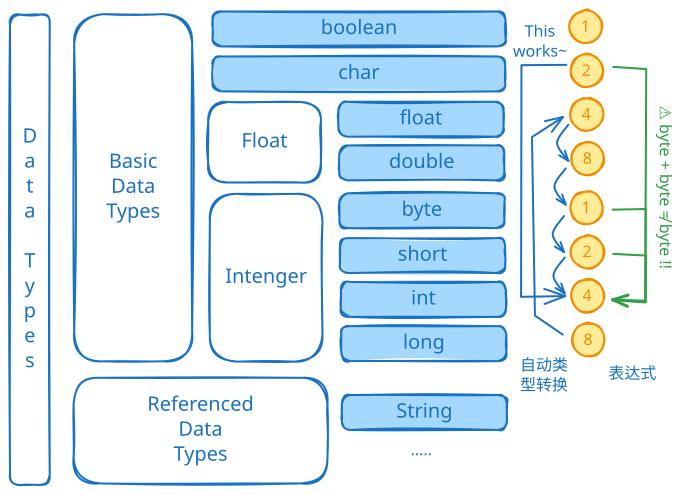

# 数据类型分类

## 基本数据类型（8种）
| 类别  | 类型        | 大小  | 说明                  |
| --- | --------- | --- | ------------------- |
| 整型  | `byte`    | 1字节 | -128 ~ 127          |
| 整型  | `short`   | 2字节 | -32,768 ~ 32,767    |
| 整型  | `int`     | 4字节 | -2³¹ ~ 2³¹-1        |
| 整型  | `long`    | 8字节 | -2⁶³ ~ 2⁶³-1        |
| 浮点型 | `float`   | 4字节 | 约±3.403E38，7位小数精度   |
| 浮点型 | `double`  | 8字节 | 约±1.798E308，16位小数精度 |
| 字符型 | `char`    | 2字节 | Unicode字符           |
| 布尔型 | `boolean` | 1字节 | `true` 或 `false`    |

注意:

* Java变量所占空间固定，与操作系统无关！
* 在网络传输、大文件读写时，为了节省空间，常用byte来作为数据的传输方式。

## 引用数据类型
* **类**（如 `String`）
* **接口**
* **数组**

## 字符类型比较
* **Java**：`char` 2字节（Unicode）
* **C**：`char` 1字节（ASCII）
* **Rust**：`char` 4字节（Unicode标量值）

## 面试题：介绍一下Java的数据类型
Java 的数据类型可以分为两种：基本数据类型和引⽤数据类型。
基础数据类型有：`byte`，`short`，`int`，`long`，`float`，`double`，`boolean`，`char`
引用数据类型有：数组，类，接口
