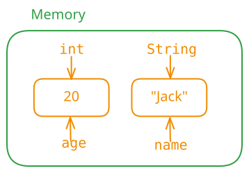

# 变量

变量是内存中的一块空间，用来存储数据（可以看作盒子）。它有三要素：
- **数据类型**：决定空间大小，如 `int`。
- **名字**：合法的标识符，如 `age`。
- **值**：与数据类型对应的数据，如 `20`。



> 详细展开（可跳过）：[var-detail1](var-detail1.md) · [var-detail2](var-detail2.md)
变量的作用：提高程序可读性。
## 声明与赋值
声明语法：

```java
数据类型 变量名; // 规范：变量名首字母小写，后续单词首字母大写
```

例如：

```java
int age;
String name;
double π;
```

使用 `=` 赋值，可先声明后赋值，也可声明时直接赋值：

```java
age = 20;
name = "jack";
π = 3.14;

int num = 200; // 声明并赋值
```

变量可以重新赋值，但新值的类型必须与变量类型一致：

```java
age = 30;
// age = "张三"; // 错误：类型不匹配
```

## 变量的访问

- **读取**：直接使用变量名，如 `System.out.println(age);`
- **修改**：赋值，如 `age = 30;`
- 变量的值可以被复制给另一个变量：

```java
int num1 = 10;
int num2 = num1;
int num3 = num1 + num2;
```

## 注意事项
1. 先声明，再赋值，才能访问。
2. 方法体内的代码从上到下执行，不能先访问后声明。
3. 一行可以声明多个同类型变量：`int a, b, c = 300;`（此时 `a`、`b` 未赋值，`c` 为 300）。
4. 同一作用域内不能重复声明变量，但可以重新赋值。
## 作用域
变量只在声明它的花括号 `{}` 内有效，即“出了大括号就不认识了”。作用域不同，生命周期也不同（从内存开辟到内存释放）。
### 就近原则

局部变量与成员变量同名时，方法内优先使用最近的（局部变量）。

### Java 不支持变量遮蔽

与 C、Rust 不同，Java 不允许在嵌套代码块中声明与外部变量同名的变量。

## 变量分类

- **局部变量**：定义在方法、语句块或形式参数中。
- **成员变量**：定义在类中、方法之外。
- **静态变量**：使用 `static` 修饰的成员变量。
- **实例变量**：未使用 `static` 修饰的成员变量。