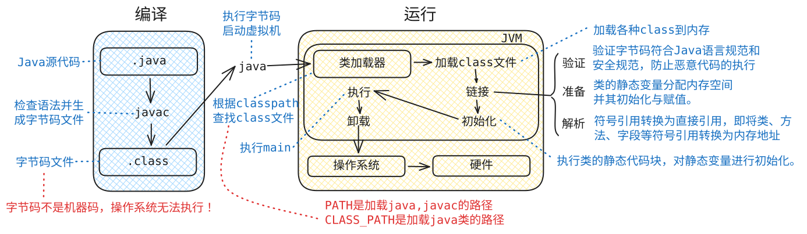

# 第一个Java程序
---

## Java执行程序的理论

（重点）Java的加载与执行（`java Hello` 的执行过程）：
第一步：执行`java Hello`后，会启动 JVM 
第二步：JVM 会启动类加载器（classloader） 
第三步：类加载器加载 Test 类，自动去硬盘上找`Hello.class`字节码文件
第四步：找到`Hello.class`字节码文件之后将其加载到 JVM 当中。 
第五步：JVM 将 `Hello.class` 字节码解释为机器码。 
第六步：操作系统执行机器码和底层硬件平台进行交互。

---

## Path 与 Classpath
* 二者区分
    * `Path`：windows系统的环境变量
    * `Classpath`：java类加载器（classloader）的环境变量，**隶属于Java语言**。
* 使用`Classpath`
    * `java Test`命令执行之后，JVM启动类加载器classloader，classloader会通过`classpath`中的路径查找`Test.class`文件。
    * 当`classpath`没有配置的情况下，**默认从当前路径下查找**。 
    * 当`classpath`显式得配置出来之后，则只会从配置的路径中查找，不再从当前路径下查找。

---

## Hello World实战
1. 基本步骤
    1. **编码** - 创建`Hello.java`文件。
    2. **编译** - 使用`javac`命令：`javac ./Hello.java`，生成`Hello.class`字节码文件。
    3. **运行** - 使用`java`命令：`java Hello`。注意：运行时不带`.class`扩展名。
2. 编码注意事项
    1. windows中文默认使用GBK编码，所以代码.java文件也需要保存为GBK编码
    2. 或者把windows终端输出和代码一起改成utf-8也可以，总之就是终端和程序要统一
    3. 具体编码介绍：[编码](../05-io/coding.md)
3. 示例代码
    ```java
    // Hello.java
    public class Hello {
        public static void main(String[] args) {
            System.out.println("Hello World");
        }
    }
    ```
* `javac`命令具体参数：[command-javac](../../details/command-javac.md)
* `java`命令具体参数：[command-java](../../details/command-java.md)

---

## Java源文件结构
1. 类声明规则
    1. 一个源文件中最多**只能有一个**`public`类
    2. 源文件名必须与`public`类名完全一致
    3. 可以包含多个非`public`类
    4. 编译后，每个类都会生成对应的`.class`文件

    ```java
    // Hello.java（文件名必须与 public 类名一致）
    public class Hello {
        public static void main(String[] args) {
            System.out.println("Hello World");
        }
    }
    
    // 可以包含多个非public类
    class Another {
    }
    ```

2. `main`方法的位置
    1. `public static void main(String[] args)`可以不在`public`类中
    2. 运行时需要指定包含`main`方法的类名

    ```java
    // Hello.java
    // 编译：javac Hello.java
    // 运行：java Another
    public class Hello {
        // 这个类没有main方法
    }
    
    class Another {
        public static void main(String[] args) {
            System.out.println("Another World");
        }
    }
    ```

## 注释

1. Java注释是代码中的非执行性文本，用于向开发者说明代码逻辑、功能或临时屏蔽代码段。它分为单行注释（`//`）、多行注释（`/* ... */`）和文档注释（`/** ... */`）。前两者通常用于代码内部的简短说明、调试或临时注释代码块，而文档注释则专用于API文档的生成。
2. 多行注释的两种写法
    ```java
    /*
     这是一个
     多行注释
    */
    
    /*
     * 这是多行注释
     * 这样写更好看
     */
    ```
1. 注释在换行的地方也可以写：[comment-example](../../details/comment-example.md)