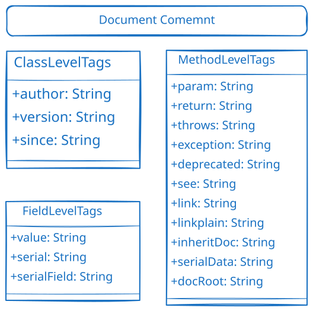

# JavaDoc


* 极简案例：[comment-detail](details/comment-detail.md)

### 文档注释（Javadoc）
* **语法**：`/** 文档注释 */`
* **特点**：特殊的注释格式，用于生成HTML格式的API文档
* **用途**：类、接口、方法、字段的正式文档
* **命令**：[javadoc](details/command-javadoc.md)，但现在已经不用这个工具了，有更好的封装

常用标签

| 标签            | 说明     | 示例                           |
| ------------- | ------ | ---------------------------- |
| `@author`     | 作者信息   | `@author 张三`                 |
| `@version`    | 版本号    | `@version 1.0`               |
| `@since`      | 起始版本   | `@since 1.8`                 |
| `@param`      | 方法参数说明 | `@param name 用户名`            |
| `@return`     | 返回值说明  | `@return 计算结果`               |
| `@throws`     | 抛出的异常  | `@throws IOException 输入输出异常` |
| `@see`        | 参考链接   | `@see java.lang.String`      |
| `@deprecated` | 已过时    | `@deprecated 使用新方法代替`        |
标签使用示例

```java
/**
 * 计算两个数的和
 * 
 * @param a 第一个加数
 * @param b 第二个加数
 * @return 两个数的和
 * @throws IllegalArgumentException 如果参数为负数
 * @see Math#addExact(int, int)
 * @since 1.0
 * @author 开发团队
 */
public int add(int a, int b) throws IllegalArgumentException {
    if (a < 0 || b < 0) {
        throw new IllegalArgumentException("参数不能为负数");
    }
    return a + b;
}

/**
 * 已过时的方法，请使用{@link #newMethod()}代替
 * 
 * @deprecated 从版本2.0开始不再推荐使用
 */
@Deprecated
public void oldMethod() {
    // 旧方法实现
}
```

## 特殊注释标记

| 标记      | 说明             | 示例                      |
| ------- | -------------- | ----------------------- |
| `TODO`  | 标识需要完成的工作      | `// TODO: 实现用户验证逻辑`     |
| `FIXME` | 标识需要修复的问题      | `// FIXME: 这里存在内存泄漏风险`  |
| `XXX`   | 标识有问题或需要改进的代码  | `// XXX: 这个实现效率较低，需要优化` |
| `HACK`  | 标识临时解决方案或取巧的代码 | `// HACK: 临时绕过权限检查`     |

```java
// TODO: 实现用户验证逻辑
// TODO: 添加缓存机制

// FIXME: 这里存在内存泄漏风险
// FIXME: 时区处理有问题

// XXX: 这个实现效率较低，需要优化
// XXX: 临时解决方案，需要重构

// HACK: 临时绕过权限检查
// HACK: 由于第三方库的限制，这里需要这样写
```

## 参考资料
1. [Java文档注释 - 菜鸟教程](https://www.runoob.com/java/java-documentation.html)
2. [Oracle官方Javadoc指南](https://www.oracle.com/technical-resources/articles/java/javadoc-tool.html)
3. [如何编写好的代码注释](https://stackoverflow.com/questions/209015/what-is-self-documenting-code-and-can-it-replace-well-documented-code)
