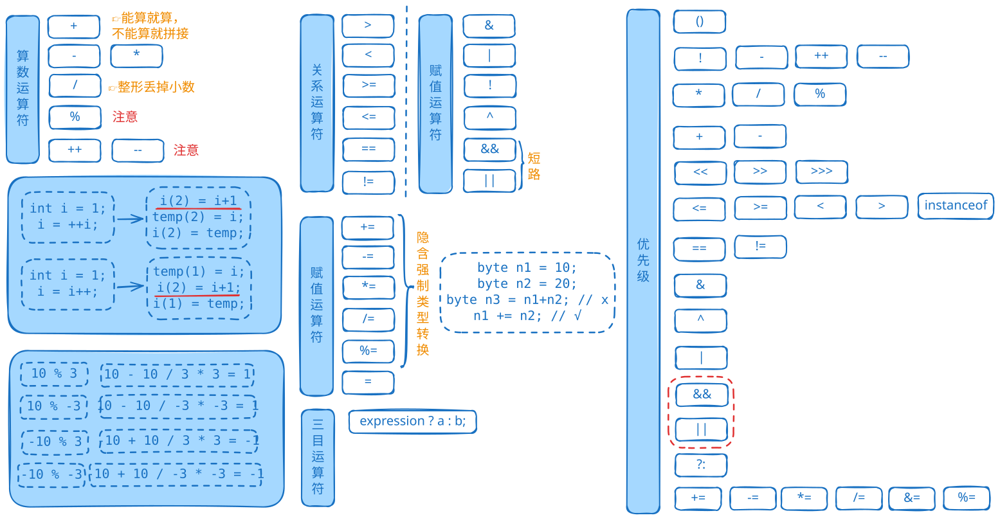

# Java运算符


- **算术运算符**（数学运算）：`+ - * / % ++ --`
- **关系运算符**（比较运算）：`== != < > <= >= instanceof`
- **逻辑运算符**（布尔运算）：`& | ^ ! && ||`
- **位运算符**（二进制运算）：`& | ^ ~ << >> >>>`
- **赋值运算符**（赋值运算）：`= += -= *= /= %= &= |= ^= <<= >>= >>>=`
- **三元运算符**（条件运算）：`? :`

### 1. 运算符选择建议
- **算术运算**：注意整数除法和浮点数除法的区别
- **逻辑运算**：优先使用短路运算符`&&`和`||`提高效率
- **位运算**：适用于标志位操作、简单加密等场景
- **三元运算符**：简化简单的if-else语句，但注意类型转换


### 2. 常见陷阱
- **自增/自减**：注意前自增和后自增的区别
- **浮点数比较**：避免直接使用`==`比较浮点数
- **类型转换**：复合赋值包含隐式转换，普通赋值需要显式转换
- **三元运算符**：可能发生意外的类型提升


### 3. 调试技巧
```java
// 使用括号明确优先级
int result = (a + b) * c;  // 明确表达意图

// 分步计算复杂表达式
int temp1 = a * b;
int temp2 = c / d;
int finalResult = temp1 + temp2;

// 使用System.out.println调试
System.out.println("a=" + a + ", b=" + b);
System.out.println("中间结果: " + (a + b));
```


### 4. 性能考虑
- 短路运算符`&&`和`||`可以提高性能
- 位运算通常比算术运算更快
- 避免在循环条件中使用复杂表达式

通过掌握这些运算符的特性和优先级，可以编写出更高效、更清晰的Java代码。
