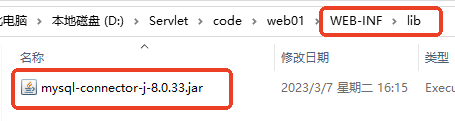

# Servlet 连接数据库

继续在 `web01`项目中实现连接数据库的效果。实现功能：以列表形式显示部门名称。

> 这个案例时使用JDBC连接的数据库。

---

## 数据库初始化

```sql
CREATE database if not exists servlet;
USE servlet;

DROP TABLE IF EXISTS EMP;
DROP TABLE IF EXISTS DEPT;
DROP TABLE IF EXISTS SALGRADE;

CREATE TABLE DEPT(DEPTNO int(2) not null ,
	DNAME VARCHAR(14) ,
	LOC VARCHAR(13),
	primary key (DEPTNO)
);
CREATE TABLE EMP(EMPNO int(4)  not null ,
	ENAME VARCHAR(10),
	JOB VARCHAR(9),
	MGR INT(4),
	HIREDATE DATE  DEFAULT NULL,
	SAL DOUBLE(7,2),
	COMM DOUBLE(7,2),
	primary key (EMPNO),
	DEPTNO INT(2) 
);

CREATE TABLE SALGRADE( GRADE INT,
	LOSAL INT,
	HISAL INT
);

INSERT INTO DEPT ( DEPTNO, DNAME, LOC ) VALUES ( 10, 'ACCOUNTING', 'NEW YORK'); 
INSERT INTO DEPT ( DEPTNO, DNAME, LOC ) VALUES ( 20, 'RESEARCH', 'DALLAS'); 
INSERT INTO DEPT ( DEPTNO, DNAME, LOC ) VALUES ( 30, 'SALES', 'CHICAGO'); 
INSERT INTO DEPT ( DEPTNO, DNAME, LOC ) VALUES ( 40, 'OPERATIONS', 'BOSTON'); 
 
INSERT INTO EMP ( EMPNO, ENAME, JOB, MGR, HIREDATE, SAL, COMM,DEPTNO ) VALUES ( 7369, 'SMITH', 'CLERK', 7902,  '1980-12-17', 800, NULL, 20); 
INSERT INTO EMP ( EMPNO, ENAME, JOB, MGR, HIREDATE, SAL, COMM,DEPTNO ) VALUES ( 7499, 'ALLEN', 'SALESMAN', 7698,  '1981-02-20', 1600, 300, 30); 
INSERT INTO EMP ( EMPNO, ENAME, JOB, MGR, HIREDATE, SAL, COMM,DEPTNO ) VALUES ( 7521, 'WARD', 'SALESMAN', 7698,  '1981-02-22', 1250, 500, 30); 
INSERT INTO EMP ( EMPNO, ENAME, JOB, MGR, HIREDATE, SAL, COMM,DEPTNO ) VALUES ( 7566, 'JONES', 'MANAGER', 7839,  '1981-04-02', 2975, NULL, 20); 
INSERT INTO EMP ( EMPNO, ENAME, JOB, MGR, HIREDATE, SAL, COMM,DEPTNO ) VALUES ( 7654, 'MARTIN', 'SALESMAN', 7698,  '1981-09-28', 1250, 1400, 30); 
INSERT INTO EMP ( EMPNO, ENAME, JOB, MGR, HIREDATE, SAL, COMM,DEPTNO ) VALUES ( 7698, 'BLAKE', 'MANAGER', 7839,  '1981-05-01', 2850, NULL, 30); 
INSERT INTO EMP ( EMPNO, ENAME, JOB, MGR, HIREDATE, SAL, COMM,DEPTNO ) VALUES ( 7782, 'CLARK', 'MANAGER', 7839,  '1981-06-09', 2450, NULL, 10); 
INSERT INTO EMP ( EMPNO, ENAME, JOB, MGR, HIREDATE, SAL, COMM,DEPTNO ) VALUES ( 7788, 'SCOTT', 'ANALYST', 7566,  '1987-04-19', 3000, NULL, 20); 
INSERT INTO EMP ( EMPNO, ENAME, JOB, MGR, HIREDATE, SAL, COMM,DEPTNO ) VALUES ( 7839, 'KING', 'PRESIDENT', NULL,  '1981-11-17', 5000, NULL, 10); 
INSERT INTO EMP ( EMPNO, ENAME, JOB, MGR, HIREDATE, SAL, COMM,DEPTNO ) VALUES ( 7844, 'TURNER', 'SALESMAN', 7698,  '1981-09-08', 1500, 0, 30); 
INSERT INTO EMP ( EMPNO, ENAME, JOB, MGR, HIREDATE, SAL, COMM,DEPTNO ) VALUES ( 7876, 'ADAMS', 'CLERK', 7788,  '1987-05-23', 1100, NULL, 20); 
INSERT INTO EMP ( EMPNO, ENAME, JOB, MGR, HIREDATE, SAL, COMM,DEPTNO ) VALUES ( 7900, 'JAMES', 'CLERK', 7698,  '1981-12-03', 950, NULL, 30); 
INSERT INTO EMP ( EMPNO, ENAME, JOB, MGR, HIREDATE, SAL, COMM,DEPTNO ) VALUES ( 7902, 'FORD', 'ANALYST', 7566,  '1981-12-03', 3000, NULL, 20); 
INSERT INTO EMP ( EMPNO, ENAME, JOB, MGR, HIREDATE, SAL, COMM,DEPTNO ) VALUES ( 7934, 'MILLER', 'CLERK', 7782,  '1982-01-23', 1300, NULL, 10); 
 
INSERT INTO SALGRADE ( GRADE, LOSAL, HISAL ) VALUES ( 1, 700, 1200); 
INSERT INTO SALGRADE ( GRADE, LOSAL, HISAL ) VALUES ( 2, 1201, 1400); 
INSERT INTO SALGRADE ( GRADE, LOSAL, HISAL ) VALUES ( 3, 1401, 2000); 
INSERT INTO SALGRADE ( GRADE, LOSAL, HISAL ) VALUES ( 4, 2001, 3000); 
INSERT INTO SALGRADE ( GRADE, LOSAL, HISAL ) VALUES ( 5, 3001, 9999); 
commit;
```

数据库的名字就叫servlet。

---

## 添加 mysql 驱动

在 `WEB-INF`目录下新建 `lib`目录，将 `mysql.jar`驱动放到 `lib`目录中。



```bash
## 我的方法是，直接下载就好了
charles@192 lib % pwd
/Users/charles/workspace/project/learn-servlet/webapps/hello/WEB-INF/lib
charles@192 lib % curl -O https://repo1.maven.org/maven2/com/mysql/mysql-connector-j/8.0.33/mysql-connector-j-8.0.33.jar
```

---

## 编写 DeptListServlet

```java
package com.jkweilai.servlet;

import jakarta.servlet.Servlet;
import jakarta.servlet.ServletException;
import jakarta.servlet.ServletRequest;
import jakarta.servlet.ServletResponse;
import jakarta.servlet.ServletConfig;
import java.io.PrintWriter;
import java.io.IOException;
import java.sql.*;

public class DeptListServlet implements Servlet{

    public void init(ServletConfig config) throws ServletException{}

    public void service(ServletRequest request,ServletResponse response)
        throws ServletException, IOException{
        response.setContentType("text/html;charset=UTF-8");
        PrintWriter out = response.getWriter();

        Connection conn = null;
        PreparedStatement ps = null;
        ResultSet rs = null;
        try{
            // 1.注册驱动
            Class.forName("com.mysql.cj.jdbc.Driver");
            // 2.获取连接 因为是docker所以网络要改一下
            String url = "jdbc:mysql://host.docker.internal:3306/servlet";
            //String url = "jdbc:mysql://localhost:3306/servlet";
            String user = "root";
            String password = "";
            conn = DriverManager.getConnection(url, user, password);
            // 3.获取预编译的数据库操作对象
            String sql = "select d.dname, e.ename, e.sal from EMP e join DEPT d where e.DEPTNO = d.DEPTNO;";
            ps = conn.prepareStatement(sql);
            // 4.执行SQL
            rs = ps.executeQuery();
            // 5.处理查询结果集
            while(rs.next()){
                String dname = rs.getString("dname");
                String ename = rs.getString("ename");
                String sal = rs.getString("sal");
                out.print(dname+"&nbsp;"+ename+"&nbsp;"+sal);
                out.print("<br>");
            }
        }catch(Exception e){
            e.printStackTrace();
        }finally{
            // 6.释放资源
            if(rs != null){
                try{
                    rs.close();
                }catch(Exception e){
                    e.printStackTrace();
                }
            }
            if(ps != null){
                try{
                    ps.close();
                }catch(Exception e){
                    e.printStackTrace();
                }
            }
            if(conn != null){
                try{
                    conn.close();
                }catch(Exception e){
                    e.printStackTrace();
                }
            }
        }
    }

    public void destroy(){}

    public String getServletInfo(){
        return "";
    }

    public ServletConfig getServletConfig(){
        return null;
    }

}
```

编译后，将编译后的字节码拷贝到 `WEB-INF/classes`目录下，这里不再赘述。

```bash
# 这里也是直接给命令吧
docker exec my-tomcat bash -c "mkdir -p /usr/local/tomcat/webapps/hello/WEB-INF/classes && javac -encoding UTF-8 -cp /usr/local/tomcat/lib/servlet-api.jar -d /usr/local/tomcat/webapps/hello/WEB-INF/classes /usr/local/tomcat/webapps/hello/WEB-INF/src/com/jkweilai/servlet/DeptListServlet.java"
```

---

## 编写 web.xml

```xml
<servlet>
    <servlet-name>dListServlet</servlet-name>
    <servlet-class>com.jkweilai.servlet.DeptListServlet</servlet-class>
</servlet>
<servlet-mapping>
    <servlet-name>dListServlet</servlet-name>
    <url-pattern>/list</url-pattern>
</servlet-mapping>
```

---

## 提供超链接

在 `index.html`文件中添加超链接：

```html
<!--对于前端请求路径目前以 / 开始，带项目名。web.xml文件中的路径不带项目名。-->
<a href="/hello/list">部门列表</a>
```

---

## 部署测试

将项目部署到 Tomcat 的 webapps 目录下，启动 Tomcat 服务器，打开浏览器输入地址：<http://localhost:8080/hello/index.html>


点击部门列表超链接发送请求：


