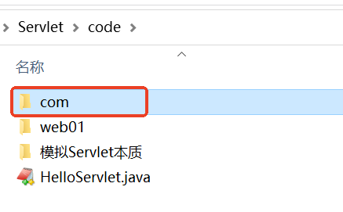
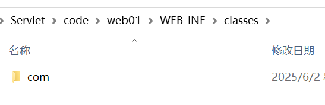
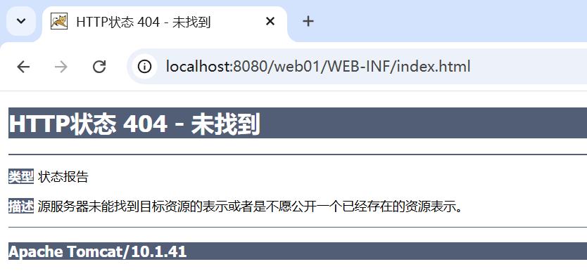

# 开发第一个 Servlet

---

> 本章按照网课为基础，按照本地环境和目录进行调整

## 初始化

* servlet我们使用的本地的docker的：[tomcat-docker](tomcat-docker.md)
* 代码仓库： https://github.com/CharlesShan-hub/learn-servlet
* 目录结构：我们在webapps文件夹下，创建hello文件夹。

```bash
> pwd
D:\project\work\learn-servlet\webapps\hello
> tree
D:.
└───WEB-INF
    ├───classes
    │   └───com
    │       └───jkweilai
    │           └───servlet
    └───src
        └───com
            └───jkweilai
                └───servlet
```

---

## 编写 Servlet

在`hello\WEB-INF\src\com\jkweilai\servlet`创建 `HelloServlet.java`。

任何 `Servlet`都必须实现 `jakarta.servlet.Servlet`接口，该接口中有哪些方法呢？看源码：

```java
package jakarta.servlet;  
  
import java.io.IOException;  
  
public interface Servlet {  
    void init(ServletConfig var1) throws ServletException;  
  
    ServletConfig getServletConfig();  
  
    void service(ServletRequest var1, ServletResponse var2) throws ServletException, IOException;  
  
    String getServletInfo();  
  
    void destroy();  
}
```

编写 `HelloServlet`实现该接口中所有方法：

```java
package com.jkweilai.servlet;

import jakarta.servlet.Servlet;
import jakarta.servlet.ServletException;
import jakarta.servlet.ServletRequest;
import jakarta.servlet.ServletResponse;
import jakarta.servlet.ServletConfig;
import java.io.PrintWriter;
import java.io.IOException;

public class LoginServlet1 implements Servlet{

    public void init(ServletConfig config) throws ServletException{}

    // servlet的核心方法，每一次请求都会调用这个方法
    public void service(ServletRequest request,ServletResponse response) throws ServletException, IOException{
        // 向控制台打印
        System.out.println("Hello Servlet!");
        // 解决中文乱码需要设置响应头，在获取响应流之前才有效
        response.setContentType("text/html;charset=UTF-8");

        // 向浏览器上响应HTML：响应对象 response
        PrintWriter out = response.getWriter();
        out.print("<h1>Hello Servlet 01!</h1>");
        out.println("<h1>你好！！！</h1>");
    }

    public void destroy(){}

    public String getServletInfo(){
        return "";
    }

    public ServletConfig getServletConfig(){
        return null;
    }
  
}
```

但其实ai给了我一个更简洁的，也就是用httpservlet而不是单纯的servlet：
```java
package com.jkweilai.servlet;
  
import jakarta.servlet.ServletException;
import jakarta.servlet.http.HttpServlet;
import jakarta.servlet.http.HttpServletRequest;
import jakarta.servlet.http.HttpServletResponse;
  
import java.io.IOException;
import java.io.PrintWriter;
  
public class LoginServlet2 extends HttpServlet {
  
    @Override
    protected void doGet(HttpServletRequest req, HttpServletResponse resp)
            throws ServletException, IOException {

       resp.setContentType("text/html;charset=UTF-8");
        PrintWriter out = resp.getWriter();
        out.println("<html><body>");
        out.println("<h1>Hello, Servlet 02!</h1>");
        out.println("</body></html>");
    }
  
    @Override
    protected void doPost(HttpServletRequest req, HttpServletResponse resp)
            throws ServletException, IOException {
        doGet(req, resp);
    }
}
```

---
## 解决中文乱码

```java
response.setContentType("text/html");
response.setCharacterEncoding("UTF-8");
```

可以合并为一行：

```java
response.setContentType("text/html;charset=UTF-8");
```

**注意：这行代码必须出现在 `PrintWriter out = response.getWriter();`之前才能解决乱码问题。

`response.setCharacterEncoding("UTF-8");`和 HTML 中的`<meta charset="UTF-8">`有什么区别？

+ **前者**：设置Servlet输出流的字符编码方式，影响`PrintWriter`如何将Java字符串转换为字节序列，是服务器端的行为，发生在内容发送到客户端之前，会自动设置`Content-Type`响应头的charset部分，例如：`Content-Type: text/html;charset=UTF-8`这是最根本的编码设置，决定了数据在传输时的实际编码。
+ **后者**：是HTML文档内部的编码声明，浏览器在解析HTML时会参考这个提示，当HTTP响应头没有指定charset时，浏览器会查找meta标签，如果HTTP头已指定charset，meta标签通常会被忽略。

---

## 手动编译 Servlet（建议跳过）

如果用本地的java编译，需要配置环境变量 CLASSPATH：


思考，为什么要配置 CLASSPATH 环境变量，另外环境变量中为什么要添加一个 `.`

编译：


以上编译命令表示：编译当前目录下的 `HelloServlet.java`文件，将编译之后的程序放到当前目录下。

编译之后生成了：



编译后拷贝到 classes 目录

将以上编译之后的结果拷贝到 `WEB-INF/classes`目录下：



---
## docker内部java编译（我的方法）

我的方法：编译器就在我的docker里面，直接用下面的命令运行更好！不用手动拷贝了

```bash
docker exec my-tomcat bash -c "mkdir -p /usr/local/tomcat/webapps/hello/WEB-INF/classes && javac -encoding UTF-8 -cp /usr/local/tomcat/lib/servlet-api.jar -d /usr/local/tomcat/webapps/hello/WEB-INF/classes /usr/local/tomcat/webapps/hello/WEB-INF/src/com/jkweilai/servlet/LoginServlet1.java"

docker exec my-tomcat bash -c "mkdir -p /usr/local/tomcat/webapps/hello/WEB-INF/classes && javac -encoding UTF-8 -cp /usr/local/tomcat/lib/servlet-api.jar -d /usr/local/tomcat/webapps/hello/WEB-INF/classes /usr/local/tomcat/webapps/hello/WEB-INF/src/com/jkweilai/servlet/LoginServlet2.java"

# 最后重启一下
docker-compose restart
```

这样也不需要复制了，多好。

---

## 编写 web.xml 配置

Tomcat 服务器 webapps 目录下自带了几个项目，这些项目当中都有 `web.xml`，可以从这里拷贝样例文件。

在 `web01\WEB-INF\`目录下新建 `web.xml`文件，进行以下的配置：

```xml
<?xml version="1.0" encoding="UTF-8"?>
<web-app xmlns="https://jakarta.ee/xml/ns/jakartaee"
         xmlns:xsi="http://www.w3.org/2001/XMLSchema-instance"
         xsi:schemaLocation="https://jakarta.ee/xml/ns/jakartaee
                             https://jakarta.ee/xml/ns/jakartaee/web-app_6_0.xsd"
         version="6.0">
  <!--servlet配置信息-->
  <servlet>
    <!--servlet的名字随便写一个，但是要保证和servlet mapping中的servlet名字一致。-->
    <servlet-name>loginServlet1</servlet-name>
    <!--这里必须填写Servlet类的全限定类名-->
    <servlet-class>com.jkweilai.servlet.LoginServlet1</servlet-class>
  </servlet>
  <servlet>
    <servlet-name>loginServlet2</servlet-name>
    <servlet-class>com.jkweilai.servlet.LoginServlet2</servlet-class>
  </servlet>
  <!--servlet映射信息-->
  <servlet-mapping>
    <servlet-name>loginServlet1</servlet-name>
    <!--请求路径必须以 / 开始，不要添加项目名。-->
    <url-pattern>/login1</url-pattern>
    <!--支持编写多个-->
    <url-pattern>/a/b/c</url-pattern>
  </servlet-mapping>
  <servlet-mapping>
    <servlet-name>loginServlet2</servlet-name>
    <url-pattern>/login2</url-pattern>
  </servlet-mapping>
  
</web-app>
```

**需要引起注意：**

`metadata-complete="true"`：容器忽略所有注解，只使用 web.xml 配置
`metadata-complete="false"`**(默认值)：容器会扫描注解**

---

## 使用超链接发送请求

在上面测试时，浏览器地址栏上直接输入的地址是：`http://localhost:8080/web01/hello`，也可以采用用户点击超链接的方式发送请求。在 `web01`目录下新建 `index.html`。然后编写如下代码：

```html
<!DOCTYPE html>
<html lang="zh-CN">
    <head>
        <meta charset="UTF-8">
        <meta name="viewport" content="width=device-width, initial-scale=1.0">
        <title>首页</title>
    </head>
    <body>
        <a href="http://localhost:8080/hello/login1">登录</a>
        <!--http://ip:port 可以省略。前端编写的路径目前都以 / 开头，并且一定要添加项目名。-->
        <a href="/hello/login2">登录</a>
    </body>
</html>
```

将 `index.html`文件部署到 Tomcat 服务器的 `hello` 项目下：

**再次启动服务器测试**

启动 Tomcat 服务器，然后打开浏览器在地址栏上输入：`http://localhost:8080/web01/index.html`

**将 index.html 放到 WEB-INF 目录下测试**，启动服务器，打开浏览器，输入地址：`http://localhost:8080/web01/WEB-INF/index.html`，如下：



通过测试得知，放在 WEB-INF 目录下的资源是受保护的。
