# IDEA 开发 Servlet

---

## 创建空项目

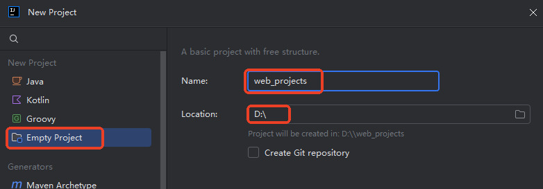

设置空项目的 JDK 版本：


---

## 创建普通 java 模块


---

## 创建 web 目录作为 webapproot

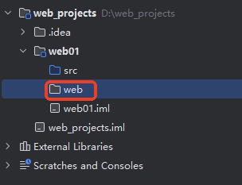

---

## 添加 web 支持

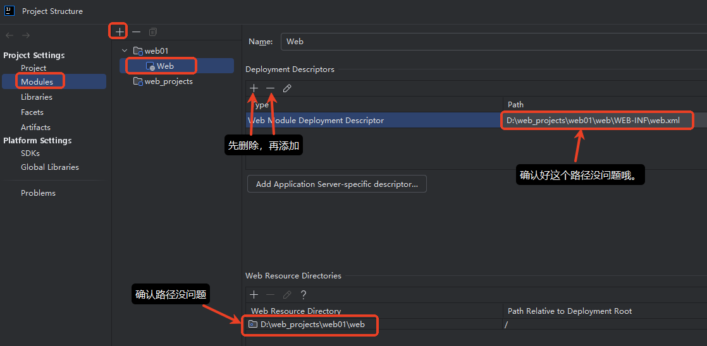

添加 `web.xml`文件时，选择 `6.0`版本。

---

## 添加 Artifact（构件）

Artifact 是构件的意思，通常指代 **可部署的输出文件** 。


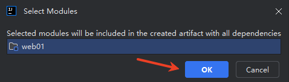

---

## 将 servlet-api.jar 添加到 classpath 中

注意，这个 jar 包只是起到一个编译阶段的作用（只是让我们在 IDEA 中编写的 Servlet 程序能够正常编译），因此这个 jar 包不需要放到 `WEB-INF/lib`目录中。因为 `WEB-INF/lib`目录下的 jar 包是在运行阶段起作用的，Tomcat 服务器运行时 `servlet-api.jar` 已经在 `CATALINA_HOME/lib`目录下了。

在 `web01`模块下随意创建一个目录，例如 `lib`，然后将 `servlet-api.jar`拷贝到该目录下，然后 右键-->Add as Library...

如果找不到这个jar包，我提供一个下载的命令

```bash
curl -O https://repo1.maven.org/maven2/jakarta/servlet/jakarta.servlet-api/6.0.0/jakarta.servlet-api-6.0.0.jar
```

推荐下载到src同级别的lib（自己创建）下面

```bash
charles@192 lib % pwd
/Users/charles/workspace/project/learn-servlet/web_porjects/web01/lib
charles@192 lib % ls
jakarta.servlet-api-6.0.0.jar
```


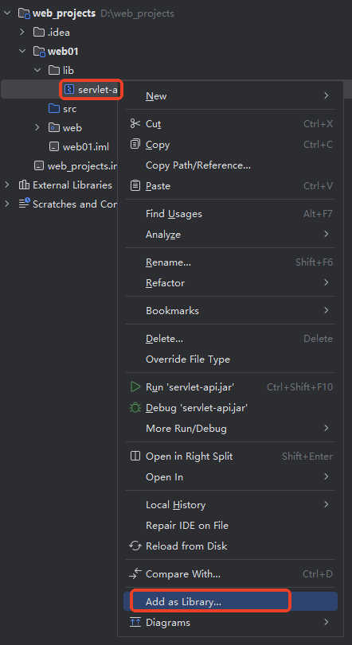

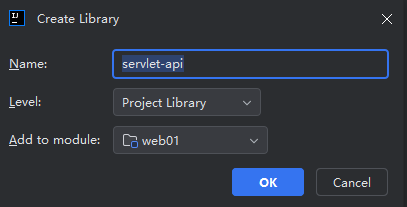

---

## 添加数据库驱动

在 `WEB-INF`目录下新建 `lib`目录，将 mysql 驱动 jar 包拷贝到该目录下：

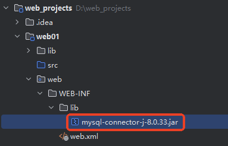

这个 jar 包是在运行阶段起作用的，编译阶段不需要。

---

## 编写 Servlet 和 web.xml

使用之前的 `DeptListServlet`程序即可。

```xml
<?xml version="1.0" encoding="UTF-8"?>
<web-app xmlns="https://jakarta.ee/xml/ns/jakartaee"
         xmlns:xsi="http://www.w3.org/2001/XMLSchema-instance"
         xsi:schemaLocation="https://jakarta.ee/xml/ns/jakartaee https://jakarta.ee/xml/ns/jakartaee/web-app_6_0.xsd"
         version="6.0">
    <servlet>
        <servlet-name>listServlet</servlet-name>
        <servlet-class>com.jkweilai.servlet.DeptListServlet</servlet-class>
    </servlet>
    <servlet-mapping>
        <servlet-name>listServlet</servlet-name>
        <url-pattern>/list</url-pattern>
    </servlet-mapping>
</web-app>
```

---

## IDEA 配置 Tomcat


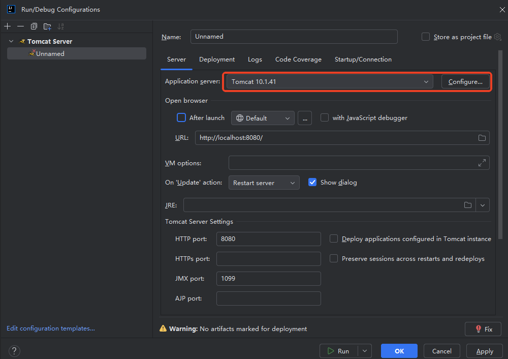

---

## 部署构件到 Tomcat

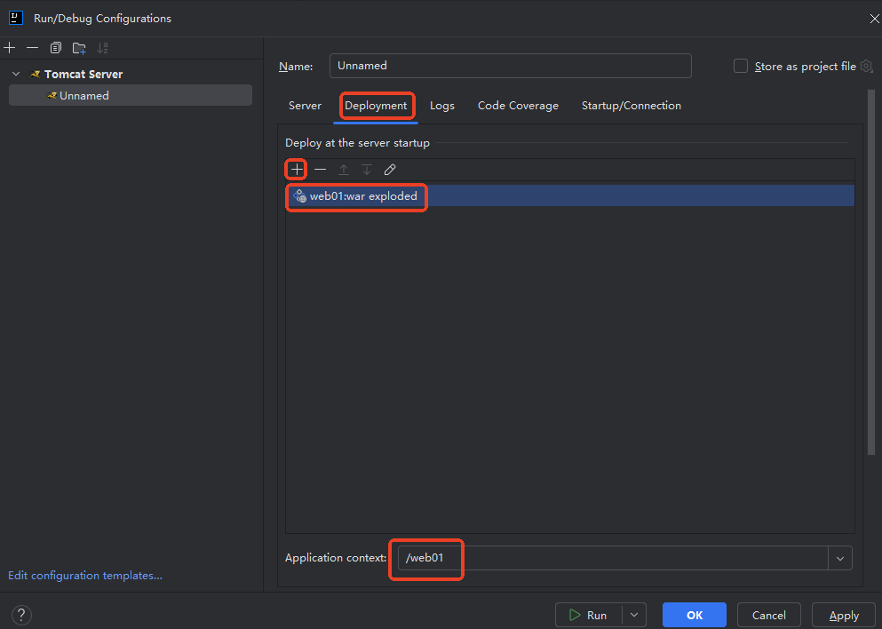


---

## 启动 Tomcat 测试

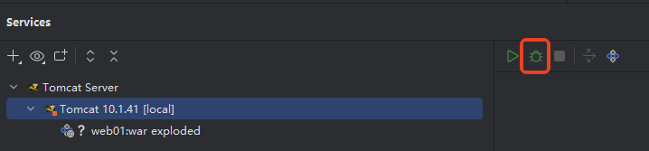


启动成功，但控制台有中文乱码，这是因为 IDEA 默认的字符编码方式为 UTF-8，需要将 `CATALINA_HOME/conf/logging.properties`文件中之前的修改的 `GBK`，再次改回 `UTF-8`即可：


打开浏览器访问：<http://localhost:8080/web01/list>

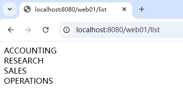
