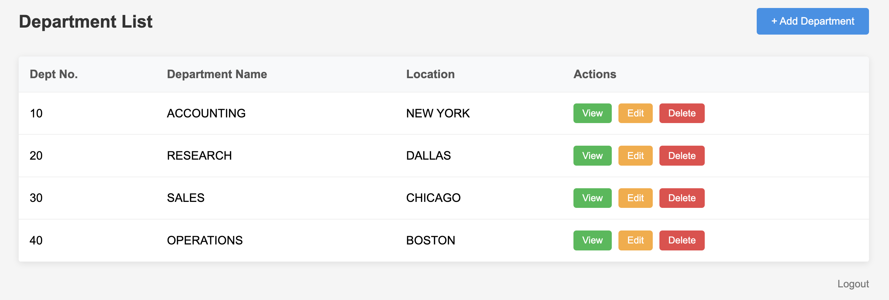
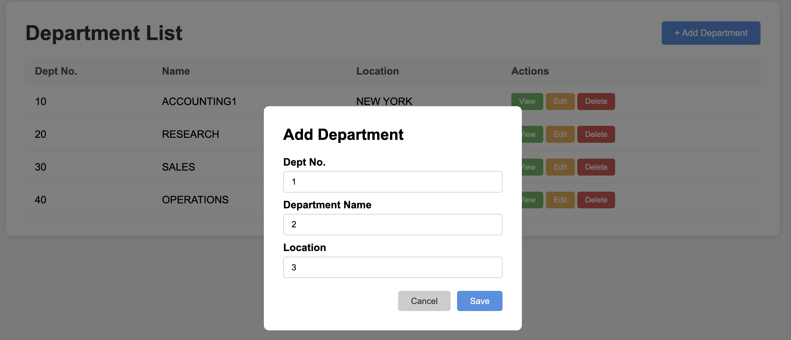
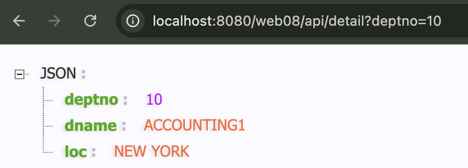

# 实现部门管理

在项目的开发过程中会融入新知识点的讲解，请务必注意新知识点的吸收。

> 前端内容：[static-website-development](../details/static-website-development.md) （这个是静态的不要了）
> 动态的前端内容：[IndexServlet-java.md](../assets/IndexServlet-java.md.md)
> 数据库内容：[database-connection](../details/database-connection.md)
> 完整内容看：<https://github.com/CharlesShan-hub/learn-servlet/tree/master/web_porjects/web08>，这里不再赘述太多

---

## 环境搭建

1. 使用之前的静态网站页面：index.html、list.html、add.html、edit.html、detail.html。完成部门信息的 CRUD 操作。
2. 使用学习 mysql 时的表：dept 
3. IDEA 中创建 dept 项目模块，创建 web 目录，添加 web 支持，创建构件。
4. 创建 `WEB-INF/lib`目录，添加 mysql 驱动 jar 包。
5. 创建 lib 目录，添加 servlet-api.jar 包，并将其添加到 classpath。
6. 一定注意在out（构建输出目录）里边也需要手动创建 lib 目录，然后手动把 mysql-connector-j-8.0.33.jar 放进去（这个是运行时的库）。
7. 将构件部署到 Tomcat 服务器。

JDBC 工具类使用之前的[DbUtils-java.md](../assets/DbUtils-java.md.md)

在 src 目录下新建 jdbc.properties 文件，提供以下配置：

```properties
driver=com.mysql.cj.jdbc.Driver
url=jdbc:mysql://localhost:3306/servlet
url2=jdbc:mysql://host.docker.internal:3306/servlet (如果是docker里面的就用这个)
user=root
password=
```

---

## 部门列表

我们可以把对于数据库的访问，抽取成DAO（Data Access Object），专门用于操作数据库。然后entity是代表数据库的一行，也就是一个实体：
* `com.jkweilai.servlet.dao.DeptDao.java`：[DeptDao-java.md](../details/DeptDao-java.md.md)
* `com.jkweilai.servlet.dao.DeptDaoImpl.java`：[DeptDaoImpl-java.md](../details/DeptDaoImpl-java.md.md)
* `com.jkweilai.servlet.entity.Dept.java`：[Dept-java.md](../details/Dept-java.md.md)

1. 获取部门列表：编写[DeptListServlet-java.md](../assets/DeptListServlet-java.md.md)，连接数据库，动态打印表格的 tr。

    

    其中，Java 15 正式引入了文本块（Text Blocks），使用 三个双引号 `"""` 作为定界符（而非反向单引号），用于简化多行字符串的编写：
    
    ```java
    String json = """
        {
            "name": "Java",
            "version": 17
        }
    """;
    ```

2. 插入：[DeptInsertServlet-java.md](../details/DeptInsertServlet-java.md.md)
    

3. 查看部门(在部门列表页面找到 `查看`按钮，点击查看按钮，显示该部门详细信息。实现功能的关键步骤：在查看按钮上添加请求路径，并且携带部门编号。例如：/dept/detail?deptno=10）[DeptDetailServlet-java.md](../assets/DeptDetailServlet-java.md.md)
    


    

    **重点内容：**
    
    实现本功能时，使用了一个新的知识点：通过 request 对象获取用户提交的数据。
    
    HTTP 协议中规定，无论是 get 还是 post 请求，提交数据的格式为：name=value&name=value&name=value
    
    要获取 value，可以通过 request 对象 getParameter()方法来获取：
    
    ```java
    String value = request.getParameter("name");
    ```
    
    需要注意的是 `name`必须要写正确了，尽量采用复制粘贴方式。
    
    另外需要注意的是，该方法的返回值类型永远都是字符串形式。

4. 删除部门

    发送 `/dept/delete?deptno=10`的请求，根据部门编号删除部门信息。
    
    DeptListServlet 中找到删除按钮：
    
    
    
    添加删除的请求路径：
    
    ```java
    out.print("        <a href='javascript:void(0)' class='action-btn delete-btn' onclick='if(window.confirm(\"您确定删除吗？\"))document.location.href=\"" + contextPath + "/delete?deptno=" + deptno + "\"'>删除</a>");
    ```

    实现删除:[DeptDeleteServlet-java.md](../assets/DeptDeleteServlet-java.md.md)
    
    再跳转到部门列表
    
    删除之后，需要展示一个全新的列表，因此需要让浏览器重新发一次全新的 `/dept/list`请求，只有浏览器发送这个请求，Tomcat 才会执行 DeptListServlet，再查一次数据库，展示新的列表，在 JavaWeb 开发中如何使用 Java 代码让浏览器自动再发一次全新的请求呢？使用重定向机制。代码如下：
    
    **重点内容：**
    
    ```java
    response.sendRedirect("/dept/list");
    ```
    
    需要注意的是：重定向时的路径写法和前端超链接的写法一致，都以 `/` 开始，并且带项目名。
    
    在 `DeptDeleteServlet`的末尾添加以下代码：
    
    ```java
    response.sendRedirect(request.getContextPath() + "/list");
    ```

