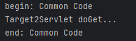

# 过滤器 Filter

在Servlet中，**Filter（过滤器）是一种可重用的组件，用于在请求到达Servlet或响应返回客户端之前拦截并处理**HTTP请求和响应。它允许开发者在不修改核心业务逻辑的情况下，对Web应用的请求/响应流程进行统一处理。

---

## Filter的核心作用

1. **预处理请求（Pre-processing）**  
    - 在请求到达目标Servlet之前，对请求进行修改或检查（如参数编码、权限验证、日志记录等）。
2. **后处理响应（Post-processing）**  
    - 在响应返回客户端之前，对响应内容进行加工（如压缩响应数据、设置HTTP头、过滤敏感信息等）。
3. **拦截请求或响应**  
    - 根据条件决定是否将请求/响应继续传递到链中的下一个组件（如未登录时直接重定向到登录页）。

---

## 典型应用场景

+ **认证/授权**：检查用户是否登录或是否有权限访问资源。
+ **日志记录**：记录请求的URL、IP、耗时等信息。
+ **编码处理**：统一设置请求/响应的字符编码（如`UTF-8`）。
+ **数据压缩**：对响应内容进行Gzip压缩。
+ **XSS防护**：过滤请求参数中的恶意脚本。
+ **静态资源缓存**：为静态资源添加缓存控制头。

---

## Filter的工作原理

1. **链式调用**：多个Filter可以组成一个链（Filter Chain），按`web.xml`定义的顺序依次执行。
2. **生命周期**：  
    - **初始化**：Web容器启动时调用`init()`方法（仅一次）。  
    - **拦截处理**：每次请求触发`doFilter()`方法。  
    - **销毁**：容器关闭时调用`destroy()`方法。


---

## 使用 Filter

### 不使用 Filter 存在的问题

观察以下代码存在的问题：

```java
@WebServlet("/filter/target1")
public class Target1Servlet extends HttpServlet {
    @Override
    protected void doGet(HttpServletRequest request, HttpServletResponse response) throws ServletException, IOException {
        System.out.println("begin: Common Code");

        System.out.println("Target1Servlet doGet...");

        System.out.println("end: Common Code");
    }
}
```

```java
@WebServlet("/filter/target2")
public class Target2Servlet extends HttpServlet {
    @Override
    protected void doGet(HttpServletRequest request, HttpServletResponse response) throws ServletException, IOException {
        System.out.println("begin: Common Code");

        System.out.println("Target2Servlet doGet...");

        System.out.println("end: Common Code");
    }
}
```

存在的问题：多个 Servlet 存在公共代码，每个 Servlet 中都写一遍，代码没有得到复用。

Filter 过滤器可以解决代码复用的问题。公共代码只需要在过滤器中编写一次即可。

### 使用 Filter 进行改造

两个 Servlet 改造如下：

```java
@WebServlet("/filter/target1")
public class Target1Servlet extends HttpServlet {
    @Override
    protected void doGet(HttpServletRequest request, HttpServletResponse response) throws ServletException, IOException {
        System.out.println("Target1Servlet doGet...");
    }
}
```

```java
@WebServlet("/filter/target2")
public class Target2Servlet extends HttpServlet {
    @Override
    protected void doGet(HttpServletRequest request, HttpServletResponse response) throws ServletException, IOException {
        System.out.println("Target2Servlet doGet...");
    }
}
```

编写过滤器：CommonCodeFilter

```java
package com.jkweilai.filter;

import jakarta.servlet.*;

import java.io.IOException;

public class CommonCodeFilter implements Filter {
    @Override
    public void init(FilterConfig filterConfig) throws ServletException {
        
    }

    @Override
    public void doFilter(ServletRequest request, ServletResponse response, FilterChain chain) throws IOException, ServletException {
        System.out.println("begin: Common Code");

        // 执行下一个过滤器，没有过滤器时则执行最终的Servlet
        chain.doFilter(request, response);

        System.out.println("end: Common Code");
    }

    @Override
    public void destroy() {
        
    }
}

```

`web.xml`中配置过滤器，或者也可以使用注解 `****@WebFilter****` 标注：

```xml
<filter>
    <filter-name>commonCodeFilter</filter-name>
    <filter-class>com.jkweilai.filter.CommonCodeFilter</filter-class>
</filter>
<filter-mapping>
    <filter-name>commonCodeFilter</filter-name>
    <url-pattern>/filter/*</url-pattern>
</filter-mapping>
```

注意：****在****`****web.xml****`****文件中同时配置了 Servlet 和 Filter，用户发送的请求路径同时满足 Servlet 和 Filter 时，Filter 优先级高，先执行****。

启动服务器，打开浏览器，先后输入以下 URL，观察控制台输出：

[http://localhost:8080/web01/filter/target1](http://localhost:8080/web01/filter/target1)


[http://localhost:8080/web01/filter/target2](http://localhost:8080/web01/filter/target2)



可以看到过滤器起作用了。

---

## Filter 的执行顺序

如果编写了多个过滤器，在 web.xml 文件中**配置越靠上**，优先级越高。大家可以编写程序测试一下。

---

## 过滤路径的写法

### 具体规则

在Servlet中，Filter的过滤路径（`url-pattern`）用于指定哪些请求会被过滤器拦截。其配置方式灵活多样，支持多种匹配规则。以下是所有常见的写法及其详细说明：

1. 精确匹配：完全匹配指定的URL路径。`<url-pattern>/user/login</url-pattern>`。仅拦截`/user/login`请求。
2. 前缀匹配：以`/`开头并以`/*`结尾，匹配所有以指定路径开头的URL。`<url-pattern>/admin/*</url-pattern>`。拦截所有以`/admin/`开头的请求。
3. 扩展名匹配：以`*.`开头，匹配特定后缀的文件或请求。`<url-pattern>*.do</url-pattern>`。
4. 默认匹配（根路径）：`<url-pattern>/</url-pattern>`。兜底匹配。
    1. 只拦截其他 Servlet 未匹配的请求（即“兜底”处理）。
    2. **不会拦截 JSP（JSP 的请求路径是：http://localhost:8080/app/test.jsp）**
    3. **如果你自定义一个 Servlet 配置为 /，它会接管静态资源请求。**
5. 匹配所有请求（通配符）：配置`/*`，拦截所有请求（包括静态资源）。`<url-pattern>/*</url-pattern>`。
6. 多模式匹配：通过多个`<url-pattern>`或逗号分隔（注解方式）配置多个路径。 
+ **示例（XML）**：  

```xml
<filter-mapping>
    <filter-name>myFilter</filter-name>
    <url-pattern>/api/*</url-pattern>
    <url-pattern>*.do</url-pattern>
</filter-mapping>

```

+ **示例（注解）**：  

```java
@WebFilter(urlPatterns = {"/api/*", "*.do"})
```

### 优先级

1. **精确匹配** > **前缀匹配** > **扩展名匹配** > **默认匹配（**`/`**或**`/*`**）**。  
    - 例如：`/user/login`优先于`/user/*`。
2. 相同类型的模式按配置顺序生效（XML中从上到下）。

---

## 责任链设计模式

责任链模式（Chain of Responsibility Pattern）是 GoF 23 种设计模式中的一种**行为型模式**，其主要目的是**将请求的发送者和接收者解耦**，让多个对象都有机会处理请求，从而避免请求发送者与接收者之间的强耦合关系。

### 核心思想

将多个处理请求的对象连成一条链，请求沿着这条链传递，直到有一个对象处理它为止。每个处理者都包含对下一个处理者的引用，形成链式结构。

### 关键角色

1. **抽象处理者（Handler）**  
    - 定义处理请求的接口（通常包含一个处理请求的方法和一个设置下一个处理者的方法）。
    - 可以包含对下一个处理者的引用（即“链”的实现）。
2. **具体处理者（Concrete Handler）**  
    - 实现抽象处理者的方法，判断是否能处理当前请求。
    - 如果能处理则处理，否则将请求转发给下一个处理者。
3. **客户端（Client）**  
    - 组装责任链（设置链中处理者的顺序关系）。
    - 向链的头部发起请求。

### 工作流程

1. 客户端发起请求到责任链的第一个处理者。
2. 每个处理者判断自己是否能处理该请求：
    - 能处理 → 处理并结束流程。
    - 不能处理 → 将请求传递给下一个处理者。
3. 如果链中所有处理者都无法处理，请求可能被忽略或由默认逻辑处理。

### 该模式的优点

+ **解耦**：请求发送者无需知道具体由哪个对象处理，只需向链头发送请求。
+ **动态组合**：可以灵活调整链中处理者的顺序或增减处理者。
+ **符合开闭原则**：新增处理者无需修改现有代码。

### 经典应用场景

1. 多级审批流程（如请假审批：组长 → 经理 → CEO）。
2. 异常处理（如 Java 中的 `try-catch` 块，按顺序匹配异常类型）。
3. 过滤器链（如 Web 框架中的中间件处理 HTTP 请求）。

### 简单代码示例

```java
// 抽象处理者
abstract class Handler {
    protected Handler next;
    public void setNext(Handler next) { this.next = next; }
    public abstract void handleRequest(String request);
}

// 具体处理者A
class ConcreteHandlerA extends Handler {
    public void handleRequest(String request) {
        if (request.equals("A")) {
            System.out.println("Handler A 处理请求");
        } else if (next != null) {
            next.handleRequest(request); // 传递给下一个处理者
        }
    }
}

// 具体处理者B
class ConcreteHandlerB extends Handler {
    public void handleRequest(String request) {
        if (request.equals("B")) {
            System.out.println("Handler B 处理请求");
        } else if (next != null) {
            next.handleRequest(request);
        }
    }
}

// 客户端
public class Client {
    public static void main(String[] args) {
        Handler handlerA = new ConcreteHandlerA();
        Handler handlerB = new ConcreteHandlerB();
        handlerA.setNext(handlerB); // 组装责任链
        
        handlerA.handleRequest("B"); // 输出：Handler B 处理请求
    }
}
```

### **Filter 是责任链模式的典型应用**

1. ****角色对应******：**
    - ****抽象处理者******→**`****Filter****`**接口（定义**`****doFilter****`**方法）。**
    - ****具体处理者******→ 用户实现的 Filter（如日志、鉴权 Filter）。**
    - ****链式传递******→ 通过**`****FilterChain.doFilter()****`**将请求传递给下一个节点。**
2. ****工作流程******：**
    - **请求依次经过多个 Filter，每个 Filter 可前置处理（如权限校验），再通过**`****chain.doFilter()****`**传递请求，最后还可能执行后置处理（如日志记录）。**
    - **链的组装通过**`****web.xml****`**或注解配置顺序。**
3. ****对比经典责任链******：**
    - ****强制传递******：必须调用**`****chain.doFilter()****`**确保请求到达 Servlet，而经典模式可能中途终止。**
    - ****双向处理******：支持请求前/后的拦截（经典模式通常单向）。**
