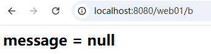
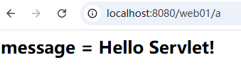

# 转发与重定向

**转发**和**重定向**是 Servlet 中完成资源跳转的重要手段。

---

## 关于 request 域

之前已经接触了一个域对象，叫做应用域：application，对应的接口是：jakarta.servlet.ServletContext，应用域的范围较大，是服务器级别的，整个 webapp 中只有一个应用域对象。

域对象普遍都有以下三个方法：

```java
// 向域绑定数据
void setAttribute(String name, Object data);

// 从域中获取数据
Object getAttribute(String name);

// 删除域中的数据
void removeAttribute(String name);
```

request 是请求域，生命周期较短，只在同一次请求当中有效（因为新的请求会对应新的 request 对象）。因此请求域要小于应用域。

域对象的使用原则：优先选择小的域对象，小的满足不了，再选大的。

---

## 重定向

重定向的代码：

```java
response.sendRedirect("/dept/list");
```

1. 重定向调用的是 response 对象的方法。
2. 重定向时路径以 `/`开始，需要添加项目名。
3. 重定向代码执行时，原理是：response 对象将 `/dept/list`响应给浏览器，浏览器自发的再向服务器发送一次全新的请求，请求路径为：`http://ip:port/dept/list`
4. 重定向是两次请求，怎么理解这个两次请求呢？借用我们之前的一个场景：用户保存部门，保存部门之后重定向到列表页面。
    1. 点击保存时发送了** 第一次 **请求：`http://ip:port/dept/save`，执行 `DeptSaveServlet`
    2. 执行保存逻辑后，`DeptSaveServlet` 执行了重定向的代码：`response.sendRedirect("/dept/list");`
    3. `response` 对象将 `/dept/list`路径响应给浏览器，浏览器又自发的向服务器发送** 第二次 **请求：`http://ip:port/dept/list`
    4. 因此，用户只是点击了 ****一次****** **保存操作，但浏览器一共是发送了****两次****请求。
    5. 并且浏览器地址栏上的地址最终会显示第二次请求的路径，因此重定向会导致浏览器地址栏上的地址发生改变。（也就是说，发送的是 `/dept/save` 路径，显示的是`/dept/list`路径。）
5. 怎么测试重定向是两次请求呢？
    1. 可以使用 request 域来测试，因为 request 域只能保留同一次请求中的数据，如果是两次请求，request 域是无法共享数据的。测试两次请求的代码如下：

```java
package com.jkweilai.servlet;

import jakarta.servlet.ServletException;
import jakarta.servlet.annotation.WebServlet;
import jakarta.servlet.http.HttpServlet;
import jakarta.servlet.http.HttpServletRequest;
import jakarta.servlet.http.HttpServletResponse;

import java.io.IOException;

@WebServlet("/a")
public class AServlet extends HttpServlet {
    @Override
    protected void doGet(HttpServletRequest request, HttpServletResponse response) throws ServletException, IOException {
        // 向请求域中绑定数据
        request.setAttribute("message", "Hello Servlet!");
        // 重定向到 /web01/b
        response.sendRedirect(request.getContextPath() + "/b");
    }
}

```

```java
package com.jkweilai.servlet;

import jakarta.servlet.ServletException;
import jakarta.servlet.annotation.WebServlet;
import jakarta.servlet.http.HttpServlet;
import jakarta.servlet.http.HttpServletRequest;
import jakarta.servlet.http.HttpServletResponse;

import java.io.IOException;

@WebServlet("/b")
public class BServlet extends HttpServlet {
    @Override
    protected void doGet(HttpServletRequest request, HttpServletResponse response) throws ServletException, IOException {
        // 从request域中取数据
        Object message = request.getAttribute("message");
        // 响应到浏览器
        response.setContentType("text/html;charset=UTF-8");
        response.getWriter().print("<h2>message = " + message + "</h2>");
    }
}

```

启动服务器，打开浏览器，输入地址：http://localhost:8080/web01/a，测试结果：



6. 重定向时无法重定向到 `WEB-INF`目录下受保护的资源，例如 `WEB-INF`目录下有一个文件：`a.html`，编写以下代码会出现 404 错误：

```java
response.sendRedirect("/dept/WEB-INF/a.html");
```

为什么？前面我们已经讲过：放在 WEB-INF 目录下的资源是受保护的，不能通过在浏览器地址栏上输入地址来访问。

而重定向是浏览器的行为，以上代码会导致浏览器重新发一次新的请求，而请求路径是：`http://ip:port/dept/WEB-INF/a.html`，因此会出现 404 的问题。

---

## 转发

转发的代码：

```java
request.getRequestDispatcher("/list").forward(request, response);
```

1. 转发是一次请求。可以使用 request 域来测试，转发是否为一次请求，代码如下：

```java
package com.jkweilai.servlet;

import jakarta.servlet.ServletException;
import jakarta.servlet.annotation.WebServlet;
import jakarta.servlet.http.HttpServlet;
import jakarta.servlet.http.HttpServletRequest;
import jakarta.servlet.http.HttpServletResponse;

import java.io.IOException;

@WebServlet("/a")
public class AServlet extends HttpServlet {
    @Override
    protected void doGet(HttpServletRequest request, HttpServletResponse response) throws ServletException, IOException {
        // 向请求域中绑定数据
        request.setAttribute("message", "Hello Servlet!");
        // 转发到 /b
        request.getRequestDispatcher("/b").forward(request, response);
    }
}

```

```java
package com.jkweilai.servlet;

import jakarta.servlet.ServletException;
import jakarta.servlet.annotation.WebServlet;
import jakarta.servlet.http.HttpServlet;
import jakarta.servlet.http.HttpServletRequest;
import jakarta.servlet.http.HttpServletResponse;

import java.io.IOException;

@WebServlet("/b")
public class BServlet extends HttpServlet {
    @Override
    protected void doGet(HttpServletRequest request, HttpServletResponse response) throws ServletException, IOException {
        // 从request域中取数据
        Object message = request.getAttribute("message");
        // 响应到浏览器
        response.setContentType("text/html;charset=UTF-8");
        response.getWriter().print("<h2>message = " + message + "</h2>");
    }
}

```

浏览器地址栏上输入：`http://localhost:8080/web01/a`



2. 转发时路径不需要写项目名。
3. 转发调用的是 request 对象的方法。
4. 转发是当前项目内部资源的跳转，浏览器不参与。
5. 转发时路径可以是 WEB-INF 目录下受保护的资源。

---

## 转发与重定向如何选择

当满足以下任何一个条件时，使用转发，其它情况一律使用重定向：

1. 需要在同一次请求中共享数据。
2. 需要跳转到 WEB-INF 目录下受保护的资源。
