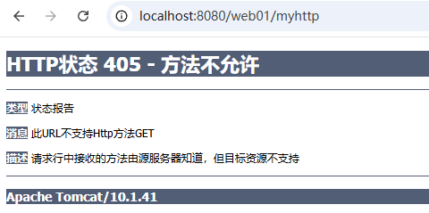

# HttpServlet

---

## 模板方法设计模式

模板方法模式（Template Method Pattern）是GoF 23种设计模式中的一种** 行为型 **设计模式，它定义了一个操作中的算法骨架，而将一些步骤延迟到子类中实现。

### 核心概念

模板方法模式的主要思想是：

+ **定义一个算法的骨架**，将不变的部分（通用步骤）放在父类中实现
+ **可变的部分**（具体实现）通过抽象方法或钩子方法留给子类实现
+ 通过这种方式，可以在不改变算法结构的情况下，重新定义算法中的某些步骤

### 结构组成

模板方法模式通常包含以下几个角色：

1. **抽象类（AbstractClass）**：
    - 定义了一个或多个抽象操作，这些操作由子类实现
    - 实现了一个模板方法，定义了算法的骨架
2. **具体子类（ConcreteClass）**：
    - 实现抽象类中定义的抽象操作
    - 可以有多个具体子类，每个子类提供不同的实现

### 代码示例

```java
// 抽象类
// 游戏模板
abstract class Game {
    
    // 玩游戏的标准流程（模板方法）
    public final void play() {
        start();
        playing();
        if (needSound()) {
            playSound();
        }
    }
    
    // 开始游戏：每种游戏开始方式不同
    protected abstract void start();
    
    // 游戏进行中：每种游戏玩法不同
    protected abstract void playing();
    
    // 播放音效：具体方法，已经有默认实现
    private void playSound() {
        System.out.println("播放游戏音效...");
    }

    // 注意：模板方法设计模式中，不一定要有钩子。不过一般都是有钩子的。因为钩子可以让子类有决定权，子类可以决定步骤中的某个环节是否执行。
    // 是否需要音效：钩子方法，默认需要音效
    protected boolean needSound() {
        return true;
    }
}

// 具体子类
// 象棋游戏
class ChessGame extends Game {
    @Override
    protected void start() {
        System.out.println("摆好棋盘，红方先走");
    }
    
    @Override
    protected void playing() {
        System.out.println("车马炮相士帅，轮流走子");
    }
    
    @Override
    protected boolean needSound() {
        return false; // 象棋不需要音效
    }
}

// 具体子类
// 赛车游戏
class RacingGame extends Game {
    @Override
    protected void start() {
        System.out.println("3、2、1，踩油门出发！");
    }
    
    @Override
    protected void playing() {
        System.out.println("控制方向盘，躲避障碍物");
    }
    // 使用默认的needSound()方法，赛车游戏需要音效
}

// 测试
public class Test {
    public static void main(String[] args) {
        System.out.println("玩象棋：");
        Game chess = new ChessGame();
        chess.play();
        
        System.out.println("\n玩赛车游戏：");
        Game racing = new RacingGame();
        racing.play();
    }
}
```

****注意：模板方法设计模式中，不一定要有钩子。不过一般都是有钩子的。因为钩子可以让子类有决定权，子类可以决定步骤中的某个环节是否执行。****

### 应用场景

模板方法模式适用于以下情况：

1. 一次性实现一个算法的不变部分，将可变部分留给子类实现
2. 各子类中公共的行为应被提取到父类中，避免代码重复

实际应用示例：

1. ****Servlet中的doGet/doPost方法******：HttpServlet类提供了service()方法作为模板方法**
2. ****Spring框架******：JdbcTemplate等模板类大量使用模板方法模式**

### 注意事项

1. 模板方法通常被声明为final，以防止子类重写算法结构
2. 尽量减少模板方法中需要子类实现的方法数量

模板方法模式通过封装算法骨架，实现了代码复用和扩展性的平衡，是面向对象设计中非常实用的一种模式。

---

## HttpServlet 源码剖析

Servlet 规范中，专门针对 HTTP 协议提供了一个 Servlet，名字叫做：HttpServlet。

HttpServlet 的全限定类名是：`jakarta.servlet.http.HttpServlet`。

HttpServlet 源码大致如下：

```java
// ......
public abstract class HttpServlet extends GenericServlet {
    // ......
    private static final String METHOD_DELETE = "DELETE";
    private static final String METHOD_HEAD = "HEAD";
    private static final String METHOD_GET = "GET";
    private static final String METHOD_OPTIONS = "OPTIONS";
    private static final String METHOD_POST = "POST";
    private static final String METHOD_PUT = "PUT";
    private static final String METHOD_TRACE = "TRACE";
    // ......
    @Override
    public void init(ServletConfig config) throws ServletException {
        super.init(config);
        cachedUseLegacyDoHead = Boolean.parseBoolean(config.getInitParameter(LEGACY_DO_HEAD));
    }
    // ......
    
    // 钩子方法。
    protected void doGet(HttpServletRequest req, HttpServletResponse resp) throws ServletException, IOException {
        String msg = lStrings.getString("http.method_get_not_supported");
        sendMethodNotAllowed(req, resp, msg);
    }
    // 钩子方法。
    protected void doPost(HttpServletRequest req, HttpServletResponse resp) throws ServletException, IOException {
        String msg = lStrings.getString("http.method_post_not_supported");
        sendMethodNotAllowed(req, resp, msg);
    }
    // ......
    // 模板方法
    protected void service(HttpServletRequest req, HttpServletResponse resp) throws ServletException, IOException {
        String method = req.getMethod();
        if (method.equals(METHOD_GET)) {
            long lastModified = getLastModified(req);
            if (lastModified == -1) {
                doGet(req, resp);
            } else {
                long ifModifiedSince;
                try {
                    ifModifiedSince = req.getDateHeader(HEADER_IFMODSINCE);
                } catch (IllegalArgumentException iae) {
                    // Invalid date header - proceed as if none was set
                    ifModifiedSince = -1;
                }
                if (ifModifiedSince < (lastModified / 1000 * 1000)) {
                    // If the servlet mod time is later, call doGet()
                    // Round down to the nearest second for a proper compare
                    // A ifModifiedSince of -1 will always be less
                    maybeSetLastModified(resp, lastModified);
                    doGet(req, resp);
                } else {
                    resp.setStatus(HttpServletResponse.SC_NOT_MODIFIED);
                }
            }

        } else if (method.equals(METHOD_HEAD)) {
            long lastModified = getLastModified(req);
            maybeSetLastModified(resp, lastModified);
            doHead(req, resp);

        } else if (method.equals(METHOD_POST)) {
            doPost(req, resp);

        } else if (method.equals(METHOD_PUT)) {
            doPut(req, resp);

        } else if (method.equals(METHOD_DELETE)) {
            doDelete(req, resp);

        } else if (method.equals(METHOD_OPTIONS)) {
            doOptions(req, resp);

        } else if (method.equals(METHOD_TRACE)) {
            doTrace(req, resp);

        } else {
            String errMsg = lStrings.getString("http.method_not_implemented");
            Object[] errArgs = new Object[1];
            errArgs[0] = method;
            errMsg = MessageFormat.format(errMsg, errArgs);
            resp.sendError(HttpServletResponse.SC_NOT_IMPLEMENTED, errMsg);
        }
    }
    @Override
    public void service(ServletRequest req, ServletResponse res) throws ServletException, IOException {s
        HttpServletRequest request;
        HttpServletResponse response;
        try {
            request = (HttpServletRequest) req;
            response = (HttpServletResponse) res;
        } catch (ClassCastException e) {
            throw new ServletException(lStrings.getString("http.non_http"));
        }
        service(request, response);
    }
    // ......
}
```

通过以上 `HttpServlet`的源码可以看到，`HttpServlet`继承了 `GenericServlet`。因此 `HttpServlet`也实现了 `Servlet`接口。另外还可以看到 `HttpServlet`也是一个抽象类。

HttpServlet 核心源码大概 90 来行，大家可以认真读一下。假设你编写一个类 `MyServlet`直接继承了 `HttpServlet`，然后重写了 `doGet`方法。 当用户发送第一次请求的时候（**发送 get 请求**），底层的执行过程是怎样的呢？

```java
@WebServlet("/myservlet") // servlet3.0版本中引入的注解。代替<url-pattern>。
public class MyServlet extends HttpServlet{
    public void doGet(HttpServletRequest req, HttpServletResponse resp) throws ServletException, IOException {
        System.out.println("MyServlet's doGet execute!");
    }
}
```

我们来尝试描述下：

1. 当用户发送 get 请求：http://localhost:8080/web01/myservlet
2. Tomcat 服务器接收到 `/web01/myservlet`请求路径
3. Tomcat 服务器在整个容器中查找请求路径对应的 Servlet 实例，结果没找到。
4. Tomcat 服务器通过反射机制调用 `MyServlet`类的无参数构造方法完成实例化操作。
5. Tomcat 服务器调用 `MyServlet`对象的 `init(ServletConfig)`方法。
    1. 由于这个 init 方法并没有在 MyServlet 类中重写，因此会调用 HttpServlet 类的 init 方法。
    2. 通过 HttpServlet 源码可以看到 HttpServlet 的 init 方法调用了 GenericServlet 的 init(ServletConfig) 方法：super.init(config);
    3. 因此，GenericServlet 的 init(ServletConfig) 方法执行，完成了 ServletConfig 属性的赋值操作。
    4. HttpServlet 的 init 方法执行结束后，MyServlet 完成了初始化操作。
6. Tomcat 服务器调用 `MyServlet`对象的 `service`方法，由于在 `MyServlet`类中没有重写 `service`方法，因此会调用 `HttpServlet`的 `service`方法。`HttpServlet`类中的 `service`方法有两个，如下：
    1. service(ServletRequest req, ServletResponse res) ：这个方法是 Servlet 接口中的方法，因此这个方法会先被调用。
    2. service(HttpServletRequest req, HttpServletResponse resp)
7. 通过 `service(ServletRequest req, ServletResponse res)`方法的源码可以看出，将 ServletRequest 转换成了 HttpServletRequest，将 ServletResponse 转换成了 HttpServletResponse，然后调用了 `service(HttpServletRequest req, HttpServletResponse resp)`。
    1. HttpServletRequest 是专门为 HTTP 协议准备的请求对象，全限定接口名：jakarta.servlet.http.HttpServletRequest
    2. HttpServletResponse 是专门为 HTTP 协议准备的响应对象，全限定接口名：jakarta.servlet.http.HttpServletResponse
8. 在 `service(HttpServletRequest req, HttpServletResponse resp)`方法执行的过程中：
    1. 第一行代码：String method = req.getMethod(); 获取请求方式，因为前端发送的是 get 请求，因此 method 变量的值是"GET"。
    2. 程序继续向下执行，由于前端发送 GET 请求，因此会调用 `doGet`方法，由于 MyServlet 类正好重写了 doGet 方法，因此 MyServlet 对象的 doGet 方法被调用。该方法执行过程中处理当前的用户请求。

HttpServlet 类中的 service(HttpServletRequest req, HttpServletResponse resp)方法是一个模板方法，定义了核心算法骨架，具体的步骤延迟到子类 MyServlet 中实现的。因此 HttpServlet 是一个非常典型的模板方法设计模式。

---

## 405 错误的发生

根据 HttpServlet 源码可以看出，当 HttpServlet 类中的任何一个 doXxx 方法执行时，都会发生 405 错误：

```java
protected void doGet(HttpServletRequest req, HttpServletResponse resp) throws ServletException, IOException {
    String msg = lStrings.getString("http.method_get_not_supported");
    sendMethodNotAllowed(req, resp, msg);
}
protected void doPost(HttpServletRequest req, HttpServletResponse resp) throws ServletException, IOException {
    String msg = lStrings.getString("http.method_post_not_supported");
    sendMethodNotAllowed(req, resp, msg);
}
```

什么情况下会发生 405 错误呢？当用户发送 get 请求，Servlet 类继承 HttpServlet 之后重写的不是 doGet 方法，则 HttpServlet 中的 doGet 方法会执行，此时就会发生 405。

怎么避免 405？前端发送 get 请求，重写 doGet 方法。前端发送 post 请求，重写 doPost 方法。则不会出现 405 错误。

编写代码测试一下 405 错误，前端发送 get 请求，后端重写 doPost 方法：

```java
package com.jkweilai.servlet;

import jakarta.servlet.ServletException;
import jakarta.servlet.annotation.WebServlet;
import jakarta.servlet.http.HttpServlet;
import jakarta.servlet.http.HttpServletRequest;
import jakarta.servlet.http.HttpServletResponse;

import java.io.IOException;

@WebServlet("/myhttp")
public class MyHttpServlet extends HttpServlet {

    @Override
    protected void doPost(HttpServletRequest request, HttpServletResponse response) throws ServletException, IOException {

    }
}
```

启动服务器，打开浏览器，在地址栏直接输入 URL，这种方式就是 get 请求：http://localhost:8080/web01/myhttp



因此，要避免 405 错误，前后端处理方式要一致。

---

## JavaWeb 项目的最佳实践

最终最佳实践：

1. 编写 Servlet 类时继承 HttpServlet
2. 前端发送 get 请求，则重写 doGet 方法
3. 前端发送 post 请求，则重写 doPost 方法。
