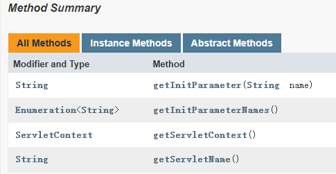
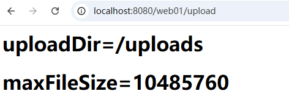
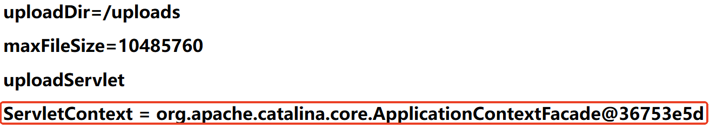

# ServletConfig

---

## ServletConfig 对象的实例化

我们在学习 `GenericServlet`的时候，有两个 init 方法，一个是 `init(ServletConfig)`，另一个是 `init()`。

这个 `init(ServletConfig)`方法是 `Servlet`接口中的方法，`GenericServlet`对它进行了实现，具体的实现如下：

```java
public class GenericServlet {
    
    private transient ServletConfig config;

    // ...
    
    @Override
    public void init(ServletConfig config) throws ServletException {
        this.config = config;
        this.init();
    }

    public void init() throws ServletException {
        // NOOP by default
    }

    // ...
}    
```

我们之前学习 Servlet 生命周期的时候提到过，`init(ServletConfig)`方法在 Servlet 对象实例化之后立即被调用，并且该方法由 Web 服务器负责调用。大家可以试想一下，该方法有一个参数 `ServletConfig`，如果 Web 服务器要调用该方法，必须给该方法传一个 `ServletConfig`实例才能调用吧？没错，Web 服务器在调用 Servlet 对象的 `init(ServletConfig)`方法之前，会先创建 `ServletConfig`对象。

---

## ServletConfig 是什么

ServletConfig 是 Servlet 规范中的一员，接口名为：jakarta.servlet.ServletConfig。

ServletConfig 接口由 Web 服务器提供实现。但我们程序员不需要关心具体的实现类，我们只需要面向 ServletConfig 接口编程即可。

ServletConfig 接口的实例由 Web 服务器创建。

ServletConfig 对象在 init 方法执行之前被创建。

ServletConfig 对象被称为 Servlet 配置信息对象。Servlet 在 web.xml 文件中的配置信息会被 Web 服务器封装到 ServletConfig 对象中，例如以下配置信息：

```xml
<servlet>
    <servlet-name>uploadServlet</servlet-name>
    <servlet-class>com.jkweilai.servlet.FileUploadServlet</servlet-class>
    <!-- Servlet专属的上传路径配置 -->
    <init-param>
        <param-name>upload</param-name>
        <param-value>/uploads</param-value>
    </init-param>
    <init-param>
        <param-name>maxFileSize</param-name>
        <param-value>10485760</param-value> <!-- 10MB -->
    </init-param>
</servlet>
```

因此，我们通过 `**FileUploadServlet**`对象关联的** **`**ServletConfig**`对象，可以获取以上文件上传路径的配置，以及支持上传最大文件的配置。

每一个 Servlet 对象都对应一个 ServletConfig 对象，是一对一的关系。

---

## ServletConfig 对象如何获取

在 `GenericServlet`中有这样一段代码：

```java
public class GenericServlet {
    
    private transient ServletConfig config;

    // ...
    
    @Override
    public ServletConfig getServletConfig() {
        return config;
    }

    // ...
} 
```

我们要编写的 Servlet 类都会继承 GenericServlet，因此都可以通过 `getServletConfig()`方法来获取 `ServletConfig`对象。

---

## ServletConfig 接口常用方法

参考 `Jakarta EE 10`的 API 帮助文档。



### 获取 Servlet 初始化参数

获取初始化参数的配置信息，可以通过以下两个方法：

```java
// 通过初始化参数的name获取value
String getInitParameter(String name);

// 获取所有初始化参数的name
Enumeration<String> getInitParameterNames();
```

假设在 web.xml 中有这样的配置：

```xml
<servlet>
    <servlet-name>uploadServlet</servlet-name>
    <servlet-class>com.jkweilai.servlet.FileUploadServlet</servlet-class>
    <!--这就是Servlet初始化参数，这些配置信息会被Web服务器自动封装到ServletConfig对象中-->
    <init-param>
        <param-name>uploadDir</param-name>
        <param-value>/uploads</param-value>
    </init-param>
    <init-param>
        <param-name>maxFileSize</param-name>
        <param-value>10485760</param-value><!--最大10MB-->
    </init-param>
</servlet>
<servlet-mapping>
    <servlet-name>uploadServlet</servlet-name>
    <url-pattern>/upload</url-pattern>
</servlet-mapping>
```

在 `FileUploadServlet`中调用以上两个方法即可获取初始化参数的配置信息：

```java
package com.jkweilai.servlet;

import jakarta.servlet.*;

import java.io.IOException;
import java.io.PrintWriter;
import java.util.Enumeration;

public class FileUploadServlet extends GenericServlet {
    @Override
    public void service(ServletRequest request, ServletResponse response) throws ServletException, IOException {

        response.setContentType("text/html;charset=UTF-8");
        PrintWriter out = response.getWriter();

        // 获取ServletConfig对象
        ServletConfig servletConfig = this.getServletConfig();
        // 获取初始化参数配置信息
        Enumeration<String> initParameterNames = servletConfig.getInitParameterNames();
        while (initParameterNames.hasMoreElements()) {
            String initParameterName = initParameterNames.nextElement();
            String initParameterValue = servletConfig.getInitParameter(initParameterName);
            out.print("<h1>" + initParameterName + "=" + initParameterValue + "</h1>");
        }
    }
}

```

执行结果如下：



当然，我们也可以不获取 `ServletConfig`对象，直接调用 `Servlet`对象的 `getInitParameterNames()`和 `getInitParameter(name)`也是可以的，这是因为我们编写 Servlet 继承了 `GenericServlet`，在该类中提供了这两个方法，作为子类 Servlet 当然可以直接调用，请再次查看 GenericServlet 源码：

```java
public class GenericServlet {
    
    private transient ServletConfig config;

    // ...
    
    @Override
    public ServletConfig getServletConfig() {
        return config;
    }

    // 额外扩展的方法
    @Override
    public String getInitParameter(String name) {
        return getServletConfig().getInitParameter(name);
    }

    // 额外扩展的方法
    @Override
    public Enumeration<String> getInitParameterNames() {
        return getServletConfig().getInitParameterNames();
    }

    // ...
}
```

通过源码可以看到底层实际上调用的还是 `ServletConfig`对象的方法。因此代码可以修改为：

```java
package com.jkweilai.servlet;

import jakarta.servlet.*;

import java.io.IOException;
import java.io.PrintWriter;
import java.util.Enumeration;

public class FileUploadServlet extends GenericServlet {
    @Override
    public void service(ServletRequest request, ServletResponse response) throws ServletException, IOException {

        response.setContentType("text/html;charset=UTF-8");
        PrintWriter out = response.getWriter();
        
        // 获取初始化参数配置信息
        Enumeration<String> initParameterNames = this.getInitParameterNames();
        while (initParameterNames.hasMoreElements()) {
            String initParameterName = initParameterNames.nextElement();
            String initParameterValue = this.getInitParameter(initParameterName);
            out.print("<h1>" + initParameterName + "=" + initParameterValue + "</h1>");
        }
    }
}
```

执行结果和之前一样。

### 获取 Servlet 名字

```java
String getServletName();
```

通过这个方法可以获取 `<servlet-name>servletName</servlet-name>`配置中的 `servletName`。

```java
// 获取ServletName
ServletConfig servletConfig = this.getServletConfig();
String servletName = servletConfig.getServletName();
out.println("<h1>" + servletName + "</h1>");
```

运行结果如下：


同样，在 `GenericServlet`中也提供了这样一个方法，可以在不获取 `ServletConfig`对象时直接获取 ServletName，代码如下：

```java
// 获取ServletName
String servletName = this.getServletName();
out.println("<h1>" + servletName + "</h1>");
```

运行效果和之前相同。

### 获取 ServletContext 对象

```java
ServletContext getServletContext();
```

代码如下：

```java
// 获取ServletContext对象
ServletConfig servletConfig = this.getServletConfig();
ServletContext application = servletConfig.getServletContext();
out.print("<h1>ServletContext = " + application + "</h1>");
```

执行结果如下：



同样，在 `GenericServlet`类也提供了这样一个方法，因此在不获取 ServletConfig 对象的前提下，直接获取 ServletContext 对象也是可以的，代码如下：

```java
ServletContext application = this.getServletContext();
out.print("<h1>ServletContext = " + application + "</h1>");
```

运行结果和之前一样。
