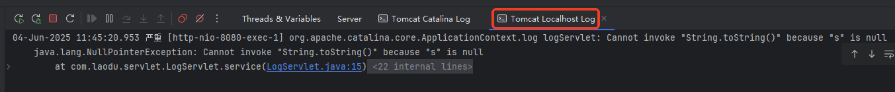

# ServletContext

---

## ServletContext 是什么

1. ServletContext 全接口名为：`jakarta.servlet.ServletContext`。
2. ServletContext 被称为 Servlet 上下文对象。**所有 Servlet 共享的一个对象**。
3. ServletContext 类型的变量名一般叫做：application
4. Web 服务器提供了 ServletContext 的实现，但我们只需面向 ServletContext 接口调用。
5. ServletContext 对象在 Web 服务器启动时创建，对于整个 web 应用来说 ServletContext 对象只有一个，在 Web 服务器关闭的时候 ServletContext 对象才会被销毁。

---

## ServletContext 的主要作用

1. 应用范围的数据共享：在整个Web应用中共享数据
2. 获取应用初始化参数：读取`web.xml`中配置的上下文参数
3. 访问应用资源：获取Web应用内的文件资源路径
4. 日志记录：提供应用级的日志记录功能

---

## 如何获取 ServletContext

**第一种方式**：通过 ServletConfig 来获取

```java
ServletConfig config = this.getServletConfig();
ServletContext application = config.getServletContext();
```

**第二种方式**：直接在 Servlet 类中获取

```java
ServletContext application = this.getServletContext();
```

---

## ServletContext 中的常用方法

参考 `Jakarta EE 10`的 API 帮助文档。这里只看它的常用方法：

```java
// 向应用域中绑定数据
void setAttribute(String name, Object object);
// 通过name获取应用域中绑定的数据
Object getAttribute(String name);
// 根据name删除应用域中绑定的数据
void removeAttribute(String name);

// 通过上下文初始化参数的name获取value。
String getInitParameter(String name);
// 获取所有上下文初始化参数的name
Enumeration<String> getInitParameterNames();

// 获取应用的根路径
String getContextPath();
// 获取绝对路径
String getRealPath(String path);
// 获取 指向某个文件的输入流
InputStream getResourceAsStream(String path);

// 将指定消息写入Servlet日志文件
void log(String message);
void log(String message, Throwable throwable);
```

### 应用范围的数据共享

放在应用域中的数据所有 Servlet 共享，所有线程共享，**注意线程安全问题**，如果是热点数据，共享数据，少量数据，并且低频变更，建议存储到应用域中。

相关的方法包括以下三个：

```java
// 向应用域中绑定数据
void setAttribute(String name, Object object);
// 通过name获取应用域中绑定的数据
Object getAttribute(String name);
// 根据name删除应用域中绑定的数据
void removeAttribute(String name);
```

先简单测试一下这几个方法的使用。**具体的应用场景等学完监听器之后再看**。

编写两个 Servlet：SetDataServlet、GetDataServlet。

在 SetDataServlet 中向应用域中绑定数据。在 GetDataServlet 中从应用域中读取绑定的数据。在 RemoveDataServlet 中从应用域中删除数据。

```java
package com.jkweilai.servlet;

import jakarta.servlet.*;

import java.io.IOException;

public class SetDataServlet extends GenericServlet {
    @Override
    public void service(ServletRequest req, ServletResponse res) throws ServletException, IOException {
        ServletContext application = this.getServletContext();
        application.setAttribute("applicationData", "application-data");
    }
}

```

```java
package com.jkweilai.servlet;

import jakarta.servlet.*;

import java.io.IOException;

public class GetDataServlet extends GenericServlet {
    @Override
    public void service(ServletRequest req, ServletResponse res) throws ServletException, IOException {
        ServletContext application = this.getServletContext();
        Object applicationData = application.getAttribute("applicationData");
        res.getWriter().print("<h1>" + applicationData + "</h1>");
    }
}

```

```java
package com.jkweilai.servlet;  
  
import jakarta.servlet.*;  
  
import java.io.IOException;  
  
public class RemoveDataServlet extends GenericServlet {  
    @Override  
    public void service(ServletRequest servletRequest, ServletResponse servletResponse) throws ServletException, IOException {  
        ServletContext application = this.getServletContext();  
        application.removeAttribute("applicationData");  
    }
}
```

```xml
<servlet>
    <servlet-name>setData</servlet-name>
    <servlet-class>com.jkweilai.servlet.SetDataServlet</servlet-class>
</servlet>
<servlet-mapping>
    <servlet-name>setData</servlet-name>
    <url-pattern>/set</url-pattern>
</servlet-mapping>

<servlet>
    <servlet-name>getData</servlet-name>
    <servlet-class>com.jkweilai.servlet.GetDataServlet</servlet-class>
</servlet>
<servlet-mapping>
    <servlet-name>getData</servlet-name>
    <url-pattern>/get</url-pattern>
</servlet-mapping>

<servlet>  
    <servlet-name>removeData</servlet-name>  
    <servlet-class>com.jkweilai.servlet.RemoveDataServlet</servlet-class>  
</servlet>  
<servlet-mapping>  
    <servlet-name>removeData</servlet-name>  
    <url-pattern>/remove</url-pattern>  
</servlet-mapping>
```

测试，发送三个请求：

1. http://localhost:8080/web01/set （设置）
2. http://localhost:8080/web01/get （就看到显示：application-data字样，如下图）
3. http://localhost:8080/web01/remove （删除该字段）


### 获取上下文初始化参数

`<init-param>`属于 Servlet 初始化参数，**局部的**。如果这个配置是某一个 Servlet 使用，可以使用这种方式。

`<context-param>`属于应用上下文初始化参数，**全局的**。如果这个配置是所有 Servlet 共享的，可以使用这种方式。

上下文初始化参数在 web.xml 文件中配置如下：

```xml
<context-param>
    <param-name>pagination.defaultPageSize</param-name>
    <param-value>10</param-value>
</context-param>
<context-param>
    <param-name>application.name</param-name>
    <param-value>新闻发布系统</param-value>
</context-param>

<servlet>
    <servlet-name>contextParam</servlet-name>
    <servlet-class>com.jkweilai.servlet.ContextParamServlet</servlet-class>
</servlet>
<servlet-mapping>
    <servlet-name>contextParam</servlet-name>
    <url-pattern>/contextParam</url-pattern>
</servlet-mapping>
```

获取上下文初始化参数的代码：

```java
package com.jkweilai.servlet;

import jakarta.servlet.*;

import java.io.IOException;
import java.io.PrintWriter;
import java.util.Enumeration;

public class ContextParamServlet extends GenericServlet {
    @Override
    public void service(ServletRequest req, ServletResponse res) throws ServletException, IOException {
        res.setContentType("text/html;charset=UTF-8");
        PrintWriter out = res.getWriter();
        ServletContext application = this.getServletContext();
        Enumeration<String> initParameterNames = application.getInitParameterNames();
        while (initParameterNames.hasMoreElements()) {
            String paramName = initParameterNames.nextElement();
            String paramValue = application.getInitParameter(paramName);
            out.print("<h3>" + paramName + "=" + paramValue + "</h3>");
        }
    }
}

```

运行结果：


### 访问应用资源

访问应用资源涉及到以下三个方法：

```java
// 获取应用的根路径
String getContextPath();
// 获取绝对路径
String getRealPath(String path);
// 获取 指向某个文件的输入流
InputStream getResourceAsStream(String path);
```

访问应用资源的 Java 代码：

```java
package com.jkweilai.servlet;

import jakarta.servlet.*;

import java.io.IOException;
import java.io.InputStream;
import java.io.PrintWriter;

public class AccessAppResourceServlet extends GenericServlet {
    @Override
    public void service(ServletRequest request, ServletResponse response) throws ServletException, IOException {

        response.setContentType("text/html;charset=UTF-8");
        PrintWriter out = response.getWriter();

        ServletContext application = this.getServletContext();

        // 获取应用根路径
        String contextPath = application.getContextPath();
        out.print("<h3>应用根路径：" + contextPath + "</h3>");

        // 获取绝对路径（路径参数编写时要注意：以"/"开始，从应用的根路径下开始找。）
        String realPath = application.getRealPath("/WEB-INF/web.xml");
        out.print("<h3>绝对路径：" + realPath + "</h3>");

        // 以流的形式获取资源（路径参数编写时要注意：以"/"开始，从应用的根路径下开始找。）
        InputStream in = application.getResourceAsStream("/WEB-INF/web.xml");
        out.print("<h3>以流的形式获取资源：" + in + "</h3>");
    }
}

```

```xml
<servlet>
    <servlet-name>accessAppResourceServlet</servlet-name>
    <servlet-class>com.jkweilai.servlet.AccessAppResourceServlet</servlet-class>
</servlet>
<servlet-mapping>
    <servlet-name>accessAppResourceServlet</servlet-name>
    <url-pattern>/accessAppResource</url-pattern>
</servlet-mapping>
```

运行结果：


### 日志记录

日志记录涉及到以下两个方法：

```java
// 将指定消息写入Servlet日志文件
void log(String message);
void log(String message, Throwable throwable);
```

这两个方法可以通过 `ServletContext`对象来调用，也可以直接在 `Servlet`类中使用 `this`来调用，这是因为在 `GenericServlet`类中扩展了这两个方法，大家可以再翻一下 GenericServlet 的源码：

```java
public class GenericServlet{

    // ...
    
    // 额外扩展的方法
    public void log(String message) {
        getServletContext().log(getServletName() + ": " + message);
    }

    // 额外扩展的方法
    public void log(String message, Throwable t) {
        getServletContext().log(getServletName() + ": " + message, t);
    }

    // ...
}
```

可以看到，扩展的这两个方法，其实底层还是调用了 `ServletContext`对象的 `log`方法。

编写程序测试这两个方法：

```java
package com.jkweilai.servlet;

import jakarta.servlet.GenericServlet;
import jakarta.servlet.ServletException;
import jakarta.servlet.ServletRequest;
import jakarta.servlet.ServletResponse;

import java.io.IOException;

public class LogServlet extends GenericServlet {
    @Override
    public void service(ServletRequest req, ServletResponse res) throws ServletException, IOException {
        try {
            String s = null;
            s.toString();
        } catch (Exception e) {
            this.log(e.getMessage(), e);
        }
    }
}
```

```xml
<servlet>
    <servlet-name>logServlet</servlet-name>
    <servlet-class>com.jkweilai.servlet.LogServlet</servlet-class>
</servlet>
<servlet-mapping>
    <servlet-name>logServlet</servlet-name>
    <url-pattern>/log</url-pattern>
</servlet-mapping>
```

启动 Tomcat 服务器，打开浏览器，地址栏输入 URL：http://localhost:8080/web01/log

在控制台上查看日志（Tomcat 独立部署时，日志会输出到`****logs/localhost.YYYY-MM-DD.log****`**和**`****catalina.out****`）：



---

## Servlet、ServletConfig、ServletContext 关系

1. **一个Web应用只有一个**`ServletContext`**（全局共享）**
2. **每个**`Servlet`**有自己独立的**`ServletConfig`**（存放私有配置）**
3. `Servlet`**本身是处理请求的核心组件，它能通过**`ServletConfig`**获取**`ServletContext`**。**
