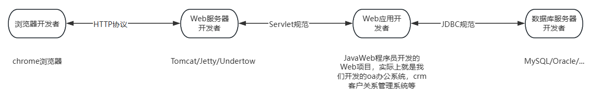

# 深入理解 Servlet

---

## BS 系统涉及的角色与协议

> 我的理解：简单来讲就是每一波开发人员彼此通过协议连接从而实现解耦合。

详细图


简略图



4 个角色

+ 浏览器开发者（开发谷歌浏览器的那些人）
+ Web 服务器开发者（开发 Tomcat 服务器的那些人）
+ Web 应用开发者（JavaWeb 程序员，说的是我们）
+ 数据库服务器开发者（开发 MySQL 数据库的那些人）

3 个协议

+ 浏览器和 Web 服务器之间的通信协议 HTTP。
+ Web 服务器和 Web 应用之间都必须遵循 Servlet 规范。这样 Web 服务器和 Web 应用才可以解耦合。****（怎么理解解耦合：Web 应用开发完成后不一定非要部署到 Tomcat 中，可以部署到任何一个实现了 Servlet 规范的容器中）****
+ Web 应用中的 Java 程序和数据库服务器之间必须遵循 JDBC 规范。这样 Java 程序和具体的数据库产品就解耦合了。****（怎么理解解耦合：Java 程序不一定非要连接 MySQL 数据库，不改任何代码的前提下，还可以连接 Oracle 数据库）****

Servlet定义的具体内容

1. Servlet 规范定义了一些接口和类，例如接口 `jakarta.servlet.Servlet`、`jakarta.servlet.ServletRequest`、`jakarta.servlet.ServletResponse`。Tomcat 服务器面向接口调用和实现。JavaWeb 程序员也面向这些接口调用和实现。这样 Web 服务器和 Web 应用就达到了解耦合。
2. 规定了 JavaWeb 应用的目录结构
3. 规定的配置文件不能随便写

---

## 模拟 Servlet 接口

我们来模拟一下 Servlet 接口，更好的理解 Servlet 的本质及实现原理。

首先创建两个 `Servlet` 实现类

```java
package jakarta.servlet;

public interface Servlet{
    // 处理请求的核心方法
    void service();
}
```

```java
package com.jkweilai.servlet;

import jakarta.servlet.Servlet;

public class LoginServlet implements Servlet{
    public void service(){
        System.out.println("正在处理用户的登录请求...");
    }
}
```

```java
package com.jkweilai.servlet;

import jakarta.servlet.Servlet;

public class DeptDeleteServlet implements Servlet{
    public void service(){
        System.out.println("正在删除部门信息...");
    }
}
```

然后创建 url 和 实现类的对应关系，假设用一个配置文件来保存，`web.properties`

```properties
/login=com.jkweilai.servlet.LoginServlet
/del=com.jkweilai.servlet.DeptDeleteServlet
```

创建一个程序模拟 Tomcat 服务器：通过 `Scanner` 接收一个字符串，当作url，然后去返回对应的 `Servlet` 实现类

```java
package org.apache.catalina.startup;

import java.util.Scanner;
import java.util.ResourceBundle;
import jakarta.servlet.Servlet;

public class Bootstrap{

    public static void main(String[] args) throws Exception{
        System.out.println("Tomcat服务器启动成功，开始接收用户请求...");
        ResourceBundle bundle = ResourceBundle.getBundle("web");
        Scanner s = new Scanner(System.in);
        while(true){
            System.out.print("请输入请求路径：");
            String url = s.next();
            String servletClassName = bundle.getString(url);
            Class clazz = Class.forName(servletClassName);
            Servlet servlet = (Servlet)clazz.newInstance();
            servlet.service();
        }
    }
}
```
