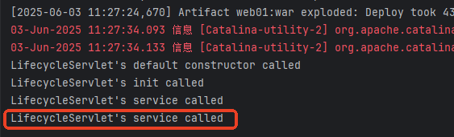
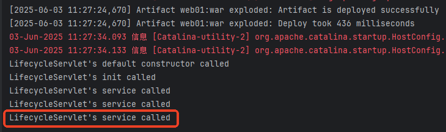

# Servlet 对象生命周期

---

## 生命周期及管理者

Servlet 生命周期指的是：Servlet 对象从创建到最终被销毁的整个过程。

Servlet 生命周期由 Servlet 容器来负责管理，JavaWeb 程序员无权干涉。（Servlet 容器指的是 Web 服务器/Web 容器，例如 Tomcat、Jetty 等。）

也就是说，Servlet 对象的创建和该对象上方法的调用，都是由 Tomcat 服务器来负责的，我们不能通过 new 运算符来实例化 Servlet 对象，因为我们自己 new 的 Servlet 对象生命周期不受 Tomcat 服务器的管理。

---

## 测试 Servlet 生命周期

编写以下代码测试 Servlet 对象生命周期：

```java
package com.jkweilai.servlet;

import jakarta.servlet.*;

import java.io.IOException;

public class LifecycleServlet implements Servlet {
    
    // 额外添加的无参构造器，不是必须的
    public LifecycleServlet() {
        System.out.println("LifecycleServlet's default constructor called");
    }

    @Override
    public void init(ServletConfig servletConfig) throws ServletException {
        System.out.println("LifecycleServlet's init called");
    }

    @Override
    public void service(ServletRequest servletRequest, ServletResponse servletResponse) throws ServletException, IOException {
        // 注意！tomcat的默认编码方式是平台的，比如gbk。但是idea默认是utf-8
        // 建议启动的时候，手动指定标准输出流实用utf-8
        // 运行的配置里面：VM-Options里面添加：-Dstdoust encoding=UTF-8
        // 
        System.out.println("LifecycleServlet's service called");
    }

    @Override
    public void destroy() {
        System.out.println("LifecycleServlet's destroy called");
    }

    @Override
    public String getServletInfo() {
        return "";
    }

    @Override
    public ServletConfig getServletConfig() {
        return null;
    }

}

```

配置 web.xml：

```xml
<servlet>
    <servlet-name>lifeServlet</servlet-name>
    <servlet-class>com.jkweilai.servlet.LifecycleServlet</servlet-class>
</servlet>
<servlet-mapping>
    <servlet-name>lifeServlet</servlet-name>
    <url-pattern>/life</url-pattern>
</servlet-mapping>
```

启动服务器，观察启动过程，看看在启动过程中 Servlet 无参数构造方法是否执行，然后发送第一次请求，观察控制台的输出结果，再发送第二次、第三次请求，观察控制台的输出结果，最后再关闭服务器，看控制台变化：

启动服务器发送第一次请求：


发送第二次请求：



发送第三次请求：



最后关闭 Tomcat 服务器：


---

## 根据测试总结生命周期

1. 默认情况下，**在服务器启动的时候并不会创建 Servlet 对象**。当用户发送第一次请求时，Servlet 对象才会被创建。
2. 当用户发送第一次请求时，Tomcat 会调用 Servlet 类的无参数构造方法完成实例化，对象创建完毕后，Tomcat 服务器会调用一次 Servlet 对象的 init 方法完成 Servlet 初始化。初始化完成后，Tomcat 会调用 Servlet 对象的 service 方法处理用户的请求。
    ```bash
    # 第一次点击
    LifecycleServlet's default constructor called
    LifecycleServlet's init called
    LifecycleServlet's service called
    
    # 后面的每一次点击
    LifecycleServlet's service called
    ```
3. 服务器关闭的时候销毁 Servlet 对象，销毁 Servlet 对象之前会调用一次 `destroy`方法。
4. 在服务器运行期间，同一个类型的 Servlet 对象只会被实例化一次。也就是说 Servlet 对象是单例的。另外 Tomcat 服务器是支持多线程的。因此 Servlet 是在**单实例多线程** 的环境下运行的。

---

## Servlet 三个核心方法的作用

### init 方法

init 方法只会被调用一次，在 Servlet 对象实例化完成后立即被调用，主要负责 Servlet 初始化工作。

也就是说，如果你希望在 Servlet 对象创建时执行一些操作，可以将代码写到 init 方法中。例如：解析 xml 文件、初始化连接池等耗时以及要求执行一次的操作。

思考：既然是这样，我们能否使用无参数构造方法来替代 init 方法呢？不能，Servlet 规范中规定，JavaWeb 程序员不应该在 Servlet 类中提供任何构造方法，因为这种行为可能会导致 Servlet 对象无法实例化。

怎么理解？为什么可能会导致无法实例化？实际上，创建 Servlet 对象是通过反射机制完成的，例如代码：

```java
Class clazz = Class.forName("com.jkweilai.servlet.LifecycleServlet");
Servlet servlet = (Servlet)clazz.newInstance();
```

大家应该知道，`newInstance()`方法底层调用的是无参数构造方法，如果程序员在 Servlet 类中提供构造方法的话，可能会导致无参数构造方法丢失，从而影响 Servlet 对象的实例化。因此官方不建议将代码写到构造方法中，如果你需要在创建对象的时间点上执行代码的话，请将其编写到 init 方法中。

另外 init 方法上有一个参数 `ServletConfig`，这个对象表示 **Servlet 配置信息对象**，该对象也是由 Tomcat 服务器来创建的，Tomcat 服务器将它创建好之后调用 init 方法，并且将 ServletConfig 作为 init 方法的参数传给了我们，我们可以直接使用。关于 `ServletConfig`的使用，后面再介绍。

### service 方法

service 方法是最重要最核心的一个方法。用户只要发送一次请求，service 方法就会被调用一次。

该方法上有两个非常重要的参数：

+ jakarta.servlet.ServletRequest request：请求对象（该对象中封装了请求协议）
+ jakarta.servlet.ServletResponse response：响应对象（该对象负责响应协议）

request 和 response 两个对象也不需要我们自己 new，Tomcat 服务器已经为我们创建好了，我们直接在 service 方法体中使用即可。

### destroy 方法

destroy 方法只会被调用一次，该方法没有任何参数。该方法被调用时 Servlet 对象还没有被销毁，只是即将被销毁。

如果你希望在对象被销毁的时候执行一次特殊的操作，例如释放连接池，可以将代码编写到 destroy 方法中。

---

## 服务器启动时创建 Servlet

默认情况下，Web 服务器启动时，并不会去实例化 Servlet 对象，这样可以减少内存的开销。如果想在服务器启动阶段就实例化 Servlet，可以给 Servlet 添加 `<load-on-startup>`配置，值越小，实例化的优先级越高。例如：

```xml
<servlet>
    <servlet-name>lifeServlet</servlet-name>
    <servlet-class>com.jkweilai.servlet.LifecycleServlet</servlet-class>
    <!--值越小优先级越高-->
    <load-on-startup>1</load-on-startup>
</servlet>
<servlet-mapping>
    <servlet-name>lifeServlet</servlet-name>
    <url-pattern>/life</url-pattern>
</servlet-mapping>
```

启动服务器，查看控制台输出：


可以看到，服务器启动的时候会调用 `LifecycleServlet`的无参数构造方法，完成 Servlet 对象的实例化。
