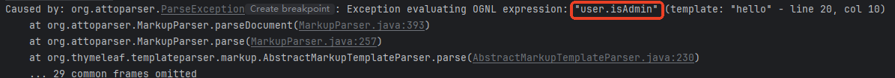
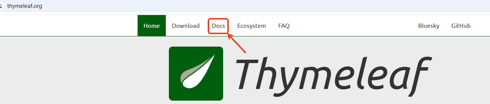
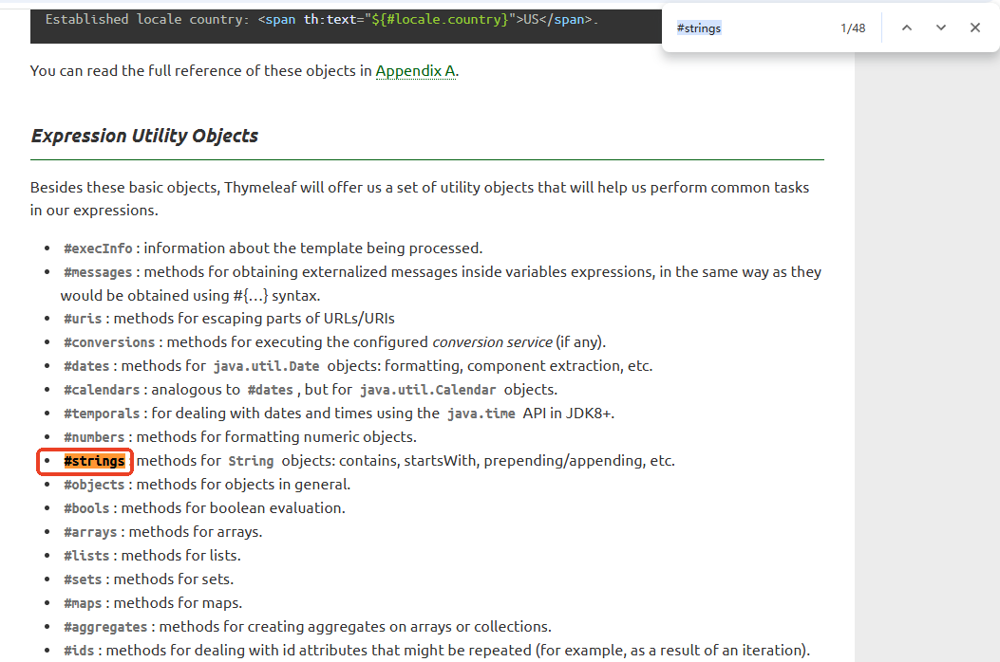

# Thymeleaf

---

## 当前项目弊端

1. **代码耦合性高，难以维护**

**前端代码（HTML/CSS/JS）与后端Java逻辑混杂在同一个Servlet中，违反**关注点分离（SoC）**原则。修改前端时需要重新编译Servlet，调试困难；团队协作时前后端开发者互相干扰。**

2. **开发效率低**

**Java字符串拼接HTML（如**`out.println("<div>...</div>")`**）极其繁琐且易错。**

3. **安全性风险**

**XSS漏洞**：手动拼接HTML容易遗漏转义导致 XSS 攻击。

**XSS（Cross-Site Scripting）**是一种攻击方式，黑客通过注入恶意脚本（通常是JavaScript）到网页中，使其在其他用户的浏览器里执行。**后果**：窃取用户Cookie、篡改页面内容、重定向到恶意网站等。

假设有一个Servlet，接收用户输入的`name`并显示在页面上：

```java
String userName = request.getParameter("name"); // 用户输入
out.println("<div>Welcome, " + userName + "!</div>");
```

如果用户输入的是：

```java
<script>alert('XSS Attack!');</script>
```

最终生成的HTML会是：

```java
<div>Welcome, <script>alert('XSS Attack!');</script>!</div>
```

浏览器会执行这段脚本，弹出一个警告框（实际攻击可能是窃取Cookie或跳转到恶意网站）。如何解决这个问题，可以手动转义。

但手动转义容易遗漏，因此现代框架（如JSP、Thymeleaf、React、Vue）默认会自动转义。

4. **可测试性差**：前端逻辑与后端深度耦合，无法独立测试。

5. **多端适配困难**：同一Servlet无法灵活响应Web/移动端（不同HTML结构或API格式）。

---

## Thymeleaf 概述

官网地址：[https://www.thymeleaf.org/](https://www.thymeleaf.org/)

**引用官网（2025 年 6 月）： Thymeleaf 3.1.3.RELEASE** is the latest version. It requires **Java SE 8** or newer（翻译：目前最新发布版 3.1.3，要求 JDK 版本最低 8）

Thymeleaf 是一个用于 Web 和独立环境的**现代 Java 模板引擎**，主要用于处理 HTML、XML、JavaScript 等文件，支持自然模板（允许静态原型直接作为模板使用）。它由**Daniel Fernández**领导的团队开发，最初于**2011年**发布，旨在替代 JSP，提供更优雅的模板解决方案。Thymeleaf 强调语法简洁、与 Spring 框架深度集成，常用于 Spring Boot 项目。目前（截至 2025 年 6 月）仍在积极维护，最新稳定版本为 3.1.3，社区活跃且持续更新。

**Java模板引擎**是一种用于动态生成文本（如HTML、XML、邮件内容等）的工具，它通过将**静态模板文件**和**动态数据**结合，生成最终的输出内容。

现代开发中项目多数是前后端分离，Thymeleaf 这种模板技术市场份额在减少，为什么还要保留 Thymeleaf？

+ **简单页面需求**：对于管理后台、报表打印、静态内容页等**无需复杂前端交互**的场景，Thymeleaf直接生成HTML比搭建全套前后端分离项目更高效。
+ **快速原型开发**：初期验证阶段，用Thymeleaf快速渲染页面比协调前后端联调更省时。
+ **SEO友好**：搜索引擎直接抓取服务端渲染的HTML（前后端分离的SPA需额外SSR处理）。
+ **支持混合模式**：Thymeleaf允许在传统服务端渲染中逐步引入前端框架（如部分页面用Vue，其他仍用Thymeleaf），适合遗留系统改造。
+ **邮件模板**：动态生成HTML邮件内容时，模板引擎仍是标准方案。
+ **PDF/Excel导出**：通过模板生成结构化文档（如Apache POI + Thymeleaf）。

---

## Thymeleaf 处理流程

```html
<!-- 模板文件 index.html -->
<html>
  <body>
    <p th:text="'Hello, ' + ${name}">Hello, Guest</p>
  </body>
</html>
```

Thymeleaf 的处理步骤：

1. **模板解析：解析 HTML，识别**`th:text`**表达式。**
2. **表达式处理：计算表达式**`${name}`**（从 Servlet 作用域中获取值或从 Spring MVC 的 Model 中获取值）。**
3. **渲染阶段：替换静态文本（**`Hello, Guest`**）为动态值（如**`Hello, Alice`**）。**

提示：

1. Thymeleaf 模板是合法的 HTML，可直接用浏览器打开预览。
2. Thymeleaf 默认对所有表达式输出进行**HTML 转义**，有效防御 XSS。
3. Thymeleaf**不依赖 Servlet 容器**，可以在非 Web 环境（如邮件模板）中使用。
4. Thymeleaf**无 Java 代码嵌入**：所有逻辑通过属性（如`th:text`、`th:if`）实现。

---

## Servlet 中使用 Thymeleaf

### 添加Thymeleaf 的 jar 包

jar 包从 apache 提供的 maven 中央仓库中下载，地址：[https://repo.maven.apache.org/maven2/](https://repo.maven.apache.org/maven2/)


将 jar 包拷贝 `WEB-INF/lib`目录下，并且只需要将 `thymeleaf-3.1.3.RELEASE.jar`添加到 classpath 中：


### 初始化模板引擎

写一个 ServletContextListener 监听器，在服务器启动阶段，初始化 Thymeleaf 的模板引擎：

```java
package com.jkweilai.thymeleaf.listeners;

import jakarta.servlet.ServletContext;
import jakarta.servlet.ServletContextEvent;
import jakarta.servlet.ServletContextListener;
import jakarta.servlet.annotation.WebListener;
import org.thymeleaf.TemplateEngine;
import org.thymeleaf.templatemode.TemplateMode;
import org.thymeleaf.templateresolver.WebApplicationTemplateResolver;
import org.thymeleaf.web.servlet.JakartaServletWebApplication;

@WebListener
public class ThymeleafInitializer implements ServletContextListener {
    @Override
    public void contextInitialized(ServletContextEvent sce) {
        // 获取ServletContext对象
        ServletContext application = sce.getServletContext();

        // 创建Thymeleaf与Servlet容器的桥梁对象
        JakartaServletWebApplication jakartaServletWebApplication = JakartaServletWebApplication.buildApplication(application);
        // 创建模板解析器并关联到Servlet环境
        WebApplicationTemplateResolver templateResolver = new WebApplicationTemplateResolver(jakartaServletWebApplication);

        // 设置模板文件存放的基础路径
        templateResolver.setPrefix("/WEB-INF/templates/");
        // 设置模板文件的后缀名
        templateResolver.setSuffix(".html");
        // 指定模板处理模式为HTML格式
        templateResolver.setTemplateMode(TemplateMode.HTML);
        // 禁用模板缓存（开发环境建议关闭）
        templateResolver.setCacheable(false);

        // 创建模板引擎
        TemplateEngine templateEngine = new TemplateEngine();
        // 模板引擎关联模板解析器
        templateEngine.setTemplateResolver(templateResolver);

        // 将Thymeleaf与Servlet容器的桥梁对象存储到应用域中
        application.setAttribute("jakartaServletWebApplication", jakartaServletWebApplication);
        // 将模板引擎对象存储到应用域中
        application.setAttribute("templateEngine", templateEngine);
    }
}
```

### 编写 Servlet

```java
package com.jkweilai.thymeleaf.servlets;

import jakarta.servlet.ServletContext;
import jakarta.servlet.ServletException;
import jakarta.servlet.annotation.WebServlet;
import jakarta.servlet.http.HttpServlet;
import jakarta.servlet.http.HttpServletRequest;
import jakarta.servlet.http.HttpServletResponse;
import org.thymeleaf.TemplateEngine;
import org.thymeleaf.context.WebContext;
import org.thymeleaf.web.servlet.JakartaServletWebApplication;

import java.io.IOException;
import java.time.LocalDateTime;
import java.time.format.DateTimeFormatter;

@WebServlet("/hello")
public class HelloServlet extends HttpServlet {
    @Override
    protected void doGet(HttpServletRequest request, HttpServletResponse response) throws ServletException, IOException {
        // 向request域中绑定数据
        request.setAttribute("message", "Hello from Request Scope!");
        request.setAttribute("currentTime", LocalDateTime.now().format(DateTimeFormatter.ISO_LOCAL_DATE_TIME));
        request.setAttribute("requestURI", request.getRequestURI());

        // 交给模板引擎去处理
        response.setContentType("text/html;charset=UTF-8");
        ServletContext application = getServletContext();
        // 从上下文中获取Thymeleaf的Servlet适配器实例
        JakartaServletWebApplication jakartaServletWebApplication = (JakartaServletWebApplication)application.getAttribute("jakartaServletWebApplication");
        // 从上下文中获取Thymeleaf模板引擎实例
        TemplateEngine templateEngine = (TemplateEngine) application.getAttribute("templateEngine");
        // 创建Thymeleaf上下文对象，包装当前请求/响应和语言环境
        WebContext webContext = new WebContext(jakartaServletWebApplication.buildExchange(request, response), request.getLocale());
        // 使用模板引擎渲染名为"hello"的模板，结果写入响应输出流
        templateEngine.process("hello", webContext, response.getWriter());
    }
}
```

### 创建模板文件

在`WEB-INF/templates/`下创建`hello.html`:

```html
<!DOCTYPE html>
<!--必须添加 th 命名空间-->
<html xmlns:th="http://www.thymeleaf.org">
<head>
    <meta charset="UTF-8">
    <title>first thymeleaf</title>
</head>
<body>
    <!-- 直接从request域获取数据 -->
    <h1 th:text="${message}">Default Message</h1>
    <p>Current time: <span th:text="${currentTime}"></span></p>
    <p>Request URI: <span th:text="${requestURI}"></span></p>
</body>
</html>
```

### 部署和测试

1. 部署到Servlet容器（如Tomcat）
2. 访问 `http://localhost:8080/thymeleaf/hello`


### thymeleaf 添加日志框架

thymeleaf 添加日志框架 `logback`。这样 thymeleaf 运行出错时会自动打印日志信息。便于调试。

#### 添加 logback 的 jar 包

我们项目中已经存在 `slf4j-api-2.0.16.jar`。这个是日志门面，还需要一个具体的实现 slf4j 门面的日志框架，`logback`就是一个具体的实现。

首先我们需要引入 logback 的 jar 包，放到 WEB-INF/lib 目录下：


#### 添加 logback 日志框架的配置文件

在类的根路径下新建 `logback.xml`，然后将配置以下内容：

```xml
<configuration>
    <!-- 只输出 ERROR 级别及以上的日志 -->
    <logger name="org.thymeleaf" level="ERROR"/>

    <!-- 关闭 Thymeleaf 初始化 DEBUG 日志 -->
    <logger name="org.thymeleaf.TemplateEngine" level="INFO"/>

    <!-- 控制台输出格式简化 -->
    <appender name="CONSOLE" class="ch.qos.logback.core.ConsoleAppender">
        <encoder>
            <pattern>%d{HH:mm:ss} [%thread] %-5level - %msg%n</pattern>
        </encoder>
    </appender>

    <!-- 全局日志级别设为 WARN -->
    <root level="WARN">
        <appender-ref ref="CONSOLE"/>
    </root>
</configuration>
```

---

## Thymeleaf 的必要语法

### 基础模板结构（必须掌握）

```html
<!DOCTYPE html>
<html xmlns:th="http://www.thymeleaf.org">  <!-- 启用Thymeleaf命名空间 -->
<head>
    <title th:text="${pageTitle}">默认标题</title>  <!-- 静态默认值会被动态替换 -->
</head>
<body>
    <!-- 所有Thymeleaf属性以 th: 开头 -->
</body>
</html>
```

关键点：

+ `th:` 命名空间声明
+ 静态内容作为默认值（直接打开HTML文件可预览）

### 变量表达式（90%场景使用）

```html
<div th:text="${user.name}">用户名默认值</div>  <!-- 即使是一段HTML代码，也只是当做普通文本处理，转义，防止XSS攻击 -->
<div th:utext="${htmlContent}">HTML内容</div>  <!-- 对HTML代码解释执行，不转义，存在XSS攻击风险，谨慎使用 -->
```

### 条件判断（if/unless）

和 `if/else`不一样。两个是独立的，没有关系。

+ 对于 `th:if`来说，为 `true`时显示元素。
+ 对于 `th:unless`来说，为 `false`时显示元素。

```html
<div th:if="${user.isAdmin}">管理员可见</div>
<div th:unless="${user.isGuest}">非访客可见</div>
```

### 关于 if 的小细节

有这样一个 VO（View Object：视图对象，负责专门在页面上展示数据的对象）UserVO，代码如下：

```java
package com.jkweilai.thymeleaf.model.vo;

public class UserVO {
    private String username;
    private Boolean isAdmin; // 注意这个属性哈。

    public UserVO() {
    }

    public UserVO(String username, Boolean isAdmin) {
        this.username = username;
        this.isAdmin = isAdmin;
    }

    public String getUsername() {
        return username;
    }

    public void setUsername(String username) {
        this.username = username;
    }

    public Boolean getAdmin() { // isAdmin 属性生成的get方法不是getIsAdmin()，而是getAdmin()。
        return isAdmin;
    }

    public void setAdmin(Boolean admin) {
        isAdmin = admin;
    }
}
```

在 Servlet 当中创建 UserVO 对象，代码如下：

```java
UserVO user = new UserVO("admin", true);
request.setAttribute("user", user);
```

thymeleaf 的模板文件中是这样写的：

```html
<div th:if="${user.isAdmin}"><span th:text="${user.username}"></span>是管理员</div>
```

测试时出现了以下异常：



这个问题是因为我们使用了 `${user.isAdmin}`，thymeleaf 底层会去找 `user`对象的 `getIsAdmin()`方法，但是这个方法不存在而导致的。针对这个问题，有多种解决方案，最直接的方式是将模板文件中的代码修改一下，修改为：

```html
<div th:if="${user.admin}"><span th:text="${user.username}"></span>是管理员</div>
```

这样就可以访问了。

### 循环遍历（列表渲染）

```html
<ul>
    <li th:each="item : ${items}" th:text="${item.name}">商品示例</li>
</ul>
```

关键点：

+ `th:each="item : ${集合}"` 语法
+ 循环状态变量：

```html
<li th:each="item,status : ${items}" th:text="|${status.index} ======== ${item.name}|"></li>
```

**双竖线 |...| 的作用是定义文本字面量表达式（Literal Expressions），它是一种简化字符串拼接的语法。**

**管道符内的内容会被视为一个整体，Thymeleaf 会自动将其拼接成一个字符串，无需手动加引号或 + 连接。**

### 链接与路径（URL生成）

```html
<a th:href="@{/user/details(id=${userId})}">用户详情</a>
```

关键点：

+ `@{}` 自动生成上下文路径（避免硬编码）
+ 支持参数：`@{/path(param1=${val1}, param2=${val2})}`

### 表单绑定（重点！）

```html
<form th:action="@{/save}" th:object="${user}" method="post">
    <input type="text" id="username" name="username" th:value="*{username}" placeholder="用户名">
    <input type="submit" value="保存">
</form>
```

关键点：

+ `th:object` 绑定表单对象
+ `th:value="*{属性名}"`

### 片段复用（布局优化）

```html
<!-- 定义片段 -->
<div th:fragment="header">
    <h1>公共头部</h1>
</div>

<!-- 引用片段 -->
<div th:replace="~{::header}"></div>  <!-- header片段的定义如果在当前文件中的话，使用这种语法。 -->

<div th:replace="~{commons :: header}"></div>  <!-- 这种语法表示引入commons.html中定义的header片段。 -->
```

关键点：

+ `th:fragment` 定义可复用块
+ `th:replace` 直接替换当前标签

### 实用工具函数（选学）

```html
<p th:text="${#strings.toUpperCase(user.name)}"></p>  <!-- 字符串大写 -->
<p th:text="${#dates.format(now, 'yyyy-MM-dd')}"></p>  <!-- 日期格式化 -->
```

工具类：

+ `#strings`、`#numbers`、`#dates`、`#lists`等。

工具函数的具体使用，可以参考 thymeleaf 的官方帮助文档，按照以下步骤查找帮助：

首页面点 `Docs`：



`Read online`在线阅读，或者下载 `PDF`等：


在以下页面中搜索，例如搜索 `#strings`：




---

## Thymeleaf 变量查找顺序

当 `${message}`被解析时，Thymeleaf 会按以下顺序查找：

1. `WebContext`**显式设置的变量**（`ctx.setVariable("message", "WebContext message")`）
2. `HttpServletRequest`**属性**（`request.setAttribute("message", "request message")`）

同名变量时，高优先级的会覆盖低优先级的。

---

## Thymeleaf 的其他取值

1. `HttpSession`**属性**（`session.setAttribute("message", "session message")`），从 session 中取值需要这样写：`${session.message}`
2. `ServletContext`**全局属性**（`servletContext.setAttribute("message", "application message")`），从 application 中取值需要这样写：`${application.message}`
3. **请求参数**（`request.getParameter("message")`），从查询参数中取值需要这样写：`${param.message}`
4. `th:with`**局部变量**（仅限当前作用域）

```html
<div th:with="message='Local Message'">
    <span th:text="${message}"></span> <!-- 输出 "Local Message" -->
</div>
```

---

## Thymeleaf 的内联 JavaScript 语法

```html
<!-- script脚本中使用Thymeleaf语法需要添加在script标签上添加 th:inline="javascript" -->
<script th:inline="javascript">
  // Thymeleaf的内联JavaScript语法
  // 也就是说：/*[[这里可以编写thymeleaf的语法]]*/
  let contextPath = /*[[@{/}]]*/ "";
  function deleteByDeptno(elt){
    let deptno = elt.getAttribute("data-deptno");
    if(confirm("您确定删除数据吗？")){
      document.location.href = contextPath + "deleteByNo?deptno=" + deptno;
    }
  }
</script>
```
