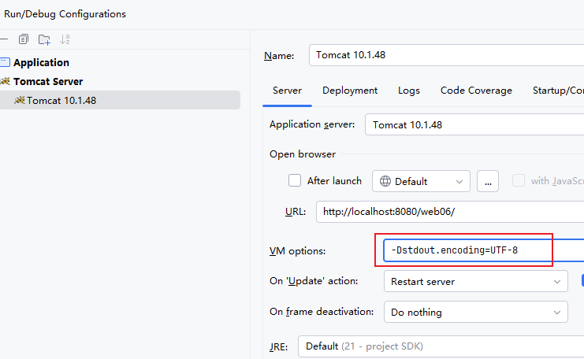

# 关于 Tomcat 标准输出流乱码问题

## 当前环境信息

- **操作系统**：Windows 10 简体中文
- **Tomcat 版本**：10.1.48
- **IDEA 版本**：2025.2.2
- **JDK 版本**：21

## 已做配置

1. IDEA 中所有字符编码相关配置均已设为 **UTF-8**
2. Tomcat 的 `config/logging.properties` 文件中，字符编码也已设为 **UTF-8**

## 问题描述

在上述配置下，Servlet 中使用 `System.out.println()` 打印中文时，控制台输出仍然出现乱码。

## 根本原因

**Tomcat 容器的标准输出流（System.out）编码与 IDEA 控制台显示编码不一致。**

具体来说：
- Tomcat 的 `System.out` 默认使用 **GBK** 编码输出
- IDEA 控制台期望接收 **UTF-8** 编码的文本
- 编码不匹配导致中文显示为乱码

验证方式：在 Servlet 中调用 `System.out.charset()`，返回结果为 `GBK`。

## 解决方案

在 Tomcat 的 **VM options** 中添加以下配置：

```bash
-Dstdout.encoding=UTF-8
```

配置位置参考下图：

