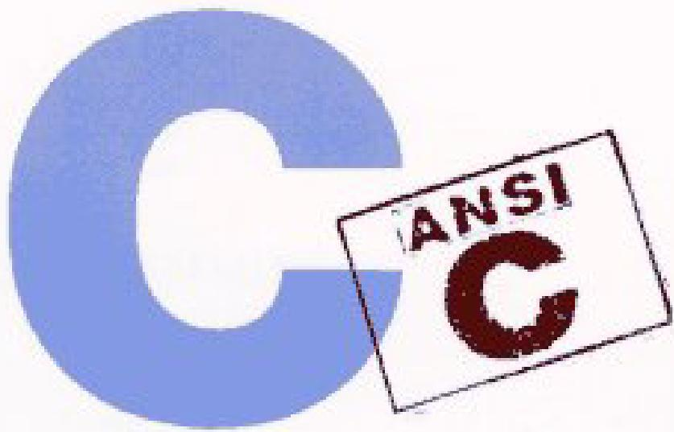

## THE C PROGRAMMING LANGUAGE - SECOND EDITION

BRIANW KERNIGHAN DENNISM.RITCHIE 

PAENTICE HALL SOFTWARE SERES 

## Content
Preface....6
Preface to the first edition....8

Chapter 1 - A Tutorial Introduction....9
1.1 Getting Started....9
1.2 Variables and Arithmetic Expressions....11
1.3 The for statement....16
1.4 Symbolic Constants....17
1.5 Character Input and Output....18
1.5.1 File Copying....18
1.5.2 Character Counting....20
1.5.3 Line Counting....21
1.5.4 Word Counting....22
1.6 Arrays....23
1.7 Functions....25
1.8 Arguments - Call by Value....28
1.9 Character Arrays....29
1.10 External Variables and Scope....31

Chapter 2 - Types, Operators and Expressions....35
2.1 Variable Names....35
2.2 Data Types and Sizes....35
2.3 Constants....36
2.4 Declarations....39
2.5 Arithmetic Operators....40
2.6 Relational and Logical Operators....40
2.7 Type Conversions....41
2.8 Increment and Decrement Operators....44
2.9 Bitwise Operators....46
2.10 Assignment Operators and Expressions....47
2.11 Conditional Expressions....49
2.12 Precedence and Order of Evaluation....49

Chapter 3 - Control Flow....52
3.1 Statements and Blocks....52
3.2 If-Else....52
3.3 Else-If....53
3.4 Switch....54
3.5 Loops - While and For....56
3.6 Loops - Do-While....58
3.7 Break and Continue....59
3.8 Goto and labels....60

Chapter 4 - Functions and Program Structure....62
4.1 Basics of Functions....62
4.2 Functions Returning Non-integers....65
4.3 External Variables....67
4.4 Scope Rules....72
4.5 Header Files....73
4.6 Static Variables....75
4.7 Register Variables....75
4.8 Block Structure....76
4.9 Initialization....76
4.10 Recursion....78
4.11 The C Preprocessor....79 
4.11.1 File Inclusion....79
4.11.2 Macro Substitution....80
4.11.3 Conditional Inclusion....82

Chapter 5 - Pointers and Arrays....83
5.1 Pointers and Addresses....83
5.2 Pointers and Function Arguments....84
5.3 Pointers and Arrays....87
5.4 Address Arithmetic....90
5.5 Character Pointers and Functions....93
5.6 Pointer Arrays; Pointers to Pointers....96
5.7 Multi-dimensional Arrays....99
5.8 Initialization of Pointer Arrays....101
5.9 Pointers vs. Multi-dimensional Arrays....101
5.10 Command-line Arguments....102
5.11 Pointers to Functions....106
5.12 Complicated Declarations....108

Chapter 6 - Structures....114
6.1 Basics of Structures....114
6.2 Structures and Functions....116
6.3 Arrays of Structures....118
6.4 Pointers to Structures....122
6.5 Self-referential Structures....124
6.6 Table Lookup....127
6.7 Typedef....129
6.8 Unions....131
6.9 Bit-fields....132

Chapter 7 - Input and Output....135
7.1 Standard Input and Output....135
7.2 Formatted Output - printf....137
7.3 Variable-length Argument Lists....138
7.4 Formatted Input - Scanf....140
7.5 File Access....142
7.6 Error Handling - Stderr and Exit....145
7.7 Line Input and Output....146
7.8 Miscellaneous Functions....147
7.8.1 String Operations....147
7.8.2 Character Class Testing and Conversion....148
7.8.3 Ungetc....148
7.8.4 Command Execution....148
7.8.5 Storage Management....148
7.8.6 Mathematical Functions....149
7.8.7 Random Number generation....149

Chapter 8 - The UNIX System Interface....151
8.1 File Descriptors....151
8.2 Low Level I/O - Read and Write....152
8.3 Open, Creat, Close, Unlink....153
8.4 Random Access - Lseek....155
8.5 Example - An implementation of Fopen and Getc....156
8.6 Example - Listing Directories....159
8.7 Example - A Storage Allocator....163

Appendix A - Reference Manual....168
A.1 Introduction....168 
A.2 Lexical Conventions....168
A.2.1 Tokens....168
A.2.2 Comments....168
A.2.3 Identifiers....168
A.2.4 Keywords....169
A.2.5 Constants....169
A.2.6 String Literals....171
A.3 Syntax Notation....171
A.4 Meaning of Identifiers....171
A.4.1 Storage Class....171
A.4.2 Basic Types....172
A.4.3 Derived types....173
A.4.4 Type Qualifiers....173
A.5 Objects and Lvalues....173
A.6 Conversions....173
A.6.1 Integral Promotion....174
A.6.2 Integral Conversions....174
A.6.3 Integer and Floating....174
A.6.4 Floating Types....174
A.6.5 Arithmetic Conversions....174
A.6.6 Pointers and Integers....175
A.6.7 Void....176
A.6.8 Pointers to Void....176
A.7 Expressions....176
A.7.1 Pointer Conversion....177
A.7.2 Primary Expressions....177
A.7.3 Postfix Expressions....177
A.7.4 Unary Operators....179
A.7.5 Casts....181
A.7.6 Multiplicative Operators....181
A.7.7 Additive Operators....182
A.7.8 Shift Operators....182
A.7.9 Relational Operators....183
A.7.10 Equality Operators....183
A.7.11 Bitwise AND Operator....183
A.7.12 Bitwise Exclusive OR Operator....184
A.7.13 Bitwise Inclusive OR Operator....184
A.7.14 Logical AND Operator....184
A.7.15 Logical OR Operator....184
A.7.16 Conditional Operator....184
A.7.17 Assignment Expressions....185
A.7.18 Comma Operator....185
A.7.19 Constant Expressions....186
A.8 Declarations....186
A.8.1 Storage Class Specifiers....187
A.8.2 Type Specifiers....188
A.8.3 Structure and Union Declarations....188
A.8.4 Enumerations....191
A.8.5 Declarators....192
A.8.6 Meaning of Declarators....193
A.8.7 Initialization....196
A.8.8 Type names....198 
A.8.9 Typedef....199
A.8.10 Type Equivalence....199
A.9 Statements....199
A.9.1 Labeled Statements....200
A.9.2 Expression Statement....200
A.9.3 Compound Statement....200
A.9.4 Selection Statements....201
A.9.5 Iteration Statements....201
A.9.6 Jump statements....202
A.10 External Declarations....203
A.10.1 Function Definitions....203
A.10.2 External Declarations....204
A.11 Scope and Linkage....205
A.11.1 Lexical Scope....205
A.11.2 Linkage....206
A.12 Preprocessing....206
A.12.1 Trigraph Sequences....207
A.12.2 Line Splicing....207
A.12.3 Macro Definition and Expansion....207
A.12.4 File Inclusion....209
A.12.5 Conditional Compilation....210
A.12.6 Line Control....211
A.12.7 Error Generation....211
A.12.8 Pragmas....212
A.12.9 Null directive....212
A.12.10 Predefined names....212
A.13 Grammar....212

Appendix B - Standard Library....220
B.1 Input and Output: <stdio.h>....220
B.1.1 File Operations....220
B.1.2 Formatted Output....222
B.1.3 Formatted Input....223
B.1.4 Character Input and Output Functions....225
B.1.5 Direct Input and Output Functions....225
B.1.6 File Positioning Functions....226
B.1.7 Error Functions....226
B.2 Character Class Tests: <ctype.h>....226
B.3 String Functions: <string.h>....227
B.4 Mathematical Functions: <math.h>....228
B.5 Utility Functions: <stdlib.h>....229
B.6 Diagnostics: <assert.h>....231
B.7 Variable Argument Lists: <stdarg.h>....231
B.8 Non-local Jumps: <setjmp.h>....232
B.9 Signals: <signal.h>....232
B.10 Date and Time Functions: <time.h>....233
B.11 Implementation-defined Limits: <limits.h> and <float.h> ....... 234

Appendix C - Summary of Changes .... 236 

## Preface

The computing world has undergone a revolution since the publication of The C Programming Language in 1978. Big computers are much bigger, and personal computers have capabilities that rival mainframes of a decade ago. During this time, C has changed too, although only modestly, and it has spread far beyond its origins as the language of the UNIX operating system. 
自1978年《C程序设计语言》出版以来，计算领域经历了一场革命。大型计算机变得更为庞大，而个人计算机的性能已能与十年前的大型机相媲美。在此期间，C语言也发生了变化，尽管变化幅度不大，并且它已远远超出了其作为UNIX操作系统语言的起源，广泛传播开来。

The growing popularity of C, the changes in the language over the years, and the creation of compilers by groups not involved in its design, combined to demonstrate a need for a more precise and more contemporary definition of the language than the first edition of this book provided. In 1983, the American National Standards Institute (ANSI) established a committee whose goal was to produce ''an unambiguous and machine-independent definition of the language C'', while still retaining its spirit. The result is the ANSI standard for C. 
C语言的日益普及、语言多年来的演变，以及未参与其设计的团体开发出编译器，这些因素共同表明，需要比本书第一版提供的更为精确和更具现代性的语言定义。1983年，美国国家标准协会（ANSI）成立了一个委员会，其目标是制定“一份明确且与机器无关的C语言定义”，同时保留其精神。其结果就是ANSI C标准。

The standard formalizes constructions that were hinted but not described in the first edition, particularly structure assignment and enumerations. It provides a new form of function declaration that permits cross-checking of definition with use. It specifies a standard library, with an extensive set of functions for performing input and output, memory management, string manipulation, and similar tasks. It makes precise the behavior of features that were not spelled out in the original definition, and at the same time states explicitly which aspects of the language remain machine-dependent. 
该标准将第一版中有所暗示但未加以描述的结构形式化了，特别是结构赋值和枚举。它提供了一种新形式的函数声明，允许对定义和使用进行交叉检查。它规定了一个标准库，其中包含一组丰富的函数，用于执行输入输出、内存管理、字符串操作以及类似任务。它精确规定了原定义中未明确说明的特性行为，同时明确指出了语言中哪些方面仍与机器相关。

This Second Edition of The C Programming Language describes C as defined by the ANSI standard. Although we have noted the places where the language has evolved, we have chosen to write exclusively in the new form. For the most part, this makes no significant difference; the most visible change is the new form of function declaration and definition. Modern compilers already support most features of the standard. 
《C程序设计语言》第二版所描述的C语言，以ANSI标准为依据。虽然我们指出了语言演变之处，但决定完全采用新形式来书写。在大多数情况下，这并无显著差异；最明显的变化是函数声明和定义的新形式。现代编译器已支持标准中的大部分特性。

We have tried to retain the brevity of the first edition. C is not a big language, and it is not well served by a big book. We have improved the exposition of critical features, such as pointers, that are central to C programming. We have refined the original examples, and have added new examples in several chapters. For instance, the treatment of complicated declarations is augmented by programs that convert declarations into words and vice versa. As before, all examples have been tested directly from the text, which is in machine-readable form. 
我们力求保持第一版的简洁性。C语言并非一种庞大的语言，因此也不适合用一本厚重的书来阐述。我们改进了对指针等关键特性（这些是C语言编程的核心）的阐述。我们优化了原有示例，并在几个章节中增加了新示例。例如，关于复杂声明的处理部分，增加了将声明转换为文字描述以及反向转换的程序作为补充。与以往一样，所有示例均直接根据机器可读形式的文本进行了测试。

Appendix A, the reference manual, is not the standard, but our attempt to convey the essentials of the standard in a smaller space. It is meant for easy comprehension by programmers, but not as a definition for compiler writers -- that role properly belongs to the standard itself. Appendix B is a summary of the facilities of the standard library. It too is meant for reference by programmers, not implementers. Appendix C is a concise summary of the changes from the original version. 
附录A（参考手册）并非标准本身，而是我们尝试在较短的篇幅中传达标准要点的内容。它旨在便于程序员理解，但并非作为编译器编写者的定义——该角色理应由标准本身承担。附录B是标准库功能的摘要，同样供程序员参考而非实现者使用。附录C则简要总结了与原版本的变更之处。

As we said in the preface to the first edition, C ''wears well as one's experience with it grows''. With a decade more experience, we still feel that way. We hope that this book will help you learn C and use it well. 
正如我们在第一版序言中所说，C语言“随着使用经验的增长，会愈发得心应手”。经过十多年的更多实践，我们仍然深有同感。我们希望这本书能帮助您学好C语言，并熟练地运用它。

We are deeply indebted to friends who helped us to produce this second edition. Jon Bently, Doug Gwyn, Doug McIlroy, Peter Nelson, and Rob Pike gave us perceptive comments on almost every page of draft manuscripts. We are grateful for careful reading by Al Aho, Dennis Allison, Joe Campbell, G.R. Emlin, Karen Fortgang, Allen Holub, Andrew Hume, Dave Kristol, John Linderman, Dave Prosser, Gene Spafford, and Chris van Wyk. We also received helpful suggestions from Bill Cheswick, Mark Kernighan, Andy Koenig, Robin Lake, Tom London, Jim Reeds, Clovis Tondo, and Peter Weinberger. Dave Prosser answered many detailed questions about the ANSI standard. We used Bjarne Stroustrup's C++ translator extensively for local testing of our programs, and Dave Kristol provided us with an ANSI C compiler for final testing. Rich Drechsler helped greatly with typesetting. 
我们深深感激那些帮助我们完成这本第二版的朋友们。Jon Bently、Doug Gwyn、Doug McIlroy、Peter Nelson 和 Rob Pike 在几乎每一页手稿草稿上都给予了我们深刻的评论。我们感谢 Al Aho、Dennis Allison、Joe Campbell、G.R. Emlin、Karen Fortgang、Allen Holub、Andrew Hume、Dave Kristol、John Linderman、Dave Prosser、Gene Spafford 和 Chris van Wyk 的仔细阅读。我们还收到了 Bill Cheswick、Mark Kernighan、Andy Koenig、Robin Lake、Tom London、Jim Reeds、Clovis Tondo 和 Peter Weinberger 的有益建议。Dave Prosser 回答了许多关于 ANSI 标准的详细问题。我们广泛使用了 Bjarne Stroustrup 的 C++ 翻译器来对我们的程序进行本地测试，而 Dave Kristol 为我们提供了一个 ANSI C 编译器用于最终测试。Rich Drechsler 在排版方面给予了很大帮助。

Our sincere thanks to all. 

Brian W. Kernighan 

Dennis M. Ritchie 

## Preface to the first edition

C is a general-purpose programming language with features economy of expression, modern flow control and data structures, and a rich set of operators. C is not a ''very high level'' language, nor a ''big'' one, and is not specialized to any particular area of application. But its absence of restrictions and its generality make it more convenient and effective for many tasks than supposedly more powerful languages. 
C语言是一种通用编程语言，具有表达简洁、现代流程控制和数据结构，以及丰富的运算符集等特点。C语言不是一种“非常高级”的语言，也不是一种“庞大”的语言，并且不专门针对任何特定的应用领域。但是，它没有限制且具有通用性，使得它在许多任务上比那些号称更强大的语言更加方便和有效。

C was originally designed for and implemented on the UNIX operating system on the DEC PDP-11, by Dennis Ritchie. The operating system, the C compiler, and essentially all UNIX applications programs (including all of the software used to prepare this book) are written in C. Production compilers also exist for several other machines, including the IBM System/370, the Honeywell 6000, and the Interdata 8/32. C is not tied to any particular hardware or system, however, and it is easy to write programs that will run without change on any machine that supports C. 
C语言最初由丹尼斯·里奇（Dennis Ritchie）为DEC PDP-11计算机上的UNIX操作系统设计和实现。该操作系统、C编译器以及几乎所有UNIX应用程序（包括用于编写本书的所有软件）都是用C语言编写的。此外，也有面向其他几种机器的生产型编译器，包括IBM System/370、Honeywell 6000和Interdata 8/32。然而，C语言并不依赖于任何特定的硬件或系统，因此很容易编写出能在任何支持C的机器上无需修改即可运行的程序。

This book is meant to help the reader learn how to program in C. It contains a tutorial introduction to get new users started as soon as possible, separate chapters on each major feature, and a reference manual. Most of the treatment is based on reading, writing and revising examples, rather than on mere statements of rules. For the most part, the examples are complete, real programs rather than isolated fragments. All examples have been tested directly from the text, which is in machine-readable form. Besides showing how to make effective use of the language, we have also tried where possible to illustrate useful algorithms and principles of good style and sound design. 
本书旨在帮助读者学习如何用C语言进行编程。书中包含一个教程式的引言，以使新用户能尽快上手，另有分别介绍各主要特性的独立章节，以及一份参考手册。大部分内容基于阅读、编写和修改示例，而非仅仅陈述规则。示例大多是完整的、实际的程序，而非孤立的片段。所有示例均直接根据机器可读形式的文本进行了测试。除了展示如何有效使用该语言外，我们还尽可能尝试阐述有用的算法以及良好编程风格和健全设计的原则。

The book is not an introductory programming manual; it assumes some familiarity with basic programming concepts like variables, assignment statements, loops, and functions. Nonetheless, a novice programmer should be able to read along and pick up the language, although access to more knowledgeable colleague will help. 
本书并非一本入门级的编程手册；它假定读者已熟悉一些基本的编程概念，如变量、赋值语句、循环和函数。尽管如此，新手程序员应该也能够边阅读边学习该语言，不过如果能得到更有经验的同事的帮助，将会更有益处。

In our experience, C has proven to be a pleasant, expressive and versatile language for a wide variety of programs. It is easy to learn, and it wears well as on's experience with it grows. We hope that this book will help you to use it well. 
根据我们的经验，C语言已被证明是一种令人愉悦、富有表现力且用途广泛的语言，适用于各种类型的程序。它易于学习，并且随着使用经验的增长，会愈发得心应手。我们希望这本书能帮助您更好地运用它。

The thoughtful criticisms and suggestions of many friends and colleagues have added greatly to this book and to our pleasure in writing it. In particular, Mike Bianchi, Jim Blue, Stu Feldman, Doug McIlroy Bill Roome, Bob Rosin and Larry Rosler all read multiple volumes with care. We are also indebted to Al Aho, Steve Bourne, Dan Dvorak, Chuck Haley, Debbie Haley, Marion Harris, Rick Holt, Steve Johnson, John Mashey, Bob Mitze, Ralph Muha, Peter Nelson, Elliot Pinson, Bill Plauger, Jerry Spivack, Ken Thompson, and Peter Weinberger for helpful comments at various stages, and to Mile Lesk and Joe Ossanna for invaluable assistance with typesetting. 
许多朋友和同事给予了深思熟虑的批评和建议，这极大地丰富了本书，也让我们在写作过程中倍感愉悦。特别感谢Mike Bianchi、Jim Blue、Stu Feldman、Doug McIlroy、Bill Roome、Bob Rosin和Larry Rosler，他们都仔细阅读了多卷手稿。我们同样感激Al Aho、Steve Bourne、Dan Dvorak、Chuck Haley、Debbie Haley、Marion Harris、Rick Holt、Steve Johnson、John Mashey、Bob Mitze、Ralph Muha、Peter Nelson、Elliot Pinson、Bill Plauger、Jerry Spivack、Ken Thompson和Peter Weinberger在不同阶段提出的有益建议，以及Mike Lesk和Joe Ossanna在排版方面给予的宝贵帮助。

Brian W. Kernighan 

Dennis M. Ritchie 
