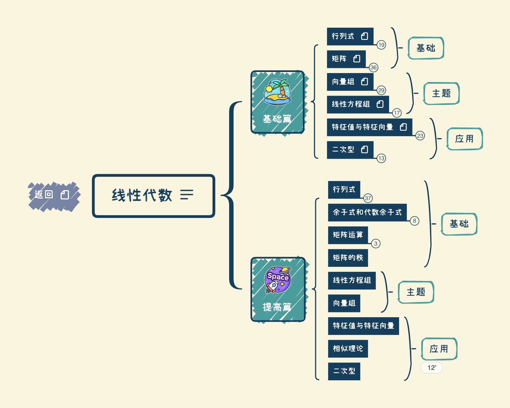

# PKM - 线性代数  

2022.08.02

## 介绍
按照张宇2022、2023考研数学提高班进行归纳与整合。

* matrix
	* [linear-system](notes/linear-system.md)
	* [vector-and-matrix](notes/vector-and-matrix.md)
	* [linear-equation](notes/linear-equation.md)
* solution
	* [have-solution](notes/have-solution.md)
	* [solution-number](notes/solution-number.md)
	* [solve-equation](notes/solve-equation.md)
	* [from-rref](notes/from-rref.md)

## Book Links
* [(划重点系列)面向计算机视觉CV的人工智能AI](https://www.bilibili.com/video/BV12Q4y187Ng)
	* 邓老师讲了面向计算机视觉的线性代数的学习方法：线性代数全都要学
	* 可以带着意义去学习，比如机器学习的某个算法用了线性代数的知识，这时候去倒着学线性代数
	* 推荐看动画（比如 3b1b），有一个直观印象
* [知乎推荐的线性代数课程](https://zhuanlan.zhihu.com/p/58472836)
* [（数一）二次曲面类型与二次型的正负惯性指数的关系](https://www.bilibili.com/read/cv6499426)

## Courses

* 3b1b
* Lee 2018
	* [https://speech.ee.ntu.edu.tw/\~hylee/la/2018-fall.php](https://speech.ee.ntu.edu.tw/\~hylee/la/2018-fall.php)
	* [https://www.youtube.com/playlist?list=PLJV\_el3uVTsNmr39gwbyV-0KjULUsN7fW](https://www.youtube.com/playlist?list=PLJV\_el3uVTsNmr39gwbyV-0KjULUsN7fW)

## 资源
链接: 链接: https://pan.baidu.com/s/1qPELqhj0HR8ZzqCduhF_4A  
提取码: vr89  
如果资源失效请联系我  

## 版本
### V1 2021.10.xx  
按照2022张宇考研课程进行整理，完成全部知识框架搭建   