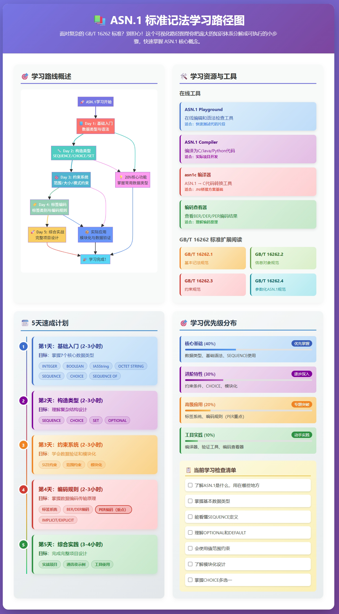

# 抽象语法记法(ASN.1)

入门教程

* [ASN1_教程_第1天_基础入门](notes/ASN1_教程_第1天_基础入门.md)
* [ASN1_教程_第2天_构造类型深入](notes/ASN1_教程_第2天_构造类型深入.md)
* [ASN1_教程_第3天_约束和模块化](notes/ASN1_教程_第3天_约束和模块化.md)
* [ASN1_教程_第4天_标签和编码](notes/ASN1_教程_第4天_标签和编码.md)
* [ASN1_教程_第5天_综合实践](notes/ASN1_教程_第5天_综合实践.md)
* 

标准解读

* [1](notes/1.md)
* [2](notes/2.md)
* [3](notes/3.md)
* [4](notes/4.md)