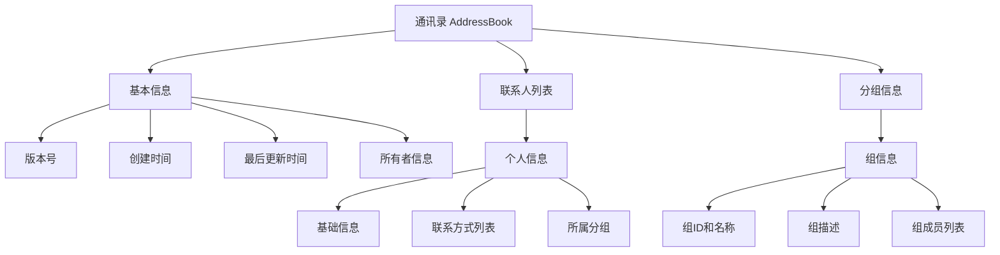

# ASN.1 教程 - 第5天：综合实践

## 🎯 学习目标
- 综合运用前4天所学知识，完成一个完整的通讯录项目设计
- 掌握实际ASN.1项目的组织架构和模块化设计
- 学会使用约束条件进行数据验证
- 理解如何将ASN.1设计转化为实际可用的数据结构

## ⏰ 建议时间：3-4小时

## 📖 课程大纲

### 一、项目概述：通讯录管理系统（30分钟）

#### 1.1 项目需求分析

**核心功能需求**：
1. **联系人管理**：存储个人基本信息
2. **联系方式**：支持多种联系方式（手机、邮箱、微信等）
3. **分组功能**：将联系人分组管理
4. **通讯录结构**：完整的通讯录包含版本信息、所有者等

**技术需求**：
- 使用ASN.1语法定义所有数据结构
- 应用约束条件保证数据有效性
- 采用模块化设计便于维护
- 支持扩展和向后兼容

#### 1.2 设计思路



### 二、核心数据类型定义（60分钟）

#### 2.1 基础枚举类型

```asn1
-- 联系方式类型枚举
ContactType ::= ENUMERATED {
    mobile(0),    -- 手机
    email(1),     -- 邮箱
    wechat(2),    -- 微信
    qq(3),        -- QQ
    telephone(4)  -- 固定电话
}

-- 性别枚举
Gender ::= ENUMERATED {
    male(0),
    female(1),
    other(2)
}

-- 关系类型
Relationship ::= ENUMERATED {
    family(0),     -- 家人
    friend(1),     -- 朋友
    colleague(2),  -- 同事
    business(3),   -- 业务伙伴
    other(4)       -- 其他
}
```

#### 2.2 联系方式定义

```asn1
-- 单个联系方式
ContactInfo ::= SEQUENCE {
    type        ContactType,
    value       IA5String,
    label       IA5String OPTIONAL,  -- 标签：如"工作手机"、"个人邮箱"
    isPrimary   BOOLEAN DEFAULT FALSE,
    isVerified  BOOLEAN DEFAULT FALSE
}

-- 联系方式约束
ContactInfoList ::= SEQUENCE OF ContactInfo (SIZE (1..10))
```

#### 2.3 个人基本信息

```asn1
-- 基础个人信息
Person ::= SEQUENCE {
    id          INTEGER UNIQUE,         -- 唯一标识符
    firstName   IA5String (SIZE (1..50)),
    lastName    IA5String (SIZE (1..50)),
    gender      Gender OPTIONAL,
    birthdate   DATE OPTIONAL,
    company     IA5String (SIZE (0..100)) OPTIONAL,
    position    IA5String (SIZE (0..50)) OPTIONAL,
    relationship Relationship DEFAULT friend,
    contacts    ContactInfoList,
    note        IA5String OPTIONAL
}

-- 个人约束
PersonList ::= SEQUENCE OF Person (SIZE (0..1000))
```

### 三、分组管理系统设计（60分钟）

#### 3.1 分组信息结构

```asn1
-- 组信息
GroupInfo ::= SEQUENCE {
    id          INTEGER UNIQUE,
    name        IA5String (SIZE (1..50)),
    description IA5String (SIZE (0..200)) OPTIONAL,
    created     GeneralizedTime,
    members     SEQUENCE OF INTEGER,  -- 引用Person的id
    parentGroup INTEGER OPTIONAL      -- 父组ID，支持嵌套
}

-- 组角色定义
GroupRole ::= SEQUENCE {
    groupId     INTEGER,
    role        IA5String DEFAULT "member",
    joined      GeneralizedTime
}

-- 组列表
GroupInfoList ::= SET OF GroupInfo  -- 使用SET因为组顺序不重要
```

#### 3.2 人员分组关系

```asn1
-- 个人与分组的关系
PersonGroupMembership ::= SEQUENCE {
    personId    INTEGER,
    groups      SEQUENCE OF GroupRole OPTIONAL
}
```

### 四、完整通讯录结构（45分钟）

#### 4.1 主通讯录定义

```asn1
-- 完整的通讯录定义
AddressBookModule DEFINITIONS ::= BEGIN

EXPORTS AddressBook;

-- 导入基础类型（如果定义在其他模块）
-- IMPORTS Date, Time FROM BaseTypes;

-- 所有者信息
OwnerInfo ::= SEQUENCE {
    ownerId     INTEGER,
    name        IA5String,
    email       IA5String,
    phone       IA5String
}

-- 通讯录元数据
AddressBookMetadata ::= SEQUENCE {
    version         INTEGER DEFAULT 1,
    formatVersion   IA5String DEFAULT "1.0",
    createdAt       GeneralizedTime,
    lastUpdated     GeneralizedTime OPTIONAL,
    owner           OwnerInfo,
    description     IA5String OPTIONAL
}

-- 完整的通讯录
AddressBook ::= SEQUENCE {
    metadata    AddressBookMetadata,
    persons     PersonList,
    groups      GroupInfoList,
    statistics  Statistics OPTIONAL
}

-- 统计数据
Statistics ::= SEQUENCE {
    totalPersons    INTEGER,
    totalGroups     INTEGER,
    lastPersonId    INTEGER,
    lastGroupId     INTEGER
}

END
```

#### 4.2 文件结构组织

```
通讯录项目结构/
├── types/
│   ├── base.asn1      # 基础类型定义
│   ├── contact.asn1   # 联系方式相关
│   └── person.asn1    # 个人信息相关
├── groups/
│   ├── group.asn1     # 分组定义
│   └── membership.asn1 # 关系定义
└── main/
    └── addressbook.asn1 # 主通讯录定义
```

### 五、实践任务与练习（45分钟）

#### 5.1 任务一：扩展设计

**要求**：在现有设计基础上，添加以下功能：

1. **添加标签功能**
   ```asn1
   -- 为联系人添加标签系统
   Tag ::= SEQUENCE {
       id      INTEGER,
       name    IA5String (SIZE (1..20)),
       color   IA5String (PATTERN "#[0-9A-Fa-f]{6}") OPTIONAL
   }
   
   -- 为Person添加tags字段
   -- 思考：如何修改Person结构？
   ```

2. **添加地址信息**
   ```asn1
   -- 地址结构
   Address ::= SEQUENCE {
       country     IA5String DEFAULT "China",
       province    IA5String,
       city        IA5String,
       street      IA5String,
       postalCode  IA5String (PATTERN "\\d{6}") OPTIONAL
   }
   ```

#### 5.2 任务二：约束优化

**要求**：为现有设计添加更多约束条件：

1. **邮箱验证**：确保邮箱格式正确
   ```asn1
   -- 修改ContactInfo中的email类型
   EmailContact ::= IA5String (PATTERN "[a-zA-Z0-9._%+-]+@[a-zA-Z0-9.-]+\\.[a-zA-Z]{2,}")
   ```

2. **手机号验证**：确保手机号格式
   ```asn1
   MobileContact ::= IA5String (PATTERN "1[3-9]\\d{9}")
   ```

3. **日期范围**：确保出生日期合理
   ```asn1
   -- 修改Person的birthdate字段
   birthdate   DATE (MIN "1900-01-01", MAX CURRENT-DATE) OPTIONAL
   ```

#### 5.3 任务三：模块化重构

**要求**：将现有的大模块拆分为多个小模块：

1. **创建base.asn1模块**：包含基础类型
2. **创建contact.asn1模块**：包含联系方式相关定义
3. **创建person.asn1模块**：包含个人信息定义
4. **使用IMPORTS/EXPORTS**：实现模块间依赖

### 六、最佳实践与调试（30分钟）

#### 6.1 语法检查工具

**推荐工具**：
1. **ASN.1 Playground**：在线语法检查
2. **asn1c编译器**：本地编译检查
3. **文本编辑器插件**：实时语法高亮

**检查步骤**：
```bash
# 使用asn1c检查语法
asn1c -fskeletons-copy addressbook.asn1

# 常见错误
- 缺少分号
- 类型未定义
- 循环引用
- 约束冲突
```

#### 6.2 设计验证方法

**验证清单**：
- [ ] 所有必填字段都有默认值或OPTIONAL标记
- [ ] 枚举值范围合理
- [ ] 字符串长度约束合理
- [ ] 唯一性约束正确应用
- [ ] 模块间依赖关系清晰
- [ ] 向后兼容性考虑

#### 6.3 性能优化建议

1. **编码大小优化**：
   - 使用PER编码减少数据大小
   - 合理使用IMPLICIT标签
   - 避免过多的OPTIONAL字段

2. **解析效率优化**：
   - 常用字段放在前面
   - 减少嵌套层级
   - 使用整型代替字符串枚举

### 七、真实案例参考（30分钟）

#### 7.1 X.509证书结构

```asn1
-- X.509证书的简化版
Certificate ::= SEQUENCE {
    tbsCertificate      TBSCertificate,
    signatureAlgorithm  AlgorithmIdentifier,
    signatureValue      BIT STRING
}

TBSCertificate ::= SEQUENCE {
    version         [0] EXPLICIT Version DEFAULT v1,
    serialNumber    CertificateSerialNumber,
    signature       AlgorithmIdentifier,
    issuer          Name,
    validity        Validity,
    subject         Name,
    subjectPublicKeyInfo SubjectPublicKeyInfo,
    issuerUniqueID  [1] IMPLICIT UniqueIdentifier OPTIONAL,
    subjectUniqueID [2] IMPLICIT UniqueIdentifier OPTIONAL,
    extensions      [3] EXPLICIT Extensions OPTIONAL
}
```

**学习点**：
- 标签的使用：`[0] EXPLICIT`, `[1] IMPLICIT`
- OPTIONAL字段的合理应用
- 版本兼容性设计

#### 7.2 LDAP协议数据结构

```asn1
-- LDAP协议的简化的部分定义
LDAPMessage ::= SEQUENCE {
    messageID       MessageID,
    protocolOp      CHOICE {
        bindRequest     BindRequest,
        bindResponse    BindResponse,
        searchRequest   SearchRequest,
        searchResponse  SearchResponse,
        -- ... 其他操作
    },
    controls        [0] Controls OPTIONAL
}
```

**学习点**：
- CHOICE的合理使用
- 消息ID的设计
- 控制字段的可选性

### 八、学习总结与检查清单

#### 8.1 第5天检查项

- [ ] 能独立设计一个中等复杂度的数据结构
- [ ] 会合理使用各种约束条件
- [ ] 能把大模块拆分成小模块
- [ ] 理解如何保证向后兼容性
- [ ] 掌握ASN.1项目的最佳实践

#### 8.2 5天学习成果总结

**掌握的核心技能**：
1. ✅ **基础语法**：7个核心类型 + 语法规则
2. ✅ **构造类型**：SEQUENCE、CHOICE、SET的深入应用
3. ✅ **约束系统**：范围、大小、枚举、模式等约束
4. ✅ **模块化设计**：IMPORTS/EXPORTS、模块划分
5. ✅ **标签与编码**：标签系统、编码规则、PER重点
6. ✅ **综合实践**：完整项目设计、最佳实践

**下一步学习建议**：
1. **深入编码规则**：特别是PER编码的细节
2. **实际协议分析**：研究X.509、LDAP等真实协议
3. **工具链掌握**：asn1c、Java ASN.1工具包等
4. **性能优化**：编码大小、解析效率的优化

### 九、常见问题解答

#### Q1：如何选择标签类型？
- **UNIVERSAL**：基础类型，很少需要手动指定
- **APPLICATION**：应用特定，同一应用内保持唯一
- **PRIVATE**：厂商特定，避免与其他厂商冲突
- **CONTEXT-SPECIFIC**：最常见，用于区分同一结构中的不同字段

#### Q2：OPTIONAL字段太多怎么办？
- 考虑使用CHOICE替代多个OPTIONAL
- 将相关字段分组到嵌套结构中
- 评估是否真的需要这么多可选字段

#### Q3：如何保证向后兼容？
1. 新字段添加在末尾
2. 使用标签区分版本
3. 新字段设置为OPTIONAL
4. 避免修改现有字段的类型

### 十、资源推荐

#### 10.1 在线工具
1. **ASN.1 Playground**：语法检查和在线编辑
2. **ASN.1 Lab**：编码查看和测试
3. **asn1c在线文档**：编译器使用指南

#### 10.2 参考书籍
1. **《ASN.1 Complete》**：全面参考书
2. **《X.690标准文档》**：编码规则官方文档
3. **《GB/T 16262》**：国家标准文档

#### 10.3 开源项目
1. **asn1c项目**：ASN.1到C代码编译器
2. **BouncyCastle**：Java加密库，包含ASN.1支持
3. **pyasn1**：Python ASN.1库

---

## 🎉 恭喜完成5天学习！

**你已经掌握了ASN.1的核心技能**，现在可以：
- 阅读和理解现有的ASN.1定义
- 设计自己的数据结构
- 应用约束保证数据有效性
- 组织模块化的ASN.1项目

**记住**：实际工作中遇到具体需求时，再深入相关部分。保持"小步快跑，持续学习"的心态！

**学习ASN.1的关键**：动手实践 > 理论学习！