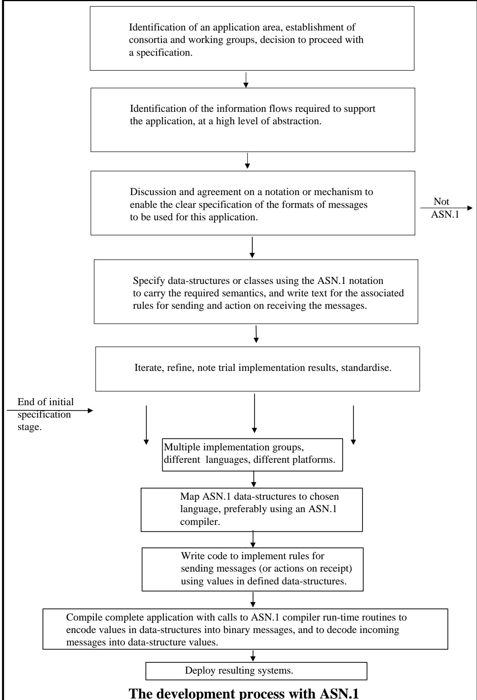

# ASN.1 Complete ASN.1 完整规范

by Prof John Larmouth 
作者：约翰·拉尔梅斯教授

## Dedication 献词

This book is dedicated to the girls at Withington Girls' School that are there with my daughter Sarah-Jayne and to the boys at The Manchester Grammar School that are there with my son James, in the hope that it may some day be of use to some of them! 
这本书献给威辛顿女子学校的那些女孩们，她们与我的女儿莎拉-杰恩在一起；也献给曼彻斯特文法学校的那些男孩们，他们与我的儿子詹姆斯在一起。希望这本书有朝一日能对他们有所帮助！

## Contents 目录

1. Contents 3
2. Foreword 13
3. Introduction 15
    1. The global communications infrastructure 15
    2. What exactly is ASN.1? 16
    3. The development process with ASN.1 18
    4. Structure of the text. 18

**SECTION I ASN.1 OVERVIEW 21**

**Chapter 1 Specification of protocols 22**
1. What is a protocol? 22
2. Protocol specification - some basic concepts 24
    1. Layering and protocol "holes" 25
    2. Early developments of layering 26
    3. The disadvantages of layering - keep it simple! 28
    4. Extensibility 28
    5. Abstract and transfer syntax 30
    6. Command line or statement-based approaches 32
    7. Use of an Interface Definition Language 32
3. More on abstract and transfer syntaxes 32
    1. Abstract values and types 32
    2. Encoding abstract values 33
4. Evaluative discussion 35
    1. There are many ways of skinning a cat - does it matter? 35
    2. Early work with multiple transfer syntaxes 35
    3. Benefits 36
        1. Efficient use of local representations 36
        2. Improved representations over time 36
        3. Reuse of encoding schemes 36
        4. Structuring of code 37
        5. Reuse of code and common tools 38
        6. Testing and line monitor tools 38
        7. Multiple documents requires "glue" 38
        8. The "tools" business 39
5. Protocol specification and implementation - a series of case studies 39
    1. Octet sequences and fields within octets 39
    2. The TLV approach 40
    3. The EDIFACT graphical syntax 41
    4. Use of BNF to specify a character-based syntax 42
    5. Specification and implementation using ASN.1 - early 1980s 43
    6. Specification and implementation using ASN.1 - 1990's 44

**Chapter 2 Introduction to ASN.1 47**
1. Introduction 47
2. The example 48
    1. The top-level type 49
    2. Bold is what matters! 49
    3. Names in italics are used to tie things together 49
    4. Names in normal font are the names of fields/elements/items 50
    5. Back to the example! 50
    6. The BranchIdentification type 52
    7. Those tags 54
3. Getting rid of the different fonts 55
4. Tying up some lose ends 56
    1. Summary of type and value assignments 56
    2. The form of names 57
    3. Layout and comment 57
5. So what else do you need to know? 58

**Chapter 3 Structuring an ASN.1 specification 60**
1. An example 61
2. Publication style for ASN.1 specifications 62
    1. Use of line-numbers. 63
    2. Duplicating the ASN.1 text 64
    3. Providing machine-readable copy 64
3. Returning to the module header! 65
    1. Syntactic discussion 65
    2. The tagging environment 67
        1. An environment of explicit tagging 68
        2. An environment of implicit tagging 68
        3. An environment of automatic tagging 68
    3. The extensibility environment 69
4. Exports/imports statements 71
5. Refining our structure 73
6. Complete specifications 76
7. Conclusion 77

**Chapter 4 The basic data types and construction mechanisms - closure 78**
1. Illustration by example 79
2. Discussion of the built-in types 80
    1. The BOOLEAN type 80
    2. The INTEGER type 80
    3. The ENUMERATED type 82
    4. The REAL type 83
    5. The BIT STRING type 84
    6. The OCTET STRING type 87
    7. The NULL type 88
    8. Some character string types 88
    9. The OBJECT IDENTIFIER type 89
    10. The ObjectDescriptor type 90
    11. The two ASN.1 date/time types 91
3. Additional notational constructs 93
    1. The selection-type notation 93
    2. The COMPONENTS OF notation 94
    3. SEQUENCE or SET? 95
    4. SEQUENCE, SET, and CHOICE (etc) value-notation 96
4. What else is in X.680/ISO 8824-1? 97

**Chapter 5 Reference to more complex areas 99**
1. Object identifiers 100
2. Character string types 100
3. Subtyping 102
4. Tagging 103
5. Extensibility, exceptions and version brackets 104
6. Hole types 105
7. Macros 106
8. Information object classes and objects and object sets 107
9. Other types of constraints 108
10. Parameterization 108
11. The ASN.1 semantic model 109
12. Conclusion 109

**Chapter 6 Using an ASN.1 compiler 110**
1. The route to an implementation 110
2. What is an ASN.1 compiler? 111
3. The overall features of an ASN.1-compiler-tool 113
4. Use of a simple library of encode/decode routines 113
    1. Encoding 114
    2. Decoding 115
5. Using an ASN.1-compiler-tool 116
    1. Basic considerations 116
    2. What do tool designers have to decide? 116
    3. The mapping to a programming-language data structure 117
    4. Memory and CPU trade-offs at run-time 118
    5. Control of a tool 119
6. Use of the "OSS ASN.1 Tools" product 120
7. What makes one ASN.1-comiler-tool better than another? 121
8. Conclusion 122

**Chapter 7 Management and design issues for ASN.1 specification and implementation 123**
1. Global issues for management decisions 124
    1. Specification 124
        1. To use ASN.1 or not! 124
        2. To copy or not? 124
    2. Implementation - setting the budget 125
        1. Getting the specs 125
        2. Training courses, tutorials, and consultants 126
    3. Implementation platform and tools 126
2. Issues for specifiers 127
    1. Guiding principles 127
    2. Decisions on style 128
    3. Your top-level type 128
    4. Integer sizes and bounds 129
    5. Extensibility issues 130
    6. Exception handling 131
        1. The requirement 131
        2. Common forms of exception handling 131
            1. SEQUENCE and SET 131
            2. CHOICE 131
            3. INTEGER and ENUMERATED 132
            4. Extensible strings 132
            5. Extensible bounds on SET OF and SEQUENCE OF 132
            6. Use of extensible object sets in constraints 133
            7. Summary 133
        3. ASN.1-specified default exception handling 133
        4. Use of the formal exception specification notation 134
    7. Parameterization issues 134
    8. Unconstrained open types 135
    9. Tagging issues 136
    10. Keeping it simple 136
3. Issues for implementors 137
    1. Guiding principles 137
    2. Know your tool 138
    3. Sizes of integers 138
    4. Ambiguities and implementation-dependencies in specifications 139
    5. Corrigenda 139
    6. Extensibility and exception handling 139
    7. Care with hand encodings 140
    8. Mailing lists 140
    9. Good engineering - version 2 **will** come! 140
4. Conclusion 141

**SECTION II FURTHER DETAILS 142**

**Chapter 1 The object identifier type 143**
1. Introduction 143
2. The object identifier tree 145
3. Information objects 146
4. Value notation 147
5. Uses of the object identifier type 148

**Chapter 2 The character string types 149**
1. Introduction 150
2. NumericString 150
3. PrintableString 151
4. VisibleString (ISO646String) 151
5. IA5String 152
6. TeletexString (T61String) 152
7. VideotexString 152
8. GraphicString 153
9. GeneralString 153
10. UniversalString 153
11. BMPString 153
12. UTF8String 154
13. Recommended character string types 154
14. Value notation for character string types 155
15. The ASN.1-CHARACTER-MODULE 157
16. Conclusion 158

**Chapter 3 Subtyping 159**
1. Introduction 159
2. Basic concepts and set arithmetic 160
3. Single value subtyping 162
4. Value range subtyping 162
5. Permitted alphabet constraints 163
6. Size constraints 164
7. Contained sub-type constraints 166
8. Inner Subtyping 166
    1. Introduction 166
    2. Subsetting Wineco-Protocol 168
    3. Inner subtyping of an array 170
9. Conclusion 171

**Chapter 4 Tagging 172**
1. Review of earlier discussions 172
2. The tag name-space 173
3. An abstract model of tagging 176
4. The rules for when tags are required to be distinct 179
5. Automatic tagging 180
6. Conclusion 180

**Chapter 5 Extensibility, Exceptions, and Version Brackets 181**
1. The extensibility concept 181
2. The extension marker 182
3. The exception specification 183
4. Where can the ellipsis be placed? 183
5. Version brackets 184
6. The {...} notation 185
7. Interaction between extensibility and tagging 185
8. Concluding remarks 187

**Chapter 6 Information Object Classes, Constraints, and Parameterization 188**
1. The need for "holes" and notational support for them 189
    1. OSI Layering 189
    2. Hole support in ASN.1 190
2. The ROSE invocation model 190
    1. Introduction 190
    2. Responding to the INVOKE message 192
3. The use of tables to complete the user specification 193
    1. From specific to general 195
4. From tables to Information Object Classes 196
5. The ROSE OPERATION and ERROR Object Class definitions 198
6. Defining the Information Objects 199
7. Defining an Information Object Set 201
8. Using the information to complete the ROSE protocol 203
9. The need for parameterization 205
10. What has not been said yet? 208

**Chapter 7 More on classes, constraints, and parameterization 209**
1. Information Object Class Fields 209
    1. Type fields 210
    2. Fixed type value fields 211
    3. Variable type value fields 212
    4. Fixed type value set fields 213
    5. Variable type value set fields 213
    6. Object fields 214
    7. Object set fields 214
    8. Extended field names 215
2. Variable syntax for Information Object definition 216
3. Constraints re-visited - the user-defined constraint 220
4. The full story on parameterization 221
    1. What can be parameterized and be a parameter? 222
    2. Parameters of the abstract syntax 224
    3. Making your requirements explicit 225
        1. The TYPE-IDENTIFIER class 225
        2. An example - X.400 headers 225
        3. Use of a simple SEQUENCE 226
        4. Use of an extensible SEQUENCE 227
        5. Moving to an information object set definition 227
        6. The object set "Headers" 228
    4. The (empty) extensible information object set 229
5. Other provision for "holes" 230
    1. ANY 230
    2. ANY DEFINED BY 231
    3. EXTERNAL 231
    4. EMBEDDED PDV 232
    5. CHARACTER STRING 233
    6. OCTET STRING and BIT STRING 233
6. Remarks to conclude Section II 234

**SECTION III ENCODINGS 235**

**Chapter 1 Introduction to encoding rules 236**
1. What are encoding rules, and why the chapter sub-title? 236
2. What are the advantages of the encoding rules approach? 238
3. Defining encodings - the TLV approach 239
4. Extensibility or "future proofing" 240
5. First attempts at PER - start with BER and remove redundant octets 241
6. Some of the principles of PER 243
    1. Breaking out of the BER straight-jacket 243
    2. How to cope with other problems that a "T" solves? 244
    3. Do we still need T and L for SEQUENCE and SET headers? 245
    4. Aligned and Unaligned PER 246
7. Extensibility - you have to have it! 246
8. What more do you need to know about PER? 247
9. Experience with PER 248
10. Distinguished and Canonical Encoding Rules 250
11. Conclusion 251

**Chapter 2 The Basic Encoding Rules 252**
1. Introduction 252
2. General issues 253
    1. Notation for bit numbers and diagrams 253
    2. The identifier octets 254
    3. The length octets 256
        1. The short form 256
        2. The long form 257
        3. The indefinite form 258
        4. Discussion of length variants 259
3. Encodings of the V part of the main types 260
    1. Encoding a NULL value 260
    2. Encoding a BOOLEAN value 261
    3. Encoding an INTEGER value 261
    4. Encoding an ENUMERATED value 262
    5. Encoding a REAL value 262
        1. Encoding base 10 values 262
        2. Encoding base 2 values 263
        3. Encoding the special real values 265
    6. Encoding an OCTET STRING value 266
    7. Encoding a BIT STRING value 266
    8. Encoding values of tagged types 267
    9. Encoding values of CHOICE types 268
    10. Encoding SEQUENCE OF values 268
    11. Encoding SET OF values 269
    12. Encoding SEQUENCE and SET values 269
    13. Handling of OPTIONAL and DEFAULT elements in sequence and set 270
    14. Encoding OBJECT IDENTIFIER values 270
    15. Encoding character string values 273
    16. Encoding values of the time types 275
4. Encodings for more complex constructions 275
    1. Open types 275
    2. The embedded pdv type and the external type 276
    3. The INSTANCE OF type 276
    4. The CHARACTER STRING type 276
5. Conclusion 277

**Chapter 3 The Packed Encoding Rules 278**
1. Introduction 279
2. Structure of a PER encoding 279
    1. General form 279
    2. Partial octet alignment and PER variants 280
    3. Canonical encodings 281
    4. The outer level complete encoding 281
3. Encoding values of extensible types 282
4. PER-visible constraints 284
    1. The concept 284
    2. The effect of variable parameters 285
    3. Character strings with variable length encodings 286
    4. Now let's get complicated! 286
5. Encoding INTEGERs - preparatory discussion 288
6. Effective size and alphabet constraints. 289
    1. Statement of the problem 289
    2. Effective size constraint 290
    3. Effective alphabet constraint 290
7. Canonical order of tags 291
8. Encoding an unbounded count 291
    1. The three forms of length encoding 292
    2. Encoding "normally small" values 295
    3. Comments on encodings of unbounded counts 296
9. Encoding the OPTIONAL bit-map and the CHOICE index. 296
    1. The OPTIONAL bit-map 296
    2. The CHOICE index 297
10. Encoding NULL and BOOLEAN values. 297
11. Encoding INTEGER values. 297
    1. Unconstrained integer types 298
    2. Semi-constrained integer types 298
    3. Constrained integer types 299
    4. And if the constraint on the integer is extensible? 300
12. Encoding ENUMERATED values. 301
13. Encoding length determinants of strings etc 302
14. Encoding character string values. 304
    1. Bits per character 304
    2. Padding bits 305
    3. Extensible character string types 306
15. Encoding SEQUENCE and SET values. 306
    1. Encoding DEFAULT values 307
    2. Encoding extension additions 307
16. Encoding CHOICE values. 310
17. Encoding SEQUENCE OF and SET OF values. 311
18. Encoding REAL and OBJECT IDENTIFIER values. 312
19. Encoding an Open Type 312
20. Encoding of the remaining types 313
21. Conclusion 313

**Chapter 4 Other ASN.1-related encoding rules 315**
1. Why do people suggest new encoding rules? 315
2. LWER - Light-Weight Encoding Rules 316
    1. The LWER approach 317
    2. The way to proceed was agreed 317
    3. Problems, problems, problems 317
    4. The demise of LWER 319
3. MBER - Minimum Bit Encoding Rules 319
4. OER - Octet Encoding Rules 320
5. XER - XML (Extended Mark-up Language) Encoding Rules 321
6. BACnetER - BAC (Building Automation Committee) net Encoding Rules 321
7. Encoding Control Specifications 322

**SECTION IV HISTORY AND APPLICATIONS 323**

**Chapter 1 The development of ASN.1 324**
1. People 325
2. Going round in circles? 326
3. Who produces Standards? 327
4. The numbers game 328
5. The early years - X.409 and all that 329
    1. Drafts are exchanged and the name ASN.1 is assigned 329
    2. Splitting BER from the notation 330
    3. When are changes technical changes? 331
    4. The near-demise of ASN.1 - OPERATION and ERROR 331
6. Organization and re-organization! 333
7. The tool vendors 334
8. Object identifiers 334
    1. Long or short, human or computer friendly, that is the question 334
    2. Where should the object identifier tree be defined? 336
    3. The battle for top-level arcs and the introduction of RELATIVE OIDs 336
9. The REAL type 337
10. Character string types - let's try to keep it short! 338
    1. From the beginning to ASCII 338
    2. The emergence of the international register of character sets 338
    3. The development if ISO 8859 340
    4. The emergence of ISO 10646 and Unicode 340
        1. The four-dimensional architecture 340
        2. Enter Unicode 342
        3. The final compromise 343
    5. And the impact of all this on ASN.1? 343
11. ANY, macros, and Information Objects - hard to keep that short (even the heading has gone to two lines)! 345
12. The ASN.1(1990) controversy 348
13. The emergence of PER 349
    1. The first attempt - PER-2 349
    2. The second attempt - PER-1 352
14. DER and CER 353
15. Semantic models and all that - ASN.1 in the late 1990s 354
16. What got away? 355

**Chapter 2 Applications of ASN.1 357**
1. Introduction 357
2. The origins in X.400 358
3. The move into Open Systems Interconnection (OSI) and ISO 359
4. Use within the protocol testing community 360
5. Use within the Integrated Services Digital Network (ISDN) 361
6. Use in ITU-T and multimedia standards 361
7. Use in European and American standardization groups 362
8. Use for managing computer-controlled systems 363
9. Use in PKCS and PKIX and SET and other security-related protocols 364
10. Use in other Internet specifications 365
11. Use in major corporate enterprises and agencies 366
12. Conclusion 366

**APPENDICES 367**
1. The Wineco protocol scenario 368
2. The full protocol for Wineco 369
3. Compiler output for C support for the Wineco protocol 372
4. Compiler output for Java support for the Wineco protocol 374
5. ASN.1 resources via the Web 384

**INDEX 385**

# Foreword 序言

This text is primarily written for those involved in protocol specification or in the implementation of ASN.1-based protocols. It is expected, however, that it will be of interest and use to a wider audience including managers, students, and simply the intellectually curious.
这段文字主要是为那些从事协议规范制定或基于 ASN 的协议实现工作的人编写的。不过，预计它也会吸引更多读者的兴趣，包括管理人员、学生以及那些对知识感兴趣的人。

The Introduction which follows should be at least scanned by all readers, and ends with a discussion of the structure of the text. Thereafter, readers generally have a reasonable degree of freedom to take sections and chapters in any order they choose, and to omit some (or many) of them, although for those with little knowledge about ASN.1 it would be sensible to read the whole of Section I first, in the order presented.
接下来的引言部分应该能够被所有读者轻松阅读，之后会讨论文本的结构。此后，读者可以随意选择阅读各个章节，也可以跳过某些部分。不过，对于那些对 ASN.1 了解不多的人来说，按照给出的顺序阅读整个第一部分是比较合理的做法。

Here is a rough guide to what the different types of reader might want to tackle:
以下是一份大致的指南，介绍了不同类型的读者可能想要应对的情况：

Managers: Those responsible for taking decisions related to possible use of ASN.1 as a notation for protocol specification, or responsible for managing teams implementing protocols defined using ASN.1, should read Section I ("ASN.1 Overview"), and need read no further, although Section IV ("History and Applications") might also be of interest. This would also apply to those curious about ASN.1 and wanting a short and fairly readable introduction to it.
管理者们：那些负责决策与 ASN.1 标准在协议规范中的应用的人员，或者那些负责管理使用 ASN.1 定义的协议实现的团队的人员，可以阅读第一部分“ASN.1 概述”的内容即可。虽然第四部分“历史与应用”也可能值得了解，但无需继续阅读。对于那些对 ASN.1 感兴趣，希望获得一份简短且易于理解的介绍的人来说，同样可以阅读这一部分的内容。

Protocol specifiers: For those designing and specifying protocols, much of Section I ("ASN.1 Overview") and Section IV ("History and Applications") should be scanned in order to determine whether or not to use ASN.1 as a specification language, but Section II ("Further details") is very important for this group.
协议规范说明：对于负责设计和指定协议的人来说，需要仔细阅读第一部分（“ASN.1 概述”）和第四部分（“历史与应用”）的内容，以确定是否使用 ASN.1 作为规范语言。不过，对于这一群体而言，第二部分（“更多细节”）的内容尤为重要。

* Implementors using an ASN.1 tool: For this group, Section I ("ASN.1 in Brief") and Section II ("Further Details") will suffice.
* 使用 ASN.1 工具进行实现的开发者：对于这一群体来说，第一部分（“ASN.1 简介”）和第二部分（“更多细节”）已经足够了解相关内容了。

Implementors doing hand-encodings: (or those who may be developing ASN.1 tools) must supplement the above sections by a careful reading of Section III ("Encodings") and indeed of the actual ITU-T Recommendations/ISO Standards for ASN.1.
进行手工编码实现的开发者们（或者那些正在开发 ASN 工具的人）必须通过仔细阅读第三部分“编码”部分，以及相关的 ITU-T 推荐标准/ISO 标准，来补充上述内容。

Students on courses covering protocol specification techniques: Undergraduate and postgraduate courses aiming to give their students an understanding of the abstract syntax approach to protocol specification (and perhaps of ASN.1 itself) should place the early parts of Section I ("ASN.1 Overview") and some of Section IV ("History and Applications") on the reading list for the course.
对于那些学习协议规范技术的课程的学生来说，无论是本科还是研究生课程，为了让学生了解协议规范的抽象语法方法（或许还包括 ASN.1 本身），应该将第一部分“ASN.1 概述”的早期内容以及一些第四部分“历史与应用”中的内容列入课程的阅读清单中。

* The intellectually curious: Perhaps this group will read the whole text from front to back and find it interesting and stimulating! Attempts have been made wherever possible to keep the text light and readable - go to it!
* 那些充满好奇心的人：也许这类人会从头到尾仔细阅读整篇文本，觉得它非常有趣且富有启发性！在可能的情况下，我们会尽量让文本保持简洁易读——那就尽情享受吧！

There is an electronic version of this text available, and a list of further ASN.1-related resources, at the URL given in Appendix 5. And importantly, errata sheets will be provided at this site for down-loading.
该文本有电子版本可供下载，此外，附录 5 中还提供了其他与 ASN.1 相关的资源列表。重要的是，这些更正说明也会在该网站上提供，用户可以下载这些说明。

The examples have all been verified using the "OSS ASN.1 Tools" package produced and marketed by Open Systems Solutions (OSS), a US company that has (since 1986) developed and marketed tools to assist in the implementation of protocols defined using ASN.1. I am grateful to OSS for much support in the production of this book, and for the provision of their tool for this purpose. Whilst OSS has given support and encouragement in many forms, and has provided a number of reviewers of the text who have made very valued comments on early drafts, the views expressed in this text are those of the author alone.
这些示例均通过 Open Systems Solutions 公司提供的“OSS ASN.1 工具包”进行了验证。Open Systems Solutions 是一家美国公司，自 1986 年以来一直致力于开发并销售各种工具，以帮助实现使用 ASN 定义的协议。我非常感谢 OSS 在本书编写过程中提供的支持与帮助，以及他们为本书制作工具所付出的努力。虽然 OSS 以多种形式给予了支持与鼓励，并且有许多审稿人对初稿提出了非常有价值的意见，但本文中的观点仅代表作者个人的看法。

John Larmouth ([j.larmouth@iti.salford.ac.uk](mailto:j.larmouth@iti.salford.ac.uk))
约翰·拉尔穆思 (j.larmouth@iti.salford.ac.uk)

May 1999
1999 年 5 月

# Introduction 引言

**Summary:**  
**总结：**

This introduction:
这个引言：

* describes the problem ASN.1 addresses,
* 描述了问题所在，即 ASN.1 地址的问题。

* briefly says what ASN.1 is,
* 简要介绍了 ASN.1 是什么。

* explains why it is useful.
* 解释了为什么它是有用的。

**1 The global communications infrastructure**  
**1. 全球通信基础设施**

We are in a period of rapid advance in the collaboration of computer systems to perform a wider range of activity than ever before. Traditional computer communications to support human-driven remote logon, e-mail, file-transfer, and latterly the World-Wide Web (WWW) are being supplemented by new applications requiring increasingly complex exchanges of information between computer systems and between appliances with embedded computer chips.
我们正处于一个计算机系统协作能力飞速发展的时期，这些系统能够执行比以往更丰富的功能。传统的计算机通信方式，如支持人工远程登录、电子邮件通信、文件传输，以及后来的万维网，正在被新的应用所取代。这些新应用需要计算机系统之间以及带有嵌入式计算机芯片的设备之间进行越来越复杂的信息交换。

Some of these exchanges of information continue to be human-initiated, such as bidding at auctions, money wallet transfers, electronic transactions, voting support, or interactive video. Others are designed for automatic and autonomous computer-to-computer communication in support of such diverse activities as cellular telephones (and other telephony applications), meter reading, pollution recording, air traffic control, control of power distribution, and applications in the home for control of appliances.
在这些信息交换中，有些仍然是由人类发起的，比如拍卖时的出价、货币转账、电子交易、投票支持，以及互动视频等。而另一些则用于实现自动化的计算机与计算机之间的通信，这些通信支持着各种活动，例如移动电话（以及其他电话应用）、电表读取、污染监测、空中交通控制、电力分配管理，以及家庭中的设备控制等。

In all cases there is a requirement for the detailed specification of the exchanges the computers are to perform, and for the implementation of software to support those exchanges.
在所有情况下，都需要对计算机需要执行的各个交换操作进行详细规范，并且需要编写相应的软件来支持这些交换操作。

The most basic support for many of these exchanges today is provided by the use of TCP/IP and the Internet, but other carrier protocols are still in use, particularly in the telecommunications area. However, the specification of the data formats for messages that are to be passed using TCP (or other carriers) requires the design and clear specification of application protocols, followed by (or in parallel with) implementation of those protocols.
如今，这些通信方式最基本的技术支持来自于 TCP/IP 协议和互联网的应用。不过，其他传输协议仍然被使用，尤其是在电信领域。然而，对于那些要通过 TCP 或其他传输协议传递的数据格式，需要事先设计和明确规范应用协议，然后再进行这些协议的实现。

For communication to be possible between applications and devices produced by different vendors, standards are needed for these application protocols. The standards may be produced by recognised international bodies such as the International Telecommunications Union Telecommunications Standards Sector (ITU-T), the International Standards Organization (ISO), or the Internet Engineering Task Force (IETF), or by industrial associations or collaborative groups and consortia such as the International Civil Aviation Organization (ICAO), the Open Management Group (OMG) or the Secure Electronic Transactions (SET) consortium, or by individual multinational organizations such as Reuters or IBM.
为了使不同厂商生产的设备能够相互通信，就需要为这些应用协议制定标准。这些标准可以由国际认可的机构来制定，例如国际电信联盟电信标准部门（ITU-T）、国际标准化组织（ISO）或互联网工程任务组（IETF）。当然，也可以由工业协会或合作团体和联盟来制定标准，比如国际民用航空组织（ICAO）、开放管理组（OMG）或安全电子交易（SET）联盟。此外，还有一些跨国组织也可以负责制定相关标准，例如路透社或 IBM。

These different groups have various approaches to the task of specifying the communications standards, but in many cases ASN.1 plays a key role by enabling:
这些不同的团体在制定通信标准方面采取了不同的方法，但在许多情况下，ASN.1 发挥着关键作用，因为它能够实现以下目标：

* Rapid and precise specification of computer exchanges by a standardization body.
* 由标准化机构对计算机交换设备进行快速且精确的规格制定。

* Easy and bug-free implementation of the resulting standard by those producing products to support the application.
* 那些生产支持该应用程序产品的厂商可以轻松且无故障地实施这一标准。

In a number of industrial sectors, but particularly in the telecommunications sector, in securityrelated exchanges, and in multimedia exchanges, ASN.1 is the dominant means of specifying application protocols. (The only other major contender is the character-based approach often used by IETF, but which is less suitable for complex structures, and which usually produces a much less compact set of encodings). A description of some of the applications where ASN.1 has been used as the specification language is given in Chapter of Section IV.
在许多工业领域，尤其是在电信行业、安全相关通信以及多媒体通信领域，ASN.1 已成为指定应用协议的主要规范方式。另一个主要的竞争方案是基于字符的方法，该方法常被 IETF 采用；不过，基于字符的方法不太适合处理复杂的结构，而且其编码方式通常不够紧凑。关于哪些场景使用了 ASN.1 作为规范语言的具体例子，可以在第四部分的章节中找到。

**2 What exactly is ASN.1?**  
**2. 那么，ASN.1 究竟是什么呢？**

The term "TCP/IP" can be used to describe two protocol specifications (Transmission Control Protocol - TCP, and Internet Protocol - IP), or more broadly to describe the complete set of protocols and supporting software that are based around TCP/IP. Similarly, the term "ASN.1" can be used narrowly to describe a notation or language called "Abstract Syntax Notation One", or can be used more broadly to describe the notation, the associated encoding rules, and the software tools that assist in its use.
“TCP/IP”这个词可以用来指代两种协议规范：传输控制协议（TCP）和互联网协议（IP）。更广泛地说，它则指基于 TCP/IP 的整套协议及配套软件。同样，“ASN.1”这个词可以狭义地用于描述一种称为“抽象语法表示法一”的标记语言，也可以更广泛地用于描述这种标记语言相关的编码规则以及辅助其使用的软件工具。

The things that make ASN.1 important, and unique, are:
让 ASN 具有独特性和重要性的因素包括：

It is an internationally-standardised, vendor-independent, platform-independent and language-independent notation for specifying data-structures at a high level of abstraction. (The notation is described in Sections I and II).
这是一种国际标准化、与供应商无关、与平台无关且与语言无关的表示方式，能够以高层次的抽象级别来指定数据结构。（该表示方式的详细描述请参见第 I 节和第 II 节）。

It is supported by rules which determine the precise bit-patterns (again platformindependent and language-independent) to represent values of these data-structures when they have to be transferred over a computer network, using encodings that are not unnecessarily verbose. (The encoding rules are described in Section III).
这一做法有相应的规则作为支持，这些规则规定了在计算机网络上进行数据结构值传输时，应使用何种精确的位模式来表示这些数据结构。这些位模式的表示方式具有平台独立性和语言独立性。（编码规则在第三节中有详细说明。）

It is supported by tools available for most platforms and several programming languages that map the ASN.1 notation into data-structure definitions in a computer programming language of choice, and which support the automatic conversion between values of those data-structures in memory and the defined bit-patterns for transfer over a communications line. (The tools are described in Chapter 6 of Section I).
该协议得到了多种工具的支持，这些工具适用于大多数平台，并且支持多种编程语言。这些工具能够将 ASN.1 标记转换为计算机编程语言中的数据结构定义，同时还能自动将数据结构中的值转换为适合通过通信线路传输的位模式。（这些工具的详细信息可以在第 I 部分的第 6 章中找到）。

There are a number of other subtle features of ASN.1 that are important and are discussed later in this text. Some of these are:
ASN 还有其他一些重要的微妙特性，这些特性将在本文的后续部分进行讨论。其中一些特性包括：

* It addresses the problem of, and provides support for, interworking between deployed "version 1" systems and "version 2" systems that are designed and deployed many years apart. (This is called "extensibility").
* 该解决方案解决了在已部署的“版本 1”系统和“版本 2”系统之间实现互操作性的问题，这两个系统的设计和部署时间相隔了多年。（这种特性被称为“扩展性”。）

* It provides mechanisms to enable partial or generic specification by one standards group, with other standards groups developing (perhaps in very different ways) specific specifications.
* 它提供了机制，使得某个标准组织可以提出部分或通用的规范，而其他标准组织则可以以不同的方式来制定具体的规范。

© OS, 31 May 1999  
© OS，1999 年 5 月 31 日

**3 The development process with ASN.1**  
**3. 使用 ASN 进行开发的过程**

The flow diagram illustrates the development process from inception to deployment of initial systems.
该流程图展示了从系统构思到初步系统部署的整个开发过程。

(But it must be remembered that this process is frequently an iterative one, with both early revisions by the standardization group to "get it right" and with more substantial revisions some years later when a "version 2" standard is produced.)
不过，需要记住的是，这个过程通常是迭代进行的。最初由标准化小组进行的修改是为了“确保正确性”，而几年后，当“版本 2”的标准出台时，则需要进行更为重大的修改。

Some key points to note from the diagram:
从图表中可以注意到一些关键点：

The decision to employ ASN.1 as the notation for defining a standard is a key one. It requires a good understanding of the ASN.1 notation by the standardization group, but provides a rich set of facilities for a clear specification. Alternative means of protocol specification are discussed in Chapter 1 of Section I.
选择使用 ASN.1 作为定义标准的符号表示方式是一个重要的决策。这要求标准化团队对 ASN.1 符号表示法有深入的理解，同时又能提供丰富的功能以支持清晰的规定。关于其他协议规范的方法，可以在第 1 部分的第 1 章中进行讨论。

There is no need for the standardization group (or implementors) to be concerned with the detailed bit-patterns to be used to communicate the desired semantics: details of encoding are "hidden" in the ASN.1 encoding rule specifications and in the run-time support provided by the ASN.1 tools.
标准化小组或实施者无需关心用于传达所需语义的详细位模式问题。编码的细节被隐藏在 ASN.1 编码规则规范中，同时也会通过 ASN.1 工具在运行时得到支持。

The implementation task is a simple one: the only code that needs to be written (and debugged and tested) is the code to perform the semantic actions required of the application. There is no need to write and debug complex parsing or encoding code.
这个实现任务非常简单：只需要编写并调试、测试那些能够实现应用程序所需语义操作的代码。无需编写或调试复杂的解析或编码代码。

**4 Structure of the text.**  
**4. 文本的结构。**

Section I covers the most commonly encountered features of the ASN.1 notation. It also briefly introduces all other aspects of the notation, with full coverage in Section II. It is intended that those who are not primarily responsible for writing specifications using ASN.1 or for coding implementations, but who need a basic understanding to assist in or to manage development (of standards or implementations), will obtain all that they need from Section I. Those with primary responsibility for writing or coding will need Section II also.
第一部分介绍了 ASN.1 表示法中最常见的特性。同时，也简要介绍了该表示法的其他方面内容。第二部分则对相关内容进行了全面的介绍。对于那些主要负责使用 ASN.1 编写规范或编码实现的人来说，他们可以从第一部分中获得所需的信息。而那些主要负责编写或编码的人则还需要阅读第二部分的内容。

Section III describes the principles behind the ASN.1 encoding rules, and much of the detail. However, this text is really only for the curious! There is no need for standards' writers or coders to know about these encodings (provided that a tool is used for the implementation).
第三部分介绍了 ASN.1 编码规则背后的原理以及相关的细节。不过，这些内容实际上只适用于那些感兴趣的人而已！标准的制定者或编码人员无需了解这些编码规则，只要使用相应的工具来实现即可。

Section IV completes the text (apart from various supporting appendices) by giving some details of the history of ASN.1, and of the applications that have been specified using it.
第四部分补充了有关 ASN 历史的一些细节，以及使用该标准所指定的各种应用情况。除了各种辅助附录之外，这一部分也完成了整个文本的编写。

A detailed treatment of ASN.1 is a fairly "heavy" subject, but I have tried to inject just a little lightness and humour where possible. Skip what you wish, read what interests you, but please, enjoy!
对 ASN.1 的详细讲解确实是一个相当“复杂”的主题，但我尽量在可能的情况下加入一些轻松和幽默的元素。你可以跳过不想讨论的部分，只阅读感兴趣的内容。不过，请务必享受阅读过程吧！

This page is deliberately left blank for global page layout.
此页面被故意留空，用于实现全球统一的页面布局。
