# Chapter 1 Specification of protocols 
第一章 协议规范

(Or: Simply saying simply what has to be said!) 
（或者：只需简单地说出需要说的话而已！）

## Summary: 总结：

This chapter:
这一章：

* introduces the concept of a "protocol" and its specification, 介绍了“协议”这一概念及其规范。
* provides an early introduction to the concepts of，为读者提供了关于这些概念的初步介绍。
    * layering,分层处理
    * extensibility,可扩展性
    * abstract and transfer syntaxes, 抽象与转移语法结构，
    * discusses means of protocol specification, 讨论了协议规范的方法；

describes common problems that arise in designing specification mechanisms and notations. 
描述了在设计规范机制和符号时常见的相关问题。

(Readers involved in protocol specification should be familiar with much of the early "concepts" material in this Chapter, but may find that it provides a new and perhaps illuminating perspective on some of the things they have been trying to do.) 
参与协议规范编写的读者想必已经熟悉本章中许多关于“概念”的阐述内容。不过，他们可能会发现，本章提供了一些新的、或许能带来启发性的视角，让我们重新思考那些一直试图解决的问题。

## 1 What is a protocol? 什么是协议？

A computer protocol can be defined as:
计算机协议可以定义为：一种用于在不同计算机之间交换数据的方式。

A well-defined set of messages (bit-patterns or - increasingly today - octet strings) each of which carries a defined meaning (semantics), together with the rules governing when a particular message can be sent.
一组定义明确的消息，这些消息可以是比特模式或八位字节字符串的形式，每一条消息都具有特定的含义（语义）。此外，还有规则规定在何种情况下可以发送特定的消息。

However, a protocol rarely stands alone. Rather, it is commonly part of a "protocol stack", in which several separate specifications work together to determine the complete message emitted by a sender, with some parts of that message destined for action by intermediate (switching) nodes, and some parts intended for the remote end system.
不过，一个协议通常并不是孤立存在的。实际上，它通常属于“协议栈”的一部分，即由多个独立的规范共同协作，以确定发送方发出的完整消息内容。该消息中的某些部分会被转发给中间节点进行处理，而另一些部分则会被传递给远程终端系统。

In this "layered" protocol technique:
在这种“分层”协议技术中：

One specification determines the form and meaning of the outer part of the message, with a "hole" in the middle. It provides a "carrier service" (or just "service") to convey any material that is placed in this "hole".
该规格规定了消息外部部分的形态和含义，中间有一个“孔洞”。这个“孔洞”用于承载任何可以放入其中的信息。

* A second specification defines the contents of the "hole", perhaps leaving a further hole for another layer of specification, and so on.
* 第二个规范定义了“孔洞”的内容，或许还会为另一层规范留下更多的空间，如此循环下去。

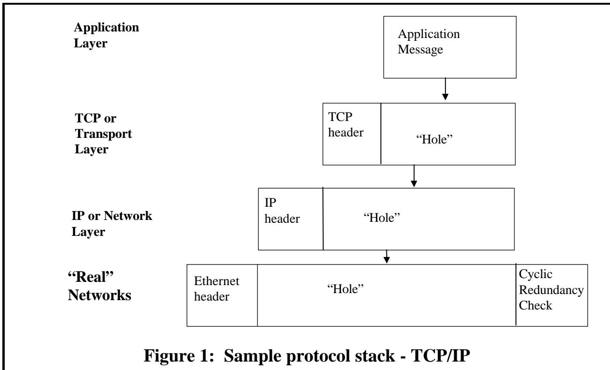

Figure 1 illustrates a TCP/IP stack, where real networks provide the basic carrier mechanism, with the IP protocol carried in the “hole” they provide, and with IP acting as a carrier for TCP (or the the less well-known User Datagram Protocol - UDP), forming another protocol layer, and with a (typically for TCP/IP) monolithic application layer - a single specification completing the final “hole”
图 1 展示了一个 TCP/IP 协议栈的结构。在实际的网络中，这种协议栈提供了基本的传输机制：IP 协议被封装在“洞”中传输，而 IP 又作为 TCP 协议的传输载体（或者更不常见的用户数据报协议 UDP 的传输载体）。此外，还有一个通常适用于 TCP/IP 协议的单一应用层——这一层的规定使得最终的“洞”得以完整形成。

The precise nature of the "service" provided by a lower layer - lossy, secure, reliable - and of any parameters controlling that service, needs to be known before the next layer up can make appropriate use of that service.
底层所提供的“服务”的具体特性——如具有损容性、安全性、可靠性等——以及控制该服务的各种参数，在上一层能够正确使用该服务之前，是必须明确了解的。

We usually refer to each of these individual specification layers as "a protocol", and hence we can enhance our definition:
我们通常将每一层具体的规范称为“一个协议”。因此，我们可以进一步细化这个定义：

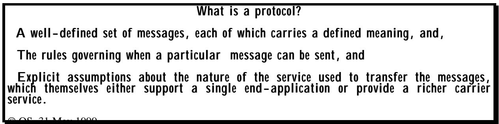

Note that in figure 1, the “hole” provided by the IP carrier can contain either a TCP message or a UDP message - two very different protocols with different properties (and themselves providing a further carrier service). Thus one of the advantages of "layering" is in reusability of the carrier service to support a wide range of higher level protocols, many perhaps that were never thought of when the lower layer protocols were developed.
请注意，在图 1 中，IP 层提供的“通道”可以承载 TCP 消息或 UDP 消息——这两种协议具有截然不同的特性，而且它们各自也提供了不同的传输服务。因此，“分层”设计的一个优势在于，它能够复用传输服务，从而支持各种高级协议，而这些高级协议在开发底层协议时可能根本未曾被考虑到。

When multiple different protocols can occupy a hole in the layer below (or provide carrier services for the layer above), this is frequently illustrated by the layering diagram shown in Figure 2.
当多个不同的协议能够占据下层中的某个接口，或者为上层提供传输服务时，这种情况通常可以通过图 2 中的分层结构图来表示。

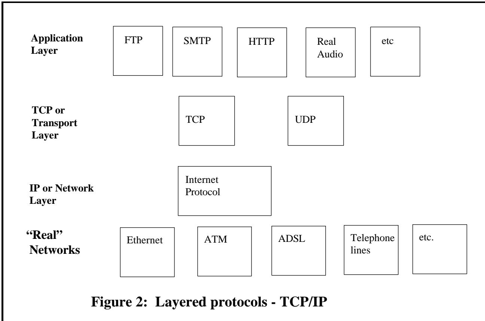

## 2 Protocol specification - some basic concepts 2. 协议规范——一些基本概念

Protocols can be (and historically have been) specified in many ways. One fundamental distinction is between character-based specification versus binary-based specification.
协议可以通过多种方式来指定。其中一个基本的区别在于基于字符的指定与基于二进制数的指定。

**Character-based specification**
**基于字符的规范说明**

The "protocol" is defined as a series of lines of ASCII encoded text.
“协议”被定义为一系列用 ASCII 编码的文本行。

**Binary-based specification**
**基于二进制的规范描述**

The “protocol” is defined as a string of octets or of bits.
“协议”被定义为一系列八位组或比特的序列。

For binary-based specification, approaches vary from various picture-based methods to use of a separately defined notation with associated application-independent encoding rules.
在基于二进制的规范中，有多种不同的方法可供使用。这些方法包括各种基于图像的方法，以及使用专门定义的符号体系，同时附带一些与应用程序无关的编码规则。

The latter is called the "abstract syntax" approach. This is the approach taken with ASN.1. It has the advantage that it enables designers to produce specifications without undue concern with the encoding issues, and also permits application-independent tools to be provided to support the easy implementation of protocols specified in this way. Moreover, because application-specific implementation code is independent of encoding code, it makes it easy to migrate to improved encodings as they are developed.
后一种方法被称为“抽象语法”方法。这是 ASN.1 所采用的方法。它的优点在于，它使得设计者能够在不过于关注编码问题的情况下编写规范；同时，它还允许使用与应用程序无关的工具来支持以这种方式定义的协议的轻松实现。此外，由于特定于应用程序的实现代码与编码代码相互独立，因此当新的编码方式被开发出来时，就可以轻松地对其进行迁移。

## 2.1 Layering and protocol "holes" 2.1 层次结构与协议漏洞

The layering concept is perhaps most commonly associated with the International Standards Organization (ISO) and International Telecommunications Union (ITU) "architecture" or "7-layer model" for Open Systems Interconnection (OSI) shown in Figure 3.
分层概念最常被国际标准化组织（ISO）和国际电信联盟（ITU）所使用的“架构”或“七层模型”所代表。这种模型在图 3 中有所展示，用于描述开放系统互连的技术框架。

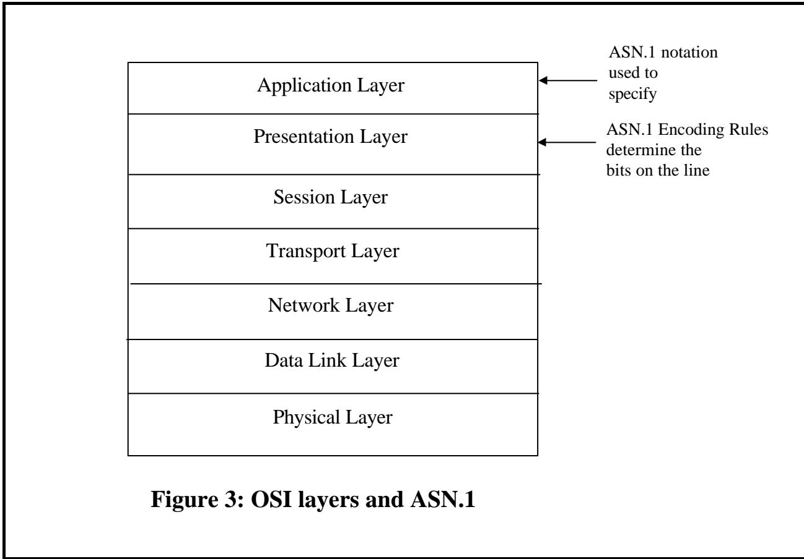

While many of the protocols developed within this framework are not greatly used today, it remains an interesting academic study for approaches to protocol specification. In the original OSI concept in the late 1970s, there would be just 6 layers providing (progressively richer) carrier services, with a final "application layer" where each specification supported a single endapplication, with no "holes".
虽然在这个框架内开发出的许多协议如今已不再被广泛应用，但作为协议规范方法的探索，它仍然是一项有趣的学术研究。在 20 世纪 70 年代末的 OSI 概念中，只有 6 层网络层，每层提供逐渐丰富的服务。最顶层是“应用层”，在这个层上，每个协议都只支持一个特定的应用功能，不存在“空洞”现象。

It became apparent, however, over the next decade, that even in the "application layer" people wanted to leave "holes" in their specification for later extensions, or to provide a means of tailoring their protocol to specific needs. For example, one of the more recent and important protocols - Secure Electronic Transactions (SET) - contains a wealth of fully-defined message semantics, but also provides for a number of "holes" which can transfer "merchant details" which are not specified in the SET specification itself. So we have basic messages for purchase requests and responses, inquiry requests and responses, authorization requests and responses, and so on, but within those messages there are “holes” for “message extensions” - additional information specific to a particular merchant.
然而，在接下来的十年里，人们逐渐意识到，即使在“应用层”中，也愿意在规范中留下一些“空白”，以便将来可以扩展功能，或者根据特定需求对协议进行定制。例如，最近出现的一个重要协议——安全电子交易协议（SET）就包含了丰富的定义明确的消息语义，但同时也为某些“空白”留下了空间，这些空白可以用来容纳那些在 SET 规范本身中没有明确规定的信息。因此，我们有了用于处理购买请求和响应、查询请求和响应、授权请求和响应等基本消息，而在这些消息内部，又有一些“空白”用于容纳针对特定商家而设计的附加信息。

It is thus important that any mechanism or notation for specifying a protocol should be able to cater well for the inclusion of "holes". This has been one of the more important developments in ASN.1 in the last decade, and will be a subject of much further discussion in this book.
因此，任何用于指定协议的机制或符号系统都应当具备能够妥善处理“空洞”情况的能力。这是 ASN.1 在过去十年中最重要的进展之一，并且本书还将进一步讨论这一主题。


"Catering well" for the inclusion of "holes" implies that the notation must have defined mechanisms (preferably uniformly applied to all specifications written using that notation) to identify the contents of a hole at communications time. (In lower layers, this is sometimes referred to as the "protocol id" problem). Equally important, however, are notational means to clearly identify that a specification is incomplete (contains a hole), together with well-defined mechanisms to relate the (perhaps later in time) specification of the contents of holee to the location of the holes themselves.
“为包含‘空洞’提供良好的支持”意味着这种表示方式必须包含明确的机制（最好是对所有使用该表示方式编写的规范都统一适用的机制），以便在通信时识别出“空洞”的内容。在较低层协议中，这个问题有时被称为“协议标识”问题。同样重要的是，还需要有明确的表示方式来明确表明某个规范是不完整的（包含有“空洞”），同时还需要有完善的机制来将“空洞”内容的描述与“空洞”的实际位置联系起来。

## 2.2 Early developments of layering 2.2 分层技术的早期发展

The very earliest protocols operated over a single link (called, surprisingly, "LINK" protocols!), and were specified in a single monolithic specification in which different physical signals (usually voltage or current) were used to signal specific events related to the application. (An example is the “off-hook” signal in early telephony systems). If you wanted to run a different application, you re-defined and re-built your electronics!
最早期的协议仅支持单一连接（令人惊讶的是，这些协议被称为“LINK”协议！），并且所有相关规范都集中体现在一份完整的规范文件中。当时，不同的物理信号（通常是电压或电流）被用来表示与应用程序相关的各种事件。例如，在早期的电话系统中，就有“挂断电话”的信号。如果想要运行其他应用程序，就必须重新定义并构建相应的电子设备了！

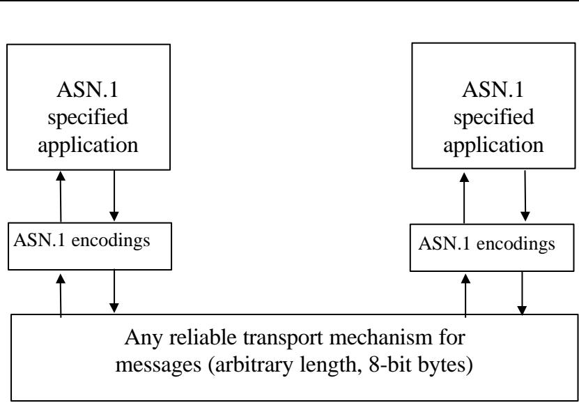

Figure 4: Application communication with ASN.1
图 4：应用程序与 ASN.1 格式的数据进行通信的过程

This illustrates the major advantage of "layering": it enables reusability of carrier mechanisms to support a range of different higher-layer protocols or applications, as illustrated in Figure 2.
这说明了“分层”设计的主要优势：它能够使载体机制具有可重用性，从而支持多种不同层次协议或应用程序的运行，如图 2 所示。

Nobody today would dream of providing a single monolithic specification similar to the old "LINK" protocols: perhaps the single most important step in computer communication technology was to agree that current, voltage, sound, light, signalling systems would do nothing more than transfer a two-item alphabet - a zero or a one - and that applications would build on that. Another important step was to provide another "layer" of protocol to turn this continuous flow of bits into delimited or "framed" messages with error detection, enabling higher layer protocols to talk about "sending a message" (which may get lost, may get through, but the unit of discussion is the message).
如今，没有人会想要提出类似于旧的“LINK”协议的那种统一的规范了。在计算机通信技术中，最重要的一步就是达成共识：当前、电压、声音、灯光等信号系统只能传输两个比特的信息——即 0 或 1。而后续的应用则可以在此基础上进行扩展。另一个重要的步骤是引入额外的协议层，将这种连续传输的二进制数据转化为具有错误检测的有限格式的消息。这样一来，高层协议就可以讨论“发送消息”的问题了——虽然消息可能会丢失，也可能会成功传递，但讨论的核心仍然是消息本身。

But this is far too low a level of discussion for a book on ASN.1! Between these electrical levels and the normal carriers that ASN.1 operates with we have layers of protocol concerned with addressing and routing through the Internet or a telecoms network, and concerned with recovery from lost messages.
但是，对于一本关于 ASN.1 的书籍来说，这种讨论水平实在是太低了！在 ASN.1 所使用的各种电气层次结构以及常规传输介质中，我们有许多协议层负责处理在互联网或电信网络中的地址分配和路由问题，同时也负责处理丢失消息的恢复工作。

At the ASN.1 level, we assume that an application on one machine can "talk" to an application on another machine by reliably sending octet strings between themselves. (Note that all ASN.1- defined messages are an integral multiple of 8-bits - an octet string, not a general bit-string). This is illustrated in Figure 4.
在 ASN.1 级别，我们假设一台机器上的应用程序可以通过可靠地发送八位字节字符串来与另一台机器上的应用程序进行通信。（注意，所有由 ASN.1 定义的消息都是 8 位整数的倍数——即八位字节字符串，而不是普通的位字符串）。如图 4 所示，这一点非常清晰。

Nonetheless, many ASN.1-defined applications are still specified by first specifying a basic "carrier" service, with additional specifications (perhaps provided differently by different groups) to fill in the holes. This is illustrated in Figure 5. As we will see later, there are many mechanisms in ASN.1 to support the use of "holes" or of "layering".
不过，许多由 ASN 定义的应用仍然是通过先指定一个基本的“载体”服务来定义的，然后再通过额外的规范来补充细节（这些额外规范可能由不同的团队以不同的方式提供）。如图 5 所示，存在许多 ASN 中的机制来支持“填充空白”或“分层”的使用。正如我们稍后会看到的，ASN 中确实有许多机制可以用来实现这些功能。

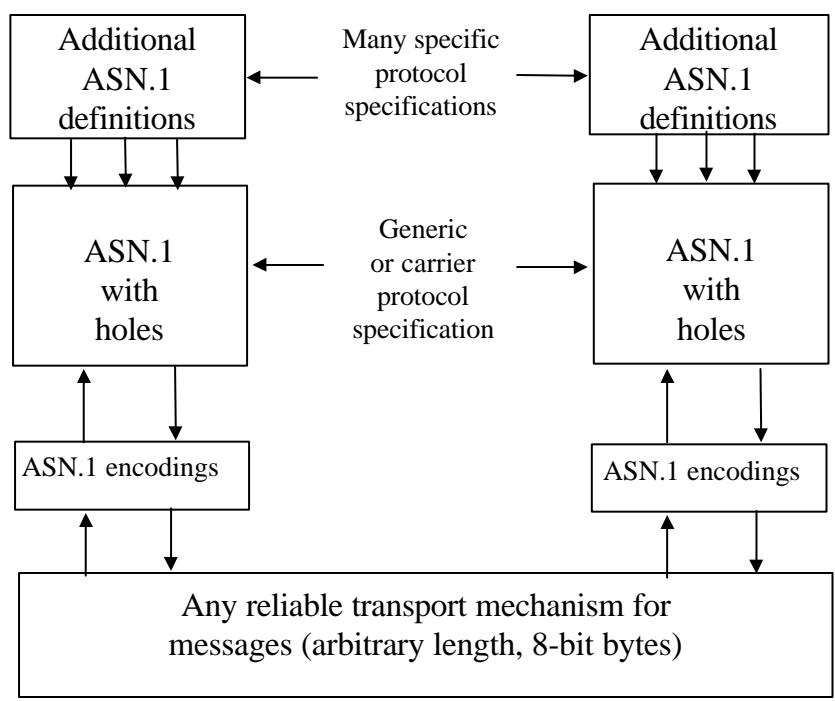

Figure 5: Generic and specific protocols with ASN.1
图 5：包含 ASN 协议的通用协议与特定协议

People have sometimes described the OSI 7-layer model as "layering gone mad". Layering can be an important tool in promoting reusability of specifications (and code), and in enabling parts of the total specification (a low or a high layer), to be later improved, extended (or just mended!) without affecting the other parts of the total specification. This desirable feature will, of course, only be achieved if the means for linking the different parts of the specification together to form the complete whole are sufficiently rich.
人们有时将 OSI 七层模型描述为“疯狂的分层”。这种分层方式是一种重要的手段，它有助于提升规范（以及代码）的可重用性。通过将规范的各个部分分开处理（无论是较低层还是较高层），可以在不影响其他部分的情况下对它们进行改进、扩展或修复。当然，这一理想特性只有在能够充分连接规范的不同部分以形成完整整体时才能实现。

## 2.3 The disadvantages of layering - keep it simple! 2.3 分层处理的缺点——尽量保持简单！

Layering clearly carries important advantages in reusability, but it also carries the major disadvantage that in order to implement completely some given application, many different documents may have to be consulted, and the "glue" for linking these together may not always be precise enough to ensure that implementations by different vendors interwork.
分层设计在提高可重用性方面确实具有显著的优势，但同时也存在一个主要缺点：为了完全实现某个应用程序的功能，可能需要查阅许多不同的文档。而将这些文档链接在一起的“纽带”往往不够精确，无法确保不同厂商开发的模块能够相互协作。

It is important, therefore, in designing protocols, that the desire for generality and long-life be tempered by an equal desire to keep the total specification simple. This is again a theme that we will return to later - ASN.1 makes it possible to write very simple and clear specifications very easily and quickly. But it also contains powerful features to support layering and "extensibility" (see below). The decision to use or to not use such features must be one for the designer. There are circumstances where their use is essential for a good long-lasting specification. There are other cases where the added complexity (and sometimes implementation size) does not justify the use of advanced features.
因此，在设计协议时，必须平衡对通用性和长期可用性的需求，同时尽量保持规范的简洁性。这又是我们需要后续探讨的一个主题——ASN.1 使得编写简单明了的规范变得非常容易和快捷。不过，它同时也包含了许多强大的功能，可以支持层的嵌套和“扩展性”（详见下文）。是否使用这些功能，需要由设计者自行决定。在某些情况下，使用这些功能对于打造优秀的、长期可用的规范是必不可少的。而在另一些情况下，额外的复杂性（有时还包括更大的实现规模）则使得使用这些高级功能变得不值得。

## 2.4 Extensibility 2.4 可扩展性

A remark was made earlier that layering enables "later improvement" of one of the layers without affecting the specification of layers above and below. This concept of "later improvement" is a key phrase, and has an importance beyond any discussion of layering. One of the important aspects of protocol specification that became recognised in the 1980s is that a protocol specification is rarely (probably never!) completed on date xyz, implemented, deployed, and left unchanged.
之前曾提到过一种机制，即分层处理可以“在不影响上层规范的情况下”对某一层进行改进。这种“后期改进”的概念是一个关键概念，其重要性远超对分层处理的讨论。在 20 世纪 80 年代，人们认识到，协议规范很少能够按时完成，更不用说实现、部署后不再进行任何修改了。

**Extensibility provision**
**可扩展性条款**

Part of a version 1 specification designed to make it easy for future version 2 (extended) systems to interwork with deployed version 1 systems
这是版本 1 规范的一部分，旨在使未来的版本 2（扩展版）系统能够更容易地与已部署的版本 1 系统协同工作。

There is always a "version 2". And implementations of version 2 need to have a ready means of interworking with the already-deployed implementations of "version 1", preferably without having to include in version 2 systems a complete implementation of both version 1 and version 2 (sometimes called "dual-stacks"). Mechanisms enabling version 1 and version 2 exchanges are sometimes called a "migration" or "interworking strategy" between the new and the earlier versions. In the transition from IPv4 to IPv6 (the “IP” part of “TCP/IP”), it has perhaps taken as much work to solve migration problems as it took to design IPv6 itself! (An exaggeration of course, but the point is an important one - interworking with deployed version 1 systems matters.)
总是存在“版本 2”的设想。而实现版本 2 时，需要有一种能够与已部署的版本 1 系统相互协作的机制，最好是在版本 2 的系统中不需要包含版本 1 和版本 2 的完整实现（这种情况有时被称为“双栈”架构）。使版本 1 和版本 2 能够相互交换数据的机制，有时被称为“迁移”或“互操作策略”。在从 IPv4 过渡到 IPv6 的过程中（即“TCP/IP”中的“IP”部分），解决迁移问题所花费的精力，或许与设计 IPv6 本身所花费的精力相当！（当然，这有点夸张了，但关键在于与已部署的版本 1 系统进行互操作是非常重要的。）

It turns out that provided you make plans for version 2 when you write your version 1 specification, you can make the task of "migration" or of defining an "interworking strategy" much easier.
结果表明，如果你在编写版本 1 的规范时就已经为版本 2 做好了规划，那么“迁移”任务以及定义“互操作策略”的工作就会变得容易得多。

We can define extensibility provision as
我们可以将可扩展性条款定义为……

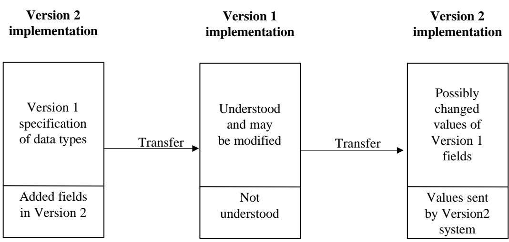

Figure 6: Version 1 and Version 2 interworking
图 6：版本 1 与版本 2 之间的互操作功能

elements of a version 1 specification that allow the encapsulation of unknown material at certain points in the version 1 messages, and
版本 1 规范中的某些元素，这些元素允许在版本 1 消息的某些位置封装未知的数据。

specification of the actions to be taken by the version 1 system if such material is present in a message.
如果消息中包含此类内容，那么版本 1 的系统将采取哪些行动。

Provision for extensibility in ASN.1 is an important aspect which will be discussed further later in this book, and is illustrated in Figure 6.
在 ASN1 中，可扩展性是一个重要的特性。这一特性将在本书的后续章节中进一步讨论，并在图 6 中进行了说明。

Extensibility was present in early work in ITU-T and ISO by use of a very formalised means of transferring parameters in messages, a concept called "TLV" - Type, Length, Value, in which all pieces of information in a message are encoded with a type field identifying the nature of that piece of information, a length field delimiting the value, and then the value itself, an encoding that determines the information being sent. This is illustrated in Figure 7 for parameters and for groups of parameters. The approach is generalised in the ASN.1 Basic Encoding Rules (BER) to cover groups of groups, and so on, to any depth.
在 ITU-T 和 ISO 的早期工作中，就已经采用了一种非常规范的方式来传递参数，这种机制被称为“TLV”——即类型、长度、值。在这种机制中，消息中的每一条信息都被编码为三个部分：类型字段用于标识该信息的类型，长度字段用于限定值的长度，而值本身则包含具体的信息内容。如图 7 所示，这种处理方式适用于单个参数以及参数组的情况。在 ASN.1 的基本编码规则中，这种机制被进一步泛化，可以应用于任意深度的参数组情况。

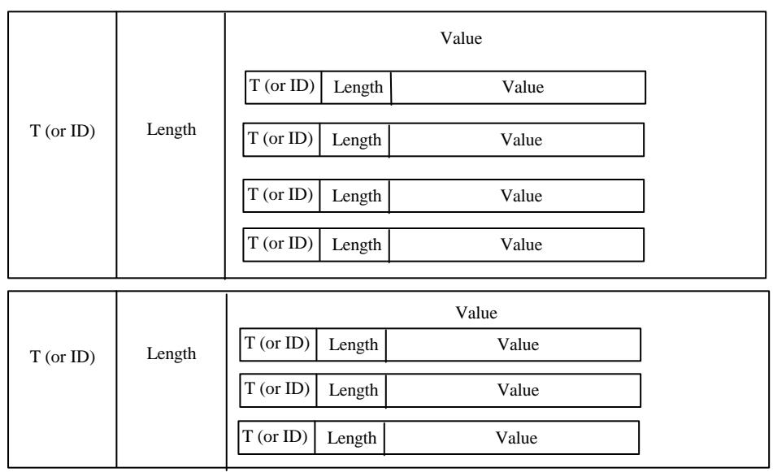

Figure 7: The “TLV” approach for parameters and groups
图 7：用于参数和组的“TLV”方法

Note that the encoding used for the value only needs to unambiguously identify application information within the context of the parameter identified by the type field. This concept of distinct octet-strings that identify information within the context of some explicit "class" or "type" identifier is an important one that will be returned to later.
需要注意的是，用于表示值的编码方式只需能够明确地在由类型字段所标识的参数的上下文中识别应用信息。这种通过不同的八位组字符串来标识信息的概念非常重要，这一点会在后续的内容中进一步探讨。

By requiring in the version 1 specification that parameters that are "unrecognized" - added in version 2 - should be silently ignored, the designers of version 2 have a predictable basis for interworking with deployed version 1 systems. Of course, any other well-specified behaviour could be used, but "silently ignore" was a common specification. ASN.1 provides a notation for defining the form of messages, together with “encoding rules” that specify the actual bits on the line for any message that can be defined using the notation. The "TLV" described above was incorporated into the earliest ASN.1 encoding rules (the Basic Encoding Rules or BER) and provides very good support for extensibility due to the presence in every element of the "T" and the "L", enabling "foreign" (version 2 ) material to be easily identified and skipped (or relayed). It does, however, suffer from encoding identification and length fields which are often unnecessary apart from their use in promoting extensibility. For a long time, it was thought that this verbosity was an essential feature of extensibility, and it was a major achievement in encoding rule design when the ASN.1 Packed Encoding Rules (PER) provided good support for extensibility with little additional overhead on the line.
通过在版本 1 的规范中要求忽略那些在版本 2 中添加的“无法识别”的参数，版本 2 的设计者能够以一种可预测的方式与已部署的版本 1 系统进行互操作。当然，也可以使用其他定义明确的处理方式，但“忽略”似乎是一个常见的规范。ASN.1 提供了一种用于定义消息形式的符号系统，同时还有“编码规则”来指定任何可以使用该符号系统定义的消息中的具体比特位。上述的“TLV”格式被纳入了最早的 ASN.1 编码规则（基本编码规则或 BER），由于其中包含了“T”和“L”这两个元素，因此该格式为扩展性提供了很好的支持，使得可以轻松识别并跳过那些“非本地”的（即版本 2 中的）内容。不过，该格式也存在编码标识和长度字段的问题，这些问题往往是不必要的。除了在促进可扩展性方面的作用之外，这个动词性特征其实还具有重要意义。长期以来，人们认为这种冗长的描述方式是可扩展性的一个重要特性。当 ASN.1 打包编码规则（PER）能够很好地支持可扩展性，同时又能减少额外的处理开销时，这确实是一项重大的编码规则设计成就。

## 2.5 Abstract and transfer syntax 2.5 抽象语法和转移语法

The terms abstract and transfer syntax were primarily developed within the OSI work, and are variously used in other related computer disciplines. The use of these terms in ASN.1 (and in this book) is almost identical to their use in OSI, but does not of course make ASN.1 in any way dependent on OSI.
“抽象”和“传输语法”这两个术语主要是在 OSI 规范中提出的，后来也被应用于其他相关的计算机学科中。在 ASN.1 中（以及本书中），这些术语的使用方式与 OSI 规范中的使用方式几乎相同，但当然，这并不会使 ASN.1 完全依赖于 OSI 规范。

The following steps are necessary when specifying the messages forming a protocol (see Figure 8):
在指定构成协议的消息时，需要执行以下步骤（参见图 8）：

* The determination of the information that needs to be transferred in each message; this is a "business-level" decision. We here refer to this as the semantics associated with the message.
* 需要包含在每条消息中的信息内容的确定；这是一个“业务级”决策。我们将其称为与消息相关的语义。

The design of some form of data-structure (at about the level of generality of a high-level programming language, and using a defined notation) which is capable of carrying the required semantics. The set of values of this data-structure are called the abstract syntax of the messages or application. We call the notation we use to define this data structure or set of values we the abstract syntax notation for our messages. ASN.1 is just one of many possible abstract syntax notations, but is probably the one most commonly used.
某种数据结构的设计（在高级编程语言的一般性层次上，使用特定的表示法），它能够承载所需的语义。这种数据结构的值集合被称为消息或应用的抽象语法。我们用来定义这种数据结构或值集合的表示法，就被称为抽象语法表示法。ASN.1 只是众多可能的抽象语法表示法中的一种，但很可能是使用最广泛的表示法。

The crafting of a set of rules for encoding messages such that, given any message defined using the abstract syntax notation, the actual bits on the line to carry the semantics of that message are determined by an algorithm specified once and once only (independent of the application). We call such rules encoding rules, and we say that the result of applying them to the set of (abstract syntax) messages for a given application defines a transfer syntax for that application. A transfer syntax is the set of bit-patterns to be used to represent the abstract values in the abstract syntax, with each bit-pattern representing just one abstract value. (In ASN.1, the bit-patterns in a transfer syntax are always a multiple of 8 bits, for easy carriage in a wide range of carrier protocols).
我们制定了一套编码规则，这些规则能够确保：对于任何使用抽象语法表示法定义的消息，承载该消息语义的实际比特位可以通过一个唯一确定的算法来确定（该算法不依赖于具体的应用）。我们将这些规则称为编码规则。当将这些规则应用于特定应用的抽象语法消息集时，所得到的结果就构成了该应用的传输语法。传输语法指的是用于表示抽象语法中抽象值的比特模式集合，每个比特模式仅对应一个抽象值。（在 ASN.1 中，传输语法中的比特模式总是 8 位的倍数，这样可以方便地嵌入到各种传输协议中。）

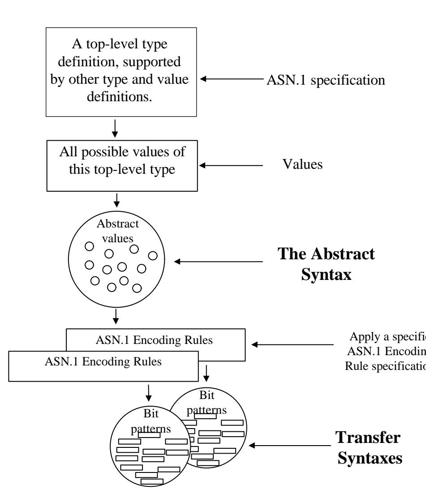

Figure 8: From abstract specification to bits-on-the-line
图 8：从抽象规范到实际实施的过程

We saw that early LINK protocols did not clearly separate electrical signalling from application semantics, and similarly today, some protocol specifications do not clearly separate the specification of an abstract syntax from the specification of the bits on the line (the transfer syntax). It is still common to directly specify the bit-patterns to be used (the transfer syntax), and the semantics associated with each bit-pattern. However, as will become clear later, failure to clearly separate abstract from transfer syntax has important implications for reusability and for the use of common tools. With ASN.1 the separation is complete.
我们看到，早期的 LINK 协议并没有明确区分电气信号传输与应用语义的划分。同样，如今一些协议规范也没有明确区分抽象语法规范与线路上实际比特位的规范。通常，人们会直接指定要使用的比特模式（即传输语法），以及每种比特模式所对应的语义。然而，正如后面会提到的，未能明确区分抽象语法与传输语法规范，会对可重用性以及常用工具的使用产生重要影响。而 ASN.1 则实现了这种区分的完全明确。

## 2.6 Command line or statement-based approaches 2.6 命令行或语句式方法

Another important approach to protocol design (not the approach taken in ASN.1) is to focus not on a general-purpose data-structure to hold the information to be transferred, but rather to design a series of lines of text each of which can be thought of as a command or a statement, with textual parameters (frequently comma separated) within each command or statement. This approach predated the use of ASN.1, but is still frequently employed today, more commonly in Internet-defined protocols (for example, the Internet Hyper-Text Transfer Protocol - HTTP - that supports the World-Wide Web) than in ITU-T/ISO-defined protocols. A further discussion of this approach is given in 5.4 below.
另一种重要的协议设计方法（与 ASN.1 中采用的方法不同）是不要专注于使用一种通用的数据结构来存储要传输的信息，而是设计一系列文本行。每一行都可以被视为一个命令或语句，而在每个命令或语句中还可以包含文本参数（通常是以逗号分隔的）。这种方法在 ASN.1 出现之前就已经存在了，不过至今仍然被广泛使用，尤其是在基于互联网定义的协议中（例如，支持全球网络运行的互联网超文本传输协议——HTTP）。关于这种方法的更多讨论请参见下面的 5.4 节。

## 2.7 Use of an Interface Definition Language 2.7 接口定义语言的使用

The use of an Interface Definition Language (IDL) is very similar to the abstract syntax approach of ASN.1. Here, however, the model is of objects interacting over a network through defined interfaces which enable the functions or methods of an object to be invoked, and its results to be returned. The model is supported by an Interface Definition Language that enables the datastructures which are passed across each interface to be specified at a high-level of abstraction.
使用接口定义语言（IDL）的方式与 ASN.1 的抽象语法方法非常相似。不过，在这种模式下，模型描述的是通过定义好的接口在网络中进行交互的对象。这些接口使得可以调用对象的函数或方法，并获取其返回值。该模型由接口定义语言来支持，这使得可以在较高的抽象层次上指定通过各个接口传递的数据结构。

Probably the most important IDL today is the Common Object Request Broker Architecture (CORBA) IDL. In CORBA, the IDL is supported by a wealth of specifications and tools including encoding rules for the IDL, and means of transfer of messages to access interfaces across networks.
目前最重要的 IDL 可能是通用对象请求代理架构（CORBA）的 IDL 了。在 CORBA 中，IDL 得到了丰富的规范和支持，包括用于编码 IDL 的规则，以及用于跨网络传输消息以访问不同接口的手段。

A detailed comparison of ASN.1 and CORBA goes beyond this text, and remarks here should be taken as this author’s perception in mid 1999. In essence, CORBA is a complete architecture and message passing specification in which the IDL and corresponding encodings form only a relatively small (but important) part. The CORBA IDL is simpler and less powerful than the ASN.1 notation, and as a result encodings are generally much more verbose than the Packed Encoding Rule (PER) encodings of ASN.1. ASN.1 is generally used in protocol specifications where very general and flexible exchange of messages is needed between communicating partners, whereas CORBA encourages a much more stylised “invocation and response” approach, and generally needs a much more substantial suporting infrastructure.
关于 ASN.1 与 CORBA 的详细比较超出了本文的范围。这里所提出的观点仅代表作者在 1999 年中的看法。实际上，CORBA 是一种完整的架构和消息传递规范，而 IDL 及其对应的编码只是其中的一部分而已。CORBA 的 IDL 比 ASN.1 的表示方式更为简单且功能有限，因此其编码方式通常比 ASN.1 的打包编码规则要冗长得多。ASN.1 通常用于需要非常通用且灵活的消息交换的协议规范中，而 CORBA 则更倾向于采用更为规范化的“调用与响应”模式，因此通常需要更为完善的支持基础设施。

## 3 More on abstract and transfer syntaxes 3. 更多关于抽象语法和转移语法的内容

## 3.1 Abstract values and types 3.1 抽象值与类型

Most programming languages involve the concept of types or classes (and notation to define a more complex type by reference to built-in types and "construction mechanisms"), with the concept of a value of a type or class (and notation to specify values). ASN.1 is no different.
大多数编程语言都涉及类型或类这一概念（以及用于通过引用内置类型或“构造机制”来定义更复杂类型的表示法）。类型或类的具体值也是需要被处理的（并且有专门的表示法来指定这些值）。ASN.1 也不例外。

So, for example, in C we can define a new type “My-type” as:
例如，在 C 语言中，我们可以定义一种新类型“My-type”：

```c
typedef struct My-type {
    short first-item;
    boolean second-item
} My-type; 
```

The equivalent definition in ASN.1 appears below.
在 ASN.1 中，对应的定义如下。

In ASN.1 we also have the concept of values of basic types or of more complex structures. These are often called abstract values (see Figure 8 again), to emphasise that we are considering them without any concern for how they might be represented in a computer or on a communications line. For convenience, these abstract values are grouped together into types. So for example, we have the ASN.1 type notation
在 ASN.1 中，我们还定义了基本类型的值以及更复杂的结构值。这些通常被称为抽象值（请再次参考图 8），目的是强调我们是在不考虑这些值在计算机或通信线路上的表示方式的情况下来考虑它们的。为了方便起见，这些抽象值被归类到不同的类型中。例如，我们有 ASN.1 类型表示法

```
INTEGER
```

that references the integer type, with abstract values from (more or less) minus infinity to plus infinity. We also have the ASN.1 type notation
它指的是整数类型，其抽象值范围是从负无穷大到正无穷大。我们还使用了 ASN.1 类型的表示方式。

```
BOOLEAN
```

that references the boolean type with just two abstract values "TRUE" and "FALSE".
它引用了只有两个抽象值“TRUE”和“FALSE”的布尔类型。

We can define a type of our own:
我们可以定义一种属于自己的类型：

$$
\begin{array}{r l} \text {My - type} & : := \text {SEQUENCE} \\ & \left\{\text {first - item} \quad \text {INTEGER}, \right. \\ & \left. \text {second - item} \quad \text {BOOLEAN} \right\} \end{array}
$$

each of whose abstract values is a pair of values, one "integer" and one "boolean". The important point, however, is that for many purposes, we don't care about (or discuss) any internal structure of the values in "My-type". Just like "integer" and "boolean", it is simply a convenient means of referencing a set of abstract values.
这些对象的每个抽象值都由一个“整数”和一个“布尔值”组成。不过，重要的是，对于许多应用场景来说，我们并不关心“My-type”中这些值的内部结构。就像“整数”和“布尔值”一样，它们只是对一组抽象值进行引用的一种便捷方式而已。

## 3.2 Encoding abstract values 3.2 抽象值的编码

So (to summarise the above discussion) for any type that can be defined using ASN.1, we say that it contains (represents) a set of abstract values. (See Figure 8 again).
因此（总结上述讨论），对于任何可以用 ASN 来定义的类型，我们都可以说它包含了一组抽象的值。（请再次参考图 8）。

## But now for the important part: 但现在是关键的部分：

When any (correct!) set of encoding rules are applied to the abstract values in any given ASN.1 type, they will produce bit-patterns (actually octet-strings) for each value such that any given octet string corresponds to precisely one abstract value.
当将任何一组正确的编码规则应用于任何给定的 ASN.1 类型中的抽象值时，都会为每个值产生一个位模式（实际上是一个八位组字符串）。这样一来，任何一个八位组字符串都唯一对应一个抽象值。

Note that the reverse is not necessarily true - there may be more than one octet string for a given abstract value. This is another way of saying that there may be options in the encoding rules. (ASN.1 requires all conforming decoders to handle any encodings that a conforming encoder is allowed to use).
需要注意的是，相反的情况也不一定成立——对于给定的抽象值，可能存在多个八位元字符串表示方式。这也就是说，在编码规则中可能存在多种选择。（ASN.1 要求所有兼容的解码器都能处理兼容编码器所使用的任何编码方式）。

If we restrict encoder options so that for any given abstract value in the type there is precisely one encoding, we say that the encoding rules are canonical. Further discussion of canonical encoding rules appears in Section III.
如果我们限制编码选项，使得在给定类型的任何抽象值上都只有一种编码方式，那么我们可以说这种编码规则是规范的。关于规范编码规则的更多讨论请参见第三部分。

Now let us consider a designer wanting to specify the messages of a protocol using ASN.1. It would be possible to define a set of ASN.1 types (one for each different sort of message), and to say that the set of abstract values to be transmitted in protocol exchanges (and hence needing encoding) are the set of all the abstract values of all those
现在，让我们考虑一个设计师的情况，他希望使用 ASN.1 来指定协议的消息内容。可以定义一组 ASN.1 类型，每种类型对应一种不同的消息类型。然后，可以认为在协议交换中需要传输的抽象值集合，其实就是所有这些类型的抽象值的总和。

<table><tbody><tr><td data-imt-p="1">Abstract syntax 抽象语法结构</td></tr><tr><td data-imt-p="1">The set of abstract values of the top-level type for the application 该应用程序顶层类型的抽象值集合</td></tr></tbody></table>

ASN.1 types. The observant reader (some people won't like me saying that!) will have spotted that the above requirement on a correct set of encoding rules is not sufficient for unambiguous communication of the abstract values, because two abstract values in separate but similar ASN.1 types could have the same octet-string representation. (Both types might be a sequence of two integers, but they could carry very different semantics).
ASN.1 类型。细心的读者可能会注意到，仅仅要求使用正确的编码规则是不够的，因为这并不能确保抽象值的明确传达。因为两个属于不同但相似的 ASN.1 类型的抽象值，可能会具有相同的八位元字符串表示形式。（这两种类型可能都表示两个整数序列，但它们可能具有完全不同的语义。）

It is therefore an important requirement in designing protocols using ASN.1 to specify the total set of abstract values that will be used in an application as the set of abstract values of a single ASN.1 type. This set of abstract values is often referred to simply as the abstract syntax of the application, and the corresponding set of octet-strings after applying some
因此，在使用 ASN.1 来设计协议时，明确指定将在应用程序中使用的抽象值集合是一个重要的要求。这一抽象值集合通常被称为应用程序的抽象语法，而在应用某些规则之后得到的八位组字符串集合则被称为应用程序的具体实现。

## Transfer syntax 转移句法

A set of unambiguous octet strings used to represent a value from an abstract syntax during transfer
一组明确的八位元字符串，用于在传输过程中表示从抽象语法中得到的数值。

set of encoding rules is referred to as a possible transfer syntax for that application. Thus the application of the ASN.1 Basic Encoding Rules (as in Figure 8) to an ASN.1 type definition produces a transfer syntax (for the abstract syntax) which is a set of bit patterns that can be used to unambiguously represent these abstract values during transfer.
一组编码规则被视作该应用可能使用的传输语法。因此，将 ASN.1 基本编码规则应用于 ASN.1 类型定义时，就会得到一种传输语法（针对抽象语法而言）。这种传输语法由一系列位模式组成，这些位模式可以在传输过程中明确无误地表示这些抽象值。

Note that in some other areas, where the emphasis is on storage of data rather than its transfer over a network, the concept of abstract syntax is still used to represent the set of abstract values, but the term concrete syntax is sometimes employed for a particular bit-pattern representation of the material on a disk. Thus some authors will talk about "concrete transfer syntax" rather than just “transfer syntax”, but this term is not used in this book.
需要注意的是，在其他一些领域，人们更注重数据的存储，而不是通过网络进行传输。在这种情况下，仍然使用抽象语法这一概念来表示一系列抽象值。不过，有时也会使用“具体语法”这一术语来描述磁盘上数据的特定比特模式表示方式。因此，有些作者会使用“具体传输语法”这一术语，而不是简单的“传输语法”。但本书中并未使用这一术语。

We will see later how, if we have distinct ASN.1 types for different sorts of messages, we can easily combine them into a single ASN.1 type to use to define our abstract syntax (and hence our transfer syntax). There is specific notation in the post-1994 version of ASN.1 to clearly identify this "top-level" type. All other ASN.1 type definitions in the specification are there solely to give support to this top-level type, and if they are not referenced by it (directly or indirectly), their definition is superfluous and a distracting irrelevance! Most people don't retain superfluous type definitions in published specifications, but sometimes for historical reasons (or through sloppy editing or both!) you may encounter such material.
我们稍后会看到，如果我们为不同类型的消息定义不同的 ASN.1 类型，那么我们可以很容易地将它们合并为一个单一的 ASN.1 类型，以用于定义我们的抽象语法（从而也定义我们的传输语法）。在 1994 年之后的 ASN.1 版本中，有专门的符号用于明确标识这种“顶层”类型。规范中其他所有的 ASN.1 类型定义都是为了支持这种顶层类型而存在的；如果它们没有直接或间接地被该类型引用，那么它们的定义就是多余的，而且还会造成不必要的混乱。大多数人在发布的规范中都不会保留多余的类型定义，但有时由于历史原因（或者因为编辑上的疏忽），你可能会遇到这样的内容。

In summary then: ASN.1 encoding rules provide unambiguous octet-strings to represent the abstract values in any ASN.1 type; the set of abstract values in the top-level type for an application is called the abstract syntax for that application; the corresponding octet-strings representing those abstract values unambiguously (by the use of any given set of encoding rules) is called a transfer syntax for that application.
总结一下：ASN.1 编码规则能够明确地定义出用于表示任何 ASN.1 类型中的抽象值的八位组字符串；在应用程序中，顶层类型中的抽象值集合被称为该应用程序的抽象语法；而表示这些抽象值的八位组字符串，通过某种编码规则的定义，则被称为该应用程序的传输语法。

Note that where there are several different encoding rule specifications available (as there are for ASN.1) there can in general be several different transfer syntaxes (with different verbosity and extensibility - etc - properties) available for a particular application, as shown in Figure 8.
需要注意的是，当存在多种不同的编码规则规范可供选择时（就像 ASN.1 标准中所描述的那样），通常对于一个特定的应用来说，可能会存在多种不同的传输语法方案可供选择。这些语法方案在详细程度和可扩展性等方面会有所不同，如图 8 所示。

In the OSI world, it was considered appropriate to allow run-time negotiation of which transfer syntax to use. Today, we would more usually expect the application designer to make a selection based on the general nature and requirements of the application.
在 OSI 模型中，允许在运行时协商使用哪种传输语法是被认为合适的做法。如今，我们通常会期望应用程序设计者根据应用程序的特性和需求来做出选择。

## 4 Evaluative discussion 4. 评估性讨论

## 4.1 There are many ways of skinning a cat - does it matter? 4.1 有多种多样的方法可以“剥掉猫的皮肤”——不过，这真的有那么重要吗？

Whilst the clear separation of abstract syntax specification (with associated semantics) from specification of a transfer syntax is clearly "clean" in a puristic sort of way, does it matter? Is there value in having multiple transfer syntaxes for a given application? The ASN.1 approach to protocol design provides a common notation for defining the abstract syntax of any number of different applications, with common specification text and common implementation code for deriving the transfer syntax from this. Does this really provide advantages over the character line approach discussed earlier? Both approaches have certainly been employed with success. Different experts hold different views on this subject, and as with so much of protocol design, the approach you prefer is more likely to depend on the culture you are working within than on any rational arguments. Indeed, there are undoubted advantages and disadvantages to both
虽然将抽象语法规范（包括相关的语义描述）与传输语法规范分开处理在纯粹主义的角度来看确实很“简洁”，但这样做真的有意义吗？对于某种特定应用来说，拥有多种传输语法是否有实际价值呢？ASN.1 的协议设计方法提供了一种通用的符号体系，可以用来定义多种不同应用的抽象语法。通过统一的规范文本和实现代码，可以轻松地推导出相应的传输语法。这种方式真的比之前讨论的逐字符处理方式更有优势吗？实际上，这两种方法都已经被成功应用过。不同专家对于这个问题有着不同的看法，就像许多协议设计一样，你更倾向于使用哪种方法，更多取决于你所处的文化环境，而非任何理性的理由。当然，这两种方法都有其各自的优缺点。

approaches, so that a decision becomes more one of which criteria you consider the most important, rather than on any absolute judgement. So here (as in a number of parts of this book) Figure 999: Readers take warning (modified - "Smoking" replaced by "This discussion" - from text that appears on all UK cigarette packets!) applies. (I will refer back to Figure 999 whenever a remark appears in this book that may be somewhat contentious).
因此，决策的过程更多地基于你认为最重要的标准来做出，而不是基于任何绝对的评判标准。就像本书中的许多部分一样，图 999 也体现了这一点：读者需要保持警惕（修改了“吸烟”这一表述，将其替换为“本次讨论”——这一表述出现在所有英国香烟包装上）。在本书中，每当出现可能有些争议性的观点时，我都会提到图 999。

Government Health Warning This discussion can damage your health! 
政府健康警告：此讨论可能会损害您的健康！

Figure 999: Readers take warning
图 999：读者们请注意警示信息

## 4.2 Early work with multiple transfer syntaxes 4.2 早期研究：多种转移语法的应用

Even before the concepts of abstract and transfer syntax were spelled out and the terms defined, protocol specifiers recognised the concepts and supplied multiple transfer syntaxes in their specifications.
在抽象语法和转移语法的概念被明确界定、相关术语被正式确立之前，各种协议规范就已经认识到了这些概念，并在其规范中提供了多种转移语法的实现方式。

Thus in the Computer Graphics Metafile (CGM) standard, the body of the standard defines the functionality represented by a CGM file (the abstract syntax), with three additional sections defining a "binary encoding", a "character encoding", and a "clear-text encoding". The "binary encoding" was the least verbose, was hard for a human to read (or debug), was not easy to produce with a simple program, and required a storage or transfer medium that was 8-bit transparent. The "character encoding" used two-character mnemonics for "commands" and parameters, and was in principle capable of being produced by a text editor. It was more human readable, but importantly mapped to octets via printing ASCII characters and hence was more robust in the storage and transfer media it could use (but was more verbose). The “clear-text” encoding was also ASCIIbased, but was designed to be very human-readable, and very suitable for production by a humanbeing using a suitable text editor, or for viewing by a human-being for debugging purposes. It could be employed before any graphical interface tools for CGM became available, but was irrelevant thereafter.
在计算机图形元文件（CGM）标准中，标准本身定义了 CGM 文件所表示的功能（即抽象语法）。此外，还有三个额外的部分用于定义“二进制编码”、“字符编码”和“明文编码”。其中，“二进制编码”是最不详细的编码方式，人类难以阅读或调试；用简单的程序生成这种编码也不容易实现。同时，这种编码需要一种 8 位透明的存储或传输介质。“字符编码”则使用两个字符的缩写来表示“命令”和参数，原则上可以用文本编辑器生成。这种编码方式更易于人类阅读，但重要的是，它通过打印 ASCII 字符将信息映射为八位字节，因此在存储和传输介质的选择上更为灵活（不过编码内容更为冗长）。而“明文编码”也是基于 ASCII 的，但设计上要尽可能易于人类阅读。非常适合由人类使用合适的文本编辑器进行编辑，或者供人类用于调试目的的查看。在 CGM 图形界面工具出现之前，可以使用这种格式；而在那之后，它就变得不那么重要了。

These alternative encodings are appropriate in different circumstances, with the compactness of the "binary encoding" giving it the market edge as the technology matured and tools were developed.
这些替代编码方式在不同情况下都适用。随着技术的发展和工具的完善，“二进制编码”方式的紧凑性使其逐渐成为市场上的主流选择。

## 4.3 Benefits 4.3 好处

Some of the benefits which arise when a notation for abstract syntax definition is employed are identified below, with counter arguments where appropriate.
当采用抽象语法定义的描述方式时，可以享受到一些好处。下面列出了这些好处的例子，并在适当的地方也列出了相应的反对意见。

## Efficient use of local representations 高效利用本地表示方式

Suppose you have an application using large quantities of material which is stored on machinetype-A in a machine-specific format - say with the most significant octet of each 16-bit integer at the lower address byte. On machine-type-B, however, because of differing hardware, the same abstract values are represented and stored with the most significant octet of each 16-bit integer at the higher address byte. (There are usually further differences in the machine-A/machine-B representations, but this so-called "big-endian/little-endian" representation of integers is often the most severe problem.)
假设有一个应用程序需要处理大量数据，这些数据以特定于机器的格式存储在机器类型 A 中——比如，每个 16 位整数的最高有效八位元被存储在较低地址字节中。而在机器类型 B 上，由于硬件的不同，同样的抽象值被以不同的方式表示和存储，即每个 16 位整数的最高有效八位元被存储在较高地址字节中。（当然，机器类型 A 和类型 B 之间的表示方式通常还有其他差异，但所谓的“大端/小端”整数表示方式往往是最严重的問題。）

When transferring between machine-type-A and machine-type-B, it is clearly necessary for one or both parties (and if we are to be even-handed it should be both!) to spend CPU cycles converting into and out of some agreed machine-independent transfer syntax. But if we are transferring between two separate machines both of machine-type-A, it clearly makes more sense to use a transfer syntax closely related to the storage format on those machines.
在将系统 A 转换为系统 B 的过程中，显然需要其中一方或双方花费一些 CPU 时间来将数据转换为一种与系统无关的传输语法，然后再将其转换回来。不过，如果是在两个属于系统 A 类型的机器之间进行传输，那么使用与这些机器的存储格式密切相关的传输语法会更加合理。

This issue is generally more important for applications involving the transfer of large quantities of highly structured information, rather than for small headers negotiating parameters for later bulk transfer. An example where it would be relevant is the Office Document Architecture (ODA) specification. This is an ISO Standard and ITU-T Recommendation for a large structure capable of representing a complete service manual for (for example) a Boeing aircraft, so the application data can be extremely large.
这个问题在涉及大量高度结构化信息传输的应用中更为重要，而不是用于处理少量参数以进行后续批量传输的情况。一个典型的例子是办公文档架构（ODA）规范。该规范是 ISO 标准和 ITU-T 推荐标准，适用于能够表示如波音飞机完整服务手册这类大型文档的结构。因此，相关的应用数据可能会非常庞大。

## Improved representations over time 随着时间推移而逐渐改进的表达方式

It is often the case that the early encodings produced for a protocol are inefficient, partly because of the desire to be "protective", or to have encodings that are easy to debug, in the early stages of deployment of the application, partly from simple time pressures. It can also be because insufficient effort is put into the "boring" task of determining a "good" set of "bits-on-the-line" for this application.
通常，在协议开发的早期阶段，所使用的编码方式效率不高。这部分是因为在应用程序部署初期，人们倾向于选择那些易于调试的编码方式，同时也出于时间压力考虑。此外，也可能是因为人们没有在确定适用于该应用的“合适比特数”这一“繁琐”任务上投入足够的精力。

Once again, if the bulk of the protocol is small compared with some "bulk-data" that it is transferring, as is the case - for most messages - with the Internet’s Hyper-Text Transfer Protocol (HTTP) or File Transfer Protocol (FTP), then efficiency of the main protocol itself becomes relatively unimportant.
同样，如果协议的大部分内容相对于它传输的“大量数据”来说相当小，就像在互联网的超文本传输协议（HTTP）或文件传输协议（FTP）中大多数消息的情况那样，那么主协议本身的效率就变得相对不重要了。

## Reuse of encoding schemes 编码方案的重复使用

If we have a clear separation of the concept of abstract syntax definition from transfer syntax definition, and have available a notation for abstract syntax definition (such as ASN.1) which is independent of any application, then specification and implementation benefits immediately accrue. The task of generating "good" encoding rules for that notation can be done once, and these rules can be referenced by any application that uses that notation to define its abstract syntax. This is not only a major saving of effort if a new application is to be specified, but it also provides a specification of a transfer syntax that has already been argued over, agreed, and gotten debugged!
如果我们能够明确区分抽象语法定义与传输语法定义的概念，并且拥有一种与任何应用程序无关的抽象语法定义表示法（例如 ASN.1 格式），那么规范与实现的优势就能立即显现。为这种表示法生成“合理”的编码规则只需进行一次，之后任何使用该表示法来定义其抽象语法的应用程序都可以引用这些规则。这不仅大大节省了在定义新应用程序时的工作量，而且还能提供一种经过充分讨论、确认并调试过的传输语法规范！

This approach also ensures a common "look-and-feel" to the resulting transfer syntaxes over a number of different applications, with well-understood characteristics and familiarity for implementors. It also makes possible the emergence of tools, discussed below.
这种方法还确保了在不同应用中使用的转换语法具有统一的“外观和感觉”，这些特征易于理解，也方便实施者使用。此外，这种方法还为后续工具的出现奠定了基础，这些工具将在后面讨论。

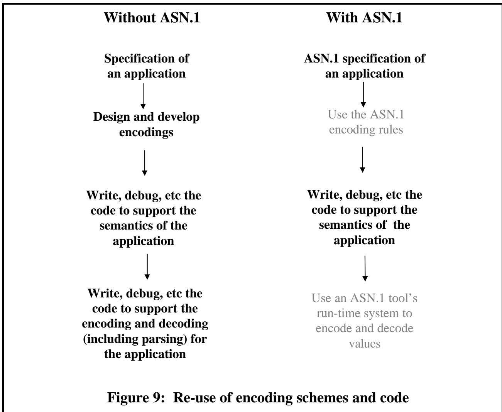

The advantage extends to the implementation. Where there is a clear notation and well-defined encoding rules that are application-independent, it becomes possible to provide a set of generic encode/decode routines that can be used by any application. This significantly reduces implementation effort and residual bugs. Figure 9 illustrates this situation, where the greyed-out text describes effort which is not required due to the re-use of existing material.
这种优势也体现在实现层面。当存在清晰的注释和独立于应用程序的编码规则时，就可以提供一套通用的编码/解码程序，这些程序可以被任何应用程序使用。这样就能显著减少实现过程中的工作量，并降低出错的可能性。图 9 展示了这种情况，其中灰色的文本部分表示由于重复使用了已有的代码，因此无需再进行额外的开发工作。

## Structuring of code 代码的结构化

If the specification of the encodings is kept clearly separate from the abstract syntax specification, and if the latter can be easily (by a tool or otherwise) mapped into data-structures in the implementation language, this encourages (but of course does not require) a modular approach to © OS, 31 May 1999 37 implementation design in which the code responsible for performing the encodings of the data is kept clearly separate from the code responsible for the semantics of the application.
如果编码规范与抽象语法规范能够明确分离，并且后者能够轻松地通过某种工具或方式被映射到实现语言中的数据结构之中，那么这种设计方式就会促进一种模块化的实现方式。当然，这并非必要条件。通过这种方式，负责数据编码的代码就可以与负责应用程序语义的代码明确分离开来。© OS，1999 年 5 月 31 日，第 37 页

## Reuse of code and common tools 代码的复用以及常用工具的共享

This is perhaps the major advantage that can be obtained from the separation of abstract and transfer syntax specification, which is characteristic of ASN.1.
这或许就是实现抽象语法与传输语法分离所带来的主要优势，而这一特性正是 ASN.1 体系的特点。

By the use of so-called ASN.1 "compilers" (dealt with more fully in a Chapter 7 of this section and which are application-independent), any abstract syntax definition in ASN.1 can be mapped into the (abstract) data-structure model of any given programming language, through the textual representation of data-types in that language. Implementors can then provide code to support the application using that (abstract) data-structure model with which they are familiar, and can call an application-independent piece of code to produce encodings of values of that data-structure for transmission (and similarly to decode on reception).
通过使用所谓的 ASN.1“编译器”（相关内容将在本节的第七章中详细讨论，这些编译器与具体应用程序无关），任何 ASN.1 抽象语法定义都可以转换为任意给定编程语言的（抽象）数据结构模型。通过用该语言的数据类型进行文本表示，就可以实现这种转换。然后，实现者可以编写代码来支持使用他们熟悉的这种抽象数据结构模型的应用程序。他们还可以调用一段与具体应用程序无关的代码，来生成该数据结构值的编码格式，以便进行传输（接收时也可以进行解码）。

It is very important at this point for the reader to understand why "(abstract)" was included in the above text. All programming languages (from C to Java) present to their users a "memory-model" by which users define, access, and manipulate structures. Such models are platform independent, and generally provide some level of portability of any associated code. However, in mapping through compilers and run-time libraries into real computer memory (concrete representation of the abstract data-structures), specific features of different platforms intrude, and the precise representation in memory differs from machine-type to machine-type (see the "big-endian/littleendian" discussion in Chapter 4 of Section III).
此时，让读者理解为什么在上述文本中使用了“抽象”这个词是非常重要的。所有编程语言（从 C 语言到 Java 语言）都会向用户展示一种“内存模型”，用户可以通过这种模型来定义、访问和操作数据结构。这种模型是独立于平台的，通常能够使得相关代码具有一定程度的可移植性。然而，在通过编译器和运行时的库将抽象数据结构转化为实际的计算机内存时，不同平台上的特定特性就会产生影响，因此不同机器上的内存表示方式也会有所不同（详见第 III 部分的第 4 章中关于“大端存储方式/小端存储方式”的讨论）。

A tool-vendor can provide (possibly platform-specific, but certainly application-independent) runtime routines to encode/decode values of the abstract data-structures used by the implementor, and the implementor can continue to be blissfully unaware of the detailed nature of the underlying hardware, but can still efficiently produce machine-independent transfer syntaxes from values stored in variables of the implementation language.
工具供应商可以提供（可能是特定于某种平台的，但肯定是与应用程序无关的）运行时例程，用于编码/解码实现者所使用的抽象数据结构的数值。实现者可以完全不关心底层硬件的详细特性，同时仍能从实现语言中的变量中存储的数值中高效地生成与硬件无关的传输格式。

As with any discussion of code structure, reusability, and tools, real benefits only arise when there are multiple applications to be implemented. It is sometimes worth-while building a generalpurpose tool to support a single implementation, but more often than not it would not be. Tools are of benefit if they can be used for multiple implementations, either by the same implementors or by a range of implementors.
就像在讨论代码结构、可重用性以及工具使用方式时一样，只有当有多个应用程序需要实施时，才能真正获得好处。有时候，开发一个适用于单一实现的通用工具是值得的，但大多数情况下，这样做并不划算。只有当这些工具能够被多个实现者使用，无论是同一批实现者还是不同的实现者时，它们才具有实际价值。

Tools for ASN.1 have only really emerged and matured because ASN.1 has become the specification language of choice for a wide range of applications.
用于 ASN.1 的工具之所以能够真正出现并成熟起来，是因为 ASN.1 已成为众多应用场景中首选的规范语言。

## Testing and line monitor tools 测试与线路监控工具

The use of a common notation to define the syntax of messages makes it possible to automate many aspects of total protocol support that go beyond the simple implementation of a protocol. For example, it becomes possible to automatically generate test sequences, and to provide generic line-monitors or “sniffers”.
使用一种统一的表示方式来定义消息的语法，可以自动化处理协议的许多方面，而不仅仅是简单地实现协议的功能。例如，就可以自动生成测试序列，并提供通用的线路监控工具或“嗅探器”。

## Multiple documents requires "glue" 多份文件需要“粘合”在一起。

Separation of abstract and transfer syntax specification, whilst distinct from layering, has some common aspects. It promotes reusability of specifications and code, but it means that more than one document has to be obtained and read before it is possible to implement the application. It also means that unless the "glue" between the two parts of the total specification is well-defined, there is scope for errors.
将抽象规范与传输语法规范分离，虽然这与分层处理有所不同，但两者之间有一些共同的特性。这种做法有助于提升规范和代码的可重用性。不过，这也意味着在实施应用程序之前，需要阅读并理解多个文档的内容。此外，如果整个规范中两部分之间的连接机制不明确，那么就有可能出现错误。

In the case of ASN.1, the "glue" is the ASN.1 notation itself, and there have been almost no instances of the "glue" coming "unstuck" for normal use. However, when we come to the question of canonical encoding rules - where there has to be a distinct bit-pattern, but only one, for each abstract value, the "glue" has to include a very clear definition of exactly what are the abstract values in any given ASN.1 type. This caused some problems, and much debate, with the ASN.1 specifications in the first decade of their use, for some theoretical constructions! (But for all realworld applications, it never proved a problem).
在 ASN.1 的情况下，“胶水”指的是 ASN.1 的标记格式本身。在日常使用中，几乎从未出现过“胶水”失效的情况。然而，当涉及到规范编码规则时——即每个抽象值必须有一个独特的比特模式，且每个抽象值只能对应一个模式——此时“胶水”就需要明确界定任何给定 ASN.1 类型中到底包含哪些抽象值。这在 ASN.1 规范首次被使用时引发了一些问题，并引发了大量争论，尤其是在一些理论性构建方面！（不过在现实世界的应用中，这从来并没有成为问题）。

Another disadvantage arises if specification documents, particularly of the "glue" - the ASN.1 notation, are not freely (without cost) available to anyone that wants them. This has been theoretically a problem with ASN.1 over the last decade-and-a-half, but I suspect that almost everybody that couldn't afford to pay ITU-T/ISO prices for the ASN.1 documents has managed to get them one way or another!
另一个缺点是，那些规范文档，尤其是与“粘合剂”相关的 ASN.1 标记语言文档，如果没有免费提供给任何想要这些文档的人，那么这种情况就会成为一个问题。从理论上来说，这在过去十五年中一直是 ASN.1 技术中的一个问题。不过，我怀疑那些无法支付 ITU-T/ISO 规定的费用来获取这些 ASN.1 文档的人，一定找到了某种方式来获取这些文档吧！

## The "tools" business “工具”业务

Expressing an abstract syntax in a high-level application-independent notation such as ASN.1 enables, but does not itself require, the use of tools, and it was some five years after the first specifications using ASN.1 were produced that "ASN.1 tools" began to emerge onto the market place.
使用像 ASN.1 这样的高级、与应用无关的标记语言来表达抽象语法结构，虽然能够做到这一点，但实际上并不需要使用专门的工具。在首次发布 ASN.1 规范大约五年后，所谓的“ASN.1 工具”才开始出现在市场上。

Today a new business area of "ASN.1 tools" for the notation and its encoding rules has been generated, with a commercial advantage for those who can justify the cost of acquiring a tool to help their implementation task.
如今，一个新的业务领域——“ASN.1 工具”已经诞生了，它负责符号的表示以及编码规则的处理。这一创新为那些能够承担使用这些工具的成本来辅助自己实现任务的人们带来了商业优势。

## 5 Protocol specification and implementation - a series of case studies 5. 协议规范与实现——一系列案例研究

This section completes this chapter with discussion of a number of approaches to protocol specification and implementation, ending with a simple presentation of the approach that is adopted when ASN.1 is used.
本节通过讨论多种协议规范与实现的方法来结束这一章的内容，最后简要介绍了在使用 ASN.1 时所采用的方法。

## 5.1 Octet sequences and fields within octets 5.1 八位组序列以及八位组内的字段

Protocols for which all or much of the information can be expressed as fixed-length fields all of which are required to be present have traditionally been specified by drawing diagrams such as that shown in Figure 10: Traditional approach.
那些所有或大部分信息都可以表示为固定长度字段的协议，这些字段都是必须存在的。传统上，这类协议是通过绘制如图 10 所示的图表来指定的：这就是传统的方法。

Figure 10 is part of the Internet Protocol Header (the Internet Protocol is the IP protocol of the TCP/IP stack illustrated in Figure 2. A similar picture is used in X.25 level 2 to define the header fields.
图 10 是互联网协议头部的一部分。互联网协议即 TCP/IP 堆栈中的 IP 协议，如图 2 所示。在 X.25 第二层协议中，也使用了类似的格式来定义头部字段。

<table><tbody><tr><td colspan="4"></td><td data-imt-p="1">Octet number 八进制数</td></tr><tr><td colspan="4" data-imt-p="1">Protocol ID 协议 ID</td><td>1</td></tr><tr><td colspan="4" data-imt-p="1">Length 长度</td><td>2</td></tr><tr><td colspan="4" data-imt-p="1">Version 版本</td><td>3</td></tr><tr><td colspan="4" data-imt-p="1">Lifetime 终身</td><td>4</td></tr><tr><td data-imt-p="1" data-imt_insert_failed_reason="same_text">S P</td><td data-imt-p="1" data-imt_insert_failed_reason="same_text">M S</td><td data-imt-p="1" data-imt_insert_failed_reason="same_text">E / R</td><td data-imt-p="1">Type 类型</td><td>5</td></tr><tr><td colspan="4" data-imt-p="1">Segment length 段长</td><td>6,7</td></tr><tr><td colspan="4" data-imt-p="1">Checksum 校验和</td><td>8,9</td></tr><tr><td colspan="4" data-imt-p="1">etc 等等</td><td></td></tr></tbody></table>

Figure 10: Traditional approach 图 10：传统方法

This approach was very popular in the early days, when implementations were performed using assembler language or languages such as BCPL or later C, allowing the implementor close contact with the raw byte array of a computer memory.
这种方法在早期非常流行，当时程序的实现都是使用汇编语言或像 BCPL 这样的语言来进行的。这样一来，程序员可以非常接近地操作计算机内存中的原始字节数组。

It was relatively easy for the implementor to read in octets from the communications line to a given place in memory, and then to hard-wire into the implementation code access to the different fields (as shown in the diagram) as necessary. Similarly for transmission. In this approach the terms "encoding" and "decoding" were not usually used.
对于实现者来说，从通信线路中读取八位二进制数到内存中的特定位置，然后将其硬连线到实现代码中以访问不同的字段（如示意图所示），这一过程相对简单。同样，在传输过程中也适用类似的做法。在这种方法中，通常不使用“编码”和“解码”这样的术语。

The approach worked well in the middle seventies, with the only spectacular failures arising (in one case) from a lack of clarity in the specification of which end of the octets (given in the diagram) was the most significant when interpreting the octet as a numerical value, and which end of the octets (given in the diagram) was to be transmitted first on a serial line. The need for a very clear specification of these bit-orders in binary-based protocol specification is well-understood today, and in particular is handled within the ASN.1 specification, and can be ignored by a designer or implementor of an ASN.1-based specification.
这种方法在七十年代中期效果不错。唯一出现的问题（仅有一例）是由于在定义八位组的哪一端具有最高优先级时存在不明确之处。在将八位组解释为数值时，需要明确哪一端应该先通过串行线路传输。如今，人们已经充分认识到在基于二进制的协议规范中，对这些位序的明确规定是至关重要的。这一点在 ASN.1 规范中有详细的规定，设计者或实施者可以不必过于关注这些细节。

## 5.2 The TLV approach 5.2 TLV 方法

Even the simplest protocols found the need for variable length "parameters" of messages, and for parameters that could be optionally omitted. This has been briefly described earlier (see Figure 7) in section 2.4.
即使是最简单的协议也都需要使用可变长度的“参数”来处理消息内容，而且有些参数是可以选择不使用的。这一点在 2.4 节中已经简要提到过（参见图 7）。

In this case, the specification would normally identify some fixed-length mandatory header fields, followed by a "parameter field" (often terminated by a length count). The "parameter field" would be a series of one or more parameters, each encoded with an identification field, a length field, and then the parameter value. The length field was always present, even for a fixed-length parameter, and the identification field even for a mandatory parameter. This ensured that the basic "TLV" structure was maintained, and enabled "extensibility" text to be written for version 1 systems to skip parameters they did not recognise.
在这种情况下，规范通常会指定一些固定长度的必填头部字段，然后是一个“参数字段”（通常以长度计数结尾）。这个“参数字段”包含一系列参数，每个参数都由一个识别字段、一个长度字段，以及参数值组成。即使对于固定长度的参数，长度字段也始终存在；而必填参数则会有识别字段。这样就能确保基本的“TLV”结构得到保持，同时使得版本 1 的系统能够跳过那些它们无法识别的参数。

An implementor would now write some fairly general-purpose code to scan the input stream and to place the parameters into a linked list of buffers in memory, with the application-specific code then processing the linked buffers. Note, however, that whilst this approach was quite common in several specifications, the precise details of length encoding (restricted to a count of 255 or unrestricted, for example), varied from specification to specification, so any code to handle these parameters tended to be application-specific and not easily re-usable for other applications.
实施者现在会编写一些通用代码来扫描输入流，并将参数存储在内存中的链表里。然后，应用程序本身会处理这些链表中的数据。不过需要注意的是，虽然这种方法在多个规范中相当常见，但长度编码的具体细节却因规范而异——例如，有的规范限制长度编码为 255，而有的则没有限制。因此，任何用于处理这些参数的代码都往往是针对特定应用的，不容易被其他应用程序重复使用。

As protocols became more complicated, designers found the need to have complete groups of parameters that were either present or omitted, with all the parameters in a given group collected together in the parameter field. This was the approach taken in the Teletex (and later the OSI Session Layer) specifications, and gave rise to a second level of TLV, with an outer identifier for a parameter group, a length field pointing to the end of that group, and then the TLV for each parameter in the group (revisit Figure 7).
随着协议变得越来越复杂，设计者们意识到需要一组完整的参数，这些参数要么全部存在，要么完全省略。在给定参数组中，所有参数都会被集中显示在参数字段中。这种处理方式被应用于 Teletex 规范（后来又被应用到 OSI 会话层规范中）。由此产生了第二层次的 TLV 结构：首先是一个参数组的外部标识符；接着是一个长度字段，用于指示该参数组末尾的位置；然后才是该组中每个参数的 TLV 描述（参见图 7）。

This approach was also very appropriate for information which required a variable number of repetitions of a given parameter value.
这种方法也非常适用于那些需要多次重复某个参数值的情况。

At the implementation level, the code to "parse" an input octet string is now a little more complex, and the resulting data-structure to be passed to the application-specific code becomes a two level tree-structure rather than a simple linked list, level 1 nodes being parameter groups, and level 2 nodes parameters.
在实现层面，用于“解析”输入八位元字符串的代码现在要复杂一些。而最终生成的数据结构需要传递给应用程序特定的代码，这个数据结构变成了一个两级结构的树形结构，而不是简单的链表。一级节点代表参数组，二级节点则代表具体的参数。

This approach has been presented above in a very "pure" form, but in fact it was rarely so pure! The Teletex and Session Protocols actually mixed together at the top level parameter group TLVs and parameter TLVs!
上述方法是以一种“纯粹”的形式提出的，但实际上，实际情况往往并不如此纯粹！在 Teletex 和 Session 协议中，顶层参数组 TLV 和各个参数实际上是混合在一起的！

Those who already have some familiarity with the ASN.1 Basic Encoding Rules - BER - (described in much more detail later), will recognise that this TLV approach was generalised to form the basic (application-independent) encoding used by BER. For BER, the entire message is wrapped up with an identifier (that distinguishes it from any other message type in the same abstract syntax) and a length field pointing to the end of the message. The body is then, in general, a sequence of further TLV triplets, with the “V” part of each triplet being either further TLV triplets (etc to any depth), or being a "primitive" field such as an integer or a character string. This gives complete support for the power of normal programming language data-structure definitions to define groupings of types and repetitions of types to any depth, as well as providing support at all levels for optional elements and for extensibility.
那些已经熟悉 ASN.1 基本编码规则——BER——的人会意识到，这种 TLV 编码方式被广泛应用于 BER 的编码中。对于 BER 来说，整个消息会被用一个标识符来标识（这个标识符使得它区别于同一抽象语法中的任何其他消息类型），同时还会有一个长度字段来指示消息的结束位置。通常情况下，消息的主体由一系列 TLV 三元组组成，每个三元组的“V”部分可以是更多的 TLV 三元组，也可以是诸如整数或字符字符串之类的“基本”字段。这种方式完全支持了普通编程语言中的数据结构定义功能，能够定义任意深度的类型分组和类型重复，同时也在各个层面支持可选元素和扩展性。

## 5.3 The EDIFACT graphical syntax 5.3 EDIFACT 图形语法

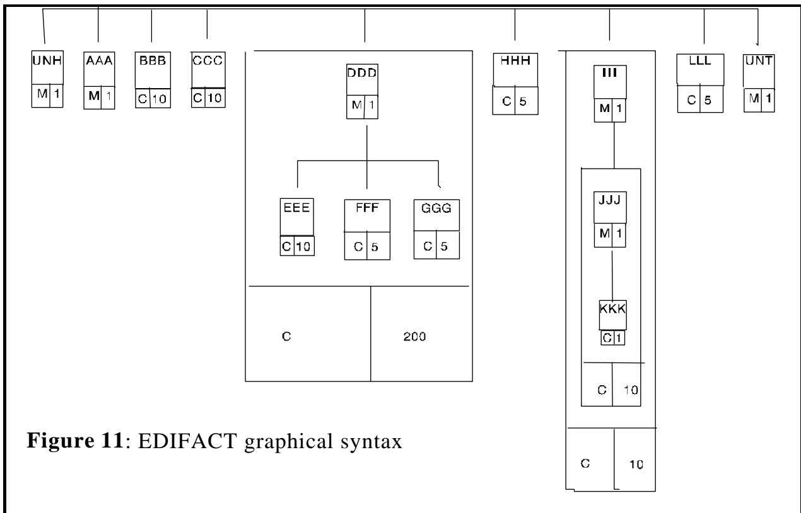

This approach comes closest to ASN.1, with a clear (graphical) notation for abstract syntax specification, and a separate encoding rule specification. An example of the Electronic Data Interchance For Administration, Commerce and Transport (EDIFACT) graphical syntax is given in Figure 11: EDIFACT graphical syntax. As with ASN.1, the definition of the total message can be done in conveniently sized chunks using reference names for the chunks, then those chunks are combined to define the complete message. So in Figure 11 we have the message fragment (defined earlier or later) "UNH" which is mandatorily present once, similarly "AAA", then "BBB" which is conditional and is present zero to ten times, then "CCC" similarly, then up to 200 repetitions of a composite structure consisting of one "DDD" followed by up to ten "EEE", etc.
这种表示方法最接近 ASN.1 标准。它拥有清晰的图形化表示法，用于描述抽象语法规范，同时也有独立的编码规则规范。例如，在图 11 中展示了 EDIFACT 的图形化语法示例。与 ASN.1 类似，整个消息可以被分解为多个大小适中的部分，每个部分都用参考名称来标识，然后将这些部分组合起来形成完整的消息。在图 11 中，我们可以看到这样一个消息片段：“UNH”，它必须出现一次；接着是“AAA”，它是条件性的，可能出现 0 到 10 次；然后是“BBB”，它也是条件性的，可能出现 0 到 10 次；再之后是“CCC”，同样如此。此外，还有多达 200 次重复出现的“DDD”和“EEE”组合结构。

The actual encoding rules were, as with ASN.1, specified separately, but were based on character encoding of all fields. The graphical notation is less powerful than the ASN.1 notation, and the range of primitive types much smaller. The encoding rules also rely on the application designer to ensure that a type following a repeated sequence is distinct from the type in that repeated sequence, otherwise ambiguity occurs. This is a problem avoided in ASN.1, where any legal piece of ASN.1 produces unambiguous encodings.
与 ASN.1 类似，这种编码规则也是单独规定的。不过，这些规则都是基于所有字段的字符编码来制定的。这种图形表示方式比 ASN.1 表示方式不够强大，而且基本类型的范围也小得多。此外，这种编码规则还依赖于应用程序设计者的判断，以确保一个在重复序列之后的类型与该重复序列中的其他类型是不同的。否则，就会产生歧义。而 ASN.1 则避免了这个问题，因为 ASN.1 中的任何合法元素都能产生明确的编码结果。

At the implementation level, it would be possible to map the EDIFACT definition into a datastructure for the implementation language, but I am not aware of any tools that currently do this.
在实施层面，可以将 EDIFACT 定义映射成某种实现语言的数据结构。不过，目前我没有看到有任何工具可以实现这一功能。

## 5.4 Use of BNF to specify a character-based syntax 5.4 使用 BNF 来指定基于字符的语法结构

This approach has been briefly described earlier, and is common in many Internet protocols.
这种方法的描述在前面已经简要提及过，它在许多互联网协议中都很常见。

Where this character-based approach is employed, the precise set of lines of text permitted for each message has to be clearly specified. This specification is akin to the definition of an abstract syntax, but with more focus on the representation of the information on the line than would be present in an ASN.1 definition of an abstract syntax.
当采用这种基于字符的方法时，必须明确指定每条消息允许使用的文本行数。这种规定类似于抽象语法定义，但更侧重于对每行信息的表示方式，而不是像 ASN.1 抽象语法定义那样只关注语法结构。

The notation used to define this syntax is usually some variation of a notation frequently used to define the syntax of programming languages (and indeed used to define the syntax of ASN.1 itself), something called Bacchus-Naur Form (BNF), named after its original inventors.
用于定义这种语法的符号通常是一种常用于定义编程语言语法的符号形式（实际上，这种符号形式也被用来定义 ASN.1 的语法）。这种符号形式被称为“巴克斯-诺尔形式”（Bacchus-Naur Form，简称 BNF），其名称来源于最初发明这种符号形式的人的名字。

For example, in ASN.1, the BNF statements:
例如，在 ASN.1 标准中，BNF 语句包括：

```autohotkey
EnumeratedType ::= ENUMERATED { Enumeration }
Enumeration ::= NamedNumber |
    Enumeration, NamedNumber
NamedNumber ::= identifier(SignedNumber)
SignedNumber ::= number | - number 
```

are used to specify that one of the constructs of the language consists of the word “ENUMERATED”, followed, in curly brackets, by a comma-separated list with each item being an identifier followed by a number (possibly preceded by a minus sign) in round brackets.
这些符号用于指定该语言中的一种构造方式，即由一个单词“ENUMERATED”开头，后面跟着一个由逗号分隔的列表，列表中的每个元素都是一个标识符，后面还跟着一个圆括号中的数字（可能前面还有一个减号）。

Unfortunately, there are many variations of BNF in use today, and most applications employing it find it necessary to define their own particular BNF notation. This makes it more difficult than it should be to use common tools to support BNF-based specifications.
不幸的是，目前存在许多不同的 BNF 规范版本。大多数使用 BNF 的应用程序都觉得有必要自行定义特定的 BNF 表示方式。这就使得使用通用工具来支持基于 BNF 的规范变得更加困难。

BNF is a relatively low-level notational support tool. It is very powerful for defining arbitrary syntactic structures, but it does not in itself determine how variable length items are to be delimited or iteration counts determined. Even where the same BNF notation is employed, the "look-and-feel" of two protocols defined in this way can still be very different, as the means of terminating strings (quotation marks, reserved characters, reserved characters with escapes) or of variable length repetitions of items, have to be written into the specific application using the BNF notation for this definition.
BNF 是一种相对低级的符号支持工具。它在定义任意语法结构方面非常强大，但本身并不决定如何界定可变长度的元素或确定迭代次数。即使使用相同的 BNF 表示法，以这种方式定义的两个协议在“外观”上仍然可能有很大差异。因为如何终止字符串的循环（使用引号、保留字符、带转义的保留字符），或者如何对可变长度的元素进行重复处理，都需要通过 BNF 表示法具体写入相应的应用说明中。

Of course, as with any tool, if the design is a good one, a good result can come out. Many of the Internet protocol designs take this approach, and the best designers ensure that the way in which length and iteration terminations are achieved follows as closely as possible the approach taken in other related specifications, and is consistent for different fields and commands within that application.
当然，就像任何工具一样，如果设计得当，就能得到良好的效果。许多互联网协议的设计都采用了这种思路。优秀的设计师会确保长度和迭代终止的处理方式尽可能遵循其他相关规范中的做法，并且这种处理方式在应用程序的不同领域和命令中保持一致性。

Software tools to support BNF-based specifications are usually restricted to lexical analysis of an incoming string, and generally result in the application-specific code and encoding matters being more closely intertwined than would normally be the case if an ASN.1 tool was used.
用于支持基于 BNF 的规范的软件工具通常仅限于对输入字符串的词汇分析工作。因此，这些工具所生成的特定应用代码和编码细节往往比使用 ASN.1 工具时更为紧密地结合在一起。

Identification fields for lines in the messages tend to be relatively long names, and "enumerations" also tend to use long lists of names, so the resulting protocol can be quite verbose. In these approaches, length fields are normally replaced by reserved-character delimiters, or by end-of-line, often with some form of escape or extension mechanism to allow continuation over several lines (again these mechanisms are not always the same for different fields or for different applications).
消息中行的标识字段通常包含相对较长的名称，而“枚举”操作也常常需要使用长列表来列出名称。因此，由此产生的协议文本可能会相当冗长。在这种情况下，长度字段通常会被用保留字符分隔符来代替，或者使用行尾标记来表示数据的结束。此外，还需要某种形式的转义或扩展机制，以便能够在多行中继续输入数据（不过，不同字段或不同应用场景下所使用的机制并不完全相同）。

In recent years there has been an attempt to use exactly the same BNF notation to define the syntax for several Internet protocols, but variations still ensue.
近年来，人们试图使用完全相同的 BNF 表示法来定义几种互联网协议的语法，不过仍然存在各种差异。

At implementation-time, a sending implementation will typically hard-wire the encoding as a series of "PRINT" statements to print the character information directly onto the line or into a buffer. On reception, a general-purpose tool would normally be employed that could be presented with the BNF specification and that would parse the input string into the main lexical items. Such tools are available without charge for Unix systems, making it easy for implementations of protocols defined in this way to be set as tasks for Computer Science students (particularly as the protocol specifications tend also to be available without charge!).
在实现过程中，发送方通常会将编码过程硬编码为一系列“PRINT”语句，从而将字符信息直接打印到行内或缓冲区中。而接收方则通常需要使用一种通用工具，该工具能够根据 BNF 规范来解析输入字符串，并将其转换为主要的词汇项。这类工具在 Unix 系统上可以免费使用，因此以这种方式定义的协议实现很容易成为计算机科学专业学生的练习内容（尤其是因为协议规范通常也可以免费获取！）。

In summary then, this approach can work well if the information to be transferred fits naturally into a two-level structure (lines of text, with an identifier and a list of comma-separated text parameters on each line), but can become complex when a greater depth of nesting of variable numbers of iterated items becomes necessary, and when escape characters are needed to permit commas as part of a parameter. The approach also tends to produce a much more verbose encoding than the binary approach of ASN.1 BER, and a very much more verbose encoding than the ASN.1 Packed Encoding Rules (PER).
总结来说，这种方法在需要传输的信息能够自然地被组织成两级结构时效果很好（即每行包含一个标识符以及由逗号分隔的文本参数）。但是，当需要更复杂的嵌套结构，或者需要使用转义字符来表示参数中的逗号时，这种方法就会变得复杂。此外，与 ASN.1 BER 的二进制编码方式相比，这种编码方式会生成更长的编码数据；而与 ASN.1 打包编码规则相比，其编码长度则更加冗长。

## 5.5 Specification and implementation using ASN.1 - early 1980s 5.5 使用 ASN1 进行规范定义与实现——20 世纪 80 年代初

ASN.1 was first developed to support the definition of the set of X.400 Message Handling Systems CCITT (the International Telegraph and Telephone Consultative Committee, later to be renamed ITU-T) Recommendations, although the basic ideas were taken from the Xerox Courier Specification.
ASN.1 最初是为了支持 X.400 消息处理系统的定义而开发的，这些系统属于 CCITT（国际电报电话咨询委员会，后来更名为 ITU-T）的规范。虽然 ASN.1 的基本理念源自于 Xerox 快递规范。

X.400 was developed by people with a strong application interest in getting the semantics of the information flows for electronic messaging right, but with relatively little interest in worrying about the bit-level encoding of messages. It was clear that they needed more or less the power of data-structure definition in a high-level programming language to support their specification work, and ASN.1 was designed to provide this.
X.400 标准是由那些非常关注如何明确信息流语义的人所开发的，不过他们对于消息的位级编码则不太关心。显然，他们需要一种高级编程语言中的数据结构定义功能来支持他们的规范工作。而 ASN.1 正是为提供这种功能而设计的。

Of course, notation closer to an actual programming language could have been used, but this would not have made the application easy to implement for those who might be forced (for platform reasons) to use a different language. Moreover, whilst using an existing language might solve the notational problem, there would still be work needed to define encodings, as in-memory representations of data structures from even the same language on the same platform differed (and still differ today) from compiler-writer to compiler-writer.
当然，也可以使用更接近实际编程语言的表示方式来表示数据，但这并不会让应用程序更容易被那些因平台原因而不得不使用其他语言的人所实现。此外，虽然使用现有的编程语言可以解决表示问题，但仍然需要花费时间去定义各种编码方式，因为即使在同一平台上，同一语言下数据结构的内存表示方式也会因不同的编译器而有所差异。

So ASN.1 was produced, and was heavily used by X.400 and by many other ITU-T and ISO specifications, where its power and the freedom it gave to designers to concentrate on what mattered - the application semantics - was much appreciated. Later, ASN.1 became used in many telecommunications applications, and applications in specific business sectors (and most recently for SET - Secure Electronic Transactions).
于是，ASN.1 标准便诞生了。该标准被广泛应用于 X.400 协议以及许多其他 ITU-T 和 ISO 标准之中。其强大的功能以及为设计者提供的灵活性，使得人们非常青睐这一标准——因为这种设计理念能够让他们专注于真正重要的方面：应用程序的语义。后来，ASN.1 标准被应用于许多电信领域，同时也被应用于一些特定的商业领域（最近还被用于安全电子交易领域）。

In the early 1980s, the only ASN.1 tools around were simple syntax checkers to help the designers get the specification right. The encoding rules were the TLV-based BER described earlier, and implementation architectures tended to be similar to those used for the character command-line approach described earlier. That is to say, some routines were produced to generate the "T" and the "L" part of an encoding (and the "V" part for the primitive types such as integer and boolean), and the structure of the message was hard-wired into the implementation by repeated calls to these subroutines to generate T and L parts for transmission down the line. On reception, quite simple (and application-independent) parsing code could be written to take the input stream of nested TLV encodings and to produce a tree-structure in memory with the leaves of the tree containing encodings of primitive items like integers, booleans, character strings, etc. The application code would then "tree-walk" this structure to obtain the input values.
在 20 世纪 80 年代初，当时可用的 ASN.1 工具仅限于一些简单的语法检查工具，这些工具帮助设计者正确地编写规范。编码规则遵循之前提到的基于 TLV 的 BER 标准，而实现架构则类似于之前提到的基于字符的命令行方法。也就是说，会编写一些程序来生成编码中的“T”和“L”部分（对于整数、布尔值等原始类型，还会生成“V”部分）。消息的结构是通过反复调用这些子程序来硬编码到实现中的，从而生成用于后续传输的 T 和 L 部分。在接收数据时，可以编写一些简单的解析代码，从嵌套的 TLV 编码流中提取数据，并在内存中生成树形结构，其中叶节点包含整数、布尔值、字符串等原始类型的编码信息。然后，应用程序代码会遍历这个结构，以获取输入值。

Thus in these early days, the ASN.1 notation:
因此，在那些早期的时代，ASN.1 标记法就是这样使用的：

* Provided a powerful, clear and easy to use way of specifying information content of messages.
* 提供了一种强大、清晰且易于使用的方式来指定消息中的信息内容。

* Freed application designers from concerns over encoding.
* 让应用程序设计师不再担心编码问题。

Provided application-independent encoding making development of reusable code and sophisticated tools possible, although not instantly realised.
这种基于应用的编码方式使得可重复使用的代码和复杂工具的开发成为可能，虽然这种变革并非瞬间实现。

Gave implementors a set of encoding rules to implement that were not as verbose as the BNF-based approach, and no harder (but no easier either) to implement.
我们为实现者提供了一套编码规则，这些规则比基于 BNF 的方法更为简洁，同时实现起来也不比后者更难（但也不容易得多）。

## 5.6 Specification and implementation using ASN.1 - 1990’s 5.6 使用 ASN.1 进行规范定义与实现——20 世纪 90 年代的技术

It is of course still possible to produce an implementation of an ASN.1-based protocol without tools. What was done in the 1980s can still be done today. However, there is today great pressure to reduce the "time-to-market" for implementations, and to ensure that residual bugs are at a minimum. Use of tools can be very important in this respect.
当然，仍然可以不用工具就能实现基于 ASN1 的协议。在 20 世纪 80 年代所采用的方法，今天依然可以应用。不过，如今面临着减少实现项目的上市时间的要求，同时还需要确保代码中不存在已知的错误。在这方面，使用工具是非常重要的。

There are today two main families of ASN.1 encoding rules, the original (unchanged) BER, and the more recent (standardised 1994) PER (Packed Encoding Rules). The PER encoding rules specification is more complex than that of BER, but produces very much more compact encodings. (For example, the encoding of a boolean value in PER uses only a single bit, but the TLV structure of BER produces at least 24 bits!)
目前，ASN 的编码规则主要有两大类：原始的 BER 编码规则，以及更为先进的 PER 编码规则（标准化于 1994 年）。PER 编码规则规范比 BER 要复杂一些，但能够生成更紧凑的编码方式。例如，在 PER 中，一个布尔值的编码仅使用一位比特；而 BER 的 TLV 结构则至少需要 24 位比特来编码！

There seems to be a "conventional wisdom" emerging that whilst encoding/decoding without a tool for BER is an acceptable thing to do if you have the time to spare, it is likely to result in implementation bugs if PER is being employed. The reader should again refer to Figure 999: Readers take warning!. This author would contend that there are implementation strategies that make PER encoding/decoding without tools a very viable proposition. Certainly much more care at the design stage is needed to correctly identify the field-widths to be used to encode various elements, and when padding bits are to be added (this comment will be better understood after reading the chapter on PER), but once that is done, hard-wiring a PER encode/decode into application code is still (this author would contend) possible.
似乎有一种“普遍看法”正在形成：如果时间充裕，那么不使用工具进行 BER 编码/解码是可行的做法。不过，如果采用 PER 编码/解码方式，则很可能会出现实现上的错误。读者应再次参考图 999：请注意这些警示！笔者认为，有一些实现策略可以使得在不使用工具的情况下进行 PER 编码/解码成为可能。当然，在设计阶段需要更加小心，以正确确定用于编码各种元素的字段宽度，以及何时添加填充位（在阅读了关于 PER 的章节之后，这一点会更容易理解）。不过，一旦这些问题解决了，仍然可以将 PER 编码/解码功能硬编码到应用程序代码中。

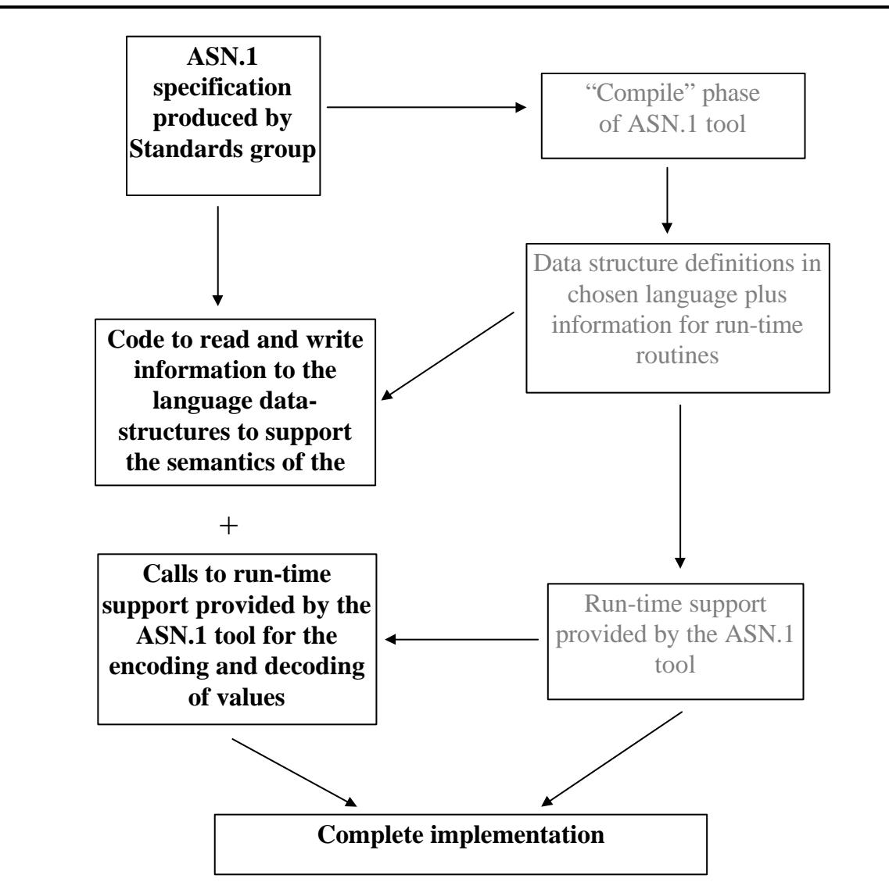

Figure 12: Use of an ASN.1 tool for implementation 图 12：使用 ASN.1 工具进行实现

Nonetheless, today, good tools, called "ASN.1 compilers", do exist, and for any commercial development they are good value for money and widely used. How would you implement an
不过，如今确实存在一些优秀的工具，被称为“ASN.1 编译器”。对于任何商业开发来说，这些工具都非常有价值，并且被广泛使用。那么，你该如何实现这些工具呢？

ASN.1 specification using a tool? This is covered more fully (with examples based on the "OSS ASN.1 Tools" package) in the last chapter of this section. However, the basic outline is as follows (see Figure 12).
使用工具来遵循 ASN.1 规范？这一点在本章的最后一节中有更详细的介绍（并给出了基于“OSS ASN.1 工具”包的示例）。不过，基本框架如下（参见图 12）。

The ASN.1 produced by the application designer is fed into the "compile phase" of the tool. This maps the ASN.1 into a language data-structure definition in any one of a wide range of supported languages (and platforms), including C, C++, and Java. The application code is then written to read and write values from these data-structures, concentrating solely on the required semantics of the application.
由应用程序设计师生成的 ASN.1 格式数据会被输入到工具的“编译阶段”。在这个阶段，ASN.1 会被转换为各种支持的语言（以及平台）的数据结构定义，这些语言包括 C、C++和 Java 等。之后，应用程序代码会被编写出来，以读取和写入这些数据结构中的值，从而专注于实现应用程序所需的语义功能。

When an encode is needed, a run-time routine is called which uses information provided by the compile phase about certain aspects of the ASN.1 definition, and which "understands" the way in which information is represented in memory on this platform. The run-time routine encodes the entire message, and returns the resulting octet string. A similar process is used for decoding. Any issues of big-endian or little-endian byte order (see 2.3 of Section III Chapter 4), or mostsignificant bits of a byte, are completely hidden within the encode/decode routines, as are all other details of the encoding rule specifications.
当需要编码时，会调用一个运行时例程。该例程利用编译阶段提供的关于 ASN 定义某些方面的信息，并“理解”该平台上信息在内存中的表示方式。运行时例程会对整个消息进行编码，然后返回最终的字节串。解码过程也采用类似的方法。任何关于大端序或小端序的字节顺序问题（详见第 4 章第 III 节的 2.3 节），或者字节中的最高位等问题，都完全被隐藏在编码/解码例程之中，其他关于编码规则的细节同样也被隐藏了起来。

Of course, without using a tool, a similar approach of mapping ASN.1 to a language datastructure and having separate code to encode and decode that data-structure is possible, but is likely to be more work (and more error prone) than the more "hard-wired" approach outlined above. But with a tool to provide the mapping and the encode/decode routines, this is an extremely simple and fast means of producing an implementation of an ASN.1-based application.
当然，如果不使用专门的工具，也可以采用类似的方法：将 ASN.1 格式映射到一个语言数据结构中，然后编写独立的代码来编码和解码该数据结构。不过，这种方法可能会比上述“硬编码”的方法更加复杂，且更容易出错。而有了能够完成这种映射功能的工具，以及相应的编码/解码程序，那么就能以一种极其简单且快速的方式来实现基于 ASN.1 的应用程序了。

In conclusion then, using a tool, ASN.1 today:
综上所述，如今，我们可以使用工具来执行 ASN.1 编码的运算：

Provides a powerful, clear and easy to use way for protocol designers to specify the information content of messages.
为协议设计者提供了一种强大、清晰且易于使用的工具，以便他们能够指定消息中的信息内容。

Frees application designers from concerns over encoding, identification of optional elements, termination of lists, etc.
这让应用程序设计师无需再担心编码问题、可选元素的识别、列表的终止等问题了。

* Is supported by tools mapping the ASN.1 structures to those of the main computer languages in use today.
* 该系统得到了一些工具的支持，这些工具能够将 ASN 结构映射到当前主流计算机语言中的结构。

Enables implementors to concentrate solely on the application semantics without any concern with encoding/decoding, using applicationindependent run-time encode/decode routines producing bug-free encodings for all the ASN.1 encoding rules.
这使得实现者可以专注于应用程序的语义实现，而无需担心编码/解码方面的问题。通过使用与应用程序独立的运行时编码/解码机制，可以确保所有 ASN.1 编码规则都能得到无错误的编码结果。

## ASN.1 allows ASN.1 规范允许…

## Designers to concentrate on application semantics 设计师们应专注于应用程序的语义处理

Design without encodingrelated bugs and with compact encodings available
设计上没有与编码相关的错误，并且支持紧凑的编码方式。

Implementors to write minimum code to support the application - fast development
实施者需要编写尽可能少的代码来支持应用程序的运行——以实现快速开发。

Bug-free encode/decode with absence of interworking problems.
无故障的编码/解码功能，不存在相互协作方面的问题。