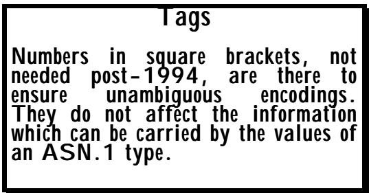
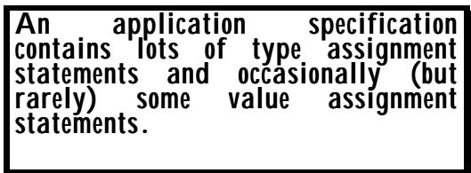

# Chapter 2 Introduction to ASN.1 第二章 引言：ASN.1 标准

(Or: Read before you write!) （或者：在写作之前先阅读一下！）

## Summary 总结：

The best way of learning any language or notation is to read some of it. This chapter presents a small example of ASN.1 type definitions and introduces the main concepts of:

学习任何语言或符号系统的最佳方式就是阅读相关的内容。本章将展示一些 ASN.1 类型定义的实际应用示例，并介绍其中的主要概念：

* built-in key-words, 内置关键词，
* construction mechanisms, 构建机制，
* user-defined types with type-reference-names, 使用带有类型引用名称的用户定义类型，
* identifiers or "field-names", 标识符或"字段名"，
* alternatives. 替代方案。

There is a reference to "tagging" which is discussed in more detail in Section II.

文中提到了"标记"这一概念，详细内容将在第二部分进行讨论。

This chapter is intended for beginners in ASN.1, and can be skipped by those who have already been exposed to the notation.

这一章节是为 ASN.1 领域的初学者准备的，对于已经了解相关符号表示法的人来说，可以跳过这部分内容。

## 1 Introduction 1 引言

Look at Figure 13. The aim here is simply to make sense of the data-structure it is defining - the information that transmission of a value of this structure would convey.

请看图 13。这里的目的是要理解该数据结构所代表的含义——即传递该结构中的值时所携带的信息。

Figure 13 is an "artificial" example designed to illustrate the features of ASN.1. It does not necessarily represent the best "business solution" to the problem it appears to be addressing, but the interested reader could try to invent a plausible rationale for some of its more curious features. For example, why have different "details" been used for "uk" and for "overseas" when the "overseas" case can hold any information the "uk" case can? Plausible answer, the "uk" case was in version 1, and the "overseas" was added later when the business expanded, and the designer wanted to keep the same bits-on-the-line for the "uk" case.

图 13 是一个"虚构"的例子，旨在展示 ASN.1 的特性。这个例子并不一定代表解决该问题的最佳方案，但感兴趣的读者可以尝试为一些奇特的特性找到合理的解释。例如，为什么在 "uk" 和 "overseas" 两种情况下使用不同的细节描述？明明 "overseas" 情况可以包含与 "uk" 相同的信息啊。一个合理的解释是："uk" 版本是初始版本，而 "overseas" 版本是在业务扩展后添加的，设计者希望保留 "uk" 版本的原有结构。

This example is built-on as this book proceeds, and the scenario for this "Wineco protocol" appears in Appendix 1 with the complete protocol in Appendix 2.

这个示例是在本书的后续内容中逐步展开的。关于 "Wineco 协议"的具体场景，请参见附录 1；而完整的协议内容则放在附录 2 中。

ASN.1 is not, of course, normally published in multiple fonts, but rather in just one font (Courier very often). We will return to that point later!

ASN.1 通常并不是以多种字体来发布的，而只是使用一种字体（最常见的是 Courier 字体）。我们稍后会再次讨论这个问题！

## 2 The Example 2 这个例子

Refer to figure 13 constantly! Note that the lines of four dots are not part of the ASN.1 syntax – they just mean that I have not completed that part of the specification.

请不断参考图 13！请注意，那些由四个点组成的线条并不属于 ASN.1 语法的一部分——它们仅仅表示我尚未完成那部分的规范编写工作。

```asn1
Order-for-stock ::= SEQUENCE {
    order-no      INTEGER,
    name-address  BranchIdentification,
    details       SEQUENCE OF SEQUENCE {
        item   OBJECT IDENTIFIER,
        cases  INTEGER
    },
    urgency       ENUMERATED {
        tomorrow  (0),
        three-day (1),
        week      (2)
    } DEFAULT week,
    authenticator Security-Type
}

.....

BranchIdentification ::= SET {
    unique-id OBJECT IDENTIFIER,
    details   CHOICE {
        uk        [0] SEQUENCE {
            name     VisibleString,
            type     OutletType,
            location Address
        },
        overseas  [1] SEQUENCE {
            name     UTF8String,
            type     OutletType,
            location Address
        },
        warehouse [2] CHOICE {
            northern  [0] NULL,
            southern  [1] NULL
        }
    }
}

.....

Security-Type ::= SET {
    .....
    .....
    .....
}
```

### 2.1 The Top-level Type 2.1 最高级别的类型

There is nothing in the example (other than that it appears first) to tell the reader clearly that "Order-for-stock" is the top-level type, the type whose values form the abstract syntax, the type which when encoded provides the messages that are transmitted by this application. In a real ASN.1 specification, you would discover this from human-readable text associated with the specification, or in post-1994 ASN.1 by finding a statement:

在示例中，没有任何内容能够清楚地表明 "Order-for-stock" 是顶层类型——也就是那些值构成了抽象语法结构的类型。在编码后，这种类型会生成该应用程序所传输的消息。在真实的 ASN.1 规范中，你会从与规范相关的可读文本中找到这一信息，或者可以在 1994 年之后的 ASN.1 规范中找到一个这样的声明来确认这一点：

```asn1
my-abstract-syntax ABSTRACT-SYNTAX ::= {
    Order-for-stock IDENTIFIED BY {
        joint-iso-itu-t international-organization(23) set(42) set-vendors(9) wineco(43) abstract-syntax (1)
} 
```

All application specifications contain a (single) ASN.1 type that defines the messages for that application. It will often (but need not) appear first in the specification, and is a good place to start reading!

所有应用规范都包含一个（唯一的）ASN.1 类型，该类型定义了该应用的消息格式。通常，这个类型会出现在规范的开头部分（不过也不是必须的），因此这里也是开始阅读规范的好地方！

This simply says that we are naming the abstract syntax "my-abstract-syntax", that it consists of all the values of the type "Order-for-stock", and that if it were necessary to identify this abstract syntax in an instance of computer communication, the value given in the third line will be used. This is your first encounter with a piece of ASN.1 called "an OBJECT IDENTIFIER value" (which you will frequently find in ASN.1 specifications). The whole of that third line is actually just equivalent to writing a string of numbers:

这仅仅表示，我们正在将这种抽象语法结构命名为 "my-abstract-syntax"。该结构由类型为 "Order-for-stock" 的所有值组成。如果在计算机通信中需要标识这种抽象语法结构，那么就会使用第三行中给出的值。这是你第一次接触到名为 "OBJECT IDENTIFIER value" 的 ASN.1 元素——这种元素在 ASN.1 规范中很常见。实际上，第三行中的所有内容都相当于一串数字而已：

$$
\left\{ \begin{array}{c c c c c c} 2 & 2 3 & 4 2 & 9 & 4 3 & 1 \end{array} \right\}
$$

But for now, lets ignore the OBJECT IDENTIFIER value and go back to the main example in figure 13.

不过，目前我们先忽略 OBJECT IDENTIFIER 的值，回到图 13 中的主要示例上来。

### 2.2 Bold is What Matters! 2.2 重要的是"粗体"样式！

The parts in bold are the heart of the ASN.1 language. They are reserved words (note that they mainly are all upper-case - case does matter in ASN.1), and reference built-in types or construction mechanisms. A later chapter goes through each and every built-in type and construction mechanism!

用粗体标出的部分就是 ASN.1 语言的核心部分。这些都是保留字（需要注意的是，这些词一律使用大写字母书写——在 ASN.1 中，字母大小写确实很重要）。这些保留字用于引用内置的类型或构造机制。在后面的章节中，我们会详细介绍每一种内置的类型和构造机制！

### 2.3 Names in Italics are Used to Tie Things Together 2.3 斜体字的部分用于将各个元素联系起来

The parts in italic are names which the writer has freely chosen to name the application's types. They usually carry a good hint to a human reader about the sort of information that type is intended to carry, but for a computer, their sole purpose is to link together different parts of the specification.

斜体部分都是作者自行选定的名称，用来指代应用程序的各种类型。对于人类读者来说，这些名称通常能提供一些关于某个类型所承载的信息类型的线索；但对于计算机而言，这些名称的唯一作用就是连接规范中的不同部分。

Most names present in a specification are either:

在规范中出现的名字，大多都是：

* names of built-in types or other built-in keywords (usually all upper case), or * 内置类型的名称或其他内置关键字（通常全部为大写字母），或者
* type-reference-names (mixed case, starting upper), or * 类型引用名称（采用混合形式的大小写，首字母大写），或者
* names of elements or alternatives in more complex types (mixed case, starting lower), or * 在更复杂的类型中，元素的名称或替代方案应以更复杂的格式排列（大小写混合、以较小的字母开头）
* (less commonly seen) value-reference-names (mixed case, starting lower), or * （较为少见）值引用名称（大小写混合，首字母小写）或
* names of enumerations (mixed case starting lower). * 枚举的名称（首字母为大写，后面随小写）。

So, for example, we have the type-reference-name "BranchIdentification" appearing in the third line of "Order-for-stock". This is legal if and only if somewhere else in the specification (in this case further down, but it could have been earlier) there is precisely one "type assignment" giving a type for "BranchIdentification". As far as a computer is concerned, the whole of the text following:

例如，我们在 "Order-for-stock" 的第三行看到这样的类型名称："BranchIdentification"。这种情况是合法的，当且仅当规范的其他地方（在这种情况下是更下面的行，但也可能更早出现）有且仅有一个"类型分配"操作，为 "BranchIdentification" 分配了一个类型。从计算机的角度来看，这一行之后的所有文本都是有效的。

```asn1
BranchIdentification ::=
```

starting with "SET", and up to the closing curly bracket matching the one following "SET", can be used to textually replace the type-reference-name "BranchIdentification" wherever it appears. The resulting ASN.1 would be unchanged. Of course, if "BranchIdentification" is referenced in many different places, we would then have multiple copies of the text of the associated type, which would be very error prone, and would make the specification hard to read, so use of type-reference-names in such cases is a "good thing". But that is a matter of style that is dealt with in a later chapter.

从 "SET" 开始，一直到与 "SET" 后面那个闭合花括号匹配的位置，这些字符可以用来替换类型名称 "BranchIdentification"。这样做并不会改变最终的 ASN.1 代码。当然，如果 "BranchIdentification" 在多个地方被引用，那么就会存在多个相关类型的文本副本，这很容易导致错误，也会使规范难以阅读。因此，在这种情况下使用类型名称是一种"好的做法"。不过，这只是一个风格问题，会在后面的章节中讨论。

### 2.4 Names in Normal Font are the Names of Fields/Elements/Items 2.4 用普通字体显示的那些名称，其实就是各个字段/元素/项目的名称

The names in normal font are again chosen arbitrarily by the application designer, and again are irrelevant to a computer, but help a human reader to understand the specification. They also provide a "handle" for human-readable text to clearly specify the semantics associated with the corresponding part of the specification.

那些用普通字体显示的名字，同样是由应用程序设计者随意选择的，这些名字对计算机本身来说并无实际意义，但它们有助于人类读者理解规范的内容。这些名字还为人类可读的文本提供了"标识"，从而能够清晰地说明与规范中相应部分相关的语义。

It may be helpful initially to think of the normal font words as the names of fields of a record structure, with the following bold or italic word giving the type of that field. The correct ASN.1 terminology is to say that the normal font words are either:

最初，可以将普通的字体单词视为记录结构中各个字段的名称。下面加粗或斜体的单词则表示该字段的类型。正确的 ASN.1 术语应该是：普通的字体单词要么是：

* naming elements of a sequence, * 指定序列中的元素名称
* naming elements of a set, * 命名一个集合中的元素，
* naming alternatives of a choice, or * 为某个选择提供不同的名称或替代方案，
* (in one case only) naming enumerations. * （仅在一个案例中）对枚举项进行命名。

If an ASN.1 tool is used to map the ASN.1 specification to a data-structure definition in a programming language, these normal font names are mapped to identifiers in the chosen language, and the application code can set or read values of the corresponding parts of the data-structure using these names.

如果使用了 ASN.1 工具将 ASN.1 规范映射成某种编程语言中的数据结构定义，那么这些普通的名称就会被映射成所选语言中的标识符。这样一来，应用程序代码就可以使用这些标识符来设置或读取数据结构中相应部分的数值。

The alert reader - again! - will immediately wonder about the length of these names, and the characters permitted in them, and ask about any corresponding problems in doing a mapping to a given programming language. These are good questions, but will be ignored for now, except to say that all ASN.1 names can be arbitrarily long, and are distinct even if they differ only in their hundredth character, or even their thousandth (or later)! Quite long names are fairly common in ASN.1 specifications.

那位敏锐的读者又会立刻思考这些名称的长度问题，以及其中允许的字符数量，还会考虑在将名称映射到某种编程语言时可能遇到的任何问题。这些都是很好的问题，不过目前可以忽略它们。不过需要指出的是，所有的 ASN.1 名称都可以是任意长的，即使名称在第一百个字符或千个字符处有所不同，它们仍然是可以区分的！在 ASN.1 规范中，相当长的名称其实相当常见。

### 2.5 Back to the Example! 2.5 回到例子！

So ... what information does a value of the type "Order-for-stock" carry when it is sent down the line?

那么……当 "Order-for-stock" 这种类型的信息被传递到下游环节时，它携带了哪些信息呢？

"Order-for-stock" is a structure with a sequence of fields or "elements" (an ordered list of types whose values will be sent down the line, in the given order). The first field or element is called "order-no", and holds an integer value. The second is called "name-address" and is itself a fairly complex type defined later, with a lot of internal structure. The next top-level field is called "details", and is also a fairly complex structured field, but this time the designer, purely as a matter of style, has chosen to write out the type "in-line" rather than using another type-reference-name.

"Order-for-stock" 是一种由多个字段或"元素"组成的结构（即一系列按特定顺序排列的类型，其值会按照该顺序依次传递）。第一个字段或元素被称为 "order-no"，它包含一个整数值。第二个字段被称为 "name-address"，它本身是一个相当复杂的类型，包含许多内部结构。下一个顶层字段被称为 "details"，同样也是一个结构复杂的字段。不过，这次设计者出于风格考虑，选择将类型定义直接写在字段中，而不是使用其他类型名称来引用它。

This field is a "SEQUENCE OF", that is to say, an arbitrary number of repetitions of what follows the "SEQUENCE OF" (could be zero). There is ASN.1 notation to require a minimum or maximum number of repetitions, but that is not often encountered and is left to later.

这个字段表示的是"一系列重复操作"，也就是说，会进行任意次数的"一系列重复操作"（也可以为零）。不过，有 ASN.1 语法可以用来指定重复操作的最小或最大次数，但这种情况并不常见，因此这里不赘述。

What follows is another "SEQUENCE", binding together an "OBJECT IDENTIFIER" field called "item" and an "INTEGER" field called "cases". (Remember, we are ordering stocks - cases - of wine!). So the whole of "details" is arbitrarily many repetitions of a pair of elements - an object identifier value and an integer value.

接下来是一个新的"序列"，它包含了一个名为 "item" 的对象标识符字段，以及一个名为 "cases" 的整数字段。记住，我们是在对葡萄酒的库存进行编号——也就是对"案例"进行编号而已。因此，"details" 这一整部分实际上是由重复出现的两个元素构成的：一个对象标识符值和一个整数值。

You already met object identifier values when we discussed identification of the abstract syntax for this application. Object identifiers are world-wide unambiguous names. Anybody can (fairly!) easily get a bit of the object identifier name space, and these identifiers are frequently used in ASN.1-based applications to name a whole variety of objects. In the case of this example, we use names of this form to identify an "item" (in this case, the "item" is probably some stock item - identification of a particular wine). We also see later that the application designer has chosen to use identifications of this same form in "BranchIdentification" to provide a "unique-id" for a branch.

在之前讨论该应用的抽象语法识别时，你已经了解过对象标识符的值。对象标识符是全球范围内唯一且明确的名称。任何人都可以轻松获取这些标识符的名称，而在基于 ASN.1 的应用中，这些标识符常被用来为各种对象命名。在这个例子中，我们使用这种形式的名称来标识一个"项目"（这里指的是某种库存物品，比如特定品牌的葡萄酒）。后来我们还看到，应用设计者选择使用同样的形式来为 "BranchIdentification" 提供分支的"唯一标识"。

Following the "details" top-level field, we have a field called "urgency" which is of the built-in type "ENUMERATED". Use of this type name requires that it be followed by a list of names for the enumerations (the possible values of the type). In ASN.1, but not in most programming languages, you will usually find the name followed by a number in round brackets, as in this example. These numbers were required to be present up to 1994, but can now be automatically assigned if the application-designer so desires. They provide the actual values that are transmitted down the line to identify each enumeration, so if the "urgency" is "deliver it tomorrow", what is sent down the line in this field position is a zero. (The reason for requiring the numbers to be assigned by the designer in the early ASN.1 specifications is discussed later, but basically has to do with trying to avoid interworking problems if a version 1 specification has an extra enumeration added in version 2 - extensibility again!)

在"细节"这一顶级字段之后，还有一个名为"紧急程度"的字段。该字段属于内置类型 "ENUMERATED"。使用这种类型名称时，需要在其后列出该枚举类型中的各个可能值。在 ASN.1 中，与大多数编程语言不同，你通常会看到类型名称后面跟着一个数字，就像这个例子一样。这些数字在 1994 年之前是必需的，但现在如果应用程序设计者愿意的话，可以自动分配这些数字。这些数字实际上代表了后续传输到系统以识别每个枚举值的实际数值。例如，如果"紧急程度"为"明天送达"，那么这个字段中传输的数字就应该是 0。之所以要求设计者手动分配这些数字，是因为在早期的 ASN.1 标准中是有这个要求的。关于 1 版本的规范将在后面讨论，但基本上关键在于避免互操作性问题——如果 1 版本的规范在 2 版本中增加了额外的枚举项，那么就需要实现可扩展性了！

Again, the "urgency" field has a feature not found in programming language data-structure definition. We see the keyword "DEFAULT". What this means for the Basic Encoding Rules (BER - the original ASN.1 Encoding Rules) is that, as a sender's option, that field need not be transmitted if the intended value is the value following the word "DEFAULT" - in this case "week". This is an example where there is more than one bit-pattern corresponding to a single abstract value - it is an encoders option to choose whether to encode a "DEFAULT" value or not. For the later Packed Encoding Rules, the encoder is:

同样，"urgency" 字段有一个在编程语言的数据结构定义中不存在的特性。我们看到有一个关键词 "DEFAULT"。这对基本编码规则（BER——原始的 ASN.1 编码规则）意味着，作为发送方的一个选项，如果预期的值就是 "DEFAULT" 后面的那个值——在本例中就是 "week"，那么就可以不传输这个字段。这是一个存在多个位模式对应同一个抽象值的例子——编码器可以选择是否对 "DEFAULT" 值进行编码。对于后续的打包编码规则来说，编码器可以：

> **Keyword DEFAULT:** Identifies a default value for an element of a SEQUENCE or SET, to be assumed if a value for that element is not included.
>
> **关键词 DEFAULT：** 用于指定 SEQUENCE 或 SET 中某个元素的默认值。当该元素的某个值未提供时，就会使用此默认值。
>
> **Keyword OPTIONAL:** Identifies an element for which a value can be omitted. Omission carries different semantics from any normal value of the element.
>
> **关键词 OPTIONAL：** 表示某个元素可以省略其值。与该元素的一般值相比，省略这个值具有不同的语义含义。

required to omit this simple field if the value is "week", and the decoder assumes that value. (If "urgency" had been a more complex data type the situation is slightly different, but that is a matter for Section III.)

如果字段的值为 "week"，则必须省略这个字段；解码器会假设这个值是 "week" 这个值。如果 "urgency" 是一个更复杂的数据类型，情况会略有不同，但这个问题属于第三节的内容。

There is another ASN.1 keyword similar to "DEFAULT", namely "OPTIONAL" (not included in the example in figure 13). Again, the meaning is fairly obvious: the field can be omitted, but there is no presumption of any default value. The key-word might be associated, for example, with a field/element whose name was "additional-information".

还有另一个与 "DEFAULT" 类似的 ASN.1 关键字，即 "OPTIONAL"（如图 13 中的示例所示并未包含）。同样，其含义相当明确：该字段可以省略，但不存在任何默认值的假设。这个关键字可能会与某个名为"附加信息"的字段/元素相关联。

Just to return briefly to the question of "What are the precise set of abstract values in the type?", the answer is that the presence of DEFAULT does not change the number of abstract values, it merely affects encoding options, but the presence of OPTIONAL does increase the number of abstract values - an abstract value with an optional field absent is distinct from any abstract value where it is present with some value, and can have different application semantics associated with it.

再次简要回到"类型中究竟包含哪些具体的抽象值？"这个问题，答案是：DEFAULT 的存在并不会改变抽象值的数量，它只会影响编码选项；而 OPTIONAL 的存在则会增加抽象值的数量——当一个抽象值没有可选字段时，它与其他具有可选字段的抽象值是不同的，而且这种抽象值还可以具有不同的应用语义。

Finally, in "Order-for-stock", the last element is called "authenticator" and is of some (possibly quite complex) type called "Security-Type" defined by the application designer either before or after its use in "Order-for-stock". It is shown in figure 13 as a "SET", with the contents not specified in the example (in a real specification, of course, the contents of the "SET" would be fully-defined). "SET" is very similar to "SEQUENCE". In BER (the original ASN.1 encoding rules), it again signals a senders (encoders) option. The top-level elements (fields) of the SET, instead of being transmitted in the order given in the text (as they are for SEQUENCE) are transmitted in any order that is convenient for the sender/encoder. Today, it is recognised that encoder options are a "BAD THING" for both security reasons and for the extra cost they impose on receivers and particularly for exhaustive testing, and there are many who would argue that "SET" (and the corresponding "SET OF") should never be used by application designers, and should be withdrawn from ASN.1! But please refer to Figure 999 again!

最后，在 "Order-for-stock" 中，最后一个元素被称为 "authenticator"，其类型称为 "Security-Type"，该类型由应用程序设计者在使用 "Order-for-stock" 之前或之后定义。如图 13 所示，"SET" 中的元素并未在示例中明确说明（当然，在真实的规范中，"SET" 中的元素都是完全定义好的）。"SET" 与 "SEQUENCE" 非常相似。在 BER 编码标准中（原始的 ASN.1 编码规则），"SET" 同样表示发送方（编码器）的选择。与 "SEQUENCE" 不同，SET 中的顶层元素（字段）并不是按照文本中指定的顺序进行传输，而是按照发送方/编码器认为合适的方式进行传输。如今，人们已经认识到，使用编码器选项是一种"糟糕的做法"，因为从安全性和成本考虑来看，这种做法都会给接收方带来额外的负担，而且还会增加测试的工作量。许多人认为，应用程序设计者根本不应该使用 "SET" 这个词汇，甚至应该将其从 ASN.1 标准中删除！不过，请再次参考图 999 吧！

Figure 13 shows "Security-Type" being defined later in the specification, but actually, this is precisely the sort of type that is more likely to be imported by an application designer from some more specialised ASN.1 specification that defines types (and their semantics) designed to support security features.

图 13 展示了"安全类型"的定义位置位于规范的后期部分。但实际上，这种类型正是应用程序设计者从一些更为专业的 ASN.1 规范中导入的类型——这些规范定义了旨在支持安全功能的类型及其语义。

There are mechanisms in ASN.1 (discussed later) to enable a designer to reference definitions appearing in other specifications, and these mechanisms are often used. You will, however, also find that some application designers will copy definitions from other specifications, partly to make their own text complete without the need for an implementor to obtain (perhaps purchase!) additional texts, partly to ensure control over and "ownership" of the definition. If you are using this book with a colleague or as part of some course, you can have an interesting debate over whether it is a good thing to do this or not!

在 ASN.1 中，存在一些机制，使得设计者能够引用其他规范中的定义。这些机制通常被广泛应用。不过，你也可能会发现，一些应用程序设计者会复制其他规范中的定义，部分原因是为了让自己的代码更加完整，无需依赖实现者来获取额外的文本；部分原因则是为了能够掌控这些定义的"所有权"。

### 2.6 The BranchIdentification Type 2.6 分支识别类型

Now let us look briefly at the "BranchIdentification" type, which illustrates a few additional features of the ASN.1 notation. (For now, please completely ignore the numbers in square brackets in this definition. These are called "tags", and are discussed at the end of this chapter.)

现在，让我们简要了解一下 "BranchIdentification" 类型。这一类型展示了 ASN.1 表示法的一些额外特性。（目前，请完全忽略这个定义中括号里的数字。这些数字被称为"标签"，它们将在本章末尾进行讨论。）

This time it has been defined as a "SET", so in BER the elements are transmitted in any order, but we will take them in textual order.

这次，它被定义为一个"集合"，因此在 BER 中这些元素可以以任意顺序传输，但实际上我们会按照文本顺序来排列它们。

As an aside (but an important aside), we have already mentioned in Chapter 1 that BER uses a TLV type of encoding for all elements. Clearly, if the sender is able to transmit the elements of a "SET" in any order, the value used for the "T" in the TLV of each element has to be different. (This would not be necessary for SEQUENCE, unless there are OPTIONAL or DEFAULT elements whose presence or absence had to be detected). It is this requirement that gives rise to the "tag" concept introduced briefly below, and covered more fully later.

顺便提一下（但这确实是一个重要的细节），我们在第一章中已经提到，BER 对所有元素都采用了 TLV 类型的编码方式。显然，如果发送方能够以任意顺序传输"集合"中的各个元素，那么每个元素的 TLV 中的"标签"值就必须各不相同。（对于序列来说，这种情况并不适用，因为可能需要判断是否存在可选元素或默认元素。）正是这一需求催生了下面将要简要介绍、随后会进一步详细讨论的"标签"概念。

The first listed element is "unique-id", an "OBJECT IDENTIFIER" value, which has already been discussed. The only other element is "details". Notice that the name "details" was also used in "Order-for-Stock". This is quite normal and perfectly legal - the contexts are different.

第一个列出的元素是 "unique-id"，它是一个"对象标识符"值，这一点已经过讨论。另一个元素是 "details"。注意，"details" 这个名称也在 "Order-for-Stock" 中出现过。这是很正常的现象，完全符合规定——因为上下文不同而已。

It is usual for application designers to use distinct names for top-level elements in a SEQUENCE or SET, but it was not actually a requirement prior to 1994. It is now a requirement to have distinct names for the elements of both "SEQUENCE" and "SET" (and for the alternatives of a "CHOICE" - see below). The requirement was added partly because it:

通常，应用程序设计者会使用不同的名称来标识序列或集合中的顶层元素。不过，在 1994 年之前，这并不是强制性的要求。现在，无论是"序列"还是"集合"中的元素，都需要使用不同的名称来标识（对于"选择"类型的元素也是如此——详见下文）。这一要求的添加部分是因为：

> **Names of elements and alternatives:** Should all be distinct within any given SEQUENCE, SET, or CHOICE (a requirement post-1994).
>
> **元素和替代方案的名称：** 在任何一个 SEQUENCE、SET 或 CHOICE 中，所有元素和替代方案的名称都必须是唯一的（这是 1994 年之后的要求）。

made good sense, but mainly because the ASN.1 notation for the values of a type could in some circumstances be ambiguous if this rule was not followed.

这个规则确实有一定的道理，主要是因为在某些情况下，如果不遵循这一规则，那么类型值的 ASN.1 表示方式可能会变得模糊不清。

Looking at "details": this is a "CHOICE", meaning that what goes in this field-position is one of a number of possible alternatives - in this case there are three possibilities: the "uk", "overseas", and "warehouse" alternatives. (Again, the alert reader will recognise that with the TLV approach used in BER, the "T" assigned to each of these alternatives has to be distinct if the receiver/decoder is to correctly determine which one is being transmitted.)

看一下 "details"：这里使用的是"选择"这一表述，意味着进入这个字段的选项只是众多可能性中的一种——在这种情况下，有三种可能性："英国"、"海外"以及"仓库"。（再次提醒，根据 BER 中使用的 TLV 方法，如果接收器/解码器能够准确识别出正在传输的是哪种选项，那么分配给这些选项的 "T" 就必须各不相同。）

The "uk" alternative is a "SEQUENCE" of three elements: a "name", a "type" and a "location". The latter two elements have type names in italics that are therefore presumably fairly complex, and will be defined earlier or later in the specification. They are not discussed further here. The "name" is a "VisibleString". This is one of a rather long list (about a dozen) of ASN.1 types which are "character strings" - strings of characters from some specified character repertoire. The names of these types are all mixed upper-lower case, and are one of the few exceptions (the types carrying calendar date and time are the other main exception) to the rule that built-in types in ASN.1 (names that cannot be re-defined by the user) are always entirely upper-case (like "INTEGER", "BOOLEAN", etc).

"uk" 替代方案由三个元素组成：一个"名称"、一个"类型"以及一个"位置"。后两个元素的类型名称采用斜体表示，因此可能相当复杂，具体定义将在规范的后续部分进行说明。这里不再进一步讨论这些元素。"名称"是一个 "VisibleString" 类型。这是众多 ASN.1 类型中的一种——这类类型都是"字符字符串"，即由特定字符集构成的字符串。这些类型的名称采用混合大小写形式，这是少数例外之一（携带日期和时间信息的类型才是主要的例外情况），因为 ASN.1 中的内置类型（即用户无法重新定义的名称）总是完全使用大写字母表示，比如 "INTEGER"、"BOOLEAN" 等。

Values of the "VisibleString" type are strings of printing ASCII characters, plus "space". Thus they are fine for UK or USA names, but would not cope well with other European countries, and very badly with names from other parts of the world!

"VisibleString" 类型的数值存储的是由打印用的 ASCII 字符组成的字符串，其中还包含"空格"。因此，这种格式适用于英国或美国的名字，但对于其他欧洲国家的名字则不太适用；而对于世界其他地区的名字来说，这种格式则完全不适用！

ASN.1 has many character string types providing support ranging from pure ASCII text through to text containing characters from any language in the world.

ASN.1 包含多种字符字符串类型，支持从纯 ASCII 文本到包含全球任何语言字符的文本。

By contrast, the "name" element for the "overseas" alternative has a type "UTF8String". If you are into character encoding schemes, you will have heard of UNICODE (and/or ISO 10646!) and UTF8! If you are not ... well, the area is discussed more fully later! Suffice it to say that "UTF8String" can contain characters from any of the languages of the world, but with the interesting property that if the characters just happen to be ASCII characters, the encoding is precisely ASCII!

相比之下，用于"海外"选项的 "name" 元素类型为 "UTF8String"。如果你了解字符编码方案的话，那么你对 UNICODE（以及 ISO 10646）和 UTF8 应该并不陌生吧！如果你不了解这些概念的话……嗯，这个话题后面会详细讨论的。简单来说，UTF8String 可以包含来自世界各种语言的字符，但有一个有趣的特点：如果这些字符恰好是 ASCII 字符的话，那么编码方式就仍然是 ASCII 格式！

The UTF8 encoding scheme for characters is relatively new, and was only added to ASN.1 in 1998. It can legally only be used if the application designer references the 1998 (or later) ASN.1 specification.

UTF8 字符编码方案相对较为新潮，直到 1998 年才被引入到 ASN.1 标准中。因此，只有当应用程序设计者引用 1998 年或之后的 ASN.1 规范时，才可以使用这种编码方式。


But ... - we have already noted that some restrictions were added in 1994 (names of elements of a "SEQUENCE", "SET" etc were required to be distinct, for example). Suppose you can't be bothered to upgrade your (300 pages long!) specification to conform to 1994 or later, but still want to use UTF8String in a new version? Well, legally, you CAN'T. ("Oh yeah?", you say, "What government has passed that law?", "Which enforcement agency will punish me if I break it?". I remain silent!) But as an implementor/reader, and if you see it happening, you will know what it means! Of course, as part of an application design team, you would make absolutely sure it did not happen in your specifications, wouldn't you?

但是……我们已经注意到，在 1994 年有一些限制被加入进来（例如，"序列"和"集合"等中的元素名称必须保持唯一）。如果你不愿意更新你的规范文件（长达 300 页！），以符合 1994 年或之后的标准，但仍然希望在新版本中使用 UTF8String 呢？那么，从法律上讲，你是无法这么做的。（"哦，是吗？"，你可能会说，"哪个政府通过了这条法律？"，"如果我违反了，哪个执法机构会来惩罚我？"）我保持沉默！不过，作为实施者或使用者，如果你看到这种情况发生，你就会明白这意味着什么了。当然，作为应用设计团队的一员，你肯定会确保这种情况不会在你的规范文件中出现，对吧？

Back to figure 13! The third alternative in the "details" is "warehouse", and this itself is another "CHOICE", with just two alternatives - "northern" and "southern" each with a type "NULL". What is "NULL"? "NULL" formally is a type with just a single value (which is itself perhaps confusingly called "NULL"). It is used where we need to have a type, but where there is no additional information to include. It is sometimes called a "place-holder". Note that in the "warehouse" case, we could just as well have used a BOOLEAN to decide "northern" v "southern", or an ENUMERATED. Just as a matter of style (and to illustrate use of "NULL"!) we chose to do it as a choice of NULLs.

回到图 13！在"细节"部分中的第三个选项就是"仓库"。而这个选项本身又包含另一个选项，即"北部"和"南部"，每个选项都有一个类型为"NULL"的选项。那么，"NULL"到底是什么呢？从形式上讲，"NULL"是一种只有单一值的类型（这个单一值本身可能被称为"NULL"）。当我们需要一个类型，但又没有其他额外信息需要包含时，就会使用"NULL"。有时它也被称作"占位符"。注意，在"仓库"这个例子中，我们完全可以使用 BOOLEAN 类型来区分"北部"和"南部"，或者使用 ENUMERATED 类型。不过，出于风格考虑（以及为了说明"NULL"的使用方式），我们选择将其表示为 NULL 的选择。

## 2.7 Those tags 2.7 那些标签

Now let's discuss the numbers in square brackets - the "tags". In post-1994 ASN.1, it is never necessary to include these numbers. If they would have been required pre-1994, you can (post-1994) ask for them to be automatically generated (called AUTOMATIC TAGGING), and need never actually include them. However, in existing published specifications, you will frequently encounter tags, and should have some understanding of them.

现在让我们来讨论一下方括号中的数字——这些数字实际上是一种"标签"。在 1994 年之后的 ASN.1 标准中，这些数字就无需再包含在内了。如果 1994 年之前需要这些数字，那么可以在之后要求自动生成这些数字（称为自动标签化），而无需实际去包含它们。不过，在现有的公开规范中，你经常会遇到这些标签，因此应该对它们有一定的了解。



In some of the very oldest ASN.1-based application specifications you will frequently find the keyword "IMPLICIT" following the tag, and occasionally today the opposite keyword "EXPLICIT". These qualify the meaning of the tag, and are fully described in Chapter 3.

在一些非常古老的基于 ASN.1 的应用程序规范中，你经常会看到"IMPLICIT"这个关键词出现在标签之后；而在现代规范中，则偶尔会出现相反的关键词"EXPLICIT"。这些关键词用于明确标签的含义，其详细内容可以在第 3 章中找到。

Why do we have tags? Remember the basic structure of BER: for a "SEQUENCE", there is a TLV for each element of the sequence; these are placed end-to-end to form the "V" part of an outer-level TLV. By default the "T" part of the TLV for any basic ASN.1 type such as "INTEGER" or "BOOLEAN" has a value that is specified in the ASN.1 specification itself, and the "T" part of the outer-level TLV for a "SEQUENCE" again has a value that is specified in the ASN.1 specification.

为什么我们需要标签呢？还记得 BER 的基本结构吧：对于一个"序列"，该序列中的每个元素都有一个 TLV 标签；这些标签首尾相连，从而构成了外部级 TLV 中的"V"部分。对于诸如"INTEGER"或"BOOLEAN"这样的基本 ASN.1 类型，其 TLV 的"T"部分默认会有一个在 ASN.1 规范中明确指定的值；而"序列"的外部级 TLV 的"T"部分同样也有一个在 ASN.1 规范中规定的值。

This means that by default, the encoding of the "northern" "NULL" and of the "southern" "NULL" will be identical - the receiver/decoder would not know which was sent. The encoding has violated the necessary and obvious rule that for each alternative of a "CHOICE" the "T" used for each alternative should be different. The purpose of the tag is to over-ride the default "T" value with a value specified in the tag. So with the example as written, the "northern" "T" contains zero, and the "southern" "T" contains one. Similarly, it is important to override the default tag on the outer-level "T" for at least one of the "uk" and "overseas" "SEQUENCE" encodings. (As a matter of style, we chose to over-ride both).

这意味着，默认情况下，"北方"版本的"NULL"与"南方"版本的"NULL"的编码是相同的——接收方/解码器无法区分究竟是哪个版本的数据被发送了。这种编码违反了一个显而易见的规定：对于每一个选项，所使用的"T"字符必须不同。这个标签的作用就是用标签中指定的值来覆盖默认的"T"值。因此，按照这个示例，"北方"版本的"T"包含零，而"南方"版本的"T"则包含一。同样，对于"uk"和"海外"这两个"SEQUENCE"编码格式，也需要覆盖默认的"T"值。（出于风格考虑，我们选择同时覆盖这两个值。）

A later section fully explains the rules about when tags have to be inserted. (Pre-1994, figure 13 would be illegal without at least some of the numbers in square brackets - the tags). The rules are "the minimum necessary to avoid ambiguity", and once that is understood, the reader will be able to remember the detailed rules easily enough. However, there is (normally) no penalty in overriding a default tag, and as a matter of style and of a "don't think about it, just do it!" philosophy, it is quite common to see (as in figure 13) tags sequentially assigned to each of the elements of every "CHOICE" construction, whether strictly necessary or not. Similarly (but not done in figure 13), it is also quite common (pre-1994) to see tags applied with sequential tag numbers to all elements of "SEQUENCE" and of "SET" constructions.

后面的部分详细解释了何时需要插入标签的规则。（在 1994 年之前，如图 13 所示，如果某些数字不在方括号中，那么整个图表就是不合法的——也就是需要添加标签的情况）。这些规则要求是"尽可能少，以避免产生歧义"。一旦理解了这些规则，读者就能轻松记住详细的规则了。不过，通常情况下，更改默认标签并不会受到惩罚。出于风格考虑，以及"不要思考，直接执行"的原则，通常会在每个"CHOICE"结构中，无论是否绝对必要，都会为每一个元素依次分配标签。同样地（不过在图 13 中并没有这样做），在 1994 年之前，也常见为"SEQUENCE"和"SET"结构中的所有元素分配连续的标签编号。

A final introductory comment: the above has implied that tags are just plain old numbers. In fact, the tag name-space, the value encoded in the "T" part of a TLV is slightly more complicated than that. You will sometimes find the key-words "APPLICATION" or "PRIVATE" or "UNIVERSAL" after the opening square bracket, for example:

最后一点说明：上面提到的只是将标签视为普通的数字而已。实际上，TLV 中的"T"部分所编码的标签名称及其值要复杂一些。例如，你有时会看到这样的格式：在尖括号之后，紧接着是"APPLICATION"、"PRIVATE"或"UNIVERSAL"这样的关键词。

$$
\text { Tagged - type }: := [ \text { APPLICATION 1 } ] \text { Order - For - Stock }
$$

These key-words define the "class" of the tag. In their absence, the "class" is so-called "contextspecific", which is by far the most common class of tag that is applied. Full details of tagging appears in Section II, Chapter 4.

这些关键词定义了标签的"类别"。如果缺少这些关键词，那么标签就会被称为"上下文特定的"，而这无疑是最常见的标签类别。关于标签的详细信息，请参阅第二章第四节。

## 3 Getting rid of the different fonts 3 去除不同的字体样式

Suppose you have a normal ASN.1-based application specification using a single font. How do you apply fonts as in figure 13?

假设你有一个基于 ASN.1 的标准应用程序规范，该规范使用单一字体。那么，如何像图 13 那样应用字体呢？

First, in principle, you need to know what are the reserved words in the language, including the names of the character string and the date/time types, and you make sure these become bold! In practice, you can make a good guess that any name that is all upper-case goes to bold, but this is not a requirement. The "Address" type-reference-name in figure 4 could have been "ADDRESS", and provided that change was made everywhere in the specification, the result is an identical and totally legal specification. But as a matter of style, all upper-case for type reference names is rarely used.

首先，原则上，你需要知道该语言中哪些是保留字，包括字符串类型和日期/时间类型的名称，并确保这些名称被加粗显示！在实际使用中，你可以猜测那些全是大写的名称应该被加粗处理，但实际上这并不是必须的。例如，图 4 中的"Address"类型引用名原本可以是"ADDRESS"。只要在整个规范中保持一致，那么最终的结果就是一个完全合法的规范。不过，从风格考虑，通常并不要求类型引用名一定要全部使用大写字母。

Any other name which begins with an initial upper case letter you set to italics - it is a type-reference-name. Type-reference-names are required to begin with an upper-case letter. After that they can contain upper or lower case interchangeably.

任何以大写字母开头的名称，如果设置为斜体，就被称为类型引用名称。类型引用名称必须以大写字母开头。之后，它可以包含大小写字母，但必须保持一致的格式。

You will see in figure 13 a mixture of two distinct styles. In one case a type-reference-name ("Order-for-stock") made up of three words separates the words by a hyphen. In another case a type-reference-name ("OutletType") uses another upper-case letter to separate the words, and does not use the hyphen. "Security-Type" uses both!

在图 13 中，你会看到两种不同风格的混合情况。在一种情况下，类型引用名称（"Order-for-stock"）由三个单词组成，这些单词之间用连字符连接。而在另一种情况下，类型引用名称（"OutletType"）则使用另一个大写字母来分隔单词，且不使用连字符。"Security-Type"则同时使用了这两种方式！

You normally don't see a mix of these three styles in a single specification, but all are perfectly legal. Hyphens (but not two in adjacent positions, to avoid ambiguity with comment - see below) have been allowed in names right from the first approved ASN.1 specification, but were not allowed by drafts prior to that first approved specification, so early writers had no choice, and used the "OutletType" style. Of course, nobody ever reads the ASN.1 specification itself - they just copy what everybody else does! So that style is still the most common today. It is, however, just that - a matter of style, and an unimportant one at that - all three forms are legal and it is a personal preference which you think looks neater or clearer.

通常在一个规范中不会同时看到这三种风格的组合，但实际上这三种风格都是完全合法的。从第一个获批的 ASN.1 规范开始，名字中就可以使用连字符（不过相邻的两个连字符是不允许的，以避免歧义——详见下文）。但在那个规范之前的一些草案中，连字符是不被允许的，所以早期的编写者别无选择，只能使用"OutletType"风格。当然，其实没人会阅读 ASN.1 规范本身——他们只是模仿其他人的做法而已！所以，那种风格至今仍然是最常见的。不过，这仅仅是一种风格问题，而且并不重要——这三种形式都是合法的，选择哪种形式取决于个人喜好，你觉得哪种看起来更简洁明了即可。

And finally, the normal font: most names starting with a lower-case letter are names of elements or alternatives ("order-no", "urgency", etc), and again such names are required to start with an initial lower-case letter, but can thereafter contain either upper or lower case.

最后，正常的字体格式是：以小写字母开头的名字通常代表某种元素或替代选项（如"order-no"、"urgency"等）。这类名字要求以小写字母开头的首字母开始，之后则可以包含大写或小写字母。

Names beginning with lower case are also required for the names of values. A simple example is the value "week" for the "urgency".

对于值的命名，也需要使用以小写字母开头的名称。一个简单的例子就是将"urgency"的值命名为"week"。

Application specifications can contain not only type assignment statements such as those appearing in figure 13 (and which generally form the bulk of most application specifications), but can also contain statements assigning values to "value-reference-names". The general form of a value reference assignment is illustrated below:

应用程序的规范中可能包含各种类型的赋值语句，比如图 13 中所示的那些语句（这些语句通常构成了大多数应用程序规范的主要部分）。此外，这些规范还可能包含用于将值赋给"值引用名"的语句。值引用赋值的通用形式如下所示：

$$
\text { my - default - cases INTEGER }: := 2 0
$$

which is defining the value-reference-name "my-default-cases", of type "INTEGER" to reference the integer value "20". It could then be used in the "cases" element in figure 13 as, for example:

这定义了一个值引用名称"my-default-cases"，其类型为"INTEGER"，用于引用整数值"20"。之后，这个值可以在图 13 中的"cases"元素中被使用，例如：

cases INTEGER DEFAULT my-default-cases

案例集合 整数类型 默认值为 my-default-cases

## 4 Tying up some lose ends 4 处理一些次要的、不太重要的问题

## 4.1 Summary of type and value assignments 4.1 类型赋值和值赋值的总结

First, let us summarise what we have seen so far. ASN.1 specifies a number of pieces of notation (type-notation) which define an ASN.1 type. Some are very simple such as "BOOLEAN", others are more complex such as that used to define an enumerated type or a sequence type. A type-reference-name is also a piece of type-notation that can be used wherever ASN.1 requires a piece of type-notation.

首先，让我们总结一下到目前为止我们所看到的内容。ASN.1 规定了多种类型表示法，这些表示法用于定义 ASN.1 类型。有些表示法非常简单，比如"BOOLEAN"；而有些则更为复杂，比如用于定义枚举类型或序列类型的表示法。类型引用名也是一种类型表示法，在 ASN.1 的任何需要类型表示法的地方都可以使用。



Similarly, ASN.1 specifies a number of pieces of value-notation (any type you can write with ASN.1 has a defined value-notation for all of its values). Again, some notations for values are very simple, such as "20" for integer values, others are more complex, such as the notation for object identifier values that you saw at the start of this chapter, or the notation for values of sequence types. Again, wherever ASN.1 requires value-notation, a value-reference-name can be used (provided it has been assigned a value somewhere).

同样，ASN.1 也规定了多种数值表示方式。使用 ASN.1 可以表示的任何类型，其所有数值都有对应的数值表示方式。有些数值表示方式非常简单，比如用"20"来表示整数值；而有些则更为复杂，比如本章开头提到的对象标识符值的表示方式，或者序列类型值的表示方式。只要 ASN.1 需要数值表示方式，就可以使用值引用名来表示数值（只要该名称在某个地方被赋予了数值）。

The general form of a type assignment is:

类型分配的一般形式如下：

$$
\text { type - reference - name } \quad : := \quad \text { type - notation }
$$

and of a value assignment is:

而关于值赋定的内容则是：

$$
\text { value - reference - name type - notation }: := \text { value - notation }
$$

where the value-notation has to be the "correct" value-notation for the type identified by the type-notation. This is an important concept. Anywhere in ASN.1 where you can use type-notation (for example to define the type of an element of a "SET" or "SEQUENCE", you can use any legal type-notation. However, where value-notation is allowed (for example, in value assignments or after DEFAULT), there is always a corresponding type-notation called the governor (which might be a type-reference-name) which restricts the syntax of the value-notation to that which is permitted for the type identified by the type-notation.

在 ASN.1 中，当需要使用类型标记所标识类型的"正确"表示法时，就必须采用这种表示法。这是一个非常重要的概念。在 ASN.1 的任何地方，只要可以使用类型标记（例如，用于定义"SET"或"SEQUENCE"中元素的类型），就可以使用任何合法的类型标记。然而，在允许使用值表示法的地方（例如，在值分配或 DEFAULT 之后），总会有一个对应的类型标记，称为"约束器"（它可能是一个类型引用名称），它会限制值表示法的语法，使其符合该类型标记所标识类型的规范。

So far, you have seen value notation used in the "IDENTIFIED BY" at the start of the chapter, and following the word DEFAULT. There are other uses that will be described later, but it remains the case that value-notation is used much less often than type-notation.

到目前为止，你已经看到在章节开头的"IDENTIFIED BY"语句中，以及出现在 DEFAULT 关键字之后时，会使用值表示法。虽然还有其他应用场景，但这些情况相对较少。总的来说，值表示法的使用频率远低于类型表示法。

## 4.2 The form of names 4.2 名称的形式

All names in ASN.1 are mixed upper/lower case letters and digits and hyphens (but not two adjacent or one at the end, to avoid confusion with comment), starting either with an upper case letter or with a lower case letter, depending on what the name is being used for. (As you will have guessed by now, they cannot contain the space character!) In every case of naming in ASN.1, the case of the first letter is fixed. If an upper-case letter is legal, a lower case letter will not be, and vice-versa. Names can be arbitrarily long, and are different names if they differ in either content or case at any position in the name.

在 ASN.1 中，所有的名称都是由大写/小写字母、数字和连字符组合而成的（但是不能有两个连续的连字符，也不能以连字符结尾，以避免引起混淆）。名称的起始字符可以是大写字母，也可以是小写字母，这取决于该名称的用途。正如你现在已经可以猜到的，这些名称不能包含空格字符！在 ASN.1 中，第一个字母的大小写是固定的：如果允许使用大写字母，那么就不会使用小写字母；反之亦然。名称可以任意长，如果名称中的任何位置的内容或大小写不同，那么这些名称就是不同的名称。

Note that because names can contain only letters and digits and hyphens, a name that is followed by any other character (such as an opening curly bracket or a comma), can have the following character adjacent to it with no space or new-line, or as a matter of purely personal style, one or more spaces or new-lines can be inserted.

请注意，因为名称只能包含字母、数字和连字符，所以如果一个名称后面跟着其他字符（如左括号或逗号），那么在其相邻的位置可以放置一个字符，而不需要空格或换行符。或者，出于个人风格考虑，也可以插入一个或多个空格或换行符。

## 4.3 Layout and comment 4.3 布局与注释

Layout is "free-format" - anywhere that you can put a space you can put a new-line. Anywhere you have a new-line you can remove it and just leave a space. So a complete application specification can appear as a single line of text, and indeed that is basically the way a computer sees it!

这种布局方式是"自由格式"的——只要能放置空格的地方，就可以放置换行符。同样，只要能放置换行符的地方，就可以移除换行符，只留下空格。因此，一份完整的应用程序说明可以呈现为一行文本，实际上，计算机看到的内容也正是这样的形式！

> **Names and layout:** Names contain letters, digits, or hyphens. They are arbitrarily long. Case is significant. Layout is free format. Comment starts with a pair of adjacent hyphens and ends with a pair of adjacent hyphens or a new-line.
>
> **名称与格式：** 名称由字母、数字或连字符组成，长度可以任意长。大小写字母是有区别的。格式采用自由格式。注释以一对相邻的连字符开始，并以另一对相邻的连字符或换行符结束。

As a matter of style, everybody puts a new line between each type or value assignment statement, and generally between each element of a set or sequence and the alternatives of a choice. The layout style shown in figure 13 is that preferred by this author, as it makes the pairing of curly brackets very clear, but a perhaps slightly more common layout style is to include the opening curly bracket after "SEQUENCE" on the same line as the key-word "SEQUENCE", for example:

从格式上讲，大家通常会在每种类型或值赋值语句之间，以及每个集合或序列的元素与选择项之间，都加上一条新的行。图 13 所示的格式是作者所偏爱的格式，因为这种方式能很好地体现圆括号的配对关系。不过，另一种更常见的格式是在"SEQUENCE"这个词之后，紧接着在同一行中加上开圆括号，例如：

```asn1
SEQUENCE { items OBJECT IDENTIFIER, cases INTEGER }
```

序列 { 项：对象标识符，类型：整数 }

Still other authors (less common) will put the closing curly bracket on a line of its own and align it vertically with its matching opening bracket. All pure (and utterly unimportant!) stylistic matters.

还有一些作者（比较少见）会将闭合的尖括号单独排在一行中，并且让它与对应的开放括号垂直对齐。这些都属于纯粹的风格问题而已，其实并不重要啦。

On a slightly more serious vein, there was pre-1994 value notation for the "CHOICE" type in the "BranchIdentification" that would allow:

稍微严肃一点来说，在 1994 年之前，对于"BranchIdentification"类型的"CHOICE"类型，存在一种数值表示方式，这种方式可以允许：

```asn1
details warehouse northern value-ref
```

详细信息仓库，北部区域，价值参考

as a piece of value notation (where "value-ref" is a value reference name for the "NULL" value). Remember that ASN.1 allows names to be used before they are assigned in a type or value assignment, and a poor dumb computer can be hit at the start of the specification with something looking like:

作为一种数值表示方式（"value-ref"是指"NULL"值的引用名称）。记住，ASN.1 允许在分配类型或值之前使用名称。在规范的开头，可能会遇到一些看起来像这样糟糕的、难以理解的代码：

In this case, it cannot determine where the first assignment ends - after "jack" or after "jill" or after "joseph" - it depends on the actual type of "Fred" - defined later). This can give a computer a hard time! Some of the early tool vendors could not cope with this (even tho' it probably never actually occurred!), and asked for the "semi-colon" character to be used as a statement separator in ASN.1. To this day, if you use these tools, you will need to put in semicolons between all your type assignments. (The "OSS ASN.1 Tools" package does not impose this requirement). The requirement to insert semi-colons in ASN.1 specifications was resisted, but to assist tool vendors a "colon" was introduced into the value notation for "CHOICE", so that post-1994 the above value notation would be written:

在这种情况之下，就无法确定第一个赋值点应该位于"jack"之后、还是"jill"之后，或者"joseph"之后了——这取决于"Fred"的实际类型（该类型会在后面定义）。这确实会给计算机带来麻烦！一些早期的工具供应商无法应对这种情况（尽管这种情况可能根本就没有发生过），因此他们要求在使用 ASN.1 时，将"分号"作为语句分隔符使用。直到今天，如果你使用这些工具，就必须在所有类型赋值之间插入分号。不过，"OSS ASN.1 工具"套件并不要求这样做。虽然人们反对在 ASN.1 规范中插入分号的做法，但为了帮助工具供应商，人们还是将"冒号"引入到"CHOICE"的值表示法中。因此，自 1994 年之后，上述值表示法的书写方式就变成了：

```asn1
details : warehouse : northern : value-ref
```

详细信息：仓库位置：北部；价值参考：ref

(With or without the spaces, but with the colon.) And (for example):

（无论是否加上空格，但一定要加上冒号。）例如：

$$
\text { joe Fred }:: := \text { jack }: \text { jill joseph Mary }:: := \text { etc etc }
$$

has the end of the first assignment after "jill", whilst:

在"jill"之后，第一个任务就结束了。而：

$$
\text { joe Fred }:: := \text { jack }: \text { jill: joseph Mary }:: := \text { etc etc }
$$

has the end of the first assignment after "joseph". This is another small area where the 1994 specification imposed additional requirements not present pre-1994.

在"约瑟夫"之后，第一个任务就结束了。这是另一个需要遵循 1994 年规范的小区域，该规范提出了一些在 1994 年之前不存在的额外要求。

Comment can be inserted wherever spaces and new-lines are allowed. Comment begins with a pair of hyphens (with no space between them), and ends either on the first new-line or with another pair of hyphens. (This is the only case where "new-line" is different from other forms of whitespace.)

注释可以放在任何允许使用空格和新行的位置。注释以一对连字符开始（它们之间不需要空格），然后可以结束于第一个新行，或者以另一对连字符结束。（这是"新行"与其他空白字符不同的唯一情况。）

This is a perfectly good and consistent rule, but is not quite the same as that used for a certain well-known programming language, so take care! If you want a block of comment spread over several lines, you need a pair of hyphens at the start of each line.

这其实是一个非常合理且一致的规则，不过它与某种知名编程语言中的规则有所不同，因此需要注意哦！如果你希望将注释块分布在几行中，那么每行开头都需要加上两个连字符。

## 5 So what else do you need to know? 5 那么，你还需要知道些什么呢？

Really, you are now pretty well able to go away and read ASN.1 specifications! But as you have taken the trouble to obtain (perhaps you've even paid for!) this text, you will expect it to go on a bit further.

实际上，现在你已经有能力去阅读 ASN.1 规范了！不过，因为你已经花费了时间和精力来获取这份资料（也许你甚至还付了钱哦！），所以你应该会希望看到更多的内容吧。

In the next few chapters we look at the outer-level structure of an ASN.1-based application specification, and go through the various built-in types and construction mechanisms (like "SEQUENCE"), and the associated value notations. That text is boring! You will need to read it quickly!

在接下来的几章中，我们将探讨基于 ASN.1 的应用程序规范的外层结构。我们会了解各种内置类型、构建机制（如"序列"类型），以及相关的数值表示方式。这些内容可能有点枯燥！不过，你需要快速阅读这些内容哦！

This will complete all you need to read. Most of the ASN.1 that was produced prior to 1994, with the exception of a few less commonly used "advanced" features like sub-typing and mechanisms for "holes", which are left to Section II. Section II also contains most of the discussion of the "new" features that were introduced in 1994, and is important reading for anybody involved in writing application specifications.

这将完成您需要阅读的内容。在 1994 年之前产生的几乎所有 ASN.1 代码，除了一些较少使用的"高级"功能外，都包含在内了。这些"高级"功能包括子类型定义以及处理"空洞"的机制，这些内容被留到了第二部分中。第二部分还包含了关于 1994 年引入的"新"功能的详细讨论，对于负责编写应用程序规范的人来说，这部分内容非常重要。

Section I ends with a more detailed discussion of how to produce implementations using "ASN.1 compilers", and some further guidelines related to implementation.

第一部分最后详细讨论了如何使用"ASN.1 编译器"来生成实现，同时还提出了一些与实现相关的重要指导方针。
