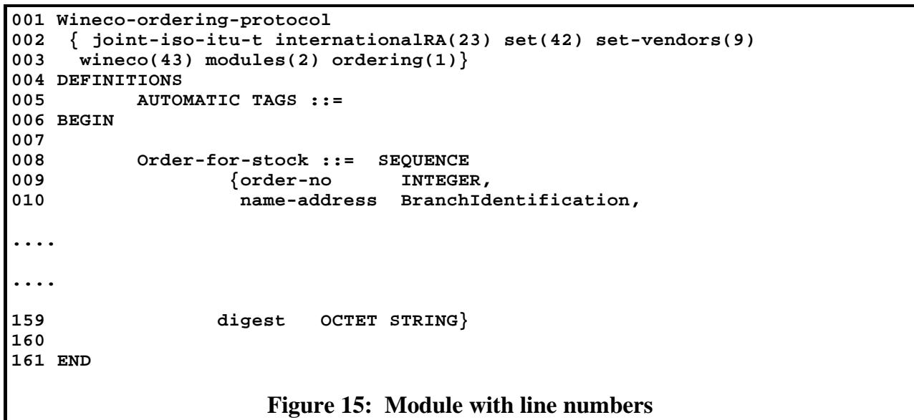
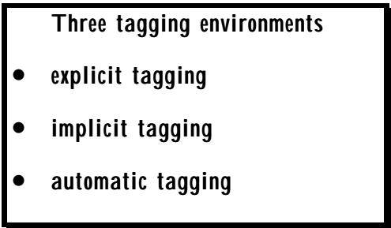
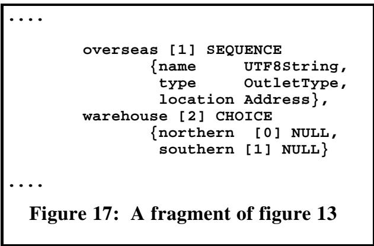

# Chapter 3 Structuring an ASN.1 specification 第三章 构建 ASN.1 规范的结构

(Or: The walls, floors, door-ways and lifts, with some environmental considerations!) （或者：墙壁、地板、门厅以及电梯等建筑构件，以及一些相关的环境考虑因素！）

## Summary: 总结：

ASN.1-based application specifications consist mainly of type definitions as illustrated in Section 1 Chapter 2, but these are normally (and are formally required to be) grouped into collections called modules. 基于 ASN.1 的应用规范主要包含类型定义，如第 2 章第 1 节所描述的那样。不过，这些定义通常会被归类到不同的模块中。

This chapter: 这一章：

• introduces the module structure, • 介绍了该模块的结构。

• describes the form of module headers, • 描述了模块头部的格式。

• shows how to identify modules, • 展示了如何识别各个模块。

• describes how to export and import type definitions between modules. • 描述了如何在不同的模块之间导出和导入类型定义。

The chapter also discusses: 本章还讨论了以下内容：

• some issues of publication format for a complete application specification, and • 关于完整应用规格的某些出版格式问题，以及…

• the importance of making machine-readable copy of the ASN.1 parts available. Part of the definition of a module is the establishment of: • 制作机器可读取的 ASN.1 部分副本的重要性。模块定义的一部分就是需要明确这些副本的可用性。

• a tagging environment, • 一个用于标记的环境，

• an extensibility environment • 一个具有可扩展性的环境

for the type-notations appearing in that specification. The meaning and importance of these terms is discussed in this chapter, with final details in Section II. 关于该规格书中出现的各种类型说明。这些术语的含义和重要性将在本章中讨论，具体细节则位于第二部分。

```txt
Modules
All ASN.1 type and value assignments are required to appear within a module, starting with a module header and ending with "END". 
```

## 1 An example 1 一个例子

The example we gave in figure 13 had one top-level type ("Order-for-stock"), and a number of supporting types, most of which we left incomplete. We will still leave the supporting types incomplete (and, indeed, will use three lines of four dots for the body of all the types to avoid repetition), but will now otherwise turn the example in Figure 我们在图 13 中给出的例子包含一个顶层类型（“Order-for-stock”），以及若干辅助类型。这些辅助类型我们大都未详细描述。我们仍会让辅助类型保持不完整状态（实际上，为了避免重复，我们会用三行四个点来表示所有类型的主体），但现在我们将继续展示图例中的例子。

```txt
Wineco-ordering-protocol
{joint-iso-itu-t internationalRA(23) set(42) set-vendors(9)
wineco(43) modules(2) ordering(1)}
DEFINITIONS
    AUTOMATIC TAGS ::=
BEGIN
    Order-for-stock ::= SEQUENCE
    { ....
    ....
    ....}
    BranchIdentification ::= SET
    { ....
    ....
    ....}
    Security-Type ::= SET
    { ....
    ....
    ....}
    OutletType ::= SEQUENCE
    { ....
    ....
    ....}
    Address ::= SEQUENCE
    { ....
    ....
    ....}
END
Figure 14: A complete single-module ASN.1 specification 
```

13 into a complete ASN.1 specification that follows the rules of the language, and that could be fed into an ASN.1 compiler tool. 将 13 个元素整合成一个遵循该语言规则的完整 ASN.1 规范，然后将其输入到 ASN.1 编译器工具中进行处理。

NOTE — The use of three lines of four dots used in figures 13 and 14 is not legal ASN.1! It is used in this book out of sheer laziness! In a real specification there would be a complete list of named and fullyspecified (directly or by type-reference-names) elements. In figure 14, it is assumed that no further typereference-names are used in the body of these types - they use only the built-in types of the language like INTEGER, BOOLEAN, VisibleString, etc. 注意——在图 13 和图 14 中，使用三行四个点的表示方式在合法的 ASN.1 标准中是不被允许的！在本书中之所以采用这种方式，纯粹是因为过于懒散而已。在真正的规范中，应该有一份完整的、包含所有命名且经过明确规定的元素列表。在图 14 中，假设这些类型的内部不再使用其他类型引用，而是仅使用语言内置的类型，如 INTEGER、BOOLEAN、VisibleString 等。

The complete specification is shown in figure 14. 完整的规格说明如图 14 所示。

This example forms what is called an ASN.1 module consisting of a six-line (in this - simple! - case) module header, a set of type (or value) assignment statements, and an "END" statement. This is the smallest legal piece of ASN.1 specification, and many early specifications were of this form - a single module. Today, it is more common for a complex protocol to be presented in a number of ASN.1 modules (usually within a single physical publication or set of Web pages). This is discussed further later. 这个例子构成了一个所谓的 ASN.1 模块。该模块由六行内容组成（在这个简单的情况下），其中包括一系列类型声明以及“END”语句。这是最基础的 ASN.1 规范单元。许多早期的规范都是采用这种形式的——即一个单独的模块。如今，复杂的协议通常会被分解为多个 ASN.1 模块，这些模块通常集中在一个物理出版物或一组网页中。这一点将在后面进一步讨论。

It is very common in a real publication for the module header to appear at the start of a page, for there then to be up to ten or more pages of type assignments (with the occasional value assignment perhaps), and then the END statement, which terminates the module. Normally there would be a page-break after the END statement in a printed specification, whether followed by another module or not. 在真实的出版物中，模块头出现在页面开头是很常见的现象。之后可能会有多达十页或更多的类型定义内容（偶尔也会出现值定义的段落）。接着是 END 语句，用来终止模块。通常在打印出来的规范文件中，END 语句之后会有一个页面分隔符，无论之后是否还有另一个模块。

But Figure 14 is typical of early ASN.1 specifications, where the total protocol specification was probably only a few pages of ASN.1, and a single self-contained module was used for the entire specification. 不过，图 14 代表了早期 ASN 规范的特点。在那个时代，整个协议规范可能只有几页的 ASN 代码，而且整个规范都是通过一个独立的模块来实现的。

Note that whilst the use of new-lines and indentation at the start of this example is what is commonly used, the normal ASN.1 rule that white-space and new-lines are interchangeable applies here too - the module header could be on a single line. 请注意，虽然在这个示例中通常会使用新行号和缩进格式，但实际上 ASN.1 规范中的规则是：空白字符和新行是可以互换使用的——因此，模块头信息完全可以放在同一行上。

We will look in detail at the different elements of the module header later in this chapter, but first we discuss a little more about publication style. 在本章的后面部分，我们将详细探讨模块头文件中的各个元素。但在那之前，我们先来进一步讨论一下出版风格的相关内容。

## 2 Publication style for ASN.1 specifications 2. ASN.1 规范的公报格式

Over the years, different groups have taken different approaches to the presentation of their ASN.1 specifications in published documents. Problems and variation stem from conflicting desires: 多年来，不同的团队在公开文档中呈现其 ASN.1 规范时采用了不同的方法。这些问题的产生源于各种不同的需求：

a) A wish to introduce the various ASN.1 types that form the total specification gradually (often in a "bottom-up" fashion), within normal human-readable text that explains the semantics of the different types and fields. a) 希望逐步引入各种 ASN.1 类型，并将这些类型完整地描述出来（通常采用“从下到上”的呈现方式），同时将这些描述放在正常的人类可读的文本中，以便人们能够理解不同类型和字段的含义。

b) A wish to have in the specification a complete piece of ASN.1 that conforms to the ASN.1 syntax and is ready to feed into an ASN.1 tool, with the type definitions in either alphabetical order of type-reference-name, or in a "top-down" order. b) 希望在规范中包含一个完整的 ASN.1 代码段，该代码段符合 ASN.1 语法规范，并且可以直接用于 ASN.1 工具中。其中，类型定义可以采用类型名称的字母顺序排列，或者采用“自顶向下”的排序方式。

c) The desire not to repeat text, in order to avoid unintended differences, and questions of which text takes precedence if differences remain in the final product. c) 避免重复文本的愿望，以防止出现意外的差异。同时，还需要确定在最终产品中出现差异时，应以哪种文本为准。

There is no one perfect approach - application designers must make their own decisions in these areas, but the following two sub-sections discuss some common approaches. 并没有一种适用于所有情况的最佳方法——应用程序设计师在这些方面必须自行做出决策。不过，以下两个小节介绍了一些常见的做法。

You may want to consider adding linenumbers to your ASN.1 to help references and cross-references ... but these are not part of the language! 您可以考虑在 ASN.1 中添加 linenumbers 元素，以便实现引用和交叉引用功能……不过，这些并不是语言本身的一部分哦！

## 2.1 Use of line-numbers. 2.1 行数的使用方式。

One approach is to give line numbers sequentially to the entire ASN.1 specification, as partly shown in figure 15 (again, lines of four dots are used to indicate pieces of the specification that have been left out). 一种方法是在整个 ASN.1 规范中依次给出行号，如图 15 所示（同样，每四行点表示一个被省略的规范部分）。



It is important to note that if this specification is fed into an ASN.1 tool, the line numbers have to be removed - they are not part of the ASN.1 syntax, and the writer knows of no tool that provides a directive to ignore them! 需要注意的是，如果将这些规范输入到 ASN.1 工具中，那么行号必须被删除——因为它们不属于 ASN.1 语法的一部分。而且，作者也不知道有任何工具提供了忽略这些行号的指令！

If you have tools to assist in producing it (and they exist), this line-numbered approach also makes it possible to provide a cross-reference at the end of the specification which gives, for each typereference-name, the line number of the type assignment where it is given a type, followed by all the line numbers where that reference is used. For a large specification, this approach is VERY useful to readers. If you don't do this, then you may wish to re-order your definitions into alphabetical order. 如果你有工具可以帮助生成这种格式的内容（而且这样的工具确实存在），那么这种按行号排序的方法还可以让你在规范文件的末尾提供一个交叉引用。通过这个交叉引用，你可以找到每个类型引用对应的行号，以及该引用被使用的所有行号。对于大型规范文件来说，这种做法对读者非常有帮助。如果你没有采用这种方法，那么你可能需要考虑重新排序你的定义，使其按照字母顺序排列。

Once you decide to use line numbers, there are two main possibilities. You can: 一旦你决定使用行号功能，就有两个主要的选择。你可以：

Only put the ASN.1 in one place, as a complete specification (usually at the end), and use the line-numbers to reference the ASN.1 text from within the normal human-readable text that specifies the semantics. 只需将 ASN.1 的规范内容放在一个单独的位置作为完整的规范文档（通常放在文档的末尾），然后通过行号来引用其中的 ASN.1 文本，这样就能在那些易于理解的普通文本中引用到 ASN.1 的语义描述。

• Break the line-numbered ASN.1 into a series of "figures" and embed them in the appropriate place in the human-readable text, again using the line-numbers for more specific references. • 将编号顺序的 ASN1 元素分解为一系列“数字”，并将这些数字嵌入到人类可读的文本中适当的位置。同时，仍使用行号来进行更精确的引用。

The latter approach only works well if the order you have the type definitions in (in the total specification) is the same as the order in which you wish to introduce and discuss them in the main text. 后一种方法只有在你放置类型定义的顺序与在正文部分引入和讨论这些定义的顺序相同时才有效。

## 2.2 Duplicating the ASN.1 text 2.2 复制 ASN1 文本

A number of specifications have chosen to duplicate the ASN.1 text (usually but not necessarily without using line numbers). In this case the types are introduced with fragments of ASN.1 embedded in the human-readable text, and the full module specification with the module header and the "END" are presented as either the last clause of the document, or in an Appendix. 许多规范都选择复制 ASN.1 的文本格式（通常还会保留原有的行号）。在这种情况下，各种类型是通过在人类可读的文本中嵌入 ASN.1 的代码片段来引入的。而完整的模块规范则包括模块头信息以及“END”标记，这些内容要么作为文档的最后一节单独呈现，要么作为附录单独列出。

You may choose to repeat your ASN.1 text, fragmented in the body of your specification and complete in an annex - but be careful the texts are the same! 你可以选择重复列出你的 ASN.1 文本。如果文本在规范的主体部分被分割开来，那么可以在附录中提供完整的文本。不过请注意，文本内容必须完全一致！

Note that where ASN.1 text is embedded in normal human-readable text, it is highly desirable for it to be given a distinctive font. This is particularly important where the individual names of ASN.1 types or sequence (or set) elements or choice alternatives are embedded in a sentence. Where a distinctive font is not possible, then use of italics or of quotation marks is common for such cases. (Quotation marks are generally used in this text.) 需要注意的是，当 ASN.1 文本被嵌入到普通的人类可读文本中时，建议使用独特的字体来表示这些文本。这一点在 ASN.1 类型、序列元素或选择方案的名称被嵌入到句子中时尤为关键。如果无法使用独特的字体，那么通常会使用斜体或引号来表示这些文本。（在本文中，通常会使用引号来表示文本。）

If ASN.1 text appears in more than one place, then it used to be common to say that the collected text in the Appendix "took precedence if there were differences". Today it is more common to say that "if differences are found in the two texts, this is a bug in the specification and should be reported as such". 如果 ASN.1 文本出现在多个地方，过去常这样表述：如果在两份文本中存在差异，那么附录中的文本具有优先适用性。如今，更常见的说法是：“如果两份文本存在差异，那么这就是规范中的缺陷，应该予以报告。”

## 2.3 Providing machine-readable copy 2.3 提供机器可读取的副本

An annex collecting together the entire ASN.1 is clearly better than having it totally fragmented within many pages of printed text, no matter how implementation is to be tackled. 将整个 ASN.1 规范集中在一起作为一个附录，显然比将其分散在众多页面中的印刷文本中要好得多。无论如何实施该规范，采用这种方式都能带来更好的效果。

If your implementors use tools, they will want machine-readable copy: consider how to provide this, and to tell them where it is! 如果您的实施者使用了某些工具，他们自然会希望获得机器可读取的文档。请考虑如何提供这样的文档，并告诉他们文档所在的位置！

Prior to the existence of ASN.1 tools, the ASN.1 specification was there to tell an implementor what to code up, and would rarely need to be fed into a computer, so printed text sufficed. With the coming of ASN.1 compilers, which enable a major part of the implementation to be automatically generated directly from a machine-readable version of the ASN.1 specification, some attention is needed to the provision of such material. 在 ASN.1 工具出现之前，ASN.1 规范只是用来指导实现者如何编写代码，通常不需要直接输入到计算机中，因此打印出来的文本就足够了。随着 ASN.1 编译器的出现，现在可以直接从机器可阅读的 ASN.1 规范中自动生成大部分实现代码，因此现在需要更加重视这类文档的提供工作。

Even if the "published" specification is in electronic form, it may not be easy for a user to extract the formal ASN.1 definition because of the format used for publication, or because of the need to remove the line-numbers discussed above, or to extract the material from "figures". 即使“已发布”的规范文档是以电子形式存在的，但用户仍然可能难以从中提取出正式的 ASN1 定义。这是因为采用了某种特定的发布格式，或者因为需要去除上面提到的行数标记，又或者因为要从“图表”中提取相关信息而变得困难。

Wherever possible, the "published" specification should identify an authoritative source of machine-readable text for the complete specification. This should currently (1998) be ASCII encoded, with only spaces and new-lines as formatting characters, and using character names (see Section II Chapter 2) for any non-ASCII characters in value notations. It is, however, likely that the so-called UTF8 encodings (again see Section II Chapter 2), allowing direct representation of any character, will become increasingly acceptable, indeed, preferable. 在可能的情况下，所发布的规范应明确提供一份可供机器阅读的权威文本来源。目前（1998 年），规范文本通常采用 ASCII 编码格式，仅使用空格和换行符作为格式化字符；对于非 ASCII 字符，则使用字符名称来表示（详见第二章第二节）。不过，允许直接表示任何字符的 UTF8 编码方式（同样参见第二章第二节）可能会越来越被接受，甚至成为首选方式。

It is unfortunate that many early ASN.1 specifications were published by ISO and ITU-T, who had a history of making money from sales of hard-copy specifications and did not in the early days provide machine-readable material. However, a number of Editors of the corresponding Standards and Recommendations did obtain permission to circulate (usually without charge) a machinereadable copy of the ASN.1 (usually as ASCII text), but the availability of such material was not always widely publicised. 不幸的是，许多早期的 ASN.1 规范是由 ISO 和 ITU-T 发布的。这两家机构有从纸质规范销售中获利的历史，因此在早期并没有提供机器可读取的文档。不过，一些相关标准和建议的编辑确实获得了许可，可以免费分发 ASN.1 的机器可读取版本（通常是以 ASCII 文本格式）。不过，这类资源的可用性并没有得到广泛的宣传。

```txt
001 Wineco-ordering-protocol
002 {joint-iso-itu-t internationalRA(23) set(42) set-vendors(9)
003 wineco(43) modules(2) ordering(1)}
004 DEFINITIONS
005 AUTOMATIC TAGS ::=
006 BEGIN
007
008 Order-for-stock ::= SEQUENCE
009 {order-no INTEGER,
010 name-address BranchIdentification,
.....
Figure 16: The module header 
```

It is unfortunate that many ASN.1 specifications have had to be re-keyed from printed copies for use in tools, with all the errors that can cause. The better tool vendors have built-up over time a stock of machine-readable specifications (either obtained from Editors or by re-keying themselves) for the most common protocols, and will supply these to their customers on request. (The URL in Appendix 5 provides a link to a list of many ASN.1-based specifications, and in some cases to sources of machine-readable specifications where these are known to exist.) 不幸的是，许多 ASN.1 规范都需要从打印版重新进行密钥生成，以便用于各种工具中，而这可能会导致各种错误。那些较为优秀的工具供应商随着时间的推移，已经积累了大量适用于机器阅读的规范文档（这些文档可能是从其他来源获得的，也可能是他们自己重新生成的）。这些供应商会根据客户需求向客户提供这些规范文档。（附录 5 中的链接提供了一个包含许多基于 ASN.1 的规范文档的列表，在某些情况下，还提供了已知存在此类机器可读规范的来源。）

## 3 Returning to the module header! 3. 回到模块头部部分！

## 3.1 Syntactic discussion 3.1 句法讨论

Figure 16 repeats the module header lines (with line numbers). 图 16 重复了模块头部信息的行内容（并标注了行号）。

Let us take the items in turn. The first line contains the module name, and is any ASN.1 name beginning with a capital letter. It is intended to identify the module and its contents for human-beings, and would normally be distinct from any other module name in the same application specification. This is not, however, a requirement, as ASN.1 has no actual concept of a complete application specification (only of a complete and legal module)! We return later to the question of a "complete specification". 让我们依次来看这些项。第一行包含了模块的名称，这个名称可以是任何以大写字母开头的 ASN.1 名称。它的作用是为了让人类能够识别该模块及其内容，通常会与同一应用程序规范中的其他模块名称区分开来。不过，这并不是必需的，因为 ASN.1 实际上并不存在一个完整的应用程序规范的概念（它只涉及一个完整且合法的模块而已）。我们稍后会再次讨论“完整规范”的问题。

<table><tbody><tr><td data-imt-p="1">The module header provides 模块头部信息已经提供完毕。</td></tr><tr><td data-imt-p="1">A module name 模块名称</td></tr><tr><td data-imt-p="1">A unique module identification 独特的模块识别</td></tr><tr><td data-imt-p="1">Definition of the tagging environment 标签环境的定义</td></tr><tr><td data-imt-p="1">Definition of the extensibility environment 可扩展环境的定义</td></tr></tbody></table>

The second/third line is called the module identifier, and is another case of an object identifier value. This name-form is required to be distinct from that of any other module - not just from those in the same application specification, but from any ASN.1 module ever-written or ever to-bewritten, world-wide! (Including - tho' some might say Figure 999 applies – any later version of this module.) 第二行或第三行被称为模块标识符，这也是一种对象标识符的表示方式。这种名称格式需要与任何其他模块的标识符区分开来——不仅需要与同一应用程序规范中的模块标识符区分，还需要与任何已编写或未来可能编写的 ASN.1 模块标识符区分。当然，虽然有些人可能会认为“图 999”这个名称仍然适用，但无论如何，这个模块标识符需要与其他所有模块标识符区分开来。

Strictly speaking, you don't need to include this second/third line. It was introduced into ASN.1 in about 1988, and was left optional partly for reasons of backwards compatibility and partly to take account of those who had difficulty in getting (or were too lazy to try to get!) a bit of the object identifier name space. 严格来说，并不需要包含这第二行或第三行内容。这一行内容大约在 1988 年被引入到 ASN.1 标准中，之所以成为可选内容，部分原因是出于与旧版本的兼容性考虑，部分则是为了照顾那些难以获取该对象标识符空间的人，或者干脆不想尝试去获取该空间的人。

It is today relatively easy to get some object identifier name-space to enable you to give worldwide unambiguous names to any modules that you write, but we defer a discussion of how to go about this (and of the detailed form of an object identifier value) to Section II. Suffice it to say that the object identifier values used in this book are "legitimate", and are distinct from others (legally!) used to name any other ASN.1 module in the world. If name-space can be obtained for this relatively unimportant book ....! 现在，要为所编写的任意模块分配全球范围内唯一且明确的名称，已经相对容易了。不过，关于如何实现这一点（以及对象标识符值的详细形式），我们会在第二部分进行讨论。值得一提的是，本书中使用的对象标识符值是“合法”的，并且与其他任何用于命名其他 ASN.1 模块的名称都不同。如果能够为这本相对不重要的书籍分配一个命名空间的话……

The fourth line and the sixth line are "boiler-plate". They say nothing, but they have to be there! No alternative syntax is possible. (The same applies to the "END" statement at the end of the module.) 第四行和第六行都是些千篇一律的、毫无意义的代码。它们什么都没有说，但必须存在才行！没有其他可行的语法可以替代它们。（同样的情况也适用于模块末尾的“END”语句。）

The fifth line is one of several possibilities, and determines the "environment" of the module that affects the detailed interpretation of the type-notation (but not of type-reference-names) textually appearing within the body of the module. 第五行是几种可能性中的一种，它决定了模块的“环境”，这会影响对模块内部出现的类型注释文本的详细解释（但不影响类型引用名称的解释）。

Designers please note: Not only is it illegal ASN.1 to write a specification without a module header and an "END" statement, it can also be very ambiguous because the "environment" of the type-notation has not been determined. 设计师们请注意：如果不包含模块头注释和“END”声明，就编写规范是完全非法的。此外，由于类型表示的“环境”尚未确定，这样的规范可能会非常模糊不清。

So ... what aspects of the "environment" can be specified, and what syntax is possible in this fifth line? 那么……在“环境”这个方面，可以指定哪些元素呢？在这第五行中，可以使用什么样的语法呢？

There are two aspects to the "environment", called (in this book) "the tagging environment" and "the extensibility environment". The reader will note that these both contain terms that we have briefly mentioned before, but have never properly explained! Please don't be disappointed, but the explanation here is again going to be partial - for a full discussion of these concepts you need to go to Section II. “环境”这个概念包含两个方面，在本书中分别被称为“标记环境”和“可扩展环境”。读者可能会注意到，这两个概念中有些术语之前已经简要提到过，但并未进行充分的解释。不过请不要失望，这里的解释仍然只是部分性的——要深入了解这些概念，请参考第二部分的内容。

The tagging environment (with the string used in line 4 to specify it given in parenthesis) is one of the following: 标记环境（第 4 行中用括号括起来的字符串表示）包括以下几种情况：

• An environment of explicit tagging (EXPLICIT TAGS). • 一个具有明确标签标识的环境（明确的标签标签）。

• An environment of implicit tagging (IMPLICIT TAGS). • 一种隐性标签化的环境（隐性标签）。

• An environment of automatic tagging (AUTOMATIC TAGS). • 自动标签化环境（自动标签）。

Omission of all of these implies an environment of explicit tagging. (This is for historical reasons, as an environment of explicit tagging was the only available tagging environment up to the 1988 specification). 忽略所有这些选项意味着需要采用显式标记的方式来处理数据。（这是出于历史原因，因为在 1988 年的规范制定之前，显式标记是唯一可用的标记方式。）

The extensibility environment (with the string used in line 4 to specify it given in parenthesis) is one of the following: 可扩展环境（第 4 行中使用的字符串用于指定该环境，括号内即为具体说明）包括以下几种情况：

• An environment requiring explicit extensibility markers (no mention of extensibility in line 4). • 需要一个明确的可扩展性标识的环境（第 4 行中没有提到可扩展性的概念）。

• An environment of implied extensibility markers (EXTENSIBILITY IMPLIED). • 一种包含隐含可扩展性的标记环境（可扩展性已隐含）。

We discuss these environments below. If both a tagging and an extensibility environment are being specified, the text for either one can come first. 我们在下文中会讨论这些环境。如果同时指定了标签化环境和可扩展性环境，那么可以先介绍其中任何一个环境的相关内容。

## 3.2 The tagging environment 3.2 标签标注环境

The treatment here leans heavily on the effect of tagging in a TLV-style encoding, and on BER in particular. It was to assist in such an encoding scheme that tagging was introduced into ASN.1. A more abstract treatment of tagging applicable to any encoding rules is given in Section II. 这里的处理方法主要依赖于在 TLV 风格的编码中对标签的使用，尤其是针对错误率问题。为了支持这种编码方式，才在 ASN.1 中引入了标签机制。关于适用于任何编码规则的更抽象化的标签处理方式，可以在第二部分中找到。

To look more closely at the effects of tagging, let us review a section from figure 13, repeated in figure 17. 为了更仔细地了解标记效果，让我们看一下图 13 中的一部分内容，这部分内容在图 17 中有所重复。



We have already noted that in BER a SEQUENCE is encoded as a TLV, with the "V" part being a series of TLVs, one for each element of the sequence. Thus the "overseas" element is a TLV, with the "V" part consisting of three TLVs, one for each of the three elements. We have also stated that the tag "\[1\]" over-rides the tag value in the outermost "T" for the "overseas" sequence. 我们已经注意到，在 BER 中，一个序列被编码为一个 TLV，而“V”部分则由一系列 TLV 组成，每个 TLV 对应序列中的一个元素。因此，“overseas”元素也是一个 TLV，其“V”部分由三个 TLV 组成，每个 TLV 对应序列中的三个元素。此外，我们还提到，标签“\[1\]”会覆盖最外层“T”中的标签值，从而影响“overseas”序列的内容。

Similarly, we have noted that the tag \[0\] and the tag \[1\] on the NULLs overrides the default tag on the TLV for each NULL. In this case, the encoding no longer contains the default tag for NULL, and the fact that this TLV does actually represent a NULL (or in other cases an INTEGER or a BOOLEAN etc) is now only implied by the tag in the "T" part - you need to know the type definition to recognise that \[0\] is in this case referring to a NULL. We say that we have "implicitly tagged the NULL". Similarly, the "overseas" "SEQUENCE" was implicitly tagged with tag "\[1\]". 同样，我们注意到，对于空值，标签\[0\]和标签\[1\]会覆盖 TLV 中的默认标签。在这种情况下，编码中不再包含空值的默认标签；而该 TLV 实际上代表一个空值（在其他情况下，也可能代表整数、布尔值等），这一点仅通过“T”部分中的标签来暗示——你需要了解类型定义，才能识别出\[0\]在这里指的是空值。我们可以说，我们“隐式地标记了空值”。同样地，所谓的“overseas”序列也被隐式地标记为标签"\[1\]"。



But what about the tag we have placed on the "warehouse" "CHOICE"? There is a superficial similarity between "CHOICE" and "SEQUENCE" (they have almost the same following syntax), but in fact they are very different in their BER encoding. With "SEQUENCE", following elements are wrapped up in an outer-level TLV wrapper as described earlier, but with "CHOICE", we merely take any one of the TLV encodings for one of the alternatives of the "CHOICE", and we use that as the entire encoding (the TLV) for the "CHOICE" itself. 但是，我们给“warehouse”这个标签加上了“CHOICE”这个后缀，那该怎么办呢？虽然“CHOICE”和“SEQUENCE”在表面上有一些相似之处（它们的后续语法几乎相同），但实际上它们在 BER 编码上却有很大的差异。对于“SEQUENCE”来说，后续元素会被包裹在一个外部的 TLV 包装器中，就像之前描述的那样。而“CHOICE”则只是选择其中一个 TLV 编码作为“CHOICE”的整个编码方式，即直接使用那个编码来表示“CHOICE”本身。

Where does that leave the tagging of "warehouse"? Well, at first sight, it will over-ride the tag of the TLV for the "CHOICE" (which is either "\[0\]" or "\[1\]" depending on which alternative was selected) with the tag "\[2\]". Think for a bit, and then recognise that this would be a BUST specification! The alternatives were specifically given (by tagging the NULLs) distinct tags precisely so as to be able to know which was being sent down the line in an instance of communication, but now we are over-riding both with a common value ("\[2\]")! This cannot be allowed! 那么，“仓库”这个标签该放在哪里呢？乍一看，似乎应该用“\[2\]”来覆盖“CHOICE”这个标签的值——因为“CHOICE”的值取决于所选的替代方案，要么是“\[0\]”，要么是“\[1\]”。但仔细想想就会发现，这样做会导致规范失效！原本是通过为空值分配不同的标签来明确区分各种替代方案的，这样就能在通信过程中确定发送的是哪个选项。但现在，我们却用一个通用的值“\[2\]”来覆盖所有这些标签！这是不允许的！

To cut a long story short - two forms of tagging are available in ASN.1: 长话短说，在 ASN 中有两种标签格式可供使用：

implicit tagging: (this is what has been described so far), where the new tag over-rides the old tag and type information which was carried by the old tag is now only implicit in the encoding; this cannot be allowed for a "CHOICE" type; and 隐式标签标注：（这是目前所描述的机制）。在这种机制中，新的标签会覆盖旧的标签；而旧标签所携带的类型信息则仅以隐式方式存在于编码中；这种机制不适用于“CHOICE”类型的数据。

• explicit tagging: we add a new TLV wrapper specifically to carry the new tag in the "T" part of this wrapper, and carry the entire original TLV (with the old tag) in the "V" part of this wrapper; clearly this is OK for "CHOICE". • 明确的标签标注：我们新增了一个 TLV 包装器，用于在“T”部分携带新的标签；而原始的 TLV 信息则保留在“V”部分。显然，这种结构适用于“CHOICE”类型的数据。

Whilst implicit tagging is forbidden for "CHOICE" types (it is an illegal ASN.1 specification to ask for it), both implicit and explicit tagging can be applied to any other type. However, whilst explicit tagging retains maximum type information, and might help a dumb line-monitor to produce a sensible display, it is clearly more verbose than implicit tagging. 虽然对“CHOICE”类型的数据进行隐式标记是被禁止的（因为要求使用这种标记属于非法的 ASN 规范），但其他类型的数据则可以同时使用隐式标记和显式标记。不过，虽然显式标记能够保留最多的类型信息，并且可能有助于那些不熟练的用户也能理解地查看数据，但相比隐式标记，显式标记显然更加冗长。

<table><tbody><tr><td data-imt-p="1">implicit tagging - overrides the "T" part 隐式标签标注——会覆盖“T”这部分内容</td></tr><tr><td data-imt-p="1">explicit tagging - adds an extra TLV wrapper 明确标注——增加了一个额外的 TLV 封装层</td></tr></tbody></table>

Now, what do the different tagging environments mean? 那么，不同的标签环境究竟意味着什么呢？

## 3.2.1 An environment of explicit tagging 3.2.1 一个带有明确标签标识的环境

With an environment of explicit tagging, all tags produce explicit tagging unless the tag (number in square brackets) is immediately followed by the keyword "IMPLICIT". 在明确标记的环境中，所有的标签都会产生明确的标记效果，除非该标签（位于方括号中）后面直接跟着关键字“IMPLICIT”。

An environment of explicit tagging was the only one available in the early ASN.1 specifications, so it was common to see the word "IMPLICIT" almost everywhere, reducing readability. Of course, it was - and is - illegal to put "IMPLICIT" on a tag that is applied to a "CHOICE" type-notation, or to a type-reference-name for such notation. 在早期的 ASN.1 规范中，唯一可用的标签标注方式就是明确的标签标注。因此，几乎到处都可以看到“IMPLICIT”这个词，这降低了代码的可读性。当然，将“IMPLICIT”标注在适用于“CHOICE”类型标记的标签上，或者用于此类标记的类型名称上，是非法的行为——至今仍然如此。

## 3.2.2 An environment of implicit tagging 3.2.2 一种隐性标签化的环境

With an environment of implicit tagging, all tags are applied as implicit tagging unless one (or both) of the following apply: 在隐式标签的环境中，所有的标签都会被当作隐式标签来使用，除非满足以下情形之一：

• The tag is being applied to a "CHOICE" type-notation or to a type-reference-name for such notation; or • 该标签被应用于“CHOICE”类型的表示法，或者用于此类表示法的类型引用名称；或者

• The keyword "EXPLICIT" follows the tag notation. • 关键词“EXPLICIT”位于标签符号之后。

In the above cases, tagging is still explicit tagging. In practice most specifications written between about 1986 and 1995 specified an environment of implicit tagging in their module headers, and it was unusual to see either the keyword "IMPLICIT" or the keyword "EXPLICIT" after a tag. Occasionally, EXPLICIT was used for reinforcement, and occasionally (mainly in the security world to guarantee an extra TLV wrapper) on specific types within an environment of implicit taggin 在上述情况下，标签的标注仍然是明确的。实际上，大约在 1986 年到 1995 年期间编写的大部分规范都要求在模块头文件中使用隐式标签的标注方式。在标签后面出现“IMPLICIT”或“EXPLICIT”这样的关键词是比较罕见的。偶尔，EXPLICIT 一词会被用来作为补充说明；而在某些特定情况下（主要出现在安全领域，为了增加额外的 TLV 封装层），EXPLICIT 也会被使用。

<table><tbody><tr><td data-imt-p="1">An environment of implicit tagging only produces implicit tagging where it is legal - there is no need to say "EXPLICIT" on a "CHOICE". 仅限隐式标签化的环境会在符合法律要求的情况下实现隐式标签化——在“选择”选项中无需明确标注“显式”标签。</td></tr></tbody></table>

## 3.2.3 An environment of automatic tagging 3.2.3 自动标签化的环境

The rules about explicit and implicit tagging add to what is already a complicated set of rules on when tagging is needed, and in the 1994 specification, partly to simplify things for the application designer, and partly because the new Packed Encoding Rules (PER) were not TLV-based and made little use of tags, the ability to specify an environment of automatic 关于显性和隐性标签的规则，进一步增加了原本就复杂的标签使用规则体系。在 1994 年的规范中，制定这些规则的部分目的是为了简化应用程序设计者的操作，而另一原因是新的“打包编码规则”（PER）并非基于临时标签表设计的，因此很少使用标签。现在，人们可以指定一个自动处理的标签环境。

<table><tbody><tr><td data-imt-p="1">Automatic tagging 自动标记功能</td></tr><tr><td data-imt-p="1">Set up this environment and forget about tags! 创建这个环境后，就可以不再使用标签了！</td></tr></tbody></table>

tagging was added. 已经添加了标签功能。

In this case, tags are automatically added to all elements of each sequence (or set) and to each alternative of a choice, sequentially from "\[0\]" onwards (separately for each “SEQUENCE”, “SET”, or “CHOICE” construction). They are added in an environment of implicit tagging EXCEPT that if tag-notation is present on any one of the elements of a particular “SEQUENCE” (or “SET”) element or “CHOICE” alternative, then it is assumed that the designer has taken control, and there will be NO automatic application of tags. (The tag-notation that is present is interpreted in an environment of implicit tagging in this case.) 在这种情况下，标签会自动添加到每个序列（或集合）中的所有元素中，以及选择的每个选项上。这些标签是依次从“\[0\]”开始添加的，每个“序列”、“集合”或“选择”结构都是独立添加的。除了那些位于特定“序列”或“集合”中的元素或选项上的标签外，其余元素都处于隐式标签设置的状态。也就是说，如果某个元素或选项上有标签标记，那么设计师有权决定如何处理这些标签，因此不会自动应用标签。（此时，存在的标签标记会被视为处于隐式标签设置的状态而被处理。）

It is generally recommended today that "AUTOMATIC TAGS" be placed in the module header, and the designer can then forget about tags altogether! However (refer back to figure 999 please!), there is a counter-argument that "AUTOMATIC TAGS" can be more verbose than necessary in BER, and can give more scope for errors of implementation if ASN.1 tools are not used. You take your choice! But I know what mine would be! 目前普遍的建议是在模块头文件中添加“自动标签”，这样设计者就可以完全不再使用标签了！不过（请参考图 999！），也有相反的看法认为，在 BER 格式中，自动标签可能会过于冗长，而且如果未使用 ASN.1 工具的话，还可能导致实现上的错误。最终的选择还是取决于个人！不过，我知道我的选择会是什么！

## 3.3 The extensibility environment 3.3 可扩展性环境

We have already discussed the power of a TLVstyle of encoding to allow additions of elements in version 2, with version 1 specifications able to skip and to ignore such additional elements. (This extensibility concept actually generalises to things other than sequences and sets, but these are sufficient for now.) 我们已经讨论了 TLV 风格的编码方式在版本 2 中引入新元素时的优势。在版本 1 的规范中，可以跳过这些额外元素，或者忽略它们。这种可扩展性概念实际上可以应用于除序列和集合之外的其他对象，不过目前来说，这种扩展已经足够了。

## The extensibility marker 可扩展性标记

An ellipsis (or a pair) which identifies an insertion point where version 2 material can be added without affecting a version 1 system's ability to decode version 2 encodings. 省略号（或一对省略号）用于标识一个插入点，在该点上可以添加第二版本的内容，而不会影响第一版本的系统解码第二版本编码的能力。

If we are to retain some extensibility capability in ASN.1 and we are to introduce encoding rules that are less verbose than the TLV of BER (such as the new PER), then a designer's requirements for extensibility in his application specification have to be made explicit. 如果我们想要在 ASN.1 中保留一定的扩展性，并且希望引入一些比 BER 的 TLV 更简洁的编码规则（比如新的 PER），那么设计人员必须在他们的应用规范中明确说明对扩展性的需求。

We also need to make sure not only that encoding rules will allow a version 1 system to find the end of (and perhaps ignore) added version 2 material, but also that the application designer clearly specifies the actions expected of a version 1 system if it receives such material. 我们还必须确保，编码规则不仅能够让版本 1 的系统找到添加的版本 2 内容，并可能忽略这些内容；同时，应用程序的设计者也需要明确说明，当版本 1 的系统接收到此类内容时，应该执行哪些操作。

To make this possible, the 1994 specification introduced an extensibility marker into the ASN.1 notation. In the simplest use of this, 为了实现这一点，1994 年的规范在 ASN.1 表示法中引入了一个可扩展性标记。在最简单的应用中，这个标记的作用就是……

the type-notation "Order-for-stock" could be written as in figure 18. 这种类型符号“Order-for-stock”可以像图 18 中所展示的那样书写。

Here we are identifying that we require encoding rules to permit the later addition of outer-level elements between "urgency" and "authenticator", and additional enumerations, in version 2, without ill-effect if they get sent to version 1 systems. (Full details are in Section II.) (Should we have been happy to add the version 2 elements at the end after "authenticator", then a single ellipsis would have sufficed.) 我们认识到，需要一些编码规则来允许在“紧急程度”和“认证器”之间添加外部元素，以及在版本 2 中添加更多的枚举项。如果这些元素被发送到版本 1 的系统中，而不产生任何负面影响的话。（详细内容请参阅第二部分。）（如果在“认证器”之后直接添加版本 2 的元素，那么使用一个省略号就足够了。）

```txt
Order-for-stock ::= SEQUENCE
{order-no INTEGER,
name-address BranchIdentification,
details SEQUENCE OF
SEQUENCE
{item OBJECT IDENTIFIER,
cases INTEGER},
urgency ENUMERATED
{tomorrow(0),
three-day(1),
week(2), ... } DEFAULT week,
...
...
authenticator Security-Type}
Figure 18: Order-for-stock with extensibility markers 
```

The place where the ellipses are placed, and where new version 2 material can be safely inserted without upsetting deployed version 1 systems is called (surprise, surprise!) the insertion point. You are only allowed to have one insertion point in any given sequence, set, choice, etc. 那些放置省略号的位置，以及可以安全地插入新版本 2 内容而不影响已部署的版本 1 系统的位置，被称为“插入点”。在任何给定的序列、设置、选择等中，只允许有一个插入点。

The alert reader (you should be getting used to that phrase by now, but it is probably still annoying 这位警觉的读者（你应该已经习惯了这个称呼了，不过它仍然有点令人烦恼吧）

*   sorry!) will recognise that in addition to warning encoding rules to make provision, it is also necessary to tell the version 1 systems what to do with added material. In the case of new outerlevel elements, it may appear "obvious" that the required action would be to silently ignore the added elements. But what should a version 1 system do if it receives an "urgency" value that it 抱歉!)会认识到，除了遵循警告编码规则之外，还需要告诉版本 1 的系统如何处理新增的素材。对于新的外层元素来说，可能看起来“显而易见”的是，所需的操作就是忽略这些新增元素。但是，如果版本 1 的系统接收到“紧急”值，它应该怎么做呢？

Exception specification Specification of the behaviour of a version 1 system in the presence of added version 2 elements or values. 异常规范：描述在存在新增的版本 2 元素或值时，版本 1 系统行为的规范。

does not know about? There is a further piece of notation (section II again, I am afraid, if you want details!) called the exception specification which can be added immediately after the extensibility ellipsis. (The exception specification starts with an exclamation mark, so you will know it when you see it!). 不知道什么是？还有另一种标注方式（如果希望了解更多细节，可以再查看第二部分的内容！），叫做“异常说明”。这种说明可以紧接着可扩展性标记之后添加。（异常说明以感叹号开头，所以你看到它时就能认出它来！）

Application designers are encouraged to provide exception specifications when they use extensibility markers, although this has not been made mandatory. 虽然并没有强制要求，但应用程序设计者在使用可扩展标记时，被鼓励提供例外规格说明。

In an environment requiring explicit extensibility markers, the ellipsis, and any implications on encoding rules and version 1 behaviour which stem from the presence of an ellipsis, only occurs if the ellipsis is textually present in the specification wherever it is required. 在需要明确标注可扩展性的环境中，省略符号的使用，以及由于省略符号的存在而引发的编码规则与版本 1 行为的调整，都只有在规范文件中实际出现省略符号时才会发生。

In an environment of implied extensibility markers, all type-notations in that environment which do not already contain an extensibility marker in constructions where such markers are permitted automatically have one added at the end of the construction. 在存在隐含可扩展性的标记的环境中，所有不在允许使用此类标记的构造中包含可扩展性的标记的类型标记，都会自动在相应构造的末尾添加该标记。

So if the type-notation of figure 18 was in an environment of implied extensibility, an additional extension marker would be automatically inserted at the end of the "SEQUENCE{....}" construction in the "details" "SEQUENCE OF". 因此，如果图 18 的类型表示法处于一种隐式可扩展性的环境中，那么会在“details”部分“SEQUENCE{....}”结构末尾自动插入一个额外的扩展标记。

At the time of writing this text, extension markers are being extensively used, but few designers have chosen to specify an environment of implied extensibility markers, even tho' the cost of having additional, perhaps unnecessary, insertion points for the insertion of version 2 material is low in terms of bits on the line. 在撰写本文时，扩展标记已经被广泛使用了，但很少有设计师选择使用带有隐含可扩展性的标记环境。不过，在代码行数方面，为插入第二版本的内容而添加一些可能并不必要的额外标记点，其成本其实并不高。

Environment of implied extensibility markers: an environment where any construction without an extensibility marker (and which is allowed one) has one added (at its end). 隐含可扩展标记的环境：在这种环境中，任何不使用可扩展标记的构造（只要这种构造是允许存在的）都会在其末尾添加一个额外的标记。

The problem probably stems from three problems with using this environment: 这个问题可能源于使用这种环境时存在的三个问题：

• The insertion point is always at the end - you have no control over its position. • 插入点的位置总是位于文本的末尾——你无法控制它的位置。

• When producing the version 2 specification, you have to actually insert the ellipses explicitly before your added elements - and you might forget! • 在编写版本 2 的规范时，必须在添加元素之前明确插入省略号；不过，也有可能忘记这一点哦！

There is no provision (when this environment is used) for the presence of an exception specification with the extension marker, so all rules for the required behaviour of version 1 systems in the presence of version 2 elements or values have to be generic to the entire specification. 在这种环境下，没有相关条款规定可以使用异常指定符与扩展标记一起使用。因此，关于在版本 2 的元素或值存在时，版本 1 系统应具备的特性的所有规则，都必须适用于整个规范。

Concluding advice: Think carefully about where you want extension markers and about the handling you want version 1 systems to give to version 2 elements and values (using exception specifications to localise and make explicit those decisions), but do not attempt a blanket solution using an environment of implied extensibility. 最后的建议：请仔细考虑希望将扩展标记放置在哪里，以及希望第 1 版系统对第 2 版元素和值如何处理（通过异常规范来明确这些决策，以实现本地化处理）。但不要试图通过一种隐含的可扩展性的环境来解决问题。

## 4 Exports/imports statements 4 条进出口申报单

It has taken a lot of text to describe the effects of a six-line header! There is much less text in the ASN.1 Standard/Recommendation! But we are not yet done! 要描述六行标题的效果，需要大量的文字描述！而在 ASN.1 标准/建议书中，相关的文字内容要少得多。不过，我们的工作还远未结束！

Following the sixth line ("BEGIN") and (only) before any type or value assignment statements, we can include an exports statement (first) and/or an imports statement. These are usually regarded as part of the module header. 在进行任何类型或值的赋值操作之前，可以位于第六行（“BEGIN”行）之前，然后可以添加 exports 语句和/或 imports 语句。这些语句通常被视为模块头文件的一部分。

## Exports/Imports statements 进出口报表

A pair of optional statements at the head of a module that specify the use of types defined in other modules (import), or that make available to other modules types defined in this module (export). 在模块的开头有一对可选的语句，用于指定如何使用其他模块中定义的类型（导入），或者将本模块中定义的类型暴露给其他模块使用（导出）。

At this point it is important to highlight what has been only hinted at earlier: there is more in the ASN.1 repertoire of things that have reference names than just types and values, although these are by far the most important (or at least, the most prolific!) in most specifications. 此时，有必要强调一点：在 ASN.1 的规范中，其实还有更多具有参考名称的元素，而这些元素不仅仅是类型和值而已。不过，在大多数规范中，类型和值无疑是最重要的元素（或者至少是最常用的元素）。

Pre-1994 (only) we add macro names, and post-1994 we add names of information object classes, information objects, and information object sets. These can all appear in an export or an import statement, but for now we concentrate only on type-reference-names and value-reference-names. 在 1994 年之前，我们只添加宏名称；而在 1994 年之后，我们开始添加信息对象类、信息对象以及信息对象集合的名称。这些名称可以出现在导出或导入语句中，但目前我们只关注类型引用名称和值引用名称。

An exports statement is relatively simple, and is illustrated in figure 19, where we have taken our type definitions for "OutletType" and "Address", put them into a module of commonly used types, and exported them, that is to say, made them available for use in another module. 导出声明相对简单，如图 19 所示。我们在其中将“OutletType”和“Address”这两个类型定义放入一个通用类型模块中，从而将其导出，即让其他模块可以访问这些类型。

```txt
Wineco-common-types
{ joint-iso-itu-t internationalRA(23) set(42) set-vendors(9)
wineco(43) modules(2) common(3)}
DEFINITIONS
AUTOMATIC TAGS ::=
BEGIN

EXPORTS OutletType, Address;

OutletType ::= SEQUENCE
{ ....
.....
.... }
Address ::= SEQUENCE
{ ....
.....
.... }
......
END

Figure 19: The common types module (first attempt) 
```

In reality there would be more supporting types in "Wineco-common-types" which we are choosing not to export - they are not available for use in other modules. There would probably also be rather more types exported. 实际上，在“Wineco-常见类型”中还会有更多辅助类型，而我们选择不将这些类型进行输出；因为它们无法被其他模块所使用。很可能还会有更多类型的物品被输出。

Note the presence of the semi-colon as a statement terminator for the "EXPORTS" statement. We will see this being used to terminate the “IMPORTS” statement also. These are the only two cases where ASN.1 has a statement terminator. 请注意，在“EXPORTS”语句的末尾使用了分号作为语句的终止符。我们还会看到分号也被用来终止“IMPORTS”语句。这两种情况就是 ASN.1 中唯一使用语句终止符的地方。

Note also that for historical reasons (“EXPORTS” was only added in 1988) the omission of an “EXPORTS” statement has the semantics "everything is available for import by another module", whilst: 请注意，由于历史原因（“EXPORTS”这一选项直到 1988 年才被添加），省略“EXPORTS”声明时的含义是“所有内容均可被其他模块导入”。

Absence of an EXPORTS statements means "exports EVERYTHING". The statement "EXPORTS ;" means "exports NOTHING". 如果不存在“EXPORTS”报表，那就意味着“出口了所有东西”。而“EXPORTS;”这一表述则意味着“没有出口任何东西”。

## EXPORTS ; 出口；

has the semantics "nothing is available for import by another module". 它的语义是“没有其他模块可以导入该模块所依赖的变量或数据”。

Next we are going to assume that the "Security-Type" which we first used in Figure 13 is being imported from the Secure Electronic Transactions (SET) specification (a totally separate publication), and will be used in our "Wineco-common-types" module but also in our other modules. We import this for use in the "Wineco-common-types" module, but also export it again to make the imports clauses of our other modules simpler (they merely need to import from "Wineco-common-types"). This "relaying" of type definitions is legal. 接下来，我们将假设在图 13 中首次使用的“Security-Type”类型是从安全电子交易（SET）规范中导入的（这是一个完全独立的规范）。该类型将被用于我们的“Wineco-common-types”模块，同时也会应用于其他模块。我们导入这个类型是为了在“Wineco-common-types”模块中使用，但也会再次导出它，以便其他模块在导入时只需从“Wineco-common-types”模块中导入该类型即可。这种类型定义的“传递”方式是完全合法的。

```txt
Wineco-common-types
{ joint-iso-itu-t internationalRA(23) set(42) set-vendors(9)
    wineco(43) modules(2) common(3)}
DEFINITIONS
AUTOMATIC TAGS ::=
BEGIN

EXPORTS OutletType, Address, Security-Type;

IMPORTS Security-Type FROM
SET-module
{joint-iso-itu-t internationalRA(23) set(42) module(6) 0};

OutletType ::= SEQUENCE
{ ....
.....
.... }
Address ::= SEQUENCE
{ ....
.....
.... }
......

END

Figure 20: The common types module (enhanced) 
```

This changes figure 19 to figure 20. 这样就把图 19 改成了图 20。

As with EXPORTS, the text between "IMPORTS" and "FROM" is a comma separated list of reference names. We will see how to import from more than one other module in the next figure. 与 EXPORTS 的情况类似，IMPORTS 和 FROM 之间的文本也是一个用逗号分隔的引用名称列表。在下一个图中，我们将看到如何从多个其他模块中导入内容。

Note at this point that if a type is imported from a module with a particular tagging or extensibility environment into a module with a different tagging or extensibility environment, the type-notation for that imported type continues to be interpreted with the environment of the module in which it was originally defined. This may seem obvious from the way in which the environment concept was presented, but it is worth reinforcing the point - what is being imported is in some sense the "abstract type" that the type-notation defines, not the text of the type-notation. 需要注意的是，如果一个类型从一个具有特定标签或可扩展性的模块中被导入到另一个具有不同标签或可扩展性的模块中，那么该导入类型的类型表示方式仍然遵循该类型最初被定义的模块的环境。从描述环境概念的方式来看，这一点似乎显而易见，但仍有必要强调这一点——实际上被导入的其实是一个“抽象类型”，即类型表示方式所定义的抽象概念，而不是类型表示方式本身的文本。

## 5 Refining our structure 5. 优化我们的结构

## The final example 最后一个例子

We now use several modules, we have a CHOICE as our top-level type and we clearly identify it as our top-level type, We use an object identifier value-reference-name, we use APPLICATION class tags, we handle invalid encodings, we have extensibility at the toplevel with exception handling. We are getting quite sophisticated in our use of ASN.1! 我们现在使用了多个模块。我们将 CHOICE 作为我们的顶层类型，并明确将其标识为顶层类型。我们使用对象标识符值-引用-名称，使用 APPLICATION 类标签。我们能够处理无效的编码问题。在顶层结构方面，我们实现了可扩展性，同时加入了异常处理机制。我们在使用 ASN.1 方面越来越熟练了！

Now we are going to make quite a few changes! We will add a second top-level message (and make provision for more) called "Return-of-sales" defined in another module, and we will now include the “ABSTRACT-SYNTAX” statement (mentioned in Chapter 2) to define our new toplevel type in yet another module, that we will put first. 现在，我们将进行几项修改！我们会添加第二个顶层消息类型，名为“销售退回”，该类型定义在其他模块中。同时，我们还会在另一个模块中加入“抽象语法”声明（如第 2 章所述），以便在新模块中定义我们的新顶层类型。

We will do a few more cosmetic changes to this top-level module, to illustrate some slightly more advanced features. We will: 我们将对这个高层模块进行一些进一步的修改，以展示一些较为高级的功能。具体步骤如下：

use "APPLICATION" class tags for our top-level messages. This is not necessary, but is often done (see later discussion of tag classes) 我们使用“APPLICATION”类标签来标识顶层消息。虽然这不是必须的，但通常会这样做（关于标签类的更多讨论请参见后面的内容）。

• assign the first part of our long object identifiers to the value-reference-name "wineco-OID" and use that as the start of our object identifiers, a commonly used feature of ASN.1. • 我们将这些长对象标识符的第一部分命名为“wineco-OID”，并将其作为我们对象标识符的起始值。这是 ASN 中常见的做法。

add text to "ABSTRACT-SYNTAX" to make clear that if the decoder detects an invalid encoding of incoming material our text will specify exactly how the system is to behave. 在“摘要语法”部分添加文本，以明确说明：如果解码器检测到传入的编码数据存在错误，我们的文本将详细说明系统应有的行为方式。

The final result is shown in Figure 21, which is assumed to be followed by the text of Figure 20. Have a good look at Figure 21, and then read the following text that "talks you through it". 最终的结果如图 21 所示。预计图 21 之后会跟着图 20 的文字内容。请仔细查看图 21，然后阅读接下来的文字内容，它们会为您详细解释整个情况。

Lines 001 to 006 are nothing new. Note that in lines 10 and 13 we will use "wineco-OID" (defined in lines 015 and 016) to shorten our object identifier value, but we are not allowed to use this in the module header, as it is not yet within scope, and the object identifier value must be written out in full. 第 001 至第 006 行并不属于新的内容。请注意，在第 10 行和第 13 行中，我们将使用“wineco-OID”作为对象标识符的缩写形式（该标识符的定义位于第 015 行和第 016 行）。不过，我们不允许在模块头文件中使用这种缩写形式，因为目前它尚未被纳入支持范围，因此对象标识符的值必须完整书写。

Line 007 simply says that nothing is available for reference from other modules. 007 线路仅表示没有其他模块中有可供参考的内容。

```tcl
001 Wineco-common-top-level
002 { joint-iso-itu-t internationalRA(23) set(42) set-vendors(9)
003 wineco(43) modules(2) top(0)}
004 DEFINITIONS
005 AUTOMATIC TAGS ::= 
006 BEGIN
007 EXPORTS ;
008 IMPORTS Order-for-stock FROM
009 Wineco-ordering-protocol
010 {wineco-OID modules(2) ordering(1)}
011 Return-of-sales FROM
012 Wineco-returns-protocol
013 {wineco-OID modules(2) returns(2)};
014
015 wineco-OID OBJECT IDENTIFIER ::= 
016 { joint-iso-itu-t internationalRA(23)
017 set(42) set-vendors(9) wineco(43)}
018 wineco-abstract-syntax ABSTRACT-SYNTAX ::= 
019 {Wineco-Protocol IDENTIFIED BY
020 {wineco-OID abstract-syntax(1)}
021 HAS PROPERTY
022 {handles-invalid-encodings}
023 --See clause 45.6 --
}
024
025 Wineco-Protocol ::= CHOICE
026 {ordering [APPLICATION 1] Order-for-stock,
027 sales [APPLICATION 2] Return-of-sales,
028 ... ! PrintableString : "See clause 45.7"
029 }
030
031 END
--New page in published spec.
032 Wineco-ordering-protocol
033 { joint-iso-itu-t internationalRA(23) set(42) set-vendors(9)
034 wineco(43) modules(2) ordering(1)}
035 DEFINITIONS
036 AUTOMATIC TAGS ::= 
037 BEGIN
038 EXPORTS Order-for-stock;
039 IMPORTS OutletType, Address, Security-Type FROM
040 Wineco-common-types
041 {wineco-OID modules(2) common (3)};
042
043 wineco-OID OBJECT IDENTIFIER ::= 
044 { joint-iso-itu-t internationalRA(23)
045 set(42) set-vendors(9) wineco(43)}
046
047 Order-for-stock ::= SEQUENCE
048 { ....
.... } ....
.... BranchIdentification ::= SET
070 { ....
.... .... }
.... .... .... .... .... .... .... .... .... .... .... .... .... .... .... .... .... .... .... .... .... .... .... .... .... .... .... .... .... .... .... .... .... .... .... .... .... .... .... .... .... .... .... .... .... .... .... .... .... .... .... .... .... .... .... .... .... .... .... .... .... .... .... .... .... .... .... .... .... .... .... .... .... .... .... .... .... .... .... .... .... .. 
```

Lines 008 to 013 are the imports we were expecting from our other two modules. Note the syntax here: if we had more types being imported from the same module, there would be a comma separated list as in line 039, but when we import from two different modules lines 011 to 013 just run on from lines 008 and 010 with no separator. 第 008 行到第 013 行是来自其他两个模块的导入语句。注意这里的语法：如果我们从同一个模块中导入多个类型，就会像第 039 行那样使用逗号分隔的列表。但是，当从两个不同的模块导入时，第 011 行到第 013 行只是简单地在第 008 行和第 010 行之后继续运行，不需要使用分隔符。

Lines 015 and 017 provide our object identifier value-reference-name with a value assignment. It is a (very useful!) curiosity of the value notation for object identifiers that it can begin with an object identifier value-reference-name which "expands" into the initial part of a full object identifier value, and is then added to, as we see in lines 010, 013, and 020. If you want to jump ahead, and are interested, the OID tree is more fully described in Chapter 1 of Section II. 第 015 行和第 017 行为我们的对象标识符 value-reference-name 赋予了具体的数值赋值。对象标识符的表示方式有一个非常有趣的特点：它可以以对象标识符 value-reference-name 开头，这个开头部分会扩展为完整对象标识符值的初始部分，然后才会被添加到实际的值中，如第 010 行、013 行和 020 行所示。如果你想要深入了解，可以参阅第二部分第 1 章中对 OID 树的更详细描述。

Lines 018 to 023 are the "piece of magic" syntax that defines the top-level type, names the abstract syntax, and assigns an object identifier value to it - something which in older specifications would be done in human-readable text. In fact, this syntax is not "ad hoc" it is an example of an information object assignment statement which will be discussed in Section II. 018 到 023 行是“魔法条款”语法，用于定义顶层类型、指定抽象语法结构，并为其分配一个对象标识符值。在早期的规范中，这类定义通常是用人类可读的文本来描述的。实际上，这种语法并非“临时性的”，而是一种信息对象赋值语句的例子，相关内容将在第二部分中进行讨论。

The "HAS PROPERTY" and lines 22 to 23 is the only "property" that can be specified at present. The inclusion of this syntax is partly to counter an old OSI view-point that decoding was a separate layer from the application, and that if decoding failed to produce a recognised abstract value, all you could do was abort the connection! (Do check Figure 999 again!) Stupid idea! But including lines 20 to 23 reassures the reader that the specification does indeed contain (in clause 45.6) text to cover what to do in this case. “具有属性”以及第 22 到 23 行是目前唯一可以指定的“属性”字段。引入这一语法部分是为了反驳旧的 OSI 观点，即解码是一个独立于应用程序的层；如果解码未能产生可识别的抽象值，那么就只能终止连接了！（请再次参考图 999！）这种想法太愚蠢了！不过，第 20 到 23 行的内容确实让读者放心，因为规范中确实包含了第 45.6 条，规定了在这种情况下应采取的措施。

Lines 025 to 029 define the single-ASN.1-type that we need for our top-level messages to ensure that each encoding (of either or our main message types) is unambiguous. If we simply applied BER to the two types "Order-for-stock" and "Return-of-sales-data", we could (and probably would) get a bit-pattern used for a value of one type also being used as an encoding for a value of the other type. By forming a new CHOICE type, the rules for tag uniqueness of a CHOICE type solve this problem. Notice that we have used "AUTOMATIC TAGS" in line 005, so there was no need to add any tags in lines 026 and 027, but as a matter of personal preference and style, we chose to take complete control of the "T" value in the outermost TLV of our messages and make one an encoding of "\[APPLICATION 0\]" and the other of "\[APPLICATION 1\]", no matter what the original tags were. Some designers argue that this is helpful for hand-encoders - it is certainly irrelevant to those using a tool. Notice that the presence of tags in lines 026 and 027 disables automatic tagging for the CHOICE in line 025, temporarily replacing the tagging environment with an environment of implicit tagging. 第 025 行到第 029 行定义了我们需要使用的单类型 ASN.1 标签。通过这种方式，我们可以确保每种编码方式（无论是主要消息类型还是其他类型）都具有唯一性。如果我们简单地将 BER 算法应用于“Order-for-stock”和“Return-of-sales-data”这两种类型，那么很可能会得到一种模式，这种模式可以用于一种类型的值，同时又能作为另一种类型值的编码。通过创建一个新的 CHOICE 类型，我们可以解决标签唯一性的问题。注意，我们在第 005 行使用了“AUTOMATIC TAGS”这一标签，因此在第 026 行和第 027 行无需添加任何标签。不过，出于个人风格考虑，我们选择完全控制消息最外层 TLV 中的“T”值，使得一个标签被编码为“\[APPLICATION 0\]”，另一个标签被编码为“\[APPLICATION 1\]”，而不管原始标签是什么。一些设计师认为，这种方式对手动编码器来说是有帮助的——不过对于使用工具的人来说，这种机制显然并不重要。请注意，在 026 行和 027 行中，标签的存在使得 025 行中的 CHOICE 选项无法自动进行标记，从而暂时将标记环境转变为隐式标记环境。

Line 028 tells us that in version 2 we suspect we may need more outer-level messages, and that encoding rules must ensure that adding such messages does not prevent version 1 systems from correctly receiving messages that were in version 1. The exclamation mark and following material (the exception specification - described in detail in Section II) in line 028 tells us that clause 45.7 details the actions that a version 1 system should take if it receives messages added in version 2 (or later). 第 028 行告诉我们，在版本 2 中，我们怀疑可能需要更多外部级别的消息。同时，编码规则必须确保添加这些消息后，版本 1 的系统仍然能够正确地接收版本 1 中的消息。第 028 行中的感叹号以及随后的内容（即例外情况的详细说明——详见第二部分）表明，第 45.7 条详细规定了当版本 1 的系统接收到版本 2（或更高版本）中添加的消息时，它应该采取的行动。

Lines 032 to 101 are our second module (the development of the original Figure 13), and contain nothing new. Note, however, that lines 043 and 045 are a repetition of 015 to 017, and this might seem undesirable. It would have been possible to define "wineco-OID" in yet another module (with lots of other value-reference-names we might need), and to import that name from that module. However, we would not (for obvious "infinite recursion") reasons be allowed to use "wineco-OID" in the "FROM" for that import, so we would end up writing out as much text (and repeating it in each module where we wish to do the import) as we have written in lines 015 to 017 and 043 to 045. What we have is about as minimal as we can get. 第 032 行到第 101 行是我们的第二个模块（即原始 Figure 13 的扩展部分），其中并没有包含任何新的内容。不过需要注意的是，第 043 行和第 045 行实际上是第 015 行到第 017 行的重复，这种情况可能并不理想。其实可以将“wineco-OID”定义在另一个模块中（我们可以在这个模块中定义许多其他的值引用名称），然后从该模块导入这个名称。然而，由于“无限递归”的问题，我们不得不在导入时使用“FROM”语句来引用该模块中的“wineco-OID”定义。因此，我们最终需要写出与第 015 行到第 017 行以及第 043 行到第 045 行相同数量的文本。我们所做的这个设计已经尽可能简洁了。

Lines 102 to 139 are our third module, structurally the same as 032 to 101, and introducing nothing new. The whole specification then concludes with the text of Figure 20, giving our "common-type" module, which we have already discussed. 第 102 条到第 139 条是我们的第三个模块，其结构与第 032 条到第 101 条相同，没有引入任何新的内容。整个规范最后以图 20 的文字作为结尾，这便是我们已经讨论过的“通用类型”模块。

```txt
--New page in published spec.
102 Wineco-returns-protocol
103 { joint-iso-itu-t internationalRA(23) set(42)
104 set-vendors(9) wineco(43) modules(2) returns(2)}
105 DEFINITIONS
106 AUTOMATIC TAGS ::= 
107 BEGIN
108 EXPORTS Return-of-sales;
109 IMPORTS OutletType, Address, Security-Type FROM
110 Wineco-common-types
111 {wineco-OID modules(2) common (3)};
112
113 wineco-OID OBJECT IDENTIFIER ::= 
114 {iso identified-organization icd-wineco(10)}
115
116 Return-of-sales ::= SEQUENCE
117 { ....
.... .... }
.... ....
.... ....
.... ....
139 END
Figure 21 (last part):Last figure for this chapter! 
```

## 6 Complete specifications 6 份完整的规格说明

As was stated earlier, there is no concept in ASN.1 of a "complete specification", only of correct (complete) modules, some of which may include an "ABSTRACT-SYNTAX" statement to identify a top-level type (or which may contain a top-level type identified in human-readable text). 如前所述，在 ASN.1 标准中并不存在“完整规范”的概念。而是存在一系列正确的模块组合，其中一些模块可能包含“抽象语法”声明，用于标识顶级类型（或者包含以人类可读文本形式表示的顶级类型）。

In many cases if a module imports a type from some other module, the two modules will be in the same publication (loosely, part of the same specification), but this is not a requirement. Types can be imported from any module anywhere. 在许多情况下，当一个模块从另一个模块中导入某个类型时，这两个模块会属于同一个发布体系（广义上，就是同一个规范的一部分）。不过，这并不是必须的。类型可以从任何模块中导入。

Suppose we take a top-level type in some module, and follow the chain of all the type-referencenames it uses (directly or indirectly) within its own module, and through import and export links (again chained to any depth) to types in other modules. This will give us the complete set of types that form the "complete specification" for the application for which this is the top-level type, and the specifications of all these types have (of course) to be available to any implementor of that application and to any ASN.1 compiler tool assisting in the implementation. Purely for the purposes of the final part of this chapter of this book, this tree of type definitions will be called the application-required types. 假设我们取某个模块中的顶级类型，然后沿着该类型所使用的所有类型名称链进行遍历——这些名称链可以是在该模块内部直接或间接产生的，也可以通过导入和导出链接进一步延伸，直到其他模块中的类型。这样就能得到构成该顶级类型的完整类型集合。当然，所有这些类型的规范都必须能够被该应用的任何实现者以及任何用于辅助实现的 ASN.1 编译器工具所使用。为了本书本章的最后一部分的讨论目的，我们将把这种类型定义树称为“应用所需的类型”。

It is important advice to any application designer to make it very clear early in the text of any application specification precisely which additional (physical) documents are required to obtain the definitions of all the application-required types. 对于任何应用程序设计师来说，一个重要的建议是在应用程序规范的开头就明确说明，为了获得所有所需应用程序类型的定义，还需要哪些额外的（物理）文档。

But suppose we now consider the set of modules in which these application-required types were defined. (Again, purely for the next few paragraphs, we will call these the application-required modules). 但是，假设我们现在考虑一下那些定义了这些应用程序所需类型的模块集合。（同样，在接下来的几段中，我们仍将把这些模块称为“应用程序所需模块”。）

In general, the module textually containing the top-level type probably does not contain any types other than those which are application-required types (although there is no requirement that this be so). But as soon as we start importing, particularly from modules in other publications which were perhaps produced to satisfy more general requirements, then there are likely to be some types defined in application-required modules that are not application-required types! 一般来说，包含顶级类型的模块在文本描述中似乎只会包含那些属于应用所需类型的类型而已（尽管并没有强制要求必须如此）。不过，当我们开始从其他出版物中的模块导入内容时，那些属于应用所需类型的模块中可能会有一些并非应用所需类型的类型被定义进来！

As we shall see later, tools vary in their intelligence. There are some tools that require you to physically extract referenced types and put everything into the same module with the top-level type first! This is at the extreme bad end, and can give real problems if the tagging or extensibility environments of the different modules are different. 正如我们稍后会看到的，各种工具在智能方面存在差异。有些工具需要用户手动提取指定的类型，并将这些类型按照层级顺序放置在同一模块中！这种情况非常糟糕，如果不同模块的标签机制或可扩展性存在差异，就会引发实际问题。

The best tools will allow you to present them with machine-readable text (perhaps in several files) that contains all the application-required modules (and a directive identifying the top-level type), and will extract from those modules only the application-required types, mapping only those to data structures in your chosen programming language. (This keeps the memory requirement for the implementation to a minimum). 最好的工具能够让你使用机器可阅读的文本来呈现这些数据（可以分多个文件进行存储），其中包含了所有应用程序所需的模块，以及用于标识最高级别类型的指令。这些工具只会从这些模块中提取出真正需要的类型，并将这些类型映射到你选择的编程语言中的数据结构上。（这样就能将实现所需的内存占用降到最低。）

Remember the discussion you had with yourself earlier (as a potential application designer) about the pros and cons of referencing (importing) or textually copying types from other modules? You may re-open that discussion! 还记得你之前作为潜在的应用设计者，与自己进行的关于从其他模块引用或复制文本内容的利弊的讨论吗？你可以重新开启那次讨论吧！

## 7 Conclusion 7 结论

We have come a long way from our simple type assignments in Figure 13! 我们已经取得了巨大的进步，从图 13 中简单的类型分配方式已经发展到了今天！

The high-level structure of an ASN.1-based application specification has been described and explored, and most of the important concepts have now been introduced. 基于 ASN.1 的应用程序规范的高层次结构已经得到描述与探讨，现在大多数重要的概念也已经介绍完毕。

But a word of caution: the simple protocol we have used here for illustration would probably be better structured as the single-ASN.1-module outlined in Figure 14. The additional power (but complexity) of multiple modules with export/import is important for large specifications, but should not be used unnecessarily - keep it as simple as possible! If the Figure 14 structure will do, stay with Figure 14! 不过，有一点需要提醒：我们在这里用于示例的简单协议，其实可以整理成如图 14 所示的单个 ASN.1 模块。虽然多个模块结合导出/导入功能能带来更大的灵活性，但这种做法可能会增加复杂性。因此，除非绝对有必要，否则不要过度使用这种结构——尽量保持协议的简单性吧！如果图 14 的结构就足够了，那就继续使用图 14 的结构吧！

It now remains to complete the discussion of the ASN.1 type and value notations for the simple built-in types and the construction mechanisms (this is done in the next chapter), and (in Section II – with an introduction in the Chapter 5 of this section) to give a fuller treatment of the more advanced concepts we have mentioned, and to discuss more of the features added in 1994. 现在剩下的工作就是完成对 ASN.1 类型和数据表示方式的讨论。对于简单的内置类型以及相关的构造机制，我们将在下一章中进行详细讨论。（在第二部分——以及第 5 章的引言部分，我们将对更先进的概念进行更全面的处理。）此外，我们还将讨论 1994 年新增的一些功能。

The reader should, however, now be able to read and to understand the bulk of most real ASN.1 specifications produced before 1994, and to recognise the use of some features introduced in the 1994 ASN.1. Read on! 不过，现在读者应该能够阅读并理解 1994 年之前发布的大多数真实 ASN1 规范的内容，并且能够识别 1994 年引入的一些新功能。继续阅读吧！
