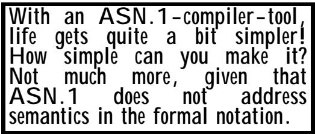
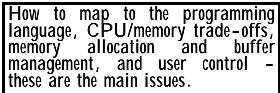

# Chapter 6 Using an ASN.1 compiler 
第六章 使用 ASN 编译器

(Or: What it is all about - producing the bits on the line!) （或者：到底是怎么回事——就是在生产线上下制造这些零件而已！）

## Summary: 总结：

This chapter: 这一章：

• describes approaches to implementation of ASN.1-defined protocols, • 描述了实现 ASN 定义的协议的方法。

• briefly describes what needs to be done if an ASN.1 compiler is not available, • 简要说明如果无法使用 ASN 编译器时，需要采取的措施。

• describes in detail the concept and operation of an ASN.1 compiler, • 详细描述了 ASN.1 编译器的概念和运作方式。

illustrates the implementation process (when using an ASN.1 compiler), with examples of programming language structures produced by the "OSS ASN.1 Tools" product, 介绍了实施流程（在使用 ASN.1 编译器时），并通过“OSS ASN.1 工具”产品生成的编程语言结构示例来加以说明。

• discusses what to look for when seeking a "best buy" in an ASN.1 compiler. • 讨论了在寻找合适的 ASN 编译器时应该注意哪些因素，以选出最优质的产品。

This chapter talks about implementation architectures, strategy, and so on. It is therefore inevitably incomplete and partial. The issues it discusses are not standardised, and different implementors will produce different approaches. It is also the case that what is "best" on one platform may well not be "best" on a different platform. 这一章讨论了实现架构、策略等方面的问题。因此，它不可避免地会存在不完整和片面之处。文中提到的这些问题并未得到标准化处理，不同的实现者可能会采用不同的方法。同样，某个平台上认为“最佳”的方案，在另一个平台上可能并不适用。

This chapter gives an insight into the implementation of protocols specified using ASN.1, but much of the detail depends on knowledge of programming languages such as C and Java, and knowledge of BER encodings that are covered in Section III. Nonetheless, those without such knowledge can still gain useful information from this chapter. But if you are not a programmer, read the next clause then skip the rest completely! 这一章介绍了如何使用 ASN.1 规范来实现各种协议的方法。不过，其中的许多细节需要了解 C 语言和 Java 等编程语言，以及第三章中提到的 BER 编码知识。不过，即使没有这些知识的人也能从这一章中获得一些有用的信息。如果你不是程序员，那么可以直接跳过这一章的内容吧！

## 1 The route to an implementation 1 实现该方案的路径

We discussed in Chapter 1 clause 5.6 (and illustrated Its all so simple with a compiler! it in figure 12) the implementation process using an ASN.1 compiler. Before reading this chapter, you 在第一章的 5.6 节中，我们讨论了使用 ASN 编译器进行实现的过程。如图 12 所示，整个过程其实非常简单。在阅读这一章之前，你们已经了解相关的基础知识了。

may wish to review that material. You simply "compile" your ASN.1 into a programming language of your choice, include the compiler output with application code that deals with the semantics of the application, (really) compile and link. Your own code reads/writes language datastructures, and you call ENCODE/DECODE run-time routines provided by the ASN.1 compiler vendor when necessary (and provide an interface to your lower layer APIs.) 你可能希望复习那些材料。你只需将 ASN.1 代码“编译”成你喜欢的编程语言，将编译输出结果与处理应用程序语义的应用程序代码结合在一起，然后进行真正的编译和链接过程。你的代码负责读写数据结构，而在必要时，你可以调用 ASN.1 编译器供应商提供的 ENCODE/DECODE 运行时例程（同时提供接口以与底层 API 进行交互）。

## 2 What is an ASN.1 compiler? 2. 什么是 ASN.1 编译器？

We all know what "a compiler" normally means - a programme that reads in the text of a programme written in a high-level language and turns it into instructions that can be loaded into computer memory and obeyed by some particular computer hard-ware, usually involving a further linkingloader stage to incorporate run-time libraries. 我们都知道“编译器”通常指的是什么——它是一种能够读取用高级语言编写的程序文本，并将其转化为计算机内存中的指令的程序。这些指令随后会被特定的计算机硬件执行。通常在这个过程中还需要经过进一步的链接和加载阶段，才能将运行时所需的库文件整合到程序中。

<table><tbody><tr><td data-imt-p="1">What does it mean to "compile" a datastructure definition? 所谓“编译”数据结构定义，究竟是什么意思呢？</td></tr></tbody></table>

But ASN.1 is not a programming language. It is a language for defining data structures, so how can you "compile" ASN.1? 但是，ASN.1 并不是一种编程语言。它是一种用于定义数据结构的语言，那么，如何“编译”ASN.1 代码呢？

The term compiler is a little bit of a misnomer, but was first used to distinguish very advanced tools supporting the implementation of ASN.1-defined protocols from early tools that provided little more than a syntax-checking and pretty-print capability. In the rest of this chapter, we will use the term "ASN.1-compiler-tool", rather than "compiler". “编译器”这个术语有点用词不当，它最初是用来区分那些能够实现 ASN.1 定义协议的非常高级的工具与那些仅具备语法检查和点状显示功能的早期工具。在本章的其余部分，我们将使用“ASN.1 编译器工具”这一术语，而不是“编译器”。

There are several ways of implementing a protocol defined using ASN.1. The three main options are discussed below. 实现使用 ASN.1 定义的协议有多种方法。下面将讨论三种主要的方式。

Write all necessary code to encode and decode values in an ad hoc way. This is only suitable for the very simplest ASN.1 specifications, and leaves you with the full responsibility for debugging your encoding code, and for ensuring that you have the ability to handle all options on decoding. (The same statement would apply to character-based protocols defined using BNF, where there are some tools to help you, but they do not provide anything like as much support as an ASN.1-compiler-tool with an ASN.1-based specification). We will not discuss this option further. 请编写所有必要的代码，以实现对值的编码和解码操作，且这种编码方式需要以自底优先的方式进行处理。这种方法仅适用于最简单的 ASN.1 规范。接下来，你需要自行负责调试编码代码，并确保能够处理解码过程中可能出现的所有情况。（对于使用 BNF 定义的基于字符的协议来说，虽然也有一些工具可以提供帮助，但它们所提供的支持远远不及基于 ASN.1 的规范所使用的编码工具。不过，我们不会进一步讨论这个选项。）

• Use a pre-built and pre-tested set of general-purpose library routines with invocations such as: • 使用一套预先构建并经过测试的通用库程序集，这些程序包括各种调用功能，例如：

 

$$
\text { encode\_untagged\_int (int\_val, output\_buffer) };
$$

However, the above is just about the simplest invocation you will get. In most cases you will also want to provide an implicit or explicit tag (of one of three possible classes), and for constructed types such as SEQUENCE, support in this way can become quite complex. This approach also only really works well with BER, where constraints are irrelevant and there is a relatively rigid encoding of tags and lengths. This approach pre-dated the development of ASN.1-compiler-tools, and is discussed a little further later. 不过，上述描述仅涉及了最简单的情形。在大多数情况下，你还需要在标签中明确或隐含地指定某个类别的标签。但对于像 SEQUENCE 这样的构造类型来说，这种处理方式可能会变得相当复杂。这种方法主要适用于 BER 类型，因为在这种类型中，约束条件并不重要，而且标签和长度的定义也相对固定。这种处理方式是在 ASN.1 编译器工具出现之前就已经被使用的了，后面会进一步讨论这一点。

Use an ASN.1-compiler-tool that lets you put values into a programming language datastructure corresponding to your ASN.1 type (and generated by the ASN.1-compiler-tool automatically from your ASN.1 type) and then make a single invocation of "encode" when you have all your values in place, to produce a complete encoding of the value of that type. This provides the simplest implementation, with the least constraints on the structure of the application code, and is the approach discussed most in this chapter. It works equally well for PER, DER and CER as it does for BER, and makes maximum use of tested and debugged code for all aspects of encoding. 使用一种 ASN.1 编译器工具，可以将数值存入与 ASN.1 类型相对应的编程语言数据结构中等价。这些数值是由 ASN.1 编译器工具根据 ASN.1 类型自动生成的。当所有数值都准备就绪后，只需调用一次“编码”函数，就能生成该类型数值的完整编码结果。这种实现方式最为简单，对应用程序代码的结构要求也最低，也是本章中经常讨论的方法。这种方法适用于 PER、DER 和 CER 等多种编码格式，并且能够充分利用经过测试和调试过的代码来进行编码处理。

However, remember that we usually have to decode as well as to encode. In the case of the third option (use of an ASN.1-compiler-tool), decoding is no more difficult than encoding. Run-time routines provided by the ASN.1-compiler-tool will take an encoding of the value of an ASN.1 type and set all the fields of the programming language data-structure corresponding to that type. 不过，请记住，我们通常需要进行解码和编码的操作。在第三个选项的情况下（使用 ASN.1 编译器工具），解码的过程并不比编码更困难。ASN.1 编译器工具所提供的运行时程序会处理 ASN.1 类型值的编码形式，并相应地设置该类型对应的编程语言数据结构中的所有字段。

With the middle option, encoding is basically a series of invocations of appropriate library routines, but for decoding there is the further problem of parsing the received bit-string into a treestructure of primitive values, and then tree-walking this parse tree to find the primitive values. Again, this is more easily possible with BER than with PER, because with BER the parse tree can be constructed without knowledge of the type of the value being decoded. 在中间选项中，编码本质上就是一系列对相应库函数的调用。而解码则涉及到将接收到的位串解析成一种树形结构，然后遍历这个树形结构来找到各个基本值。同样，使用 BER 这种方式比使用 PER 更容易实现这一点，因为在使用 BER 时，可以在不知道要解码的值的类型的情况下构建出解析树。

The use of a library of encode routines and of a parse tree are discussed further below (briefly), but the chapter concentrates mainly on the use of an ASN.1-compiler-tool, as this provides a simple approach to implementation of ASN.1-based specifications, with effectively a 100% guarantee (assuming the ASN.1-compiler-tool is bug-free!) that: 下面会简要讨论如何使用编码例程库和解析树。不过，本章主要关注的是使用 ASN.1 编译器工具来实现基于 ASN.1 的规范。因为该工具提供了一种简单的实现方式，而且几乎可以百分之百地保证实现的正确性（前提是 ASN.1 编译器工具没有漏洞！）

• Only correct encodings of values will be produced. • 只会生成正确的值编码形式。

• No correct encoding will "blow" the decoder, values being correctly extracted from all possible correct encodings. • 没有任何一种正确的编码方式会导致解码器出现错误，所有正确编码后的数据都能被正确提取出来。

As an illustration of what ASN.1-compiler-tools produce, we will use a part of our wineco specification, that for "Return-of-sales", which references "Report-item". These were first shown in Figure 22 (part 2) in Chapter 4 of this section, and are repeated here without the comments. The C and Java structures and classes produced by the "OSS ASN.1 Tools" product (a good example of an ASN.1-compiler-tool product) are given in Appendices 3 and 4, and those familiar with C and Java may wish to compare these structures and classes with figure 28. (The "OSS ASN.1 Tools" product also provides mappings to C++, but we do not illustrate that in this book – it is too big already!) 作为展示 ASN.1 编译器工具所生成的结果的一个例子，我们将使用 wineco 规范中的一部分内容。这部分内容涉及到“销售退回”功能，而“销售退回”功能又依赖于“报告项目”。这些结构在本书第 4 章的第 2 部分中有描述，这里直接呈现出来，没有添加注释。由“OSS ASN.1 工具”生成的 C 语言和 Java 语言的结构与类在附录 3 和附录 4 中有详细说明。对于熟悉 C 语言和 Java 编程的人来说，或许可以将这些结构与图 28 进行比较。（“OSS ASN.1 工具”还提供了与 C++语言的映射关系，但本书并未对此进行展示——因为内容太多，无法一一介绍。）

```txt
Return-of-sales ::= SEQUENCE
{version BIT STRING
{version1 (0), version2 (1)} DEFAULT {version1},
no-of-days-reported-on INTEGER
{week(7), month (28), maximum (56)} (1..56)
DEFAULT week,
time-and-date-of-report CHOICE
{two-digit-year UTCTime,
four-digit-year GeneralizedTime},
reason-for-delay ENUMERATED
{computer-failure, network-failure, other} OPTIONAL,
additional-information
SEQUENCE OF PrintableString OPTIONAL,
sales-data SET OF Report-item,
... ! PrintableString : "See wineco manual chapter 15" }
Report-item ::= SEQUENCE
{item OBJECT IDENTIFIER,
item-description ObjectDescriptor OPTIONAL,
bar-code-data OCTET STRING,
ran-out-of-stock BOOLEAN DEFAULT FALSE,
min-stock-level REAL,
max-stock-level REAL,
average-stock-level REAL}
Figure 28 - An example to be implemented 
```

## 3 The overall features of an ASN.1-compiler-tool 3. ASN.1 编译工具的整体特性

An ASN.1-compiler-tool is composed of a "compiler", application-independent programming language text to be included with your implementation (for C, this is .H and .C files), and libraries to be linked into your final executable. For some platforms, the compiler may also emit text which has to be compiled to produce a DLL which will be used at run-time. 一个 ASN.1 编译器工具由三部分组成：编译器、与应用程序无关的编程语言代码（这些代码需要被包含在你的实现中，对于 C 语言来说，就是.H 和.C 文件），以及需要链接到最终可执行文件中的库。在某些平台上，编译器还会生成一些文本文件，这些文本文件需要在运行时被编译成 DLL 文件来使用。

<table><tbody><tr><td data-imt-p="1">This does it all. Take your ASN.1 type. "Compile" it into a language data-structure. Populate it with values. Call ENCODE. Done! Decoding is just as easy. 这就完成了整个过程。将你的 ASN.1 类型数据“编译”成一种语言的数据结构，然后填充一些值进去。最后调用 ENCODE 函数即可！解码过程同样简单。</td></tr></tbody></table>

The overall pattern is that the "compiler" phase takes in ASN.1 modules, and produces two main outputs. These are: 整体来看，所谓的“编译器”阶段会接收 ASN.1 模块作为输入，并生成两个主要输出。这两个输出分别是：

Data-structure definitions (for the language you have chosen) that correspond to the ASN.1 type. 与 ASN 类型相对应的数据结构定义（针对您所选的语言）。

Source text (for the language you have chosen) which will eventually produce either tables or code which the run-time routines in the supplied libraries can use to perform encode/decode operations, given only pointers to this information and to the in-core representation of the values to be encoded (and a handle for the buffer to encode into). This text includes all details of tagging in your ASN.1 types, so you never need to worry about tags in your implementation code. 您所选语言的源文本最终会生成表格或代码，这些代码可以由提供中的库中的运行时程序使用，以执行编码/解码操作。只需提供对这些信息的指针，以及待编码值的内部表示形式，以及用于编码的缓冲区句柄即可。该文本包含了关于 ASN.1 类型中标签的所有细节，因此您在实现代码中无需担心标签方面的问题。

For some platforms, the situation can be just a bit more complex. The compiler may output text which you must compile to produce a DLL for use by your application. 对于某些平台来说，情况可能会稍微复杂一些。编译器可能会输出一些文本，这些文本需要经过编译后才能生成可用于应用程序的 DLL 文件。

The next section looks at the use of a simple library of encode/decode routines, and then we look at the output from the "compiler" part of the "OSS ASN.1 Tools" compiler and the use of that tool. 下一节将介绍如何使用一个简单的编码/解码程序库，然后我们会探讨“OSS ASN.1 工具”编译器的输出结果，以及如何使用该工具。

## 4 Use of a simple library of encode/decode routines 4. 使用一个简单的编码/解码程序库

The earliest support for ASN.1 implementations (after simple syntax checkers and "pretty print" programs had been produced) was a library of routines that helped in the generation of BER tag (identifier) fields, BER length fields, and the encoding of BER primitive types. 最早对 ASN.1 实现的支持，是在简单的语法检查器和“漂亮打印”程序之后出现的。这些支持包括一系列帮助生成 BER 标签（标识符）字段、BER 长度字段，以及 BER 基本类型编码的库函数。

A library of encode/decode routines (one for each ASN.1 type) is better than nothing. But complications arise in the handling of nested SEQUENCE types etc, particularly in relation to length fields. 虽然拥有一系列编码/解码例程（每种 ASN.1 类型对应一个例程）总归是好的做法，但在处理嵌套的序列类型时就会遇到一些复杂的问题，尤其是在与长度字段相关的处理上。

Some implementations today still use this approach. It is better than doing everything from scratch! 目前仍有一些实现方式采用这种策略。相比从头开始构建一切来说，这种方式确实更优！

The approach is described in terms of a BER encoding. For a PER encoding it tends to work rather less well, and the ASN.1-compiler-tool approach would be more appropriate here. 这种方法的实现是通过 BER 编码来实现的。而对于 PER 编码来说，其效果则相对较差一些。因此，在这里更适合使用 ASN.1 编译器工具来实现相应的功能。

## 4.1 Encoding 4.1 编码

Encoding of untagged primitive items is trivial - but add tagging and add constructed types with nesting of SEQUENCE OF within SEQUENCE within another SEQUENCE OF (etc), and .... well, life is not quite so simple if all you have available is a library that just does identifier and length encodings for you (and encodings of primitive values). 对于未标记的原始数据项的编码其实很简单——但是，当引入标记机制后，就需要创建复杂的类型结构，比如将多个元素按顺序排列在一个序列中，而每个序列又可以包含另一个序列等等。不过，如果可用的工具只有那些只能进行标识符和长度编码的库，那么事情就变得复杂多了（因为它们也无法处理原始值的编码问题）。

Encoding using a library of routines can get messy, because you often need to know the length of an encoding before you encode it! 使用库中的例程进行编码可能会变得复杂，因为通常你需要在编码之前就知道编码的长度！

Before the emergence of ASN.1-compiler-tools, a common approach to encoding a sequence such as "Report-item" (see Figure 28) would be to have code looking something like Figure 29 (using pseudo-code). 在 ASN.1 编译器工具出现之前，对诸如“报告项”这样的序列进行编码的常见方法，就是使用类似图 29 所示的伪代码来进行编码。

```txt
Get value for "item" into x1
encode-oid (x1, buffer_x[1])
Get value for "item-description" into x2
encode_obje_desc (x2, buffer_x[2])
Get "bar-code-data" into x3
encode_octet_str (x3, buffer_x[3])
Get "ran-out-stock" value into x4
IF x4 is true THEN
    encode_boolean (true, buffer_x[4])
ELSE
    Set buffer_x[4] to an empty string
END IF
...
etc, encoding the last item into buffer_x[7] say.
...
encode-sequence (buffer_x, 1, 7, buffer_y)
-- This encodes the contents of buffer_x from 1 to 7
-- into buffer_y with a "SEQUENCE" wrapper.
-- Note that in practice the SEQUENCE may be tagged
-- resulting in a more complicated calling sequence
Pass buffer_y to lower layers for transmission.
Clear buffer_x, buffer_y

Figure 29 - Pseucode to encode "Report-item" 
```

Here we assume we have routines available in a library we have purchased that will take a value of any given ASN.1 primitive type (using some datatype in the language capable of supporting that primitive type) and returning an encoding in a buffer. Finally, we call another library routine that will put all the buffers together (note the copying that is involved here) and will generate the "T" and the "L" for a SEQUENCE (assuming we are using BER), returning the final coding in buffer\_y. 在这里，我们假设有一个我们购买的库中的函数可用，该函数能够接受任何给定的 ASN.1 基本类型的值（使用语言中能够支持该基本类型的数据类型），并返回一个编码结果到缓冲区中。最后，我们调用另一个库函数，它将把所有缓冲区中的编码结果合并起来（注意这里涉及到数据的复制操作），并生成 SEQUENCE 的“T”和“L”部分（假设我们使用的是 BER 编码方式），最终将完整的编码结果返回到 buffer\_y 中。

Clearly, if we have more complex nested structures in our ASN.1, this can become quite messy unless we are using a programming language that allows full recursion. We have effectively hardwired the ASN.1 structure into the structure of our code, making possible changes to version 2 of the protocol more difficult. 显然，如果我们使用的 ASN.1 结构包含更复杂的嵌套结构，那么情况就会变得非常混乱，除非我们使用的是支持完全递归的编程语言。实际上，ASN.1 结构已经硬编码在了我们的代码中，这就使得对协议版本 2 的修改变得更加困难。

There are some things that can be done to eliminate some of the copying. Part of the problem is that we cannot generate the BER octets for the length octets of a SEQUENCE until we have encoded all the elements of that sequence and counted the length of that encoding. 有一些方法可以消除一些复制现象。问题的部分原因在于，在编码完序列中的所有元素并计算出编码的长度之后，我们才能生成与序列长度相关的 BER 字节。

For encoding a SEQUENCE there are (at least!) four ways to reduce/eliminate this problem of having to copy encodings from one buffer to another. These are: 对于序列的编码，至少有四种方法可以解决需要不断复制编码数据的问题。这些方法包括：

Do a "trial encoding" which just does enough to determine the length of each element of the sequence (this really needs to be a recursive call if our structure involves many levels of SEQUENCE or SEQUENCE OF), then generate the SEQUENCE header into the final buffer, then encode each of the SEQUENCE elements into that buffer. 进行“试验性编码”，仅对序列中的每个元素的长度进行适当确定（如果我们的结构包含多个层次的序列，那么这种操作需要递归调用）。然后将序列头信息写入最终缓冲区，接着将每个序列元素编码到该缓冲区中。

• Use the indefinite length form, in which case we can generate the sequence header into our final buffer and then encode into that buffer each of the elements of the sequence, with a pair of zeros at the end. • 使用不定长度的形式来表示数据。这样，我们可以将序列头部分放入最终缓冲区中，然后将该缓冲区中的各个元素进行编码，最后在每個元素的末尾加上两个零。

• Use the "trick" of allocating space for a long-form length encoding which is a length of length equal to 2, followed by two blank octets that we will fill in later once the length is known, and then encode each element into the same final buffer. • 采用“技巧”，为长格式编码分配空间：首先是一个长度为 2 的字节，接着是两个空白八位元，这些空白八位元在知道总长度之后再进行填充。然后，将每个元素编码到同一个最终缓冲区中。

• Use (assuming it is available!) a "gather" capability in the interface to lower layer software which enables you to pass a chain of buffers to that software, rather than a single contiguous piece of memory. • 使用接口中的“收集”功能（假设该功能可用！），将一系列缓冲区传递给下层软件。这样就能让软件处理多个缓冲区，而不是只处理一块连续的内存区域。

These approaches have been shown to work well for BER, but for CER/DER/PER, they can be either not possible (CER/DER demands minimum octets for length encoding) or more difficult/complex. 这些方法在处理 BER 问题时效果不错，但在处理 CER/DER/PER 问题时，要么无法实施（因为 CER/DER 需要至少一定数量的八位元来进行长度编码），要么实施起来更加困难且复杂。

## 4.2 Decoding 4.2 解码

Decoding using library routines is not quite so easy. You need a general-purpose parser - relatively easy for BER (less easy for PER), tree-walking code, and then the basic decode routines for primitive types. This rather parallels what you have to do with character-based encodings - but with character-based encodings you need a quite sophisticated tool to split the incoming character string (based on input of the 使用库中的例程进行解码并不容易。你需要一个通用的解析器来处理 BER 编码（对于 PER 编码则难度更大），还需要能够执行树遍历操作的代码，以及用于处理基本类型的数据的基本解码例程。这与基于字符的编码方式类似——不过在基于字符的编码中，你需要一个相当复杂的工具来拆分输入的字符字符串（这需要基于一定的输入条件）。

For decoding you need a generalpurpose parser, then you tree-walk. The library approach is easier with BER than with PER as the TLV structure is independent of the datatype. 进行解码时，你需要一个通用类型的解析器，然后按照树形结构进行遍历。与 PER 相比，使用 BER 进行库级处理更为简单，因为 TLV 结构与数据类型无关。

BNF) into a tree-structure of "leaf" components for processing. Producing a parse tree of BER is rather easier. 将 BNF 数据转换为“叶节点”构成的树形结构，以便进行处理。而生成 BER 的解析树则相对容易一些。

In general, use of a simple library of encode-decode routines with ASN.1 is neither complex nor more simple than use of parsers for character-based protocols defined using BNF, although it is arguable that the original ASN.1 definition is more readable to a "layman" than a BNF description of a character-based protocol. 总体而言，使用基于 ASN.1 的简单编码解码库并不复杂，其使用方式也不比使用基于 BNF 定义的字符协议解析器更为简单。不过，可以说，与基于 BNF 描述的字符协议相比，原始 ASN.1 定义对于普通用户来说更易于理解。

It is also the case that parsing an incoming BER encoding into a tree-structure (where each leaf is a primitive type) is a great deal easier than producing a syntax tree from a character-based encoding defined using BNF. 此外，将输入的 BER 编码解析成树形结构（其中每个叶子节点代表一种基本类型）要比从基于 BNF 定义的字符编码中生成语法树要简单得多。

Decode implementations for BER can take advantage of the use of bit 6 of the identifier octets to identify whether the following "V" part is constructed, enabling application-independent code to produce a tree-structure with primitive types at the leaves. That tree-structure is then "walked" by the application-specific code to determine the values that have been received. 在 BER 解码实现中，可以利用标识符字节的第 6 位来标识后续的“V”部分是否由某种结构构成。这样，与应用无关的代码就能生成具有树状结构的代码，其中基本类型位于树的叶子位置。然后，应用程序特定的代码可以遍历这个树状结构，以确定已经接收到的数值。

This "library of useful routines" approach is certainly better than doing everything from scratch! But things are so much simpler with an ASN.1-compiler-tool as described below. 这种“实用程序库”式的解决方案，显然比从头开始构建一切要更优！而使用下面描述的 ASN.1 编译器工具的话，事情就会简单得多。

## 5 Using an ASN.1-compiler-tool 5. 使用 ASN.1 编译器工具

## 5.1 Basic considerations 5.1 基本考虑因素

An ASN.1-compiler-tool makes everything much more of a one-step process (for the user of the tool). All the decisions on how to encode (copying buffers, doing trial encodings, using indefinite length, using long-form definite length with a length of two) are buried in the run-time support of the ASN.1-compiler-tool, as are the mechanisms for parsing an incoming encoding into components that can then be placed into memory in a 一个 ASN.1 编译工具让整个过程变得更加简单，用户只需一步操作即可完成。关于如何编码的所有决策（如复制缓冲区、尝试不同编码方式、使用不定长度或固定长度但长度为 2 等），都隐藏在 ASN.1 编译工具的运行时支持中。而解析输入编码并将其分解为可存储于内存中的各个组件的过程，也由该工具负责处理。



form which matches a programming-language data-structure. 一种与编程语言中的数据结构相匹配的格式。

ASN.1-compiler-tools are specific to a given platform (meaning hardware, operating system, programming language, and perhaps even development environment) and you will need to find one that is available for the platform that you are using. If you are using C, C++, or Java, on commonly used hardware and operating systems you will have no problem, but if you are locked into some rather archaic language (sorry if I sound rude!), life may be more difficult. ASN.1 编译器工具通常是针对特定平台设计的（即针对特定的硬件、操作系统、编程语言，甚至开发环境）。因此，你需要找到适用于你所使用平台的编译器工具。如果你使用的是 C、C++或 Java 语言，并且在常见的硬件和操作系统上运行，那么选择相应的编译器工具应该不会有问题。不过，如果你使用的是一些较为古老的编程语言，情况可能会比较棘手（如果我的话听起来有些无礼的话，请见谅！）。

A particular product may support several of these languages in one software package, using "compiler directives", or you may have to pay for several versions of a product if you want support for multiple platforms (C and Java, say). In some cases "cross-compilation" (which some ASN.1-compiler-tools support) can provide implementation support on older platforms. Basically, you need to "filter" available tools according to whether they can support directly or through crosscompilation the platform you want/need to use, then choose the "best" (see later section in this chapter). 某种特定产品可以通过“编译指令”在同一个软件包中支持多种语言。或者，如果你希望支持多个平台（比如 C 语言和 Java），那么可能需要购买该产品的多个版本。在某些情况下，交叉编译技术（一些 ASN.1 编译器工具支持这一功能）可以确保在旧平台上也能使用该产品的功能。基本上，你需要根据工具是否能够直接支持目标平台，还是需要通过交叉编译来支持目标平台，来筛选出最合适的工具。关于这一点，请参考本章后面的章节。

"Want/need" is important here. Sometimes the implementation platform is fixed and almost impossible to change for either historical reasons or for reasons of company policy, but more often, there are costs associated with the use of different platforms (procurement of hardware which is not "in-company", training costs of programmers, etc etc) which must be balanced against the "quality" (and cost) of available tools for these platforms. “想要/需要”在这里非常重要。有时候，由于历史原因或公司政策的原因，某些实施平台是固定不变的，很难进行更改。但更常见的情况是，使用不同平台会带来一些成本开销（比如需要采购非公司自有的硬件设备，程序员培训费用等），这些成本必须与这些平台所提供的工具“质量”和“成本”相权衡。

## 5.2 What do tool designers have to decide? 5.2 工具设计师需要做出哪些决策呢？

There are three very critical decisions in the design of a good ASN.1-compiler-tool - how to map ASN.1 data-structures to programming-language datastructures, how to make CPU/memory trade-offs in the overall run-time support, and how to handle memory allocation and buffer management during encode/decode operations. But other important 在设计一个优秀的 ASN1 编译器工具时，有三个非常关键的决策需要考虑：如何将 ASN1 数据结构映射到编程语言中的数据结构；如何在整体运行时间范围内进行 CPU 和内存资源的优化分配；以及在编码/解码操作过程中如何处理内存分配和缓冲区管理问题。不过，还有其他一些重要的因素也需要考虑。



decisions are how much user control, options, and flexibility to provide in these areas. All of these factors contribute to the "quality" of any particular tool. 决策决定了在这些领域用户可以拥有多大的控制权、选择余地以及灵活性。所有这些因素共同影响着某个工具的“质量”。

The designers of the ASN.1-compiler-tool will have made some important decisions. We will see later that the quality of these decisions very much affects the quality of the ASN.1-compiler-tool (and the ease and flexibility with which you can use it to help you to produce protocol implementations). ASN.1 编译器工具的设计者们已经做出了一些重要的决策。我们稍后会看到，这些决策的质量直接影响到 ASN.1 编译器工具的整体性能（以及用户使用它来编写协议实现时的便捷性和灵活性）。

The most important areas they have had to address (and which affect the quality of the resulting ASN.1-compiler-tool) are: 他们必须解决的最重要的几个问题（这些问题会影响最终生成的 ASN.1 编译器工具的质量）包括：

• How to map ASN.1 into programming-language data-structures? • 如何将 ASN.1 格式的数据映射到编程语言的数据结构之中呢？

• What are the right trade-offs between run-time encoding/decoding speed and memory requirements? • 在运行时编码/解码速度与内存需求之间，应该如何进行合理的权衡呢？

• How to handle memory allocation when performing encode and decode operations? • 在执行编码和解码操作时，如何处理内存分配问题？

• How much user control should be provided (and how - global directives or local control) on the behaviour of the tool for mappings and for run-time operation? • 应该提供多少用户控制权限？是通过全局指令还是局部控制来实现呢？关于映射功能的工具行为以及运行时的操作，又该如何进行控制呢？

None of these decisions are easy, but the best tools will provide some degree of user control in all these areas, through the use of "compiler directives", ideally both in terms of global default settings as well as specific local over-rides. (For example, for two-octet, four-octet, or truly indefinite-length integers). 这些决策都不容易做出，但最好的工具能够为用户在这些领域提供一定程度的控制权，这可以通过使用“编译指令”来实现。理想情况下，这些指令既包括全局默认设置，也包括具体的局部调整选项。（例如，对于两位数、四位数或真正长度不固定的整数来说，都可以使用相应的指令进行设置。）

## 5.3 The mapping to a programming-language data structure 5.3 映射到一种编程语言的数据结构

The designers of the ASN.1-compiler-tool will have determined a mapping from any arbitrarily complicated set of ASN.1 types into a related (and similarly complicated) set of datatypes in your chosen language. And they will have written a program (this is the bit that is usually called the "compiler") which will take in the text of an ASN.1 module (or several modules linked by EXPORTS and IMPORTS) and will process the module(s) to generate as output the mapping of the types in those modules into the chosen target language. ASN.1 编译器工具的设计者已经成功地将任意复杂的 ASN.1 类型集映射到了所选语言中的相关数据类型集。同时，他们还编写了相应的程序（这通常被称为“编译器”）。该程序能够接收 ASN.1 模块的文本（或由 EXPORTS 和 IMPORTS 连接的多个模块），然后对这些模块进行处理，最终将模块中各类别的映射结果输出到所选的目标语言中。

This is perhaps the most important design decision. It is often called "defining the API for ASN.1", and in the case of C++ there is an X-Open standard for this. Get that wrong, and there will be some abstract values of the ASN.1 type that cannot be represented by values of the programminglanguage data-structure. Or perhaps the programming-language data-structure generated will just produce programminglanguage-compiler error messages when you try to use it! 这或许是最重要的一项设计决策。它通常被称为“为 ASN.1 定义 API”。在 C++的情况下，有一个名为 X-Open 的标准规范用于这一目的。如果处理出错，那么一些 ASN.1 类型的数据将无法用编程语言的数据结构来表示。或者，当尝试使用所生成的数据结构时，可能会遇到编程语言的编译错误！

How does that help you? Well, your pseudo-code for encoding "Report- item" now looks more like figure 30. 那对你有什么帮助呢？嗯，你现在用于编码“报告-项目”的伪代码看起来更像是图 30 的样子了。

```txt
Get value for "item" into Report-item.item
Get value for "item-description" into
Report-item.item-description
Get "bar-code-data" into Report-item.bar-code-data
Get "ran-out-of-stock" value into
Report-item.ran-out-of-stock
...
etc, setting all the fields of Report-item
...
Call Encode (CompilerInfo, Report-item, Buffer)
Pass Buffer to lower layers for transmission
Clear Buffer 
```

Figue 30 - Pseudo-code to encode using an ASN.1-compiler-tool 图 30 – 使用 ASN.1 编译器工具进行编码的伪代码

Note that however complicated a nested structure of types or repetitions of SEQUENCE OF there are, there is just one call of "Encode" at the end to encode your complete message from the values you have set in your programming language data-structure. 请注意，无论类型嵌套结构或序列重复多么复杂，最终只需要调用一次“编码”操作，就可以从您在编程语言数据结构中设置的数值中编码出整个消息。

For incoming messages, the process is reversed. Your own code does no parsing, and no treewalking. It merely accesses the fields of the programming-language data-structure that the "compiler" part of the tool generated for you. 对于传入的消息，处理过程则相反。你的代码不需要进行解析，也不需要进行任何树遍历操作。只需要访问工具中的“编译器”部分所生成的编程语言数据结构的各个字段即可。

"CompilerInfo" in the call of "Encode" is information passed from the "compiler" part of the tool to the run-time routines. This passes (inter alia) the tagging to be applied for BER. Although largely invisible to you (you do not need to understand the form of this information), it is absolutely essential to enable the run-time routines to provide their encode/decode functions. 在“Encode”函数的调用中，“CompilerInfo”所包含的信息是从工具的“编译器”部分传递到运行时 routines 的。这些信息中包含了用于错误检测（BER）的标签信息。虽然这些信息对您来说可能不太明显（您无需理解这些信息的格式），但这些信息对于让运行时 routines 能够执行编码/解码功能来说至关重要。

## 5.4 Memory and CPU trade-offs at run-time 5.4 运行时的内存和 CPU 资源权衡问题

What is this parameter "CompilerInfo"? This is a vital magic ingredient! This is produced by the compiler, and contains the "recipe" for taking the contents of memory pointed to by "Return-of-sales" (for example), finding from that memory the actual values for the ASN.1 type, and encoding those 这个参数“CompilerInfo”是什么？它其实是一个非常重要的魔法元素！这个参数是由编译器生成的，它包含了获取由“Return-of-sales”指针所指向的内存中的内容，然后从该内存中提取 ASN.1 类型的实际值，并对这些值进行编码的“配方”。

Interpretation of tables is a pretty compact way of performing a task, but open code is faster! With the best tools you choose. 表格的解析是一种较为简洁的完成任务的方式，但使用开放式的代码则能更快完成工作！选择合适的工具，让你能够事半功倍。

values with correct tags, correct use of DEFAULT, etc. It essentially contains the entire information present in the ASN.1 type definition. 带有正确标签的变量，正确的 DEFAULT 使用方式等。实际上，它包含了 ASN.1 类型定义中的所有信息。

There are (at least!) two forms this "CompilerInfo" can take: 这种“CompilerInfo”类型至少有两种形式：

• It can be a very compact set of tables which are used in an interpretive fashion by "Encode" to determine how to encode the contents of the memory containing a value of (eg) "Return-of-sales" (and similarly for "decode"). • 它其实可以是一组非常简洁的表格结构。通过“编码”操作，可以以解释性的方式使用这些表格来确定如何对包含“退货率”等值的内存内容进行编码；而“解码”操作则用于相反的目的。

It can be (rather more verbose, but faster) actual code to pick up the value of each field in turn to do the encoding of that field (and to merge the pieces together into larger SEQUENCE, SEQUENCE OF, etc structures). In general, open code is probably more appropriate for PER than for BER, as tags and lengths are often omitted in PER, whereas a table-driven approach, defining the tags to be encoded and letting the interpreter generate the lengths, may be more appropriate for BER. It is horses for courses! 可以使用一些实际代码来依次获取每个字段的值，然后对这些字段进行编码，并将这些编码结果合并成更大的序列、数组等结构。一般来说，对于 PER 来说，开放式的编码方式可能更为合适，因为 PER 中常常省略了标签和长度信息。而对于 BER 来说，采用以表格驱动的方式，明确需要编码的标签，并让解释器自动生成长度信息，则更为合适。总之，具体情况需要具体分析！

Just as there are many different implementation architectures for hand-encoding, so there are many different possible architectures for the design of tools. With implementation architectures, all that matters is that the bits-on-the-line are correct. And similarly with an ASN.1-compiler-tool, all that really matters is that it produces a programming-language data-structure that can represent all abstract values of the ASN.1 type, and that it efficiently produces correct encodings for values placed in that data-structure. (With similar remarks concerning decoding.) I don't know exactly how the "OSS ASN.1 Tools" product goes about producing an encoding (or decodes), but it does produce the right results! 在手工编码方面，存在许多不同的实现架构；而在工具设计方面，也有许多不同的架构可供选择。在实现架构方面，重要的是线上的数据要准确无误。同样，对于 ASN.1 编译器工具来说，重要的是它能够生成一种编程语言的数据结构，能够表示 ASN.1 类型中的所有抽象值，并且能够高效地生成适用于该数据结构的正确编码（关于解码方面也有类似的说明）。我不知道“OSS ASN.1 工具”是如何生成编码（或解码）结果的，但它确实能够产生正确的结果！

## 5.5 Control of a tool 5.5 工具的控制

There are a host of options that can be incorporated into an ASN.1-compiler-tool (and/or the run-time libraries that support it). For example: 在 ASN.1 编译器工具中，可以整合许多不同的选项（以及支持这些选项的运行时库）。例如：

Inevitably there are options you want to leave to the user. How best to do that? 不可避免地，有一些选项是需要留给用户自行决定的。那么，应该如何最好地实现这一点呢？

• The language or platform to "compile" for. • 用于“编译”的语言或平台。

• How to represent ASN.1 INTEGER types in the programming-language data-structures. • 如何在编程语言的数据结构中表示 ASN.1 的 INTEGER 类型。

• Whether to use arrays or linked-list structures in the mapping from ASN.1 to your programming-language (for example, for "SEQUENCE OF"). • 在从 ASN.1 格式转换为你的编程语言时，是应该使用数组结构还是链表结构来表示“序列”这样的数据结构。

• Which encoding rules to use for encoding (and to assume for decoding). • 应该使用哪种编码规则来进行编码（以及用于解码的规则）。

(Slightly more subtle) Which encoding rules can be selected at run-time - all or only a subset? (This affects the library routines that are included, and hence the size of the executable.) （稍微复杂一点）可以在运行时选择哪些编码规则？全部选择，还是只选择一部分？这会影响所包含的库函数，从而影响到可执行文件的大小。

• Which encodings to use in the non-canonical encoding rules. • 在非标准编码规则中应使用哪些编码方式。

• Whether the user prefers the fastest possible encode/decode or the smallest executable. • 用户是更倾向于最快速的编码/解码过程，还是更倾向于最小的可执行文件大小？

• (Fairly unimportant) The names of the directories and files that will be used at both compile-time and run-time. • （不太重要）在编译和运行时都会使用的目录和文件名称。

• And many others. • 还有很多其他的事情。

The control by the user can be expressed by a global configuration file, by command-line directives, by an "options" button in a Windows-based product, by "compiler directives" embedded in the ASN.1 source, or by run-time call parameters, or by several of these, with one providing a global default and another overriding that default locally. With the "OSS ASN.1 Tools" product, compiler directives are included after a type definition (where a subtype specification might go) as a specialised form of comment. For example: 用户的控制可以通过全局配置文件、命令行指令、基于 Windows 的产品的“选项”按钮、嵌入在 ASN.1 源代码中的“编译指令”，或者运行时的调用参数来实现。其中一些方式会提供全局默认值，而另一些则可以在本地覆盖该默认值。使用“OSS ASN.1 工具”产品时，编译指令被包含在类型定义之后（比如子类型声明的位置），作为一种特殊的注释形式。例如：

 

$$
\text { SET } - - < \text { LINKED } > - - \text { OF INTEGER }
$$

 

## 6 Use of the "OSS ASN.1 Tools" product 6. 使用“OSS ASN.1 工具”产品

Here we describe how to encode values with one particular tool. The process with other ASN.1- compiler-tools is similar. 在这里，我们描述了如何使用一种特定的工具来编码值。其他 ASN.1 编译器工具的过程也是类似的。

<table><tbody><tr><td data-imt-p="1">Put your values in the language data-structure and call ENCODE. That is all there is to it! More-or-less! 将你的数值值放入语言、数据结构和调用 ENCODE 函数中。就这么简单而已！差不多就是这样吧！</td></tr></tbody></table>

When you use the "OSS ASN.1 Tools" product to support an application written using the C programming language, you input an ASN.1 specification (and identify the top-level type that forms the abstract syntax, or PDU, to the compiler via a compiler directive). This can be defined using a single module or several modules. There are four outputs (but only the last two are important for correct ASN.1 input): 当您使用“OSS ASN.1 工具”来支持用 C 语言编写的应用程序时，您需要输入一个 ASN.1 规范（同时指明顶级类型，该类型通过编译器指令传递给编译器，以形成抽象语法或 PDU）。这个规范可以通过一个模块或多个模块来定义。总共有四个输出结果（但只有最后两个对于生成正确的 ASN.1 输入非常重要）：

• A "pretty-print" listing (not really very important). • 一个用于“美化输出格式”的列表项（其实并不是非常重要）。

• Error and warning messages if your ASN.1 is a bit "funny". • 如果您的 ASN.1 格式有些特殊或复杂，可能会出现错误和警告信息。

• A ".h" header file that contains the mapping of your ASN.1 types into C language datastructures. • 一个“.h”头文件，其中包含了将您的 ASN.1 类型映射到 C 语言数据结构之间的映射信息。

• A ".c" control file that conveys information from the compiler to the run-time routines that you will invoke to encode and decode. • 一个“.c”控制文件，它负责将编译器的信息传递给运行时程序，以便这些程序能够执行编码和解码操作。

The latter is pretty incomprehensible (but vitally important), and you ignore it, other than to compile it with your C compiler and link in the resulting object file as part of your application. 后者其实相当难以理解（但非常重要），你只需忽略它，无需对其进行任何处理，只需将其与你的 C 语言编译器一起编译，然后将生成的对象文件作为应用程序的一部分进行链接即可。

The ".h" file is included with your own code, and compiled to form the main part of your application, which will include calls to "encode" and "decode". You also link in a run-time library. At this stage you may wish to look at Appendices 3 and 4, which have not been included in ths chapter due to their bulk. 那个“.h”文件是随你的代码一起编译进应用程序中的，它构成了应用程序的主要组成部分。在这个文件中，你会看到对“encode”和“decode”函数的调用。此外，你还需要在运行时链接一个库文件。在这个阶段，你可以参考附录 3 和附录 4 的内容，但由于篇幅原因，这些内容并未被包含在这章中。

Appendix 3 gives most of the ".h" file for "Return-of-sales" and "Report-item" for the C language implementation (and some parts of relevant "include" files). Appendix 4 gives the equivalent for a Java implementation. 附录 3 列出了 C 语言实现中“销售回款”和“报告项目”相关的“.h”文件内容（以及相关“包含文件”中的部分代码）。附录 4 则提供了 Java 实现中的对应代码。

I offer no explanation or discussion of these appendices - if you are a C or Java programmer, the text (and its relation to the ASN.1 definitions) will be quite understandable. If you are not, just ignore them! 我不会对这些附录进行任何解释或讨论——如果你是一名 C 语言或 Java 语言的程序员，那么这些文本以及它们与 ASN.1 定义之间的关系对你来说应该很容易理解。如果你不是这样的程序员，那就直接忽略它们吧！

And there you have it! Of course, the original application standard could have been published in "pseudo-C" or in Java instead of using ASN.1, but would that really have been a good idea? For once I will express an opinion - NO. Ask the same question in 1982/4 and it would have been COBOL or Pascal (or perhaps Modula) that we would have been talking about. And even if you define your structures in "pseudo-C", you still have to make statements about the encoding of those structures, the most important being about the order of the bytes in an integer when transmitted down the line, about the flattening of any tree structures you create, about the size of integers and of pointers, and so on. It really is rather simpler with ASN.1 - let the ASN.1-compiler-tool take the strain! 就是这样！当然，原本的应用程序标准可以用“伪 C”语言或 Java 来编写，而不是使用 ASN.1 标准。但那样真的好吗？至少我可以表达一下我的意见——不行。如果在 1982 年或 1984 年提出同样的问题，我们讨论的可能会是 COBOL 语言、Pascal 语言（或者 Modula 语言）。即使你用“伪 C”语言定义你的数据结构，仍然需要处理关于这些数据结构编码的问题，比如整数在传输过程中字节的顺序、你创建的任何树形结构如何被处理、整数和指针的大小等等。使用 ASN.1 确实要简单得多——让 ASN.1 编译器来处理这些事情吧！

The appendices are not of course the entire compiler output. There is also the control information used by the run-time routines to perform the encode/decode, but the implementor need never look at that, and it is not shown here. 当然，附录并不是编译输出的全部内容。此外，还有运行时程序用来进行编码/解码的控制信息，但实现者无需查看这些信息，因此这里并未展示。

## 7 What makes one ASN.1-comiler-tool better than another? 7. 究竟是什么让一种 ASN.1 编译器工具比其他工具更优秀呢？

There are many dimensions on which the quality of a tool can be judged. The major areas to be looked at are: 判断一个工具的优劣可以从许多方面入手。主要需要关注的领域包括：

• The extent of support for the full ASN.1 notation. • 对完整 ASN1 表示法的支持程度。

<table><tbody><tr><td data-imt-p="1">OK. So you want to buy an ASN.1-compiler-tool? What to look for in a best-buy? It is not as easy as buying a washing-machine! Here are some things you might want to look for or beware of. 好的。那么，您想要购买一款 ASN.1 编译器工具吗？在挑选合适的产品时，应该注意哪些因素呢？这可不像购买洗衣机那么简单！以下是一些您可能需要考虑或警惕的事情。</td></tr></tbody></table>

• The mappings to programming-language data-structures. • 这些映射与编程语言中的数据结构相对应。

• Run-time memory/CPU trade-offs. • 运行时的内存/CPU 资源权衡问题。

• Memory allocation mechanisms. • 内存分配机制。

• The degree of user control over options. • 用户对各项选项的控制程度。

We have already had some discussion of most of these areas when we discussed the sorts of decisions a tool vendor needs to take. Here we highlight a few points of detail. It is, however, important to recognise that with the best tools, absolutely none of the problems listed below will arise. Indeed, many of the problems occurred only in early tools before they were fullydeveloped. 在讨论工具供应商需要做出哪些决策时，我们已经对大部分相关领域进行了讨论。在这里，我们重点强调一些细节。不过，重要的是要认识到，使用最优秀的工具的话，上述所有问题都不会出现。实际上，许多问题只出现在那些尚未完全开发的早期工具中。

Some early tools provided no support for ASN.1 value notation, so you needed to remove all value assignments from your module and replace "DEFAULT" by "OPTIONAL", handling the default value in your application code. 一些早期的工具并不支持 ASN.1 值表示法，因此你需要从模块中移除所有值赋值操作，并将“DEFAULT”替换为“OPTIONAL”，并在应用程序代码中处理默认值。

Other early tools could only handle a single module (no support for IMPORTS and EXPORTS), so you had to physically copy text to produce a single module. The better tools today will handle multiple modules, and (once you have identified your top-level message to them) will extract from those modules precisely and only those types that are needed to support your top-level message. 早期的工具只能处理单个模块，不支持导入和导出功能，因此必须手动复制文本以生成单个模块。而如今更好的工具能够处理多个模块，并且一旦确定了向它们传递的顶层信息，就能精确地提取出那些对支持该顶层信息至关重要的数据类型。

Another issue is whether you can use the ASN.1 definition as published, or whether you have to help the parser in the tool by adding a semi-colon to the end of each of the assignment statements in your module. 另一个问题是，是否可以使用发布的 ASN.1 定义；还是需要在你的模块中，在每个赋值语句的末尾添加分号，以辅助工具中的解析器工作。

There are other tools that are designed simply to support one particular protocol, and will recognise only the types that appear in that protocol. If that protocol is extended in version 2 to use more types, you may have to wait for an upgrade to your tool before you can implement version 2! 还有其他一些工具，它们专门设计用于支持某种特定的协议，并且只能识别该协议中出现的类型。如果某个协议在版本 2 中增加了更多的类型，那么你可能需要等待工具的升级，才能实现版本 2 的功能！

There is also the issue of the 1994 extensions to ASN.1 - Information Object Classes etc, described in Section II. This is probably the area where you are most likely to still find lack of support in some tools. 此外，还有 1994 年对 ASN.1 标准的扩展——即信息对象类等相关内容。这些扩展在第二部分中有详细描述。很可能在这个领域，某些工具仍然不支持这些扩展。

The mapping to the programming-language data-structure is a very critical area. If this is got wrong you may not be able to set all the values you should be able to! 将数据结构映射到编程语言中的操作是一个非常关键的领域。如果这一步骤出错，那么你可能就无法设置所有应有的数值了！

Note also that ASN.1 allows arbitrary length names for identifiers (with all characters significant), and is case sensitive. In some programming languages, characters after (e.g.) the 31st are simply discarded. Does the tool ensure that long names (which are quite common in ASN.1) are mapped into distinct programming language names in an ergonomic way that you can understand? 请注意，ASN.1 允许标识符具有任意长度（包含所有字符），并且区分大小写。在某些编程语言中，第 31 个字符之后的字符会被直接忽略。该工具是否能够确保较长的标识符能够以易于理解的方式被转换为相应的编程语言名称呢？

What about INTEGER types? A good tool will give you control (usually through either global directives or directives you embed into the ASN.1 text against a particular type) over the mapping of INTEGER types, for example into a short, normal, long, or huge (represented as a string) integer. 那么 INTEGER 类型呢？一个好的工具可以让你对 INTEGER 类型的映射进行控制——通常可以通过全局指令或嵌入到 ASN.1 配置文件中的特定类型指令来实现这一点。例如，你可以控制 INTEGER 类型如何被转换为短整数、普通整数、长整数，或者以字符串形式表示的巨大整数。

There are also efficiency considerations in the mappings. On some platforms there is the concept of "native" integer types. Mapping directly into these can be much more efficient than proceeding in a more generic (platform-independent) manner. 在映射过程中，效率也是一个需要考虑的因素。在某些平台上，存在“原生”整数类型的概念。直接将这些类型映射到相应的位置，会比采用更通用（与平台无关）的方法更高效。

It is important here to remember that the mappings from ASN.1 to a programming language (usually called an "ASN.1 Application Programme Interface (API)" are in general not standardised, so each tool vendor does their own thing. (Work was done within X-Open on standardisation of the mapping to C++ - called the ASN.1/C++ API - but I am not sure whether the document was finally ratified. If you want to use C++ as your implementation language, you may want to ask your tool vendor about whether they use that mapping or not.) 在这里，重要的是要记住，从 ASN.1 到某种编程语言的映射关系通常并不标准化，因此每个工具供应商都有自己的实现方式。不过，有一些标准化努力在 X-Open 项目中进行了尝试，比如将 ASN.1 映射到 C++的语言接口——即 ASN.1/C++ API。不过我不确定该文档是否最终得到了批准。如果你想要使用 C++作为实现语言，可能需要咨询你的工具供应商，了解他们是否采用了这种映射方式。

We discussed earlier the option of a largely interpretative table-driven approach (using little memory) versus an approach based on generated code (taking more memory but faster) to run-time encoding and decoding. This is one area where you will probably be looking for options in the use of the tool that will enable you to choose for each application or platform which approach you want taken. 我们之前讨论过两种方法的优劣：一种是基于表格驱动的解释性方法（占用较少内存），另一种则是基于生成代码的编码方法（虽然需要更多内存，但执行速度更快）。在这一点上，您可以在工具的使用选项中找到适合每种应用或平台的编码方式。

And finally, we discussed earlier the means of providing user control over tool options and the range of such options that can be controlled. 最后，我们之前讨论过如何让用户能够控制工具选项的设置，以及可以控制的选项范围。

All these factors contribute to the "quality" of a tool, but you will certainly want to look at the cost as well! Most tool vendors charge a licence fee that gets you just one copy of the ASN.1-compilertool, but unlimited copies of the run-time support (which you clearly need if you are to distribute your resulting application!). 所有这些因素都影响着工具的“质量”，但您肯定也会关心其成本！大多数工具供应商都会收取一次性许可费，这样您就可以拥有一份 ASN 编译工具的安装版。不过，对于运行时的支持部分，您可以免费获取无限份副本——如果您要分发自己的应用程序的话，这一点非常重要。

## 8 Conclusion 8. 结论

This chapter has discussed how to build an actual implementation for a protocol that has been defined using ASN.1. It is followed by some discussion of management and design issues for consideration by managers, specifiers, and implementors, to complete Section I of this book. 本章讨论了如何构建基于 ASN.1 定义的协议的实际实现。接下来，我们将讨论一些管理和设计方面的问题，以便管理者、规范制定者以及实施者能够充分考虑这些问题，从而完成本书的第一部分的内容。
