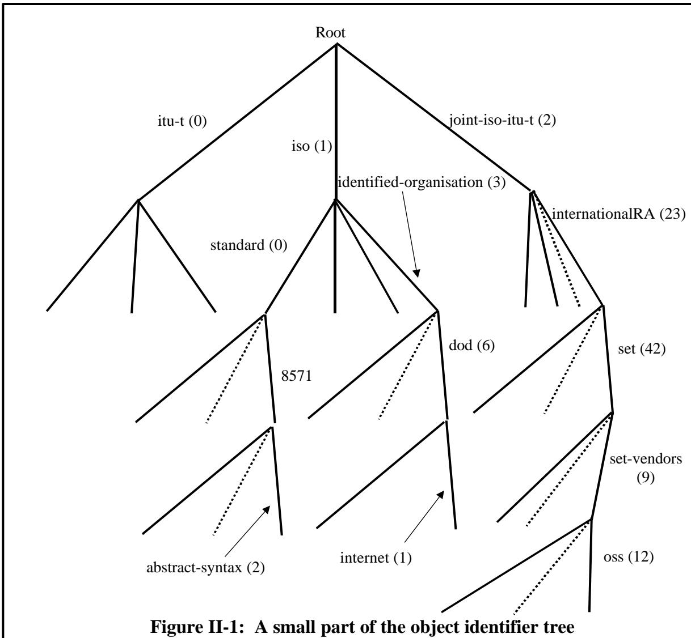

# Chapter 1 The object identifier type 
第一章 对象标识符类型

(Or: What's in a name?) （或者：名字有什么意义呢？）

Summary: The object identifier type, and its associated hierarchical name-space is heavily used by protocol specifiers that use ASN.1. It provides a world-wide unambiguous naming scheme that anyone can use, and has been used to name a very wide range of "things". 摘要：对象标识符类型及其相关的分层命名空间被许多使用 ASN.1 协议的规范定义所广泛应用。它提供了一种全球范围内统一的命名方案，任何人都可以使用这种方案。实际上，这种命名方式已经被用于为各种各样的“对象”命名。

Object identifiers are used to identify: 对象标识符用于识别：

a) ASN.1 modules a) ASN.1 模块

b) Abstract and transfer syntaxes b) 抽象语法和转换语法

c) Managed objects and their attributes c) 被管理的对象及其属性

d) Components of Directory (X.500) names d) 目录名称的组成部分（X.500）

e) Headers of MHS messages (X.400) and MHS Body Types e) MHS 消息的头部信息（X.400 协议）以及 MHS 消息的主体内容

f) Banks and Merchants in Secure Electronic Transactions f) 银行在安全电子交易中的作用与职责

g) Character Repertoires and their encodings g) 字符集及其编码方式

h) Parcels being tracked by courier firms h) 由快递公司负责追踪的包裹

i) And many other "things" or "information objects". i) 还有许多其他的“事物”或“信息对象”。

## 1 Introduction 1 引言

Final discussion of the object identifier type has been deferred to this "Further Details" Section, but as a type notation it is as simple as BOOLEAN. You just write: 关于对象标识符类型的最后讨论被推迟到“更多细节”部分进行。不过，作为一种类型标记，它其实非常简单，就像 BOOLEAN 那样。你只需要这样写：

Object identifiers were introduced into ASN.1 in 1986 to meet a growing need for a name-space with globally unique short identifiers which permitted easy acquisition of name-space by anybody. 在 1986 年，为了满足对具有全球唯一性且简短的标识符的需求，对象标识符被引入到 ASN.1 标准中。这一标准旨在让任何人都能轻松获取命名空间。

OBJECT IDENTIFIER 对象标识符

all upper case. The complexity arises with the set of values of this type, and with the value notation. 全部使用大写字母。这种类型的数值集合以及数值表示方式所带来的复杂性是显而易见的。

First, we should note that the set of values is dynamically changing on a daily basis, and that no one computer system (or human-being) is expected to know what all the legal values are. The value notation has a structure, and each object identifier value can be mapped onto a sequence of simple integer values, but these structures do not matter. Treated as an atomic entity, an object identifier value (and its associated semantics) is either known to an implementation, or not known. This is all that matters. 首先，我们需要注意到，这些值的集合是每天都在动态变化的，而且预计没有任何一个计算机系统或人类能够知晓所有合法值的具体内容。值表示法具有某种结构，每个对象标识符都可以映射到一个由简单整数值组成的序列上，但这些结构其实并不重要。将对象标识符视为一个原子实体，那么要么实现方知道该标识符及其相关的语义，要么就完全不知道它。这才是最重要的。

When this type is used in a computer protocol, it is almost always used in circumstances where there is (or should be!) a clear specification of the exception handling that is required if a received object identifier value does not match a known value. 当这种类型在计算机协议中被使用时，通常都是出现在这样一种情况下：即需要明确指定当接收到的对象标识符值与已知值不匹配时该如何处理这种情况。

Note that all current ASN.1 encoding rules provide a canonical encoding of object identifier values (no encoder options) which is the same for all encoding rules and is also an integral multiple of eight bits (an octetstring). So storing those object identifier values for which the semantics is known as simple octet strings containing the ASN.1 encoding, and comparing incoming encodings with these, is a viable implementation option. 请注意，当前所有的 ASN.1 编码规则都提供了一种标准的对象标识符值编码方式（没有可选的编码选项）。这种编码方式适用于所有编码规则，并且是 8 位比特的整数倍——即一个字节字符串。因此，将那些具有已知语义的对象标识符值存储为简单的字节字符串，并将传入的编码方式与这些字节字符串进行比较，是一种可行的实现方案。

We have met values of the type already as a way of identifying modules, and have seen some of the value notation. We must now discuss the model underlying such values and the allocation of 我们已经使用了某种类型的值来标识模块，并且已经了解了一些关于值表示法的内容。现在我们需要讨论这些值的底层模型以及它们的分配方式。



© OSS,31 May 1999 © OSS，1999 年 5 月 31 日

object identifier name space. 对象标识符名称空间。

## 2 The object identifier tree 2. 对象标识符树

The underlying concept for object identifiers is a tree-structure, usually drawn as in figure II-1. Each object identifier value corresponds to precisely one path from the root down to a leaf (or possibly an internal node), with each component of the value notation identifying one of the arcs traversed on this path. 对象标识符的基本结构是一种树形结构，通常如图 II-1 所示。每个对象标识符值对应一条从根节点到叶子节点（或内部节点）的路径。该值表示中的每个组成部分都对应着这条路径上所经过的一个节点。

The tree has a single root (usually drawn at the top as is the usual way with trees in computing!), and a number of arcs to the next level (all arcs go just to the next level), providing nodes at that level. Each node at the next level has arcs down to nodes at the next level below, and so on. Both the depth of the tree and the number of arcs from each node are unlimited. Some branches of the tree will be thickly populated with sub-arcs, others sparsely. Some branches will end early, others will go very deep. 这棵树有一个根节点（通常在图中位于顶部，这是计算机中表示树结构的标准做法！），以及若干通往上一层节点的分支节点。每个上一层节点都有分支连接到更下方的节点。树的深度以及每个节点所连接的分支数量都是无限的。树的一些分支会包含大量子分支，而另一些则相对较少。有些分支会很快终止，而有些则会深入延伸。

Every node is administered by some authority. That authority allocates arcs beneath that node, leading to a subordinate node, and determining: 每个节点都由某个权威机构管理。该机构在该节点下方分配出相应的路径，从而指向一个下属节点，并决定：

• The authority to which delegated responsibility for further allocation (beneath the subordinate node) has been passed, or an information object which is associated with that (leaf) node. (The "information object" concept is discussed further below.) • 负责进一步分配资源的权限已下达到相应的机构，或者与那个叶节点相关联的信息对象。 (关于“信息对象”的概念，将在下文中进一步讨论。)

• A number (unambiguous within all arcs from the current node) to identify the subordinate node from the current node (zero upwards, not necessarily consecutive). • 一个数字（在从当前节点出发的所有路径中都是唯一标识的），用于指定从当前节点开始时的子节点位置（从 0 开始计数，不必连续）。

Optionally a name to be associated with the arc for use by human beings, and again providing identification within the arcs from the current node. 可选地，可以提供一个名称，用于与弧关联，以便人类能够使用这个名称。同时，该名称还可以在当前节点所属的弧中起到标识作用。

The name in the third bullet is required to conform to the ASN.1 rules for a value-reference-name - that is, it must begin with a lower-case letter, and continue with letters (of any case) and digits and hyphens (but with no two consecutive hyphens). 在第三个项目中，名称需要遵循 ASN.1 规范中的规则，即名称必须以小写字母开头，之后可以包含任意大小写的字母、数字以及连字符，但连续使用连字符是不允许的。

When "ccitt" became "itu-t", the ASN.1 standardisers tacitly accepted synonyms for names on arcs. 当“ccitt”被改为“itu-t”时，ASN.1 标准制定者默认接受了用于表示弧的命名方式中的同义词。

Perhaps because of this, many users of ASN.1 now feel that arc names are relatively unimportant (certainly they don't affect the bits-on-the-line), and that once you have obtained a (numerical) object identifier allocation, you can use value notation for that object identifier with any names you choose when you wish to identify yourself, or to publish allocations beneath your node. Some would even assert the right to vary the names used in higher-level nodes. 或许正因为如此，现在许多使用 ASN.1 的用户都认为，弧符号在命名中并不重要（显然它们不会影响在线上的比特数）。一旦获得了数值化的对象标识符分配，就可以使用该标识符，并随意选择任何名称来标识自己，或者在自己的节点下发布相关的分配信息。有些人甚至声称有权更改高级节点中使用的名称。

As at mid-1999, this area is in a state of flux. Earlier views would have said that names were allocated by the superior of an arc, and were immutable, otherwise there is much scope for human confusion. However, the text in the Specification does not entirely support this view, although I know it was the original intent! 到 1999 年中期为止，这一地区的情况处于不断变化之中。按照以往的观点，名字是由某个区域的管理者分配的，而且是不可改变的。否则的话，就会出现很多人为的混乱情况。不过，《规范》中的文字并不完全支持这一观点，虽然我知道这原本就是原意！

The contrary view (that in published OIDs any name can be used) is supported on two grounds: 相反的观点认为（在已发布的 OIDs 中，可以使用任何名称），这一观点的支持基于两个理由：

• There are issues of copyright or trademark of names, which superior nodes are often unwilling to get involved in, so they make no name allocation to their subordinate arcs, only a number. • 有一些版权或商标问题，这些问题通常上级节点不愿意去处理，因此他们不会为下属的弧线分配名称，而只是赋予它们一个数字。

Lower arcs can sometimes be sensitive about appearing to be subordinate to (or part of) organizations whose names identify arcs between themselves and the root. In many cases such an association is at best a loose one, and some organizations will give out object identifier space to anyone who asks for it. 较低的层级组织有时可能会刻意表现得要服从于那些与根组织有联系的组织。在很多情况下，这种关联最多只能算是一种松散的关系；有些组织甚至会主动将对象标识符提供給任何提出请求的人。

It is likely that the standard will be clarified to assert not only that names are optional in the value notation for an object identifier, but also that all such names are arbitrarily chosen by those that include object identifier values in publications. However, it would be irresponsible to use misleading names on arcs, and it is probably best to either omit the name or to use the generally recognised one from any arcs above that which points to your node. 很可能，这个标准会被进一步明确，不仅指出在对象标识符的值表示法中，名称是可选的，而且所有这样的名称都由在出版物中使用对象标识符值的人随意选定。不过，使用误导性的名称来描述弧线显然是不负责任的做法。因此，最好要么不使用名称，要么使用那些被广泛认可的、指向你的节点的名称。

## 3 Information objects 3 个信息对象

NOTE –The term "information object" was used in OBJECT IDENTIFIER text long before the introduction of the "Informaton Object Class" concepts and (perhaps confusingly) refers to a more general concept than the same words used in connection with Information Object Classes. 注意——“信息对象”这一术语在“信息对象类”概念被提出之前就已经被使用了。实际上，“信息对象”这个术语指的是一个更为通用的概念，而非仅用于描述与信息对象类相关的对象。

The term information object used in this context emphasises the fact that object identifiers are usually used to identify relatively abstract objects, such as ASN.1 modules, the definition of some operation that a computer can perform, attributes of some system that can be manipulated by a management protocol, and so on. In other words, they usually identify some piece of specification (not necessarily written using ASN.1). In fact, an organization can be seen as just another type of information object, and in general a node can both be associated with an information object (of any sort) and also have further subordinate nodes. 在这里，“信息对象”这一术语强调的是，对象标识符通常用于标识一些相对抽象的对象，比如 ASN.1 模块、某种计算机可以执行的操作的定义、可以通过管理协议进行操作的系统属性等等。换句话说，它们通常用来标识某种规范或定义（不一定是用 ASN.1 格式编写的）。实际上，一个组织也可以被视为另一种类型的信息对象；一般来说，一个节点既可以属于某个信息对象，也可以包含其他子节点。

If an organization has been allocated a node, we say they have been "hung" from the tree. It is also possible to "hang" inanimate objects (like ASN.1 modules) from the tree, once you are the proud owner of a node! 如果一个组织被分配了一个节点，我们就说该组织已经从树结构中“挂起”了。当然，一旦你成为了某个节点的拥有者，那么无生命的物体（比如 ASN.1 模块）也可以被“挂”在树结构中哦！

Distributed registration authorities provide space enough for all. Have you got hung on the Object Identifier tree yet? Get a piece of the action! 分布式注册机构为每个人提供了足够的注册空间。你是否已经理解了对象标识符的层级结构了呢？那就一起来参与吧！

It is very easy to learn the top bits of the tree, and then to "cheat". To "steal" an arc from some node, publishing allocations beneath that. Don't do it!. It is not hard to get "legal" object identifier name space. But .... see figure 999 .... there are those that advocate a top-level arc where arcs below that are only unambiguous within a very closed community - anyone can use any number, and caveat emptor! What this is really saying is that there is a suggestion that some Object Identifier values should be context-specific, all such values being identified by a special top-level arc. However, this proposal is merely that - a proposal. Such a top-level arc does not yet (mid 1999) exist, although the RELATIVE OID type discussed in Section IV perofrms a similar role. 学习树的顶部节点是非常简单的，然后就可以进行“作弊”了——从某个节点“窃取”弧段，并在其下方发布分配信息。但不要这么做！获得“合法”的对象标识符命名空间并不难。但是……请看图 999……有些人主张使用一个顶级弧段，而低于该弧段的弧段则只在一个非常封闭的社区内具有明确的含义——任何人都可以使用任意编号，让使用者自己决定吧！这实际上意味着，有些对象标识符的值应该具有上下文特异性，所有这些值都由一个特殊的顶级弧段来标识。不过，这个提议仅仅只是一个提议而已。目前还没有这样的顶级弧段存在（截至 1999 年中期），尽管在第四部分讨论的 RELATIVE OID 类型实现了类似的功能。

To identify an organization or object, we use an object identifier value. At the abstract level, this is simply a path from the root to the organization or object being identified. This path can be specified by giving the number of each arc in turn, together with the names (which may be empty/non-existent) associated with each of these arcs. The encoding rules use only the numbers of the arcs, so non-existent names are not a problem. The value notation has various forms (see below) that allow both the names and numbers to be specified. Figure II-1 shows one small part of the tree, with two branches taken to a depth of 4 and 5 arcs. 为了识别一个组织或对象，我们需要使用一个对象标识符值。在抽象层面上，这仅仅是一个从根节点到该组织或对象的路径。这个路径可以通过依次指定每条路径中的节点编号来构建，同时还可以为这些节点指定名称（这些名称可能是空的或不存在的）。编码规则仅使用节点编号，因此不存在的名称并不构成问题。值表示法有多种形式（详见下文），可以同时使用名称和编号来指定路径。图 II-1 展示了一棵树的一部分，其中有两个分支，分别深入到 4 层和 5 层的节点。

## 4 Value notation 4 数值表示法

Note that in all the examples that follow, it would be legal to replace any number by a valuereference name of type INTEGER. If this value reference name had been assigned the value given in the examples below, then the resulting object identifier value is unchanged. It is, however, not common practice to do this. 请注意，在以下所有示例中，用类型为 INTEGER 的值引用名称来替代任何数字都是合法的。如果这种值引用名称被赋予了下文中给出的数值，那么生成的对象标识符值仍然不会发生变化。不过，这种做法并不常见。

The value notation consists of a series of components, one for each arc leading to an identified object. In figure II-1 we can identify the objects at the bottom of the figure by: 数值表示由一系列组件构成，每个组件对应一个通往特定对象的路径。在图 II-1 中，我们可以通过以下方式识别图中底部的对象：

```txt
{iso standard 8571 abstract-syntax (2)}
and
{iso identified-organization dod (6) internet (1)}
and
{joint-iso-itu-t internationalRA (23) set (42) set-vendors (9) oss (12)} 
```

or equivalently, but less readably, by: 或者，等价地表达，但更不容易被阅读的是：

```txt
{1 0 8571 2}
{1 3 6 1}
{2 23 42 9 12} 
```

The first value names an information object in the ISO Standard 8571, the second gives object identifier space to the IETF, and sub-arcs of this are heavily populated in the Internet specification for SNMP (Simple Network Management Protocol). The third value gives object identifier name space to Open Systems Solutions, a vendor associated with the Secure Electronic Transactions (SET) consortium. 第一个值是在 ISO 标准 8571 中用于标识信息对象的名称；第二个值则由 IETF 提供，用于标识对象标识符。而该标准的子领域在 SNMP（简单网络管理协议）的互联网规范中得到了广泛应用。第三个值则由 Open Systems Solutions 公司提供，该公司隶属于 Secure Electronic Transactions (SET)联盟。

It is always permissible to use only numbers (but not common). In one case "8571" an arc has a number but no name, so the number appears alone, not in brackets. In most other cases, the name is given followed by the number in brackets. (The number is required to be in brackets if both are given). It is only for the top arcs (iso, standard, joint-iso-itu-t) that the numbers can be omitted, as these are "well-known" arcs, with their numerical values listed in the ASN.1 specification pre-1988 (they are now listed in X.660/ISO 9834-1). Whilst seeing specifications with these top-level numbers omitted is quite common, it is becoming increasingly the practice, particularly as ASN.1 is now being used by organizations only loosely associated with ITU-T or ISO (or not associated at all), to list the numbers in parenthesis for all arcs. 通常可以使用仅包含数字的编号（但不得使用常见的名称）。在某些情况下，如“8571”这种弧线，只有编号而没有名称，因此编号会单独出现，不会用括号括起来。在大多数情况下，名称会先给出，然后括号中附上编号。（如果同时提供了名称和编号，那么编号必须放在括号中。）只有对于最高级别的弧线（如 iso、standard、joint-iso-itu-t），才能省略编号，因为这些弧线是“众所周知的”弧线，其数值已在 1988 年之前的 ASN.1 规范中列出（现在则见于 X.660/ISO 9834-1 标准）。虽然过去常常看到某些规范中省略这些最高级别弧线的编号，但现在这种情况越来越常见了，尤其是当 ASN.1 被那些与 ITU-T 或 ISO 关联不大的组织使用时，他们通常会将所有弧线的编号都用括号括起来来表示。

Notice that this value notation does not contain commas between components. This is unusual for ASN.1 value notation, and was done to promote easy human readability, particularly of the early components with the numbers omitted. 请注意，这种值表示法中的各个组成部分之间不使用逗号分隔。这对于 ASN.1 值表示法来说比较少见，这样做是为了便于人类阅读，尤其是对于那些省略了数字的早期组成部分而言。

There is one other facility available when specifying object identifier values. We have already met it in figure 21, where we chose to define an object identifier value "wineco-OID" with five components, and then use that name immediately after the curly bracket in our IMPORTS statement. (It is only allowed immediately after the curly bracket). This is something that is quite commonly done, but note that it is not allowed for the module identifier, as the scope of reference names in the module has not yet been entered. Some specifications will define a large number of object identifier values, particularly in association with the definition of information objects, and a very common style is to assign these values in a single module to a series of value-referencenames, exporting those names. They will then be imported and used as necessary in other modules. 在指定对象标识符值时，还有另一种可用的方式。我们在图 21 中已经处理过这种情况，当时我们选择了一个包含五个组件的对象标识符“wineco-OID”，然后立即在 IMPORTS 语句中的大括号之后使用这个名称。（这种用法是严格允许的，但需要注意，这种用法不适用于模块标识符，因为此时模块的引用名称范围尚未确定。有些规范要求定义大量的对象标识符值，尤其是在与信息对象相关的定义中。一种常见的做法是在单个模块中将这些值分配给一系列值引用名称，然后将这些名称导入到其他模块中，并在需要的时候进行使用。）

## 5 Uses of the object identifier type 对象标识符类型的 5 种使用场景

It is a common occurrence for a protocol to be written where there is a need to carry identification of "things". These "things" may be: 在编写协议时，通常需要包含对“对象”的标识信息。这些“对象”可以是：

• what it is: • 它到底是什么：

− operating on; – 在……上进行操作；

− ordering; − 订购；

− reporting on; − 进行报告；

• information that it is carrying; • 它正在传输的信息内容；

• identification of specific actions to be undertaken on receipt of a message; • 在收到消息后，需要执行的具体操作；

• components of some more complex structure, such as Directory (X.500) names; • 一些更复杂结构的组成部分，例如目录名称（X.500 协议中的命名方式）；

• etc, etc. • 等等，等等。

Some existing uses are listed in the "Summary" at the start of this chapter. 本章开头的“概述”部分列出了一些现有的应用案例。

We use the term "information objects" for "things", because at the end of the day a physical "thing" is identified by some piece of text or specification - a piece of information, and sometimes the "thing" is not a physical object but is a rather abstract "thing" such a an organization, but the "thing" is still identified by some specification - a piece of information. What is really being identified by an object identifier value is that more elaborate and precise specification of the thing - an "information object", rather than the "thing" itself, but the two are in 1-1 correspondence, so there is really no distinction. 我们使用“信息对象”这个术语来指代“事物”，因为归根结底，一个物理上的“事物”是通过某些文本或规范来识别的——也就是一些信息。有时候，这个“事物”并非实际存在的物体，而是指一个较为抽象的概念，比如一个组织。不过，这个“事物”仍然是通过某种规范来识别的——也就是一些信息。实际上，被对象标识符所标识的，是那个事物的更详细、更精确的描述——即一个“信息对象”，而不是那个“事物”本身。不过，这两者之间是一一对应的关系，所以实际上并没有什么区别。

Where there is a need for the identification of an information object: 在需要识别某个信息对象的情况下：

• which must be world-wide unambiguous; and • 这一要求必须是全球范围内明确无误的；并且

where allocations of identification to such information objects needs to be widely available to almost anybody; then 当需要将身份分配信息分配给这些信息对象时，希望几乎任何人都能轻松获取这些信息；那么……

use of ASN.1 object identifier values is a good way to go. 使用 ASN.1 对象标识符值是一种很好的方法。

In general, almost all users of ASN.1 have found the need for a naming scheme to identify information objects relevant to their application, and have chosen to use object identifier values for this purpose, and to include in their protocol fields that are OBJECT IDENTIFIER types to carry such values. The OBJECT IDENTIFIER type, and its associated naming structure is important and heavily used. 一般来说，几乎所有使用 ASN.1 的用户都意识到需要一种命名机制来标识与他们的应用相关的信息对象。因此，他们选择使用对象标识符值来进行标识，并将这些值存储在协议字段中的 OBJECT IDENTIFIER 类型中。OBJECT IDENTIFIER 类型及其相关的命名结构非常重要，并且被广泛地使用。