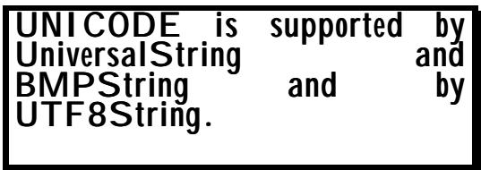

# Chapter 2 The character string types 
第二章 字符串类型

(Or: Overcoming Genesis Chapter 11!) （或者：克服创世记第 11 章的困难！）

Summary: This chapter discusses the complete set of character string types: 摘要：本章讨论了所有字符串类型的完整集合：

• NumericString • 数字字符串

• PrintableString • 可打印的字符串

• VisibleString (ISO646String)

• IA5String

• TeletexString (T61String)

• VideotexString • 视文本字符串

• GraphicString

• GeneralString

• UniversalString

• BMPString

• UTF8String • UTF8 字符串

It describes their value notations, and gives recommendations on their use. 它描述了这些数值的表示方式，并给出了关于如何使用的建议。

Discussion of the character string "hole" type - CHARACTER STRING - is deferred until Chapter 7 of this section. 关于字符串“hole”类型的讨论——即字符字符串的相关内容——将推迟到本部分的第七章再进行讨论。

## 1 Introduction 1 引言

Here we will describe all the available (up to 1988) character string types apart from "CHARACTER STRING", which is described later under "Hole Types". For a full understanding of these types, the reader must be aware of the various approaches that have been taken to character encoding schemes for computers generally over the years. A full discussion of this, and of the historical development of support for character string types in ASN.1, is 在这里，我们将介绍所有可用的字符串类型（截至 1988 年），除了“CHARACTER STRING”类型，后者将在后面的“漏洞类型”中进行讨论。要全面理解这些类型，读者需要了解多年来人们在计算机字符编码方面所采取的各种方法。关于这一点，以及 ASN.1 中字符串类型支持的历史发展，我们将在后续的内容中进行详细讨论。

And God was displeased with the people of Babel for building their tower unto heaven, and sent a thunderbolt and scattered the peoples to the corners of the world giving them different languages. 而上帝对巴比伦人的行为感到不满，因为他们建造了高达天空的塔楼。于是，上帝降下雷霆，将那些人驱散到世界各个角落，让他们拥有了不同的语言。

given in Section IV. Sufficient information is given here for the writing and understanding of ASN.1 specifications. If you want to skip some of this material, just go down to the section "Recommended character string types" (clause 13), and look at the paragraphs about the ones mentioned there. That is probably all you need! 在第四部分中已经提供了足够的信息，足以用于编写和理解 ASN.1 规范。如果您想跳过某些内容，只需前往“推荐的字符串类型”部分（第 13 条），然后查看那里提到的相关段落即可。这些内容应该就足够了！

Character string types are considered by some to be unnecessary (won't a good old OCTET STRING do the job?). (See figure 999!). Yes, an OCTET STRING could be used. But you would then need to spell out clearly the precise encoding to be used, and to make clear to implementors the range of characters that were to be supported. Moreover, that specification would be in normal human-readable text or in ASN.1 comment, could not be understood by any tool assisting an implementation, and (as it is new text) would be a potential source of ambiguity and interworking problems. 有些人认为字符串类型其实是不必要的（使用传统的 OCTET STRING 语法不就足够了？）。（参见图 999！）当然，也可以使用 OCTET STRING 语法。但此时就需要明确说明具体的编码方式，并且要让实现者清楚所支持字符集的范围。此外，这种规范通常是以人类可读的文本形式或 ASN.1 注释的形式出现的，因此不会被任何用于实现的工具理解。而且，由于这是一种新的规范，可能会带来一些歧义和问题。

The types provided in ASN.1 cover the spectrum from the simplest requirements to the most ambitious. In general, if your character set requirements for a particular string are restricted, use the more restricted character set types to make this clear, even if the encoding is the same as for a type with a wider character repertoire. 在 ASN.1 中提供的类型涵盖了从最基础的需求到最复杂的需求的各种情况。一般来说，如果某个字符串所需的字符集限制较多，那么应该使用更受限的字符集类型来表示这一点。即便编码方式与适用于更宽字符集的类型相同，也应使用更受限的类型。

Note also that some of the latest character string types can only easily be supported by a programming language (such as Java) that uses 16 bits per character, supporting the Unicode encoding scheme. (This scheme is fully described in Section IV). Increasingly, however, (late 1990s) programming languages and operating systems and browsers and word processors and .... are all providing Unicode support, either for the 16-bits-per-character repertoire, or in some cases for a 32-bits-per-character repertoire. 另外，一些最新的字符字符串类型只能由那些采用 16 位字符编码方式的编程语言来支持（例如 Java），这些编程语言支持 Unicode 编码方案。这一方案在第四部分中有详细的描述。不过，从 20 世纪 90 年代末开始，越来越多的编程语言、操作系统、浏览器、文字处理软件等也开始提供 Unicode 支持，无论是针对 16 位字符编码，还是在某些情况下针对 32 位字符编码。

This does not mean that if the application designer has specified a field as (for example) UTF8String or UniversalString, you cannot implement that protocol in a language (or operating system) that does not have Unicode support, it just means that it may be harder work! 这并不意味着，如果应用程序设计者将某个字段指定为 UTF8String 或 UniversalString 等类型，那么你就无法在不支持 Unicode 的语言或操作系统上实现该协议。不过，这样做可能会更麻烦一些而已！

## 2 NumericString 2 数字字符串

Values of the type are strings of characters containing the digits zero to 9 and space. The BER encoding is ASCII (8 bits per character), and the PER encoding is 4 bits per character unless the character repertoire has been further restricted by a "permitted alphabet constraint" (see Chapter 3 following), when it could be less. 这类值的类型是由字符组成的字符串，其中包含 0 到 9 的数字以及空格。BER 编码采用 ASCII 格式，即每个字符占用 8 位比特；而 PER 编码则每个字符仅占用 4 位比特。不过，如果由于“允许的字母表限制”而进一步限制了字符集的范围（详见第 3 章），那么 PER 编码所需的位数可能会更少。

## 3 PrintableString 3 可打印的字符串

Values of the type are strings of characters containing an ad hoc list of characters defined in a table in the ASN.1 specification, and copied here as Figure II-2. 这类值的本质是一类字符字符串，这些字符来自 ASN1 规范中定义的特定字符列表，如图 II-2 所示，这些字符被复制到这里。

This is basically the old telex character set, plus the lower case letters. You would probably tend not to use it today unless you had an application likely to be associated with devices with limited character input or display capabilities. 这基本上就是旧的电报字符集，再加上了小写字母。如今，除非有需要处理那些字符输入或显示能力有限的设备的应用程序，否则人们通常不会使用这个字符集了。

<table><tbody><tr><td data-imt-p="1">Name 名称</td><td data-imt-p="1">Graphic 图形/图像</td></tr><tr><td data-imt-p="1">Capital letters 大写字母</td><td data-imt-p="1">A, B, ... Z A、B、… Z</td></tr><tr><td data-imt-p="1">Small letters 小写字母</td><td data-imt-p="1">a, b, ... z a, b, … z</td></tr><tr><td data-imt-p="1">Digits 数字</td><td>0, 1, ... 9</td></tr><tr><td data-imt-p="1">Space 空间</td><td data-imt-p="1">(space) （空格）</td></tr><tr><td data-imt-p="1">Apostrophe 省略号</td><td>'</td></tr><tr><td data-imt-p="1">Left Parenthesis 左括号</td><td>(</td></tr><tr><td data-imt-p="1">Right Parenthesis 正确的括号使用</td><td>)</td></tr><tr><td data-imt-p="1">Plus sign 加号</td><td>+</td></tr><tr><td data-imt-p="1">Comma 逗号</td><td>,</td></tr><tr><td data-imt-p="1">Hyphen 连字符</td><td>-</td></tr><tr><td data-imt-p="1">Full stop 句号</td><td>.</td></tr><tr><td data-imt-p="1" data-imt_insert_failed_reason="same_text">Solidus</td><td>/</td></tr><tr><td data-imt-p="1">Colon 结肠</td><td>:</td></tr><tr><td data-imt-p="1">Equal sign 等号</td><td>=</td></tr><tr><td data-imt-p="1">Question mark 问号</td><td>?</td></tr></tbody></table>

## 4 VisibleString (ISO646String) 4 可见字符串（ISO646 字符串）

The name "ISO646String" is a deprecated synonym for VisibleString (deprecated because the name contains a Standard number which is not in fact used in its definition, post 1986!), but you may encounter it. The character repertoire is described in the very old ISO Standard ISO 646, which laid the foundation for the better-known ASCII. Whilst this character repertoire was originally strictly not ASCII, but rather "the International Reference Version of ISO 646", it was widely interpreted by all ASN.1 users and implementors as simple plain ASCII, but printing characters plus space only. The original definition was by reference to the ISO 646 Standard, but post-1986 the definition was formally "Register Entry 2 (plus space) of the International Register of Coded Character Sets to be used with Escape Sequences". (See Section IV for more detail). This was changed in 1994 to reference "Register Entry 6", which is strict ASCII, recognising the normal interpretation by ASN.1 users. The coding in BER is 8 bits per character, and it is the same in PER if there is no subtyping applied to the type to restrict the range of characters (if there is, it could be less). “ISO646String”这个名称是“VisibleString”的过时替代名称（之所以使用这个名称，是因为标准中使用了“Standard”这个词汇，但实际上在 1986 年之后就再也没有被使用了！）。不过，你仍有可能遇到这个名称。关于字符集的详细描述可以在非常古老的 ISO 标准 ISO 646 中找到，该标准为后来更为人熟知的 ASCII 标准奠定了基础。虽然最初这些字符并不属于 ASCII 范畴，而是属于“ISO 646 的国际参考版本”，但所有 ASN.1 的用户和实现者都将其简单地视为普通的 ASCII 字符集，即只包含字符和空格。最初的定义是基于 ISO 646 标准，但在 1986 年之后，定义被正式改为“国际编码字符集注册表中的第 6 个注册项（加上空格）”，用于与转义序列一起使用。（更多细节请参见第四部分）。这一定义在 1994 年进行了修改，改为以“第 6 个注册项”作为标准 ASCII 字符集，从而明确了其定义。由 ASN 的用户进行正常的解释。在 BER 中，每个字符的编码长度为 8 位；在 PER 中也是如此。如果不对类型进行子类型划分来限制字符范围，那么每个字符的编码长度就是 8 位（如果进行了子类型划分，则编码长度可能会减少）。

## 5 IA5String

"International Alphabet 5" is specified in a very old ITU-T Recommendation, which again was the original reference for this type. Again, this was close to ASCII (ASCII was a "national variant" of International Alphabet 5, but the type is widely assumed to mean simply "the whole of ASCII, including control characters, space, and del". The precise reference today is "Register Entries 1 and 6 (plus space and delete) of the International Register of Coded Character Sets to be used with Escape Sequences", which is strict ASCII. The encoding is again 8 bits per character (possibly less in PER). “国际字母表 5”是在一份非常古老的 ITU-T 建议书中规定的。实际上，这一标准最初就是以该文件为基准制定的。该标准与 ASCII 标准较为接近（ASCII 实际上是国际字母表 5 的“国家版本”），不过通常认为“国际字母表 5” simply 指的是“包括控制字符、空格以及删除符在内的完整 ASCII 标准”。目前，这一标准的确切依据是“国际编码字符集注册表中的第 1 条和第 6 条条目，再加上空格和删除符”，这完全符合严格的 ASCII 标准。该编码方式仍然是每个字符 8 位（在 PER 模式下可能会更少）。

## 6 TeletexString (T61String) 6 电信科技字符串（T61 字符串）

Again, the synonym is deprecated. Originally CCITT Recommendation T.61 specified the character repertoire for Teletex, and was referenced by the ASN.1 specification. (Today the corresponding specifications are in the ITU-T T.50 series.) The precise definition of this type has changed over time to reflect the increasing range of languages supported by the ITU-T teletex Recommendations. Today it includes Urdu, Korean, Greek, .... . Formally, it is Register Entries 6, 87, 102, 103, 106, 107, 126, 144, 150, 153, 156, 164, 165, 168, plus SPACE and DELETE! The encoding of each register entry is 8 bits per character, but there are defined escape codes (the ASCII "ESC" encoding followed by some defined octet values) to switch between the different register entries. It is quite hard to implement full support for this character string type, but it is extensively used in the X.400 and X.500 work. The character repertoires referenced have increased with each new version of ASN.1, and may continue to do so, under pressure to maintain alignment with the ITU-T Teletex Recommendations, which themselves are under pressure to support more and more of the world's character sets. This makes this type effectively an openended set of character repertoires, and would make any claims of "conformance" hard to define or sustain. Today, it is best avoided, but it was popular in the mid-1980s, and you will often encounter it. 同样，这个同义词就是“deprecated”。最初，CCITT 建议书 T.61 规定了 Teletex 使用的字符集，这一规定在 ASN.1 规范中也有提及。（如今，相应的规范属于 ITU-T T.50 系列。）随着时间的推移，这种类型的定义已经发生了变化，以反映 ITU-T Teletex 建议所支持的语言种类越来越多。如今，它包括了 Urdu、韩语、希腊语等语言。从正式定义来看，这些字符属于寄存器 6、87、102、103、106、107、126、144、150、153、156、164、165、168 这些寄存器，此外还有 SPACE 和 DELETE 字符。每个寄存器的编码都是 8 位一个字符，但还定义了一些转义码（如 ASCII 中的“ESC”编码，后面跟着一些特定的八位数值），用于在不同寄存器之间切换。要完全支持这种字符类型相当困难，不过它在 X.400 和 X.500 协议中得到了广泛的应用。随着每个新版本的 ASN 出现，所涉及的字符集范围都在不断扩大。由于需要保持与 ITU-T Teletex 推荐标准的兼容性，这些字符集继续会有所扩展。而 ITU-T Teletex 推荐标准本身也面临着支持更多全球字符集的压力。因此，这类字符集实际上是一个开放式的字符集，任何关于“符合标准”的声明都难以界定或维持。目前，最好避免使用这种字符集，但在 1980 年代中期，它却很流行，因此你经常会遇到它。

## 7 VideotexString 7 视频电话字符串

A little-used character string type that gives access to the "characters" used to build crude pictures on videotext systems. Typically a "character" is a 3x2 array, with each cell containing either a foreground colour or a background colour (determined by transmission of one of about five control characters), giving 64 different printing "characters" that can be used to build the picture. 这是一种使用频率较低的字符字符串类型，它提供了对用于构建 Videotext 系统中图像元素的“字符”的访问权限。通常，一个“字符”是一个 3x2 的数组，每个单元格中要么包含前景颜色，要么包含背景颜色（背景颜色由其中一个约五种控制字符的传输状态决定）。这样，就可以使用 64 种不同的“字符”来构建图像。

Formally, it is again a list of 17 register entries, partially overlapping those specified for TeletexString. 从形式上看，这仍然是一组包含 17 个寄存器条目的列表，其中部分条目与为 TeletexString 指定的条目有重叠。

## 8 GraphicString 8 图形字符串

This was a popular string type in the main OSI (Open Systems Interconnection) standards produced during the 1980s, and allowed any of the Register Entries in the International Register for printing characters (but not the control character entries). In its hey-day the International Register had a new entry added about every month or so, and eventually covered most of the languages of the world. If this text is used in an academic course, an interesting student exercise would be to discuss the implementation implications of using such a wide (and ever-expanding!) type definition. Since the development of ISO 10646/Unicode, additions to the International Register have become much less common, and coding schemes based on this Register can be regarded as obsolescent. 在 20 世纪 80 年代制定的 OSI 标准体系中，这种字符串类型非常流行。它允许使用国际字符注册表中的任何注册项（但不包括控制字符项）。在鼎盛时期，国际字符注册表大约每月会新增一项注册项，最终涵盖了世界上大多数语言。如果在学术课程中使用这种文本，一个有趣的课堂练习就是讨论使用如此广泛且不断扩展的定义所带来的实现问题。自从 ISO 10646/Unicode 问世以来，国际字符注册表的更新频率已经大大降低，基于该注册表的编码方案也被视为过时的技术了。

## 9 GeneralString 9 通用字符串

This is similar to GraphicString, except that the register entries for control characters (of which there are many) can also be used. 这与 GraphicString 类似，不过它还可以使用控制字符的寄存器条目（这些控制字符有很多）。

## 10 UniversalString 10 通用字符串

This is a string type that was introduced into ASN.1 in 1994, following the completion of the ISO Standard 10646 and the publication of the Unicode specification (see Section IV for more information on ISO 10646 and Unicode). The ISO 10646 standard (and the ASN.1 encoding in BER) envisages a 32-bits 这是一种在 1994 年引入 ASN.1 中的字符串类型。这一标准的制定是在 ISO 标准 10646 发布之后，同时也在 Unicode 规范发布之后进行的（有关 ISO 10646 和 Unicode 的更多信息，请参见第四部分）。ISO 10646 标准（以及 ASN.1 编码格式）规定使用 32 位来表示字符串。



per character encoding scheme, sufficient to cover all the languages of the world without using "combining characters", with a fair bit left over for the languages of Mars and most of the rest of the undiscovered Universe! It is only this type and UTF8String (see below) that can cover all the characters for which computer encodings have been defined (not quite true - there are some weird glyphs in the International Register that have not yet been put into ISO 10646). This type has not, however, proved popular among ASN.1 users. 按照这种字符编码方案，足以涵盖世界上所有语言的需求，而无需使用“组合字符”的方式。此外，还留有足够的空间来容纳火星上以及宇宙中尚未被发现的许多语言的字符！只有这种编码方式以及 UTF8String（见下文）能够涵盖所有已定义的计算机编码字符（不过并非完全如此——国际注册表中有一些奇怪的字符尚未被纳入 ISO 10646 标准）。不过，这种编码方式在 ASN.1 用户中并不受欢迎。

## 11 BMPString 11 BMP 字符串

The name comes from the "Basic Multilingual Plane" (BMP) of ISO 10646, which contains all characters with any commercial importance (all living languages), and can be encoded (and is in BER) with a fixed 16-bits per character. Whilst the formal ASN.1 definition references ISO 10646, the character set is the same as that defined in and more commonly known as the Unicode Standard produced by the Unicode Consortium. (Search the Web if you want to know more about 这个名称来源于 ISO 10646 标准中的“基本多语言平面”（Basic Multilingual Plane, BMP）。该标准包含了所有具有商业意义的字符，也就是所有活着的语言所使用的字符。这些字符可以通过固定的 16 位编码来表示，这种编码方式已经被广泛采用。虽然正式的 ASN.1 定义引用了 ISO 10646 标准，但实际上所使用的字符集与 Unicode 联盟制定的 Unicode 标准中的字符集是相同的。如果你想了解更多关于 Unicode 标准的信息，可以搜索一下吧。

Unicode, oar see Section IV). The fixed-size representation of 16-bits per character, holding Unicode characters, is becoming common in revisions of programming languages and operating systems, and is rapidly replacing ASCII as the default encoding for manipulating character data. This ASN.1 type was widely used during the mid-1990s by those application specifications upgrading to the 1994 ASN.1 specification. (It was not present in ASN.1 pre-1994). Unicode，请参见第四部分）。每个字符使用 16 位固定长度的编码方式来表示 Unicode 字符，这种编码方式在编程语言和操作系统的更新中越来越常见，并且正迅速取代 ASCII 成为处理字符数据时的默认编码方式。这种 ASN.1 类型在 20 世纪 90 年代中期被广泛使用，当时许多应用程序的规范都采用了这种编码方式，以符合 1994 年发布的 ASN.1 规范。在 1994 年之前的 ASN.1 规范中并未出现这种编码方式。

## 12 UTF8String

UTF8String is the recommended character string type for full internationalization without unnecessary verbosity. UTF8String 是被推荐用于完全国际化的字符字符串类型，它避免了不必要的复杂性。

This encoding scheme was developed in the mid-1990s and the type was added to ASN.1 in 1998. The acronym stands for "Universal Transformation Format, 8 bit", but that does not matter much. Formally, the character repertoire is exactly the same as UniversalString - all defined characters can be represented. 这种编码方案是在 1990 年代中期开发的，而该类型在 1998 年被添加到 ASN.1 标准中。其缩写意为“通用转换格式，8 位长度”，不过这个缩写其实并不重要。从形式上讲，这种编码方式与 UniversalString 完全相同——所有定义的字符类型都可以被用来表示。

UTF8 is, however, a variable length encoding for each character, with the rather interesting property that (7-bit) ASCII characters encode as ASCII - in a single octet with the top bit set to zero, and none of the octets in the representation of a non-ASCII character have the top bit set to zero. ASCII is paramount! Most European language characters (like c-cedilla or u-umlaut) will encode in two octets, and the whole of the Basic Multi-lingual Plane, together with all characters identified so far, encode in at most three octets per character. If we ever do populate the whole of the ISO 10646 32-bit space, then UTF8 would use a maximum of six octets per character. 不过，UTF8 是一种可变长度的字符编码方式。其独特之处在于：7 位的 ASCII 字符仍然以 ASCII 格式进行编码——即占用一个八位元，其中最高位为 0。而非 ASCII 字符在编码时，其最高位不会为 0。ASCII 编码非常重要！大多数欧洲语言中的字符（如 c-cedilla 或 u-umlaut）需要两个八位元来编码。而整个基本多语言平面中的字符，最多只需要三个八位元就能表示。如果我们真的要填满整个 ISO 10646 32 位空间，那么 UTF8 每个字符最多就需要六个八位元来编码。

Whilst use of a fixed 16-bits per character is becoming the norm for operating system interfaces and programming languages, use of UTF8 for storage and transmission of character data is the way everybody is going (as at mid-1999). As an implementor of an ASN.1-based application, you can expect that if you use an ASN.1 tool with a language that supports Unicode, the UTF8 transformations will be applied by the tool, invisibly to you, as part of the ASN.1 encode/decode process, giving you a simple 16-bits (or 32-bits) per character to work with in memory, but with an efficient transfer syntax. 虽然以固定 16 位来表示每个字符已成为操作系统接口和编程语言的标准做法，但在字符数据的存储和传输方面，使用 UTF8 格式才是未来的发展方向（至少在 1999 年中期是这样）。作为基于 ASN.1 的应用程序实现者，您可以放心，如果您使用支持 Unicode 的 ASN.1 工具，那么 UTF8 格式的转换将会在工具进行 ASN.1 编码/解码过程中自动完成，而您无需察觉。这样，您在内存中就可以使用简单的 16 位（或 32 位）字符表示方式，同时还能实现高效的传输效率。

## 13 Recommended character string types 推荐使用的 13 种字符串类型

So having read right to the end, you can now make an informed judgment on which character string types to use! Here it is assumed you are writing a new specification and will conform to the post-1994 ASN.1, and hence can use all the facilities in the latest ASN.1. (A fuller discussion of the pre-1994/post-1994 issues appears in Section IV). 因此，只要一直阅读到结尾，你现在就可以对应该使用哪种字符字符串类型做出明智的判断了！这里假设你正在编写新的规范，并且会遵循 1994 年之后的 ASN.1 标准，所以你可以使用最新版本的 ASN.1 中的所有功能。（关于 1994 年之前和之后标准的详细讨论请参见第四部分。）

If, for the expected implementation of your application, the input/output devices involved are likely to be able to handle the full Unicode 如果您的应用程序按计划实施，那么相关的输入/输出设备应该能够处理完整的 Unicode 字符集。

For full internationalization, use UTF8String. Otherwise use the most restrictive character string type available for your needs. If input/output devices restrict your application, consider NumericString or PrintableString or VisibleString or IA5String. 如果需要完全实现国际化功能，建议使用 UTF8String 类型。否则，可以根据实际需求选择最严格的字符字符串类型。如果输入/输出设备对应用程序的使用有限制，可以考虑使用 NumericString、PrintableString、VisibleString 或 IA5String 类型。

character set, and you want to be as general as possible, then UTF8String is for you! The earlier UniversalString and BMPString offer few if any advantages, and should be ignored. If, however, input or output is likely to be done on more limited devices, then you may wish to consider a more restricted character string type. 如果你希望实现尽可能通用的字符集处理，那么 UTF8String 就是理想的选择！之前的 UniversalString 和 BMPString 这两种字符集类型几乎没有优势，因此可以忽略它们。不过，如果输入或输出的操作可能是在较为有限的设备上进行的，那么你可以考虑使用一些功能较为有限的字符集类型。

GeneralString and GraphicString, based on the International Register are obsolete, and there is no case for using them in new specifications, although they were important in the 1980's. 基于国际注册标准的 GeneralString 和 GraphicString 已经过时了，在新规范中不再推荐使用它们。不过，在 1980 年代时，这些标准确实发挥了重要作用。

The same remark applies to TeletexString (T61String) and VideotexString: you are unlikely to want to use these unless you have strong links to the associated ITU-T Recommendations. 同样的道理也适用于 TeletexString (T61String)和 VideotexString：除非您与相关的 ITU-T 建议有紧密的联系，否则您不太可能会使用这些字符串。

If your application does require use of input/output devices that may only be able to support a limited range of characters, then you must seriously consider using only NumericString, PrintableString, VisibleString (ISO646String), or IA5String. NumericString is very limited, and is not fully international, but is better from the internationalization point of view than the other three (arabic numbers are accepted over more of the world than the full range of ASCII characters). PrintableString has the slight merit that it is hard-wired into ASN.1, so there can be no misunderstandings about what characters are included, but it is essentially a cut-down ASCII with few advantages over ASCII. If you want full ASCII, then you need VisibleString (no control characters) or IA5String (includes control characters). This will be fine for English-speaking communities, and is livable-with for a number of other European languages, but is generally deprecated in any sort of international specification. 如果您的应用程序确实需要使用输入/输出设备，而这些设备可能只能支持有限的字符集，那么您应该考虑仅使用 NumericString、PrintableString、VisibleString（ISO646String）或 IA5String。NumericString 的局限性很大，且并非完全符合国际化标准；但从国际化的角度来看，它比其他三种方式要好一些（因为除了全部 ASCII 字符外，它还支持阿拉伯数字）。PrintableString 的优点在于它已硬编码到 ASN.1 中，因此不会出现关于所包含字符的误解；但实际上它不过是经过精简的 ASCII 版本，与其他 ASCII 格式相比并没有什么优势。如果您需要完整的 ASCII 字符集，那么您需要使用 VisibleString（因为它不包含控制字符），或者 IA5String（因为它包含了控制字符）。这种方式适用于英语为母语的社区，对于其他一些欧洲语言来说也是可行的，但在任何国际规格标准中通常都被不推荐使用。

Ultimately, the choice has to be yours as the application designer - ASN.1 merely provides the notational tools, but you probably want to restrict your choice to NumericString, PrintableString, VisibleString, IA5String, and UTF8String. You should use UTF8String if input\\output devices are not likely to play a strong determining role in implementations of your application (for example, if all associated input\\output will be using general-purpose computer software for keyboard input and display). 最终，这个选择还是由应用程序设计者您来决定。 ASN.1 只是提供了相关的符号表示方式，但您或许希望将选择范围限制在 NumericString、PrintableString、VisibleString、IA5String 和 UTF8String 这几种类型上。如果输入输出设备不太可能在应用程序的实现中起到重要作用（例如，如果所有相关的输入输出都通过通用计算机软件进行键盘输入和显示），那么建议使用 UTF8String 类型。

## 14 Value notation for character string types 14. 字符串类型的数值表示方式

This book gives full coverage of the ASN.1 notation, but there are a number of parts of that notation that you will rarely need or encounter. Value notation for character strings is in that category, and value notation for control characters or characters appearing in several languages is even less commonly needed. Skip-read this section and return to it later if you find you need it! 这本书全面介绍了 ASN.1 表示法。不过，该表示法中有一些部分很少被使用或遇到。字符字符串的值表示法就属于这类情况；而用于控制字符或来自多种语言的字符的值表示法则更是不常被需要的。如果你之后觉得需要这部分内容，可以跳过它，之后再回来学习吧！

Names exist for all UNICODE characters, and can be used in ASN.1 to give precision to the specification of character string values without concern about ambiguity of glyphs or the character set available on your publication medium. Cell references can also be used. 对于所有 UNICODE 字符，都有相应的名称可用。在 ASN1 中可以使用这些名称来精确指定字符串值，而无需担心字形表示上的歧义或出版物介质上可用的字符集问题。此外，还可以使用单元格引用来进行引用。

The only value notation for character string types pre-1994 was to list the characters in quotation marks. This was fine for simple repertoires like PrintableString, but did not enable control characters to be specified for a type such as IA5String, and gives ambiguity problems in printed specifications with strings such as 在 1994 年之前，用于字符字符串类型的唯一值表示方法是用引号来列出字符。这种方法适用于像 PrintableString 这样的简单类型，但无法为像 IA5String 这样的类型指定控制字符。此外，这种表示方式在打印规格说明中也会造成歧义问题。

## "HOPE" “希望”

if the repertoire includes Cyrillic and Greek as well as ASCII! (Each of these four glyphs appears as a character in more than one of these alphabets). There are also potential problems in printed specifications in determining what white space in character string values is intended to represent (how many spaces, "thin" spaces, etc). 如果词汇表不仅包括西里尔字母和希腊字母，还包括 ASCII 字符的话，那么情况就会更复杂了！因为这四种字符在多种字母表中都作为独立的字符出现。此外，在打印规格中确定字符串值中的空白字符代表什么含义时，也可能出现一些问题——比如需要几个空格、什么样的“瘦型”空格等。

Post 1994, two additional mechanisms are available for defining a character string precisely, both of them based on listing the characters individually. 自 1994 年之后，又有两种方法来精确定义字符串，这两种方法都是基于逐个列出字符的方式来进行的。

The notation is illustrated by the following: 这种表示方式可以用以下例子来说明：

```txt
my-string1 UTF8String ::= {cyrillicCapitalLetterEn,
    greekCapitalLetterOmicron,
    latinCapitalLetterP,
    cyrillicCapitalLetterIe} 
```

```autohotkey
my-string4 IA5String ::= { {0, 0}, {0, 1}, {0, 3}, "ABC", {7, 15} } 
```

As you will guess, my-string3 is the same as my-string1 (and could be printed as "HOPE"!), and my-string4 is the same as my-string2. The last two notations reference the cells (giving group, plane, row, cell) of ISO 10646 or of ASCII (formally, of Register Entry 6 of the International Register) (giving table column as 0 to 7 and table row as 0 to 15). 如你所料，my-string3 与 my-string1 相同（可以打印为“HOPE”！），而 my-string4 则与 my-string2 相同。后两个表示方式分别指向了 ISO 10646 标准中的单元格（包括组、平面、行、单元格信息），或者 ASCII 标准中的单元格信息（具体位置为国际注册表中的第 6 个寄存器）。其中，表格的列编号为 0 到 7，行的编号为 0 到 15。

The last two notations can be used freely, but the character names used in the first two notations are only available if they have been imported into your module from a module which is defined (algorithmically) in the ASN.1 specification by reference to character names assigned in ISO 10646 (and Unicode). 最后两种表示方式可以随意使用，但前两种表示方式中使用的字符名称只有在从符合 ASN.1 规范的模块中导入时才能使用，而该模块必须通过引用 ISO 10646 标准（以及 Unicode）中定义的字符名称来定义。

To make the above value notations valid, you need the following IMPORTS statement in your module: 为了使上述数值表示法有效，你需要在你的模块中添加以下导入语句：

```txt
IMPORTS cyrillicCapitalLetterEn, greekCapitalLetterOmicron,
latinCapitalLetterP, cyrillicCapitalLetterIe,
nul, soh, etx, del FROM
ASN1-CHARACTER-MODULE
{joint-iso-itu-t asn1(1) specification(0) modules(0) iso10646(0)}; 
```

You will also note that you can mix the different notations - character names, quoted strings, cell references - within a single value definition. 您还会注意到，可以在一个值定义中混合使用不同的表示方式——比如字符名称、带引号的字符串，以及单元格引用等。

The above works, but if your "HOPE" was actually intended to be the ASCII characters, there is a less verbose method available post-1998. You can simply write: 上述方法可以起作用，但如果你希望“HOPE”实际上代表的是 ASCII 字符，那么自 1998 年之后有一种更简洁的方法可用。你可以简单地这样写：

```txt
my-string5 UTF8String(BasicLatin)::= "HOPE" 
```

where "BasicLatin" is imported from the ASN.1 module. You can then, in a SEQUENCE say, have an element: 在“BasicLatin”从 ASN.1 模块导入之后，你可以像在序列中那样定义一个元素：

```txt
string-element UTF8String DEFAULT my-string5 
```

What we are doing here is fairly obvious - we are "qualifying" the UTF8String type to say that we are only using the BasicLatin (ASCII) part, so the "HOPE" is now unambiguously the ASCII characters. Note that in the SEQUENCE, we use the full UTF8String type. This rather simple notation rests on two powerful and general concepts, those of subtyping and of value mappings. Subtyping is the definition of a new type which contains only a subset of the values of the socalled parent type. In this case the parent type is "UTF8String", and we are using a subtype of that (defined in the ASN.1 module) called "BasicLatin" to subtype it here. The above example could actually have been written: 我们在这里所做的操作相当直观——我们正在对 UTF8String 类型进行“限定”，即只使用 BasicLatin（ASCII）部分的数据。这样一来，“HOPE”就明确地指代了 ASCII 字符。需要注意的是，在 SEQUENCE 中，我们使用了完整的 UTF8String 类型。这种简单的表示方式基于两个强大的概念：子类型定义和价值映射。子类型定义是指创建一种新类型，该类型仅包含父类型部分值的子集。在这个例子中，父类型是“UTF8String”，而我们使用的子类型则是定义在 ASN.1 模块中的“BasicLatin”。实际上，上述示例也可以这样表述：

## my-string5 BasicLatin ::= "HOPE" my-string5 基本拉丁文 ::= "HOPE"

which perhaps makes it clearer that "my-string5" is latin characters, but makes it less clear that it can be used as a DEFAULT value for UTF8String (although it still can). Subtyping is discussed in more detail in the next chapter. Whichever way "my-string5" is defined, its use as a default value for UTF8String is dependent on a general concept in ASN.1 that if something is a valuereference-name of a subtype of some type, it can also be used as a value-reference-name for a value of the parent type, and in some cases of other "similar" types. This is the value mapping concept in the ASN.1 semantic model (introduced briefly in Section I and discussed more fully in Section IV), and in this case allows "my-string5" to be used not just as a value for UTF8String, but also, should you wish it, as a value for PrintableString and VisibleString. 这可能使得“my-string5”被明确视为拉丁字符，但就不太可能被当作 UTF8String 的默认值了（尽管它仍然可以充当这一角色）。关于类型继承的问题，将在下一章中详细讨论。无论“my-string5”是如何定义的，它作为 UTF8String 的默认值，都基于 ASN.1 中的一个通用概念：如果某个值是某个子类型的价值引用名，那么它也可以作为父类型的值使用，在某些情况下，甚至可以用于其他“类似”的类型。这就是 ASN.1 语义模型中的值映射概念（在第一节中简要介绍，在第四节中进行了更深入的讨论）。在这种情况下， “my-string5”不仅可以作为 UTF8String 的值使用，如果愿意的话，也可以作为 PrintableString 和 VisibleString 的值使用。

## 15 The ASN.1-CHARACTER-MODULE 15 ASN.1-CHARACTER-MODULE

This module has been mentioned above. It provides value-reference-names for all the ASCII control characters (explicitly listed), and for all the characters in Unicode/ISO 10646. The character names listed in the ISO 10646 Standard (and Unicode) are given in all upper case with spaces between words. To convert to an ASN.1 name you keep the upper case letter for the first letter of every word except for the first name, change all other letters to lower-case, then remove the spaces! This produces the names we used above, and also the rather long name: 这个模块已经在上面被提及过了。它为所有 ASCII 控制字符（明确列出的字符）以及 Unicode/ISO 10646 中的字符提供了名称。ISO 10646 标准中列出的字符名称（以及 Unicode 中的字符名称）都是用全大写字母表示的，单词之间用空格分隔。要将其转换为 ASN.1 格式的名称，可以将每个单词的第一个字母保持为大写，其余字母都转换为小写，然后去掉空格。这样就能得到我们上面使用的那些名称，还包括那个相当长的名称。

## cjkUnifiedIdeograph-4e2a cjk 统一字素-4e2a

for the Chinese/Japanese/Korean (CJK) character which looks (to a Western eye!) like a vertical bar with a caret over it, and is named in ISO 10646 as "CJK Unified Ideograph-4e2a".. 对于中文/日语/韩语字符来说，这个字符在西方人的眼中看起来就像一个带有冒号的垂直条状符号。在 ISO 10646 标准中，这个字符被命名为“CJK 统一表意文字-4e2a”。

ISO 10646 also defines 84 collections - useful sets of characters. These names are mapped into ASN.1 names for subtypes of UTF8String by the same algorithm, except that as they are types (sets of string values, not single character values), they keep their initial upper-case letter. Here are a few examples of the names that are available for import: ISO 10646 还定义了 84 种字符集——这些都是有用的字符集合。这些名称通过相同的算法被映射到 UTF8String 子类型的 ASN.1 名称中。不过，由于这些名称属于类型（即字符值集合，而非单个字符值），因此它们保留了初始的大写字母形式。以下是一些可用于导入的名称示例：

```txt
BasicLatin
Latin-1Supplement
LatinExtended-A
IpaExtensions
BasicGreek
SuperscriptsAndSubscripts
MathematicalOperators
BoxDrawing
etc 
```

## 16 Conclusion 16 结论

The ASN.1 character string types have evolved over time as the character set standards themselves have changed, and as input/output devices and packages have become more capable of handling a wider and wider range of characters. ASN.1 字符字符串类型随着时间的推移而不断发展演变。随着字符集标准本身的变化，以及输入/输出设备和软件包能力的提升，它们能够处理的范围也越来越广。

Partly to provide a mechanism that would accommodate any character repertoire and encoding scheme, the CHARACTER STRING hole type was introduced. This is described in a later chapter. 为了容纳各种字符集和编码方式，引入了“字符字符串”这一数据类型。关于这一点，将在后面的章节中进行详细说明。

Mechanisms were also added over time to provide for a more precise tailoring of character repertoires to user's needs, and to provide a precise and unambiguous value notation for character strings which does not depend on (the perhaps restricted set of) glyphs available for any printed ASN.1 specification, or on the character repertoire (such as perhaps only ASCII) available for any machine-readable ASN.1 specification. 随着时间的推移，还增加了一些机制，以便能够根据用户的需求更精确地调整字符集的构成。此外，还为字符字符串提供了一种精确且明确的价值表示方式，这种表示方式不依赖于任何印刷形式的 ASN1 规范中可用的字符集，也不依赖于任何机器可读取的 ASN1 规范中提供的字符集（例如，可能只有 ASCII 字符集）。

The end result is a perhaps confusing, but wide-ranging and up-to-date set of types for character string fields. 最终得到的是一套或许有些复杂，但覆盖范围广且最新的字符字符串字段类型定义。
