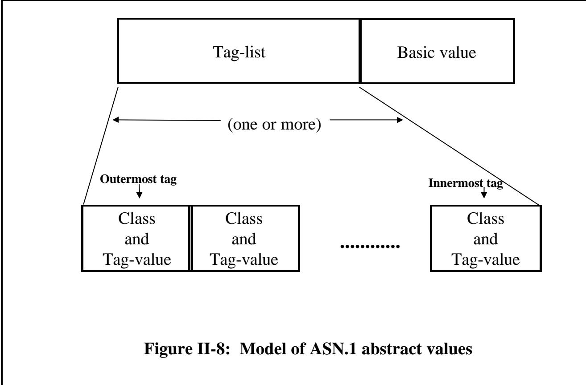

# Chapter 4 Tagging 第四章 标签标注

# (Or: Control it or forget it!) （或者：控制它，或者就放弃吧！）

Summary: Tagging was an important (and difficult!) part of the ASN.1 notation pre-1994. Its importance (and the need to understand it) is much less now, due to three factors: 总结：在 1994 年之前，标签标注是 ASN.1 表示法中的一个重要环节（而且相当复杂）。不过，由于三个原因，现在这一环节的重要性已经大大降低，人们不需要再深入了解它了。

the ability to set an AUTOMATIC TAGS environment in the module header as described in Section I Chapter 3; 能够像第 3 章第一节所描述的那样，在模块头文件中设置自动标签环境；

• the provision for extensibility without relying on tags to achieve this; • 提供了无需依赖标签即可实现扩展性的功能；

• the introduction of PER which does not encode tags. • 引入了不编码标签的 PER 技术。

There are four tag classes: 共有四个标签类别：

• UNIVERSAL • 普适性

• APPLICATION • 应用

• PRIVATE • 私人定制

• context-specific • 特定上下文的

and a tag value is a class and a number (zero upwards, unbounded). 一个标签值由一个类和一个数字组成（数字范围是从 0 开始的，且无上限）。

This chapter describes the requirements on use of tags in a legal piece of ASN.1, and gives stylistic advice on the choice of tag class. 本章阐述了在合法的 ASN1 代码中使用标签的要求，同时提供了关于选择标签类的风格建议。

## 1 Review of earlier discussions 1. 对之前讨论内容的回顾

We have already discussed the idea of including tags, and have introduced the concepts of implicit tagging and explicit tagging, describing these in terms of their effect on a BER encoding: changing the "T" in the TLV for the type (implicit tagging), or adding a new TLV wrapper (explicit tagging). 我们已经讨论过添加标签的想法，并且介绍了隐式标签和显式标签的概念。具体来说，这两种标签方式对 BER 编码的影响如下：改变类型字段中的“T”值（隐式标签方式），或者添加一个新的 TLV 包装器（显式标签方式）。

This is clearly not an academically 这显然并非一种学术上的表达方式。

Tags were originally closely related to the "T" in the "TLV" of the Basic Encoding Rules (BER), and gave users control over the "T" values used for different elements and choices. This was important if interworking between version 1 and version 2 was to be easy in a BER environment with no explicit extensibility marker. 这些标签最初与“基本编码规则”中的“T”字符密切相关。在版本 1 与版本 2 之间实现无缝协作时，这些标签能够让用户灵活地控制用于不同元素和选择的“T”值。这一点在缺乏明确的可扩展性标记的情况下显得尤为重要。

satisfactory way of discussing tagging (but might satisfy many readers!), given that the notation is supposed to be independent of the encoding rules, and that there are now other ASN.1 encoding rules that do not use the "TLV" concept. We will therefore introduce below an encoding-ruleindependent, and slightly more abstract (sorry!), description of tags. 这是一种不错的标签讨论方式（而且应该能吸引许多读者的兴趣！），因为这种表示方式应该是独立于编码规则的。此外，现在还有其他 ASN.1 编码规则，它们并不使用“TLV”这一概念。因此，我们在下面会介绍一种独立于编码规则的描述方式，这种描述方式稍微抽象一些（抱歉！）。

In earlier text we have implied (wrongly!) - but never stated! - that the name-space for tag values is a simple integer. Indeed, we did use a tag "\[APPLICATION 1\]" in figure 21, which might imply a more complex name-space. We describe below the complete set of available values for tags, and the way these are normally used. 在之前的文本中，我们错误地推测——但实际上并没有明确说明——标签值的命名空间实际上只是一个简单的整数。的确，在图 21 中，我们确实使用了标签“\[APPLICATION 1\]”，这可能意味着其命名空间更为复杂。下面我们将详细介绍标签的所有可用值以及这些值的正常使用方式。

Finally, we have already briefly mentioned that there are rules about when tags are required to be distinct (broadly, wherever the "T" of a TLV needs to be distinct from that of some other TLV to ensure unambiguity in BER encodings). We give below the actual rules. 最后，我们已经简要提到了关于何时需要使标签具有区分性的规则（一般来说，当某个 TLV 的“T”需要与其他 TLV 的“T”区分开来，以确保 BER 编码的清晰性时，就需要确保标签是独特的）。下面我们将给出具体的规则。

But as a last important reminder: post-1994 you can establish an automatic tagging environment in which you need know nothing about tags, and need never include them in your type definitions. This is the recommended style to adopt for new specifications, and is absolutely the right approach for anybody who gets confused with the text below! 但最后要提醒一下：自 1994 年之后，你可以创建一个自动标记的环境，在这种环境中，你无需了解任何与标签相关的内容，也无需在类型定义中包含这些标签。这是为新的规范推荐采用的风格，对于任何容易混淆文本内容的人来说，这绝对是正确的做法！

Let us look at the global level for a moment. Wherever ASN.1 requires or allows type-notation, it is permissible to write: 让我们来看看全球范围内的情况。在那些要求或允许使用类型表示法的环境中，我们可以这样书写：

tag-notation type-notation 标签标记 类型标记

In other words, tagging is formally defining a new type from an old type, and tag notation can be repeatedly applied to the same type notation. So the following is legal: 换句话说，标签化实际上是从一个旧的类型中定义一个新的类型，而标签表示法可以反复应用于同一个类型。因此，以下这种用法是合法的：

My-type ::= \[APPLICATION 1\] \[3\] INTEGER 我的类型 ::= \[应用 1\] \[3\] 整数

but would be rather pointless in an environment of implicit tagging, as the "\[3\]" is immediately over-ridden! You will rarely see this sort of construction - tag-notation is normally applied to a type-reference or to untagged type-notation. 但在隐式标签化的环境中，这种表达方式其实没什么意义，因为“\[3\]”这样的标签很快就会被覆盖掉！这种构造方式很少被使用——通常，标签标记是用于类型引用或未标记的类型表示上的。

Finally, if a type is defined using tag-notation, the tag-notation is ignored for the purposes of value-notation. Value notation for My-type above is still simply "6" (for example). 最后，如果某个类型是通过标签符号来定义的，那么在这种情况下，标签符号将被忽略，采用数值表示方式来表示该类型。上面提到的 My-type 类型，其数值表示方式仍然只是简单地写作“6”而已。

## 2 The tag namespace 2 标签命名空间

Staying with BER encodings for the moment: a tag encodes in 7 bits of the "T" part of a BER TLV. 目前，我们仍继续使用 BER 编码方式。在这种编码中，一个标签会用 7 位来表示 BER TLV 中“T”部分的内容。

The remaining bit is nothing to do with tagging, and is set to one if the "V" part is itself a series of TLVs (a constructed encoding such as that used for "SEQUENCE" or "SET"), and 剩下的部分与标签无关，如果“V”部分本身是由一系列 TLV 构成的（这是一种自定义的编码方式，例如用于表示“序列”或“集合”），那么就会设置为 1。

## Tags 标签

• \[UNIVERSAL 29\]: do not use UNIVERSAL class tags. • \[通用类 29\]: 不要使用通用类标签。

• \[APPLICATION 10\]: use for commonly used types or top-level messages. Do not re-use. • \[应用 10\]: 用于常见的类型或顶级消息。请勿重复使用。

\[PRIVATE 0\]: Rarely seen. Use to extend a standard with private additions (if you really must!). \[私有模式 0\]: 较为罕见的使用方式。通常用于对标准模式进行扩展，以加入一些私有的调整（当然，只有在绝对需要的情况下才使用！）

• \[3\]: Use and re-use in a different context. The most common form of tagging. • \[3\]：在不同情境下使用与重用。这是最常见的标签形式。

to zero if the "V" part is not composed of further TLVs (a primitive encoding such as that used for "INTEGER" or "BOOLEAN" or "NULL"). 如果“V”部分并不由更多的 TLV 组成（即是一种简单的编码方式，比如用于“INTEGER”、“BOOLEAN”或“NULL”的编码方式），那么此时该字段的值就为零。

A tag is specified by giving a class and a tag-value (the latter is indeed a simple positive integer - zero upwards, unbounded). But the class is one of four possibilities: 一个标签是通过提供一个类和一个标签值来指定的（后者实际上只是一个简单的正整数——可以为零或更高）。而该类则有四种可能性：

UNIVERSAL class APPLICATION class PRIVATE class context-specific class 通用类 应用程序类 私有类 特定上下文类

<table><tbody><tr><td data-imt-p="1">UNIVERSAL 0 通用 0</td><td data-imt-p="1">Reserved for use by the encoding rules 预留用于编码规则的使用</td></tr><tr><td data-imt-p="1">UNIVERSAL 1 宇宙 1</td><td data-imt-p="1">Boolean type 布尔类型</td></tr><tr><td data-imt-p="1">UNIVERSAL 2 《宇宙 2》</td><td data-imt-p="1">Integer type 整数类型</td></tr><tr><td data-imt-p="1">UNIVERSAL 3 《宇宙 3》</td><td data-imt-p="1">Bitstring type 位串类型</td></tr><tr><td data-imt-p="1">UNIVERSAL 4 通用 4</td><td data-imt-p="1">Octetstring type 八进制字符串类型</td></tr><tr><td data-imt-p="1">UNIVERSAL 5 宇宙之音 5</td><td data-imt-p="1">Null type 空类型</td></tr><tr><td data-imt-p="1">UNIVERSAL 6 通用 6</td><td data-imt-p="1">Object identifier type 对象标识符类型</td></tr><tr><td data-imt-p="1">UNIVERSAL 7 宇宙 7</td><td data-imt-p="1">Object descriptor type 对象描述符类型</td></tr><tr><td data-imt-p="1">UNIVERSAL 8 宇宙 8</td><td data-imt-p="1">External type and Instance-of type 外部类型与实例类型</td></tr><tr><td data-imt-p="1">UNIVERSAL 9 通用 9</td><td data-imt-p="1">Real type 真正的类型</td></tr><tr><td data-imt-p="1">UNIVERSAL 10 通用 10</td><td data-imt-p="1">Enumerated type 枚举类型</td></tr><tr><td data-imt-p="1">UNIVERSAL 11 通用 11</td><td data-imt-p="1">Embedded-pdv type 嵌入式 PDV 型</td></tr><tr><td data-imt-p="1">UNIVERSAL 12 通用 12</td><td data-imt-p="1">UTF8String type UTF8String 类型</td></tr><tr><td data-imt-p="1">UNIVERSAL 13 - 15 宇宙系列 13 - 15</td><td data-imt-p="1">Reserved for future editions of this Recommendation | International Standard 预留用于本建议书的未来版本 | 国际标准</td></tr><tr><td data-imt-p="1">UNIVERSAL 16 通用 16</td><td data-imt-p="1">Sequence and Sequence-of types 序列与类型序列</td></tr><tr><td data-imt-p="1">UNIVERSAL 17 宇宙 17</td><td data-imt-p="1">Set and Set-of types 集合类型与集合类型集合</td></tr><tr><td data-imt-p="1">UNIVERSAL 18-22 通用版 18-22</td><td data-imt-p="1">Character string types 字符字符串类型</td></tr><tr><td data-imt-p="1">UNIVERSAL 23-24 普世性 23-24</td><td data-imt-p="1">Time types 时间类型</td></tr><tr><td data-imt-p="1">UNIVERSAL 35-30 通用版 35-30</td><td data-imt-p="1">More character string types 更多的字符字符串类型</td></tr><tr><td data-imt-p="1">UNIVERSAL 31-... 通用 31-…</td><td data-imt-p="1">Reserved for addenda to this Recommendation | International Standard 预留用于本建议书的补充内容｜国际标准</td></tr></tbody></table>

Figure II-7: Assignment of UNIVERSAL class tags 图 II-7：通用类标签的分配情况

In the tag notation, a number alone in square brackets denotes the tag-value of a context-specific class tag. For the other classes, the name (all upper-case) of the class appears after the opening square bracket. 在标签表示法中，仅一个数字放在方括号中就能表示某个上下文特定的类标签及其值。对于其他类，类的名称（全部大写）则出现在第一个方括号之后。

For example: 例如：

```txt
[UNIVERSAL 29] tag-value 29, "universal" class
[APPLICATION 10] tag-value 10, "application" class
[PRIVATE 0] tag-value 0, "private" class
[3] tag-value 3, "context-specific" class 
```

I like to think of the four classes of tag as just different "colours" of tag (red, green, blue, yellow). The actual names do not matter. For most purposes, the "colour" of the tag does not matter either! All that matters is that tags be distinct where so required, and they can differ either in their "colour" (class) or in their tag-value. The colour you choose to use is mainly a matter of style. 我喜欢将这四种标签类别视为不同的“颜色”——红色、绿色、蓝色、黄色。这些名称本身并不重要。在大多数情况下，标签的“颜色”也并不重要！重要的是，标签要具有区分性，并且它们可以在“颜色”或标签值上进行区分。你选择使用的颜色主要是出于风格考虑而已。

There is only one hard prohibition: users are not allowed to tag types with a UNIVERSAL class tag. This class is (always) used for the "default tag" on a type, and values of such tags can only be assigned within the ASN.1 specification itself. 只有一条严格禁止的规定：用户不得使用“UNIVERSAL”类标签来标记类型。这个类始终用于标记类型的“默认标签”，而此类标签的值只能定义在 ASN.1 规范本身中。

Figure II-7 is a copy of a table from X.680/ISO 8824-1 (including all amendments up to September 1998), and gives the UNIVERSAL class tag assigned as the default tag (used unless overridden by implicit tagging) for each of the type notations and constructor mechanisms defined in ASN.1. 图 II-7 是 X.680/ISO 8824-1 标准的表格副本（包含截至 1998 年 9 月的所有修订内容）。该图表列出了在 ASN 中定义的每种类型标记和构造机制所默认的通用类标签。除非有明确的标签规定，否则将使用这些默认的标签。

The main reason for forbidding use of UNIVERSAL class tags by users is to avoid problems when future extensions to ASN.1 occur. It is, however, important to note that this is no real hardship, as every tag has equal status with every other tag, no matter what its "colour" (class). 禁止用户使用通用类标签的主要原因是避免在未来对 ASN 进行扩展时产生问题。不过，需要注意的是，这实际上并不算什么大问题，因为无论某个标签的“类别”如何，它与其他标签一样，都具有同等的重要性。

There have been specifications that conformed to pre-1994 ASN.1, but wanted to use UTF8String (added 1998), and decided to copy the text of the post-1994 definition into their own application specification. This is probably harmless, but is strictly in violation of the specification. As well as being illegal, it is also unnecessary to copy the text and to assign a UNIVERSAL class tag in the copied text - an APPLICATION class tag can be used in the definition of the type, and provided the type is implicitly tagged wherever it is used, the end-result is indistinguishable from an initial assignment with a UNIVERSAL class tag, as later implicit tagging will override either. 有一些规范遵循了 1994 年之前的 ASN1 标准。不过，他们希望使用 UTF8String 这个类型（该类型是在 1998 年添加的），因此决定将 1994 年之后的定义内容复制到他们自己的应用规范中。这或许并无大碍，但实际上这违反了规范的规定。此外，复制定义内容并为其分配一个“通用类标签”也是不必要的——在类型定义中可以使用“应用类标签”。只要类型在使用的任何地方都自动带有标签，那么最终的结果与最初使用“通用类标签”进行标记并无区别，因为后续的隐式标记会覆盖掉“通用类标签”的标记。

So what about the other three classes of tag? Which one should be used when? To repeat: they are all equivalent. Use PRIVATE class tags absolutely everywhere if you wish! But as a matter of style, most people use context-specific class tags most of the time (they are the easiest to write - just a number in square brackets!). The name "context-specific" implies that they are only unambiguous within some specific context (typically within a single SEQUENCE, SET, or CHOICE), and it is normal to use (and to re-use) these tags (from zero upwards) whenever you need to tag the alternatives of a CHOICE or the elements of a SEQUENCE or SET to conform to the rules requiring distinct tags in particular places (see below). 那么，其他三种类别的标签又该如何使用呢？在什么时候应该使用哪一种标签呢？再次强调：这三种标签都是等效的。如果你愿意，完全可以随时随地使用“私有”类别标签！不过从风格上来说，大多数人通常都会使用与上下文相关的标签（因为这样更容易编写——只需在方括号中填入一个数字即可）。所谓“与上下文相关的标签”，意味着这些标签只在特定上下文内具有明确的含义（通常是在某个序列、集合或选择项中）。因此，当你需要为选择项的选项或序列、集合中的元素添加标签时，通常会使用这些标签（可以反复使用），以符合某些地方对特定标签的严格要求（详见下文）。

It is also common practice (but by no means universal nor required) to use APPLICATION class tags in the following way: 通常的做法是（不过这并非普遍现象，也不一定是必需的）以以下方式使用 APPLICATION 类标签：

• An application class tag is only used once in the entire application specification, it is never applied twice. • 在整个应用程序规范中，应用类标签只会被使用一次，绝不会重复使用。

If the outer-most type for the application is a CHOICE (it usually is), then each of the alternatives of that choice are tagged (implicitly if possible) with APPLICATION class tags (usually \[APPLICATION 0\], \[APPLICATION 1\], \[APPLICATION 2\], etc). We saw this approach in Figure 21 of Section I Chapter 3. 如果应用程序的最外层类型是一个 CHOICE 类型（通常都是这样），那么该选择中的每个选项都会被附加上 APPLICATION 类标签（如果可能的话，这些标签会自动添加，通常是\[APPLICATION 0\]、\[APPLICATION 1\]、\[APPLICATION 2\]等）。我们在第 3 章第 1 节的图 21 中看到了这种处理方式。

If there are some complex types that are defined once and then used in many parts of the application specification, then when they are defined they are given an application class tag (and this tag is never given to anything else), so they can be safely used in a choice (for example) with no danger of a violation of any rules requiring distinct tags (unless the identical type appears again in the CHOICE - presumably with different semantic). 如果有一些复杂的类型，它们只被定义一次，但在整个应用程序的多个地方被使用，那么在这些类型被定义时，会赋予它们一个“应用程序类标签”。而这个标签永远不会被用于其他任何对象。因此，可以放心地在选择结构中使用这些类型，而不必担心违反那些要求使用不同标签的规则——除非在选择结构中再次出现同一个类型，而且这次的语义与之前不同。

An example of this might be the types "OutletType" and "Address" in Figures 13 and 14 of Section I Chapters 3 and 4. So in Figure 14 we might write instead: 例如，在第三章和第四章的第一部分的图 13 和图 14 中出现的“OutletType”和“Address”这类字段。因此，在图 14 中，我们可以这样书写：

$$
\begin{array}{l} \text {OutletType}: := [ \text {APPLICATION 10} ] \text {SEQUENCE} \\ \{\dots . \\ \dots . \\ \dots . \} \\ \text {Address}: := [ \text {APPLICATION 11} ] \text {SEQUENCE} \\ \{\dots . \\ \dots . \\ \dots . \} \end{array}
$$

taking the decision to use application class tags 0 to 9 for top-level messages, and 10 onwards for commonly-used types. 决定对顶级消息使用应用类标签 0 到 9，而对于常用类型则使用 10 作为起始值。

There is no limit to the magnitude of a tag-value, but when we examine BER in Section III, we will see that a "T" will encode in a single octet provided the tag-value to be encoded is less than or equal to 30, so most application designers usually try to use tag-values below 31 for all their tags. (But there are specifications with tag values in the low hundreds) 标签值的长度没有限制，但在第 III 部分中我们会看到，如果待编码的标签值小于或等于 30，那么用一个“T”字符就可以表示它。因此，大多数应用程序设计者通常会尽量使用不超过 31 的标签值来标识各种标签。（不过，也有一些规范要求使用低至几百的标签值）

PRIVATE class tags are never used in standardised specifications. They have been used by some multi-nationals that have extended an international standard by adding extra elements at the end of some sequences or sets. The assumption here (as with most jiggery-pokery with tags) is that BER is being used, and the (reasonable) hope is that by adding new elements with PRIVATE class tags, these will not clash with any extension of the base standard in the future. 在标准化的规范中，从不使用“私有类标签”。不过，一些跨国公司采用了这种标签方式，他们在某些序列或集合的末尾添加了额外的元素，从而扩展了国际标准。这里的假设是正在使用 BER 标准；而希望是，通过添加带有“私有类标签”的新元素，这些元素在未来不会与基础标准的任何扩展部分产生冲突。

## 3 An abstract model of tagging 3. 标签的抽象模型

Note: This material is not present in the ASN.1 specification. It is considered by this author to be a useful model to provide an encoding-ruleindependent description of the meaning of tagging at the notational level, and a means of specifying the behaviour of encoding rules. Most ASN.1 "experts" would probably accept the model, but might argue that it is not needed, and is only one 注意：这一内容并未出现在 ASN.1 规范中。作者认为，这一模型有助于提供一种与编码规则无关的标记含义描述方式，同时也能帮助指定编码规则的行为。大多数 ASN.1“专家”可能会接受这一模型，但也可能认为它并非绝对必要，它只是一种……

We can model tagging as affecting a tag-list associated with every ASN.1 abstract value. Some encoding rules use some or all of the tags in the tag-list as part of the encoding. 我们可以将标签的添加建模为影响每个 ASN.1 抽象值所对应的标签列表。某些编码规则会使用标签列表中的部分或所有标签作为编码的一部分。

of several possible ways of modelling what the ASN.1 notation is specifying, in order to link it cleanly to encoding rules. (See Figure 999 again!). 有几种不同的方式可以建模 ASN.1 符号所指定的内容，以便将其清晰地与编码规则联系起来。（请再次参考图 999！）



In order to provide a means of describing the effects of tagging we introduce a model of ASN.1 abstract values (the "things" that are in ASN.1 types) which involves some structure to these values. This is shown in figure II-8. 为了描述标记效果的描述方式，我们引入了一个关于 ASN.1 抽象值的模型。这些抽象值代表了 ASN.1 类型中的对象。这种结构在图 II-8 中有所展示。

In figure II-8 we see that each ASN.1 abstract value is made up of a basic-value (like "integer 1", "boolean true", etc), together with an ordered tag-list consisting of one or more tags (an innermost, closest to the basic-value, and an outermost, furthest away). Each tag consists of, as described earlier, a class and a tag-value. 在图 II-8 中，我们可以看到每个 ASN.1 抽象值都由一个基本值（如“整数 1”、“布尔值 true”等）以及一个有序的标签列表组成。这个标签列表包含一个或多个标签，这些标签按照从内到外、从基本值向外的顺序排列。如前所述，每个标签由一个类和一个标签值组成。

When a type is defined using ASN.1 type-notation such as "BOOLEAN" or "INTEGER", or as the result of using notation such as SEQUENCE or SET, all its values are given the same tag-list - a single tag (which is both innermost and outermost) of the UNIVERSAL class. The tag-value for each type notation is specified in the ASN.1 specification, and repeated in figure II-7 above. (We have referred to this as the "default tag" for the type in earlier text). 当使用 ASN.1 类型表示法来定义一个类型时，例如“BOOLEAN”或“INTEGER”，或者通过 SEQUENCE 或 SET 等表示法定义时，该类型的所有值都会具有相同的标签列表——即 UNIVERSAL 类中的单个标签。每个类型表示的标签值在 ASN.1 规范中有明确的规定，并在上面的图 II-7 中重复列出。（在之前的文本中，我们将其称为该类型的“默认标签”。）

There are only two operations that are possible on a tag-list. If a type is implicitly tagged, then the outer-most tag is replaced by the new tag specified in the tagging construction. If a type is explicitly tagged, then a new outer-most tag is added to the tag list. Note that all ASN.1 abstract values always have at least one tag. They acquire additional tags by explicit tagging, and can never have the number of tags reduced. 在标签列表中，只有两种操作是可行的。如果某个类型被隐式标记了，那么最外层的标签会被替换为在标记构造中指定的新标签。如果某个类型被显式标记了，那么会在标签列表中添加一个新的最外层标签。注意，所有 ASN.1 抽象值至少都有一个标签。通过显式标记，这些抽象值还可以获得额外的标签，而且它们的标签数量永远无法减少。

With this model of tagging, we can now define our Basic Encoding Rules as encoding a "TLV" for each tag in the tag-list, from the outermost to the innermost tag, where the tag forms the "T", the "L" identifies the length of the remainder of the encoding of the ASN.1 abstract value, and each "V" apart from the last contains (only) the next TLV. The last "V" contains an encoding identifying the basic value. 通过这种标签编码方式，我们现在可以定义基本编码规则：对于标签列表中的每个标签，从最外层的标签开始，依次进行编码。其中，标签部分构成“T”字形结构；“L”表示 ASN.1 抽象值的剩余部分需要编码的长度；除了最后一个“V”之外，每个“V”仅包含下一个 TLV 的编码信息。最后一个“V”则包含用于标识基本值的编码。

The reader will recognise that this gives exactly the same encoding as was obtained when we described explicit tagging as "adding an extra layer of TLV", but the use of the abstract model makes it unnecessary to describe the meaning of the notation in encoding rule terms. We use the concept of a tag-list as a sort of indirection between the notation and the encoding rules. It represents information which an ASN.1 tool will normally need to retain between syntax analysis and other functions. 读者会注意到，这种编码方式与我们之前将显式标签描述为“增加一层 TLV”时所使用的编码方式是完全相同的。不过，由于使用了抽象模型，因此无需用编码规则来详细说明这种符号的含义。我们将标签列表的概念视为一种间接表达方式，它代表了那些在语法分析和其他功能之间需要被保留的信息。

Finally, but very importantly, note that for most types, all the values in the type have exactly the same tag-list. If we apply further tagging to the type, we will change the tag-list (add a new tag or replace the outer-level tag) for each and every value in that type. 最后，但同样重要的是，需要注意的是，对于大多数类型来说，该类型中的所有值都具有完全相同的标签列表。如果我们对类型进行进一步的标签标注，那么就会改变该类型中每个值的标签列表——要么添加新的标签，要么修改外部级别的标签。

Moreover, for many purposes (in particular what tag values are permitted) all that matters is the outer-most tag. It is thus meaningful to talk about "the tag of the type", because every abstract value of that type has the same tag-list (and hence the same outer-level tag). There is, however, one exception to this simple situation. 此外，对于许多情况来说（尤其是关于允许使用哪些标签值的问题），真正重要的只是最外层的标签。因此，谈论“类型的标签”是有意义的，因为该类型中的每一个抽象值都具有相同的标签列表，从而也具有相同的外层标签。不过，这种情况也有一个例外。

The CHOICE constructor is modelled as forming a new type whose values are the union of the set of values in each of the alternatives, with each value retaining its original tag-list. Thus for the choice types, it is not meaningful to talk about "the tag of the type", as different abstract values in the type have different tag-lists. (It is important to remember this if you see text in canonical encoding rules saying "the elements are sorted into tag-order" - look for some qualifying text to cover the case of a choice type!) CHOICE 构造体被建模为一种新型类型，其取值是各个选项所提供的值的集合。每个值都保留其原始的标签列表。因此，对于选择类型来说，谈论“类型的标签”是没有意义的，因为类型中的不同抽象值拥有不同的标签列表。（如果你在规范编码规则中看到类似“元素按标签顺序排序”这样的描述，请记住这一点——需要找到相关的说明来涵盖选择类型的情况！）

Suppose, however, that a choice type is explicitly tagged (the only form of tagging allowed for choice types). Then whilst the tag-list on different abstract values may (will) still differ, the outermost tag is the same for all abstract values in the type, and the explicitly tagged choice is just like any ordinary type - every abstract value has the same outer-level tag and we can talk about this as "the tag of the type". 不过，假设某个选择类型被明确标记了（这是允许对选择类型进行标记的唯一方式）。那么，虽然不同抽象值的标签可能有所不同，但所有抽象类型的最外层标签都是相同的。而被明确标记的选择类型，其实与普通类型并无区别——每个抽象值都具有相同的外层标签，我们可以将其称为“类型的标签”。

So we can now recognise that most types have a single associated tag (the common outer-level tag for all abstract values of that type), that we can call "the tag of the type", but that an untagged choice type has many tags associated with it (all the outer-level tags of any of its values). If none of the alternatives of this choice are themselves choices, then the number of outer-level tags (all distinct) associated with this choice type will be equal to the number of its alternatives. If, however, some alternatives are themselves choice types, they will each bring to the table multiple (distinct) outer-level tags, and the outer-level choice type will have more (distinct) tags associated with it than it has alternatives. 现在我们可以认识到，大多数类型都只有一个关联的标签（这个标签是所有该类型抽象值的共同外层标签），我们可以称之为“该类型的标签”。但是，如果一个无标签的选择类型有多个关联标签，那么它与之相关的外层标签数量就会等于该选择类型所拥有的替代选项的数量。不过，如果某些替代选项本身也是选择类型，那么这些选项就会各自带来多个不同的外层标签。这样一来，这个外层选择类型所关联的标签数量就会超过其替代选项的数量。

For example, if: 例如，如果：

$$
\begin{array}{l} \text {My - choice}:: := \text {CHOICE} \\ \left\{\text {alt1} \quad \text {CHOICE} \right. \\ \left. \begin{array}{l} \left\{\text {alt1 - 1} [ 0 ] \text {INTEGER}, \right. \\ \text {alt1 - 2} [ 1 ] \text {INTEGER} \}, \\ \text {alt2} [ 2 ] \text {EXPLICIT My - choice2} \end{array} \right\} \end{array}
$$

then the tags associated with "My-choice" are context-specific zero, one, and two. Any tags in "My-choice2" are hidden by the explicit tagging. 那么，与“My-choice”相关的标签就是那些具有上下文特定性的零、一和二。而“My-choice2”中的任何标签则会被显式标记隐藏起来。

With this concept of "the tag of the type", or rather "the tags associated with the type" (which are always distinct), we can go on to discuss the rules for when distinct tags are required. 通过“该类型的标签”这一概念，或者更确切地说“与该类型相关的标签”（这些标签总是相互独立的），我们可以继续讨论何时需要使用不同的标签的规则。

# 4 The rules for when tags are required to be distinct 4. 确定何时需要使标签区分开来的规则

The rule is that distinct tags are required: 规则是必须使用不同的标签：

When do we need distinct tags? 我们什么时候需要使用不同的标签呢？

• for the alternatives of a CHOICE; • 对于“选择”这一选项的不同可能性；

• for the elements of a SET; and • 对于集合中的元素；以及

• for consecutive DEFAULT or OPTIONAL elements and any following mandatory element in a SEQUENCE. • 适用于连续出现的“默认”或“可选”元素，以及随后出现的任何强制性元素，这些元素必须按顺序排列。

There - its simple really, isn't it? (Skip the rest!) 很简单，对吧？（剩下的部分就不用多说了！）

The rules given below (and in the ASN.1 specification) are expressed in terms of tag uniqueness, but are most easily remembered if you know that they are the minimum necessary rules to enable a TLV-style of encoding to be unambiguous! Alternatively, just remember the rules and forget the rationale! 以下列出的规则（在 ASN.1 规范中也有描述）都是基于标签唯一性的原则来制定的。不过，如果你知道这些规则是使 TLV 式编码具有明确性的最低要求，那么这些规则就很容易记住了！或者，你也可以只记住这些规则，而忽略其背后的原理吧！

Within a CHOICE constructor, the collection of tags brought to the table by each alternative have all to be distinct. (Remember, each alternative brings just one tag to the table - the common outerlevel tag of the tag-list of its abstract values, unless it is an untagged choice type, when it brings to the table at least one tag for each alternative of the choice type, but these are all distinct.) 在 CHOICE 构造体中，每个选项所携带的标签都必须是不同的。（记住，每个选项只携带一个标签——即其抽象值的标签列表的通用外层标签。除非是未标记的选项类型，在这种情况下，每个选项至少会携带一个标签，但这些标签都是不同的。）

Similarly, within a SET constructor, the tags of all the elements have to be distinct, with any elements that are choice types again potentially contributing several distinct tags to the matching process. 同样，在 SET 构造器中，所有元素的标签也必须各不相同。而那些属于可选类型的元素，同样可能会在匹配过程中产生多个不同的标签。

Within a SEQUENCE constructor, the rules are a little more complicated. In the absence of DEFAULT or OPTIONAL, there are no requirements for distinct tags on the elements of a sequence type. However, in the presence of DEFAULT or OPTIONAL, the situation changes slightly: for any block of successive elements marked DEFAULT or OPTIONAL, together with the next mandatory element, if any, the tags of all elements in that block are required to be distinct. 在 SEQUENCE 构造器中，规则会稍微复杂一些。在没有 DEFAULT 或 OPTIONAL 的情况下，序列类型中的元素不需要使用不同的标签。然而，在存在 DEFAULT 或 OPTIONAL 的情况下，情况会略有变化：对于任何被标记为 DEFAULT 或 OPTIONAL 的连续元素组，加上下一个必填元素（如果有的话），那么该组中所有元素的标签都必须是不同的。

You will want to think about that for a moment. Clearly the block of DEFAULT or OPTIONAL elements must all have distinct tags, or (in BER) the receiver won't know which are present and which missing, but equally, if one of those tags matched the next mandatory element there could again be confusion. By requiring that the following mandatory element has a tag distinct from any element of the preceding block, then the appearance of that tag in an encoding gives complete knowledge that the block of OPTIONAL or DEFAULT elements is complete, and processing of the remainder of the sequence elements can proceed in a normal manner. 你可能需要花一点时间思考这个问题。显然，所有属于“默认”或“可选”元素的块都必须具有独特的标签。否则，接收方将无法判断哪些元素存在，哪些不存在。同样地，如果某个标签与下一个必填元素匹配，同样会导致混淆。因此，要求下一个必填元素具有与前一个块中任何元素都不同的标签，这样在编码中该标签的出现就能确保“可选”或“默认”元素的完整性，而其余元素的处理就可以正常进行了。

There is only one small additional complication if you are trying to control your tags without using automatic tagging. That is an interaction between the extensibility marker and the rules for distinct tags, in circumstances where there are multiple extension markers within a sequence (for example, one on a choice element in the sequence and one at the end of the sequence). The purpose of the rules here is to ensure that if a version 2 specification adds elements, a version 1 system receiving those elements will be in no doubt (with BER – there is never a problem with PER!) about whether the version 2 specification (of which, of course, it has no knowledge!) had extended the choice element or added further elements to the sequence. (This can matter if different exception handling had been specified in version 1 in the two cases.) For details of these additional requirements see the discussion in the next chapter on Extensibility. 如果你试图在不使用自动标记功能的情况下控制标签，那么就会有一个小问题需要解决。这个问题源于可扩展标记器和不同标签的规则之间的相互作用，尤其是在序列中同时存在多个可扩展标记器的情况下（例如，序列中的一个选择元素上有一个可扩展标记器，而序列的末尾还有一个可扩展标记器）。这些规则的目的是确保，当版本 2 的规范添加了新元素时，接收这些元素的版本 1 系统能够明确判断出，版本 2 的规范是否扩展了选择元素，或者向序列中添加了其他元素。这一点非常重要，因为如果在版本 1 中规定了两种不同的异常处理方式，那么这种情况就尤为重要。有关这些额外要求的详细信息，请参见下一章关于可扩展性的讨论。

For those of a philosophical bent, you may wish to ponder how much simpler these rules could have been if (in BER, which really dictated the rules) all CHOICE constructions had automatically produced a TLV wrapper with a default tag (say UNIVERSAL 15), in the same way as SEQUENCE! Anybody using this book as an academic text might want to set that question as an exercise for the better students! Please note that whilst PER does not have a TLV philosophy, it does none-the-less have explicit encoding associated with CHOICE, which BER does not. One day some-one will invent the perfect encoding rule philosophy! 对于喜欢哲学思考的人来说，你们可能会想：如果这些规则在 BER 中就能得到制定，那么情况会简单得多。因为在 BER 中，所有的 CHOICE 构造都会自动生成一个 TLV 包装器，并且默认使用某个标签（比如 UNIVERSAL 15）。这种方式与 SEQUENCE 的方式类似。任何将这本书作为学术教材的人，都可以把这个问题作为一道练习题来教给优秀的学生！请注意，虽然 PER 并没有像 TLV 那样明确的编码规则，但它对 CHOICE 确实有明确的编码规范，而 BER 则没有这样的规范。总有一天，会有人发明出完美的编码规则哲学吧！

## 5 Automatic tagging 5. 自动标签功能

## This clause is solely for implementors! 这一条款完全是为实施者设计的！

What tags are applied in an "automatic tagging" environment? First, if anyh piece of SET, SEQUENCE or CHOICE notation contains a textually present tag on any of its outer-level elements or alternatives, automatic tagging is disabled for the outer-level of that notation. Otherwise, tags \[0\], \[1\], \[2\], etc. are successively applied to each element or alternative in an environment of implicit tagging. (So elements/alternatives that are CHOICE types get explicitly tagged and all other elements get implicitly tagged.) 在“自动标记”环境中，会应用哪些标签呢？首先，如果某个 SET、SEQUENCE 或 CHOICE 类型的声明在其任何外层元素或选项中包含有文本形式的标签，那么该声明的外层部分就不会被进行自动标记。否则，标签\[0\]\[1\]\[2\]等会依次应用于环境中的所有元素或选项。（也就是说，属于 CHOICE 类型的元素会被明确标记，而其余元素则会被隐式标记。）

## 6 Conclusion 6 结论

Tagging appears complex, but once understood is a relatively simple matter. In early specifications it became common, as a matter of style, to simply tag all elements of SEQUENCEs and SETs and alternatives of CHOICEs with context-specific (implicit) tags from zero upwards (avoiding the word "IMPLICIT" if the type being tagged was itself a CHOICE). 虽然标签的使用看起来比较复杂，但一旦理解了其原理，其实就变得相当简单了。在早期的规定中，出于风格考虑，通常会对所有序列、集合以及选择项的各个元素加上与上下文相关的（隐式的）标签。如果被标记的元素本身也是一个选择项，那么就会避免使用“隐式”这个词。

With the introduction of an "implicit tagging" environment, this became somewhat easier, but if this is desired, it is essentially what automatic tagging provides. 随着“隐性标签标注”环境的引入，这种情况变得稍微容易了一些。不过，如果确实需要这种功能，那么自动标签标注恰恰能够满足这一需求。

There are few specifications where the minimum necessary tagging is used. Writers of ASN.1 protocols tend to be more "symmetric" (or lazy?) than a minimalist approach would require. 在少数几个规范中，只使用了最基本的标签标注。ASN.1 协议的编写者往往更倾向于采用“对称”的思维方式（或者说比较懒散的方法），而不是遵循极简主义的设计原则。

It is the firm recommendation of this author that all new modules be produced with automatic tagging, and for tags to be forgotten about! 这位作者强烈建议，所有新的模块都应配备自动标签功能，而且这些标签应该被彻底遗忘！
