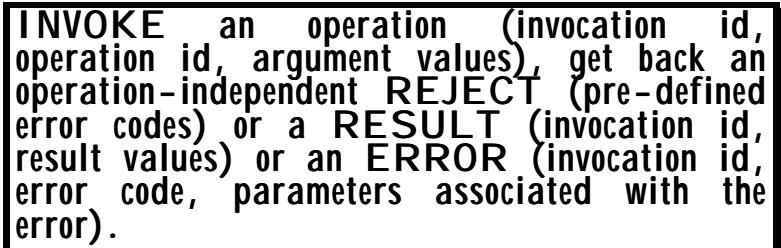
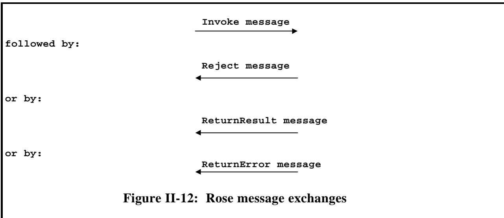
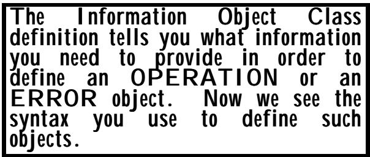

# Chapter 6 Information Object Classes, Constraints, and Parameterization 
第六章 信息对象类、约束条件与参数化

(Or: Completing the incomplete - with precision) （或者：完成那些不完整的事物——以精确的方式）

## Summary: 总结：

This chapter: 这一章：

• provides a brief description of the concept of "holes" in protocols; • 简要描述了协议中“漏洞”这一概念的含义；

describes briefly the ROSE (Remote Operations Service Element) protocol in order to provide a specific example of the need to define types with "holes" in them, and the need for notation to support clear specifications in the presence of "holes"; 简要介绍了 ROSE（远程操作服务元素）协议。通过这一例子，说明了在存在“空洞”的情况下，定义带有“空洞”的类型是多么重要，以及使用特定符号来明确说明这些空洞的需求。

provides a clear statement of the Information Object, Information Object Class, and Information Object Set concepts, and the use of those Object Sets to complete a partial protocol specification by constraining "holes" (and the consistency relationships for filling in multiple holes) left in a carrier protocol. 该文档清晰地阐述了信息对象、信息对象类别以及信息对象集的概念。同时，还介绍了如何利用这些对象集来完善部分协议规范，从而填补在载体协议中存在的“漏洞”——以及用于填充这些漏洞的一致性关系。

It goes on to describe: 文中继续描述如下：

the syntax for defining an Information Object Class, Information Objects, and Information Object Sets, using a development of the wineco protocol as examples; 以 wineco 协议的发展为例，介绍了用于定义信息对象类、信息对象以及信息对象集的语法规则；

the means by which defined Information Object Sets can be related to the "holes" that they are intended to constrain, using a simplified version of the ROSE protocol as an example; 以一种简化的 ROSE 协议为例，介绍了如何将特定的信息对象集与它们旨在解决的“漏洞”联系起来。

• describes the need for parameterization, and the parameterization syntax of ASN.1 specifications. • 描述了参数化的需求，以及 ASN.1 规范中参数化的语法规则。

It is supposed to be bad practice to tell a student that "what I am about to say is difficult"! But the information object concepts are among the more conceptually difficult parts of ASN.1, and we will introduce these concepts gently in this chapter and fill in final details in the next chapter. Just skip-read this chapter if it is all too easy! 告诉学生“我接下来要说的内容比较难理解”是一种不好的做法！不过，在 ASN.1 中，信息对象概念属于较为抽象的部分。我们在本章会循序渐进地介绍这些概念，而最后的细节则会在下一章中详细说明。如果觉得本章的内容太简单了，可以直接跳过吧！

# 1 The need for "holes" and notational support for them 1. 需要为这些“洞”提供相应的标注和支持。

## 1.1 OSI Layering 1.1 OSI 模型层次结构

This is probably the first time in this book that Open Systems Interconnection (OSI) has been seriously discussed, although it was within the OSI stable that ASN.1 was first standardised. 这可能是本书中首次正式讨论开放系统互连标准（OSI）。不过，ASN.1 标准其实是在 OSI 标准体系内首次被标准化的。


OSI was perhaps the first protocol suite specification to take seriously the question of documenting its architecture, with the production of the OSI 7-layer model. Many vendor-specific protocols had some concept of layering, and the TCP/IP work had split off IP from TCP in the late 1970s, but the OSI model was the most complete attempt at describing the concept of layering. OSI 可能是第一个真正重视架构文档化的协议标准，它提出了 OSI 七层模型。虽然许多特定于供应商的协议也包含了分层的概念，而在 20 世纪 70 年代末，TCP/IP 协议将 IP 从 TCP 中分离出来。但 OSI 模型才是描述分层概念最完整的尝试。

The 7-layer model was (in 1984) just the latest attempt to try to produce a simplification of the (quite difficult) task of specifying how computers would communicate, by dividing the task into a number of separate pieces of specification with well-defined links between those pieces of specification. 这个七层模型是在 1984 年提出的，它试图将原本复杂且难以处理的计算机通信规范工作简化为一系列独立的规范，这些规范之间有着明确的联系。不过，这一尝试仍然只是当前最先进的解决方案而已。

Although this "architecture" was primarily aimed at making it possible for several groups to work on different parts of the specification simultaneously, an important off-shoot was to provide reusability of pieces of specification. This included re-usability of network specifications to carry many different applications over the same network, or re-usability of application specifications to run over many different network technologies, some of which may not have been invented when the application specification was first written. 虽然这种“架构”的主要目的是为了让多个团队能够同时处理规范的各个部分，但另一个重要的成果是实现了规范的复用性。这意味着网络规范可以被重复使用，以便在同一个网络上承载多种不同的应用；同时，应用规范也可以被复用，从而在多种不同的网络技术环境下运行，其中一些技术可能在编写应用规范时尚未被发明出来。

The reader should contrast this with the early so-called "link" protocols (mainly deployed in the military arena, but also in telephony), where a single monolithic specification (document) completely and absolutely defined everything from application semantics to electrical signalling. 读者可以将这种情况与早期的所谓“连接协议”进行对比。这些协议主要应用于军事领域，但也用于电话通信领域。在那种情况下，整个规范（文档）都试图对从应用程序语义到电气信号传输等所有方面进行完全的定义。

In the International Standards Organization (ISO) 7- layer model, each layer provided a partial specification of messages that were being transmitted, each message having a "hole" in it (called user-data) that carried the bit-patterns of the messages defined by the next higher layer. However, there was a "fan-out" and "fan-in" situation: many possible lower layers (for example, transport or network protocols) could be used to carry any given higher-layer messages, and any given transport (or network) could carry many different higherlayer messages. It was a very flexible many-to-many situation. 在国际标准化组织（ISO）的七层模型体系中，每一层都对传输的消息进行了部分规范描述。每一条消息中都包含一个“空洞”，其中包含了由上一层定义的消息的位模式。不过，存在“发向下层”和“接收来自上层”的情况：许多可能的下层协议（例如传输层或网络协议）都可以用来承载某一特定高层消息；而任何一个传输层或网络层也可以承载多种不同高层消息。这是一种非常灵活的多对多关系。


But the basic concept in the original ISO OSI model was that every application layer specification would fill in the final hole - each application layer standard would produce a complete specification for some application. 但在原始的 ISO OSI 模型中，基本的概念是：每个应用层规范都会填补最终的空白——每个应用层标准都会为某种应用提供完整的规范。

It was the CCITT 7-layer model (eventually adopted by ISO) that brought to the table the concept of partial specifications of "useful tools" in the application layer, recognising a potentially infinite set of layers, each filling in a "hole" in the layer beneath, but itself leaving "holes" for other groups to fill in due course. 正是 CCITT 的七层模型（后来被 ISO 采纳）提出了“有用工具”在应用层中的部分规范这一概念。该模型认识到，可能存在无限多的层次结构，每个层次都填补了下层层次中的空白，而同时这些层次本身也会留下空白，以便其他组在后续阶段来填充这些空白。

As ASN.1 increasingly became the notation of choice for defining application specifications, there clearly became a need for support in ASN.1 for "holes". 随着 ASN.1 逐渐成为定义应用规范的首选标记语言，显然需要为 ASN.1 中的“空洞”情况提供相应的支持。

## 1.2 Hole support in ASN.1 1.2 ASN.1 中的孔支撑结构

Forget about theoretical models for now. It rapidly became clear that people writing application specifications using ASN.1 in 1984 wanted to be able to write a "generic" or "carrier" specification, with "holes" left in their datatypes, with other groups (multiple, independent, groups) providing specifications for what filled the holes. 现在先不要考虑理论模型了。很快便明白，1984 年那些使用 ASN.1 编写应用规范的人，其实想要编写一个“通用”或“载体”规范——这种规范会在数据类型中留下一些空白，然后由其他小组（多个、独立的小组）来负责填补这些空白。


At this point it is important to recognise that "leaving some things left undefined, for others to define", can (most obviously) be an undefined part of the format of messages (the user-data in OSI layering), or one of the elements in an ASN.1 sequence, but can also be an undefined part of the procedures for conducting a computer exchange. Both types of "holes" have occurred in real specifications, and notation is needed to identify clearly the presence and nature of any "holes" in a specification, together with notation for "user" specifiers to fill in the "holes". 在这一点上，重要的是要认识到：“让一些内容保持不明确状态，由其他用户来定义”，这可以是消息格式中的一个不明确部分（在 OSI 层次结构中指的是用户数据），也可以是 ASN.1 序列中的一个元素。不过，这也可能属于进行计算机交换过程中的一些不明确步骤。实际上，这两种“漏洞”都曾出现在真实的规范中，因此需要一种标记方式来明确标识规范中存在的“漏洞”及其性质，同时还需要一种标记方式来指导“用户”如何填充这些“漏洞”。

There is one other important point: if several different (user) groups provide specifications for applications which fit in the holes of some carrier or generic protocol, it often happens that implementations wish to support several of these user specifications, and need to be able to determine at communication-time precisely which specification has been used to fill in the hole in a given instance of communication. This is rather like the "protocol id" concept in a layered architecture. We recognise the need for holes to carry not just some encoding of information for the user specification, but also an identification of that specification. 还有一个重要的问题：如果多个不同的用户群体为适合某些载体或通用协议的应用程序提供了规范，那么通常会出现这样一种情况，即各种实现都希望支持这些用户规范，并且需要在通信过程中准确确定在特定的通信实例中使用了哪种规范来填补其中的空白。这有点类似于分层架构中的“协议标识”概念。我们认为，这些“空白”不仅需要包含用户规范的信息编码，还需要包含该规范的标识信息。

The earliest ASN.1 support for "holes" was with the notation "ANY", which (subject to a lot of controversy!) was withdrawn in 1994, along with the "macro notation" which was an early and largely unsuccessful attempt to relate material defining the contents of a hole (for a particular application) to a specific hole occurrence (in a carrier specification). 最早对“空洞”进行 ASN.1 编码的规范是“ANY”这种表示法。不过，这种表示法在 1994 年被取消了，因为它引发了不少争议。此外，还有“宏表示法”这一尝试，它试图将定义某个空洞内容的材料与特定空洞的出现情况联系起来，但这一尝试最终并未取得成功。

In 1994, the ASN.1 "Information Object Class" and related concepts matured, as the preferred way of handling "holes". In this chapter we next introduce the concepts of ROSE (Remote Operations Service Element), showing how ROSE had the need for notation to let its users complete the holes left in the ROSE protocol. We then briefly describe the nature of the information that has to be supplied when a user of the ROSE specification produces a complete application specification. We then proceed to the concepts associated with ASN.1 "Information Object Classes". 在 1994 年，ASN.1 的“信息对象类”及相关概念逐渐成熟，这成为了处理“空缺”问题的首选方式。在本章中，我们将介绍 ROSE（远程操作服务元素）的概念，说明 ROSE 需要使用特定的表示方式来填补协议中存在的空白。接着，我们简要描述了当用户使用 ROSE 规范编写完整的应用程序规范时，需要提供的信息内容。最后，我们将讨论与 ASN.1“信息对象类”相关的概念。

## 2 The ROSE invocation model 2 玫瑰式调用模型

## 2.1 Introduction 2.1 引言

One of the earliest users of the ASN.1 notation was the ROSE (Remote Operations Service Element) specification - originally 最早使用 ASN.1 标记语言的技术之一，是 ROSE（远程操作服务元素）规范——最初是由……提出的。



just called ROS (Remote Operations Service). This still provides one of the easiest to understand examples of the use of the Information Object Class concept, and a little time is taken here to introduce ROSE. 其实，这个系统被称为 ROS（远程操作服务）。这仍然是一个比较容易理解的、关于信息对象类概念应用的例子。这里花一点时间来介绍 ROSE 系统。

The reader should, however, note that this treatment of ROSE is NOT complete, and that when tables of information are introduced, the latest version of ROSE has many more columns than are described below. There have been a number of specifications that have written their own version of ROSE, with some simplifications and/or with some extensions, so if you see text using "OPERATION" or "ERROR", check where these names are being imported from. They may be imported from the actual ROSE specification, or they may be a ROSE "look-alike". The definitions in this text are a ROSE "look-alike" - they are a simplification of the actual ROSE definitions. 不过，读者需要注意的是，对 ROSE 的处理并不完整。当引入表格信息时，最新版本的 ROSE 包含的比下面的描述要多得多列。有一些规范编写了自己的 ROSE 版本，其中包含了一些简化或扩展的内容。因此，如果看到使用“操作”或“错误”的术语，请检查这些名称是从哪里引入的。它们可能是直接来自 ROSE 规范，也可能是类似 ROSE 的替代定义。本文中的定义就是这种类似 ROSE 的替代定义——它们实际上是 ROSE 定义的一种简化版本。

A common approach to the specification of protocols by a number of standardization groups (of which the latest is CORBA) is to introduce the concept of one system invoking an operation (or method, or activating an interface) on a remote system. This requires some form of message (defined in ASN.1 in the case of ROSE) to carry details for the operation being invoked, the three most important elements being: 许多标准化组织在协议规范制定时采用的一种常见方法（最新的例子是 CORBA）是引入“一个系统调用远程系统的操作”这一概念。这需要使用某种消息来传递调用的详细信息，其中三个最重要的元素包括：

• some identification of this invocation, so that any returned results or errors can be associated with the invocation; and • 需要对该调用进行一定的标识，这样就能将任何返回的结果或错误与特定的调用关联起来；此外……

• some identification of the operation to be performed; and • 需要明确要执行的操作的具体内容；此外……

• the value of some ASN.1 type (specific to that operation) which will carry all the arguments or input parameters for the operation. • 某些 ASN 类型的值（特定于该操作）。这些值将包含该操作所需的所有参数或输入参数。

This is called the ROSE INVOKE message (defined as an ASN.1 type called "Invoke"). ROSE introduced the concept of the "invocation identification" because it recognised that multiple instances of (perhaps the same) operation might be launched before the results of earlier ones had come back, and indeed that results might not come back in the same order as the order operations where launched in. 这种消息被称为 ROSE 调用消息（定义为一种 ASN.1 类型，名为“Invoke”）。ROSE 引入了“调用标识”的概念，因为它认识到，在之前的操作结果返回之前，可能会启动多个相同的操作实例。实际上，这些操作的结果可能不会按照启动操作的顺序来返回。

It is important here to note that the ROSE specification will define the concepts, and the form of the invocation message, but that lots of other groups will independently assign values to identify operations, define the ASN.1 type to carry the arguments or input parameters, and specify the associated semantics. They need a notation to do this, and to be able to link such definitions clearly to the holes left in the ASN.1 definition of the ROSE INVOKE message. 这里需要指出的是，ROSE 规范会定义相关的概念以及调用消息的格式。不过，许多其他团队会自行为各种操作分配数值，定义用于承载参数或输入参数的 ASN.1 类型，并指定相关的语义。他们需要一种 notations 来表述这些细节，同时还能将这些定义清晰地与 ROSE INVOKE 消息在 ASN.1 定义中留下的空白处联系起来。

Used in this context, ASN.1 is being used as what is sometimes called an "Interface Definition Language" (IDL), but it is important to remember that ASN.1 is not restricted to such use and can be applied to protocol definition where there is no concept of remote invocations and return of results. 在这一上下文中，ASN.1 被用作一种所谓的“接口定义语言”。不过需要注意的是，ASN.1 并不局限于这种用途，它也可以用于定义那些没有远程调用和结果返回概念的协议。

The INVOKE message itself is not a complete ASN.1 type definition. It has a "hole" which can carry whatever ASN.1 type is eventually used to carry values of the arguments of an operation. This "hole", and the value of the operation code field in the INVOKE message, clearly have to be filled-in in a consistent manner - that is, the op-code and the type must match. INVOKE 消息本身并不是一个完整的 ASN.1 类型定义。它有一个“空位”，这个空位可以容纳任何将来用于存储操作参数值的 ASN.1 类型。这个“空位”，以及 INVOKE 消息中操作码字段的值，都必须以一致的方式被填充——也就是说，操作码的类型必须与所存储的值的类型相匹配。

## 2.2 Responding to the INVOKE message 2.2 回应 INVOKE 消息

The ROSE concept says that an INVOKE message may be responded to by a REJECT message, carrying operation-independent error indications, such as "operation not implemented" (strictly, "invokeunrecognisedOperation"), "system busy" (strictly, ROSE 概念指出，一个 INVOKE 消息可能会收到一个 REJECT 响应，该响应会携带与操作无关的错误信息，例如“操作未执行”（严格来说是“invokeunrecognisedOperation”）、“系统繁忙”等。


"resourceLimitation"), etc). ROSE has about 40 different error or problem cases that can be notified with a REJECT message. （例如“资源限制”等情况）。ROSE 系统大约有 40 种不同的错误或问题情况，这些情况可以通过发送 REJECT 消息来通知用户。

If, however, there is no such message, then the operation is successfully invoked and will result in an "intended result" (the RESULT message) or an operation-dependent "error response" (the ERROR message). 不过，如果不存在这样的消息，那么操作就会成功执行，并会产生一个“预期结果”（即 RESULT 消息），或者一个与操作相关的“错误响应”（即 ERROR 消息）。

ROSE invocation is illustrated in figure II-12. 在图 II-12 中展示了 ROSE 的调用过程。



This separation of "intended result" and "error response" is not strictly necessary, but simplifies the ASN.1 definition. The assumption here is that any one group will be defining a number of closely-related operations, each of which will have an identification and precisely one ASN.1 type to carry the input arguments in the INVOKE message hole, and precisely one ASN.1 type to carry the output arguments in the RESULT message hole. However, for this complete set of operations, there are likely to be a set of possible error returns, such that any given operation can give rise to a specified subset of these errors. For each error we need an error code, and an ASN.1 type to carry additional information (which ROSE calls parameters) about the error, and of course we need to be able to specify which errors can arise from which operations. 将“预期结果”与“错误响应”分开并不是绝对必要的，但这有助于简化 ASN.1 的定义。这里的假设是，每个组都会定义一系列密切相关的操作，每个操作都有一个标识符，并且有一个特定的 ASN.1 类型用于携带 INVOKE 消息中的输入参数，同时还有一个特定的 ASN.1 类型用于携带 RESULT 消息中的输出参数。不过，对于这一系列操作来说，可能会存在多种可能的错误返回情况，因此任何操作都可能引发某些特定的错误。对于每种错误，我们需要一个错误代码，以及一个 ASN.1 类型来携带关于该错误的额外信息（ROSE 称之为参数）。当然，我们还需要能够指定哪些操作可能会引发哪些错误。

## 3 The use of tables to complete the user specification 3. 使用表格来整理用户需求说明

We return here to our wineco protocol, and will first use an informal tabular format to show how we use the ROSE (incomplete) protocol to support our wineco exchanges. We have already specified two main messages using ASN.1, namely 我们接下来将继续讨论我们的葡萄酒交易协议。首先，我们会使用一种非正式的表格形式来展示如何运用 ROSE 协议来支持我们的葡萄酒交易交换。我们已经使用 ASN.1 规范定义了两个主要消息类型。

<table><tbody><tr><td data-imt-p="1">Expressing wineco exchanges as a set of remote operations - you don't have to, but it might be simple and convenient. 将 Wineco 的交换操作表示为一组远程操作——虽然不必这样做，但这样可能会更简洁方便一些。</td></tr></tbody></table>

```txt
Order-for-stock and Return-of-sales 
```

We will add, without defining the ASN.1 types themselves, two further wineco messages we might wish to pass with a ROSE INVOKE, namely 我们将在不定义 ASN 类型本身的情况下，再添加两种希望通过 ROSE 调用传递的 wineco 消息，即

```txt
Query-availability and Request-order-state 
```

The first of these messages queries the availability of items for immediate delivery, and the second asks for an update on the state of an earlier order. 第一条消息询问了那些可以立即交付的商品的可用性，第二条消息则是对之前一个订单的进展情况进行更新。

We will make all four of these messages a ROSE operation, which will either produce a response or an error return. The response to an "Order-for-stock" will be an "Order-confirmed" message. Successful processing of a "Return-of-sales" will result in an ASN.1 NULL being returned. The response to "Query-availability" will be an "Availability-response" and the response to a "Requestorder-state" will be an "Order-status" response. 我们将把这四条消息都设计为 ROS 操作，这样要么会返回响应，要么会返回错误。对于“库存订单”请求，响应将是一个“订单已确认”的消息。而“销售退货”请求的成功处理将会返回一个 ASN.1 NULL 响应。对于“可用性查询”请求，响应将是一个“可用性响应”消息；而对于“订单状态查询”请求，则返回一个“订单状态”响应。

We envisage that some or all of these requests (operations) can produce the following errors (in each case with some additional data giving more details of the failure): 我们认为，这些请求或操作中有一些可能会导致以下错误（在每种情况下，还会伴随一些额外的数据，以便更详细地描述故障情况）：

• Security check failure. • 安全检查失败。

• Unknown branch. • 未知的分支。

• Order number unknown. • 订单编号未知。

• Items unavailable. • 这些物品无法获得。

Note that there are other operation-independent errors carried in the ROSE Reject message that are provided for us by ROSE, but we do not need to consider those. Here we are only interested in errors specific to our own operations. 请注意，ROSE 拒绝消息中还包含了一些与操作无关的错误信息，这些信息是由 ROSE 系统提供的，但我们不需要考虑这些错误。在这里，我们只关心那些与我们的操作相关的错误。

We need to say all this rather more formally, but we start by doing it in an informal tabular form shown in figures II-13 and II-14. 我们需要以更正式的方式来表达这些内容，但首先，我们可以用图 II-13 和图 II-14 中所展示的非正式表格形式来呈现它们。

In the figures, names such as "asn-val-....." are ASN.1 value reference names of a type defined by ROSE (actually, a CHOICE of INTEGER or OBJECT IDENTIFIER) used to identify operations or errors, and names such as "ASN-type-...." are ASN.1 types that carry more details about each of our possible errors. Note that in the case of the error "Order number unknown", we decide to return no further information, and we have left the corresponding cell of the table empty. We could have decided to return the ASN.1 type NULL in this case, but the element in the ROSE "ReturnError" SEQUENCE type that carries the parameter is OPTIONAL, and by leaving the cell of our table blank, we indicate that that element of the "ReturnError" SEQUENCE is to be omitted in this case. We will see later how we know whether we are allowed to leave a cell of the table empty or not. 在这些图中，诸如“asn-val-…”这样的名称属于 ASN.1 中的值引用名称，这些名称由 ROSE 定义的类型来表示特定操作或错误。而诸如“ASN-type-…”这样的名称则代表 ASN.1 类型，它们包含了关于各种可能错误的详细信息。需要注意的是，在错误“订单编号未知”的情况下，我们决定不返回任何信息，因此将表格中的相应单元格留空。虽然我们可以在这种情况下使用 ASN.1 类型 NULL，但 ROSE 中的“ReturnError”序列类型中的该元素却是可选择的。通过将表格中的对应单元格留空，我们表明在这种情况下可以省略“ReturnError”序列中的该元素。之后我们会进一步了解如何判断是否允许将表格中的某个单元格留空。

Figure II-13: The wineco ERROR table 图 II-13：葡萄酒误差表

The figure II-13 table has one row for each possible error, and has just two columns: 在 II-13 表格中，每一可能错误都对应一行记录，并且只有两列：

• the error codes assigned (as values of the type determined in the ROSE specification); and • 所分配的错误代码（这些代码是根据 ROSE 规范中确定的类型来定义的）；以及

• the corresponding ASN.1 type (defined in our module) to carry parameters of the error. • 与之对应的 ASN.1 类型（在我们模块中有定义），用于携带错误相关的参数。

We might normally expect a small number of rows for this table for any given application that uses ROSE to define its protocol (in our case we have four rows), and it may be that for some errors there is no additional parameter information to return, and hence no ASN.1 type needed for parameters of that error, as in the case of "asn-val-unknown-order". 对于使用 ROSE 来定义协议的任何应用程序来说，这个表的行数通常都会比较少（在我们的案例中，有四行）。在某些情况下，某些错误可能没有任何额外的参数信息可供返回，因此也就不需要为这些错误指定 ASN.1 类型了，比如在“asn-val-unknown-order”这种错误的情况下。

The table in figure II-14 is the other information needed to complete the ROSE protocol for our wineco application. It lists an operation code, which is again a value of the type - as specified by ROSE: 图 II-14 中的表格包含了完成 ROSE 协议所需的其他信息。该表格列出了操作代码，这些代码属于 ROSE 所定义的类型——即数值类型。

$$
\begin{array}{l} \text {CHOICE} \left\{\text {local INTEGER}, \right. \\ \text {global OBJECT IDENTIFIER} \end{array}
$$

together with the ASN.1 type that carries the input arguments for the operation, together with the ASN.1 type that carries the result values, together with a list of the errors that the operation can generate. 包括用于该操作的输入参数的 ASN.1 类型，以及包含结果值的 ASN.1 类型。此外，还包括该操作可能产生的错误列表。

<table><tbody><tr><td data-imt-p="1">Op Code 操作代码</td><td data-imt-p="1">Argument Type 论点类型</td><td data-imt-p="1">Result Type 结果类型</td><td data-imt-p="1">Errors 错误</td></tr><tr><td data-imt-p="1">ash-val-order 灰烬秩序</td><td data-imt-p="1">Order-for-stock 按股票数量订购</td><td data-imt-p="1">Order-confirmed 已确认订单</td><td data-imt-p="1">security-failure unknown-branch 安全故障，原因不明——分支部分</td></tr><tr><td data-imt-p="1" data-imt_insert_failed_reason="same_text">asn-val-sales</td><td data-imt-p="1">Return-of-sales 销售回售</td><td>NULL</td><td data-imt-p="1">security-failure unknown-branch 安全故障，原因不明——分支部分</td></tr><tr><td data-imt-p="1" data-imt_insert_failed_reason="same_text">asn-val-query</td><td data-imt-p="1">Query-availability 查询可用性</td><td data-imt-p="1">Availability-Response 可访问性-响应</td><td data-imt-p="1">security-failure unknown-branch unavailable 安全机制故障，未知分支不可用</td></tr><tr><td data-imt-p="1">asn-val-state ASN-值状态</td><td data-imt-p="1">Request-order-state 请求-订单-状态</td><td data-imt-p="1">Order-status 订单状态</td><td data-imt-p="1">security-failure unknown-branch unknown-order 安全故障，未知分支，未知顺序</td></tr></tbody></table>

In the real ROSE specification, there are additional columns to assign a priority value for operations and for error returns, to identify so-called "linked operations", and to determine whether results are always returned, values of error parameters needed, and so on. Discussion of these details of ROSE would go beyond the scope or the needs of this text, and we have not included these features in the illustration. 在真实的 ROSE 规范中，还有额外的列用于为操作分配优先级，以及处理错误返回情况；这些列还可以用来识别所谓的“关联操作”；此外，这些列还用于确定是否总是返回结果、所需的错误参数值等。关于 ROSE 这些细节的讨论超出了本文的范围，因此我们并没有在图示中包含这些功能。

Given then the ROSE concept of messages (ASN.1 datatypes) with "holes" in them, we see 鉴于消息采用 ROSE 规范格式（ASN.1 数据类型），这些格式中存在“空洞”情况，因此我们会看到这样的结果。

• The need for a syntax for ROSE to specify the information its users need to supply to complete the ROSE datatypes by the specification of a number of operations and errors (definition of the number and form of the above tables). • 需要一种语法规则，用于 ROSE 语言，以明确用户需要提供的信息。同时，还需要规定一些操作规则和错误类型（例如，上述表格的数量和形式）。

• The need for a strict ASN.1 syntax (machine-readable) for ROSE users to specify the information shown informally in figures II-13 and II-14. • 对于 ROSE 用户来说，需要一种严格的 ASN.1 语法（便于机器读取的语法），以便他们能够清晰地指定图 II-13 和图 II-14 中非正式展示的信息。

• The need for notation in ASN.1 to identify "holes" in ASN.1 types, and to link the information shown in figures II-13 and II-14 clearly with the "hole" it is intended to complete. 在 ASN.1 中，需要使用注释来标识 ASN.1 类型中的“空洞”，并且需要将图 II-13 和图 II-14 中显示的信息与那些需要填充的“空洞”清晰地联系起来。

## 3.1 From specific to general 3.1 从具体到 général

In the general case, there may be many different tables needed to complete any given "generic" protocol, and each table will have a number of columns determined by that "generic" protocol. The nature of the information needed for each column of the table (and the column headings to provide a "handle" for each piece of information) will all vary depending on the "generic" protocol in question. 在一般情况下，为了完成任何给定的“通用”协议，可能需要使用许多不同的表格。每个表格中的列数由该“通用”协议决定。表格中每一列所需的信息内容，以及列标题的作用，都会根据具体的“通用”协议而有所不同。

ROSE is just one example of incomplete (generic) protocols. There are many other examples where specifiers leave it to others to complete the specification, and need to be able to (formally) say what additional information is needed. This is an Information Object Class specification. ROSE 只是不完整（通用）协议的一个例子。还有很多其他的情况，其中规范制定者将规范的交付权委托给他人来完成，而他们自己则需要能够（正式地）说明还需要哪些额外的信息。这就是信息对象类规范的一个例子。

Thus the specifier of a "generic" protocol needs a notation which will provide a clear statement of the form of the tables (the information needed to complete the "generic" protocol). We call the specification of this the specification of Information Object Classes. When a user of the "generic" protocol provides information for a row of a table we say that they are specifying an Information Object of the class associated with that table. The total set of rows of a given table defined to support any one user specification is called an Information Object Set. 因此，“通用”协议的规范需要一种能够明确说明表格格式的符号系统（即完成“通用”协议所需的信息）。我们将这种规范称为信息对象类的规范。当使用“通用”协议的用户为表格中的某一行提供信息时，他们实际上是在指定与该表格相关联的信息对象。而一个给定表格所包含的所有行，如果用于满足任何用户的需求，那么这些行就构成了一个信息对象集。

Notation is thus needed in ASN.1 for: 因此，在 ASN.1 中需要采用特定的标记方式来表示这些元素。

• The definition of a named Information Object Class (the form of a table). • 命名的信息对象类的定义（即表格的形式）。

• The definition of named Information Objects of a given class (completing the information for one row of the table). • 给定类别的命名信息对象的定义（包含了表格中某一行数据的完整信息）。

• Collecting together all the Information Objects (of any given class) defined in a specification into a named Information Object Set (a completed table). • 将所有在规范中定义的信息对象（无论属于什么类别）收集起来，形成一个名为“信息对象集”的完整表格。

Linking a named information object set to the "holes" in the carrier protocol that it is designed to complete. 将一组具有名称的信息对象与载体协议中需要被填充的“空缺”联系起来，从而完成该协议的功能。

## 4 From tables to Information Object Classes 4. 从表格到信息对象类

The table metaphor is a very useful one in introducing the Information Object Class concepts, but the term "table" is not used in the ASN.1 Standard itself (except in the term "table constraint", discussed later). 在介绍信息对象类概念时，使用表格作为比喻非常有用。不过，在 ASN.1 标准中本身并没有使用“表格”这个术语（除了后面提到的“表格约束”这一表述）。

<table><tbody><tr><td data-imt-p="1">Tables are fine for human-to-human communication. For computer processing we use ASN.1 notation to define the form of tables and the contents of those tables. 在人与人之间的通信中，使用表格是可行的。而在计算机处理方面，我们则使用 ASN.1 标记语言来定义表格的结构以及其中的内容。</td></tr></tbody></table>

We say that each Information Object has a series of fields, each with a field name. Defining an Information Object Class involves listing all the fields for objects of that class, giving the fieldname for each field, and some properties of that field. The most important property is the nature of the information needed when defining that field. This is most commonly the specification of some ASN.1 type (with the semantics associated with that type), or the specification of an ASN.1 value of some fixed ASN.1 type. We will, however, see later that there are a number of other sorts of fields that can be defined. 我们说过，每个信息对象都包含一系列字段，每个字段都有一个对应的字段名。定义某个信息对象类时，需要列出该类所有对象的字段，为每个字段指定字段名，以及该字段的一些属性。其中最重要的属性是定义该字段时所需要的信息类型。通常，这指的是某种 ASN.1 类型的规范（以及与该类型相关的语义），或者某种固定 ASN.1 类型的 ASN.1 值。不过，稍后我们会了解到，还可以定义其他类型的字段。

In the case of ROSE, we have two Information Object Classes defined by ROSE, the OPERATION class and the ERROR class. (Names of Information Object Classes are required to be all upper-case). 在 ROSE 的情况下，我们定义了两种由 ROSE 自身定义的信息对象类：操作类与错误类。（信息对象类的名称必须全部用大写字母表示。）

All objects of class OPERATION will have four fields containing: 所有属于 OPERATION 类的对象都将拥有四个字段，具体内容如下：

• A value of type • 一个类型为的值

$$
\begin{array}{l} \text {CHOICE} \left\{ \begin{array}{l l} \text {local} & \text {INTEGER}, \\ & \text {global} \end{array} \right. \text {OBJECT IDENTIFIER} \end{array}
$$

to identify the operation. 为了识别该操作。

• An ASN.1 type capable of carrying input values for the operation. • 一种符合 ASN.1 标准的类型，能够承载用于该操作的输入值。

• An ASN.1 type capable of carrying the result values on successful completion of the operation. • 一种 ASN.1 类型，能够存储操作成功完成后的结果值。

• A list of information objects of class ERROR, each of which is an error that this particular operation can produce. • 这是一个包含错误信息的列表，每个对象都代表该操作可能产生的一种错误。

All objects of class ERROR will have two fields containing: 所有属于 ERROR 类的对象都将拥有两个字段，其内容如下：

• A value of type • 类型为 的值

CHOICE {local INTEGER, global OBJECT IDENTIFIER} 选择 {局部整数，全局对象标识符}

to identify the error. 找出错误所在。

• An ASN.1 type capable of carrying the values of the parameters of the error. • 一种 ASN.1 类型，能够存储与错误相关参数的值。

To summarise: An Information Object Class definition defines the amount and form of information that is needed to specify an object of that class. An Information Object definition provides that information. The nature of the information needed can be very varied, and we talk about the form of the fields of the Information Object Class according to the information needed for that field when defining an Information Object. 总结一下：信息对象类的定义规定了指定该类对象所需的信息的数量和形式。而信息对象的定义则具体描述了这些信息的内容。所需信息的种类可能非常多样，因此在定义信息对象时，我们会根据每个字段所需的信息来规定该字段的形式。

In the above discussion, we have introduced: 在上面的讨论中，我们已经介绍了：

• type fields: Fields that need an ASN.1 type definition to complete them. • 类型字段：需要 ASN.1 类型定义来完成的字段。

• fixed type value fields: Fields that need the value of a single (specified) ASN.1 type to complete them. • 固定类型值字段：这类字段需要一个特定的 ASN.1 类型的值来填充它们。

object set fields: Fields that need a set of information objects of a single (specified) Information Object Class (in this case the ERROR class) to complete them. 对象集合字段：这些字段需要一组属于某个特定信息对象类的信息对象来填充它们（在本例中，该类为 ERROR 类）。

There are a number of other forms of field that can be specified when defining an Information Object Class, and we shall see more of these later. 在定义信息对象类时，还可以指定多种其他形式的字段。之后我们会进一步了解这些形式。

If you see names in all upper case, you can be reasonably sure that you are dealing with Information Object Classes, but another certain way to tell is the presence of names beginning with the & (ampersand) character. In order to avoid confusion with other pieces of ASN.1 notation, the names of fields of Information Object Classes are required to begin with an &. Thus the field of the OPERATION class that contains the object identifier value for some particular operation is called: 如果你看到所有名称都采用全大写字母表示，那么可以合理地判断你面对的是信息对象类。另一种确定方法就是看名称是否以&符号开头。为了避免与其他 ASN.1 表示法产生混淆，信息对象类的字段名称必须以&符号开头。因此，属于 OPERATION 类且包含某个特定操作的对象标识符值的字段，就被称作：

## OPERATION.&operationCode 操作 & 操作代码

The field that has to be supplied with a type definition for the arguments of the INVOKE message is called: 需要为 INVOKE 消息的参数提供类型定义的字段被称为：

## OPERATION.&ArgumentType 操作。&参数类型

Note that the &operationCode field contains a single ASN.1 value, and after the & we have a lower-case letter (this is a requirement), whilst the &ArgumentType field contains an ASN.1 type, and after the & we have an upper-case letter (again a requirement). Where a field contains a single value (usually - but not always - of some fixed type) or a single information object (of some fixed class) the field-name after the & starts with a lower-case letter. Where a field contains multiple values or multiple information objects (as with the list of errors for an operation), the field-name after the & starts with an upper-case letter. It is important to remember these rules when trying to interpret the meaning of an ASN.1 Information Object Class definition. 请注意，&operationCode 字段包含一个 ASN.1 值，且位于&之后的是一个小写字母；而&ArgumentType 字段包含一个 ASN.1 类型，位于&之后的是一个大写字母。当某个字段包含单个值（通常是某种固定类型的数值）或单个信息对象时，该字段的名称以小写字母开头。当字段包含多个值或多个信息对象时（例如操作错误列表），字段名称则以大写字母开头。在解读 ASN.1 信息对象类的定义时，记住这些规则非常重要。

We have already seen that names of Information Object Classes are required to be all upper case. Names given to individual Information Objects are required to start with a lower case letter (similar to value references), and names given to Information Object Sets (collections of Information Objects of a given class) are required to start with an upper case letter. 我们已经了解到，信息对象类的名称必须全部采用大写字母。而分配给单个信息对象的名称则必须从一个小写字母开始（类似于值引用方式）。至于信息对象集的名称（即某一类信息对象的集合），则必须从一个大写字母开始。

There is in general a strong similarity between the concepts of types, values, and sets of values (subtypes), and the concepts of Information Object Classes, Information Objects, and Information Object Sets, and naming conventions in relation to the initial letter of names follow the same rules. 一般来说，类型、值和值集（子类型）的概念与信息对象类、信息对象和信息对象集的概念有着明显的相似性。此外，名称的命名规则也遵循相同的规则，即名称的首字母具有特定的含义。

There is, however, an important difference between types and information object classes. All ASN.1 types start life populated with a set of values, and new types can be produceced as subsets of these values. Information Object Classes have no predefined objects, they merely determine the notation for defining objects of that class, which can later be collected together into information object sets, which are really the equivalent of types. 不过，类型和信息对象类之间确实存在重要的区别。所有的 ASN.1 类型在创建时都包含了一组值，而新的类型则可以作为这些值的子集被创建出来。信息对象类并没有预定义的对象，它们只是定义了用于描述该类对象的表示方式，这些表示方式之后可以被收集起来，形成信息对象集，而这些信息对象集实际上就相当于类型了。

When you define a class you provide it with a reference name, and similarly for Information Objects and Information Object Sets. These reference names can then be used in other parts of the ASN.1 notation to reference those classes, objects, and sets, just like type reference and value reference names are assigned to type and value definitions and then used elsewhere. Reference names for classes, objects, and object sets are imported and exported between modules in the IMPORTS and EXPORTS statements just like type and value reference names. 当定义一个类时，需要为其提供一个引用名称；对于信息对象和信息对象集合也是如此。这些引用名称可以在 ASN.1 表示法的其他部分中被用来引用这些类、对象和集合。就像类型引用和值引用名称被分配给类型和解码定义，并在其他地方被使用一样，类、对象和集合的引用名称也可以在 IMPORTS 和 EXPORTS 语句之间在模块之间导入和导出。类型值引用名称的运作方式，类、对象和对象集合的引用名称同样如此。

## 5 The ROSE OPERATION and ERROR Object Class definitions 5. 玫瑰行动与错误对象类的定义

Figure II-15 shows a simplified form of the definition of the OPERATION and ERROR classes of ROSE, and is the first introduction of the actual ASN.1 syntax for defining Information Object Classes. 图 II-15 展示了 ROSE 中“操作”类与“错误”类定义的简化形式。这也是首次引入用于定义信息对象类的实际 ASN 语法。

Remember, this syntax is essentially defining the table headings and the information content of the informal tables shown in II-13 and II-14, but it is doing it with a 请记住，这种语法实际上是在定义表格的标题以及 II-13 和 II-14 中展示的表格中的信息内容。不过，这种定义方式是采用一种特定的方式来实现的。

At last! We get to see an example of a real Information Object Class definition. Two in fact! The OPERATION class and the ERROR class from ROSE. 终于！我们看到了一个真实的“信息对象类”定义的例子。实际上有两个这样的类：来自 ROSE 的 OPERATION 类和 ERROR 类。

syntax that is similar to ASN.1 type and value definition syntax, and which is fully machineprocessable. 这种语法与 ASN.1 中的类型和值定义语法类似，而且完全可以被机器处理。

```txt
OPERATION ::= CLASS
    {&operationCode CHOICE {local INTEGER,
    global OBJECT IDENTIFIER}
    UNIQUE,
    &ArgumentType,
    &ResultType,
    &Errors ERROR OPTIONAL }

ERROR ::= CLASS
    {&errorCode CHOICE {local INTEGER,
    global OBJECT IDENTIFIER}
    UNIQUE,
    &ParameterType OPTIONAL }

Figure II-15: The OPERATION and ERROR class definitions 
```

In figure II-15, we see the definition of four fields for OPERATION and two for ERROR, as expected. Compare that figure with the table headings of figures II-13 and II-14, and let us go through the fields in detail. (Remember, each class definition corresponds to the definition of the form of a table, and each field corresponds to the definition of the form of a column of that table.) 在图 II-15 中，我们看到了“操作”字段的四种定义，而“错误”字段则有两种定义，这与预期一致。将这一图表与图 II-13 和图 II-14 中的表格标题进行比较，然后我们可以详细了解这些字段的含义。（记住，每个类别的定义都对应着表格中某个字段的形式，而每个字段则对应着该表格中某个列的格式。）

For the OPERATION class, we have the "&operationCode" field, which is required to be completed with a value of the specified type. (It is called a fixed type value field). This field is also flagged as "UNIQUE". When defining an object of this class, any value (of the specified type) can be inserted in this field, but if a set of such objects are placed together to form an Information Object Set (using notation we will see later), there is a requirement (because of the "UNIQUE") that all values in this field are different for each object in the set. If you regard the object set as representing a completely filled in table, then in database terminology, fields marked "UNIQUE" provide a key or index into the table. More than one field can be marked "UNIQUE" (but this is uncommon), but there is no mechanism in the notation to require that the combination of two fields has to be unique within an information object set. If you needed to specify that, you would have to use comment within the class definition. 在 OPERATION 类中，有一个名为“&operationCode”的字段，该字段必须包含指定类型的值。（它被称为固定类型值字段）。该字段也被标记为“UNIQUE”。在定义此类对象时，可以在该字段中插入任何指定类型的值。但是，如果将这些对象组合成一个信息对象集（稍后会在规范中介绍），那么由于“UNIQUE”的特性，该字段中的每个值都必须是不同的。如果将信息对象集视为一个完全填充的表格，那么在数据库术语中，标记为“UNIQUE”的字段就相当于表格中的键或索引。可以有多个字段被标记为“UNIQUE”（但这并不常见），不过在规范中并没有规定两个字段的组合在信息对象集中必须是唯一的。如果你确实需要指定这一点，那么你就需要在类定义中使用注释来说明。

The next two fields, "&ArgumentType" and "&ResultType" have names which begin with a capital letter, and no type definition after them. This means that they have to be completed by the specification of an ASN.1 type (usually, but not necessarily, by giving a type reference rather than an explicit definition of a type). 接下来的两个字段，“&ArgumentType”和“&ResultType”的命名方式都是以大写字母开头的，之后则不再有类型定义。这意味着这些字段需要通过指定一个 ASN 类型来填充（通常做法是提供类型引用，而不是明确的定义）。

The fourth and last field is more interesting. "&Errors" begins with a capital letter, so you complete it with a set of things. But the name following is not an ASN.1 type reference, it is a class reference. So this field requires to be completed with a set of Information Objects of that (the ERROR) class, defined next. This field is also flagged as "OPTIONAL". This means that in the definition of objects of this class, it is not a requirement to define information for this field - it can be left blank. This would imply that the corresponding operation never produced a "ReturnError" response. 第四个也是最后一个字段比较有趣。&Errors 这个字段以大写字母开头，因此你需要用一组对象来填充它。不过，后面的名称并不是对 ASN.1 类型的引用，而是指向某个类。所以，这个字段需要用该类中定义的某个信息对象来填充。这个字段也被标记为“可选项”。这意味着，在定义该类的对象时，不必为这个字段定义任何信息——可以留空。这意味着相应的操作可能不会产生“ReturnError”响应。

It is left to the reader to examine the definition of the error class, which should now be understandable. 现在，读者可以自行研究错误类别的定义了，相信这一定义应该已经足够清晰明了了。

## 6 Defining the Information Objects 6. 定义信息对象

Let us now use the notation for defining objects of a defined class (in this case OPERATION and ERROR). We take the informal definition of operations and errors given in figures II-13 and II-14 and express them in the ASN.1 notation for defining objects. This is shown in figure II-16 (the ERROR objects) and II-17 (the OPERATION objects). 现在，让我们使用特定的符号来表示各种对象（在本例中为 OPERATION 和 ERROR）。我们参考了图 II-13 和图 II-14 中给出的操作和错误的非正式定义，并将其用 ASN.1 符号来表示。如图 II-16 所示（为 ERROR 对象），如图 II-17 所示（为 OPERATION 对象）。



```lisp
sec-fail ERROR ::=
{&errorCode asn-val-security-failure,
    &ParameterType ASN-type-sec-failure-details}
unknown-branch ERROR ::=
{&errorCode asn-val-unknown-branch,
    &ParameterType ASN-type-branch-fail-details}
unknown-order ERROR ::=
{&errorCode asn-val-unknown-order}
unavailable ERROR ::=
{&errorCode asn-val-unavailable,
    &ParameterType ASN-type-unavailable-details} 
```

Figure II-16: Definition of the wineco ERROR Information Objects 图 II-16：葡萄酒错误信息的对象定义

These figures should be fairly understandable, and a line-by-line commentary will not be given, but there are some points to which the reader's attention is drawn. 这些数字应该比较容易理解，不会进行逐行注释。不过，有一些要点需要读者注意。

Note that the left of the "::=" looks rather like the definition of a value reference - compare: 请注意，“::=”左边的部分看起来很像是值引用的定义——请参考相关说明：

which is read as "my-int-val of type INTEGER has the value 3". In a similar way, we read figures II-16 and II-17 as (for example) "sec-fail of class ERROR has the fields ...". Following the "::=" we list (in curly brackets) each of the fields in the class definition, in order, and separated by commas, giving in each case the name of the field and the definition of that field for this particular object. 翻译结果为：“我的-int-val 类型为整数类型，其值为 3”。同样地，我们理解图 II-16 和 II-17 的含义为：“ERROR 类中的 sec-fail 具有以下字段……”在“::=”之后，我们用大括号列出了类定义中每个字段的名称，这些字段按顺序排列，并用逗号分隔。每一条记录都包含了该字段的名称以及该字段在特定的对象中的定义。

Note also that the "unknown-order" ERROR object has no definition for the &ParameterType field - this is permissible only because that field was marked OPTIONAL in the class definition of figure II-15. 需要注意的是，名为“未知顺序”的 ERROR 对象没有对&ParameterType 字段的定义——这种情况是被允许的，因为在该图 II-15 的类定义中，该字段被标记为可选项。

Turning to the "&Errors" field, note that when we want to define a set of errors, we use a list of reference names separated by a vertical bar and enclosed in curly brackets. This may seem less intuitive than if a comma had been used as the list separator, but is in fact a special case of a much more powerful mechanism for grouping objects into sets using set arithmetic (see below). The vertical bar is used for set UNION, so we are producing a set for the "&Error" field of "order" which is the union of "security-failure" and "unknown-branch". 接下来是“&错误”这个字段。当我们想要定义一组错误时，会使用一个由竖线分隔、位于大括号中的引用名称列表来表示。这种方法可能不如使用逗号作为列表分隔符那样直观，但实际上这是一种更强大的机制——它可以通过集合运算将对象组合成特定的集合（详见下文）。竖线用于实现集合的并集操作，因此“order”字段中的“&错误”实际上是由“security-failure”和“unknown-branch”这两个集合合并而成的。

Finally, note that the names used in the definition of the "&Error" fields are themselves defined as errors in figure II-16. Those definitions would be in the same module as the figure II-17 definitions, or would be imported into that module. 最后，需要注意到在定义“&Error”字段时所使用的名称，其实都是如图 II-16 中所列出的错误名称。这些定义会与图 II-17 中的定义位于同一个模块中，或者可以被导入到该模块中。

```txt
order OPERATION ::=
    {&operationCode asn-val-order,
    &ArgumentType Order-for-stock,
    &ResultType Order-confirmed,
    &Errors {security-failure |
    unknown-branch}}
sales OPERATION ::=
    {&operationCode asn-val-sales,
    &ArgumentType Return-of-sales,
    &ResultType NULL,
    &Errors {security-failure |
    unknown-branch}}
query OPERATION ::=
    {&operationCode asn-val-query,
    &ArgumentType Query-availability,
    &ResultType Availability-Response,
    &Errors {security-failure |
    unknown-branch |
    unavailable}}
status OPERATION ::=
    {&operationCode asn-val-state,
    &ArgumentType Request-order-state,
    &ResultType Order-status,
    &Errors {security-failure |
    unknown-branch |
    unknown-order}}
Figure II-17: Definition of the wineco OPERATION Information Objects 
```

The figure II-16 and II-17 definitions may appear more verbose (they are!) than the informal tabular notation used in figures II-13 and II-14, however, they are very explicit, but more importantly they are machine-readable, and ASN.1 tools can process them and use these definitions in checking and decoding the content of "holes" in incoming messages. 在图 II-16 和 II-17 中给出的定义可能看起来比图 II-13 和 II-14 中使用的非正式表格形式更为冗长（不过，它们确实如此！）。然而，这些定义非常明确且易于理解。更重要的是，这些定义可以被机器读取。因此，使用 ASN.1 工具可以处理这些定义，并在检查和解码传入消息中的“漏洞”时利用这些定义来进行处理。

## 7 Defining an Information Object Set 7. 定义信息对象集

Why do we need to combine the definition of individual Information Objects into an Information Object Set? Well, we saw a use of this in defining the "&Errors" field of the OPERATION class above, but there is a more important reason. The whole purpose of defining Information Object Classes and Information Objects is to provide an ASN.1 definition of the complete (informal) table we saw earlier that determines what can fill in the holes in a carrier or generic protocol, and to link that ASN.1 definition to the "holes" in the generic or carrier protocol. 为什么我们需要将各个信息对象的定义合并到一个信息对象集中呢？其实，我们在定义 OPERATION 类的“&Errors”字段时就已经使用了这种合并方式。不过，还有一个更重要的原因。定义信息对象类和信息对象的整个目的，就是提供一个 ASN.1 定义，从而补全我们之前提到的那个不完整表格的内容，进而填补通用协议或载体协议中存在的空白。而将这些 ASN.1 定义与通用协议或载体协议中的“空白”部分联系起来，正是实现这一目的的关键。

<table><tbody><tr><td data-imt-p="1">The next step on the way. Someone has defined some Information Object Classes. We define some Information Objects. Now we pull them together into a named Information Object Set. 这是接下来的步骤。已经有人定义了一些信息对象类。我们现在也定义了一些信息对象。接下来，我们将这些信息对象组合成一个有名称的信息对象集。</td></tr></tbody></table>

So we need a notation to allow us to define Information Object Sets (collections of Information Objects of a given class), with a name assigned to that set which can be used elsewhere in our specification. 因此，我们需要一种标记方式，以便能够定义信息对象集（即属于某一类别的信息对象集合）。同时，这些集合应该有一个唯一的名称，这样在规范的其它部分就可以使用这个名称来进行引用。

Information Object Sets are collections of Information Objects, much as types can be seen as collections or sets of values. So it is not surprising that the names for Information Object Sets are required to start with an upper-case letter. If we want a name for the collection of operations we have defined in Figure II-17, we can write: 信息对象集指的是一系列信息对象的集合。就像类型可以被视为值的集合一样，信息对象集的名称也应当以大写字母开头。如果我们想要为图 II-17 中定义的操作集合命名，我们可以这样写：

$$
\begin{array}{c} \text {My - ops OPERATION : : = \{order |} \\ \text {sales |} \\ \text {query |} \\ \text {status \}} \end{array}
$$

Read this as "My-ops of class OPERATION is the set consisting of the union of the objects order, sales, query, and status". 可以理解为：“操作类对象集合指的是由订单、销售、查询以及状态这些对象所构成的联合。”

This is the most common form, but general set arithmetic is available if needed. Suppose that A1, A2, A3, and A4 have been defined as Information Object Sets of class OPERATION. We can write expressions such as: 这是最常见的一种形式，但如果需要的话，也可以使用一般的集合运算。假设 A1、A2、A3 和 A4 已经被定义为属于 OPERATION 类的信息对象集。我们可以编写如下表达式：

 

$$
\text { New - Set OPERATION }:: := \left\{ \begin{array}{l} (\text { A1 INTERSECTION A2 }) \\ \text { UNION (A3 EXCEPT A4) } \end{array} \right\}
$$

but as a colleague of mine frequently says: "No-one ever does!" 不过，正如我的一个同事经常说的那样：“从来没有人做到过！”

If you leave the brackets out, the most binding is EXCEPT, the next INTERSECTION, and the weakest UNION. So all the round brackets above could be omitted without change of meaning, but it is usually best to include them to avoid confusing a reader. (Some people seem to find it intuitive that "EXCEPT" should be the least binding, so clarifying brackets when "EXCEPT" is used are always a good idea.) 如果你不使用括号，那么最有权威性的连词是“EXCEPT”，其次是“INTERSECTION”，而“UNION”则是最弱的连词。因此，上述所有圆括号都可以省略，而不影响句子的意思。不过，通常还是应该保留这些括号，以避免让读者产生混淆。（有些人似乎认为“EXCEPT”应该是最弱的连词，所以在使用“EXCEPT”时加上括号来明确其含义是个好主意。）

I won't bore you with a long-winded example of the result for various sets A1 to A4 - invent your own and work it out - or ask your teenage daughter to help you! 我不会用冗长的例子来演示各种集合 A1 到 A4 的结果——请自己创造一些例子并自行计算吧！或者，也可以请你的女儿帮忙哦！

The caret character "^" is a synonym for "INTERSECTION", and the vertical bar character "|" is a synonym for "UNION". There is no single character that is a synonym for EXCEPT - you must write that out in full. 字符“^”是“INTERSECTION”的别名，而字符“|”则是“UNION”的别名。没有哪个字符可以作为“EXCEPT”的别名——你必须完整地将其书写出来。

We have already noted the similarity between Information Objects and values, and Information Object Sets and types or subtypes (collections of values). Where do classes fit into this pattern? This is less clear cut. Information Object Classes are in some ways like types, but unlike types, they start off with no Information Objects in them, merely with a mechanism for the ASN.1 user to define objects of that class. By contrast, built-in types come with a ready-made collection of values and value notation, from which you can produce subsets using constraints. 我们已经注意到，信息对象与值之间存在相似性，而信息对象集则与类型或子类型（值的集合）有相似之处。那么，类在这种模式中处于什么位置呢？这一点并不那么明确。信息对象类在某种程度上类似于类型，但与类型不同的是，类一开始并没有任何信息对象，而是提供了一个机制，让 ASN.1 用户能够定义该类的对象。相比之下，内置类型则已经包含了预先定义好的值集合以及值表示方式，用户可以通过约束条件来生成子集。

Nonetheless, because of the similarity of objects and values, when ASN.1 was extended to introduce the information-object-related concepts, it was decided to allow the same syntax as was introduced for defining sets of objects to be used for defining sets of values (subsets of some type). Because of this, the so-called value set assignment was introduced into the ASN.1 syntax. This allows you to write (should you so wish!): 不过，由于对象和值的相似性，当 ASN.1 被扩展以引入与对象相关的概念时，决定采用与定义对象集相同的语法来定义值集（某种类型的子集）。因此，在 ASN.1 语法中引入了一种所谓的值集分配机制。这样，你就可以这样编写（如果你愿意的话）：

$$
\begin{array}{l} \text {First - set INTEGER}: := \{0.. 5 \} \\ \text {Second - set INTEGER}: := \{1 0.. 1 5 \text {UNION} 2 0 \} \\ \text {Third - set INTEGER}: := \\ \quad \{\text {First - set UNION Second - set EXCEPT} 1 3 \} \\ \text {Fourth - set INTEGER}: := \{0.. 5 | 1 0.. 1 2 | 1 4 | 1 5 | 2 0 \} \end{array}
$$

"Fourth-set" is, of course, exactly the same subset of INTEGER as is "Third-set". “第四盘”当然与“第三盘”属于同一组整数集合。

It is testing time! Or put it another way, time for some fun! With the above definitions, can I write 现在是测试时间啦！或者可以说，是享受乐趣的时候了！根据以上的定义，我就可以开始编写了。

## selected-int Fourth-set ::= 14 选定的 int 第四组 ::= 14

and as an element of a SEQUENCE 作为序列中的一个元素

## Third-set DEFAULT selected-int 第三盘默认选入

Yes you can! This question of *exactly* what is legal ASN.1 in such cases has vexed the Standards group for several years, but is now largely resolved. It is, however, best to rely on a good tool to give you the answer, rather than to pore over the Standard text itself! Or maybe better still to keep your ASN.1 simple and straightforward! 是的，你可以这样做！关于在这种情况下什么是合法的 ASN.1 格式的问题，已经困扰了标准制定团队多年，但现在这个问题基本上已经解决了。不过，最好使用合适的工具来获取答案，而不是仔细阅读标准文本本身！或者，或许更理想的做法是保持 ASN.1 格式的简单明了。

Before we leave this sub-clause, let us look at "My-ops" again. It is likely that in a future version of the wineco protocol, we will want to add some additional operations, and hence to extend "Myops". This has implications for version 1 systems, which will need to have some defined errorhandling if they are requested to perform an operation that they know nothing about. We will see in a moment the way the error handling is specified, but first we need to indicate that "My-ops" may be extended in the future. We do this by re-writing it as: 在离开这个子条款之前，让我们再看看“My-ops”这个定义。在未来版本的 wineco 协议中，我们可能会需要添加一些额外的操作，因此也需要对“My-ops”进行扩展。这对于版本 1 的系统来说意味着，如果它们被要求执行一些它们并不了解的操作，那么就需要有一些明确的错误处理机制。接下来我们会介绍错误处理的具体实现方式，但现在需要先表明“My-ops”在未来是有可能被扩展的。我们通过将其重新表述为如下形式来实现这一点：

 

$$
\text { My - ops OPERATION }: := \left\{ \begin{array}{l} \text { order } \\ \text { sales } \\ \text { query } \\ \text { status }, \dots \end{array} \right\}
$$

with a possible version 2, with an added operation "payment", being written: 有一个可能的版本 2，其中增加了“支付”这一操作，具体实现如下：

## 8 Using the information to complete the ROSE protocol 8. 利用这些信息来完成 ROSE 协议的操作。

Lets get back to our main theme. Designers of "generic" protocols want to have elements of SEQUENCES and SETS that they do not define. They want other groups to define the types to fill these positions. Frequently the other groups will want to carry many different types in these elements at different times. The Information Object concepts enable the definition of the types 让我们回到主题上来。那些设计“通用”协议的开发者希望拥有一些既不是序列也不是集合的元素，他们不希望自己来定义这些元素。他们希望其他团队来负责定义用于填充这些位置的类型。通常，其他团队会在不同时间需要管理多种不同类型的元素。而信息对象的概念则使得定义这些类型变得更加容易。

No point in defining classes, objects, and object sets unless they are going somewhere. After-all, you can't encode them and send them down the line. So what good are they? Answer: to fill in holes. 如果没有明确说明类、对象以及对象集合的作用，那么定义它们就没有任何意义。毕竟，你无法将这些概念编码后传递给后续的处理流程。那么，它们究竟有什么用呢？答案是：用来填补其中的空白。

that will fill these elements. But how are these "holes" identified in an ASN.1 type definition? And how are the Information Object (Set) definitions linked to the "holes"? 这些元素将被填充进去。但是，在 ASN.1 类型定义中，如何识别这些“空缺”呢？此外，信息对象（集合）的定义又是如何与这些“空缺”相联系的呢？

Largely for historical reasons, ASN.1 takes a three-stage approach to this problem. The first step is to allow reference to a field of an Information Object Class to be used wherever an ASN.1 type (or in some cases an ASN.1 value) is required. The second stage is to allow an Information Object Set to be used as a constraint on such types, requiring that that element be a type (or a value) from the corresponding field of that Information Object Set. This is called a table constraint. The third step is to allow (additionally) two or more elements of a SET or SEQUENCE (that are defined as fields of the same Information Object Class) to be linked using a pointer between them (the "@" symbol is used to provide the link). Use of this linking mechanism says that the linked fields have to be filled consistently in accordance with some Information Object of the constraining Information Object Set. In other words, that the linked fields have to correspond to cells from a single row of the defining table. Constraints expressing a linkage between elements are called relational constraints. 由于历史原因，ASN.1 采用了三阶段的方法来解决这一问题。第一步是允许在需要 ASN.1 类型（或某些情况下需要 ASN.1 值）的地方引用某个信息对象类的字段。第二步是将信息对象集作为对这些类型的约束条件，即要求该元素必须是该信息对象集对应字段中的类型（或值）。这被称为表级约束。第三步是允许将集合或序列中的两个或多个元素通过指针连接起来（使用“@”符号来表示连接）。这种连接机制意味着，被连接的字段必须遵循某个信息对象集中的信息对象规范进行填充。换句话说，这些关联字段必须对应到定义表中的同一行中的单元格。表示元素之间关联关系的约束被称为关系约束。

Figure II-18 shows a (simplified) ROSE "Invoke" datatype, illustrating these features. It uses the Information Object Set "My-ops" (of class OPERATION), defined above, in the table and relational constraints on the elements of "Invoke". 图 II-18 展示了一个（简化的）ROSE“Invoke”数据类型，该图表展示了该数据类型的各项特性。该数据类型使用了上述定义的“My-ops”信息对象集（属于 OPERATION 类），并且在“Invoke”元素的表格和关系约束中得到了体现。

```txt
Invoke ::= SEQUENCE
{ invokeId INTEGER,
    opcode OPERATION.&operationCode
    ({My-ops} ! invoke-unrecognisedOperation),
    argument OPERATION.&ArgumentType
    ({My-ops}
    {@opcode} ! invoke-mistypedArgument) OPTIONAL }
Figure II-18: The ROSE Invoke datatype 
```

Figure 18 is quite complex! Take it a step at a time. The "opcode" element of the sequence says that it is a value from the "&operationCode" field of the class "OPERATION". In itself, this is just a synonym for 图 18 相当复杂！让我们一步一步来解析它。该序列中的“opcode”元素表明，它来自类“OPERATION”的“&operationCode”字段的值。实际上，这只是一个同义词而已。

because this is a fixed-type value field of this type. Or to put it another way, all values of this field are of this type. 因为这是一个固定类型的数值字段。或者换句话说，这个字段的所有值都属于这种类型。

However, by referencing the type through the field of the Information Object Class, we are then allowed to constrain it with an Information Object Set ("My-ops") of that class. (Such a constraint would not be allowed if we had simply written the element as "CHOICE ... etc".) 不过，通过引用信息对象类的字段类型，我们可以使用该类的信息对象集来对其进行约束。如果我们只是简单地将元素写成“CHOICE … etc”的形式，那么就无法实现这样的约束了。

The curly brackets round "My-ops" are a stupidity (sorry - there are a few!) in the ASN.1 syntax. The requirement here is for the syntactic construct "ObjectSet". A reference name for an object set (which is what "My-ops" would be) is not allowed. However, we can generate an "ObjectSet" from "My-ops" by importing "My-ops" into an object set definition, that is to say, by enclosing it in curly brackets. 在 ASN1 的语法中，圆括号“My-ops”其实是一种愚蠢的写法（抱歉，确实有一些这样的错误）。这里的要求是使用“ObjectSet”这个语法结构来表示对象集。不过，允许将“My-ops”作为一个独立的对象集来使用，也就是将其包裹在圆括号中。

Put simply, there is no good reason for it, but you have to put the curly brackets in! 简单来说，没有正当理由需要这样做，但你必须把圆括号放在正确的位置！

The effect of the "My-ops" constraint is to say that the only values permitted for this element are those assigned to the "&operationCode" field one of the Information Objects of "My-ops". In other words, the field must contain an op-code for one of the four (in version 1) operations defined for wineco. This is all fully machine-readable, and encoders/decoders can use this specification to help with error checking. “My-ops”约束的含义是：该元素所允许的值仅限于那些被分配给“My-ops”中信息对象之一的“&operationCode”字段所包含的值。换句话说，该字段必须包含 wineco 定义的四种操作中的一种操作码。所有这些信息都完全可以被机器读取，而编码器/解码器可以利用这一规范来帮助进行错误检查。

The "!" introduces an exception specification, and says that if this constraint is not satisfied (a different op-code value appears), the error handling is to return a REJECT with the integer value "invoke-unrecognisedOperation". The designers of the wineco protocol need not concern themselves with specifying such error handling. This is all done within the ROSE specification. Note that this is precisely the error situation that will arise if a version 1 implementation is hit with a request to perform the "payment" operation. “!”符号用于表示异常情况的处理。如果满足不了这一条件（即出现的操作码值与预期不符），那么错误处理机制会返回 REJECT 结果，同时附带一个整数值“invoke-unrecognisedOperation”。Wineco 协议的设计者无需专门处理这类错误情况，因为这些工作都在 ROSE 规范中已经解决了。需要注意的是，当版本 1 的实现遇到需要执行“支付”操作的请求时，就会出现这种错误情况。

Now we move onto the "argument" element. This is the true "hole". In its unconstrained form, it simply says that this element can be "any ASN.1 type" (because any ASN.1 type can be used for this field of an Information Object of the OPERATION class). Such notation is described in ASN.1 as "Open Type" notation, and is handled rather specially by encoding rules. 现在我们来讨论“参数”元素。这其实是个真正的问题所在。在不加限制的情况下，这个元素可以被定义为“任何 ASN.1 类型”。因为任何 ASN.1 类型都可以用于 OPERATION 类的信息对象这个字段。这种表示方式在 ASN.1 中被称为“开放类型”表示法，并且需要特别处理，因为它涉及到编码规则的问题。

In particular, it is important that encodings enable a decoder to find the end of an open type encoding before they know in detail what type is encoded within it (the "opcode" element of the SEQUENCE could have been written after the "argument" element - there is no restriction). 特别地，重要的是，这些编码方式能够使得解码器在不知道具体编码了哪种类型的数据之前，就能识别出开放类型编码的结尾。在“ARGUMENT”元素之后，还可以写入“OPCODE”元素——实际上并没有这种限制。

In BER, there is no problem - the end of an encoding can always be determined using the "L" field of the "TLV", for all ASN.1 BER encodings of types. In PER, however, this is not the case. Unless a decoder knows what the type being encoded is, it cannot find the end of the encoding of a value of the type. So in PER, an extra "length" wrapper is always added to an open type. 在 BER 编码中，不存在这个问题——对于所有 ASN.1 编码类型，编码的结束位置可以通过“TLV”中的“L”字段来确定。然而，在 PER 编码中情况则不同。除非解码器知道所编码数据的类型，否则它无法找到该类型数据的编码结束位置。因此，在 PER 编码中，总是会在开放类型前面添加一个额外的“长度”字段来指示其长度。

As an aside, you will sometimes find people deliberately defining an element as an open type (typically using a class with just one field, a type field), and then constraining that element to be a single fully-defined ASN.1 type. The sole purpose of this is to produce the additional length wrapper, and relates to implementation architecture. Such constructs are used to encapsulate security-related data, where the implementation architecture is likely to be to pass an encapsulated set of octets to a security kernel, with the insecure part of the application having no detailed knowledge of the security-related data. (Government Health Warning - Figure 999 - again - you must judge for yourself whether such provision is sensible or not. It happens. At worst it just means an unnecessary length field!) 顺便提一下，有时你会看到有人故意将一个元素定义为开放类型（通常是一个只有一个字段的类），然后限制该元素只属于一个完全定义的 ASN.1 类型。这样做的唯一目的就是为数据添加额外的长度字段，这与实现架构有关。这种结构用于封装与安全性相关的数据，在这种情况下，实现架构通常是将封装后的八位元数据传递给安全内核，而应用程序的不安全部分则无需了解与安全性相关的数据细节。（政府健康警告——图 999——再次提醒，你必须自行判断这种做法是否合理。这种情况确实会发生。最坏的情况下，它只不过是一个不必要的长度字段而已！）

Finally, we address the "@" part of "argument". This turns the constraint into a relational constraint, linking the "argument" and "opcode" fields, and requiring them to be consistent with some row of the constraining table. (Whoops! To be consistent with some object in the constraining Information Object Set - let's use the correct terminology!). 最后，我们处理“argument”中的“@”部分。这部分将约束条件转化为一种关系约束，从而将“argument”和“opcode”字段联系起来，并要求它们与约束表中的某一行数据保持一致。（哎呀！更准确地说，应该是与约束信息对象集中的某个对象保持一致——让我们使用正确的术语吧！）

The "@" construction could equally well, and with the same effect, have been placed on the "opcode" field (as well, or instead of). All that is being formally said is that the two (and there could be more) linked fields have to be consistent with an object in the set. We know, of course, that "OPERATION.&operationCode" was defined as "UNIQUE" in the class definition, so there will be at most one object in the Information Object Set that matches a value in the "opcode" field of the "Invoke" message. In the general case, this is not necessarily true, and the only requirement is that the values and/or types of linked fields are consistent with at least one of the information objects in the constraining object set (consistent with at least one row of the constraining table). “@”符号的构造同样可以放在“操作码”字段上，且效果相同。实际上，需要保证两个（甚至更多个）关联字段的值与集合中的某个对象保持一致。当然，我们知道在类定义中，“OPERATION&operationCode”被定义为“唯一”，因此，在“Invoke”消息的“操作码”字段中，最多只能有一个值与集合中的某个对象匹配。但在一般情况下，这种情况并不必然成立。唯一的要求是，关联字段的值和/或类型与约束对象集中的至少一个信息对象保持一致（即与约束表的至少一行数据一致）。

Finally, note the "invoke-mistypedArgument" error return. In BER, there is a lot of redundancy in an encoding, and it can usually be easily detected if an encoding does not represent a value of the type we think it should (or might) be. In PER, this is not so often the case, as there is much less redundant encoding. In PER, the main detection of "invoke-mistypedArgument" will be if the encoding of the open type (as determined by the added length field) does not have the right length for some value of the type we are trying to match it with (the one identified by the "opcode" value). 最后，需要注意“invoke-mistypedArgument”错误返回的情况。在 BER 编码中，由于存在大量的冗余信息，因此如果某种编码所表示的类型与我们预期的类型不符，通常可以很容易地检测到这个问题。而在 PER 编码中，这种情况并不常见，因为冗余编码的数量要少得多。在 PER 中，检测“invoke-mistypedArgument”错误的主要依据是，根据附加的长度字段确定的开放类型编码，其长度并不适合我们试图匹配的那个类型（即由“opcode”值所标识的类型）。

There is always an argument among protocol designers on the extent to which one should specify the actions of an implementation on receipt of erroneous material (presumably from a bust sending implementation, or due to the very very rare occurrence of undetected errors in lower layers), or whether such actions should be left as implementation-dependent. ASN.1 provides notation to go in either direction. ROSE chose to be very prescriptive on error handling, and made full use of ASN.1 exception handling to specify the required behaviour on receipt of "bad" material. If you are a protocol designer, this is a decision for you to take. ASN.1 gives you the tools to be prescriptive, but there is no requirement to use those tools, and many specifiers choose not to. 在协议设计者之间，总是存在关于是否应该明确指定在收到错误数据时的处理方式的争论（这些数据可能来自发送失败的情况，或者由于底层代码中极罕见的未检测到的错误而引发）。或者，是否应该将这种处理方式留给实现方自行决定。ASN.1 提供了两种可能的表达方式。ROSE 在错误处理方面采取了非常严格的规定方式，充分利用 ASN.1 的异常处理机制来指定在收到“错误数据”时的行为。如果你是一名协议设计者，这就是你需要做出的决定。ASN.1 提供了实现严格规定的工具，但实际上并没有强制要求使用这些工具，许多规范制定者选择不采用这种方式。

Note that there is a certain difference between the "!" on the opcode element and that on the "argument" element. In the first case we know it can get activated if a version 2 system tries to invoke "payment" on a version 1 system. In the second case it should never get activated if systems are conforming and lower layer communications are reliable. 需要注意的是，操作元素上的“!”与“参数”元素上的“!”之间存在一定的差异。在第一种情况下，我们知道如果版本 2 的系统试图对版本 1 的系统调用“payment”函数，那么这个操作符可能会被激活。而在第二种情况下，只要系统遵循了相关规范，并且下层通信是可靠的，那么这个操作符就绝不会被激活。

## 9 The need for parameterization 9. 参数化的需求

I wonder how many readers noticed that the above, whilst looking attractively precise and implementable, recognised the major problem with it? 我想知道，有多少读者注意到，虽然上述描述看起来非常精确且易于实施，但实际上它存在着一个主要问题。

But unfortunately it just doesn't work! Lot's of people are defining their own "My-op" object sets, but there is just one ROSE specification of "Invoke"! 不过，不幸的是这种方法并不奏效！很多人都在定义自己的“我的操作”对象集，但实际上“Invoke”这个动作只有一种规范定义而已！

If we were to re-write the whole of ROSE in 如果我们能够重新编写整个《ROSE》的故事的话……

our wineco specification, the above would work fine. We might have a series of modules defining our main types, as illustrated in earlier chapters (call these MAIN modules) and another module defining the OPERATION and ERROR classes, and the "Invoke", "Reject", "ReturnResult", and "ReturnError" (call this the ROSE module). Then we have a final module (call this the INFORMATION OBJECTS module) that defines our information objects and the "My-op" set. 在我们的 Wineco 规范中，上述描述应该能够正常工作。我们可能会有一系列模块来定义各种主要类型，就像在前面的章节中所描述的那样（将这些模块称为 MAIN 模块）。此外，还有另一个模块用于定义 OPERATION 和 ERROR 类，以及“Invoke”、“Reject”、“ReturnResult”和“ReturnError”这些函数（将这一模块称为 ROSE 模块）。最后，还有一个模块（称为 INFORMATION OBJECTS 模块），用于定义我们的信息对象以及“My-op”集合。

From MAIN we export all our top-level wineco types. From the ROSE module we export our Information Object Class definitions. In the INFORMATION OBJECTS module we import the Information Object Class definitions, and export "My-op". Finally, in the ROSE module, as well as exporting the class definitions, we import "My-op" for use in the "Invoke" etc messages as described above, and define our top-level PDU that now defines our wineco abstract syntax as: 我们从 MAIN 模块出口所有高级别的葡萄酒类型。在 ROSE 模块中，我们出口了信息对象类的定义。在 INFORMATION OBJECTS 模块中，我们导入这些信息对象类的定义，并出口“My-op”定义。最后，在 ROSE 模块中，除了导出类定义之外，我们还导入“My-op”，以便在“Invoke”等消息中使用，同时定义了我们的最高级别的 PDU。现在，这个 PDU 定义了我们的葡萄酒抽象语法。

```txt
wineco-PDU ::= CHOICE
{invoke Invoke,
reject Reject,
result ResultResult,
error ReturnError } 
```

We have a complete and working protocol. 我们有一套完整且可行的操作方案。

But this approach does not work if we want the ROSE specifications to be published totally separately from the wineco specification, with lot's of different applications (of which wineco would be just one) wanting to produce a ROSE-based specification. Copying the ROSE text for each application would not be a good idea! (That said, there are specifications about that define their own ROSE-equivalent classes and PDUs, usually in a simplified form, simply because they wish to be complete in their own right and to have control so that the ROSE part cannot change under their feet. This "copying with simplification" occurs with other popular specifications, not just with ROSE.) 但是，如果我们希望 ROSE 规范能够与 wineco 规范完全独立地发布，那么这种做法就不适用了。因为有很多不同的应用场景需要使用基于 ROSE 的规范，而 wineco 规范只是其中之一。为每个应用场景复制 ROSE 规范显然不是一个好主意！不过，也有一些规范采用了类似的做法，它们自己定义了 ROSE 等效的等级和 PDU，通常是以简化形式呈现的。这些规范希望保持自身的完整性，并能够控制 ROSE 部分的变更。这种“简化后复制”的做法在其他流行的规范中也很常见，而不仅仅是 ROSE 规范。

If the ROSE specification is to be independent of the wineco application, then clearly it cannot import the "My-op" type. How then can it supply a constraint to say how the hole is to be filled in? 如果 ROSE 规范要与 Wineco 应用程序独立运行，那么显然它就无法导入“我的操作”类型的数据。那么，它该如何设定约束条件来决定如何填充这个漏洞呢？

## Here we introduce a new and very powerful ASN.1 concept, that of parameterization. 在这里，我们引入了一个新且非常强大的 ASN.1 概念，即参数化机制。

All programmers are fully familiar with the concept of functions or subroutines or methods having a set of dummy parameters which are referred to in the body of the function or subroutine or method specification. When those functions or subroutines are called, the calling code supplies a set of actual parameters that are used instead of the dummy parameters for that call. 所有程序员都熟悉函数的概念，也就是在函数的主体中定义的一组虚拟参数。当这些函数或子程序被调用时，调用代码会提供一组实际的参数，这些实际参数会替代那些虚拟参数在调用过程中被使用。

ASN.1 has a very similar concept. When we define a type, such as the ROSE "Invoke" type, we can list after the type name a dummy parameter list. These dummy parameters can then be used on the right-hand side of the type definition as if they were normal reference names. We call such a type a parameterised type, and we can export parameterised types (for example from the generic ROSE specification, with import into one or more application specifications like wineco). In the importing specification (or anywhere else the parameterised type is used) we supply an actual parameter specific to that use. Figure II-19 shows the ROSE module, and Figure II-20 the wineco module. Note that now all exporting is from ROSE - ROSE does no imports at all. ASN.1 的概念与之非常相似。当我们定义一种类型时，比如 ROSE 中的“Invoke”类型，我们可以在类型名称之后列出一个虚拟参数列表。这些虚拟参数可以在类型定义的后半部分像普通引用名称一样被使用。我们称这种类型为参数化类型，并且可以导出参数化类型（例如从通用的 ROSE 规范中导出，然后将其导入到一个或多个应用规范中，比如 wineco）。在导入的规范中（或者参数化类型被使用的任何其他地方），我们需要提供特定于该使用的实际参数。图 II-19 展示了 ROSE 模块，而图 II-20 则展示了 wineco 模块。请注意，现在所有的导出操作都是从 ROSE 规范进行的——ROSE 根本不进行导入操作。

```txt
ROSE-module
{joint-iso-itu-t remote-operations(4) generic-ROS-PDUs(6)}
DEFINITIONS
AUTOMATIC TAGS
BEGIN
EXPORTS OPERATION, ERROR, Rose-PDU{};

Rose-PDU {OPERATION:User-ops} ::=
    CHOICE
{invoke    Invoke {User-ops},
reject    Reject,
result    ReturnResult {User-ops},
error    ReturnError {User-ops} }

Invoke {OPERATION:User-ops} ::= SEQUENCE
{ invokeId    INTEGER,
opcode    OPERATION.&operationCode
({User-ops} ! invoke-unrecognisedOperation),
argument    OPERATION.&ArgumentType
({User-ops}
{@opcode} ! invoke-mistypedArgument) OPTIONAL }

Reject ::= etc
ReturnResult {OPERATION:User-ops} ::= etc
ReturnError {OPERATION:User-ops} ::= etc
END

Figure II-19: Defining and exporting a parameterised type 
```

There are a few points to notice in figure II-19. We could have exported separately the Invoke, Reject, ReturnResult, and ReturnError messages, but we chose to bundle these together as a "Rose-PDU" CHOICE type and to export that. This meant that "Rose-PDU" had to be parameterised with the "User-ops" dummy parameter, with that dummy parameter supplied as the actual parameter to the use of Invoke and ReturnResult and ReturnError within that CHOICE. Invoke, ReturnResult and ReturnError slightly confusingly use the same name for their dummy parameter, which is then used for the table and relational constraint. This situation of having a dummy parameter being passed down through a chain of nested type definitions is quite common, and it is also quite common for the same name to be used each time, but please note that formally these are distinct names - as you would expect, the scope of a dummy parameter name is limited to the right-hand side of the parameterised type. 在图 II-19 中有一些需要注意的地方。我们可以分别输出 Invoke、Reject、ReturnResult 和 ReturnError 这些消息，但我们选择将它们合并在一起，作为“Rose-PDU”选项的一部分进行输出。这意味着“Rose-PDU”需要使用“User-ops”这个虚拟参数进行参数化，而这个虚拟参数实际上被用作 Invoke 和 ReturnResult 以及 ReturnError 在选项中的实际参数。Invoke、ReturnResult 和 ReturnError 这几个名称有些令人困惑，因为它们都使用了相同的名称作为虚拟参数，而这个参数也被用于表格和关系约束中。这种通过嵌套类型定义传递虚拟参数的做法很常见，而且每次都使用相同的名称也是常见的做法。不过请注意，从形式上讲，这些名称其实是不同的——正如你所预期的那样。虚拟参数的名称范围仅限于参数化类型的右侧部分。

Note also the occurrence of "{}" after Rose-PDU in the EXPORTS list (and later in the IMPORTS list of Figure II-20). This is not a requirement, but helps to clarify for a human reader that this is a parameterised type. 请注意，在 EXPORTS 列表中，Rose-PDU 后面出现了“{}”符号（在图 II-20 的 IMPORTS 列表中也有出现）。这并不是必需的，但有助于让阅读者明白这是一个被参数化的类型。

The dummy parameter list in this case has just one dummy parameter (if there were more it would be a comma-separated list), and here we see the syntax for a dummy parameter that is an Information Object Set. It is the class name ("OPERATION"), a ":" (colon), then the dummy parameter name which must start with a capital letter because it is an Information Object Set. We will in the next chapter that dummy parameters can be many other things as well, and that things other than types can be parameterised, but this will suffice for now. 在这种情况下，虚拟参数列表只有一个虚拟参数（如果有很多个的话，那就会是一个以逗号分隔的列表）。这里我们看到的是以信息对象集形式表示的虚拟参数的语法结构。首先是类名称（“OPERATION”），然后是冒号“:”，接着是虚拟参数的名称，由于这是一个信息对象集，所以名称必须以大写字母开头。在下一章中我们会了解到，虚拟参数可以包含许多其他类型的内容，而且除了类型之外，还有其他元素可以被参数化。不过目前来说，这种描述已经足够了。

Figure II-20 shows the import into Wineco-main, and the definition of the new ROSE-based abstract syntax with the supply of the wineco-specific "My-ops" as the actual parameter to the Rose-PDU parameterized type. 图 II-20 展示了数据导入 Wineco 主数据库的过程，以及新的基于 ROSE 的抽象语法定义。其中，Wineco 特有的“My-ops”参数被用作 ROSE 参数化类型的实际参数。

```txt
Wineco-main
{ joint-iso-itu-t internationalRA(23) set(42)
    set-vendors(9) wineco(43) modules(2) main(5)}
DEFINITIONS
AUTOMATIC TAGS
BEGIN
IMPORTS
Rose-PDU{} FROM Rose-module
{joint-iso-itu-t remote-operations(4) generic-ROS-PDUs(6)}
My-Ops FROM Wineco-operations
{ joint-iso-itu-t internationalRA(23) set(42)
    set-vendors(9) wineco(43) modules(2) ops(4)};
wineco-abstract-syntax ABSTRACT-SYNTAX ::=
{ Rose-PDU{My-ops} IDENTIFIED BY
{ joint-iso-itu-t internationalRA(23) set(42)
    set-vendors(9) wineco(43) abstract-syntax(2)}
HAS PROPERTY
{handles-invalid-encodings}
-- See the Rose specification -- }
END

Figure II-20: Using the ROSE-PDU to define the Wineco abstract syntax 
```

## 10 What has not been said yet? 10 还有哪些事情还没有被提及呢？

This chapter has hopefully given the reader a good understanding of the concepts related to Information Objects, and the principle of parameterization of ASN.1 constructs, but it has not told the full story. 本章希望能让读者对与信息对象相关的概念以及 ASN 结构参数化原理有更深入的理解。不过，这并没有涵盖所有的细节。

## Why is there always more to say? 为什么总有更多的事情需要说呢？

In the next chapter, we will complete some more detail on the full possibilities for the sorts of fields you can define when you specify an Information Object Class. 在下一章中，我们将详细探讨在指定信息对象类时，可以定义的各种字段类型的具体可能性。

There is also an important facility called variable syntax which enables a more user-friendly (and sometimes less verbose) notation to be used for defining objects of a given class (replacing the notation of Figure II-17). 此外，还有一个重要的功能叫做“可变语法”，它使得定义某个类中的对象时可以使用更易于使用的表达方式（有时甚至可以减少不必要的冗余表述）。这种表达方式可以替代图 II-17 中的 notation。

On the question of constraints, we saw in earlier chapters the simple subtype constraints, and in this chapter table and relational constraints have been introduced. The next chapter will explore some further examples of constraints, and will also introduce the remaining type of constraint, the so-called user-defined constraint. 在约束方面，在前面的章节中已经介绍了简单的子类型约束。而在本章中，则引入了表和关系约束。下一章将进一步探讨一些其他的约束类型，并且会介绍另一种重要的约束类型——用户自定义约束。

On parameterization, there is a little more discussion to be had, including mention of so-called parameters of the abstract syntax and the extensible empty set. 在参数化方面，还有更多需要讨论的内容，其中包括对所谓抽象语法结构的参数以及可扩展空集参数的讨论。

Finally, we will mention the remaining ASN.1 constructs that provide alternative means of leaving holes in specifications. Readers will be pleased to know that at the end of that chapter, they can be certified as "ASN.1 Complete" as far as the notation is concerned, and if that is their only interest in reading this book, they can stop there! 最后，我们还将介绍其余的 ASN.1 构造方式，这些构造方式为填补规范中的空白提供了替代方案。读者们会很高兴地得知，在那一章的末尾，他们可以确信自己的文档在语法方面是符合 ASN.1 规范的，而如果阅读这本书只是出于对这一点的兴趣，那么他们也可以就此停止阅读了！
