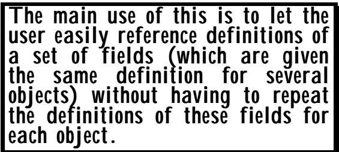
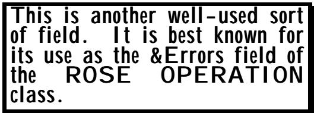
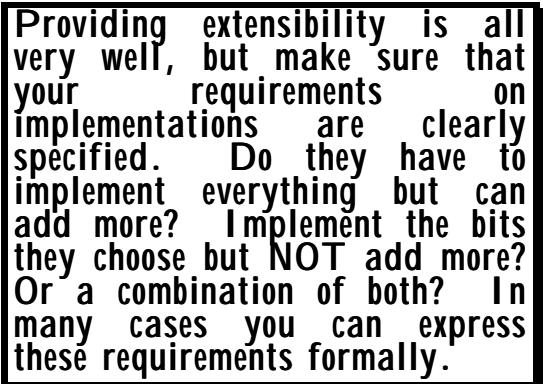
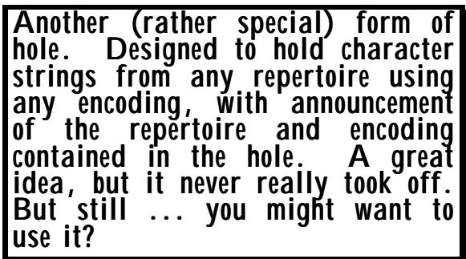

# Chapter 7 More on classes, constraints, and parameterization 第七章 关于类、约束条件以及参数化的更多内容

# (Or: More than you ever wanted to know!) （或者：比你想知道的一切还要多！）

Summary: 总结：

This chapter: 这一章：

• describes all the different sorts of Information Object Class Field that are available for use in a class definition; • 描述了在类定义中可以使用的各种信息对象类字段的类型；

describes the "variable syntax" for defining Information Objects (this is arguably the most important area covered in this chapter - read that material if you read nothing else); 文中描述了定义信息对象的“可变语法”。这可以说是本章中最重要的内容之一——如果你没有其他选择，那就务必阅读这部分内容。

• completes the discussion of constraints and of parameterization; • 完成了关于约束条件和参数化的讨论；

• describes the TYPE-IDENTIFIER built-in class; • 描述了内置类 TYPE-IDENTIFIER；

• completes the discussion of ASN.1 notational support for "holes". • 完成了关于 ASN.1 表示法对“空洞”处理的相关讨论。

## 1 Information Object Class Fields 1. 信息对象类别字段

There are many different sorts of information that generic protocol specifiers have found they wanted to collect from their users to complete their protocol, and ASN.1 allows the specification of a variety of different sorts of Information Object Class Field. Here we briefly look at each in turn. Figure II-21 gives an artificial example of an Information Object Class in which all the different sorts of field appear. 通用协议规范器们发现，他们需要从用户那里收集各种类型的信息来完善他们的协议。ASN.1 则允许定义多种不同类型的信息对象字段。下面我们将逐一介绍这些字段。图 II-21 展示了一个信息对象类的示例，其中包含了所有不同类型的字段。

There are many sorts of fields for Information Object Classes. Some are frequently used, some are rarely encountered. This clause lists them all! 信息对象类有多种不同的应用场景。有些应用非常常见，有些则比较少见。这一条列出了所有这些情况！

There are examples of all these different sorts of fields in current protocol specifications, but some are much more common than others. 在当前的协议规范中，有各种不同领域的例子，但其中有些领域比其他领域更为常见。

```txt
ILLUSTRATION ::= CLASS
    {&Type-field,
    &fixed-type-value-field INTEGER,
    &variable-type-value-field &Type-field,
    &Fixed-type-value-set-field My-enumeration,
    &Variable-type-value-set-field &Type-field,
    &object-field OPERATION,
    &Object-set-field ERROR }
Figure II-21: An illustration of the different sorts of field 
```

References to these fields such as 关于这些领域的参考，例如：

ILLUSTRATION.&fixed-type-value-field 插图与固定类型值字段

are possible in ASN.1 notation (constrained by an actual object set or unconstrained). Use of this notation is called information from object class. 这些定义在 ASN.1 表示法中是可以实现的（要么受限于某个实际的对象集，要么完全不受限制）。这种表示法被称为来自对象类的信息。

It is also in general possible to have references to fields of defined Information Objects and defined Information Object Sets using notation such as 通常也可以使用诸如“字段”之类的表达方式来指代定义好的信息对象或信息对象集。

illustration-object.&Type-field 插图对象。&类型字段

Illustration-object-set.&fixed-type-value-field 插图-对象集。&固定类型值字段

Use of this notation is called information from object and information from object set. 这种表示方式被称为“来自单个对象的信息”和“来自对象集的信息”。

In some cases, such notation is forbidden (see the Standard for a simple table of what is legal and what is not, and following text for a general description). A good guide, however, is if it makes some sort of sense, then it is legal. We discuss below the meaning and usefulness of these notations for each sort of field, and the circumstances in which you might want to use them. 在某些情况下，这种表示方式是被禁止的（请参阅标准文档，其中列出了哪些情况是合法的，哪些是不合法的）。不过，一个基本的判断标准是：如果这种表示方式有一定的意义，那么它就是合法的。我们在下文中会讨论这些表示方式对于每种字段的意义和实用性，以及在什么情况下应该使用它们。

## 1.1 Type fields 1.1 类型字段

The type field we have already encountered. The field-name has to start with a capital letter, and may be followed immediately by a comma, or we can write, for example: 我们已经遇到过“类型”这个字段了。字段名必须以大写字母开始，之后可以立即加上逗号，或者也可以这样写：

Type fields are common and important. They fill in the holes in protocols, and the need for them drove the development of the Information Object Class concept. 类型字段非常常见且重要。它们填补了协议中存在的空白，而对这些字段的需求促成了信息对象类概念的产生。

## &Type-field-optional OPTIONAL, &Type-field-defaulted DEFAULT NULL, &类型字段可选，&类型字段默认值为 NULL。

In the case of OPTIONAL, then that field may be left undefined when an Information Object of that class is defined. That field is then empty, and "empty" is distinct from any value that could be put into the field. The rules for applying an Information Object Set as a constraint say that a match occurs with an empty field only if the corresponding element in the SEQUENCE is missing. Thus it only makes sense to write OPTIONAL in the class definition if OPTIONAL also appears on the corresponding element (the "hole") in the type definition of the protocol. By contrast, DEFAULT places no requirements on the protocol, it merely provides the type to be used if none is specified in the definition of a particular information object. In the illustration above we have specified NULL. It could, of course, be any ASN.1 type, built-in or user-defined, but use of NULL with DEFAULT is the most common. 在 OPTIONAL 的情况下，当定义了此类信息对象时，该字段可以被定义为未定义状态。此时该字段为空，而“空”这个状态与可以赋予该字段的任何值都是不同的。关于如何将信息对象集作为约束条件的规则指出，只有当序列中的相应元素不存在时，才会发生与空字段的匹配。因此，只有在协议类型定义中对应的元素也出现 OPTIONAL 时，才在类定义中使用 OPTIONAL 是有意义的。相比之下，DEFAULT 并不对协议提出任何要求，它只是提供了一种在特定信息对象的定义中未指定其他类型时可以使用的类型。在上面的示例中，我们指定了 NULL。当然，它可以是任何 ASN.1 类型，无论是内置类型还是用户定义类型。不过，结合 DEFAULT 使用 NULL 是最常见的做法。

If we use the "information from object class" notation unconstrained, we have what is called an "open type". This really means an incomplete specification with no indication of who will provide, and where, the completion of the specification. Such use is not forbidden, but it should have been! Don't do it! Use with a simple table constraint is not much better, as the decoder has no way of knowing which of a set of types have been encoded, and without such knowledge encodings can be ambiguous. There is a special constraint that can be supplied to an "open type" called a type constraint. This was mentioned briefly in clause 8 of the last chapter. Here we might write 如果我们不使用任何约束条件，而是完全采用“对象类信息”的表示方式，那么就会得到一种被称为“开放类型”的规范。这实际上意味着一种不完整的规范，没有任何指示表明由谁来负责完成该规范。虽然这种使用方式并非被严格禁止，但实际上应该避免这样做！如果仅使用简单的表格约束来定义“开放类型”，情况也不会好到哪去，因为解码器无法知道哪些类型被编码了，而如果没有这样的信息，编码结果就会变得模糊不清。对于“开放类型”，还有一种特殊的约束条件可以施加，即类型约束。这一点在上一章的第 8 节中有简要提及。在这里，我们可以这样表述：

 

$$
\text { ILLUSTRATION. } \& \text { Type - field (My - type) }
$$

 

In terms of the semantics it carries, it is exactly equivalent to writing just "My-type", but it gets an extra length wrapper in PER, and is generally handled by tools as a pointer to a separate piece of memory rather than being embedded in the containing data-structure. It is useful if there are a number of places in the protocol that have some meta-semantics associated with them (such as types carrying security data), so that by writing as an element of a SEQUENCE or SET 从语义上讲，它等同于直接编写“My-type”。不过，它会在 PER 中额外加上一个长度描述符。通常，这种结构会被工具当作指向单独一块内存的指针来处理，而不是嵌入到包含它的数据结构中。如果协议中有多个地方包含某种元语义（例如，类型携带安全数据），那么这种写法就非常有用，因为可以将它作为序列或集合中的一个元素来使用。

 

$$
\text { SECURITY - DATA. \& Type - field (Data - type - 1) }
$$

 

you identify the element as the ASN.1 type "Data-type-1", but clearly flag it as a "SECURITY-DATA" type. 你将该元素识别为 ASN.1 类型“Data-type-1”，但实际上将其标记为“SECURITY-DATA”类型。

Use of "information from object set" for a type field is illegal. This would in general produce a set of ASN.1 types (one from each of the objects in the object set), and there is nowhere in ASN.1 where you can use a set of types. 在类型字段中使用“来自对象集的信息”这一表述是不合法的。通常来说，这会产生一组 ASN.1 类型（每个对象类型对应一个类型），而在 ASN.1 标准中，并没有规定可以使用这样的类型集合。

Use of "information from object" for a type field produces a single type, and an alternative to the previous SEQUENCE or SET element using "Data-type-1" could in suitable circumstances be 在类型字段中使用“来自对象的信息”可以生成一种单一的类型。在适当的情况下，这种类型可以替代之前使用的“序列”或“集合”元素，采用“数据类型 1”来表示。

 

$$
\text { object1. } \& \text { Type - field }
$$

 

with 随着

$$
\begin{array}{l} \text {object1} \quad \text {SECURITY - DATA}:: = \\ \{\& \text {Type - field} \quad \text {Data - type - 1}, \\ \text {etc} \} \end{array}
$$

Note that this latter construction flags Data-type-1 as a SECURITY-DATA type, but it does not produce the encapsulation that the earlier construct produced. Use of "object1.&Type-field" produces exactly the same encoding as use of "Data-type-1" would produce. 需要注意的是，后一种构造方式将“Data-type-1”标记为安全性数据类型，但它并不能产生与之前构造方式相同的封装效果。使用“object1.&Type-field”所产生的编码结果，实际上与使用“Data-type-1”所产生的编码结果是完全相同的。

## 1.2 Fixed type value fields 1.2 固定类型值字段已修复

The names of these fields are required to begin with a lower-case letter, and the name is required to be followed by an ASN.1 type which specifies the type of the value that has to be supplied for that field. It is again permissible to include OPTIONAL and DEFAULT in this specification, and also UNIQUE (as described in the last chapter). 这些字段的名称必须以小写字母开头，名称之后需要加上 ASN.1 类型，该类型用于指定该字段所包含的值的类型。在这个规范中，也可以包含 OPTIONAL 和 DEFAULT 属性，此外还有 UNIQUE 属性（如最后一章中所描述的那样）。

Closely linked to type fields, these are again frequently encountered. 这些内容与类型字段密切相关，因此也经常会被遇到。

The most common types for these fields are INTEGER or OBJECT IDENTIFIER or a choice of the two, but BOOLEAN or an ENUMERATED type are also quite common. The latter two are used when the information being collected is not designed to be carried in a protocol message, but rather completes a "hole" in the procedures. 这些字段最常见的类型包括 INTEGER、OBJECT IDENTIFIER，或者其中的一种组合。不过，BOOLEAN 或 ENUMERATED 类型也很常见。当收集的信息不适合通过协议消息传递时，就会使用后两种类型。在这种情况下，这些类型可以填补程序中的空白。

For example, to take our ROSE example again, suppose that we allow the possibility that for some operations "ReturnResult" carries no information. This could be handled by putting OPTIONAL in the class definition of OPERATION.&ResultType, and also on the "hole" element of the "ReturnResult" SEQUENCE. However, we may want to go further than that. In cases where there is no result type, we may want to specify that, for some non-critical operations, the "ReturnResult" is never sent (a "Reject" or "ReturnError" will indicate failure), for others it must always be sent as a confirmation of completion of the operation, and for still others it is an option of the remote system to send it or not. In this case the fixed type value field might read: 例如，再次以 ROSE 为例。假设某些操作情况下“ReturnResult”并不包含任何信息。这可以通过在 OPERATION 类的定义中使用 OPTIONAL 属性来实现，同时也可以在“ReturnResult”序列的“hole”元素上设置此属性。然而，我们可能希望更进一步考虑这种情况。在某些没有结果类型的情况下，我们可能需要规定：对于某些非关键性的操作，“ReturnResult”根本不会被发送（此时会返回“Reject”或“ReturnError”来表示失败）；而对于其他操作，则必须始终发送“ReturnResult”作为操作完成的确认；还有一些情况，远程系统可以选择是否发送“ReturnResult”。在这种情况下，“ReturnResult”的固定类型值字段可能如下所示：

## &returnResult ENUMERATED {always, never, optional} DEFAULT always, &返回结果可以是以下枚举值：always、never、optional。默认值为 always。

and the ROSE user would specify a value of "never" or "optional" for operations where this was the required behaviour. 对于需要这种行为的操作，ROSE 用户可以指定“从不”或“可选”的值。

The use of the "information from object class" construct in this case produces simply the type of the fixed type value field. So use of 在这种情况下，使用“来自对象类的信息”结构只会返回固定类型的值字段的类型。因此，只需使用该结构即可。

 

$$
\text { ILLUSTRATION. } \& \text { fixed - type - value - field }
$$

 

is (almost) exactly equivalent to writing 几乎相当于直接书写出来

## INTEGER 整数

The difference is that you cannot apply a table constraint with an object set of class ILLUSTRATION to the type INTEGER. You can apply it (and frequently do) to the "information from object class" construct. 区别在于，你无法将表约束应用于\`ILLUSTRATION\`类对象类型的\`INTEGER\`类型。不过，你可以将表约束应用于“来自对象类的信息”结构，而且通常也是这么做的。

Both "information from object" producing (in this illustration) a single integer value and "information from object set" producing a set of integer values (a subset of type integer) are allowed in this case. Thus with an object set "Illustration-object-set" of class ILLUSTRATION, we could write 在这种情况下，允许使用一种方式是从单个对象中获取信息，这种方式会返回一个整数值；另一种方式则是从一组对象中获取信息，这组对象会返回一组整数值（属于整数类型的子集）。因此，以“Illustration-object-set”这类对象作为示例，我们可以写成这样的表达式：

 

$$
\text { Illustration - object - set. } \& \text { fixed - type - value - field }
$$

 

instead of 而不是

## ILLUSTRATION.&fixed-type-value-field (Illustration-object) 插图与固定类型值字段（插图对象）

What is the difference? Not a lot! In the latter case, you could use "@" with a relational constraint (on a type field of class ILLUSTRATION) to point to this element. In the former case you could not. The latter is what you will normally see. 有什么区别呢？其实并没有太大的差异！在后一种情况下，你可以使用“@”符号，并结合关系约束（针对 ILLUSTRATION 类的类型字段），来指向这个元素。而在前一种情况下，则无法使用这种符号。通常，我们会看到后一种情况的应用。

## 1.3 Variable type value fields 1.3 变量类型的值字段

This is probably the second least common sort of field. Its main use is to provide a default value for a type that is provided in a type field. 这大概是第二种较为少见的字段类型了。它的主要用途是为某个类型字段提供一个默认值。

<table><tbody><tr><td data-imt-p="1">Much less common. An interesting example of a theoretically useful concept! 比较少见。不过，这确实是一个在理论上很有用的有趣例子！</td></tr></tbody></table>

The field name is followed by the name of some type field (&T-F say) defined in this class definition. The value supplied for the variable type value field in the definition of an information object of this class is required to be a value of the type that was supplied for the &T-F field. 该字段名称之后是该类定义中定义的某种类型字段的名称（例如&T-F）。在定义该类的信息对象时，为变量类型字段提供的值必须属于与&T-F 字段相同类型。

This field can be marked OPTIONAL or DEFAULT, but there are then rules that link the use of OPTIONAL and DEFAULT between this field and the field &T-F. Roughly, if it makes sense it is allowed, if it doesn't it is not! Check the Standard (or use a tool to check your ASN.1) if you are unsure what is allowed and what is not. Roughly, both this field and &T-F must have, or not have, the same use of OPTIONAL or DEFAULT, and in the latter case, the default value for this field must be a value of the default type for the &T-F field. 这个字段可以标记为 OPTIONAL 或 DEFAULT，但有一些规则规定了如何结合使用 OPTIONAL 和 DEFAULT 属性。大致来说，如果某个值合理，就可以使用该属性；如果不合理，则不能使用。如果你不确定哪些值是允许的、哪些是不允许的，可以参考标准规范（或者使用工具来检查你的 ASN.1 描述）。此外，这个字段和&T-F 字段都必须使用相同的 OPTIONAL 或 DEFAULT 属性，如果使用了后者，那么这个字段的默认值就必须是&T-F 字段的默认类型值。

As you would expect for a field which holds a single value, the field-name has a lower-case letter following the "&". 正如你所预期的那样，对于一个只包含一个值的字段来说，字段名称应该以小写字母开头，后面跟着“&”符号。

The use of "Illustration-object-set.&variable-type-value-field" is forbidden (not legal ASN.1). The use of "illustration-object.&variable-type-field" produces the value assigned to that field. 禁止使用“Illustration-object-set.&variable-type-value-field”这种表达方式（不符合合法的 ASN1 规范）。如果使用“illustration-object.&variable-type-field”，则只会得到该字段所赋的值。

## 1.4 Fixed type value set fields 1.4 已修复固定类型的值设置字段问题

These are fields that hold a set of values of a fixed type, and hence the field-name starts with an upper-case letter after the ampersand. 这些字段存储的是固定类型的值集合，因此这些字段的名称在通配符之后以大写字母开头。

Quite frequently used, mainly where we need to fill in holes in the procedures of a protocol, and have a list (an enumeration) of possible actions, some of which need to be selected and others forbidden. 这种方法被广泛使用，主要用于填补协议流程中的空白之处。需要列出所有可能的操作选项，其中一些是可选的，而另一些则被禁止。

The information required here is a set of values of the type following the field-name (the governor type), or in other words, a subset of that type. These values can be supplied either by a typereference to a type which is the governor type with a simple subtype constraint applied it, or can be supplied using the value-set notation described in the last chapter. 这里需要的信息是一组符合字段名称后边的类型定义的值，换句话说，就是该类型的一个子集。这些值可以通过对作为父类型的类型进行类型引用来提供，同时还需要施加简单的子类型约束；或者，也可以使用在上一章中描述的数值集表示法来提供这些值。

The most common occurrence of this field is where there are a number of possibilities, and the definer of an Information Object is required to select those that are to be allowed for this Information Object. 这个领域最常见的情形是，存在多种可能性，此时需要确定该信息对象的定义者来选择那些被允许使用的可能性。

Thus, in a class definition: 因此，在一个类定义中：

```txt
&Fixed-type-value-set-field
ENUMERATED {confirm-by-post, confirm-by-fax,
    confirm-registered, confirm-by-e-mail
    confirm-by-phone}, 
```

might be used to let the user specify that, for some particular information object, some subset of the enumeration possibilities can be used. It is left to the reader's imagination to flesh out the above definition into a real fictitious scenario! 这个特性可以用来让用户指定：对于某些特定的信息对象，可以使用其中的一部分枚举选项。至于如何将上述定义具体化为一个真实的虚构场景，则取决于读者的想象力了！

Extraction of information from both objects and object sets using this field both produce a (sub)set of values of the type used in the class definition, containing just those values that appear in any of the objects concerned. 通过此字段从对象及其集合中提取信息，可以得到一个包含与类定义中使用的类型相匹配的值的（子）集合。这个集合中只包含那些出现在相关对象中的值。

## 1.5 Variable type value set fields 1.5 变量类型值用于设置字段

I (the author of this text!) am not at all sure that this sort of field does actually occur in practice. It was added largely because it seemed to be needed to "complete the set" of available sorts of field! Find a good use for it! 我（这篇文的作者）并不确定这种字段在实际情况中是否真的存在。之所以添加这种字段，主要是因为觉得有必要“完善”现有的字段种类吧！希望能找到它的合理用途。

In this box I can say "this has never been used!". In the body of the text I am more cautious! 在这个框里，我可以填写“这个从未被使用过！”。而在文本主体部分，我则会更加谨慎一些！

It begins with an upper-case letter, and the field-name is followed by the name of some type field (&T-F) in the same class definition. The field is completed by giving a set of values (a subset) of the type that is put into &T-F. 这个字段以一个大写字母开头，之后是字段名称，接着是同一类定义中某种类型字段的名称。该字段通过给出该类型的一组值来完整描述，这些值属于该类型的一个子集。

Extraction of information from an object gives the value assigned to that field, but notation to extract information from an object set is illegal for this field type. 从某个对象中提取信息会为该字段赋予相应的价值，但针对这种字段类型，从对象集合中提取信息的表示方法是不合法的。

## 1.6 Object fields 1.6 对象字段

Perhaps surprisingly, this is less common than the object set field described below, but it is used. 或许令人惊讶的是，这种用法比下面提到的“对象集字段”要少见一些，但依然被使用。

The object field carries the identification (an information object reference name) of some object of the class that follows the field name. 该对象字段携带了与字段名称对应的类中的某个对象的标识（即信息对象引用名称）。



This is the object-and-class equivalent of the fixed type value field. 这是对象与类级别的固定类型值字段的等价物。

Its main use is to help in the structuring of information object definitions. If every object of one class (MAIN-CLASS say) is going to require certain additional information to be specified which would add a number of fields to MAIN-CLASS (and if the same additional information is likely to be specified frequently for different objects of MAIN-CLASS) then it makes sense to define a separate class (ADDITIONAL-INFO-CLASS say). Objects of ADDITIONAL-INFO-CLASS carry just the additional information, and references to them are included in an object field of MAIN-CLASS. 它的主要用途是帮助构建信息对象的定义。如果某个类（比如 MAIN-CLASS）中的每个对象都需要指定某些额外的信息，那么这就会为 MAIN-CLASS 增加一些字段。而且，如果同样的额外信息需要为 MAIN-CLASS 中的不同对象反复指定，那么定义一个单独的类（比如 ADDITIONAL-INFO-CLASS）就很有意义了。ADDITIONAL-INFO-CLASS 中的对象只包含额外的信息，而对这些信息的引用则会被包含在 MAIN-CLASS 的某个对象字段中。

Information from an object and from an object set produces a single object or a set of objects respectively. Use of these constructions is mainly useful if we have two classes defined that are closely related (the Directory OPERATION-X and CHAINED-OPERATION-X are examples), with one having the fields of the other as a subset of its fields. In this case it can avoid "fingertrouble" in the definition (and provide a clearer specification) if objects defined for CHAINED-OPERATION-X have the fields that correspond to OPERATION-X defined by extracting information from the corresponding OPERATION-X object, rather than repeating the definition over again. (This point actually applies to the use of information from object for all the different sorts of field.) 从一个对象中获取的信息会对应生成一个独立的对象；而从一组对象中获取的信息则对应生成一组对象。这种构造方式在以下情况下非常有用：当我们有两个紧密相关的类时（例如 Directory OPERATION-X 和 CHAINED-OPERATION-X），其中一个类的字段是另一个类的字段的子集。这样一来，就可以避免定义时的重复劳动（通过从相应的 OPERATION-X 对象中提取字段信息来定义 CHAINED-OPERATION-X 中的对象），从而提供更清晰的规范。实际上，这一点适用于所有需要使用对象信息的情况。

## 1.7 Object set fields 1.7 对象设置字段

We have already seen this in use to list the errors associated with an operation. As expected for something that is a set of objects, the & is followed by an upper-case letter. 我们已经看到这种用法，它用于列出与某个操作相关的错误。正如预期的那样，对于一组对象来说，&后面会跟着一个大写字母。



Information from object and from object set is again permitted, with the obvious results. 再次允许获取单个对象的信息以及对象集合的信息，所带来的效果非常明显。

## 1.8 Extended field names 1.8 扩展的字段名称

When you are referencing fields of a class, object, or object set, you may end up with something that is itself a CLASS or object or object set (for example, OPERATION.&Errors delivers the ERROR class). When this happens, you are able to add a further "." (dot) followed by a field-name of the class you obtained. 当您引用某个类、对象或对象集的字段时，最终可能会得到另一个类或对象（例如，OPERATION.&Errors 会返回 ERROR 类）。在这种情况下，您可以再添加一个点 "."，然后跟上该类的字段名称。


Thus 因此，就是如此。

OPERATION.&Errors.&ParameterType 操作、错误与参数类型

and 以及

OPERATION.&Errors.&errorCode 操作、错误及错误代码

are valid notations, and are equivalent to: 这些都是有效的表示方式，且等价于以下内容：

and 以及

ERROR.&ParameterType 错误。&参数类型

ERROR.&errorCode 错误。&errorCode

Similar constructions using an information object set of class OPERATION are more interesting. 使用 OPERATION 类的信息对象集进行类似构建的方式更为有趣。

Here 这里

My-ops.&Errors.&errorCode 我的操作。&错误。&错误代码

delivers the set of values that are error codes for any of the operations in "My-ops", and 在“我的操作”中，会传递出所有操作的错误代码所对应的数值集，以及……

my-look-up-operation.&Errors.&errorCode 我的查询操作。&错误。&错误代码

delivers that set of values that identify the possible errors of "my-look-up-operation". 传递了那组价值观，这些价值观定义了“我的查询操作”可能产生的错误。

Of course, this can proceed to any length, so if we have an object set field of class OPERATION that is itself a set of objects of class OPERATION (this does actually occur in ROSE - the field is called "&Linked" and records so-called "linked operations"), we can write things like: 当然，这种情况可以持续下去。因此，如果我们有一个属于 OPERATION 类的对象集合，而这个集合本身又是由 OPERATION 类的对象构成的集合（实际上在 ROSE 中确实存在这种情况——这个集合被称为“&Linked”，它记录了所谓的“链接操作”）。那么我们可以写出类似这样的代码：

my-op.&Linked.&Linked.&Linked.&Linked.&Errors.&errorCode 我的操作出现了错误。错误代码：errorCode

This stuff is utterly fascinating - yes? But the reader is challenged to find a real use for it! (To be fair to ASN.1, these sorts of notation come out naturally if one wants consistency and generality in the notation, and cost little to provide. It is better that they are allowed than that what are fairly obvious notations be disallowed.) 这东西真是太有趣了，对吧？不过，读者需要自己找出它的实际用途呢！（公平地说， ASN.1 的规范之所以采用这种表示方式，是因为希望在整个规范中保持一致性和通用性，而且这种表示方式在实现起来也相当简单。与其禁止使用那些显而易见的表示方式，不如允许使用这种方式更为明智。）

## 2 Variable syntax for Information Object definition 2 种用于定义信息对象的变量语法结构

Historically, before the concept of Information Object Classes was fully-developed, an earlier feature of ASN.1 (now withdrawn), the so-called macro notation, was used by ROSE (and others) to provide users with a notation for defining the 从历史来看，在“信息对象类”这一概念完全成熟之前，ASN.1 协议中有一个更早的功能（现已不再使用），即所谓的宏注释方式。当时，ROSE 等工具使用这种注释方式来为用户定义各种对象。

A few techies define information object classes, but a lot of users define objects of those classes, and even more (non-techie) people read those definitions. We need a human-friendly notation to define objects of a given class. "Variable syntax" is important and much used. 有一些技术专家负责定义信息对象类，但有很多用户自己来定义这些类的对象。还有更多的人（非技术人士）阅读这些定义。我们需要一种易于理解的符号来表示某个类中的对象。“可变语法”非常重要，而且被广泛使用。

information needed to fill in the holes in their protocols. The notation that ROSE (and others) provided was quite human-friendly. It certainly did not contain the "&" character, and often did not contain any commas! It frequently read like an English sentence, with conjunctions such as "WITH" being included in the notation, or as a series of keyword-value pairs. 这些信息对于填补协议中的空白是必要的。ROSE（以及其他系统）所使用的表示方式非常易于理解。这种表示方式确实没有使用“&”符号，而且通常也不使用逗号。这种表示方式常常看起来像一句英文句子，其中包含了诸如“与”这样的连词，或者由一系列关键词-值对组成。

For example, to define a ROSE operation, you would write: 例如，要定义一种 ROSE 操作，你可以这样编写：

```txt
my-op OPERATION
    ARGUMENT Type-for-my-op-arg
    RESULT Type-for-my-op-result
    ERRORS {error1, error4}
::= local 1 
```

(In the following text, we call this the ad-hoc-notation.) （在接下来的文本中，我们将其称为“临时标记法”。）

This was ad-hoc-notation defined by ROSE. (Other groups would define similar but unrelated syntax - in particular, some used comma to separate lists of things, others used vertical bar). 这是一种由 ROSE 定义的临时标记方式。（其他团队也会使用类似的但不同的语法结构——例如，有些团队用逗号来分隔列表项，而另一些团队则使用竖线来表示分隔。）

It is important to note here that when this syntax was provided (in advance of the Information Object Class concept) there was little semantics associated with it. The above notation formally (to an ASN.1 tool) was nothing more than a convoluted syntax for saying: 需要注意的是，在“信息对象类”概念出现之前，当这种语法被提出时，其实并没有相关的语义说明。上述表示法对 ASN.1 工具来说，只不过是一种复杂的语法结构，用来表达某种含义而已。

```txt
my-op CHOICE {local INTEGER, global OBJECT IDENTIFIER} ::= local:1 
```

and typically the value reference "my-ops" was never used anywhere. A lot of information was apparently being collected, but was then "thrown on the ground" (in terms of any formal model of what the text meant). 通常，那个所谓的“my-ops”这个值根本没有被任何地方使用过。显然，有很多信息被收集起来，但这些信息随后就被“扔掉了”（也就是说，那些信息并没有被纳入到任何关于这些文本意义的正式模型中）。

(As an aside, the inclusion of the ":" (colon) above after "local" is not fundamental to this discussion - it resulted from the fact that a choice value was expressed in early work as (eg) "local 1" and post-1994 as "local:1"). （顺便说一下，在“local”之后加上“:”符号并不是这一讨论的核心内容——实际上，之所以要加上这个符号，是因为在早期的工作中，选项的值被表示为“local 1”，而自 1994 年之后则改为“local:1”。）

The above notation was, however, designed really to serve the same purpose that you would get today with the object definition: 不过，上述符号表示方式其实也是为了达到与今天通过对象定义所实现的功能相同的目的：

```txt
my-op OPERATION ::=
    {&operationCode local:1,
    &ArgumentType Type-for-my-op-arg,
    &ResultType Type-for-my-op-result,
    &Errors {error1 | error4} } 
```

(We call this below the object-definition-notation.) （我们在对象定义与符号之下进行这样的处理。）

We can observe a number of things. First, the ad-hoc-notation is probably easier for a human to read than the object-definition-notation, although the lack of a clear semantic under-pinning would confuse more intelligent readers! Second, because the notation was ad hoc, it was very difficult to produce any tool support for it. Third, because the notation was ad hoc, a tool had no means of knowing when this ad hoc notation terminated and we returned to normal ASN.1 (there were no brackets around the ad-hoc-notation). Finally, there was no formal link (such as we get by using an Information Object Set as a constraint) between use of this notation and holes in the ROSE protocol. 我们可以观察到一些特点。首先，这种临时性的标记方式可能比对象定义式标记更容易被人理解；不过，由于缺乏明确的语义基础，这会让更聪明的读者感到困惑。其次，由于这种标记方式是临时性的，因此很难为此开发相应的工具来支持其使用。第三，由于这种标记方式是临时性的，因此没有工具能够判断这种临时标记何时结束，从而回到正常的 ASN.1 标准（在临时标记周围没有括号）。最后，这种标记方式与 ROSE 协议中的漏洞之间没有任何形式的关联（比如通过以信息对象集作为约束条件来实现关联）。

Nonetheless, when the Information Object Class material was introduced into ASN.1 (and the use of macro notation withdrawn) in 1994, it was felt important to allow a more human-friendly (but still fully machine-friendly, and with full semantics) notation for the definition of objects of a given class. 不过，当在 1994 年将“信息对象类”相关的规范引入到 ASN.1 中时（同时不再使用宏表示法），人们认为有必要提供一种更易于人类理解的表示方式来表示特定类别的对象。当然，这种表示方式仍然完全符合机器处理的要求，并且具有完整的语义表达能力。

The aim was to allow definers of a class to be able to specify the notation for defining objects of that class which would let them get as close as possible (without sacrificing machineprocessability) to the notation that had hitherto been provided as ad-hoc notation. The "variable syntax" of ASN.1 supports (fulfills) this aim. 我们的目标是让一个类的定义者能够指定该类对象的表示方式，这样就能在不过度牺牲机器处理能力的前提下，尽可能接近以往所使用的临时表示方法。ASN.1 中的“变量语法”正是为了实现这一目标的工具。

Variable syntax requires that a class definition is immediately followed by the key words "WITH SYNTAX" followed by a definition of the syntax for defining objects of that class. If those keywords are not present following the class definition, then the only available syntax for defining objects is the object-definition-notation. (The latter can still be used by users defining objects even if there is a "WITH SYNTAX" clause.) 可变语法要求，在类定义之后必须紧接着出现“WITH SYNTAX”这个关键词，然后才是对该类对象进行定义的语法说明。如果类定义之后没有出现这些关键词，那么唯一可用的对象定义语法就是对象定义符号法。（即使存在“WITH SYNTAX”条款，用户仍然可以使用对象定义符号法来定义对象。）

Figure II-22 adds WITH SYNTAX to the OPERATION class definition. (Again we must emphasise that the real ROSE specification is a little more complex than this - we are not producing a full tutorial on ROSE!) 图 II-22 将“WITH SYNTAX”这一语法添加到“OPERATION”类的定义中。同样需要强调的是，真正的 ROSE 规范其实比这要复杂得多——我们并不打算编写关于 ROSE 的完整教程！

```txt
OPERATION ::= CLASS
    { &operationCode CHOICE {local INTEGER,
    global OBJECT IDENTIFIER}
    UNIQUE,
    &ArgumentType,
    &ResultType,
    &Errors ERROR OPTIONAL }
WITH SYNTAX
    { ARGUMENT &ArgumentType
    RESULT &ResultType
    [ERRORS &Errors]
    CODE &operationCode } 
```

What is this saying/doing? It allows an object of class operation to be defined with the syntax: 这到底是什么意思/做什么呢？它允许使用以下语法来定义一个操作类的对象：

```txt
my-op OPERATION ::=
{ ARGUMENT Type-for-my-op-arg
RESULT Type-for-my-op-result
ERRORS {error1 | error4}
CODE local:1 } 
```

The reader will notice the disappearance of the unsightly "&", the strong similarity between this and the ad-hoc-notation, but also the presence of curly brackets around the definition, needed to maintain machine-processability. 读者会注意到，那些难看的“&”符号已经消失了。这种表示方式与特定场合使用的符号非常相似。此外，定义部分还使用了花括号来表示，这样做是为了保持机器可处理性。

What can you write following "WITH SYNTAX"? Roughly you have the power normally used in defining command-line syntax - a series of words, interspersed with references to fields of the class. In defining an object, the definer must repeat these words, in order, and give the necessary syntax to define any field that is referenced. Where a sequence of words and/or field references are enclosed in square brackets (as with "\[ERRORS &Errors\]" above), then that part of the syntax can be omitted. (Of course, the inclusion of the square brackets was only legal in the definition of the "WITH SYNTAX" clause because "&Errors" was flagged as "OPTIONAL" in the main class definition.) 在“WITH SYNTAX”之后，可以编写以下内容。大致上，你可以使用通常用于定义命令行语法的方式——即一系列单词，同时包含对类中各个字段的引用。在定义对象时，定义者必须按顺序重复这些单词，并提供必要的语法来定义任何被引用的字段。当一系列单词和/或字段引用被放在方括号中时（如上面的“\[ERRORS &errors\]”），那么这部分语法可以省略。（当然，只有在“WITH SYNTAX”子句的定义中，才允许使用方括号，因为“&errors”在类定义中被标记为“可选项”。）

A "word" for the purpose of the WITH SYNTAX clause is defined as a sequence of upper-case (not lower-case) letters (no digits allowed), possibly with (single) hyphens in the middle. 在 WITH 语法中，所谓的“词”被定义为由大写字母组成的序列（不允许使用小写字母），中间可以包含一个或多个连字符。

It is also possible to include a comma (but no other punctuation) in the WITH SYNTAX clause, in which case the comma has to appear at the corresponding point in the definition of an object of that class. 在“WITH SYNTAX”子句中，也可以包含一个逗号（但不需要其他标点符号）。在这种情况下，这个逗号必须出现在该类对象的定义中的相应位置。

Square brackets can be nested to produce optional sections within optional sections. However, there are some quite severe restrictions on the use of "WITH SYNTAX" which are designed both to prevent the apparent acquisition of information with no effect on the actual object definition, and also to ensure easy machine-processability. Writers of a WITH SYNTAX clause should read the Standard carefully. Figure II-23 would, for example, be illegal. 方括号可以嵌套使用，从而在更细小的部分中设置可选内容。不过，对于“WITH SYNTAX”这种语法结构的使用有一些相当严格的规定。这些规定的目的是防止随意获取信息而不会影响实体的实际定义，同时也确保了语句能够被机器轻松处理。编写“WITH SYNTAX”子句的开发者应当仔细阅读相关标准。例如，像图 II-23 这样的结构就是不合法的。

```txt
OPERATION ::= CLASS
    { &operationCode CHOICE {local INTEGER,
    global OBJECT IDENTIFER}
    UNIQUE,
    &ArgumentType,
    &ResultType,
    &Errors ERROR OPTIONAL }
WITH SYNTAX
    { ARGUMENT &ArgumentType
    RESULT &ResultType [REQUIRED]
    [ERRORS &Errors]
    CODE &operationCode }

Figure II-23: Illegal specification of WITH SYNTAX 
```

```txt
OPERATION ::= CLASS
    { &operationCode CHOICE {local INTEGER,
    global OBJECT IDENTIFIER}
    UNIQUE,
    &ArgumentType,
    &ResultType,
    &ReturnsResult ENUMERATED
    {does, does-not},
    &Errors ERROR OPTIONAL }
WITH SYNTAX
    { ARGUMENT &ArgumentType
    RESULT &ResultType
    &ReturnsResult RETURN-RESULT
    [ERRORS &Errors]
    CODE &operationCode } 
```

This is because it allows the definer of an object to provide information by inclusion or not of the word "REQUIRED" which is nowhere recorded in a field of the object. If it is desired to let the definer of an object specify whether the return of a result is required or not, the definition of figure II-24 could be used, allowing: 这是因为，通过这种方式，对象的定义者可以通过是否包含“REQUIRED”这个词来提供相关信息，而这个词在对象的任何字段中都没有被记录。如果希望让对象的定义者能够指定是否需要返回某个结果，那么可以使用图 II-24 的定义方式来实现这一点。

```makefile
my-op OPERATION ::=
{ ARGUMENT Type-for-my-op-arg
RESULT Type-for-my-op-result
does-not RETURN-RESULT
ERRORS {error1 | error4}
CODE local:1 } 
```

Finally, we try to provide a tabular notation for the compact definition of a an object of class OPERATION similar to the table defined originally in Figure II-14. This is shown in figure II-25. 最后，我们试图为 OPERATION 类对象的简洁定义提供一种表格形式的表现方式，类似于图 II-14 中最初定义的表格。该表格形式如图 II-25 所示。

```txt
OPERATION ::= CLASS
    { &operationCode CHOICE {local INTEGER,
    global OBJECT IDENTIFER}
    UNIQUE,
    &ArgumentType,
    &ResultType,
    &Errors ERROR OPTIONAL }
WITH SYNTAX
    { &operationCode
    &ArgumentType
    &ResultType
    [&Errors]
    } 
```

With the definition in figure II-24 we would be allowed to write (compare figures II-14 and II-17): 根据图 II-24 中的定义，我们可以这样书写（参见图 II-14 和图 II-17）：

```txt
My-ops OPERATION ::=
{ {asn-val-order Order-for-stock Order-confirmed
    {security-failure
    | unknown-branch} }
| {asn-val-sales Return-of-sales NULL {security-failure
    | unknown-branch} }
| {asn-val-query Query-availability Availability-response
    {security-failure
    | unknown-branch
    | unavailable } }
| {asn-val-state Request-order-state Order-state {security-failure
    | unknown-branch
    | unknown-order } } 
```

So we have now come full circle! The informal tabular presentation we used in figure II-14 was replaced with the formal but more verbose definition of figure II-17, which (using WITH SYNTAX) can be replaced with syntax very like that of figure II-14. 现在，我们终于回到了原点！在图 II-14 中使用的非正式表格形式，已经被图 II-17 中更为正式且详细的定义所取代。而图 II-17 中的定义，通过采用类似图 II-14 的语法结构，也可以被重新用图 II-14 的语法形式来表示。

It should by now be clear to the reader that WITH SYNTAX clauses should be carefully considered. Not only must the rules of what is legal be understood, but what is a good compromise between verbosity and intelligibility in the final notation has to be determined. As with all human interface matters, there is no one right decision, but a little thought will avoid bad decisions! 现在读者应该已经明白，对于语法规则必须予以高度重视。不仅要了解各种规则的规定，还要确定在保持简洁性的同时，如何达到最佳的可读性。就像所有与人类界面相关的问题一样，并没有一种绝对正确的解决方案，但稍加思考就能避免错误的决策！

## 3 Constraints re-visited - the user-defined constraint 重新审视了 3 个约束条件——即用户自定义的约束条件。

There is not a lot to add on constraints. We have covered earlier all the simple sub-type constraints, and in the last chapter the table and relational constraints. There is just one other form of constraint to discuss, the so-called user-defined constraint. 关于约束条件，其实没有太多需要补充的内容。之前我们已经讨论了所有简单的子类型约束条件，而在最后一章中则探讨了表和关系约束条件。现在还有一种约束条件需要讨论，那就是所谓用户定义的约束条件。

```txt
User-defined constraints - little more than a comment! Why bother? 
```

We discussed above the earlier availability of a notation (the macro notation) that allowed people to define new ad-hoc-notation (with no real semantics) for inclusion in an ASN.1 module. When this "facility" was removed in 1994, it turned out that the Information Object concept did not quite cover all the requirements that had been met by use of this macro notation, and the user-defined constraint concept was introduced to meet the remaining requirements. This form of constraint would probably not have been introduced otherwise, as it is little more than a comment, and tools can make little use of it. It is almost always used in connection with a parameterised type, introduced in clause 9 of II-6. 我们在上面讨论了之前存在的某种标记方式（即宏标记），这种标记方式允许人们定义新的临时标记，这些标记在 ASN.1 模块中可以被使用，但并没有实际的语义含义。当这种“功能”在 1994 年被移除时，我们发现信息对象的概念并不能完全满足使用宏标记时所需要满足的所有要求。因此，人们引入了用户定义的约束概念来满足剩余的需求。不过，这种约束形式可能原本并不会被引入，因为它只不过是一种注释而已，而且各种工具也很少会使用它。这种约束方式几乎总是与参数化类型一起使用，具体信息可以在 II-6 的第 9 条中找到。

One piece of ad-hoc-notation that was defined using the macro notation was the ability to write: 一种使用宏注释定义的特殊注释方式就是能够这样书写：

 

$$
\text { ENCRYPTED My - type }
$$

 

as an element of a SET or SEQUENCE. 作为集合或序列中的一个元素。

Although not implied by the ASN.1 formal text, this actually meant that the element was a BITSTRING, whose contents were an encryption (according to an encryption algorithm specified in English text) of the encoding of the type My-type. 虽然 ASN.1 官方文档中没有明确说明这一点，但实际上这意味着该元素是一个比特串，其内容是根据某种加密算法对类型为“My-type”的编码进行加密后的结果。

We can get slightly more clarity if we define a parameterised type "ENCRYPTED" as : 如果我们把一种参数化类型“ENCRYPTED”定义为如下形式，那么就能更清楚地理解其含义了：

and then use 然后使用它

```txt
ENCRYPTED {My-type} 
```

as the SEQUENCE or SET element. 作为序列或集合中的元素。

(Note that we violate convention, but not the rules of ASN.1 by using all capitals for the ENCRYPTED type. This is for reasons of historical compatibility with the original ad-hocnotation "ENCRYPTED My-type". Note also that the new formal notation includes a new pair of curly brackets, as we saw - for a slightly different reason - with the move from ad-hoc-notation to object-definition-notation.) （请注意，虽然我们违反了常规做法，但并未违反 ASN1 的规范。我们使用全部大写字母来表示“ENCRYPTED”类型，这一做法是为了与原始的非正式标记“ENCRYPTED My-type”保持历史上的兼容性。另外，新的正式标记格式中使用了新的花括号配对方式——这与从非正式标记转换为对象定义标记时采用的方式略有不同。）

The above avoided the use of an ad-hoc-notation, but it is curious for the dummy parameter of "ENCRYPTED" not to be used at all on the right-hand side of the assignment. It is clear that the actual value of the BITSTRING will depend on the "Type-to-be-encrypted" type (and also on the encryption algorithm and keys, which we cannot define using ASN.1). 上述描述中避免了使用特定于情况的注释。不过，有趣的是，在赋值语句的右侧，竟然完全没有使用“ENCRYPTED”这个伪参数。显然，BITSTRING 的实际值取决于“待加密类型”这一参数（同时也取决于加密算法和密钥，而这些内容是无法通过 ASN.1 格式来定义的）。

So we introduce the user-defined constraint. In its basic form, we would write: 因此，我们介绍用户自定义约束条件。在其基本形式下，我们可以这样表述：

```txt
ENCRYPTED {Type-to-be-encrypted} ::= BITSTRING
(CONSTRAINED BY {Type-to-be-encrypted}) 
```

which shows that the dummy parameter is used to constrain the value of BITSTRING. (If there were multiple parameters used in the constraint, these would be in a comma-separated list within the curly braces after CONSTRAINED BY.) 这表明，这个虚拟参数被用来限制 BITSTRING 的值。如果约束条件中使用了多个参数，这些参数将会以逗号分隔的形式列在“CONSTRAINED BY”之后的花括号内。

The constraint is called a "user-defined" constraint because the precise nature of the constraint is not specified with formal ASN.1 notation. This construction almost invariably contains comment that details the precise nature of the constraint. So the above would more commonly be written as: 这种约束被称为“用户定义的”约束，因为其具体性质并未在正式的 ASN.1 标记法中明确说明。这种约束几乎总是会包含一些注释，用来详细说明该约束的具体性质。因此，上述描述通常会这样书写：

```txt
ENCRYPTED {Type-to-be-encrypted} ::= BITSTRING
(CONSTRAINED BY {Type-to-be-encrypted}
-- The BITSTRING is the results of
-- encrypting Type-to-be-encrypted
-- using the algorithm specified
-- in the field security-algorithm,
-- and with the encryption parameters
-- specified in Security-data -- ) 
```

The reader should know enough by now (assuming earlier text has been read and not skipped!) to realise that "security-algorithm" will turn out to be a (UNIQUE) fixed type value field (probably of type object identifier) of some SECURITY-INFORMATION class, with "Security-data" being a corresponding type field of this class that, for any given object of SECURITY-INFORMATION is defined with an ASN.1 type that can carry all necessary parameters for the algorithm that is being defined by that object. There might be other fields of SECURITY-INFORMATION that statically define choices of procedures in the application of the algorithm, filling in procedural "holes" in this process. 读者现在应该已经了解得足够多了（假设之前已经阅读了相关内容且没有跳过任何部分！）。“安全算法”实际上是一个唯一的固定类型值字段，该字段属于某个 SECURITY-INFORMATION 类。而“安全数据”则是该类的对应类型字段。对于任何一个 SECURITY-INFORMATION 对象来说，其安全数据字段都包含一种 ASN 类型，该类型可以携带该算法所需的所有参数。此外，SECURITY-INFORMATION 类还可能包含其他字段，这些字段可以静态地定义算法应用过程中所需的各种参数，从而填补这一过程中的各种“空白”。

<table><tbody><tr><td data-imt-p="1">It is obvious, powerful, and simple! How unusual for ASN.1! 它非常直观、强大且简单！这对 ASN 来说真是罕见啊！</td></tr></tbody></table>

## 4 The full story on parameterization 4. 关于参数化的完整信息

There is not a lot more to add on parameterization, and it is all pretty obvious stuff. But here it is. © OS, 31 May 1999 22 关于参数化的设置，其实并没有太多需要补充的内容，所有操作都相当直观明了。不过，还是在这里说明一下吧。© OS，1999 年 5 月 31 日 22

## 4.1 What can be parameterized and be a parameter? 4.1 哪些事物可以被参数化，并且可以作为参数使用呢？

The box says it all. Any form of reference name - a type reference, a value reference, a class reference, Answer: Anything and everything! an object reference, an object set reference can be parameterised by adding a dummy parameter list after the reference name and before the "::=" when the "thing" the name references is being defined. 这个框里的内容已经说明了一切。任何形式的引用名称都可以使用：类型引用、值引用、类引用、对象引用，甚至是对象集合引用。可以通过在引用名称之后、赋值运算符“::=”之前添加一个虚拟参数列表来为这些引用添加参数。当定义该名称所引用的对象时，就可以使用这些参数了。

Here is an example of a reference name with a complete range of parameters: 以下是一个包含完整参数范围的参考名称示例：

```autohotkey
Example-reference {INTEGER:intval,
My-type,
THIS-CLASS,
OPERATION:My-ops,
ILLUSTRATION:illustration-object} ::= 
```

As we would expect, the initial letter of dummy parameters is upper-case for types, classes, and object sets, and lower case for objects and values. Note that for values, object sets, and objects, the dummy parameter list includes the type or class of these parameters followed by a ":" (colon). (The only one of the above examples that I have not seen in an actual specification is a dummy parameter which is a class (THIS-CLASS above). 正如我们所预期的那样，虚拟参数的首字母对于类型、类以及对象集来说都是大写的，而对于对象和值则使用小写字母。需要注意的是，对于值、对象集以及对象而言，虚拟参数列表中会先列出这些参数的类型或类，然后加上冒号：“”。在上述示例中，唯一一个我没有在实际规范中看到的是作为类的虚拟参数（比如上述示例中的 THIS-CLASS）。

Normally, the dummy parameter is used somewhere on the right-hand side of the assignment, but it can also be used within the parameter list itself (before or after its own appearance). So we could, for example, write: 通常，dummy 参数会被放在赋值语句的右侧某个位置，但它也可以直接出现在参数列表中（在其被声明之前或之后）。例如，我们可以这样写：

 

$$
\text { Example1 } \left\{\text { My - type:default - value, My - type } \right\}:: =
$$

This notation is extremely general and powerful, and has many applications. We have seen the ROSE examples where an Information Object Set is declared as a dummy parameter. This is probably the most common thing that is used as a dummy parameter, but next to that is a value of type INTEGER that is used on the right-hand side as the upper-bound of INTEGER values, or as an upper-bound on the length of strings. 这种表示方式非常通用且强大，有着广泛的应用。我们已经看到了在 ROSE 示例中，信息对象集被声明为虚拟参数的情况。这可能是最常用的虚拟参数用法。除此之外，还有一种情况是使用 INTEGER 类型的值作为右侧参数的上限，或者作为字符串长度的上限。

There is also an important use in the Manufacturing Messaging Formats (MMF) specification. Here the bulk of the protocol specification occurs in a "generic" module, and is common to all cells on a production line. However, specific cells on the production line require some additional information to be passed to them. In the generic module we use a dummy parameter (a type) and include it in our protocol specification as an element of our SEQUENCE and export this parameterised type. Modules for specific cells define a type containing the additional information for that cell, import the generic type, and declare the protocol to be used for that type of cell as the generic type, supplied with the type containing the additional information as the actual parameter. This is similar to the ROSE example, but using a type rather than an information object set. 在制造消息格式规范中，这种用法也非常重要。该规范的大部分内容都体现在一个“通用”模块中，这个模块是生产线上的所有单元都共有的。不过，生产线上的特定单元需要一些额外的信息传递给它们。在通用模块中，我们使用了一个虚拟参数（类型），并将其作为协议规范的一部分包含进来，同时导出这个带有参数化的类型。针对特定单元的模块会定义包含该单元所需额外信息的类型，然后导入通用类型，并声明该类型所使用的协议为通用类型，而包含额外信息的类型则作为实际参数被传递。这与 ROSE 示例类似，但使用的是类型而不是信息对象集。

Let us explore the question of bounds a little further. Few protocols "hard-wire" upper bounds into the specification, but it is always a good idea to specify such bounds, as designers rarely intend to require implementors to handle arbitrarily large integers, iterations of sequences, or arbitrarily long strings. Where such bounds are fixed for the entire protocol, then it is common practice to assign the various bounds that are needed to an integer reference name in some module, then to use EXPORTS and IMPORTS to get those names into the modules where they are used as bounds. 让我们进一步探讨一下关于上限的问题。很少有协议会在规范中明确指定上限值，但无论如何，指定这些上限值还是个好主意，因为设计者通常并不希望要求实现者能够处理任意大的整数、序列的重复项，或者任意长的字符串。当这些上限值在整个协议中都是固定的时候，通常会将各种所需的上限值分配给某个模块中的整数引用名称，然后通过 EXPORTS 和 IMPORTS 将这些名称导入到需要使用这些名称作为上限值的模块中。

Where, however, there are generic types (such as a CHOICE of a number of different character string types) that are used in many places but with different bounds for each use, then using an INTEGER dummy parameter for the bounds is a very effective and common practice. 不过，当存在一些通用类型时（例如，一系列不同字符串类型的选择），这些类型会在许多地方被使用，但每个使用的场景都有其特定的限制条件。在这种情况下，使用一个 INTEGER 虚拟参数来表示这些限制条件是一种非常有效且常见的做法。

It is actually quite rare to see long dummy parameter lists. This is because any collection of information (apart from a class) can easily be turned into a Information Object Set. So with the earlier example (taking MY-CLASS out) of: 实际上，看到较长的参数列表是很罕见的。因为除了类之外，任何信息集合都很容易被转化为信息对象集。所以，以之前的例子为例（去掉 MY-CLASS 这个元素）：

```txt
Example-reference {INTEGER:intval,
My-type,
OPERATION:My-ops,
ILLUSTRATION:illustration-object} ::= 
```

We could instead define: 我们可以这样定义：

```txt
PARAMETERS-CLASS ::= CLASS
    {&intval INTEGER,
    &My-type,
    &My-ops OPERATION,
    &illustration-object ILLUSTRATION} 
```

and then our parameter list just becomes: 然后，我们的参数列表就变成了：

```txt
Example-reference {PARAMETERS-CLASS:parameters} ::= 
```

and on the right-hand side we use (for example) "parameters.&My-type" instead of "My-type". This may seem more cumbersome than using several dummy parameters, but if the same parameter list is appearing in several places, particularly if dummy parameters are being passed down as actual parameters through several levels of type definition, it can be useful to bundle up the dummy parameters in this way. 在右侧，我们通常使用“parameters.&My-type”而不是“My-type”。虽然这种方式看起来比使用多个虚拟参数更繁琐，但如果同一个参数列表出现在多个地方，尤其是当虚拟参数作为实际参数被传递到多个类型定义层次时，将虚拟参数合并起来使用就非常有用。

A particular case of this would be where a protocol designer has identified twelve situations (iterations of sequences, lengths of strings, sizes of integers) where bounds are appropriate, with potentially twelve different integer values for each of these situations, probably with each of the twelve values being used in several places in the protocol. This is again a good case for "bundling". We can define a class: 一个具体的例子是，当协议设计者确定了十二种情况（如序列的迭代、字符串的长度、整数的大小等），在这些情况下需要使用边界值。每种情况可能对应十二个不同的整数值，而这些值可能在协议的多个地方被使用。这再次体现了“捆绑”策略的适用性。我们可以定义一个类来描述这种情况。

```txt
BOUNDS ::= CLASS
    { &short-strings INTEGER,
    &long-strings INTEGER,
    &normal-ints INTEGER,
    &very-long-ints INTEGER,
    &number-of-orders INTEGER}
WITH SYNTAX
{STRG &short-strings, LONG-STRG &long-strings,
    INT &normal-ints, LONG-INT &very-long-ints,
    ORDERS &number-of-orders} 
```

and routinely and simply make an object set of this class a dummy parameter of every type that we define, passing it down as an actual parameter of any types in SEQUENCE, SET, or CHOICE constructions. We can then use whichever of the fields we need in the various places in our protocol. In some type definitions, we might use none of them, and the dummy parameter for that type would be redundant (but still legal), or we might use one or two of the fields, or (probably rarely) all of them. 我们通常只需将这种类型的对象作为所有定义类型的实际参数之一来使用。然后，我们可以在协议中的各个位置使用所需的字段。在某些类型定义中，我们可能不使用任何字段，此时该类型的虚拟参数就是多余的（但仍然是合法的）；或者，我们可能会使用一两个字段，或者（极少数情况下）使用所有字段。

At the point where we define our top-level type (usually a CHOICE type, as we discussed in the early parts of this book), we can set our bounds and supply them as an actual parameter. So if "Wineco-protocol" is our top-level type, we could have: 在我们定义最高级别类型的时候（通常是一个 CHOICE 类型，正如我们在本书的早些章节中提到的），我们可以为这个类型设定边界，并将这些边界作为实际参数来传递。因此，如果“Wineco-protocol”是我们的最高级别类型，那么我们可以这样定义：

```txt
bounds BOUNDS ::= {STRG 32, LONG-STRG 128,
    etc }
Wineco-protocol {BOUNDS:bounds} ::= CHOICE
{ordering [APPLICATION 1] Order-for-stock
{BOUNDS: bounds},
sales [APPLICATION 2] Return-of-sales
{BOUNDS: bounds}
etc. } 
```

No doubt there are some readers that will be saying "What is the point of passing this stuff down as parameters, when (provided "bounds" is exported and imported everywhere), it can be directly used?" The answer in this case is "Not much!". If, for any given type, any set of bounds is always going to be fixed, then there is no point in making it a parameter, a global reference name can be used instead, with a simpler and more obvious specification. But read on to the next section! 无疑，会有一些读者会问：“既然在到处都可以导入和导出‘边界值’的情况下，把这些参数传递下去有什么意义呢？直接使用时不是更方便吗？”这个问题的答案就是：“没什么意义！”。如果对于任何一种类型来说，边界值都是固定不变的，那么将其作为参数传递就没有意义了。相反，可以使用一个全局的引用名称来代替，这样就能实现更简洁、更直观的规范了。不过，请继续阅读下一节吧！

## 4.2 Parameters of the abstract syntax 4.2 抽象语法的参数

Protocol designers are often hesitant about fixing bounds in the body of a protocol definition, even if they are defined in just one place and passed around either by simple import/export or by additionally using dummy parameters. The reason for the hesitation is that bounds can very much "date" a protocol for two reasons: First, what seems adequate initially (for example, for the number of iterations of the "details" SEQUENCE in our "Order-for-stock" type in 协议设计者通常对修改协议定义中的约束条件持犹豫态度，即使这些约束条件只在一个地方被定义，并且可以通过简单的导入/导出方式传递，或者通过使用虚拟参数来传递。之所以会犹豫，是因为约束条件可能会让协议变得过时。原因有两个：首先，最初认为的约束条件可能并不合适（例如，在我们“库存订单”类型中，关于“细节序列”的迭代次数这样的约束条件，可能后来被证明并不必要）。

So you want to leave some things implementation-dependent? Coward! But at least make it explicit (and define exceptionhandling to help interworking between different implementations) Parameters of the abstract syntax let you do that, but they are a rarely-used feature. 所以你想让一些事情的实现方式具有灵活性？真胆小啊！但至少应该明确说明这一点（并定义异常处理机制，以帮助不同实现之间的互操作）。抽象语法中的参数可以让你做到这一点，不过这只是一个很少被使用的功能而已。

Figure 13 of Section I) can well prove inadequate ten years later when the business has expanded and mergers have occurred! Second, bounds are usually applied to ease the implementation effort when implementing on machines with limited memory capacity, or without support for calculations with very long integer values. Such technological limitations do, however, have a habit of disappearing over time. So whilst fifteen years ago, many designers felt that it was unreasonable to have messages that exceeded 64K octets, today implementors on most machines would have no problem handling messages that are a megabyte long. (An exception here would be specifications of data formats for smart cards, where memory is still very limited. This is an area where ASN.1 has been used.) 第 I 部分的图 13 在十年后显然已经不够用了——因为当业务规模扩大且发生了合并之后，这种限制就变得不再适用了。其次，这些限制通常是为了简化在内存容量有限或不支持对非常长整数值进行计算的机器上的实现工作而设定的。不过，这类技术限制随着时间的推移会逐渐消失。因此，十五年前，许多设计师认为超过 64K 字节的消息是不合理的，而如今，大多数机器的实现者都能轻松处理长达一兆字节的消息。（不过，对于智能卡的数据格式规范来说，情况就有所不同，因为此时内存仍然非常有限。在这方面，ASN.1 标准确实发挥了重要作用。）

So ..., if we don't want to put our bounds into the main specification, what to do? Just leave them out? This will undoubtedly cause interworking problems, with some systems not being able to handle things of the size that some other systems generate, and we are not even flagging this up as a potential problem in our ASN.1 specification. 那么……如果我们不想将这些限制因素纳入主要规范中，该怎么办呢？难道就直接把它们省略掉吗？这样做无疑会导致兼容性问题，因为有些系统可能无法处理某些大型数据，而我们在 ASN1 规范中甚至没有将这个问题列为潜在问题。

Providing a "bounds" parameter, but never setting values for it, can help with this problem. We have already seen in figure 21 in Section I Chapter 3 that we can specify our top-level type using the "ABSTRACT- SYNTAX" notation. Let us repeat that now with our parameterised Winecoprotocol developed above: 提供一个“bounds”参数，但不要为其设置具体值，这有助于解决这个问题。在第三章第一节的图 21 中，我们已经看到可以使用“抽象语法” notation 来指定顶层类型。现在，让我们用上面提到的带有参数的 Winecopyrotocol 来再次说明这一点：

$$
\begin{array}{l} \text {wineco - abstract - syntax \{BOUNDS:bounds\} ABSTRACT - SYNTAX :: =} \\ \quad \{\text {Wineco - protocol \{BOUNDS: bounds\} IDENTIFIED BY etc} \} \end{array}
$$

We are now defining our abstract syntax with a parameter list. We have parameters of the abstract syntax. ASN.1 permits this, provided such parameters are used only in constraints. These constraints are then called variable constraints, because the actual bound is implementationdependent. The important gain that we have now got, however, is that this implementationdependence has been made very clear and specific. Where we have a variable constraint, we would normally provide an exception marker to indicate the intended error handling if material is received that exceeds the local bounds. 我们现在使用参数列表来定义我们的抽象语法。我们有一些抽象语法的参数。ASN.1 允许这样做，但前提是这些参数只能用于约束条件中。这些约束被称为可变约束，因为实际的约束条件取决于具体的实现方式。不过，我们现在获得的一个重要好处是，这种实现依赖的特性得到了非常清晰和具体的描述。当存在可变约束时，我们通常会提供一个异常标记，以指示如果接收到超出本地范围的消息时应该如何处理。

In the OSI work, there is the concept of International Standardized Profiles (ISPs) and of Protocol Implementation Conformance Statements (PICS). The purpose of ISPs is to provide a profile of options and parameter values to tailor a protocol to the needs of specific communities, or to define different classes (small, medium, large say) of implementation. The purpose of the PICS is to provide a format for implementors to specify the choices they have made in implementationdependent parts of the protocol. Clearly, the use of parameters of the abstract syntax aids in both these tasks, with values for those parameters either being specified in some profile (which an implementation would then claim conformance to) or directly in the PICS for an implementation. 在 OSI 标准中，存在国际标准化配置文件和协议实施一致性声明的概念。标准化配置文件的目的是提供各种选项和参数值，以便根据特定社区的需求来定制协议，或者定义不同级别的实施方式（例如小型、中型、大型等）。而协议实施一致性声明的目的是为实施者提供一种格式，使他们能够明确在协议依赖部分所做出的选择。显然，使用抽象语法中的参数有助于完成这两项任务——这些参数的取值要么在某个配置文件中被指定，要么直接体现在协议实施一致性声明中。

Parameters of the abstract syntax (with exception markers on all variable parameters) provide a very powerful tool for identifying areas of potential interworking problems, but it is (for this author at least) sad that to-date these features are not yet widely used. 抽象语法中的参数设置（除了所有可变参数的例外情况）是一种非常有效的工具，可以用来识别可能存在互操作问题的区域。不过，令人遗憾的是，目前这些功能还没有得到广泛的应用。至少对我来说，这种情况确实令人遗憾。

## 4.3 Making your requirements explicit 4.3 明确表述你的需求

## 4.3.1 The TYPE-IDENTIFIER class 4.3.1 TYPE-IDENTIFIER 类

A very common Information Object Class is one which has just two fields, one holding an object identifier to identify an object of the class, and the other holding a type associated with that object. This class is in fact pre-defined (built-in) in ASN.1 as the TYPE-IDENTIFIER class. It is defined as: 一种非常常见的信息对象类只有两个字段：一个用于存储该类的对象标识符，另一个用于存储与该对象相关的类型信息。实际上，这种类在 ASN.1 中已经被预定义了，被称为 TYPE-IDENTIFIER 类。其定义如下：



One of only two built-in classes (the other is ABSTRACT-SYNTAX) in ASN.1, and quite well-used. 它是 ASN 中仅有的两个内置类之一（另一个为 ABSTRACT-SYNTAX），并且被广泛使用。

TYPE-IDENTIFIER ::= CLASS {&id OBJECT IDENTIFIER UNIQUE, &Type } WITH SYNTAX {&Type IDENTIFIED BY &id} 类型标识符 ::= 类别 {&类型 对象标识符 唯一, &类型} 语法 {&类型 由 &id 标识}

There are many protocols that make use of this class. It is the foundation stone for a very flexible approach to extensibility of protocols. 有许多协议都使用了这一类接口。它是实现协议可扩展性的一种非常灵活的方法的基础。

## 4.3.2 An example - X.400 headers 4.3.2 一个例子——X.400 头部结构

(As with ROSE, the following is not an exact copy of X.400). （与 ROSE 类似，以下内容并非 X.400 系统的完全复制。）

In X.400 (an e-mail standard), there is the concept of "headers" for a message. A wide range of headers are defined. In the earliest version of X.400, these were hard-wired as types within a SEQUENCE, but it rapidly became clear that new headers would be added in subsequent versions. Of course, the SEQUENCE could just have had the extensibility ellipsis added, with defined exception handling on the ellipsis, ensuring interworking between versions 1 and 2, but an alternative approach is to define the headers as: 在 X.400 标准（一种电子邮件协议）中，存在对消息进行标识的“头部”概念。该标准中定义了多种类型的头部。在 X.400 的早期版本中，这些头部是作为序列中的固定元素来定义的；不过很快便意识到在后续版本中还会添加新的头部。当然，也可以让序列具有可扩展性，为这些扩展元素定义相应的异常处理机制，从而确保版本 1 和版本 2 之间的互操作性。不过，另一种方法是将这些头部定义为：

 

$$
\text { HEADER - CLASS }:: := \text { TYPE - IDENTIFIER }
$$

 

and the actual headers as: 实际的头部信息如下：

```autohotkey
Headers-type {HEADER-CLASS:Supported-headers} ::=
SEQUENCE OF SEQUENCE
{id HEADER-CLASS.&id ( {Supported-headers} !100),
info HEADER-CLASS.&Type ( {Supported-headers}{@id}!101) } 
```

Exception handling 100 and 101 will be specified in the text of the protocol definition. Handling of 100 is likely to be "silently ignore" and of 101 (a bad type) "send an error return and otherwise ignore". 在协议定义文本中，会明确说明对错误代码 100 和 101 的处理方式。对于错误代码 100，可能会选择“忽略处理”；而对于错误代码 101（表示类型错误的情况），则会选择“返回错误信息并忽略其他处理”。

The question is, when we eventually supply an actual parameter for Header-type, what do we provide? Let us examine some options. 问题是，当我们最终为“Header-type”类型提供一个具体的参数时，我们应该提供什么内容呢？让我们来看看一些可行的选项吧。

There will certainly be some headers defined in this version of the protocol, and we will undoubtedly expect to add more in subsequent versions, so we would first define an extensible information object set something like: 在这个版本的协议中，肯定会有一些可扩展的头部信息。在后续的版本中，我们无疑还会继续添加更多的可扩展元素。因此，我们首先定义一组可扩展的信息对象，其结构大致如下：

$$
\begin{array}{l} \text {Defined - Headers HEADER - CLASS : : =} \\ \{\text {header1 | header2 | header3 , ..., header4} \} \end{array}
$$

where header4 was added in version 2. 在版本 2 中，添加了 header4。

But what do we supply as the actual parameter for our protocol? Let us take the most general case first. We consider providing two parameters of the abstract syntax, both object sets of class HEADER-CLASS. One is called "Not-implemented" and the other "Additional-headers". We might want to provide one or both of these or neither, depending on the decisions below. I think you are probably getting the idea! 但是，我们的协议到底会提供哪些具体参数呢？我们先来看最一般的情况。我们考虑提供两个抽象语法的参数，这两个参数都是关于 HEADER-CLASS 类的对象集。其中一个参数被称为“未实现”，另一个则被称为“附加头部”。根据下面的决定，我们可能会选择使用其中一个或两者，或者根本不使用这些参数。我想你们应该已经明白了吧！

Let us now look at various possible views we might take on the requirements of implementations to support headers. 现在让我们来看看关于支持头部字段的各种可能实现方式。

## 4.3.3 Use of a simple SEQUENCE 4.3.3 使用简单的序列

We decide we want to define a fixed set of headers, all to be implemented, no additions, and we will never make later changes. Some headers will be required, others optional. 我们决定要定义一组固定的头部信息，这些信息都需要被实现，不允许添加任何内容，而且之后也不会进行任何修改。有些头部是必需的，而另一些则是可选的。

We got it right first time! 我们第一次就做对了！

This case is easy, and we don't need Information Object Sets, we simply use: 这个案例很简单，我们不需要使用信息对象集，我们只需要这样做就行了：

```txt
Headers ::= SEQUENCE
{header1 Header1-type --must be included--, header2 Header2-type OPTIONAL, etc } 
```

This is simple and straight-forward, but very inflexible. Where the decisions on what headers to provide (as in the case of e-mail headers) is rather ad hoc and likely to need to be changed in the future, this is NOT a good way to go! 这种方案很简单直接，但缺乏灵活性。例如，关于是否提供邮件头信息的问题，其决定往往是随机的，而且未来可能会发生变化。因此，这种方案并不适合长期使用！

Note that in this case the identification of what header is being encoded in a group of OPTIONAL headers is essentially done (in BER) using the tag value. (In PER it is slightly different - a bitmap identifies which header has been encoded in a particular position). 需要注意的是，在这种情况下，确定一组可选头部中究竟包含了哪个头部的数据，实际上是通过标签值来完成的（在 BER 协议中）。而在 PER 协议中则有所不同——此时使用的是位图来标识在特定位置中编码了哪个头部的数据。

## 4.3.4 Use of an extensible SEQUENCE 4.3.4 使用可扩展的 SEQUENCE

In the case of e-mail headers, it is highly likely that we will want to add more types of header later, so making the SEQUENCE extensible would be a better approach. And we should specify exception handling so that we know how 在电子邮件头部信息方面，很可能会在未来需要添加更多类型的头部信息。因此，让序列结构具有可扩展性会是一个更好的解决方案。此外，我们还应该指定异常处理机制，以便我们能够应对各种情况。

We are in control. You do what we say. We won't remove anything, but we might add more later. 我们掌控着局面。你们必须按照我们的指示行事。我们不会移除任何东西，不过之后可能会添加一些内容。

version 1 systems will behave when they are sent headers from a version 2 system (and how version 2 systems should behave if headers that are mandatory in version 2 are missing because it is a version 1 system that is generating the headers). 版本 1 的系统在接收到来自版本 2 系统的头部信息时会采取何种行为？而如果版本 2 中要求必须包含的头部信息因该系统为版本 1 而缺失，那么版本 2 的系统又会如何表现呢？

## 4.3.5 Moving to an information object set definition 4.3.5 转向信息对象集的定义

Now we make a quite big jump in apparent complexity, and use the "Headers" type we introduced above, namely: 现在，我们的复杂度有了显著的增加。我们将使用上文提到的“头部”类型，也就是：

Giving ourselves more options, but still keeping control. 让我们拥有更多的选择，同时仍然保持控制权。

```autohotkey
Headers-type {HEADER-CLASS:Headers} ::= SEQUENCE OF SEQUENCE
{identifier HEADER-CLASS.&id({Headers} !100),
data HEADER-CLASS.&Type({Headers}{@identifier} !101)} 
```

We have now moved to use of an object identifier to identify the type of any particular header, and potentially we now allow any given header type to be supplied multiple times with different values. But we have lost the ability to say whether a header is optional or not, and we have no easy way of saying which headers can appear multiple times. 我们现在改用对象标识符来标识特定头文件的类型。此外，现在允许某种头文件类型可以多次出现，并且每次出现时可以携带不同的值。不过，我们不再能够判断某个头文件是否是可选的，也没有简便的方法来确定哪些头文件可以多次出现。

We can address these problems by adding fields to our HEADER-CLASS. So instead of defining it as TYPE-IDENTIFIER, we can define it as: 我们可以通过在 HEADER-CLASS 中添加字段来解决这些问题。因此，我们可以不再使用 TYPE-IDENTIFIER 来定义它，而是采用以下方式进行定义：

```sql
HEADER-CLASS ::= CLASS
    {&id OBJECT IDENTIFIER UNIQUE,
    &Type,
    &Required BOOLEAN DEFAULT TRUE,
    &Multiples BOOLEAN DEFAULT TRUE}
WITH SYNTAX {&Type IDENTIFIED BY &id,
    [REQUIRED IS &Required],
    [MULTIPLES ALLOWED IS &Multiples]} 
```

We can now specify (when each header object is defined) whether it is optional or not, and whether multiple occurrences of it are permitted or not. Of course, when we used a SEQUENCE, we could flag optionality, and we could have indicated that multiples were allowed by putting SEQUENCE OF around certain elements. But the approach using information objects is probably simpler if we want all of that, and paves the way for more options. 我们现在可以指定每个头部对象是否是可选的，以及是否允许出现多次。当然，当使用 SEQUENCE 时，我们可以标记出选项性，并且可以通过在某些元素前加上 SEQUENCE OF 来表明允许多次出现。不过，如果我们想要实现所有这些功能，使用信息对象的方法可能更简单，而且也为未来提供更多可能性铺平了道路。

Of course, when we define the information object set "Defined-Headers", we will make it extensible, indicating the possibility of additions in version 2, and will put an exception specification on the ellipsis to tell version 1 systems what to do if they get headers they don't understand. 当然，当我们定义“已定义头文件”这一信息对象集时，我们会使其具有可扩展性，从而在版本 2 中允许添加新的头文件。同时，我们会在省略号上添加例外说明，以便让版本 1 的系统知道如何处理那些它们无法理解的头文件。

We could actually go further than this, as X.500 does in a similar circumstance: we could put another field into HEADER-CLASS defining the "criticality" of a header, and we could provide a field in "Headers-type" to carry that value. Our exception specification could then define different exception handling for unknown headers, depending on the value of the "criticality" field associated with it in the message. 实际上，我们可以更进一步的做法是，就像 X.500 在类似的情况中所做的那样：我们可以在 HEADER-CLASS 字段中再添加一个字段，用来表示头部的“重要性”。同时，我们可以在“Headers-type”字段中提供一个字段，用来存储这个数值。然后，我们的异常处理规范可以根据消息中“重要性”字段的值，来制定相应的异常处理方案。

We have advanced some way from the rather restricted functionality we had with SEQUENCE. 我们已经取得了一些进展，相比使用 SEQUENCE 时的功能限制，现在的情况要好多了。

## 4.3.6 The object set "Headers" 4.3.6 对象集“Headers”

An extensible "Defined-Headers" merely gives us control over what version 1 does when we add new material in version 2. It in no way says that implementations (probably on some user-group or vendor-specific basis) can agree and add new headers. It also says that to conform to version x, you must support all the headers listed in the "Defined- Headers" for version x. 一种可扩展的“定义头文件”机制，实际上只是让我们能够控制在版本 2 中添加新内容时，版本 1 会执行哪些操作。但这并不表示不同的实现（可能是基于特定用户组或供应商的实现）可以达成一致并添加新的头文件。同时，这也意味着要符合版本 x 的要求，就必须支持版本 x 中“定义头文件”中列出的所有头文件。

Now we give flexibility to the implementors. We use the parameters of the abstract syntax. 现在，我们为实施者提供了灵活性。我们可以灵活运用抽象语法的各种参数。

But, suppose we define: 但是，假设我们这样定义：

```txt
Supported-Headers
{HEADER-CLASS:Additional-Headers,
HEADER-CLASS:Excluded-Headers} HEADER-CLASS::=
{ (Defined-Headers | Additional-Headers)
EXCEPT Excluded-Headers) } 
```

where "Additional-Headers" and "Excluded-Headers" are parameters of the abstract syntax as described above, and where "Supported-Headers" is supplied as the actual parameter for our dummy parameter "Headers" in an instantiation of "Header-type".when we define our top-level PDU (and then passed down for eventual use in the constraints on "Header-type"). 在上述抽象语法中，“Additional-Headers”和“Excluded-Headers”都是参数。而“Supported-Headers”则作为实际参数，被提供给“Header-type”实例中的“Headers”参数。当我们定义顶层 PDU 时，这个参数会被传递下去，最终用于“Header-type”的约束条件中。

As usual, we could, if we wish, bundle the two object sets together as an object set of a new object class, making just one parameter of the abstract syntax covering both specifications. 像往常一样，如果我们愿意的话，可以将这两个对象集合合并为一个新的对象类，从而将抽象语法中的参数统一为仅一个参数，同时涵盖两种规范的内容。

With the above definition, we are clearly saying that we have some defined headers, implementors may support others, and indeed may choose not to support some of the defined headers. Total freedom! Possibly total anarchy! But most implementations will probably choose to implement most of the defined headers, and the exception handling should cope with interworking problems with those that miss a few out (for whatever reason). 根据上述定义，我们显然可以认为有一些被定义的头文件。实现者可以选择支持这些头文件，或者干脆选择不支持某些头文件。完全的自由！甚至可以说是完全的“无秩序”。不过，大多数实现方式通常会选择实现大部分被定义的头文件，而异常处理机制则能够解决那些因为某种原因而缺少某些头文件的兼容问题。

It is left as a (simple!) exercise for the reader to write an appropriate definition of Supported-Headers where we 这里把这部分内容留作一个简单的练习，让读者自行定义“支持头部”这个概念。

a) decide to allow additional headers, but require support for all defined headers; or a) 决定允许添加更多的头部信息，但要求所有定义的头部信息都必须得到支持；或者

b) decide to allow some defined headers not to be supported, but disallow implementation-dependent or vendor-specific additions. b) 决定允许某些特定的头部不被支持，同时禁止进行依赖于实现或特定供应商的扩展。

Of course, at the end of the day, you can never ENFORCE a requirement to implement everything, nor can you prevent people from extending a standardised protocol. But you CAN make it very clear that they are then not conforming to the Standard. ASN.1 provides the tools for doing this. 当然，归根结底，你无法强制要求所有人都遵守某些规定，也无法阻止人们对标准协议进行扩展。但是，你可以明确表示，那些不遵守标准的人实际上是不符合标准的。ASN.1 提供了实现这一目标的工具。

## 4.4 The (empty) extensible information object set 4.4 空的、可扩展的信息对象集

It makes little sense in most protocols to have an information object set with no members, even if it is extensible: 在大多数协议中，拥有一个没有成员的信息对象集是没有意义的，即使这个集合是可以扩展的。

$$
\{\dots \}
$$


It has become a fairly common practice (now supported by text in the Standard) to use this notation as a short-hand for "a parameter of the abstract syntax". When this is used as a constraint, it quite simply says that the specification is incomplete, and that you must look elsewhere for the specification of what is or is not supported. 使用这种表示法作为“抽象语法的参数”的简写形式，已经成为了一种相当常见的做法（现在标准文档中也对此进行了支持）。当这种表示法被用作约束条件时，就意味着该规范是不完整的，因此必须去其他地方查找关于哪些内容是被支持的、哪些内容是不被支持的详细说明。

This is called a "dynamically extensible object set", the idea being that implementations will determine in an instance of communication what objects they deem it to contain, and may indeed (depending on whether it is raining or not!) accept or reject some objects at different times. 这被称为“动态可扩展对象集”。其原理是，各个实现模块会在通信实例中决定它们认为该实例应该包含哪些对象；实际上，根据是否下雨的情况，这些实现模块可能会在不同的时间选择接受或拒绝某些对象。

If you get the impression that this author disapproves of the use of this construct, you will not be very wrong! 如果你觉得这位作者不赞成使用这种结构，那你的理解是正确的！

It provides no functionality beyond that provided (far more clearly) by parameters of the abstract syntax. It does, however, have one advantage. Parameters of the abstract syntax appear at the top-level, and need to be passed down as parameters to succeeding nested types until they reach the point at which they are to be used. This adds to the size of a specification, and can sometimes make it less easily readable. (Work was once proposed to add the concept of "global parameters" to ASN.1. This would effectively have enabled a top-level parameter to become a normal reference name, usable anywhere, without being passed from type to type as a sequence of actualdummy parameters. This work was, however, never progressed). 它除了能实现抽象语法中的参数功能之外，并没有其他功能。不过，它确实有一个优点：抽象语法中的参数出现在最顶层，并且需要作为参数传递给后续的嵌套类型，直到最终被使用。这会增加规范的复杂性，有时也会使得规范变得难以理解。（曾经有人提议在 ASN.1 中添加“全局参数”的概念。这样一来，最顶层的参数就可以成为一个普通的引用名称，可以在任何地方使用，而无需通过一系列实际存在的参数来传递。不过，这个提议最终没有得到实现。）

The use of the "{...}" notation in a constraint provides a direct statement at the bottom level that this constraint is implementation-dependent. But on the opposite side again - you cannot tell by looking at the top-level definition that there are (effectively) parameters of the abstract syntax, that is, that the specification is incomplete. You have to look through perhaps a hundred pages of ASN.1 definitions trying to spot occurrences of "{...}. 在约束条件中使用“{...}”这种表示法，实际上是一种在底层直接声明该约束条件是依赖于具体实现的手段。但是另一方面，从顶层定义来看，却无法判断出抽象语法规范中实际上存在参数这样的元素，也就是说，该规范并不完整。你必须仔细阅读可能长达一百页的 ASN.1 定义，才能找到“{...}”的身影。

The advice of this author is DON'T USE THIS CONSTRUCT. But you do need to know what it is supposed to mean if you encounter it, and there are many specifications that use it (more than use parameters of the abstract syntax). 这位作者的建议是：不要使用这个构造符。不过，如果你遇到它，还是有必要了解它到底代表什么意思。实际上，有很多规范都使用了这个构造符（而且不止是在抽象语法中用到它）。

There is an informative annex (not part of the Standard) in X.681 that says that ANY object set that is made extensible implies that random additions and removals of objects can be made when considering constraints imposed by that object set. It is not often that this author criticises the ASN.1 Standards - I wrote a lot of the text in them! But this annex gives bad advice, and is not really supported by normative text in the body of the Standard. 在 X.681 标准中有一个补充说明部分，其中指出：任何可以被扩展的对象集，都意味着在考虑该对象集所施加的约束条件时，可以对其进行随机添加或删除操作。不过，这位作者很少批评 ASN.1 标准——我自己就编写了其中许多内容！但这个补充信息给出了错误的建议，而且实际上并没有得到标准正文中的任何规范文本的支持。

So ... how do you decide what a particular specification means when it uses an extensible nonempty set? Read the specification carefully, and it will usually be clear. If it uses {...} it is probably saying that all extensible object sets can have implementation-dependent additions or exceptions (but then has no way of countering that in specific cases except by comment). If (like X.400), it has explicit parameters of the abstract syntax, it surely will NOT be implying that, and you should use the interpretation given in the previous clause for "Headers". 那么……当某个规范使用可扩展的非空集合时，该如何确定其具体含义呢？仔细阅读该规范的话，通常就能明白其意思了。如果规范中使用了 {...}，那意味着所有可扩展的对象集合都可以包含依赖于实现的额外规定或例外情况（不过在具体情况下，除了通过注释说明之外，没有其他办法来应对这种情况）。如果规范像 X.400 那样有明确的抽象语法参数，那它肯定不会意味着这样的含义，你应该按照前一段中对“头部信息”的解释来理解该规范。

<table><tbody><tr><td data-imt-p="1">You and me both - we must be getting tired! There is not much more to say, but there is still some. We'll try to keep it brief. This is not difficult stuff, but it IS used, and IS important. 你我都是如此——我们肯定已经很累了！其实没什么好说的了，但还是有一些事情需要提及。我们会尽量简短地表达。这并不是什么难事，但实际上这种技能是非常有用的，而且非常重要。</td></tr></tbody></table>

## 5 Other provision for "holes" 5. 其他关于“漏洞”的处理方式

There are some other mechanisms, mainly pre-dating the information object concept, that support holes in ASN.1 specifications. We need to have a brief discussion of these. 还有一些其他机制，它们出现在信息对象概念出现之前，这些机制有助于解释 ASN.1 规范中的漏洞。我们需要简要讨论一下这些机制。

## 5.1 ANY 5.1 任何

This has two important claims to fame. First, it was the only support for black-holes in the original 1984 ASN.1 Specifications! And second, it was withdrawn in 1994, causing a fairly major uproar among some ASN.1 users. 这个版本有两个重要的特点。首先，它是 1984 年原始 ASN1 规范中唯一支持黑洞处理的实现方式。其次，该版本在 1994 年被撤销，这引发了一些 ASN1 用户的强烈不满。

A (bad?) first attempt? 'Twas the best we could do in 1984. Holes were not really understood then. 那是一个（或许不太好的）初次尝试吧？不过，那已经是 1984 年时我们能做到的最好的水平了。那时候，人们还并不真正了解黑洞的本质。

If you wrote type "ANY" in a SEQUENCE or SET, it literally meant that any ASN.1 type could be slotted in there to replace the ANY. It was frequently accompanied in early CCITT specifications with the comment: 如果你在序列或集合中写入“ANY”这个词，那实际上意味着任何类型的 ASN.1 对象都可以被放入其中来替代“ANY”这个关键字。在早期的国际电信标准组织中，这种用法通常会伴随着这样的注释：

$$
- - \text { For further study } - -
$$

This comment clearly indicated that it was merely a place-holder in an incomplete specification. Usually in such cases, the SEQUENCE element read: 这条评论清楚地表明，它只是一个不完整的规范中的占位符而已。通常在这种情况下，会看到类似“序列元素”这样的描述。

## ANY OPTIONAL 任何可选的内容

so you basically knew that that element was not implementable - YET! 所以，你实际上已经知道那个元素是无法被实现的——不过还是这么做了！

Used in this way, it did no harm, but was probably not really useful. It provided part of the functionality we get today by using the extensibility ellipsis. It said "there is more to come in a later version, but we don't really know what yet". 以这种方式使用它并没有造成任何危害，但可能也并不真正具有实用性。它实现了我们现在通过扩展功能来实现的部分功能。它表示：“在后续版本中会有更多内容加入，不过目前我们还不清楚具体是什么。”

There were, however, other uses. One was in X.500 until recent times, where an element of a SEQUENCE read: 不过，它还有其他用途。在 X.500 协议中，直到最近为止，它都被用于某种序列的读取操作中。

## bi-lateral-information ANY OPTIONAL 双边信息，任选一项

The intent here was to allow implementation-dependent additional information to be passed, where the ASN.1 type for this information would be determined elsewhere (community of interest, or vendor-specific). If several vendors or communities produced different specifications for the type to fill this field, then you would typically look at the calling address to determine what the field was saying. (Yet another - non-standard - way of providing an identifier for the content of a hole!) 这里的目的是允许传递依赖于实现的附加信息，而这类信息的 ASN.1 类型则会在其他地方进行定义（例如由相关社区或特定供应商确定）。如果多个供应商或社区为该字段制定了不同的规范，那么通常可以通过查看调用地址来确定该字段的具体含义。（这又是一种非标准的手段，用于为空洞的内容提供标识符！）

In practice, this field was never implemented by X.500 implementors. 实际上，X.500 标准的实施者从未真正应用过这一技术。

Another option for determining the type (and its semantics) that filled the field would be to see if it was raining or not, but I don't think anyone ever used this particular mechanism for "holeidentification"! 确定填充该字段的类型（及其语义）的另一种方法是查看当时是否在下雨。不过，我认为应该没有人使用这种方法来“识别空洞”吧！

## 5.2 ANY DEFINED BY 5.2 任何由…定义的事物

This was an attempt in 1986/88 to shore up the ANY. There was by now a recognition that a black-hole absolutely had to have somewhere close to it in the protocol some value that would point to the definition of the actual type (and - more importantly - the semantics associated with that type) that was filling the hole. Suddenly the hole became a bit less black! 这是 1986/88 年的一次尝试，旨在加强 ANY 的定义。当时人们已经认识到，黑洞在协议中必须有一个与之相关的数值，这个数值能够指向填充该黑洞的实际类型的定义——更重要的是，还能指向与该类型相关的语义。突然间，这个“黑洞”变得不那么“黑色”了！

Dawn breaks (but just a bit!). It was recognised that any hole really MUST have associated with it a mechanism for determining what (and with what semantics) fills the hole. 黎明即将到来（虽然只是微弱的曙光而已！）。人们认识到，任何“空洞”都存在一种机制，可以用来决定是什么内容会以何种语义填充这个“空洞”。

(The light in the coal-cellar really got switched on when information objects appeared in the 1994 specification. I am grateful to Bancroft Scott for the analogy between the introduction of the information object concepts and switching on a light in a coal-cellar. When he first made the remark, someone - forgotten who - replied "That sounds rather dramatic. Things that dramatic can cause tidal waves." The reply was a good one! Information objects did not replace ANY and ANY DEFINED BY easily. Eventually they did, but it took close to seven years before the waves subsided!) （当在 1994 年的规范中引入信息对象这个概念时，煤仓里的灯光才真正被点亮了。我很感激 Bancroft Scott 能够举出这样一个类比：信息对象概念的引入就像煤仓里灯光的点亮。当他第一次提出这个观点时，有个人——我记不清是谁了——回答说：“那听起来太夸张了。这么夸张的事情可能会引发海啸。”这个回答真是绝妙！信息对象并没有完全取代那些由简单元素构成的系统。最终它们确实被取代了，但这一过程花了将近七年的时间，那些“海浪”才逐渐平息下来。）

With ANY DEFINED BY a typical SEQUENCE might now contain: 通过典型的序列来定义的任何对象，现在可能包含以下内容：

$$
\begin{array}{l l} \text {identifier} & \text {OBJECT IDENTIFIER,} \\ \text {hole} & \text {ANY DEFINED BY identifier} \end{array}
$$

The reader will recognise that this provides the same sort of link between the two fields that is now provided by use of a relational constraint (the @ notation) between "information from object class" constructs, but that it lacks any information object set reference to define the precise linkage, the types that can fill the "ANY" field, and the semantics associated with those types.. 读者会注意到，这种连接方式其实与通过关系约束（@符号）来连接“对象类信息”结构的方式相同。不过，这种连接方式缺乏用于定义精确关联的信息对象集引用、可以填充“ANY”字段的类型，以及与这些类型相关的语义描述。

There were also (too severe) restrictions on the linkages that could be specified using the ANY DEFINED BY notation which made it impossible for some existing specifications to move from ANY to ANY DEFINED BY, even 'tho' they DID have a field (somewhere) in their protocol that defined the content of the ANY hole. 此外，还有一些对使用“ANY DEFINED BY”标记来指定链接方式的限制过于严格了。这使得一些现有的规范无法从“ANY”模式转换为“ANY DEFINED BY”模式。尽管这些规范在协议中确实有一个字段用于定义“ANY”模式所包含的内容，但这种情况仍然无法解决上述问题。

## 5.3 EXTERNAL 5.3 外部因素

EXTERNAL was introduced in 1986/88, and is still with us. The name is in recognition of the fact that people want to embed material that is external to ASN.1, that is, material that is not defined using ASN.1 (for example, a GIF image). It was, however, also intended as a better version of ANY and ANY DEFINED BY, because it encapsulated identification of what was in the hole with the hole itself. EXTERNAL 这一术语是在 1986/88 年引入的，至今仍然被使用。这个名字的选用是为了体现人们希望嵌入那些不属于 ASN 定义的外部资源的需求——也就是说，那些不是通过 ASN 来定义的资源，比如 GIF 图像。不过，EXTERNAL 也代表着比 ANY 和 ANY DEFINED BY 更完善的解决方案，因为它能够明确说明其中包含了哪些具体的资源。

But you want to include material that is not defined using ASN.1. And you want to identify the type of material and the encoding of it. Roll your own using OCTET STRING or BIT STRING and a separate identifier field. That would work. But EXTERNAL tried to provide a ready-made solution. 但是，您希望包含那些没有使用 ASN 定义的数据类型。同时，您还需要明确数据的类型以及其编码方式。可以使用 OCTET STRING 或 BIT STRING 来定义这些数据类型，并设置一个独立的标识符字段。这样的方式应该是可行的。不过，EXTERNAL 试图提供一种现成的解决方案。

EXTERNAL was defined when ASN.1 was very much part of the OSI family, and recognised (amongst other possibilities) identification of the hole contents using a "presentation context" “EXTERNAL”这个定义是在 ASN.1 还是属于 OSI 家族的时候提出的。当时，人们认为可以通过“表示层上下文”来识别数据的内容。

negotiated using the Presentation Layer facilities of OSI. This mechanism was probably never used by any actual implementation. 通过 OSI 的表示层功能进行协商。不过，实际上可能没有任何实现会使用这种机制。

EXTERNAL can also make a claim to fame: its definition is almost certainly the only place in any ASN.1 specification where the type "ObjectDescriptor" is used! (But it is OPTIONAL - and I will wager that no implementation has ever transmitted an "ObjectDescriptor" value within an EXTERNAL.) EXTERNAL 这个类型还有一个独特的优点：在所有的 ASN.1 规范中，几乎可以肯定只有在这个类型的定义中才会使用“ObjectDescriptor”这个类型！（不过这是可选的——我敢打赌，没有任何实现会在 EXTERNAL 类型中传递“ObjectDescriptor”值。）

Finally, EXTERNAL was borne in the early days of understanding about abstract and transfer syntaxes, and (if you exclude the option of using the OSI Presentation Layer) used only a single object identifier value to identify the combination of abstract and transfer syntax for the material that filled the hole. Today, we generally believe that it is appropriate to identify the set of abstract values in the hole (for example, that it is a still picture) with one object identifier, and the encoding of those values (the encoding of the picture) with a separate object identifier. So whilst EXTERNAL remains (unchanged from its original introduction in 1986/88) in the 1988 specification, it has serious flaws, and new specifications should instead use "EMBEDDED PDV" (described below) if they wish to carry non-ASN.1-defined material. 最终，EXTERNAL 这一规范在人们开始理解抽象语法和传输语法的时候被提出。如果排除使用 OSI 表示层的选项，那么这个规范只使用一个对象标识符来标识填充空缺的数据所需的抽象语法和传输语法的组合。如今，我们通常认为将空缺处的抽象值（例如，一张静态图片）用一个对象标识符来表示是合适的，而将这些值的编码则用另一个对象标识符来表示。因此，虽然 EXTERNAL 这一规范在 1988 年的规范中仍然保持不变，但它存在严重的缺陷。如果希望包含非 ASN.1 定义的数据，那么应该使用“EMBEDDED PDV”这一规范来代替。

## 5.4 EMBEDDED PDV 5.4 嵌入式 PDV

EMBEDDED PDV was introduced in 1994. It was, quite simply, an attempt to "improve" EXTERNAL. It has all the functionality of EXTERNAL that anyone cares about. It got rid of the Object Descriptor that no-one ever used, and it allowed (but did not require) separate object identifiers for the identification of the abstract syntax and the transfer syntax (encoding) of the material that filled the hole. 嵌入式 PDV 在 1994 年被引入。简单来说，它就是一种试图“改进”外部系统的尝试。它具备了所有人们所期望的外部系统的功能。它摒弃了那些从未被使用的对象描述符，并允许使用独立的对象标识符来标识抽象语法和传输语法（即数据的编码方式），从而填补了原有系统的空白。

Why is it so difficult to get it right first time? EMBEDDED PDV is really just mending the deficiencies of EXTERNAL. EXTERNAL looked pretty good in 1986/88, but by 1994, it needed a re-fit. 为什么第一次就做对如此困难呢？嵌入式 PDV 其实只是在弥补外部方式的缺陷而已。外部方式在 1986/88 年时看起来相当不错，但到了 1994 年，就需要进行改造了。

Perhaps more importantly, it included the ability for a protocol designer to specify (statically) either or both of the abstract and transfer syntaxes for the "hole" (using constraint notation). 或许更重要的是，该规范还包含了让协议设计者能够（静态地）指定“空洞”部分的抽象语法和传输语法中的任意一种或两种的能力（使用约束表达式进行描述）。

One important use for this is in security work, where EMBEDDED PDV is used to carry the encryption of a type, the type (abstract syntax of hole contents) being statically specified, and the encryption mechanism (transfer syntax) being transferred at communication time. 这种技术的一个重要应用是在安全领域。在这里，嵌入式 PDV 被用来实现加密功能。其中，类型的定义是在静态阶段就确定的，而加密机制则会在通信过程中动态传输。

In appropriate circumstances, a designer can specify statically both the abstract (type of material) and transfer syntax (encoding) of what fills the hole. If this is done, then EMBEDDED PDV produces no overheads other than a length wrapper around the embedded material. 在适当的情境下，设计师可以静态地指定填充该空洞的材料的类型以及编码方式。如果做到这一点，那么 EMBEDDED PDV 就不会产生任何额外开销，只需要对嵌入的材料加上一个长度包装器即可。

A brief word about the name. (Figure 999 again). It is certainly a bad name for the type. "EMBEDDED" is fine. It represents a hole that can take embedded material. But "PDV"? Most readers will never have met the term "PDV". It actually standard for "Presentation Data Value", and is the term used by the OSI Presentation Layer Standard to describe the unit of information passed between the Application Layer and the Presentation Layer, or (in terms more related to the description given here of ASN.1) an abstract value from some abstract syntax (not necessarily defined using ASN.1). 关于这个名称，有一点需要说明。（再次看到图 999）。对于这种类型来说，这个名称显然不合适。“EMBEDDED”这个名称倒是还可以，它表示一个可以容纳嵌入数据的孔。不过“PDV”呢？大多数读者可能从未听说过“PDV”这个术语。实际上，它指的是“呈现数据价值”，是 OSI 表示层标准中的一个术语，用于描述在应用层与表示层之间传递的信息单位。或者，用与这里描述的 ASN.1 规范更相关的说法，它指的是某种抽象语法中的抽象价值（不一定是用 ASN.1 定义的）。

So don't worry about the name! For embedded material which is defined as an ASN.1 type you probably want to use the information object-related concepts to handle your holes. But if the material you want to embed is not defined using ASN.1, use EMBEDDED PDV. 所以不必担心名称的问题！对于被定义为 ASN 类型的嵌入材料，你可以使用与信息对象相关的概念来处理这些材料。但如果你要嵌入的材料并未使用 ASN 进行定义，那么应该使用 EMBEDDED PDV 方法来处理它。

## 5.5 CHARACTER STRING 5.5 字符字符串

CHARACTER STRING is actually just a special case of EMBEDDED PDV, and there is a lot of shared text in the specification of these types in the ASN.1 Standard. 字符字符串实际上只是嵌入式 PDV 的一种特例。在 ASN.1 标准中，这两种类型的规范中有很多内容是共通的。

CHARACTER STRING was an (unsuccessful!) attempt to produce a character string type that would satisfy all possible needs FOREVER. It was intended to make it possible for the maintainers of the ASN.1 Standard to say (as new character sets and encodings emerged in the world), "We don't need to change ASN.1, use CHARACTER STRING". “字符字符串”是一种试图创造一种能够满足所有潜在需求的字符字符串类型的尝试（但并未成功）。其初衷是让 ASN 标准的管理人员能够在新的字符集和编码出现时，能够轻松地说：“我们无需修改 ASN 标准，直接使用字符字符串即可。”



The CHARACTER STRING type extends the concept of abstract and transfer syntax. It introduces the term "character abstract syntax" (an abstract syntax all of whose values are strings of characters from some defined character set), and "character transfer syntax" (a transfer syntax that provides encodings for all possible strings in a given character abstract syntax). CHARACTER STRING 类型扩展了抽象语法和传输语法的概念。它引入了“字符抽象语法”这一概念（一种抽象语法，其所有值都来自某个定义的字符集），以及“字符传输语法”这一概念（一种传输语法，能够为给定字符抽象语法中的所有可能字符串提供编码方式）。

Put in slightly less technical terms, a character abstract syntax object identifier identifies a character repertoire, and a character transfer syntax OBJECT IDENTIFIER identifies an encoding for strings of those characters. 用稍微不那么专业的术语来说，字符抽象语法对象标识符用于标识一组字符，而字符传输语法对象标识符则用于标识这些字符的字符串的编码方式。

Unconstrained, an encoding of the CHARACTER STRING type includes the two object identifiers that identify its character abstract syntax (repertoire) and its character transfer syntax (encoding) with each string that is transmitted. This is an unfortunate(!) overhead, as constructs like 无约束的字符字符串编码方式包含了两个对象标识符：一个用于标识其字符抽象语法结构，另一个用于标识其字符传输方式。不过，这种额外的信息确实有些多余了……因为像这样的结构其实并不需要包含这些信息。

## SEQUENCE OF CHARACTER STRING 字符字符串序列

(where the repertoire and encoding are the same for each element of the SEQUENCE OF) are quite common. As with EMBEDDED PDV, however, it is possible to statically constrain the CHARACTER STRING type so that only the actual encodings of characters are transmitted. 在“序列”的每个元素中，如果其编码方式相同的话，这种情况相当常见。不过，与嵌入式 PDV 类似，我们可以静态地限制字符字符串的类型，从而只传输字符的实际编码方式。

Object identifier values have been assigned for many character repertoires and sub-repertoires, and for many encoding schemes, but unfortunately not for all. UTF8String was added to ASN.1 after CHARACTER STRING. It could have been defined as a constrained CHARACTER STRING, but in fact it was "hard-wired" into ASN.1 as a new type defined using English text, just like PrintableString and IA5String etc! That is why "unsuccessful!" appeared in the second paragraph of this clause. 许多字符集、子字符集以及多种编码方式都已分配了对象标识符值。不过遗憾的是，并非所有情况都如此。UTF8String 在 CHARACTER STRING 之后被添加到 ASN.1 中。它本可以被定义为一种受限的 CHARACTER STRING 类型，但实际上它作为一种新的类型被直接纳入 ASN.1 规范，就像 PrintableString、IA5String 等类型一样！这就是为什么在这个条款的第二段中出现了“未成功”的提示。

## 5.6 OCTET STRING and BIT STRING 5.6 八元串和二元串

Of course, the ultimate blackest of black holes is to use OCTET STRING or BIT STRING to carry embedded material. It happens. You are really "rolling your own". ASN.1 will provide the delimitation (the length wrapper), but you must sort out the problems of identifying to a receiver the semantics of what fills the octet string or bit string hole. 当然，最复杂的黑洞实现方式就是使用 OCTET STRING 或 BIT STRING 来携带嵌入的物料。这种情况确实会发生。你实际上是在“自己动手”来实现这个功能。ASN.1 会提供相关的定义规则，但你需要解决如何将 OCTET STRING 或 BIT STRING 中的内容与具体的语义关联起来的问题。

Those who believe in using a very cut-down ASN.1 use these types for their holes. I guess you can't complain. They make it work. But there are more powerful specification tools available in the ASN.1 armoury, and I hope that anyone that has read this far in this text will not be tempted into use of OCTET STRING or BIT STRING when they need to introduce a hole! 那些相信使用非常精简的 ASN 标准的人，会采用这类机制来定义他们的“空洞”。我想你也没什么好抱怨的——他们确实让这个机制发挥了作用。不过，ASN 标准库中还有更强大的规范工具可用。希望读到这里的读者们，在需要定义“空洞”时，不会倾向于使用 OCTET STRING 或 BIT STRING 这种机制吧！

## 6 Remarks to conclude Section II 第六，作为第二部分的结束语

I wonder if there is a single reader (even my reviewers!) that can say they read from the start through to here? E-mail me at [j.larmouth@iti.salford.ac.uk](mailto:j.larmouth@iti.salford.ac.uk) if you did. (But don't bother if you just jumped around and got here from the index!) 我想知道，是否有一个读者能够从头到尾读完这本书呢？如果是的话，请发送邮件至 j.larmouth@iti.salford.ac.uk 与我联系。（如果你只是随意地跳着读这本书，那么就不用麻烦了！）


This text has tried to cover the whole of the ASN.1 concepts, mechanisms, notation. It is believed to be complete ("ASN.1 Complete" is the title!). There are further sections concerned with encoding rules and history and applications, but the description of the notation itself is now complete. 本文试图全面介绍 ASN.1 的概念、机制以及表示法。相信这些内容已经足够完整了（“ASN.1 Complete”就是这个标题的由来！）。此外，文章还涉及了编码规则、历史以及应用等方面的内容，不过对表示法的描述已经相当完整了。

Well ... it is complete as of 1999! If you are reading this book in 2010, there might be a later version available which you should get, 'cos there is probably a lot missing in this text! But I can't give you a reference to a later version - try a Web search, and in particular try the URL given in Appendix 5 (which might or might not still work in 2010!). 嗯……截至 1999 年，这个版本就已经完全成熟了！如果你在 2010 年阅读这本书，那么可能会有一些更新的版本可供选择，建议你去获取那些更新版本的内容，因为现在的文本中很可能缺少很多信息。不过，我无法提供关于后续版本的参考链接——你可以尝试在网上搜索，特别是查看附录 5 中给出的 URL 链接，也许在那个网址还能找到一些有用的信息。

At the time of writing, there are quite a lot of suggestions bubbling up in the ASN.1 standardization group that could give rise to additions to the ASN.1 notation. Recent (post-1994) history, however, has been of only introducing changes that clarify existing text or add very minor (from a technical view-point) and simple new functionality (such as UTF8String), not of earthshaking additions. Indeed, possibly earth-shaking additions that have been proposed in the last decade have a history of being abandoned - examples include light-weight encoding rules, global parameters, and dynamic constraints. 在撰写本文时，ASN 标准委员会中涌现出了许多建议，这些建议可能会为 ASN 标记语言带来新的扩展。不过，自 1994 年以来的历史中，标准委员会通常只进行那些旨在澄清现有规范或添加一些非常小的、技术性较强的新功能的修改（比如 UTF8String 这样的功能）。实际上，过去十年中提出的一些看似具有革命性的新功能，最终都被放弃了——比如轻量级编码规则、全局参数以及动态约束等。

Good luck in reading, writing, or implementing ASN.1 specifications! 祝你在阅读、编写或实施 ASN1 规范时一切顺利！

## THE END. 结束。

Well ... of this section! 嗯……关于这一节的内容！

SECTION III 第三部分

Encodings 编码方式
