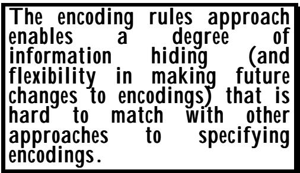
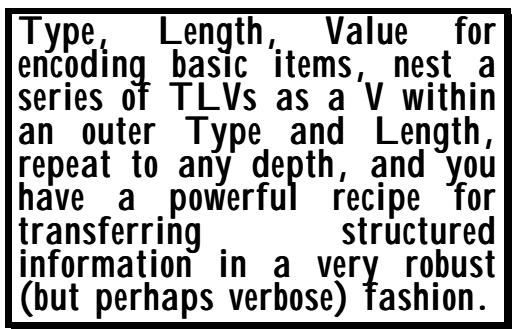

# Chapter 1 Introduction to encoding rules 
第一章 编码规则介绍

(Or: What no-one needs to know!) （或者：那些没人需要知道的事情！）

Summary: This first chapter of Section 3: 摘要：这是第 3 部分的第一个章节。

• Discusses the concept of encoding rules. • 讨论了编码规则的概念。

• Describes the TLV principle underlying the Basic Encoding Rules (BER). • 描述了基本编码规则（BER）所依据的 TLV 原则。

• Discusses the question of "extensibility", or "future proofing". • 讨论了“可扩展性”这个问题，也就是如何确保系统在未来能够持续运行的问题。

• Describes the principles underlying the more recent Packed Encoding Rules (PER). • 描述了最新的“打包编码规则”所依据的准则。

• Discusses the need for "canonical" encoding rules. • 讨论了采用“规范”编码规则的必要性。

• Briefly mentions the existence of other encoding rules. • 简要提及了其他编码规则的存在。

There has already been some discussion of encoding rules in earlier chapters which can provide a useful introduction to this concept, but this section has been designed to be complete and to be readable without reference to other sections. 在之前的一些章节中已经讨论过编码规则的相关内容，这些讨论可以为理解这一概念提供有益的入门信息。不过，本节的内容旨在做到完整且易于理解，无需参考其他章节的内容即可理解。

The next two chapters of Section III describe in detail the Basic Encoding Rules and the Packed Encoding Rules, but assume an understanding of the principles and concepts given here. 第三部分的接下来的两章详细描述了基本编码规则与打包编码规则。不过，读者需要已经了解这里所提到的相关原则和概念，才能理解这些描述。

## 1 What are encoding rules, and why the chapter sub-title? 1. 什么是编码规则？为什么这一章会有副标题呢？

"What no-one needs to know!". At the end-of-the-day, computer communication is all about "bits-on-the-line" - what has in the past been called "concrete transfer syntax", but today is just called "transfer syntax". (But if you think about it, a "bit" or "binary digit" is itself a pretty abstract concept - what is "concrete" is the electrical or optical signals used to represent the bits.) “没人需要知道的事情！”归根结底，计算机通信本质上就是关于“位级传输”的——过去这种传输方式被称为“具体传输语法”，如今则简称为“传输语法”。不过，仔细想想，“位”或“二进制位”本身就是一个相当抽象的概念——真正具有“具体性”的是用来表示这些位的电信号或光信号。


ASN.1 has taken on-board some concepts which originated with the so-called "Presentation Layer" of the ISO/ITU-T specifications for Open Systems Interconnection (OSI). (Note that the term "Presentation Layer" is a bad and misleading one - "Representation Layer" might be better). ASN.1 包含了一些源自 ISO/ITU-T 开放系统互连规范中的“表示层”的概念。（注意，“表示层”这个术语并不准确且具有误导性——使用“表示层”可能更为合适。）

The concepts are of a set of "abstract values" that are sent over a communications line, and which have associated with them bit patterns that represent these abstract values in an instance of communication. 这些概念指的是一组“抽象价值”，这些价值通过通信线路进行传输。同时，这些价值还伴随着特定的比特模式，这些比特模式用于在具体的通信场景中表示这些抽象价值。

The set of abstract values to be used, and their associated semantics, is at the heart of any application specification. The "encoding rules" are concerns of the (Re)Presentation Layer, and define the bit patterns used to represent the abstract values. The rules are a complete specification in their own right (actually, there are a number of variants of two main sets of rules - these are described later). The encoding rules say how to represent with a bit-pattern the abstract values in each basic ASN.1 type, and those in any possible constructed type that can be defined using the ASN.1 notation. 所有抽象值的集合以及与之相关的语义，是任何应用规范的核心内容。而“编码规则”则属于（重新）表示层的范畴，它们定义了用于表示抽象值的比特模式。这些规则本身就是一个完整的规范（实际上，主要有两套规则的不同变体——这些将在后面详细说明）。编码规则规定了如何将这些抽象值表示为每种基本 ASN.1 类型中的比特模式，以及使用 ASN.1 语法定义的所有可能构造类型中的比特模式。

ASN.1 provides its users with notation for defining the "abstract values" which carry user semantics and which are to be conveyed over a communications line. (This was fully described in Sections I and II). Just as a user does not care (and frequently does not know) what electrical or optical signal is used to represent zero and one bits, so in ASN.1, the user should not care (or bother to learn about) what bit patterns are used to represent his abstract values. ASN.1 为用户提供了一种表示“抽象值”的语法，这些抽象值具有用户语义，并且可以通过通信线路进行传输。（这一机制在第一节和第二节中有详细说明）。就像用户并不关心（实际上也通常不知道）用什么电信号或光信号来表示零和一比特一样，在 ASN.1 中，用户也不应该关心（或者不必去了解）用什么比特模式来表示他们的抽象值。

So details of the ASN.1 "encoding rules", which define the precise bit-patterns to be used to represent ASN.1 values, while frightfully important, are "What no-one needs to know". 因此，关于 ASN.1“编码规则”的详细信息其实非常重要，这些规则定义了用于表示 ASN.1 值的精确位模式。不过，这些细节其实属于“没人需要知道的事情”。

It is the case today that there are good ASN.1 tools (called "ASN.1 compilers") available that will map an ASN.1 type definition into a type definition in (for example), the C, C++, or Java programming languages (see Section I Chapter 6), and will provide run-time support to encode values of these data structures in accordance with the ASN.1 Encoding Rules. Similarly, an incoming bit-stream is decoded by these tools into values of the programming language datastructure. This means that application programmers using such tools need have no knowledge of, or even interest in, the encoded bit-patterns. All that they need to worry about is providing the right application semantics for values of the programming language data structures. The reader will find some further discussion of these issues in the Introduction to this book, and in Chapter 1 of Section 1. A detailed discussion of ASN.1 compilers is provided in Chapter 6 of Section 1. 目前，已经有很好的 ASN.1 工具可供使用（这些工具被称为“ASN.1 编译器”）。这些工具能够将 ASN.1 类型定义转换为 C、C++或 Java 等编程语言中的类型定义（详见第 6 章第一节）。同时，这些工具还能在运行时支持根据 ASN.1 编码规则对这些数据结构的数值进行编码。同样地，传入的位流也会通过这些工具被解码为编程语言中的数据结构对应的数值。这意味着使用这些工具的应用程序开发者无需了解或关心编码后的位模式，他们只需要为编程语言中的数据结构的值提供正确的应用语义即可。关于这些问题的更多讨论，可以在本书的引言部分以及第一节的第一章中找到。关于 ASN.1 编译器的详细讨论则位于第一节的第六章中。

There are, however, a few groups of people that will want to know all about the ASN.1 Encoding Rules. These are: 不过，还是有一些人想要了解关于 ASN.1 编码规则的所有细节。这些人群包括：

• The intellectually curious! • 那些充满求知欲的人！

• Students being examined on them! • 学生们正在接受考核！

• Standards writers who wish to be reassured about the quality of the ASN.1 Encoding Rules. • 那些希望确保 ASN.1 编码规则质量可靠的规范编写者们。

Implementors who, for whatever reason, are unable to use an ASN.1 compiler (perhaps they are working with an obscure programming language or hardware platform, or perhaps they have no funding to purchase tools), and have to "hand-code" values for transmission and "hand-decode" incoming bit-patterns. 那些由于某种原因无法使用 ASN 编译器实现的开发者们（也许他们使用的是一种不太流行的编程语言或硬件平台，或者他们没有足够的资金购买相关工具）。因此，他们不得不手动编写用于传输的值，并手动解码接收到的比特模式。

Testers and trouble-shooters that need to determine whether the actual bit-patterns being transmitted by some implementation are in accordance with the ASN.1 Encoding Rules specification. 那些需要确定某种实现方式所传输的实际位模式是否符合 ASN.1 编码规则规范的测试人员和问题排查人员。

If you fall into any of these categories, read on! Otherwise this section of the book is not for you! 如果你属于上述任何一种情况，请继续阅读吧！否则，这本书的这一部分就不适合你阅读了。

## 2 What are the advantages of the encoding rules approach? 2. 编码规则方法的优势是什么？

Section 1 Chapter 1 discussed a number of approaches to specifying protocols. The ASN.1 approach (borrowed from the Presentation Layer of OSI) of completely separating off and "hiding" the details of the bit-patterns used to represent values has a number of advantages which are discussed in the next few paragraphs. 第 1 章第 1 节讨论了多种指定协议的方法。ASN.1 方法（源自 OSI 的表示层）通过将用于表示值的位模式的细节完全分离并“隐藏”起来，这种方法具有许多优点，这些优点将在接下来的几段中详细讨论。

The first point to note is that a clear separation of the concept of transmitting abstract values from the bitpatterns representing those values enables a variety of different encodings to be used to suit the needs of particular environments. One often-quoted example (but I am not sure you will find it in the real-world!) is of a communication over a high-bandwidth leased line with hardware encryption devices at each end. The main concern here is to have representations of values that impose the least CPU-cycle cost at the two ends. But a 首先需要注意的是，将传输抽象价值的概念与表示这些价值的位模式分开考虑，这样可以实现多种不同的编码方式，从而满足不同环境的需求。一个常见的例子是：在一条高带宽的租用线路上进行通信时，两端都配备了硬件加密设备。此时的主要问题是，找到一种能够在两端都产生最小 CPU 运算成本的数值表示方式。不过，这个例子可能并不适用于现实世界的情况……



bull-dozer goes through the leased line! And the back-up provision is a modem on a telephone line with no security device. The concern is now with maximum compression, and some selective field encryption. The same abstract values have to be communicated, but what is the "best" representation of these values has now changed. 那台推土机正在穿越租赁线路！而备用方案则是通过没有安全装置的电话线路来传输数据。目前的问题在于如何实现数据的最大压缩效果，同时还需要对某些字段进行选择性加密处理。那些相同的抽象数值仍然需要被传输出去，但是这些数值的“最佳”表示方式已经发生了变化。

The second example is similar. There are some protocols where a large bulk of information has to be transferred from the disk of one computer system to the disk of another computer system. If those systems are different, then some work will be needed by one or both systems to map the local representations of the information into an agreed (standard) representation for transfer of the values over a communication line. But if, in some instance of communication, the two systems are the same type of system, CPU-cycles can probably be saved by using a representation that is close to that used for their common local representation of the information. 第二个例子类似。在某些协议中，需要把大量信息从一台计算机的磁盘传输到另一台计算机的磁盘上。如果这两台计算机的类型不同，那么其中一台或两台计算机都需要进行一些工作，以将信息的本地表示形式转换为一种标准格式，从而能够通过通信线路进行数据传输。不过，在某些通信场景中，如果这两台计算机属于同一类型，那么就可以使用与它们本地表示形式相近的表示方式，从而节省 CPU 周期。

Both the above examples are used to justify the OSI concept of negotiating in an instance of communication the representation (encoding) to be used, from a set of possible representations. However, today, ASN.1 is more commonly used in non-OSI applications, where the encoding is fixed in advance, and is not negotiable at communications-time (there is no OSI Presentation Layer present). 上述两个例子都用于说明 OSI 框架中关于通信过程中所使用的表示方式（编码方式）的协商机制。不过，如今 ASN.1 更常被用于非 OSI 框架的应用场景中，在这些场景中，编码方式是预先确定的，不会在通信过程中进行协商（因为不存在 OSI 的表示层）。

There are, however, a few other advantages of this clear separation of encodings from abstract values that are important in the real-world of today for the users of ASN.1. 不过，将编码与抽象值彻底分离这一做法在现实世界中也有一些重要的优势，这些优势对于使用 ASN1 的用户来说非常关键。

We have seen over the last twenty years considerable progress in human knowledge about how to produce "good" encodings for abstract values. This is reflected in the difference between the ASN.1 Basic Encoding Rules developed in the early 1980s and the Packed Encoding Rules developed in the early 1990s. But application specifications defined using ASN.1 in the 1980s require little or no change to the specification to take advantage of the new encoding rules - the application specification is unaffected, and will continue to be unaffected if even better encoding rules are devised in the next century. 在过去的二十年里，我们在了解如何为抽象值生成“良好”的编码方式这一方面取得了显著的进展。这一点可以从 1980 年代初制定的 ASN.1 基本编码规则与 1990 年代初推出的打包编码规则之间的差异中看出。不过，使用 ASN.1 在 1980 年代定义的应用规范，在采用新的编码规则时几乎不需要进行任何修改——应用规范本身不会受到影响，即使在未来一个世纪里再设计出更优秀的编码规则，应用规范依然会保持原样。

There is a similar but perhaps more far-reaching issue concerned with tools. The separation of encoding issues from the application specification of abstract values and semantics is fundamental to the ability to provide ASN.1 compilers, relieving application implementors from the task of writing (and more importantly, debugging) code to map between the values of their programming language data-structures and "bits-on-the-line". Moreover, where such tools are in use, changing to a new set of encoding rules, such as PER, requires nothing more than the installation of a new version of the ASN.1 compiler, and perhaps the changing of a flag in a run-time call to invoke the code for the new encoding rules rather than the old. 还有一个类似但可能更为重要的问题，与工具相关。将编码问题与抽象值及语义的应用规范分离，是提供 ASN.1 编译器的基础性要求。这一做法能够减轻应用程序开发者的负担，让他们无需再编写代码来实现编程语言数据结构与“线上比特”之间的映射，更无需进行调试工作。此外，在使用了这类工具的情况下，如果要更换为新的编码规则（如 PER），只需要安装新版本的 ASN.1 编译器即可，或许还需要在运行时调整某个标志，以启用新编码规则的代码，而不是旧的代码。

## 3 Defining encodings - the TLV approach 3. 定义编码方式——采用 TLV 方法

Chapter 1 of Section 1 discussed briefly the approach of using character strings to represent values, giving rise to a variety of mechanisms to precisely specify the strings to be used, and to "parsing" tools to recognise the patterns in incoming strings of characters. These approaches tend to produce quite verbose protocols, and generally do not give rise to as complete tool support as is possible with ASN.1. They are not discussed further, and we here concentrate on approaches which more directly specify the bit-patterns to be employed in communication. 第 1 部分的第 1 章简要讨论了使用字符字符串来表示值的方法。此外，还提出了多种机制来精确指定所使用的字符串，以及用于识别输入字符模式中模式的“解析”工具。这些方法往往会导致相当冗长的协议描述，而且通常无法像 ASN.1 那样提供如此完善的工具支持。因此，这里不再赘述这些方法，而是重点讨论那些能够更直接地指定通信中使用的位模式的方法。



As the complexity of application specifications developed over the years, one important and early technique to introduce some "order" to the task of defining representations was the so-called "TLV" approach. 随着多年来应用程序规范复杂性的不断增加，为了在一定程度上规范表示方式的定义过程，人们提出了一种早期的重要技术，即所谓的“TLV”方法。

With this approach, information to be sent in a message was regarded as a set of "parameter values". Each parameter value was encoded with a parameter identification (usually of fixed length, commonly a single octet, but perhaps overflowing to further octets), followed by some encoding that gave the length (octet count) of the parameter value (again as a single octet with occasionally the need for two or more octets of length encoding), and then an encoding for the value itself as a sequence of octets. 采用这种方式时，需要传输的信息被看作是一组“参数值”。每个参数值都会通过一个参数标识符来编码（通常这个标识符的长度是固定的，通常只是一个八位元，但有时可能需要使用更多的八位元来表示），接着是参数值的长度编码（同样以八位元表示，有时需要两个或更多的八位元来表示长度信息），最后才是参数值本身的编码，即一系列八位元的序列。

The parameter id was often said to identify the type of the parameter, so we have a Type field, a Length field, and a Value field, or a TLV encoding. 参数 id 通常被用来标识参数的类型。因此，我们设有 Type 字段、Length 字段以及 Value 字段，或者采用 TLV 编码方式来表示参数信息。

In these approaches, all fields were an integral number of octets, with all length counts counting octets, although some of the earliest approaches (not followed by ASN.1) had sixteen bit words as the fundamental unit, not octets. 在这些方法中，所有字段都被视为一个完整的八位元单元。所有的长度计数都是以八位元为单位进行的。不过，在一些早期的方法中（ASN.1 并不采用这些方法），十六位元的字元被作为基本单位，而不是八位元。

Once the way of encoding types and lengths is determined, the rest of the specification merely needs to determine what parameters are to appear on each message, what their exact id is, and how the values are to be encoded. 一旦确定了编码类型和长度的方法之后，剩下的工作就只是确定每条消息中应该包含哪些参数，这些参数的具体编号是什么，以及这些值应该如何进行编码。

This structure has a number of important advantages: 这种结构具有许多重要的优势：

• It makes it possible to give freedom to a sender to transmit the parameters in any order, perhaps making for simpler (sender) implementation. (Note that this is today seen as actually a bad thing to allow, not a good one!) • 这允许发送者以任意顺序传输参数，从而可能使实现更加简单。（不过，如今人们认为这种做法其实并不合适，不是一种好的做法。）

• It makes it possible to declare that some parameters are optional - to be included only when needed in a message. • 这使得可以声明某些参数为可选择的——只有在这些参数在消息中真正需要时才会被包含进来。

• It handles items of variable length. • 它可以处理长度不同的项目。

• It enables a basic "parsing" into a set of parameter values without needing any knowledge about the actual parameters themselves. • 它实现了基本的“解析”操作，将输入数据转换为一组参数值，而无需了解这些参数的具体含义。

And importantly - it enables a version 1 system to identify, to find the end of, and to ignore (if that is the desired behaviour), or perhaps to relay onwards, parameters that were added in a version 2 of the protocol. 重要的是，这种方式使得版本 1 的系统能够识别某些参数，找到这些参数的位置，并可以选择忽略它们（如果这是预期的行为）。或者，也可以将这些参数传递给后续版本。

The reader should recognise the relationship of these features to ASN.1 - the existence of "SET" (elements transmitted in any order), the "OPTIONAL" notation which can be applied to elements of a SET or SEQUENCE, and the variable length nature of many ASN.1 basic types. The version 1/version 2 issue is what is usually called "extensibility" in ASN.1. 读者应该能够识别出这些特性与 ASN.1 规范之间的关系。例如，“SET”概念指的是以任意顺序传输的元素；“OPTIONAL”标记可以用于描述集合或序列中的某些元素；而许多 ASN.1 基本类型的长度则是可变的。在 ASN.1 中，所谓“扩展性”指的是对版本 1 或版本 2 规范的处理能力。

The major extension beyond this "parameter" concept developed in the late 1970s with the idea of "parameter groups", used to keep close together related parameters. Here we encode a "group identifier", a group length encoding, then a series of TLV encodings for the parameters within the group. As before, the groups can appear in any order, and a complete group may be optional or mandatory, with parameters within that group in any order and either optional or mandatory for that group. Thus we have effectively two levels of TLV - the group level and the parameter level. 在 20 世纪 70 年代末，随着“参数组”概念的提出，这一体系得到了进一步的发展。所谓“参数组”，指的是将相关参数紧密地组合在一起的方式。在这里，我们首先为参数组编码一个“组标识符”，然后是对该组内各个参数的 TLV 编码。与之前一样，这些参数组可以以任意顺序出现；一个完整的参数组可能是可选的，也可能是必填的。而该组内的各个参数则可以是任意顺序的，且可以是可选的，也可以是必填的。因此，我们实际上有了两个层次的 TLV 结构——组级别和参数级别。

It is a natural extension to allow arbitrarily many levels of TLV, with the V part of all except the innermost TLVs being a series of embedded TLVs. This clearly maps well to the ASN.1 concept of being able to define a new type as a SEQUENCE or SET of basic types, then to use that new type as if it were a basic type in further SEQUENCEs or SETs, and so on to any depth. 这是一种自然的扩展，可以允许任意多的 TLV 层级。除了最内层的 TLV 之外，所有其他 TLV 的 V 部分都实际上是由一些嵌入式的 TLV 构成的序列。这显然符合 ASN.1 的概念：即可以将一种新类型定义为基本类型的序列或集合，然后像使用基本类型一样在后续的序列或集合中继续使用这种新类型，如此循环下去，直到无限深度。

Thus this nested TLV approach emerged as the natural one to take for the ASN.1 Basic Encoding Rules, and reigned supreme for over a decade. 因此，这种嵌套的 TLV 表示方法成为了处理 ASN.1 基本编码规则的自然选择，并且持续了十多年时间，成为最流行的做法。

To completely understand the Basic Encoding Rules we need: 要完全理解基本编码规则，我们需要：

• To understand the encoding of the "T" part, and how the identifier in the "T" part is allocated. • 需要了解“T”部分的编码方式，以及“T”部分中的标识符是如何被分配的。

• To understand the encoding of the "L" part, for both short "V" parts and for long "V" parts. • 为了理解“L”部分的编码方式，需要了解短“V”部分和长“V”部分的编码差异。

• For each basic type such as INTEGER, BOOLEAN, BIT STRING, how the "V" is encoded to represent the abstract values of that type. • 对于每种基本类型，例如 INTEGER、BOOLEAN、BIT STRING 等，都会说明如何编码“V”来表示该类型的抽象值。

• For each construction mechanism such as SEQUENCE or SET, how the encodings of types defined with that mechanism map to nested TLV structures. • 对于诸如 SEQUENCE 或 SET 之类的构建机制，由该机制定义的类型编码如何映射到嵌套的 TLV 结构中。

This is the agenda for the next chapter. 这是下一章的议程。

## 4 Extensibility or "future proofing" 4. 可扩展性或“面向未来的设计”

The TLV approach is very powerful at enabling the specification of a version 1 system to require specified action on TLV elements where the "T" part is not recognised. This allows new elements (with a distinct "T" part) to be added in version 2 of a specification, with a known pattern of behaviour from version 1 systems that receive such material. TLV 方法在定义版本 1 的系统时非常有效，它要求对 TLV 元素进行特定的处理，而此时“T”部分并不被识别。这样，在规范的版本 2 中就可以添加新的元素（这些元素具有独特的“T”部分），而来自版本 1 的系统的已知行为模式也可以被保留下来。

This interworking between version 1 and version 2 systems without the need for version 2 implementations to implement both the version 1 and the version 2 protocol is a powerful and important feature of ASN.1. 在版本 1 和版本 2 的系统之间实现互操作功能，而无需版本 2 的实现来同时支持版本 1 和版本 2 的协议，这是 ASN.1 的一个强大且重要的特性。

It is a natural outcome of the TLV approach to encoding in the Basic Encoding Rules, but if one seeks encodings where there is a minimal transfer of information down the line, it is important to investigate how to get some degree of "future-proofing" to allow interworking of version 1 and version 2 systems without the verbosity of the TLV approach. 这是 TLV 编码方法在基本编码规则中的自然结果。不过，如果希望实现一种能够最大程度减少信息传输量的编码方式，那么研究如何做到一定程度的“未来兼容”就变得非常重要了。这样就能实现版本 1 和版本 2 的系统之间的相互协作，而无需使用 TLV 方法的那种复杂编码方式。

Early discussions in this area seemed to indicate that future-proofing was only possible if a TLV style of encoding was used, but later work showed that provided the places in the protocol where version 2 additions might be needed were identified by a new notational construct (the ASN.1 "extensibility" ellipsis - three dots), then future-proofing becomes possible with very little overhead even in an encoding structure that is not in any way a TLV type of structure. 在这一领域的初步讨论表明，只有使用与 TLV 格式类似的编码方式，才能实现面向未来的设计。但后续的研究表明，只要通过一种新的表示方式来标识协议中可能需要添加功能的地方（即 ASN.1 中的“扩展性”省略号——三个点），那么即使在不采用 TLV 格式的结构中，也能以很少的额外开销实现面向未来的设计。

It was this recognition that enabled the so-called Packed Encoding Rules (PER) to be developed. 正是这种认识促成了所谓“打包编码规则”（PER）的提出。

## 5 First attempts at PER - start with BER and remove redundant octets 5. 首次尝试计算 PER 值——从 BER 值开始，然后去除多余的八位组。

This was a blind-alley! 这真是个疯狂的地方啊！

NOTE — Those with no knowledge of BER may wish to at lest skim the next chapter before returning to the following text, as some examples show BER encodings. 注意：对于那些不了解 BER 的人来说，建议在返回后续内容之前至少先阅读下一章的内容，因为其中有一些示例展示了 BER 编码的方式。

The first approach to producing more compact (packed) encodings for ASN.1 was based on a BER TLV-style encoding, but with recognition that in a BER encoding there were frequently octets sent down the line where this was the only possible octet value allowed in this position (at least in this version of the specification). This 第一种用于生成更紧凑的 ASN.1 编码的方法是基于 BER TLV 风格的编码。不过，这种编码方式存在一个问题：在 BER 编码中，经常会发送一些八位字节，而在这个位置，这些八位字节是唯一允许的值（至少在这个版本的规范中是如此）。


applied particularly to the "T" values, but also frequently to the length field if the value part of the item (such as a BOOLEAN value) was fixed length. 这一用法主要适用于“T”值，但如果项目中的数值部分（例如布尔值）是固定长度的，那么也常常用于长度字段。

By allowing the Packed Encoding Rules to take account of constraints (on, for example, the length of strings or the sizes of INTEGERs), we can find many more cases where explicit transmission of length fields is not needed, because both ends know the value of the "L" field. 通过让打包编码规则考虑各种约束条件（例如字符串的长度或 INTEGER 类型的数据大小），我们可以找到更多的情况，在这种情况下不需要显式传输长度字段的值，因为双方都知道“L”字段的值。

A final "improvement" is to consider the "L" field for a SEQUENCE type. Here each element of the SEQUENCE is encoded as a TLV, and there is an outer level "TL" "wrapper" for the SEQUENCE as a whole. If we modify BER so that the "L" part of this wrapper is a count not of octets, but of the number of TLVs in the value part of the SEQUENCE, this count is again fixed (unless the SEQUENCE has OPTIONAL elements), and therefore often need not be transmitted, even if there are inner elements whose length might vary. 最后一个“改进”是考虑使用“L”字段来表示序列类型。在这里，序列中的每个元素都被编码为一个 TLV，而整个序列则有一个外部的“TL”级包装器。如果我们修改 BER 编码方式，使得这个包装器的“L”字段不是以八位元为单位来计数，而是以序列中 TLV 的数量来计算，那么这个计数就可以被固定下来（除非序列包含可选元素）。因此，通常不需要传输这个计数，即使某些内部元素的长度可能会有所不同。

Consider the ASN.1 type shown in figure III-1. The BER encoding (modified to count TLVs rather than octets for non-inner length fields) is shown in figure III-2. 请参考图 III-1 中所示的 ASN.1 类型。BER 编码的编码方式（修改为仅对 TLV 进行计数，而不是对八位元字段进行计数）如图 III-2 所示。

```txt
Example ::= SEQUENCE
{first INTEGER (0..127),
second SEQUENCE
{string OCTET STRING (SIZE(2)),
name PrintableString (SIZE(1..8)) },
third BIT STRING (SIZE (8)) }

Figure III-1: An example for encoding 
```

You will see from Figure III-2 that there are a total of 23 octets sent down the line, but a receiver can predict in advance the value of all but 11 of them - those marked as {????} (and knows precisely where these 11 occur). Thus we need not transmit the remaining 12 octets, giving a 50% reduction in communications traffic. Attractive! 从图 III-2 中可以看出，总共有 23 个八位组被发送出去。不过，接收器可以提前预测出其中除了 11 个之外的所有八位组的值——那些被标记为{????}的八位组——并且能够准确知道这 11 个八位组出现在哪几个位置。因此，我们无需发送剩下的 12 个八位组，这样一来，通信流量就减少了 50%。真是个不错的改进啊！

The approach, then, was to take a BER encoding as the starting point, determine rules for what 因此，我们的方法是以 BER 编码作为起点，然后确定相关的规则。

```txt
{U 16} -- Universal class 16 ("T" value for SEQUENCE)
{3} -- 3 items ("L" value for SEQUENCE)
{U 2} -- Universal class 2 ("T" value for "first")
{1} -- 1 octet ("L" value for "first")
{?????} -- Value of "first"
{U 16} -- Universal class 16 ("T" value for "second")
{2} -- 2 items ("L" value for "second")
{U 3} -- Universal class 3 ("T" value for "string")
{2} -- 2 octets ("L" value for "string")
{?????}{?????} -- Value of "string"
{U 24} -- Universal class 24 ("T" value for "name")
{?????} -- 1 to 8 ("L" value for "name" - 5 say)
{?????}{?????}{?????}{?????}{?????} -- Value of "name"
{U 4} -- Universal class 4 "T" value for "third"
{3} -- 3 octets ("L" value for "third")
{0} -- 0 unused bits in last octet of "third" "V"
{?????}{?????} -- Value of "third"

Figure III-2: Modified BER encoding of figure III-1 
```

octets need not be transmitted, and to delete those octets from the BER encoding before transmission, re-inserting them (from knowledge of the type definition) on reception before performing a standard BER decode. 这些八位组不必被传输出去；在传输之前，可以从 BER 编码中删除这些八位组。而在接收后执行标准的 BER 解码之前，可以根据类型定义的知识将这些八位组重新插入到编码中。

Work was done on this approach over a period of some three years, but it fell apart. A document was produced, getting gradually more and more complex as additional (pretty ad hoc) rules were added on what could and could not be deleted from a BER encoding, and went for international ballot. An editing meeting was convened just outside New York (around 1990), and the comments from National Bodies were only faxed to participants at the start of the meeting. 这种方法的实施过程持续了大约三年时间，但最终失败了。最终形成了一份文件，其中包含了越来越复杂的规则，这些规则是根据各种具体情况来确定的，关于哪些内容可以被删除，哪些内容则必须保留。这份文件随后进行了国际层面的审议。大约在 1990 年，在纽约附近召开了一次编辑会议，各国机构的意见只是以传真方式发送给与会者。

Imagine the consternation when the dozen or so participants realised that EVERY National Body had voted "NO", and, moreover, with NO constructive comments! The approach was seen as too complex, too ad hoc, and (because it still left everything requiring an integral number of octets) insufficient to produce efficient encodings of things like "SEQUENCE OF BOOLEAN". It was quite clearly dead in the water. 当那十几名参与者意识到每一个国家机构都投了“反对”票时，他们会感到多么的困惑啊！而且，这些反对意见还毫无建设性可言！这种处理方式被认为过于复杂、过于臃肿，而且（因为它仍然需要大量的八位二进制数来表示各种信息），因此无法有效地处理像“布尔序列”这样的数据。显然，这种方案已经彻底失败了。

Many people had pre-booked flights which could not be changed without considerable expense, but it was clear that what had been planned as a week-long meeting was over. The meeting broke early at about 11am for lunch (and eventually reconvened late at about 4pm). Over the lunch-break much beer was consumed, and the proverbial back-of-a-cigarette-packet recorded the discussions (actually, I think it was a paper napkin – long since lost!). PER as we know it today was born! The rest of the week put some flesh on the bones, and the next two years produced the final text for what was eventually accepted as the PER specification. Implementations of tools supporting it came a year or so later. 许多人已经预订了航班，这些预订如果不花费大量费用是无法更改的。显然，原本计划为期一周的会议已经结束了。会议在上午 11 点左右提前结束，大家去吃了午饭（最终在下午 4 点左右再次聚在一起）。在午休期间，大家喝了很多啤酒。所谓的“会议记录”其实是一张香烟包装纸上的笔记——不过那张纸已经丢失了！就这样，PER 规范诞生了！在接下来的几周里，相关的工作得到了进一步的发展，而在接下来的两年里，最终形成了被大家认可的 PER 规范的最终版本。支持该规范的工具也在一年后开始被实际应用起来。

## 6 Some of the principles of PER 6. PER 的一些原则

## 6.1 Breaking out of the BER straight-jacket 6.1 摆脱这种思维定势的束缚

Probably the most important decisions in that initial lunch-time design of PER were: 在 PER 的初始设计阶段， probably 最重要的几个决定包括：

To start with a clean piece of paper (or rather napkin!) and ignore BER and any concept of TLV. This was quite radical at the time, and the beer probably helped people to think the unthinkable! 首先，先在一张干净的纸上开始吧（或者更确切地说，是一张餐巾纸！），然后忽略“BER”这个概念，也别考虑“TLV”这个术语了。当时这个想法相当激进，而啤酒或许帮助人们实现了那些原本无法想象的想法！

## Initial "principles" 最初的“原则”

• Forget about TLV. • 别再考虑 TLV 了。

• Forget about octets - use bits. • 忘掉字节的概念吧——使用比特 instead。

• Recognise constraints (subtypes). • 识别各种约束条件（类型）。

• Produce "intelligent" encodings. • 生成“智能”的编码方式。

• Forget "extensibility" (initially). • 忘掉“可扩展性”这个概念吧（最初是这样说的）。

• Not to be constrained to using an integral number of octets - another quite radical idea. • 不必局限于使用固定数量的数据位；这其实是一个相当激进的想法。

To take as full account of constraints (subtyping) in the type definition as could sensibly be done. (BER ignored constraints, perhaps largely because it was produced before the constraint/subtype notation was introduced into ASN.1, and was not modified when that notation came in around 1986). 在类型定义中，应尽可能全面地考虑各种限制条件（子类型定义）。不过，BER 并没有考虑这些限制条件，可能是因为它在 1986 年左右引入 ASN 规范之前就已经被开发出来了，而且当这种表示法被引入后也没有进行任何修改。

• To produce the sort of encoding that a (by now slightly drunk!) intelligent human being would produce - this was quite a challenge! • 要创造出那种（现在已经有点醉了！）聪明的人类才会使用的编码方式——这真是个相当大的挑战啊！

• Not to consider "extensibility" issues. This was a pragmatic decision that made the whole thing possible over a (long) lunch-time discussion, but of course provision for "futureproofing" had to be (and was) added later. • 没有考虑“可扩展性”问题。这是一个务实的决定，通过一次漫长的午餐时间讨论就决定了整个系统的实现方式。不过，当然之后还是增加了一些“面向未来”的考虑因素。

So how would you the reader encode things? Whatever you think is the obvious way is probably what PER does! In all the following cases, the "obvious" solution is what PER does. 那么，作为读者的你，会如何对信息进行编码呢？你认为最显而易见的方法，很可能就是 PER 所采用的方法吧！在所有这些情况下，所谓的“显而易见”的解决方案，其实就是 PER 所采取的方案。

What about the encoding of BOOLEAN? Clearly a single bit set to zero or one is the "obvious" solution. 那么，BOOLEAN 的编码方式是什么呢？显然，将一个比特位设置为 0 或 1 就是“显而易见”的解决方案。

What about 那怎么样呢？

INTEGER (0..7) 整数类型 (0..7)

and 以及

INTEGER (8..11) 整数类型（范围：8 到 11）

Clearly a three-bit encoding is appropriate for the former and a two-bit encoding for the latter. 显然，对于前者来说，使用三位编码是合适的；而对于后者，则应该使用两位编码。

© OS, 31 May 1999 © OS，1999 年 5 月 31 日

An INTEGER value restricted to a 16-bit range could go into two octets with no length field. 一个限制在 16 位范围内的整数值，可以通过两个八位元来表示，而无需使用长度字段。

But what about an unconstrained INTEGER? (Meaning, in theory, integer values up to infinity, and with BER capable of encoding integer values that take millions of years to transmit (even over super- fast lines)? Clearly an "L" will be needed here to encode the length of the integer value (and here you probably want to go for a length count in octets). 但是，有没有一种不受限制的整数表示方式呢？理论上来说，可以表示无限大的整数值，而且 BER 能够编码那些需要数百万年才能传输完毕的整数值（即使是在超高速的传输线路上）。显然，这里需要使用一个“L”来表示整数的长度（你可能希望用八位二进制数来表示这个长度）。

If you have read about the details of BER encodings of "L", you will know that for length counts up to 127 octets, "L" is encoded in a single octet, but that BER requires three octets for "L" once the count is more than 255. In PER, the count is a count of bits, items, or octets, but only goes beyond two octets for counts of 64K or more - a fifty per cent reduction on the size of "L" in many cases compared with BER. 如果你了解过“L”的 BER 编码细节，就会知道：当长度不超过 127 个八位元时，单个八位元就可以表示“L”的值；而当长度超过 255 个八位元时，就需要三个八位元来表示“L”。在 PER 编码中，计数单位是位、项或八位元，但只有当计数达到 64K 或更高时才会超过两个八位元——与 BER 编码相比，PER 编码所占用的大小通常只会增加 50%。

For virtually all values of an unconstrained INTEGER, we will get a one octet "L" field, followed by the minimum number of octets needed to hold the actual value being sent. This is the same as BER. 对于几乎所有不受限制的整数值，我们都会得到一个八位元的“L”字段，随后是表示所发送数值所需的最小八位元数量。这与 BER 的情况相同。

## 6.2 How to cope with other problems that a "T" solves? 6.2 如何应对“T”型人格所引发的其他问题呢？

So far, no mention has been made of a "T" field for PER. Do we ever need one? There are three main areas in BER where the "T" field is rather important. These are: 到目前为止，关于 PER 的“T”字段还没有被提及。我们真的需要这个字段吗？在 BER 的三个主要区域中，“T”字段确实非常重要。这些区域包括：

```txt
- Use a "choice-index".
- SET in a fixed order.
- Bit-map for OPTIONAL elements. 
```

• To identify which actual alternative has been encoded as the value of a CHOICE type (remember that all alternatives of a CHOICE are required to have distinct tags, and hence have distinct "T" values). • 目的是确定哪个实际选项被编码为“CHOICE”类型的值（记住，所有“CHOICE”选项的标签都必须各不相同，因此它们的“T”值也必然不同）。

• To identify the presence or absence of OPTIONAL elements in a SEQUENCE (or SET). • 用于识别在序列（或集合）中是否存在可选元素。

• To identify which element of a SET has been encoded where (remember that elements of a SET can be encoded and sent in any order chosen by the sender). • 目的是确定某个集合中的元素已被编码到了哪个位置（记住，集合中的元素可以以发送者选择的任何顺序进行编码和传输）。

How to do these things without a "T" encoding for each element? 如何在不为每个元素都进行“T”编码的情况下完成这些操作呢？

To cope with alternatives in a CHOICE, PER encodes a "choice-index" in the minimum bits necessary: up to two alternatives, one bit; three or four alternatives, two bits; five to seven alternatives, three bits; etc. 为了在处理多个选项时保持简洁，PER 编码方式会以一种最少的位数来表示“选项索引”：最多两个选项时使用 1 位；三个或四个选项时使用 2 位；五到七个选项时使用 3 位；以此类推。

At this point we can observe one important discipline in the design of PER. The fieldwidth (in bits) for any particular part of the encoding (in this case the field-width of the choice-index) does not (must not) depend on the abstract value being 在这一点上，我们可以观察到 PER 设计中一个重要的规则。对于任何特定的编码部分，其字段宽度（以位为单位）不得依赖于该抽象值的实际数值。

The important field-length principle or rule: Encode into fields of an arbitrary number of bits, but the length of fields must be statically determinable from the type definition, for all values. 重要的字段长度原则或规则是：数据应被编码到任意位数的字段中，但所有值的字段长度必须能够从类型定义中静态确定。

transmitted, but can be statically determined by examining the type definition. Hence it is known unambiguously by both ends of the communication - assuming they are using the same type definition. But there is the rub! If one is using a version 1 type definition and the other a version 2 type definition .... but we agreed not to consider this just yet! 虽然可以传输，但可以通过检查类型定义来静态地确定其状态。因此，只要双方使用相同的类型定义，那么通信的双方就能明确无误地理解对方的含义。不过，这里有一个问题！如果一方使用的是版本 1 的类型定义，而另一方则使用版本 2 的类型定义……不过我们暂时先不讨论这个问题吧！

What about OPTIONAL elements in a SET or SEQUENCE? Again, the idea is pretty obvious. We use one bit to identify whether an OPTIONAL element is present or absent in the value of the 那么，在集合或序列中出现的可选元素该怎么办呢？这个思路其实相当简单。我们使用一个比特位来表示某个可选元素是否存在于该值中。

SET or SEQUENCE. In fact, these bits are all collected together and encoded at the start of the SET or SEQUENCE encoding rather than in the position of the optional element, for reasons to do with "alignment" discussed below. SET 或 SEQUENCE。实际上，这些位都是集中在一起在 SET 或 SEQUENCE 的编码开始时就被编码的，而不是在可选元素的位置上进行编码。这一做法与下面提到的“对齐”问题有关。

And so to the third item that might require a "T". What about the encoding of SET - surely we need the "T" encodings here? Start of big debate about the importance of SET (where elements are transmitted in an order determined by the sender) over SEQUENCE (where the order of encodings is the order of elements in the type definition), and of the problems that SET causes. In addition to the verbosity of introducing some form of "T" encoding, we can also observe that: 那么，第三个需要“T”编码的项目是什么呢？关于 SET 的编码方式——显然在这里我们需要使用“T”编码。关于 SET 与 SEQUENCE 的重要性之争开始了：在 SET 中，元素的顺序是由发送方决定的；而在 SEQUENCE 中，编码的顺序则遵循类型定义中的元素顺序。此外，SET 还会带来一些问题。除了引入某种“T”编码方式所带来的复杂性之外，我们还可以注意到：

Allowing sender's options produces a combinatoric explosion in any form of exhaustive test sequence (and hence in the cost of conformance checking) to check that (receiving) implementations behave correctly in all cases. 允许使用发送方的选项会在任何形式的穷举测试序列中引发巨大的组合可能性（因此也会增加一致性检查的成本），以确保在所有情况下，（接收方的）实现都能正确运行。

The existence of multiple ways of sending the same information produces what in the security world is called a "side-channel" - a means of transmitting additional information from a trojan horse by systematically varying the senders options. For example, if there are eight elements in a SET, then 256 bits of additional information can be transmitted with each value of that SET by systematically varying the order of elements. 存在多种可以传递相同信息的方式，这在安全领域被称为“侧信道”攻击——即通过系统地改变传输过程中的选项，从木马程序中获取额外的信息。例如，如果有一个集合中有八个元素，那么通过系统地改变元素的排列顺序，每个元素都可以携带 256 位的额外信息。

This discussion led to the development of a further principle for PER: there shall be NO sender's options in the encoding unless there was an excellent reason 这次讨论促成了 PER 的又一原则的形成：除非有充分的理由，否则在编码过程中不应存在发送者可选择的选项。

The sender's options principle/rule: Don't have any! 发送者的选择原则/规则：不要有任何选择！

for introducing them. PER effectively has no sender's options. A canonical order is needed for transmitting elements of a SET, and after much discussion, this was taken to be the tag order of the elements (see the next chapter for more detail), rather than the textually printed order. (In allocating choice-index values to alternatives of a choice, the same tag-order, rather than textual order is also used, for consistency). 用于引入这些元素。实际上，PER 并没有“发送者选项”这一功能。在传输 SET 中的元素时，需要一种规范的排序方式。经过多次讨论后，人们决定采用元素的标签顺序作为排序依据（更多细节请参见下一章），而不是文本中打印出的顺序。（在为选择项分配选择索引值时，同样也采用标签顺序而非文本顺序，以保持一致性。）

It should, however, be noted that the term "PER" strictly refers to a family of four closely related encoding rules. The most important is "BASIC-PER" (with an ALIGNED and an UNALIGNED variant discussed later). Although BASIC-PER has no senders options, it is not regarded as truly a canonical encoding rule because values of the elements of a SET OF are not required to be sorted into a fixed order, and no restrictions are placed on the way escape sequences are used in encodings of GeneralString. (If neither of these two types are used in an application specification, then BASIC-PER is almost canonical (there are some other unimportant complex cases that never arise in practice where it is not fully canonical. There is a separate CANONICAL-PER (also with an ALIGNED and an UNALIGNED version) that is truly canonical even when these types are present. 不过，需要指出的是，"PER"这个术语实际上指的是一组密切相关的编码规则。其中最重要的是"BASIC-PER"（后面还会介绍它的变体——ALIGNED 和 UALIGNED）。虽然 BASIC-PER 没有关于发送者的选项，但它并不被视为真正的规范编码规则，因为 SET\_OF 元素的取值不需要按照固定顺序进行排序，而且在对 GeneralString 进行编码时，对转义序列的使用也没有任何限制。（如果应用程序规范中既不使用这两种类型，那么 BASIC-PER 几乎可以算作规范编码了。不过，在实际使用中，偶尔会出现一些不太重要的复杂情况，这些情况并不会导致 BASIC-PER 完全不符合规范。另外还有一种名为 CANONICAL-PER 的编码规则，它同样包含 ALIGNED 和 UALIGNED 两种变体，即使存在这两种类型，CANONICAL-PER 仍然可以算作真正的规范编码。）

## 6.3 Do we still need T and L for SEQUENCE and SET headers? 6.3 对于 SEQUENCE 和 SET 的头部，我们还需要 T 和 L 这些字段吗？

Clearly we do not! We need no header encodings for these types, provided we can identify the presence or absence of optional elements (which is done by the bit-map described earlier). 显然，我们并不需要这种编码方式！对于这些类型的数据，我们不需要任何头部编码，只要我们能够识别出可选元素的存在或缺失即可（这可以通过之前提到的位图方法来实现）。

"Wrappers" are no longer needed. Well ... that is sort of true - but see the discussion of extensibility below, that re-introduces wrappers for elements added in version 2! “包装层”已不再必要了。嗯……某种程度上来说确实是这样——不过请参考下面关于可扩展性的讨论吧，因为在版本 2 中新增的元素需要重新使用包装层！

## 6.4 Aligned and Unaligned PER 6.4 对齐后的与非对齐后的 PER 值

But here we look at another feature of PER. Basically, PER produces encodings into fields that are a certain number of bits long and which are simply concatenated end-to-end for transmission. But there was recognition from the start that for some ASN.1 types (for example, a sequence of two-byte integers), it is silly to start every component value at, say, bit 6. Insertion of two padding bits at the start of the sequence-of value 不过，这里我们关注 PER 的另一个特性。实际上，PER 会将数据编码成若干位长的字段，这些字段会依次连接在一起进行传输。但从一开始我们就意识到，对于某些 ASN 类型的数据（例如，由两个字节整数组成的数据序列），如果每个组件值都从第 6 位开始，那显然是不合理的做法。因此，在数值序列的开头添加两个填充位才是合适的做法。


would probably be a good compromise between CPU costs and line costs. 这或许可以算是 CPU 成本与线路成本之间的一个不错的折中方案吧。

This led to the concept of encoding items into bit-fields (which were simply added to the end of the bits in earlier parts of the encoding) or into octet-aligned-bit-fields where padding bits were introduced to ensure that the octet-aligned-bit-fields started on an octet boundary. 这就引出了将各项数据编码到位字段中的概念（这些位字段简单地被添加到编码过程中的各个位之后）。或者，也可以将它们编码到以八位为单位的位字段中，同时引入填充位来确保这些位字段能够从八位边界处开始。

The intelligent reader (aren't you all?) will note that whilst the length of fields is (has to be) statically determined from the type, the number of padding bits to be inserted before an octetaligned-bit-field is not fixed. The number of bits in the earlier part of the encoding can depend on whether optional elements of SET and SEQUENCE are present or not, and on the actual alternative chosen in a CHOICE. But of course, the encoding always contains information about this, and hence a receiving implementation can always determine the number of padding bits that are present and that have to be ignored. Notice that whether a field is a bit-field or an octetaligned-bit-field again has to be (and is) statically determined from the type definition - it must not depend on the actul value being transmitted, or PER would be bust! 聪明的读者应该会注意到，虽然字段的长度是由类型定义静态确定的，但在一个八位元字段之前需要插入的填充位数却不是固定的。编码中前面部分的位数取决于是否包含了 SET 和 SEQUENCE 中的可选元素，以及 CHOICE 中实际选择的选项。不过，当然，编码中总是包含有关这些信息的说明，因此接收方可以实现程序来确定存在的填充位数以及哪些位需要被忽略。另外，一个字段是单字节字段还是八位元字段，同样是由类型定义静态确定的——它不得依赖于传输中的实际值，否则 PER 机制就会失效！

The concept of "octet-aligned-bit-fields" and "padding bits" was in the original design, but later people in air traffic control wanted the padding bits removed, and we now have two variants of PER. Both formally encode into a sequence of "bit-fields" and "octet-aligned-bit-fields", depending on the type definition, but for "unaligned PER", there is no difference in the two - padding bits are never inserted at the start of "octet-aligned-bit-fields". With aligned PER, they are. 在最初的设计中，确实采用了“按八位组对齐的位字段”和“填充位”这一概念。不过后来，空中交通管制部门希望去掉这些填充位。因此，我们现在有了两种形式的 PER 编码方式。这两种方式都通过一系列“位字段”和“按八位组对齐的位字段”来编码数据，具体取决于所定义的数据类型。不过，对于“非对齐 PER”来说，这两种方式并没有区别——在“按八位组对齐的位字段”中，根本不会插入填充位。而对于“对齐 PER”来说，则会在这些位字段中插入填充位。

There are actually a couple of other differences between aligned and unaligned PER, but these are left to the later chapter on PER for details. 实际上，对齐的 PER 与非对齐的 PER 之间还有几处差异，但这些细节可以在后面关于 PER 的章节中了解到。

As a final comment - if you want to try to keep octet alignment for as long as possible after insertion of padding bits, then using a single bit to denote the presence or absence of an OPTIONAL element in a SEQUENCE or SET is probably not a good idea - better to collect all such bits together as a "bit-map" at the start of the encoding of the SEQUENCE or SET. This was part of the original back-of-cigarette-packet design and was briefly referred to earlier. That feature is present in PER. 最后一点说明——如果你希望在整个编码过程中尽可能保持八位组的对齐，那么使用单个位来表示序列或集合中是否存在某个可选元素可能并不是一个好主意。更好的做法是在编码开始时，将所有这样的位合并成一个“位图”形式。这一设计最初出现在“香烟包装背面”方案中，之前也简要提到过。现在这一功能已经在“PER”中实现了。

## 7 Extensibility - you have to have it! 7 可扩展性——你必须拥有它！

## Third attempt! 第三次尝试！

One bit says it all - it is a version 1 value, or it contains wrapped-up version 2 material. 只要有一点信息就足够了——要么是版本 1 的内容，要么包含了版本 2 的整合信息。


When the second approach to better encodings (described above) was balloted internationally, it almost failed again. 当上述第二种改进编码的方法在国际上被提出时，它同样几乎再次失败了。

It is clear from the above discussion that unless both ends have exactly the same type definition for their implementation, all hell will break loose - pardon the term. They will have different views on the fields and the field lengths that are present, and will produce almost random abstract values from the encodings. 从上述讨论中可以清楚地看出，除非两个端点的实现方式完全相同，否则将会出现严重的问题。它们对存在的字段以及字段长度会有不同的理解，从而导致从编码中产生的数值几乎都是随机的。

But do we really want to throw in the towel and admit that a very verbose TLV style of encoding is all that is possible if we are to be "future-proof"? NO! 但是，我们真的想放弃努力，承认如果我们要确保代码的“未来可扩展性”，那么唯一可行的编码方式就是那种非常冗长的 TLV 格式吗？不！我们绝对不想这样做。

How to allow version 2 to add things? How about notation to indicate the end of the "root" (version 1) specification, and the start of added version 2 (or 3 etc) material? Will this help? 如何允许版本 2 添加一些内容呢？有没有什么方式可以表示“根”版本（版本 1）的结束，以及新增的版本 2（或 3 等）内容的开始呢？这样做会有帮助吗？

The most common case for requiring "extensibility" is the ability to add elements to the end of SETs and SEQUENCEs in version 2. 需要“可扩展性”的最常见情况是在版本 2 中，能够向 SET 和-sequence 的末尾添加元素。

Later, people argued - successfully - for the need to add elements in the middle of SETs and SEQUENCEs, and we got the "insertion point" concept described in an earlier Section. 后来，人们成功地提出了在 SET 和 SEQUENCE 的中间添加元素的必要性，于是我们就有了前面章节中提到的“插入点”概念。

But let's stick to adding at the end for now. Suppose we have added elements (most of which are probably going to be OPTIONAL) at the end of a SEQUENCE, or added alternatives in a CHOICE, or added enumerations in an ENUMERATED, or relaxed constraints on an INTEGER (that list will do for now!). 不过，目前我们先暂且保持原样吧。假设我们在序列的末尾添加了元素（其中大部分可能是可选的），或者在选择项中增加了备选方案，在枚举项中添加了枚举值，又或者在整数约束上放宽了一些限制（目前列出这些元素就可以了！）。

How to handle that? We first require that a type be marked "extensible" if we want "futureproofing" (this is the ellipsis that can appear in many ASN.1 types). This warns the version 1 implementation that it may be hit with abstract values going beyond the version 1 type, but more importantly, it introduces one "extended" bit at the head of the version 1 encodings of all values of that type. 该如何处理这个问题呢？首先，如果我们希望实现“面向未来”的功能，那么该类型必须被标记为“可扩展”类型（这种省略号常见于许多 ASN.1 类型中）。这样就能提醒版本 1 的实现，该类型可能会包含超出版本 1 类型的抽象值。更重要的是，这种方式会在该类型所有值的版本 1 编码中添加一个“扩展”位。

The concept is that any of these "extensible" types has a "root" set of abstract values - version 1 abstract values. If the abstract value being sent (by a version 1, version 2, or version 3, etc implementation) is within the root, the "extended" bit is set to zero, and the encoding is purely the encoding of the version 1 type. But if it is set to 1, then abstract values introduced in version 2 or later are present, and version 1 systems have a number of options, but importantly, extra length (and sometimes identification) fields are included to "wrap-up" parts or all of these new abstract values to enable good interworking with version 1 systems. The "exception marker" enables specifiers to say how early version systems are to deal with material that was added in later versions, and (in the views of this author) should always be included if the extensibility marker is introduced. 这个概念指的是，这些“可扩展”的类型都有一组“根”抽象值——即版本 1 的抽象值。如果所传递的抽象值属于根集合，那么“可扩展”位会被设置为 0，此时编码仅针对版本 1 的类型进行。但如果该位被设置为 1，那么版本 2 或更高版本的抽象值就会被包含进来。对于版本 1 的系统来说，虽然有一些选项，但重要的是，会包含额外的长度（有时还包括标识）字段，以便将这些新的抽象值“整合”进来，从而实现与版本 1 系统的良好互操作性。而“扩展标记”则允许指定器指定早期版本的系统如何处理在后续版本中添加的内容。笔者认为，如果引入了可扩展性标记，那么“扩展标记”应该始终被包含进来。

The exact form of encodings for "extensible" types is discussed in more detail in the PER chapter following. later in this section. 关于“可扩展”类型的具体编码形式，将在下一节的 PER 章节中详细讨论。

## 8 What more do you need to know about PER? 关于 PER，你还想知道哪些信息呢？

It is interesting to note that whilst PER is now defined without any reference to BER (except for encoding the value part of things like object identifiers and generalizedtime and real types), a PER encoding of a value of the type shown in Figure III-1 actually produces exactly the same 11 octets (shown in Figure III-2) that would have been produced in the earlier (abandonned) approach! 有趣的是，虽然 PER 的定义现在不再涉及 BER，除了对对象标识符以及通用时间类型和实数类型等值的编码之外，但图 III-1 中所示类型的值的 PER 编码实际上会产生与早期方法（已被弃用）相同的 11 个八位组（如图 III-2 所示）。

This chapter has introduced most of the concepts of PER, but there are rather more things to learn about PER than about BER. These are all covered in the next chapter-but-one. 这一章已经介绍了 PER 的大部分概念，不过关于 PER 的知识比关于 BER 的知识要多得多。所有这些内容都将在下一章中详细讨论。

You need to know (well, you probably don't, unless you are writing an ASN.1 compiler tool! See the first part of this chapter!): 你需要知道这一点（不过，实际上你可能并不需要知道它，除非你正在编写某种 ASN 编译器工具！请参阅本章的第一部分！）：

• What constraints (subtyping) affect the PER encoding of various types (these are called "PER-visible constraints"). • 有哪些限制因素（类型划分）会影响各种类型的数据的 PER 编码方式（这些被称为“PER 可见限制”）。

• What is the general structure of the encoding ("bit-fields" and "octet-aligned-bit-fields", and how is a "complete encoding" produced. • 编码的一般结构是什么？比如“位字段”和“按字节排列的位字段”，以及如何生成“完整编码”。

• When are length fields included, and when are "lengths of lengths" needed, and how are they encoded. • 长度字段通常在什么情况下会被包含进来？什么时候需要显示“长度字段的详细内容”？它们是如何进行编码的？

• How PER encodes SEQUENCEs, SETs, and CHOICEs. (You already have a good idea from the above text). • PER 如何编码序列、集合和选择项。（从上文来看，你已经对这一点有了一定的了解了。）

• How PER encodes all the other ASN.1 types. (Actually, it references the BER "V" part encoding a lot of the time.) • PER 如何编码所有其他 ASN.1 类型的数据。（实际上，它经常引用 BER 的“V”部分来进行编码。）

• How does the presence of the "extensibility marker" affect PER encodings. (Again, the above has given some outline of the effect - a one-bit overhead if the abstract value is in the root, and generally an additional length field if it is not. • “可扩展标记”的存在如何影响 PER 编码方式？（再次强调，上述内容已经简要介绍了这一效果——如果抽象值位于根节点，则会增加一个比特位的开销；如果不在根节点上，通常会需要一个额外的长度字段来表示数据长度。）

These are all issues that have been touched on above, but which are treated more fully later. 这些都是上面已经提到过的问题，不过后面会进一步详细讨论。

## 9 Experience with PER 9 在 PER 方面的经验

There is now a lot of experience with PER applied to existing protocol specifications, and there is a growing willingness among specifiers to produce PER-friendly specifications (that is, specifications where constraints are consistently applied to integer fields and lengths of strings where appropriate). 现在，在将 PER 技术应用于现有协议规范方面已经积累了丰富的经验。而且，越来越多的规范制定者愿意编写符合 PER 规范的规范——也就是说，这些规范能够确保约束条件始终适用于整数字段以及字符串的长度限制。

Bandwidth reductions (even with added general-purpose compression - surprise?). CPU-cycle reductions (real surprise). Complexity - only at analysis time! Relation to use of tools - increases the advantages of tools. 带宽的减少（即使加上了通用压缩技术，还是会有惊喜吧？）。CPU 周期的减少（真是令人惊讶）。复杂性——只在分析阶段出现！与工具使用的关系——提升了工具的优势。

There were some surprises when PER implementations started to become available. 当那些基于 PER 的实现方式开始被广泛应用时，确实出现了一些意外情况。

First of all, it became possible to apply general-purpose compression algorithms to both the BER and the PER encodings of existing protocols, and it turned out that such compression algorithms produced about a 50% reduction in BER encodings (known for a long-time), but also produced a 50% reduction in PER encodings, which (uncompressed) turned out to be about a 50% reduction of the uncompressed BER encodings. Interesting! 首先，现在可以将通用的压缩算法应用于现有协议的 BER 编码和 PER 编码。结果表明，这种压缩算法能够将 BER 编码的复杂度降低约 50%（这一特性早已被认识到）。同样，PER 编码的复杂度也降低了 50%。而未经压缩的 BER 编码复杂度则降低了约 50%。真是有趣！

If you apply Shannon's information theory, it is perhaps not quite so surprising. A BER encoding more or less transmits complete details of the ASN.1 type as well as the value of that type. PER transmits information about only the value, assuming that full details of the type are already known at both ends. So an uncompressed PER encoding carries less information, and can be expected to be smaller than, an uncompressed BER encoding, but the same statement applies to compressed versions of these encodings. This is borne out in practice. 如果应用香农信息理论来解释这种情况，那么其实并不那么令人惊讶。BER 编码或多或少会传输 ASN.1 类型的完整信息以及该类型的值。而 PER 编码则只传输值的信息，前提是双方都已经知道了该类型的完整细节。因此，未压缩的 PER 编码所携带的信息量较少，预计其大小也会小于未压缩的 BER 编码。同样的情况也适用于这些编码的压缩版本。实际上，这一点在实践中也得到了验证。

<table><tbody><tr><td colspan="2">SEQUENCE</td></tr><tr><td data-imt-p="1">{ firstfield { 第一个字段 }</td><td data-imt-p="1">INTEGER (0..7), 整数类型（0~7），</td></tr><tr><td data-imt-p="1">secondfield 第二个领域</td><td data-imt-p="1">BOOLEAN, 布尔类型，</td></tr><tr><td data-imt-p="1">thirdfield 第三领域</td><td data-imt-p="1">INTEGER (8..11), 整数类型（8..11），</td></tr><tr><td data-imt-p="1">fourthfield 第四领域</td><td>SEQUENCE</td></tr><tr><td data-imt-p="1">{fourA {四 A</td><td data-imt-p="1">BOOLEAN, 布尔类型，</td></tr><tr><td data-imt-p="1">fourB 四 B</td><td data-imt-p="1">BOOLEAN} 布尔类型}</td></tr></tbody></table>

Secondly - and this WAS a surprise to most ASN.1 workers - the number of CPU cycles needed to produce an ASN.1 PER encoding proved to be a lot LESS than those required to produce an ASN.1 BER encoding (and similarly for encoding). Why? Surely PER is more complex? 其次——这一点让大多数 ASN 从业者都感到意外——用于生成 ASN.1 PER 编码所需的 CPU 周期数量，实际上比生成 ASN.1 BER 编码所需的周期数量要少得多。为什么呢？显然，PER 编码的复杂度应该更高吧？

It is true that to determine the encoding to produce (what constraints apply, the field-widths to use, whether a length field is needed or not) is much more complex for PER than for BER. But that determination is static. It is part of generating (by hand or by an ASN.1 "compiler") the code to do an encoding. 确实，对于 PER 来说，确定适用的编码方式（包括哪些约束条件、需要使用哪些字段宽度、是否需要长度字段等）要比对于 BER 复杂得多。不过，这种确定编码方式属于静态操作。它实际上是生成编码代码的步骤的一部分——无论是手动进行还是通过 ASN.1“编译器”来生成代码。

At encode time, it is far less orders to take an integer from memory, mask off the bottom three bits, and add them to the encoding buffer (that is what PER needs to do to encode a value of "INTEGER (0..7)") than to generate (and add to the encoding buffer) a BER "T" value, a BER "L" value (which for most old BER implementations means testing the actual size of the integer value, as most old BER implementations ignored constraints), and then an octet or two of actual value encoding. Similarly for decoding. 在编码过程中，从内存中取出一个整数、屏蔽掉最下面的三个位，然后将其添加到编码缓冲区中的操作，比生成并添加到编码缓冲区中的一个 BER“T”值、一个 BER“L”值要简单得多。对于 BER 来说，生成 BER“L”值意味着需要测试整数值的实际大小，因为大多数旧的 BER 实现都忽略了这种约束。此外，还需要对实际数值进行一到两个字节的编码。解码过程也是如此。

There is a further CPU-cycle gain in the code handling the lower layers of the protocol stack, simply from the reduced volume of the material to be handled when PER is in use. 在处理协议栈较低层的部分代码中，还会进一步获得 CPU 处理时间的提升，这主要是因为使用 PER 模式时，需要处理的数据量减少了。

So PER seems to produce good gains in both bandwidth and CPU cycles, even for "old" protocols. Where a specification tries to introduce bounds on integers and lengths, where they are sensible for the application, the gains can be much greater. Also protocols that have a lot of boolean "flags" benefit heavily. Figure III-3 shows a (slightly artificial!) SEQUENCE type for which the BER encoding is 19 octets and the PER encoding a single octet! 因此，PER 在带宽和 CPU 周期方面都能带来显著的改善，即使对于“老旧”的协议来说也是如此。当规范对整数和长度施加了限制时，这种改善会更加明显。那些包含大量布尔“标志”的协议也能从中受益。图 III-3 展示了一个（稍微有些人为设计的！）序列类型，其 BER 编码需要 19 个八位元，而 PER 编码则只需要一个八位元即可完成编码任务。

There is a view in the implementor community that use of PER requires the use of a tool to analyze the type definition, determine what constraints affect the encoding (and follow possibly long chains of parameterization of these constraints if necessary), in order to generate correct code for use in an instance of communication to encode\\decode values. 在实现社区中，有一种观点认为，使用 PER 需要借助某种工具来分析类型定义，确定哪些约束会影响编码过程（必要时还需要遵循这些约束所涉及的复杂参数化过程），这样才能生成适用于通信实例的正确编码/解码代码。

There is no doubt that it is easier to make mistakes in PER encoding/decoding by hand than with BER. The PER specification is more complex, and is probably less easy to understand. (If you want my honest opinion, it is actually less well-written than the BER specification! Mea Culpa!) 毫无疑问，手动进行 PER 编码/解码时出错的可能性要比使用 BER 方法时要小得多。PER 规范更为复杂，而且可能也更难理解。（说实话，我的看法是，PER 规范的编写质量实际上比 BER 规范还要差！真是我的过错啊！）

All these points increase the importance of using a well-debugged tool to generate encodings rather than trying to do it by hand. But hand-encodings of PER do exist, and are perfectly possible - but be prepared to put a wet-towel over your head and drink lot's of coffee! And importantly to test against encodings/decodings produced using a tool. These points also apply to hand-encoding of BER, but to a much lesser extent. 所有这些因素都凸显了使用经过充分调试的工具来生成编码的重要性，而不是试图手动完成这项工作。不过，手动生成 PER 的编码是完全可行的——不过请做好心理准备，可能需要花费大量时间和精力来完成这项工作。此外，在测试时，还需要与工具生成的编码/解码结果进行比对。这些原则同样适用于 BER 的手动编码，不过适用范围要小一些。

## 10 Distinguished and Canonical Encoding Rules 10 条著名的规范编码规则

We have observed earlier that encoding rules in which there are no options for the encoder are a good thing. 我们之前已经注意到，对于那些没有编码选项的情况，采用特定的编码规则是一种很好的做法。

Encodings produced by such encoding rules are usually called "distinguished" or "canonical" encodings. At this level (no capitals!) the two terms are synonymous! 由这些编码规则产生的编码通常被称为“标准”或“规范”编码。在这个层次上（不使用大写字母！），这两个术语是同义的！

<table><tbody><tr><td data-imt-p="1">Your job is to produce Standards. If you can't agree, make it optional, or better still another Standard. After all, if one Standard is good, many Standards must be better! 你的任务就是制定标准。如果无法达成一致意见，那就将其设为可选项吧，或者干脆再制定一个标准。毕竟，如果一个标准足够好，那么更多的标准自然也会更好！</td></tr></tbody></table>

However, if options are introduced (such as the indefinite and definite length encodings in BER - see the next chapter) because you cannot agree, how do you agree on encoding rules with all options removed? The answer is two Standards! The Basic Encoding Rules come in three variants: 不过，如果因为某些原因而不愿意采用某些选项（比如 BER 中的不定长和定长编码方式——请参见下一章），那么在没有这些选项的情况下，该如何就编码规则达成一致呢？答案是制定两个标准！基本编码规则有三种变体：

• BER - which allows options for the encoder. • BER——它为编码器提供了多种选择。

• DER (Distinguished Encoding Rules) - which resolves all options in a particular direction. • DER（杰出编码规则）——能够解决某一方向上的所有选项问题。

• CER (Canonical Encoding Rules) - which resolves all options in the other direction! • CER（规范编码规则）——它通过另一种方式解决了所有问题！

It is arguably the case that CER is technically superior, but there is no doubt that DER has become the de facto distinguished/canonical encoding for BER. 可以说，从技术角度来看，CER 确实更优越一些。不过，毫无疑问，DER 已经成为了 BER 标准编码方式中的主流选择。

When we come to PER, the term "distinguished" is not used, but there is defined a BASIC-PER and a CANONICAL-PER with both aligned and unaligned versions as described ealier. 在 PER 这个术语中，并没有使用“杰出”这样的形容词。不过，定义了两种类型：BASIC-PER 和 CANONICAL-PER，并且这两种类型都有对齐版本和未对齐版本，如前面所述。

We mentioned earlier the problem with encodings of the "SET OF xyz" type. (There are also problems with the encoding of GraphicString and GeneralString that are discussed in the later chapters). In a formal sense, the order of the series of "xyz" encodings that are being sent has no significance at the abstract level (it is a SET, not a SEQUENCE), so the order of encodings is clearly a senders option. To determine a single "canonical" encoding for the values of this type requires that the series of "xyz" encodings be SORTED (based on the binary value of each of these encodings) into some defined order. This can put a very significant load on CPU cycles, and also on "disk-churning", and is not something to be lightly entered into! 我们之前提到了“xyz 的集合”这种类型的编码存在的问题。（在后面的章节中，还会讨论 GraphicString 和 GeneralString 的编码问题。）从形式上讲，所发送的“xyz”编码序列的顺序在抽象层面上并没有意义（它只是一个集合，而不是一个序列）。因此，编码的顺序显然是由发送方决定的。为了为这种类型的值确定一个“标准”编码，就需要根据每个编码的二进制值对这些“xyz”编码序列进行排序。这会给 CPU 的运算时间带来很大的负担，也会增加磁盘操作的负担。因此，这不是一个可以轻易处理的问题！

So "normal PER" is not strictly-speaking canonical if a specification contains uses of "SET OF" (although there are those that would argue that we get into "how many angels can sit on the end of a pin" issues here). 所以，严格来说，如果规范中使用了“SET OF”这个术语，那么“正常的 PER”就不算是标准的表达方式了（不过也有人认为，在这种情况下，我们其实是在讨论“有多少天使能够坐在针尖上”这样的问题）。

"Canonical PER" specifies sorting of the "xyz" encodings to produce a truly one-to-one mapping of an (unordered) set of values into bitstrings, each bitstring representing one possible set of (unordered) values of the type "xyz". “规范 PER”用于排序“xyz”编码，以实现一种真正的单对一映射关系。即把一组无序的值集转化为位串，每个位串代表一种可能的“xyz”类型的值集。

Author's opinion: I know of no applications where this degree of formality or precision matters. CANONICAL-PER is basically not a good idea, but neither is the use of "SET OF" in specifications! Try to avoid both. (Others may not agree!) 作者的观点：据我所知，没有哪种应用场景需要如此程度的正式性或精确性。使用“CANONICAL-PER”基本上不是一个好的做法，而使用“SET OF”来描述规格也是如此！尽量避免这两种用法。（不过，其他人可能不同意这种观点！）

## 11 Conclusion 11 结论

This chapter has provided an introduction to the ASN.1 Basic Encoding Rules and the ASN.1 Packed Encoding Rules, showing their approach to encodings and their relative advantages and disadvantages. 这一章节介绍了 ASN.1 基本编码规则与打包编码规则，阐述了这两种编码方式各自的优缺点。

It has also discussed issues of extensibility or "future-proofing", and mentioned canonical/distinguished encoding rules. 会议还讨论了可扩展性问题或“未来兼容性”问题，并提到了规范化/专门的编码规则。

The chapter has formed a basic introduction to the detailed, factual (and dry!) description of BER and of PER in the next two chapters. 这一章节对下一两章中将要详细描述的 BER 和 PER 的基本情况进行了简要介绍。不过，这些描述都是基于事实的、较为枯燥的内容。

Readers may also have heard of ASN.1 Encoding Rules with names like "Minimum Bit Encoding Rules" (MBER), "Lightweight Encoding Rules" (LWER), "Clear text encoding rules", "BACNet Encoding Rules", "Session Layer Encoding Rules" and perhaps others. These represented attempts (sometimes outside the standards community, sometimes within it) to develop other Encoding Rules for ASN.1 that might be superior to both BER and PER in some circumstances (or which were partial early attempts to move towards PER). None of these is regarded as important today for general use with ASN.1, but these are discussed a little further in the fourth (short) chapter of this section. 读者们或许也听说过诸如“最小位编码规则”（MBER）、“轻量级编码规则”（LWER）、“明文编码规则”、“BACNet 编码规则”、“会话层编码规则”等名称的 ASN 编码规则。这些规则试图开发出一些优于 BER 和 PER 的 ASN 编码规则（或者至少是向 PER 方向发展的初步尝试）。不过，如今这些规则已不再被视作为用于 ASN1 编码的重要规则了。不过，在本节的第四章中，我们将进一步探讨这些规则。
